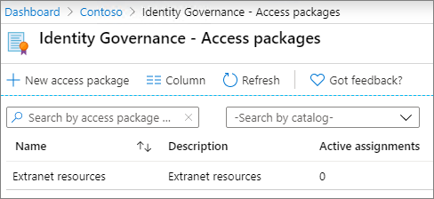

# Een B2B-extranet maken met beheerde gastenCreate a B2B extranet with managed guests

U kunt [Azure Active Directory Entitlement Management gebruiken](/azure/active-directory/governance/entitlement-management-overview) om een B2B-extranet te maken om samen te werken met een partnerorganisatie die Azure Active Directory gebruikt.You can use [Azure Active Directory Entitlement Management](/azure/active-directory/governance/entitlement-management-overview) to create a B2B extranet to collaborate with a partner organization that uses Azure Active Directory. Hierdoor kunnen gebruikers zich zelf registreren voor de extranetsite of het extranetteam en toegang krijgen via een goedkeuringswerkstroom.This allows users to self-enroll in the extranet site or team and receive access via an approval workflow.

Met deze methode voor het delen van resources voor samenwerking kan de partnerorganisatie helpen bij het onderhouden en goedkeuren van de gasten aan hun kant, waardoor de belasting voor uw IT-afdeling wordt verkleind en degenen die het meest vertrouwd zijn met de samenwerkingsovereenkomst, gebruikerstoegang kunnen beheren.With this method of sharing resources for collaboration, the partner organization can help maintain and approve the guests on their end, reducing the burden on your IT department and allowing those most familiar with the collaboration agreement to manage user access.

In dit artikel worden de stappen beschreven voor het maken van een pakket met resources (in dit geval een site of team) die u met een partnerorganisatie kunt delen via een registratiemodel voor selfservicetoegang.This article walks through the steps to create a package of resources (in this case, a site or team) that you can share with a partner organization through a self-service access registration model. 

Voordat u begint, maakt u de site of het team dat u wilt delen met de partnerorganisatie en stelt u deze in voor het delen van gasten.Before you begin, create the site or team that you want to share with the partner organization and enable it for guest sharing. Zie [Samenwerken met gasten op een site](collaborate-in-site.md) of Samenwerken met gasten in een [team](collaborate-as-team.md) voor meer informatie.See [Collaborate with guests in a site](collaborate-in-site.md) or [Collaborate with guests in a team](collaborate-as-team.md) for more information. We raden u  ook aan een beveiligde omgeving voor het delen van gasten te bekijken voor informatie over beveiligings- en compliancefuncties die u kunt gebruiken om uw beheerbeleid te behouden wanneer u samenwerkt met gasten.We also recommend that you review [Create a secure guest sharing environment](create-secure-guest-sharing-environment.md) for information about security and compliance features that you can use to help maintain your governance policies when collaborating with guests.

## LicentievereistenLicense requirements

Voor het gebruik van deze functie is een Azure AD Premium P2-licentie vereist.Using this feature requires an Azure AD Premium P2 license. 

Gespecialiseerde clouds, zoals Azure Germany en Azure China 21Vianet, zijn momenteel niet beschikbaar voor gebruik.Specialized clouds, such as Azure Germany and Azure China 21Vianet, are not currently available for use.

## VideodemonstratieVideo demonstration

In deze video worden de procedures in dit artikel beschreven.This video demonstrates the procedures covered in this article.

> [!VIDEO https://www.microsoft.com/videoplayer/embed/RE4wKUj?autoplay=false]

## De partnerorganisatie verbindenConnect the partner organization

Als u gasten van een partnerorganisatie wilt uitnodigen, moet u het domein van de partner toevoegen als verbonden organisatie in Azure Active Directory.In order to invite guests from a partner organization, you need to add the partner's domain as a connected organization in Azure Active Directory.

Een verbonden organisatie toevoegenTo add a connected organization
1. Klik [in Azure Active Directory](https://aad.portal.azure.com)op **Identiteitsbeheer.**In [Azure Active Directory](https://aad.portal.azure.com), click **Identity Governance**.
2. Klik **op Verbonden organisaties.**Click **Connected organizations**.
4. Klik **op Verbonden organisatie toevoegen.**Click **Add connected organization**.
5. Typ een naam en beschrijving voor de organisatie en klik vervolgens **op Volgende: Directory + domein.**Type a name and description for the organization, and then click **Next: Directory + domain**.
6. Klik **op Adreslijst + domein toevoegen.**Click **Add directory + domain**.
7. Typ het domein voor de organisatie die u wilt verbinden en klik vervolgens op **Toevoegen.**Type the domain for the organization that you want to connect, and then click **Add**.
8. Klik **op Verbinding** maken en klik vervolgens op **Volgende: Sponsors.**Click **Connect**, and then click **Next: Sponsors**.
9. Voeg personen toe van uw organisatie of de organisatie die u verbindt met wie u de toegang voor gasten wilt goedkeuren.Add people from your organization or the organization that you're connecting to who you want to approve access for guests.
10. Klik op **Volgendet: Controleren + Maken**.Click **Next: Review + Create**.
11. Controleer de instellingen die u hebt gekozen en klik vervolgens op **Maken.**Review the settings that you've chosen and then click **Create**.

    

## De resources kiezen die u wilt delenChoose the resources to share

De eerste stap bij het selecteren van resources die u wilt delen met een partnerorganisatie, is het maken van een catalogus om deze te bevatten.The first step in selecting resources to share with a partner organization is to create a catalog to contain them.

Een catalogus makenTo create a catalog
1. Klik [in Azure Active Directory](https://aad.portal.azure.com)op **Identiteitsbeheer.**In [Azure Active Directory](https://aad.portal.azure.com), click **Identity Governance**.
2. Klik **op Catalogi.**Click **Catalogs**.
3. Klik **op Nieuwe catalogus.**Click **New catalog**.
4. Typ een naam en beschrijving voor de catalogus en zorg ervoor dat **Ingeschakeld** en Ingeschakeld voor **externe gebruikers** beide zijn ingesteld op **Ja.**Type a name and description for the catalog and ensure that **Enabled** and **Enabled for external users** are both set to **Yes**.
5. Klik op **Maken**.Click **Create**.

   

Nadat de catalogus is gemaakt, voegt u de SharePoint-site of -team toe die u wilt delen met de partnerorganisatie.Once the catalog has been created, you add the SharePoint site or team that you want to share with the partner organization.

Resources toevoegen aan een catalogusTo add resources to a catalog
1. Klik in Azure AD Identity Governance op **Catalogi** en klik vervolgens op de catalogus waar u resources wilt toevoegen.In Azure AD Identity Governance, click **Catalogs**, and then click the catalog where you want to add resources.
2. Klik **op Resources** en klik vervolgens op Resources **toevoegen.**Click **Resources** and then click **Add resources**.
3. Selecteer de teams of SharePoint-sites die u wilt opnemen in uw extranet en klik vervolgens op **Toevoegen.**Select the teams or SharePoint sites that you want to include in your extranet, and then click **Add**.

   

Nadat u de resources hebt gedefinieerd die u wilt delen, is de volgende stap het maken van een access-pakket, waarin het type toegang wordt gedefinieerd dat partnergebruikers worden verleend en het goedkeuringsproces voor nieuwe partnergebruikers die toegang aanvragen.Once you've defined the resources that you want to share, the next step is to create an access package, which defines the type of access that partner users are granted and the approval process for new partner users requesting access.

Een toegangspakket makenTo create an access package
1. Klik in Azure AD Identity Governance op **Catalogi** en klik vervolgens op de catalogus waar u een access-pakket wilt maken.In Azure AD Identity Governance, click **Catalogs**, and then click the catalog where you want to create an access package.
2. Klik **op Access-pakketten** en klik vervolgens op **Nieuw toegangspakket.**Click **Access packages**, and then click **New access package**.
3. Typ een naam en beschrijving voor het access-pakket en klik vervolgens **op Volgende: Resourcerollen.**Type a name and description for the access package, and then click **Next: Resource roles**.
4. Kies de resources in de catalogus die u wilt gebruiken voor uw extranet.Choose the resources from the catalog that you want to use for your extranet.
5. Kies voor elke resource in **de** kolom Rol de gebruikersrol die u wilt verlenen aan de gasten die het extranet gebruiken.For each resource, in the **Role** column, choose the user role you want to grant to the guests who use the extranet.
6. Klik **op Volgende: Aanvragen.**Click **Next: Requests**.
7. Kies **onder Gebruikers die toegang kunnen aanvragen** de optie Voor gebruikers die niet in uw **adreslijst staan.**Under **Users who can request access**, choose **For users not in your directory**.
8. Controleer of de **optie Specifieke verbonden organisaties** is geselecteerd en klik vervolgens op **Directories toevoegen.**Ensure that the **Specific connected organizations** option is selected, and then click **Add directories**.
9. Kies de verbonden organisatie die u eerder hebt toevoegen en klik vervolgens op **Selecteren**Choose the connected organization that you add earlier, and then click **Select**
10. Kies **onder Goedkeuring** de optie **Ja** voor **Goedkeuring vereisen.**Under **Approval**, choose **Yes** for **Require approval**.
11. Kies **onder Eerste goedkeurder** een van de sponsors die u eerder hebt toegevoegd of kies een specifieke gebruiker.Under **First approver**, choose one of the sponsors that you added earlier or choose a specific user.
12. Klik **op Terugval toevoegen** en selecteer een fallback-goedkeurder.Click **Add fallback** and select a fallback approver.
13. Kies **onder Inschakelen** de optie **Ja.**Under **Enable**, choose **Yes**.
14. Klik **op Volgende: Levenscyclus.**Click **Next: Lifecycle**.
15. Kies de instellingen voor verloop en toegangsbeoordeling die u wilt gebruiken en klik vervolgens op **Volgende: Controleren + Maken.**Choose the expiration and access review settings that you want to use, and then click **Next: Review + Create**.
16. Controleer de instellingen en klik vervolgens op **Maken.**Review your settings, and then click **Create**.

    

Als u een partnerschap aan gaat met een grote organisatie, kunt u het toegangspakket verbergen.If you're partnering with a large organization, you may want to hide the access package. Als het pakket is verborgen, zien gebruikers in de partnerorganisatie het pakket niet in hun *My Access-portal.*If the package is hidden, then users in the partner organization will not see the package on their *My Access* portal. In plaats daarvan moeten ze een directe koppeling ontvangen om zich aan te melden voor het pakket.Instead, they must be sent a direct link to sign up for the package. Het verbergen van het toegangspakket kan het aantal ongepaste toegangsaanvragen verminderen en kan ook helpen om beschikbare toegangspakketten georganiseerd te houden in de portal van de partnerorganisatie.Hiding the access package can reduce the number of inappropriate access requests and can also help keep available access packages organized in the partner organization's portal.

Een toegangspakket instellen op verborgenTo set an access package to hidden
1. Klik in Azure AD Identity Governance op **Access-pakketten** en klik vervolgens op uw toegangspakket.In Azure AD Identity Governance, click **Access packages**, and then click your access package.
2. Klik op **de pagina** Overzicht op **Bewerken.**On the **Overview** page, click **Edit**.
3. Kies **onder Eigenschappen** de optie **Ja** voor **verborgen** en klik vervolgens op **Opslaan.**Under **Properties**, choose **Yes** for **Hidden**, and then click **Save**.

   

## Partnergebruikers uitnodigenInvite partner users

Als u het toegangspakket hebt ingesteld op verborgen, moet u een directe koppeling naar de partnerorganisatie verzenden, zodat deze toegang tot uw site of team kan aanvragen.If you set the access package to hidden, you need to send a direct link to the partner organization so that they can request access to your site or team.

De koppeling toegangsportal zoekenTo find the access portal link
1. Klik in Azure AD Identity Governance op **Access-pakketten** en klik vervolgens op uw toegangspakket.In Azure AD Identity Governance, click **Access packages**, and then click your access package.
2. Klik op **de** pagina Overzicht op **Koppeling kopiëren naar klembord** voor de koppeling **Mijn Access-portal.**On the **Overview** page, click **Copy to clipboard** link for the **My Access portal link**.

   

Nadat u de koppeling hebt gekopieerd, kunt u deze delen met uw contactpersoon bij de partnerorganisatie en deze verzenden naar de gebruikers in hun samenwerkingsteam.Once you have copied the link, you can share it with your contact at the partner organization and they can send it to the users on their collaboration team.

## Zie ookSee Also

[Een beveiligde omgeving voor het delen met gasten makenCreate a secure guest sharing environment](create-secure-guest-sharing-environment.md)