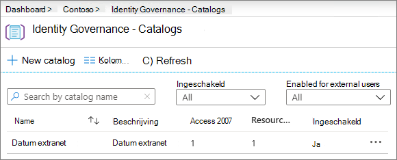

# Een B2B-extranet maken met beheerde gasten

U [Azure Active Directory Entitlement Management](https://docs.microsoft.com/azure/active-directory/governance/entitlement-management-overview) gebruiken om een B2B-extranet te maken om samen te werken met een partnerorganisatie die Azure Active Directory gebruikt. Hierdoor kunnen gebruikers zich zelf inschrijven in de extranetsite of het extrateam en toegang krijgen via een goedkeuringsworkflow.

Met deze methode voor het delen van resources voor samenwerking kan de partnerorganisatie helpen bij het onderhouden en goedkeuren van de gastgebruikers aan hun kant, waardoor de lasten voor uw IT-afdeling worden verminderd en degenen die het meest vertrouwd zijn met de samenwerkingsovereenkomst de toegang van gebruikers kunnen beheren.

In dit artikel worden de stappen doorlopen om een pakket resources te maken (in dit geval een site of team) die u met een partnerorganisatie delen via een zelfserviceregistratiemodel. 

Maak voordat u begint de site of het team dat u wilt delen met de partnerorganisatie en schakel deze in voor het delen van gasten. Zie [Samenwerken met gasten op een site](collaborate-in-site.md) of Samenwerken met gasten in een [team](collaborate-as-team.md) voor meer informatie. We raden u ook aan [een veilige omgeving voor het delen van gasten](create-secure-guest-sharing-environment.md) te maken voor informatie over beveiligings- en nalevingsfuncties die u gebruiken om uw governancebeleid te onderhouden wanneer u samenwerkt met gasten.

## De partnerorganisatie verbinden

Als u gasten uit een partnerorganisatie wilt uitnodigen, moet u het domein van de partner toevoegen als verbonden organisatie in Azure Active Directory.

Een verbonden organisatie toevoegen
1. Klik in [Azure Active Directory](https://aad.portal.azure.com)op **Identiteitsbeheer**.
2. Klik **op Verbonden organisaties**.
4. Klik **op Verbonden organisatie toevoegen**.
5. Typ een naam en beschrijving voor de organisatie en klik op **Volgende: Map + domein**.
6. Klik **op Map + domein toevoegen**.
7. Typ het domein voor de organisatie waarmee u verbinding wilt maken en klik op **Toevoegen**.
8. Klik **op Verbinden**en klik vervolgens op **Volgende: Sponsors**.
9. Voeg mensen toe uit uw organisatie of de organisatie waarmee u verbinding maakt met wie u de toegang voor gastgebruikers wilt goedkeuren.
10. Klik **op Volgende: Controleren + Maken**.
11. Controleer de instellingen die u hebt gekozen en klik op **Maken**.

    

## Kies de resources die u wilt delen

De eerste stap bij het selecteren van resources die u wilt delen met een partnerorganisatie, is het maken van een catalogus die deze bevat.

Een catalogus maken
1. Klik in [Azure Active Directory](https://aad.portal.azure.com)op **Identiteitsbeheer**.
2. Klik **op Catalogi**.
3. Klik **op Nieuwe catalogus**.
4. Typ een naam en beschrijving voor de catalogus en zorg ervoor dat **Ingeschakeld** en **ingeschakeld voor externe gebruikers** beide zijn ingesteld op **Ja**.
5. Klik op **Maken**.

   

Zodra de catalogus is gemaakt, voegt u de SharePoint-site of het Team toe dat u met de partnerorganisatie wilt delen.

Resources toevoegen aan een catalogus
1. Klik in Azure AD-identiteitsbeheer op **Catalogi**en klik vervolgens op de catalogus waar u resources wilt toevoegen.
2. Klik **op Resources** en klik vervolgens op Resources **toevoegen**.
3. Selecteer de teams of SharePoint-sites die u in uw extranet wilt opnemen en klik op **Toevoegen**.

   

Zodra u de resources hebt gedefinieerd die u wilt delen, is de volgende stap het maken van een toegangspakket, waarin het type toegang wordt gedefinieerd dat partnergebruikers krijgen en het goedkeuringsproces voor nieuwe partnergebruikers die toegang aanvragen.

Een toegangspakket maken
1. Klik in Azure AD-identiteitsbeheer op **Catalogi**en klik vervolgens op de catalogus waar u een toegangspakket wilt maken.
2. Klik **op Access-pakketten**en klik vervolgens op **Nieuw toegangspakket**.
3. Typ een naam en beschrijving voor het toegangspakket en klik op **Volgende: Resourcerollen**.
4. Kies de bronnen uit de catalogus die u wilt gebruiken voor uw extranet.
5. Kies voor elke resource in de kolom **Rol** de gebruikersrol die u wilt toekennen aan de gastgebruikers die het extranet gebruiken.
6. Klik **op Volgende: Aanvragen**.
7. Kies Onder **Gebruikers die toegang kunnen aanvragen**voor gebruikers die niet in uw map **staan.**
8. Controleer of de optie **Specifieke verbonden organisaties** is geselecteerd en klik op Mappen **toevoegen**.
9. Kies de verbonden organisatie die u eerder toevoegt en klik op **Selecteren**
10. Kies **onder Goedkeuring** **Ja** voor Goedkeuring **vereisen**.
11. Kies **onder Eerste goedkeurder**een van de sponsors die u eerder hebt toegevoegd of kies een specifieke gebruiker.
12. Klik **op Terugval toevoegen** en selecteer een terugvalgoed.
13. Kies **Onder Inschakelen**de optie **Ja**.
14. Klik **op Volgende: Levenscyclus**.
15. Kies de instellingen voor vervaldatumen en toegang tot controle die u wilt gebruiken en klik op **Volgende: Controleren + Maken**.
16. Controleer uw instellingen en klik op **Maken**.

    

Als u samenwerkt met een grote organisatie, u het toegangspakket verbergen. Als het pakket is verborgen, zien gebruikers in de partnerorganisatie het pakket niet op hun *My Access-portal.* In plaats daarvan moeten ze een directe link worden gestuurd om zich aan te melden voor het pakket. Het verbergen van het toegangspakket kan het aantal ongepaste toegangsverzoeken verminderen en kan ook helpen om beschikbare toegangspakketten georganiseerd te houden in het portaal van de partnerorganisatie.

Een toegangspakket instellen op verborgen
1. Klik in Azure AD Identity Governance op **Access-pakketten**en klik vervolgens op uw toegangspakket.
2. Klik op de pagina **Overzicht** op **Bewerken**.
3. Kies **onder Eigenschappen**de optie **Ja** voor **Verborgen**en klik op **Opslaan**.

   

## Partnergebruikers uitnodigen

Als u het toegangspakket instelt op verborgen, moet u een directe koppeling naar de partnerorganisatie sturen, zodat ze toegang tot uw site of team kunnen aanvragen.

De koppeling toegangsportal zoeken
1. Klik in Azure AD Identity Governance op **Access-pakketten**en klik vervolgens op uw toegangspakket.
2. Klik op de pagina **Overzicht** op **Koppeling naar klembordkoppeling** voor de koppeling Mijn **toegang-portal**.

   

Zodra u de koppeling hebt gekopieerd, u deze delen met uw contactpersoon bij de partnerorganisatie en deze naar de gebruikers van hun samenwerkingsteam sturen.

## Zie ook

[Een beveiligde omgeving voor het delen met gasten maken](create-secure-guest-sharing-environment.md)

