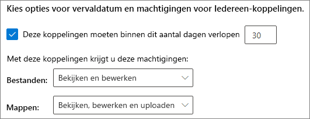
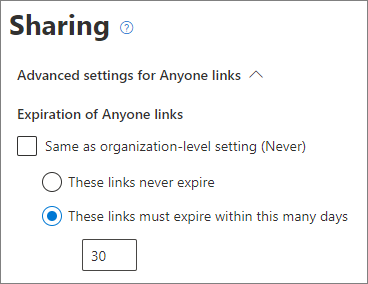
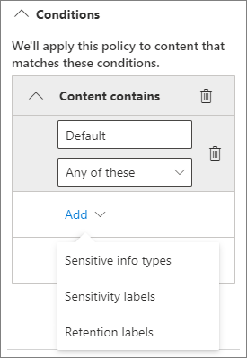

# Aanbevolen procedures voor het delen van bestanden en mappen met niet-geverifieerde gebruikers

Niet-geverifieerd delen ( *iedereen* -koppelingen) kunnen handig zijn en bruikbaar in verschillende scenario's. *Iedereen* -koppelingen zijn de gemakkelijkste manier om te delen: personen kunnen de koppeling zonder verificatie openen en deze aan anderen doorsturen.

Meestal is niet alle inhoud van een organisatie geschikt voor niet-geverifieerd delen. Dit artikel behandelt de beschikbare opties om u te helpen een omgeving te creëren waarin uw gebruikers niet-geverifieerd delen van bestanden en mappen kunnen gebruiken, maar waar er waarborgen zijn om de inhoud van uw organisatie te helpen beschermen.

> [!NOTE]
> Om niet-geverifieerd delen te laten werken, moet u dit inschakelen voor uw organisatie en voor de individuele site of het team dat u gaat gebruiken. Zie [samenwerken met personen buiten uw organisatie](collaborate-with-people-outside-your-organization.md) voor het scenario dat u wilt inschakelen.

## Een vervaldatum instellen voor koppelingen voor iedereen

Bestanden worden vaak gedurende lange perioden opgeslagen in sites, groepen en teams. Af en toe zijn er beleidsregels voor het bewaren van gegevens die vereisen dat bestanden jaren worden bewaard. Als dergelijke bestanden worden gedeeld met niet-geverifieerde personen, kan dit leiden tot onverwachte toegang en wijzigingen in bestanden in de toekomst. Om deze mogelijkheid te beperken, kunt u een vervaltijd configureren voor *iedereen* -koppelingen.

Wanneer een *iedereen* -koppeling verloopt, kan deze niet meer worden gebruikt voor toegang tot inhoud.

Een vervaldatum instellen voor iedereen-koppelingen voor de gehele organisatie

1. Open het [SharePoint-beheercentrum](https://admin.microsoft.com/sharepoint).
2. Klik in het navigatievenster aan de linkerkant op **delen**.
3. Schakel onder **Opties voor verloop en machtigingen kiezen voor 'Iedereen'-koppelingen** het selectievakje **Deze koppelingen moeten binnen zoveel dagen verlopen** in. 
   
4. Typ het aantal dagen in het vak en klik vervolgens op **opslaan**.

Een vervaldatum instellen voor iedereen-koppelingen op een specifieke site

1. Open het [SharePoint-beheercentrum](https://admin.microsoft.com/sharepoint).
2. Vouw in het navigatievenster aan de linkerkant **Sites** uit en klik vervolgens op **Actieve sites**.
3. Selecteer de site die u wilt wijzigen en klik vervolgens op **Delen**.
4. Schakel onder **Geavanceerde instellingen voor Iedereen-koppelingen** onder **Vervaldatum voor Iedereen-koppelingen** het selectievakje **Hetzelfde als instellingen op organisatieniveau** uit. 
   
5. Selecteer de optie **Deze koppelingen moeten verlopen binnen dit aantal dagen** en typ het aantal dagen in het vak.
6. Klik op **Opslaan**.

Wanneer een *Iedereen* -koppeling verloopt, kan het bestand of de map opnieuw worden gedeeld met een nieuwe *Iedereen* -koppeling.

U kunt de vervaldatum van een *Iedereen* koppeling voor een bepaalde OneDrive instellen door [Set-SPOSite](https://docs.microsoft.com/powershell/module/sharepoint-online/set-sposite) te gebruiken.

## Koppelingsmachtigingen instellen

Met *Iedereen* -koppelingen naar een bestand kunnen mensen het bestand bewerken en met *Iedereen* -koppelingen naar een map kunnen mensen bestanden bewerken en bekijken en nieuwe bestanden naar de map uploaden. U kunt deze machtigingen voor bestanden en mappen afzonderlijk wijzigen in alleen-weergeven.

Als u niet-geverifieerd delen wilt inschakelen, maar zich zorgen maakt over niet-geverifieerde personen die de inhoud van uw organisatie wijzigen, kunt u overwegen om de bestands- en mapmachtigingen in te stellen op **weergave**.

Machtigingen instellen voor iedereen-koppelingen voor de gehele organisatie

1. Open het [SharePoint-beheercentrum](https://admin.microsoft.com/sharepoint).
2. Klik in het navigatievenster aan de linkerkant op **delen**.
3. Selecteer onder **Geavanceerde instellingen voor iedereen-koppelingen** de bestands- en mapmachtigingen die u wilt gebruiken. 
   

Met *iedereen* -koppelingen die zijn ingesteld op **weergeven** , kunnen gebruikers nog steeds bestanden en mappen met gasten delen en hen machtigingen geven door koppelingen voor *specifieke personen* te gebruiken. Deze koppelingen vereisen dat mensen buiten uw organisatie zich als gasten verifiëren, en u kunt gastactiviteiten volgen en controleren voor bestanden en mappen die met deze links worden gedeeld.

## Standaardkoppelingstype instellen op alleen-werk voor personen in uw organisatie

Als *Iedereen* delen is ingeschakeld voor uw organisatie, is de standaardkoppeling voor delen normaal ingesteld op **Iedereen**. Hoewel dit handig kan zijn voor gebruikers, kan het risico op onbedoeld niet-geverifieerd delen toenemen. Als een gebruiker het type koppeling vergeet te wijzigen terwijl een beperkt document wordt gedeeld, kan het zijn dat ze per ongeluk een koppeling voor delen maken waarvoor geen verificatie is vereist.

U kunt dit risico beperken door de standaardinstelling voor koppelingen te wijzigen in een koppeling die alleen geschikt is voor personen in uw organisatie. Gebruikers die willen delen met niet-geverifieerde personen, moeten deze optie specifiek selecteren.

De standaardkoppeling voor het delen van bestanden en mappen instellen voor de organisatie
1. Open het [SharePoint-beheercentrum](https://admin.microsoft.com/sharepoint).
2. Klik in het navigatievenster aan de linkerkant op **Delen**.
3. Selecteer onder **Koppelingen voor bestanden en mappen** de optie **Alleen personen in uw organisatie**.

   

4. Klik op **Opslaan**

De standaardkoppeling voor het delen van bestanden en mappen instellen voor een specifieke site
1. Open het [SharePoint-beheercentrum](https://admin.microsoft.com/sharepoint).
2. Vouw in het navigatievenster aan de linkerkant **Sites** uit en klik vervolgens op **Actieve sites**.
3. Selecteer de site die u wilt wijzigen en klik vervolgens op **Delen**.
4. Schakel onder **Standaard koppelingstype voor delen** het selectievakje **Hetzelfde als instelling op organisatieniveau** uit.

   

5. Schakel de optie **Alleen personen in uw organisatie** in en klik op **Opslaan**.

## Niet-geverifieerd delen van gevoelige inhoud voorkomen

U kunt [Preventie van gegevensverlies (DLP)](https://docs.microsoft.com/microsoft-365/compliance/data-loss-prevention-policies) gebruiken om het niet-geverifieerd delen van gevoelige inhoud te voorkomen. Preventie van gegevensverlies kan actie ondernemen op basis van het vertrouwelijkheidslabel of retentielabel van het bestand of van de gevoelige informatie in het bestand zelf.

Een DLP-regel maken
1. Ga in het Microsoft 365-compliancecentrum naar de pagina [Preventie van gegevensverlies](https://compliance.microsoft.com/datalossprevention).
2. Klik op **Beleid maken**.
3. Kies **Aangepast** en klik op **Volgende**.
4. Typ een naam voor het beleid en klik op **Volgende**.
5. Schakel op de pagina **Locaties waarop het beleid wordt toegepast** alle instellingen uit, behalve **SharePoint-sites** en **OneDrive-accounts** en klik vervolgens op **Volgende**.
6. Klik op de pagina **Beleidsinstellingen definiëren** op **Volgende**.
7. Klik op de pagina **Geavanceerde DLP-regels aanpassen** op **Regel maken** en typ een naam voor de regel.
8. Klik onder **Voorwaarden** op **Voorwaarde toevoegen** en kies **Inhoud bevat**.
9. Klik op **Toevoegen** en kies het type informatie waarvoor u niet-geverifieerd delen wilt voorkomen.

   

10. Klik onder **Acties** op **Een actie toevoegen** en kies vervolgens **Inhoud van de Microsoft 365-locaties versleutelen of de toegang beperken**.
11. Schakel het selectievakje **Inhoud van de Microsoft 365-locaties versleutelen of de toegang beperken** in en kies vervolgens de optie **Alleen personen die toegang hebben gekregen tot de inhoud via de opties voor 'Iedereen met de koppeling '**.

      

12. Klik op **Opslaan** en klik vervolgens op **Volgende**.
13. Kies de testopties en klik op **Volgende**.
14. Klik op **Verzenden** en klik vervolgens op **Gereed**.

## Beveiligen tegen schadelijke bestanden

Wanneer u anonieme gebruikers toestaat bestanden te uploaden, loopt u een groter risico dat iemand een schadelijk bestand uploadt. In Microsoft 365 kunt u de functie *Veilige bijlagen* in Defender voor Office 365 gebruiken om geüploade bestanden automatisch te scannen en bestanden in quarantaine te plaatsen die als onveilig worden beschouwd.

Veilige bijlagen inschakelen
1. Open in het Beveiligings- en compliancecentrum de [pagina ATP Veilige bijlagen](https://protection.office.com/safeattachmentv2).
2. Klik op **Algemene instellingen**.
3. Schakel ATP voor SharePoint, OneDrive en Microsoft Teams in.

   

4. Desgewenst kunt u ook Veilige documenten inschakelen en vervolgens op **Opslaan** klikken.

Raadpleeg [ATP voor SharePoint, OneDrive en Microsoft Teams](https://docs.microsoft.com/microsoft-365/security/office-365-security/atp-for-spo-odb-and-teams) en [ATP voor SharePoint, OneDrive en Microsoft teams inschakelen](https://docs.microsoft.com/microsoft-365/security/office-365-security/turn-on-atp-for-spo-odb-and-teams) voor meer hulp.

## Copyrightgegevens toevoegen aan uw bestanden

Als u gevoeligheid-labels gebruikt in het Microsoft 365 -beheercentrum voor compliance, kunt u de labels zo configureren dat er automatisch een watermerk of kop- of voettekst wordt toegevoegd aan de Office-documenten van uw organisatie. Op deze manier kunt u ervoor zorgen dat gedeelde bestanden copyrightgegevens of andere eigendomsgegevens bevatten.

Een voettekst toevoegen aan een gelabeld bestand

1. Open het [Microsoft 365-beheercentrum](https://compliance.microsoft.com) voor compliance.
2. Klik in het navigatievenster aan de linkerkant onder **Oplossingen** op **Informatiebeveiliging**.
3. Klik op het label waaraan u een voettekst wilt toevoegen en klik vervolgens op **Label bewerken**.
4. Klik op **Volgende** om naar het tabblad **Inhoudsmarkering** te gaan en schakel vervolgens inhoudsmarkering **in**.
5. Schakel het selectievakje in voor het type tekst dat u wilt toevoegen en klik vervolgens op **tekst aanpassen**.
6. Typ de tekst die u wilt toevoegen aan uw documenten, selecteer de gewenste tekstopties en klik vervolgens op **opslaan**. 
   
7. Klik op **Volgende** om naar het einde van de wizard te gaan en klik vervolgens op **Label opslaan**.

Als inhoudsmarkering voor het label is ingeschakeld, wordt de tekst die u hebt opgegeven toegevoegd aan Office-documenten wanneer een gebruiker dat label toepast.

## Zie ook

[Overzicht van gevoeligheidslabels](https://docs.microsoft.com/Office365/SecurityCompliance/sensitivity-labels)

[Accidentele blootstelling aan bestanden beperken tijdens het delen met gasten](share-limit-accidental-exposure.md)

[Een beveiligde omgeving voor het delen met gasten maken](create-secure-guest-sharing-environment.md)
