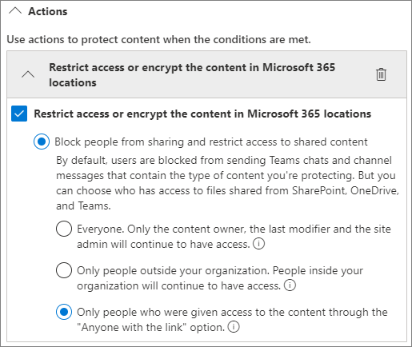

# Aanbevolen procedures voor het delen van bestanden en mappen met niet-geverifieerde gebruikersBest practices for sharing files and folders with unauthenticated users

Niet-geverifieerd delen (*iedereen*-koppelingen) kunnen handig zijn en bruikbaar in verschillende scenario's.Unauthenticated sharing (*Anyone* links) can be convenient and is useful in various scenarios. *Iedereen*-koppelingen zijn de gemakkelijkste manier om te delen: personen kunnen de koppeling zonder verificatie openen en deze aan anderen doorsturen.*Anyone* links are the easiest way to share: people can open the link without authentication and are free to pass it on to others.

Gewoonlijk is niet alle inhoud in een organisatie geschikt voor niet-geverifieerd delen. Dit artikel behandelt de beschikbare opties om u te helpen een omgeving te creëren waarin uw gebruikers niet-geverifieerd delen van bestanden en mappen kunnen gebruiken, maar waar er veiligheidsmaatregelen zijn getroffen om de inhoud van uw organisatie te helpen beschermen.Usually, not all content in an organization is appropriate for unauthenticated sharing. This article covers the options available to help you create an environment where your users can use unauthenticated sharing of files and folders, but where there are safeguards in place to help protect your organization's content.

> [!NOTE]
> Om niet-geverifieerd delen te laten werken, moet u dit inschakelen voor uw organisatie en voor de individuele site of het team dat u gaat gebruiken.For unauthenticated sharing to work, you must enable it for your organization and for the individual site or team that you'll be using. Zie [samenwerken met personen buiten uw organisatie](collaborate-with-people-outside-your-organization.md) voor het scenario dat u wilt inschakelen.See [Collaborating with people outside your organization](collaborate-with-people-outside-your-organization.md) for the scenario that you want to enable.

## Een vervaldatum instellen voor koppelingen voor iedereenSet an expiration date for Anyone links

Bestanden worden vaak gedurende lange perioden opgeslagen in sites, groepen en teams.Files are often stored in sites, groups, and teams for long periods of time. Af en toe zijn er beleidsregels voor het bewaren van gegevens die vereisen dat bestanden jaren worden bewaard.Occasionally there are data retention policies that require files to be retained for years. Als dergelijke bestanden worden gedeeld met niet-geverifieerde personen, kan dit leiden tot onverwachte toegang en wijzigingen in bestanden in de toekomst.If such files are shared with unauthenticated people, this could lead to unexpected access and changes to files in the future. Om deze mogelijkheid te beperken, kunt u een vervaltijd configureren voor *iedereen*-koppelingen.To mitigate this possibility, you can configure an expiration time for *Anyone* links.

Wanneer een *iedereen*-koppeling verloopt, kan deze niet meer worden gebruikt voor toegang tot inhoud.Once an *Anyone* link expires, it can no longer be used to access content.

Een vervaldatum instellen voor iedereen-koppelingen voor de gehele organisatieTo set an expiration date for Anyone links across the organization

1. Open het [SharePoint-beheercentrum](https://admin.microsoft.com/sharepoint).Open the [SharePoint admin center](https://admin.microsoft.com/sharepoint).
2. Klik in het navigatievenster aan de linkerkant op **delen**.In the left navigation, click **Sharing**.
3. Schakel onder **Opties voor verloop en machtigingen kiezen voor 'Iedereen'-koppelingen** het selectievakje **Deze koppelingen moeten binnen zoveel dagen verlopen** in.Under **Choose expiration and permissions options for Anyone links**, select the **These links must expire within this many days** check box. 
   
4. Typ het aantal dagen in het vak en klik vervolgens op **opslaan**.Type a number of days in the box, and then click **Save**.

Een vervaldatum instellen voor iedereen-koppelingen op een specifieke siteTo set an expiration date for Anyone links on a specific site

1. Open het [SharePoint-beheercentrum](https://admin.microsoft.com/sharepoint).Open the [SharePoint admin center](https://admin.microsoft.com/sharepoint).
2. Vouw in het navigatievenster aan de linkerkant **Sites** uit en klik vervolgens op **Actieve sites**.In the left navigation, expand **Sites**, and then click **Active sites**.
3. Selecteer de site die u wilt wijzigen en klik vervolgens op **Delen**.Select the site you want to change, and then click **Sharing**.
4. Schakel onder **Geavanceerde instellingen voor Iedereen-koppelingen** onder **Vervaldatum voor Iedereen-koppelingen** het selectievakje **Hetzelfde als instellingen op organisatieniveau** uit.Under **Advanced settings for Anyone links**, under **Expiration of Anyone links**, clear the **Same as organization-level setting** check box. 
   
5. Selecteer de optie **Deze koppelingen moeten verlopen binnen dit aantal dagen** en typ het aantal dagen in het vak.Select the **These links must expire within this many days** option, and type a number of days in the box.
6. Klik op **Opslaan**.Click **Save**.

Wanneer een *Iedereen*-koppeling verloopt, kan het bestand of de map opnieuw worden gedeeld met een nieuwe *Iedereen*-koppeling.Note that once an *Anyone* link expires, the file or folder can be re-shared with a new *Anyone* link.

U kunt de vervaldatum van een *Iedereen* koppeling voor een bepaalde OneDrive instellen door [Set-SPOSite](/powershell/module/sharepoint-online/set-sposite) te gebruiken.You can set *Anyone* link expiration for a specific OneDrive by using [Set-SPOSite](/powershell/module/sharepoint-online/set-sposite).

## Koppelingsmachtigingen instellenSet link permissions

Met *Iedereen*-koppelingen naar een bestand kunnen mensen het bestand bewerken en met *Iedereen*-koppelingen naar een map kunnen mensen bestanden bewerken en bekijken en nieuwe bestanden naar de map uploaden.By default, *Anyone* links for a file allow people to edit the file, and *Anyone* links for a folder allow people to edit and view files, and upload new files to the folder. U kunt deze machtigingen voor bestanden en mappen afzonderlijk wijzigen in alleen-weergeven.You can change these permissions for files and for folders independently to view-only.

Als u niet-geverifieerd delen wilt inschakelen, maar zich zorgen maakt over niet-geverifieerde personen die de inhoud van uw organisatie wijzigen, kunt u overwegen om de bestands- en mapmachtigingen in te stellen op **weergave**.If you want to allow unauthenticated sharing, but are concerned about unauthenticated people modifying your organization's content, consider setting the file and folder permissions to **View**.

Machtigingen instellen voor iedereen-koppelingen voor de gehele organisatieTo set permissions for Anyone links across the organization

1. Open het [SharePoint-beheercentrum](https://admin.microsoft.com/sharepoint).Open the [SharePoint admin center](https://admin.microsoft.com/sharepoint).
2. Klik in het navigatievenster aan de linkerkant op **delen**.In the left navigation, click **Sharing**.
3. Selecteer onder **Geavanceerde instellingen voor iedereen-koppelingen** de bestands- en mapmachtigingen die u wilt gebruiken.Under **Advanced settings for "Anyone" links**, select the file and folder permissions that you want to use. 
   

Met *iedereen*-koppelingen die zijn ingesteld op **weergeven**, kunnen gebruikers nog steeds bestanden en mappen met gasten delen en hen machtigingen geven door koppelingen voor *specifieke personen* te gebruiken.With *Anyone* links set to **View**, users can still share files and folders with guests and give them edit permissions by using *Specific people* links. Deze koppelingen vereisen dat mensen buiten uw organisatie zich als gasten verifiëren, en u kunt gastactiviteiten volgen en controleren voor bestanden en mappen die met deze links worden gedeeld.These links require people outside your organization to authenticate as guests, and you can track and audit guest activity on files and folders shared with these links.

## Standaardkoppelingstype instellen op alleen-werk voor personen in uw organisatieSet default link type to only work for people in your organization

Als *Iedereen* delen is ingeschakeld voor uw organisatie, is de standaardkoppeling voor delen normaal ingesteld op **Iedereen**.When *Anyone* sharing is enabled for your organization, the default sharing link is normally set to **Anyone**. Hoewel dit handig kan zijn voor gebruikers, kan het risico op onbedoeld niet-geverifieerd delen toenemen.While this can be convenient for users, it can increase the risk of unintentional unauthenticated sharing. Als een gebruiker het type koppeling vergeet te wijzigen terwijl een beperkt document wordt gedeeld, kan het zijn dat ze per ongeluk een koppeling voor delen maken waarvoor geen verificatie is vereist.If a user forgets to change the link type while sharing a sensitive document, they might accidentally create a sharing link that doesn't require authentication.

U kunt dit risico beperken door de standaardinstelling voor koppelingen te wijzigen in een koppeling die alleen geschikt is voor personen in uw organisatie.You can mitigate this risk by changing the default link setting to a link that only works for people inside your organization. Gebruikers die willen delen met niet-geverifieerde personen, moeten deze optie specifiek selecteren.Users who want to share with unauthenticated people would then have to specifically select that option.

De standaardkoppeling voor het delen van bestanden en mappen instellen voor de organisatieTo set the default file and folder sharing link for the organization
1. Open het [SharePoint-beheercentrum](https://admin.microsoft.com/sharepoint).Open the [SharePoint admin center](https://admin.microsoft.com/sharepoint).
2. Klik in het navigatievenster aan de linkerkant op **Delen**.In the left navigation, click **Sharing**.
3. Selecteer onder **Koppelingen voor bestanden en mappen** de optie **Alleen personen in uw organisatie**.Under **File and folder links**, select **Only people in your organization**.

   

4. Klik op **Opslaan**Click **Save**

De standaardkoppeling voor het delen van bestanden en mappen instellen voor een specifieke siteTo set the default file and folder sharing link for a specific site
1. Open het [SharePoint-beheercentrum](https://admin.microsoft.com/sharepoint).Open the [SharePoint admin center](https://admin.microsoft.com/sharepoint).
2. Vouw in het navigatievenster aan de linkerkant **Sites** uit en klik vervolgens op **Actieve sites**.In the left navigation, expand **Sites**, and then click **Active sites**.
3. Selecteer de site die u wilt wijzigen en klik vervolgens op **Delen**.Select the site you want to change, and then click **Sharing**.
4. Schakel onder **Standaard koppelingstype voor delen** het selectievakje **Hetzelfde als instelling op organisatieniveau** uit.Under **Default sharing link type**,  clear the **Same as organization-level setting** check box.

   

5. Schakel de optie **Alleen personen in uw organisatie** in en klik op **Opslaan**.Select the **Only people in your organization** option and click **Save**.

## Niet-geverifieerd delen van gevoelige inhoud voorkomenPrevent unauthenticated sharing of sensitive content

U kunt [Preventie van gegevensverlies (DLP)](../compliance/dlp-learn-about-dlp.md) gebruiken om het niet-geverifieerd delen van gevoelige inhoud te voorkomen.You can use [data loss prevention (DLP)](../compliance/dlp-learn-about-dlp.md) to prevent unauthenticated sharing of sensitive content. Preventie van gegevensverlies kan actie ondernemen op basis van het vertrouwelijkheidslabel of retentielabel van het bestand of van de gevoelige informatie in het bestand zelf.Data loss prevention can take action based on a file's sensitivity label, retention label, or sensitive information in the file itself.

Een DLP-regel makenTo create a DLP rule
1. Ga in het Microsoft 365-compliancecentrum naar de pagina [Preventie van gegevensverlies](https://compliance.microsoft.com/datalossprevention).In the Microsoft 365 compliance admin center, go to the [Data loss prevention page](https://compliance.microsoft.com/datalossprevention).
2. Klik op **Beleid maken**.Click **Create policy**.
3. Kies **Aangepast** en klik op **Volgende**.Choose **Custom** and click **Next**.
4. Typ een naam voor het beleid en klik op **Volgende**.Type a name for the policy and click **Next**.
5. Schakel op de pagina **Locaties waarop het beleid wordt toegepast** alle instellingen uit, behalve **SharePoint-sites** en **OneDrive-accounts** en klik vervolgens op **Volgende**.On the **Locations to apply the policy** page turn off all settings except **SharePoint sites** and **OneDrive accounts**, and then click **Next**.
6. Klik op de pagina **Beleidsinstellingen definiëren** op **Volgende**.On the **Define policy settings** page, click **Next**.
7. Klik op de pagina **Geavanceerde DLP-regels aanpassen** op **Regel maken** en typ een naam voor de regel.On the **Customize advanced DLP rules** page, click **Create rule** and type a name for the rule.
8. Klik onder **Voorwaarden** op **Voorwaarde toevoegen** en kies **Inhoud bevat**.Under **Conditions**, click **Add condition**, and choose **Content contains**.
9. Klik op **Toevoegen** en kies het type informatie waarvoor u niet-geverifieerd delen wilt voorkomen.Click **Add** and choose the type of information for which you want to prevent unauthenticated sharing.

   

10. Klik onder **Acties** op **Een actie toevoegen** en kies vervolgens **Inhoud van de Microsoft 365-locaties versleutelen of de toegang beperken**.Under **Actions** click **Add an action** and choose **Restrict access or encrypt the content in Microsoft 365 locations**.
11. Schakel het selectievakje **Inhoud van de Microsoft 365-locaties versleutelen of de toegang beperken** in en kies vervolgens de optie **Alleen personen die toegang hebben gekregen tot de inhoud via de opties voor 'Iedereen met de koppeling '**.Select the **Restrict access or encrypt the content in Microsoft 365 locations** check box and then choose the **Only people who were given access to the content through the "Anyone withe the link" options** option.

      

12. Klik op **Opslaan** en klik vervolgens op **Volgende**.Click **Save** and then click **Next**.
13. Kies de testopties en klik op **Volgende**.Choose your test options and click **Next**.
14. Klik op **Verzenden** en klik vervolgens op **Gereed**.Click **Submit**, and then click **Done**.

## Beveiligen tegen schadelijke bestandenProtect against malicious files

Wanneer u anonieme gebruikers toestaat bestanden te uploaden, loopt u een groter risico dat iemand een schadelijk bestand uploadt.When you allow anonymous users to upload files, you're at an increased risk of someone uploading a malicious file. In Microsoft 365 kunt u de functie *Veilige bijlagen* in Defender voor Office 365 gebruiken om geüploade bestanden automatisch te scannen en bestanden in quarantaine te plaatsen die als onveilig worden beschouwd.In Microsoft 365, you can use the *Safe Attachments* feature in Defender for Office 365 to automatically scan uploaded files and quarantine files that are found to be unsafe.

Veilige bijlagen inschakelenTo turn on safe attachments
1. Open in het Beveiligings- en compliancecentrum de [pagina ATP Veilige bijlagen](https://protection.office.com/safeattachmentv2).Open the [ATP Safe Attachments page](https://protection.office.com/safeattachmentv2) in the Security and Compliance admin center.
2. Klik op **Algemene instellingen**.Click **Global settings**.
3. Schakel ATP voor SharePoint, OneDrive en Microsoft Teams in.Turn on ATP for SharePoint, OneDrive, and Microsoft Teams.

   

4. Desgewenst kunt u ook Veilige documenten inschakelen en vervolgens op **Opslaan** klikken.Optionally turn on Safe Documents as well, and then click **Save**

Raadpleeg [ATP voor SharePoint, OneDrive en Microsoft Teams](../security/office-365-security/mdo-for-spo-odb-and-teams.md) en [ATP voor SharePoint, OneDrive en Microsoft teams inschakelen](../security/office-365-security/turn-on-mdo-for-spo-odb-and-teams.md) voor meer hulp.See [ATP for SharePoint, OneDrive, and Microsoft Teams](../security/office-365-security/mdo-for-spo-odb-and-teams.md) and [Turn on ATP for SharePoint, OneDrive, and Microsoft Teams](../security/office-365-security/turn-on-mdo-for-spo-odb-and-teams.md) for additional guidance.

## Copyrightgegevens toevoegen aan uw bestandenAdd copyright information to your files

Als u gevoeligheid-labels gebruikt in het Microsoft 365 -beheercentrum voor compliance, kunt u de labels zo configureren dat er automatisch een watermerk of kop- of voettekst wordt toegevoegd aan de Office-documenten van uw organisatie.If you use sensitivity labels in the Microsoft 365 Compliance admin center, you can configure your labels to add a watermark or a header or footer automatically to your organization's Office documents. Op deze manier kunt u ervoor zorgen dat gedeelde bestanden copyrightgegevens of andere eigendomsgegevens bevatten.In this way, you can make sure that shared files contain copyright or other ownership information.

Een voettekst toevoegen aan een gelabeld bestandTo add a footer to a labeled file

1. Open het [Microsoft 365-beheercentrum](https://compliance.microsoft.com) voor compliance.Open the [Microsoft 365 compliance admin center](https://compliance.microsoft.com).
2. Klik in het navigatievenster aan de linkerkant onder **Oplossingen** op **Informatiebeveiliging**.In the left navigation, under **Solutions**, click **Information protection**.
3. Klik op het label waaraan u een voettekst wilt toevoegen en klik vervolgens op **Label bewerken**.Click the label that you want to have add a footer, and then click **Edit label**.
4. Klik op **Volgende** om naar het tabblad **Inhoudsmarkering** te gaan en schakel vervolgens inhoudsmarkering **in**.Click **Next** to reach the **Content marking** tab, and then turn **On** content marking.
5. Schakel het selectievakje in voor het type tekst dat u wilt toevoegen en klik vervolgens op **tekst aanpassen**.Select the check box for the type of text you want to add, and then click **Customize text**.
6. Typ de tekst die u wilt toevoegen aan uw documenten, selecteer de gewenste tekstopties en klik vervolgens op **opslaan**.Type the text that you want added to your documents, select the text options that you want, and then click **Save**. 
   
7. Klik op **Volgende** om naar het einde van de wizard te gaan en klik vervolgens op **Label opslaan**.Click **Next** to reach the end of the wizard, and then click **Save label**.

Als inhoudsmarkering voor het label is ingeschakeld, wordt de tekst die u hebt opgegeven toegevoegd aan Office-documenten wanneer een gebruiker dat label toepast.With content marking enabled for the label, the text you specified will be added to Office documents when a user applies that label.

## Zie ookSee Also

[Overzicht van gevoeligheidslabelsOverview of sensitivity labels](/Office365/SecurityCompliance/sensitivity-labels)

[Accidentele blootstelling aan bestanden beperken tijdens het delen met gastenLimit accidental exposure to files when sharing with guests](share-limit-accidental-exposure.md)

[Een beveiligde omgeving voor het delen met gasten makenCreate a secure guest sharing environment](create-secure-guest-sharing-environment.md)