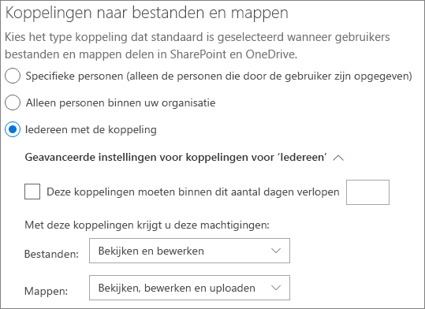

# Met gasten samenwerken in een teamCollaborate with guests in a team

Als u met gasten in documenten, taken en gesprekken moet samenwerken, is het raadzaam Microsoft teams te gebruiken.If you need to collaborate with guests across documents, tasks, and conversations, we recommend using Microsoft Teams. Teams biedt alle samenwerkingsfuncties die beschikbaar zijn in Office en SharePoint met permanente chat en een aanpasbare en uitbreidbare set samenwerkingsprogramma's in een geïntegreerde gebruikerservaring.Teams provides all of the collaboration features available in Office and SharePoint with persistent chat and a customizable and extensible set of collaboration tools in a unified user experience.

In dit artikel worden 365 de stappen beschreven die u moet uitvoeren om een team voor samenwerking met gasten in te stellen.In this article, we'll walk through the Microsoft 365 configuration steps necessary to set up a team for collaboration with guests.

## VideodemonstratieVideo demonstration

In deze video ziet u de configuratiestappen die in dit document worden beschreven.This video shows the configuration steps described in this document. 

> [!VIDEO https://www.microsoft.com/videoplayer/embed/RE44NTr?autoplay=false]

## Instellingen voor externe samenwerking van AzureAzure External collaboration settings

Delen in Microsoft 365 wordt bepaald door de [instellingen voor B2B External collaboration in azure Active Directory](https://docs.microsoft.com/azure/active-directory/external-identities/delegate-invitations).Sharing in Microsoft 365 is governed at its highest level by the [B2B external collaboration settings in Azure Active Directory](https://docs.microsoft.com/azure/active-directory/external-identities/delegate-invitations). Als gasten delen is uitgeschakeld of niet beschikbaar is in azure AD, worden de instellingen voordelen overschreven die u configureert in Microsoft 365.If guest sharing is disabled or restricted in Azure AD, this setting overrides any sharing settings that you configure in Microsoft 365.

Controleer de instellingen van de externe samenwerkings instellingen om te controleren of delen met gasten niet is geblokkeerd.Check the B2B external collaboration settings settings to ensure that sharing with guests is not blocked.

Externe samenwerkings instellingen instellenTo set external collaboration settings

1. Meld u aan bij Azure Active Directory [https://aad.portal.azure.com](https://aad.portal.azure.com) .Log in to Azure Active Directory at [https://aad.portal.azure.com](https://aad.portal.azure.com).
2. Klik in het linker navigatiedeelvenster op **Azure Active Directory**.In the left navigation pane, click **Azure Active Directory**.
3. Klik op **externe identiteiten**.Click **External identities**.
4. Klik in het scherm aan de **slag** in het linker navigatiedeelvenster op **instellingen voor externe samenwerking**.On the **Get started** screen, in the left navigation pane, click **External collaboration settings**.
5. Zorg ervoor dat **beheerders en gebruikers in de rol gast uitnodiging kunnen uitnodigen** en dat **leden kunnen uitnodigen** zijn ingesteld op **Ja**.Ensure that **Admins and users in the guest inviter role can invite** and **Members can invite** are both set to **Yes**.
6. Als u wijzigingen hebt aangebracht, klikt u op **Opslaan**.If you made changes, click **Save**.

Let op de instellingen in de sectie **samenwerkings beperkingen** .Note the settings in the **Collaboration restrictions** section. Zorg ervoor dat de domeinen van de gasten waarmee u wilt samenwerken, niet zijn geblokkeerd.Make sure that the domains of the guests that you want to collaborate with aren't blocked.

Als u met gasten in meerdere organisaties werkt, is het raadzaam om de toegang van Directory-gegevens te beperken.If you work with guests from multiple organizations, you may want to restrict their ability to access directory data. Hiermee kunt u voorkomen dat ze zien welke iemand anders een gast is in de adreslijst.This will prevent them from seeing who else is a guest in the directory. Als u dit wilt doen, selecteert u onder **toegangsbeperkingen** voor gastgebruikers de optie **gastgebruikers beperkte toegang tot eigenschappen en lidmaatschap van adreslijst objecten** of **toegang voor gastgebruikers is beperkt tot eigenschappen en lidmaatschap van eigen directoryobjecten**.To do this, under **Guest user access restrictions**, select **Guest users have limited access to properties and membership of directory objects settings** or **Guest user access is restricted to properties and memberships of their own directory objects**.

## Instellingen voor gasttoegang voor teamsTeams guest access settings

Teams heeft een schakeloptie voor het in-en uitschakelen van een gast verbinding en een verscheidenheid aan instellingen die beschikbaar zijn om te bepalen wat gasten in een team kunnen doen.Teams has a master on/off switch for guest access and a variety of settings available to control what guests can do in a team. De schakeloptie voor het inschakelen van **gasttoegang in teams** moet zijn **ingeschakeld** voor gasttoegang om in teams te kunnen werken.The master switch, **Allow guest access in Teams** must be **On** for guest access to work in Teams.

Zorg ervoor dat gasttoegang is ingeschakeld in teams en breng de gewenste wijzigingen aan in de gastinstellingen op basis van de behoeften van uw bedrijf.Check to ensure that guest access is enabled in Teams and make any adjustment to the guest settings based on your business needs. Houd er rekening mee dat deze instellingen van invloed zijn op alle teams.Keep in mind that these settings affect all teams.

Instellingen voor gasttoegang in Teams instellenTo set Teams guest access settings

1. Meld u aan bij het Microsoft 365-beheercentrum op [https://admin.microsoft.com](https://admin.microsoft.com).Log in to the Microsoft 365 admin center at [https://admin.microsoft.com](https://admin.microsoft.com).
2. Klik in het linker navigatiedeelvenster op **AllesWeergeven**.In the left navigation pane, click **Show all**.
3. Klik onder **Beheercentra** op **Teams**.Under **Admin centers**, click **Teams**.
4. Vouw in het team centrum voor teams in het linker navigatiedeelvenster **instellingen voor de gehele organisatie** uit en klik op **gasttoegang**.In the Teams admin center, in the left navigation pane, expand **Org-wide settings** and click **Guest access**.
5. Zorg ervoor dat **Gasttoegang in Teams toestaan** is ingesteld op **Aan**.Ensure that **Allow guest access in Teams** is set to **On**.
6. Breng de gewenste wijzigingen aan in de extra gastinstellingen en klik vervolgens op **Opslaan**.Make any desired changes to the additional guest settings, and then click **Save**.

Wanneer teams gasttoegang is ingeschakeld, kunt u optioneel gasttoegang tot afzonderlijke teams en de bijbehorende SharePoint-sites met behulp van behulp van vertrouwelijkheids labels beheren.Once Teams guest access is turned on, you can optionally control guest access to individual teams and their associated SharePoint sites using sensitivity labels. Zie [Gevoeligheidslabels gebruiken om inhoud te beveiligen in Microsoft Teams, Microsoft 365-groepen en SharePoint-sites](https://docs.microsoft.com/microsoft-365/compliance/sensitivity-labels-teams-groups-sites) voor meer informatie.For more information, see [Use sensitivity labels to protect content in Microsoft Teams, Microsoft 365 groups, and SharePoint sites](https://docs.microsoft.com/microsoft-365/compliance/sensitivity-labels-teams-groups-sites).

> [!NOTE]
> Het kan tot 24 uur duren voordat de instellingen van de team gast actief raken nadat u deze hebt ingeschakeld.It may take up to twenty-four hours for the Teams guest settings to become active after you turn it on.

## Gastinstellingen voor Microsoft 365-groepenMicrosoft 365 Groups guest settings

Teams gebruikt Microsoft 365-groepen voor lidmaatschap van een team.Teams uses Microsoft 365 Groups for team membership. De instellingen voor gasttoegang in Microsoft 365 groepen moeten zijn ingeschakeld, zodat gasttoegang in teams kan werken.The Microsoft 365 Groups guest settings must be turned on in order for guest access in Teams to work.

De gastinstellingen van Microsoft 365 groepen instellenTo set Microsoft 365 Groups guest settings

1. In het Microsoft 365-Beheercentrum, in het linker navigatiedeelvenster, vouwt u **instellingen** uit.In the Microsoft 365 admin center, in the left navigation pane, expand **Settings**.
2. Klik op **instellingen voor organisatie**.Click **Org settings**.
3. Klik in de lijst op **Microsoft 365 groepen**.In the list, click **Microsoft 365 Groups**.
4. Zorg ervoor dat de selectievakjes **eigenaren van gebruikers buiten uw organisatie toevoegen aan Microsoft 365-groepen als gasten** en de selectievakjes voor **groepsleden toegang krijgen tot groepsinhoud** beide zijn ingeschakeld.Ensure that the **Let group owners add people outside your organization to Microsoft 365 Groups as guests** and **Let guest group members access group content** check boxes are both checked.
5. Als u wijzigingen hebt aangebracht, klikt u op **wijzigingen opslaan**.If you made changes, click **Save changes**.

## Instellingen voordelen van SharePoint-organisatieniveauSharePoint organization level sharing settings

Inhoud van teams, zoals bestanden, mappen en lijsten, worden allemaal opgeslagen in SharePoint.Teams content such as files, folders, and lists are all stored in SharePoint. Als u wilt dat gasten toegang hebben tot deze items in teams, moet u de instellingen voordelen van SharePoint op organisatieniveau toestaan voordelen met gasten.In order for guests to have access to these items in Teams, the SharePoint organization-level sharing settings must allow for sharing with guests.

De instellingen op organisatieniveau bepalen welke instellingen beschikbaar zijn voor afzonderlijke sites, waaronder sites die zijn gekoppeld aan teams.The organization-level settings determine what settings are available for individual sites, including sites associated with teams. Site-instellingen kunnen niet hoger zijn dan de instellingen op organisatieniveau.Site settings cannot be more permissive than the organization-level settings.

Als u het delen van bestanden en mappen met niet-geverifieerde personen wilt toestaan, kiest u **iedereen**.If you want to allow file and folder sharing with unauthenticated people, choose **Anyone**. Als u ervoor wilt zorgen dat alle gasten verificatie verifiëren, kiest u **nieuwe en bestaande gasten**.If you want to ensure that all guests have to authenticate, choose **New and existing guests**. Kies de meest strikte instelling die moet worden gebruikt door alle sites in uw organisatie.Choose the most permissive setting that will be needed by any site in your organization.

Instellingen voordelen van SharePoint op organisatieniveau instellenTo set SharePoint organization-level sharing settings

1. Klik in het Microsoft 365-Beheercentrum, in het linker navigatiedeelvenster, onder **beheer centra** op **SharePoint**.In the Microsoft 365 admin center, in the left navigation pane, under **Admin centers**, click **SharePoint**.
2. Vouw in het SharePoint-Beheercentrum in het linker navigatievenster **beleidsregels** uit en klik vervolgens op **delen**.In the SharePoint admin center, in the left navigation pane, expand **Policies** and then click **Sharing**.
3. Zorg ervoor dat extern delen voor SharePoint is ingesteld op **iedereen** of **nieuwe en bestaande gasten**.Ensure that external sharing for SharePoint is set to **Anyone** or **New and existing guests**.
4. Als u wijzigingen hebt aangebracht, klikt u op **Opslaan**.If you made changes, click **Save**.

## Standaard koppelingsinstellingen op SharePoint-organisatieniveauSharePoint organization-level default link settings

De standaardinstellingen voor het koppelen van bestanden en mappen bepalen de koppelingsoptie die standaard wordt getoond aan gebruikers wanneer ze een bestand of map delen.The default file and folder link settings determine the link option that will be shown to users by default when they share a file or folder. Gebruikers kunnen het koppelingstype wijzigen in een van de andere opties voordat u het deelt.Users can change the link type to one of the other options before sharing, if desired.

Houd er rekening mee dat deze instelling van invloed is op alle teams en SharePoint-sites in uw organisatie.Keep in mind that this setting affects all teams and SharePoint sites in your organization.

Kies een van de volgende koppelingstypen die standaard worden geselecteerd wanneer gebruikers bestanden en mappen delen:Choose any one of the following link-types which will be selected by default when users share files and folders:

- **Iedereen met de koppeling** : Kies deze optie als u verwacht dat u niet-geverifieerde bestanden en mappen wilt delen.**Anyone with the link** - Choose this option if you expect to do a lot of unauthenticated sharing of files and folders. Als u iedereen wilt toestaan die wel of niet is gemachtigd voor het delen van *onbevoegd* delen, kunt u het beste een van de andere opties als standaard instellen.If you want to allow *Anyone* links but are concerned about accidental unauthenticated sharing, consider one of the other options as the default. Dit koppelingstype is alleen beschikbaar als **iedereen** het delen heeft toegestaan.This link type is only available if you've enabled **Anyone** sharing.
- **Alleen personen in uw organisatie** : Kies deze optie als u verwacht dat u de meeste bestanden en mappen wilt delen met personen binnen uw organisatie.**Only people in your organization** - Choose this option if you expect most file and folder sharing to be with people inside your organization.
- **Specifieke personen** : Houd deze optie ingedrukt als u verwacht dat u een groot aantal bestanden en mappen deelt met gasten.**Specific people** - Consider this option if you expect to do a lot of file and folder sharing with guests. Dit type koppeling werkt met gasten en vereist ze voor verificatie.This type of link works with guests and requires them to authenticate.
 

De standaardinstellingen voor de koppeling naar het SharePoint-organisatieniveau instellenTo set the SharePoint organization-level default link settings

1. Ga naar de pagina delen in het SharePoint-Beheercentrum.Navigate to the Sharing page in the SharePoint admin center.
2. Selecteer onder **koppelingen voor bestanden en mappen** de standaardkoppeling voordelen die u wilt gebruiken.Under **File and folder links**, select the default sharing link that you want to use.
3. Als u wijzigingen hebt aangebracht, klikt u op **Opslaan**.If you made changes, click **Save**.

## Een team makenCreate a team

De volgende stap is het maken van het team dat u wilt gebruiken om samen te werken met gasten.The next step is to create the team that you plan to use for collaborating with guests.

Een team makenTo create a team
1. Klik in teams op het tabblad **teams** op **lid worden van een team of een team maken** onderaan in het linkerdeelvenster.In Teams, on the **Teams** tab, click **Join or create a team** at the bottom of the left pane.
2. Klik op **een team maken**.Click **Create a team**.
3. Klik op **zelf een team samenstellen**.Click **Build a team from scratch**.
4. Kies **privé** of **openbaar**.Choose **Private** or **Public**.
5. Typ een naam en beschrijving voor het team en klik vervolgens op **maken**.Type a name and description for the team, and then click **Create**.
6. Klik op **overslaan**.Click **Skip**.

We nodigen later gebruikers uit.We'll invite users later. Vervolgens moet u de instellingen voordelen op siteniveau controleren voor de SharePoint-site die is gekoppeld aan het team.Next, it's important to check the site-level sharing settings for the SharePoint site that is associated with the team.

## Instellingen voordelen op SharePoint-siteniveauSharePoint site-level sharing settings

Controleer de instellingen voordelen op siteniveau om ervoor te zorgen dat u het gewenste type toegang toestaat voor dit team.Check the site-level sharing settings to make sure that they allow the type of access that you want for this team. Als u bijvoorbeeld de instellingen op organisatieniveau instelt op **iedereen**, maar u wilt dat alle gasten verificatie voor dit team hebben, controleert u of de instellingen voordelen op het siteniveau zijn ingesteld op **nieuwe en bestaande gasten**.For example, if you set the organization-level settings to **Anyone**, but you want all guests to authenticate for this team, then make sure the site-level sharing settings are set to **New and existing guests**.

Instellingen voordelen op siteniveau instellenTo set site-level sharing settings
1. Vouw in het SharePoint-Beheercentrum in het linker navigatievenster **sites** uit en klik op **actieve sites**.In the SharePoint admin center, in the left navigation pane, expand **Sites** and click **Active sites**.
2. Selecteer de site voor het team dat u zojuist hebt gemaakt.Select the site for the team that you just created.
3. Klik op... en kies **delen**.Click ... and choose **Sharing**.
4. Zorg ervoor dat delen is ingesteld op **iedereen** of **nieuwe en bestaande gasten**.Ensure that sharing is set to **Anyone** or **New and existing guests**.
5. Als u wijzigingen hebt aangebracht, klikt u op **Opslaan**.If you made changes, click **Save**.

## Gebruikers uitnodigenInvite users

Instellingen voor het delen van gasten zijn nu geconfigureerd, zodat u interne gebruikers en gasten aan uw team kunt toevoegen.Guest sharing settings are now configured, so you can start adding internal users and guests to your team. 

Interne gebruikers uitnodigen voor een teamTo invite internal users to a team
1. Klik in het team op **meer opties** ( **\*\*\*** ) en klik vervolgens op **lid toevoegen**.In the team, click **More options** (**\*\*\***), and then click **Add member**.
2. Typ de naam van de persoon die u wilt uitnodigen.Type the name of the person who you want to invite.
3. Klik op **toevoegen** en klik vervolgens op **sluiten**.Click **Add**, and then click **Close**.

Gasten uitnodigen voor een teamTo invite guests to a team
1. Klik in het team op **meer opties** ( **\*\*\*** ) en klik vervolgens op **lid toevoegen**.In the team, click **More options** (**\*\*\***), and then click **Add member**.
2. Voer het e-mailadres in van de gast die u wilt uitnodigen.Type the email address of the guest whom you want to invite.
3. Klik op **gast gegevens bewerken**.Click **Edit guest information**.
4. Typ de volledige naam van de gast en klik op het vinkje.Type the guest's full name and click the check mark.
5. Klik op **toevoegen** en klik vervolgens op **sluiten**.Click **Add**, and then click **Close**.

## Zie ookSee also

[Aanbevolen procedures voor het delen van bestanden en mappen met niet-geverifieerde gebruikersBest practices for sharing files and folders with unauthenticated users](best-practices-anonymous-sharing.md)

[Accidentele blootstelling aan bestanden beperken tijdens het delen met gastenLimit accidental exposure to files when sharing with guests](share-limit-accidental-exposure.md)

[Een beveiligde omgeving voor het delen met gasten makenCreate a secure guest sharing environment](create-secure-guest-sharing-environment.md)

[Een B2B-extranet maken met beheerde gastenCreate a B2B extranet with managed guests](b2b-extranet.md)

[Integratie van SharePoint en OneDrive met Azure AD B2BSharePoint and OneDrive integration with Azure AD B2B](https://docs.microsoft.com/sharepoint/sharepoint-azureb2b-integration-preview)

[Opties voordelen zijn niet beschikbaar wanneer u deelt via SharePoint of OneDriveSharing options are greyed out when sharing from SharePoint or OneDrive](https://docs.microsoft.com/sharepoint/troubleshoot/administration/sharing-options-grayed-out-when-sharing-from-sharepoint-online-or-onedrive)
