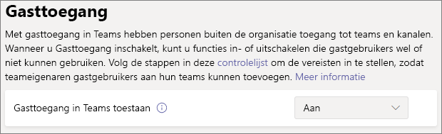

# Samenwerken met gasten in een teamCollaborate with guests in a team

Als u met gasten wilt samenwerken in alle documenten, taken en gesprekken, raden we u aan Microsoft Teams te gebruiken.If you need to collaborate with guests across documents, tasks, and conversations, we recommend using Microsoft Teams. Teams biedt alle samenwerkingsfuncties die beschikbaar zijn in Office en SharePoint met permanente chat en een aanpasbare en uitbreidbare set samenwerkingstools in een uniforme gebruikerservaring.Teams provides all of the collaboration features available in Office and SharePoint with persistent chat and a customizable and extensible set of collaboration tools in a unified user experience.

In dit artikel doorlopen we de Microsoft 365-configuratiestappen die nodig zijn om een team in te stellen voor samenwerking met gasten.In this article, we'll walk through the Microsoft 365 configuration steps necessary to set up a team for collaboration with guests.

## VideodemonstratieVideo demonstration

In deze video worden de configuratiestappen weergegeven die in dit document worden beschreven.This video shows the configuration steps described in this document. 

> [!VIDEO https://www.microsoft.com/videoplayer/embed/RE44NTr?autoplay=false]

## Instellingen voor Azure-organisatierelatiesAzure Organizational relationships settings

Delen in Microsoft 365 wordt op het hoogste niveau bepaald door de instellingen voor organisatierelaties in Azure Active Directory.Sharing in Microsoft 365 is governed at its highest level by the organizational relationships settings in Azure Active Directory. Als het delen van gasten is uitgeschakeld of beperkt in Azure AD, worden alle instellingen voor delen die u configureert in Microsoft 365 overschreven.If guest sharing is disabled or restricted in Azure AD, this will override any sharing settings that you configure in Microsoft 365.

Controleer de instellingen voor organisatorische relaties om ervoor te zorgen dat delen met gasten niet wordt geblokkeerd.Check the organizational relationships settings to ensure that sharing with guests is not blocked.

Instellingen voor organisatierelaties instellenTo set organizational relationship settings

1. Meld u aan [https://portal.azure.com](https://portal.azure.com)bij Microsoft Azure op .Log in to Microsoft Azure at [https://portal.azure.com](https://portal.azure.com).
2. Klik in de linkernavigatie op **Azure Active Directory**.In the left navigation, click **Azure Active Directory**.
3. Klik in het deelvenster **Overzicht** op **Organisatierelaties**.In the **Overview** pane, click **Organizational relationships**.
4. Klik in het deelvenster **Organisatierelaties** op **Instellingen**.In the **Organizational relationships** pane, click **Settings**.
5. Zorg ervoor dat **beheerders en gebruikers in de gastuitnodigingsrol kunnen uitnodigen** en dat leden kunnen **uitnodigen,** beide zijn ingesteld op **Ja**.Ensure that **Admins and users in the guest inviter role can invite** and **Members can invite** are both set to **Yes**.
6. Als u wijzigingen hebt aangebracht, klikt u op **Opslaan**.If you made changes, click **Save**.

Let op de instellingen in de sectie **Samenwerkingsbeperkingen.**Note the settings in the **Collaboration restrictions** section. Zorg ervoor dat de domeinen van de gasten waarmee u wilt samenwerken, niet worden geblokkeerd.Make sure that the domains of the guests that you want to collaborate with aren't blocked.

## Instellingen voor gasttoegang van TeamsTeams guest access settings

Teams heeft een master-aan/uit-schakelaar voor gasttoegang en een verscheidenheid aan instellingen beschikbaar om te bepalen wat gasten in een team kunnen doen.Teams has a master on/off switch for guest access and a variety of settings available to control what guests can do in a team. De **hoofdschakelaar, Gasttoegang toestaan in Teams** moet **ingeschakeld** zijn voor gasttoegang om in Teams te werken.The master switch, **Allow guest access in Teams** must be **On** for guest access to work in Teams.

Controleer of de toegang van gasten is ingeschakeld in Teams en breng de gastinstellingen aan op basis van uw bedrijfsbehoeften.Check to ensure that guest access is enabled in Teams and make any adjustment to the guest settings based on your business needs. Houd er rekening mee dat deze instellingen van invloed zijn op alle teams.Keep in mind that these settings affect all teams.

Instellingen voor gasttoegang in Teams instellenTo set Teams guest access settings

1. Meld u aan bij het Microsoft 365-beheercentrum op [https://admin.microsoft.com](https://admin.microsoft.com).Log in to the Microsoft 365 admin center at [https://admin.microsoft.com](https://admin.microsoft.com).
2. Klik in het navigatievenster aan de linkerkant op **Alles weergeven**.In the left navigation, click **Show all**.
3. Klik onder **Beheercentra** op **Teams**.Under **Admin centers**, click **Teams**.
4. Vouw in het Teams-beheercentrum in het linkernavigatievenster **Instellingen voor hele organisatie** uit en klik vervolgens op **Gasttoegang**.In the Teams admin center, in the left navigation, expand **Org-wide settings** and click **Guest access**.
5. Zorg ervoor dat **Gasttoegang in Teams toestaan** is ingesteld op **Aan**.Ensure that **Allow guest access in Teams** is set to **On**.
6. Breng de gewenste wijzigingen aan in de extra gastinstellingen en klik vervolgens op **Opslaan**.Make any desired changes to the additional guest settings, and then click **Save**.

> [!NOTE]
> Het kan 24 uur duren voordat de instelling voor gasten in Teams actief wordt nadat u deze hebt ingeschakeld.It may take up to twenty-four hours for the Teams guest setting to become active after you turn it on.

## Gastinstellingen voor Microsoft 365-groepenMicrosoft 365 Groups guest settings

Teams gebruikt Microsoft 365-groepen voor teamlidmaatschap.Teams uses Microsoft 365 Groups for team membership. De gastinstellingen van Microsoft 365 Groups moeten zijn ingeschakeld om gasttoegang in Teams te laten werken.The Microsoft 365 Groups guest settings must be turned on in order for guest access in Teams to work.

Gastinstellingen voor Microsoft 365-groepen instellenTo set Microsoft 365 Groups guest settings

1. Vouw in het Microsoft 365-beheercentrum in de linkernavigatie **instellingen**uit .In the Microsoft 365 admin center, in the left navigation, expand **Settings**.
2. Klik **op Services &-invoegtoepassing .**Click **Services & add-ins**.
3. Klik in de lijst op **Microsoft 365-groepen**.In the list, click **Microsoft 365 Groups**.
4. Zorg ervoor dat de **groepsleden buiten uw organisatie toegang krijgen tot groepsinhoud** en **groepseigenaren mensen buiten uw organisatie toevoegen aan de** selectievakjes groepen, beide zijn ingeschakeld.Ensure that the **Let group members outside your organization access group content** and **Let group owners add people outside your organization to groups** check boxes are both checked.
5. Als u wijzigingen hebt aangebracht, klikt u op **Wijzigingen opslaan**.If you made changes, click **Save changes**.

## Instellingen voor delen van SharePoint-organisatieniveauSharePoint organization level sharing settings

Teams-inhoud zoals bestanden, mappen en lijsten worden allemaal opgeslagen in SharePoint.Teams content such as files, folders, and lists are all stored in SharePoint. Om ervoor te zorgen dat gasten toegang hebben tot deze items in Teams, moeten de instellingen voor delen op SharePoint-organisatieniveau het delen met gasten mogelijk maken.In order for guests to have access to these items in Teams, the SharePoint organization-level sharing settings must allow for sharing with guests.

De instellingen op organisatieniveau bepalen welke instellingen beschikbaar zijn voor afzonderlijke sites, inclusief sites die zijn gekoppeld aan teams.The organization-level settings determine what settings are available for individual sites, including sites associated with teams. Site-instellingen kunnen niet toleranter zijn dan de instellingen op organisatieniveau.Site settings cannot be more permissive than the organization-level settings.

Als u het delen van bestanden en mappen met niet-geverifieerde personen wilt toestaan, kiest u **Iedereen**.If you want to allow file and folder sharing with unauthenticated people, choose **Anyone**. Als u ervoor wilt zorgen dat alle gasten zich moeten verifiëren, kiest u **Nieuwe en bestaande gasten.**If you want to ensure that all guests have to authenticate, choose **New and existing guests**. Kies de meest tolerante instelling die nodig is voor elke site in uw organisatie.Choose the most permissive setting that will be needed by any site in your organization.

Instellingen voor delen van SharePoint-organisatieniveau instellenTo set SharePoint organization level sharing settings

1. Klik in het Microsoft 365-beheercentrum in de linkernavigatie onder **Beheercentra**op **SharePoint**.In the Microsoft 365 admin center, in the left navigation, under **Admin centers**, click **SharePoint**.
2. Klik in het SharePoint Online Beheercentrum in het navigatievenster aan de linkerkant op **Delen**.In the SharePoint admin center, in the left navigation, click **Sharing**.
3. Controleer of extern delen voor SharePoint is ingesteld op **iedereen** of **nieuwe en bestaande gasten.**Ensure that external sharing for SharePoint is set to **Anyone** or **New and existing guests**.
4. Als u wijzigingen hebt aangebracht, klikt u op **Opslaan**.If you made changes, click **Save**.

## Standaardkoppelingsinstellingen op SharePoint-organisatieniveauSharePoint organization level default link settings

De standaardinstellingen voor bestands- en mapkoppeling bepalen welke koppelingsoptie standaard aan de gebruiker wordt weergegeven wanneer ze een bestand of map delen.The default file and folder link settings determine which link option is shown to the user by default when they share a file or folder. Gebruikers kunnen het koppelingstype wijzigen in een van de andere opties voordat ze desgewenst delen.Users can change the link type to one of the other options before sharing if desired.

Houd er rekening mee dat deze instelling van invloed is op alle teams en SharePoint-sites in uw organisatie.Keep in mind that this setting affects all teams and SharePoint sites in your organization.

Kies het type koppeling dat standaard is geselecteerd wanneer gebruikers bestanden en mappen delen:Choose the type of link that's selected by default when users share files and folders:

- **Iedereen met de link** - Kies deze optie als u verwacht veel niet-geverifieerde delen van bestanden en mappen te doen.**Anyone with the link** - Choose this option if you expect to do a lot of unauthenticated sharing of files and folders. Als u *koppelingen voor iedereen* wilt toestaan, maar zich zorgen maakt over het per ongeluk niet-verifiëren delen, u een van de andere opties als standaard beschouwen.If you want to allow *Anyone* links but are concerned about accidental unauthenticated sharing, consider one of the other options as the default. Dit koppelingstype is alleen beschikbaar als u **Delen van iedereen** hebt ingeschakeld.This link type is only available if you've enabled **Anyone** sharing.
- **Alleen mensen in uw organisatie** - Kies deze optie als u verwacht dat het delen van bestanden en mappen bij mensen binnen uw organisatie is.**Only people in your organization** - Choose this option if you expect most file and folder sharing to be with people inside your organization.
- **Specifieke personen** - Overweeg deze optie als u verwacht veel bestanden en mappen te delen met gasten.**Specific people** - Consider this option if you expect to do a lot of file and folder sharing with guests. Dit type koppeling werkt met gasten en vereist dat ze zich verifiëren.This type of link works with guests and requires them to authenticate.
 

De standaardkoppelingsinstellingen op SharePoint-organisatieniveau instellenTo set the SharePoint organization level default link settings

1. Navigeer naar de pagina Delen in het SharePoint-beheercentrum.Navigate to the Sharing page in the SharePoint admin center.
2. Selecteer **onder Koppelingen voor bestand en map**de standaardkoppeling voor delen die u wilt gebruiken.Under **File and folder links**, select the default sharing link that you want to use.
3. Als u wijzigingen hebt aangebracht, klikt u op **Opslaan**.If you made changes, click **Save**.

## Een team makenCreate a team

De volgende stap is het creëren van het team dat u wilt gebruiken om samen te werken met gasten.The next step is to create the team that you plan to use for collaborating with guests.

Een team makenTo create a team
1. Klik in Teams op het tabblad **Teams** op **Deelnemen of maak een team** onder aan het linkerdeelvenster.In Teams, on the **Teams** tab, click **Join or create a team** at the bottom of the left pane.
2. Klik **op Een team maken**.Click **Create a team**.
3. Klik **op Een team helemaal opnieuw opbouwen**.Click **Build a team from scratch**.
4. Kies **Privé** of **Openbaar**.Choose **Private** or **Public**.
5. Typ een naam en beschrijving voor het team en klik op **Maken**.Type a name and description for the team, and then click **Create**.
6. Klik **op Overslaan**.Click **Skip**.

We nodigen gebruikers later uit.We'll invite users later. Vervolgens is het belangrijk om de instellingen voor het delen op siteniveau voor de SharePoint-site die aan het team is gekoppeld, te controleren.Next, it's important to check the site-level sharing settings for the SharePoint site that is associated with the team.

## Instellingen voor delen op SharePoint-siteniveauSharePoint site level sharing settings

Controleer de instellingen voor delen op siteniveau om ervoor te zorgen dat deze het gewenste type toegang voor dit team toestaan.Check the site-level sharing settings to make sure that they allow the type of access that you want for this team. Als u bijvoorbeeld de instellingen op organisatieniveau instelt op **Iedereen,** maar u wilt dat alle gasten zich voor dit team verifiëren, controleert u of de instellingen voor delen op siteniveau zijn ingesteld op **nieuwe en bestaande gasten.**For example, if you set the organization-level settings to **Anyone**, but you want all guests to authenticate for this team, then make sure the site-level sharing settings are set to **New and existing guests**.

Instellingen voor delen op siteniveau instellenTo set site-level sharing settings
1. Vouw **Sites** uit in het SharePoint Online Beheercentrum in het navigatievenster aan de linkerkant en klik op **Delen**.In the SharePoint admin center, in the left navigation, expand **Sites** and click **Active sites**.
2. Selecteer de site voor het team dat u zojuist hebt gemaakt.Select the site for the team that you just created.
3. Klik op het lint op **Delen**.In the ribbon, click **Sharing**.
4. Zorg ervoor dat delen is ingesteld op **iedereen** of **nieuwe en bestaande gasten.**Ensure that sharing is set to **Anyone** or **New and existing guests**.
5. Als u wijzigingen hebt aangebracht, klikt u op **Opslaan**.If you made changes, click **Save**.

## Gebruikers uitnodigenInvite users

Instellingen voor het delen van gasten zijn nu geconfigureerd, zodat u beginnen met het toevoegen van interne gebruikers en gasten aan uw team.Guest sharing settings are now configured, so you can start adding internal users and guests to your team. 

Interne gebruikers uitnodigen voor een teamTo invite internal users to a team
1. Klik in het team**\*\*** op **Meer opties** ( ) en klik vervolgens op **Lid toevoegen**.In the team, click **More options** (**\*\*\***), and then click **Add member**.
2. Typ de naam van de persoon die u wilt uitnodigen.Type the name of the person who you want to invite.
3. Klik **op Toevoegen**en klik vervolgens op **Sluiten.**Click **Add**, and then click **Close**.

Gasten uitnodigen voor een teamTo invite guests to a team
1. Klik in het team**\*\*** op **Meer opties** ( ) en klik vervolgens op **Lid toevoegen**.In the team, click **More options** (**\*\*\***), and then click **Add member**.
2. Typ het e-mailadres van de gast die u wilt uitnodigen.Type the email address of the guest who you want to invite.
3. Klik **op Gastgegevens bewerken**.Click **Edit guest information**.
4. Typ de volledige naam van de gast en klik op het vinkje.Type the guest's full name and click the check mark.
5. Klik **op Toevoegen**en klik vervolgens op **Sluiten.**Click **Add**, and then click **Close**.

## Zie ookSee Also

[Aanbevolen procedures voor het delen van bestanden en mappen met niet-geverifieerde gebruikersBest practices for sharing files and folders with unauthenticated users](best-practices-anonymous-sharing.md)

[Accidentele blootstelling aan bestanden beperken tijdens het delen met gastenLimit accidental exposure to files when sharing with guests](share-limit-accidental-exposure.md)

[Een beveiligde omgeving voor het delen met gasten makenCreate a secure guest sharing environment](create-secure-guest-sharing-environment.md)

[Een B2B-extranet maken met beheerde gastenCreate a B2B extranet with managed guests](b2b-extranet.md)
