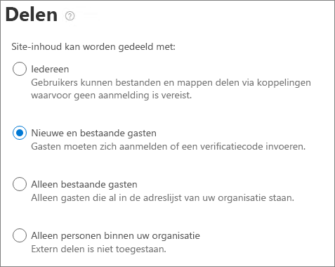

# Samenwerken met gasten op een site

Als u wilt samenwerken met gasten in documenten, gegevens en lijsten, kunt u een SharePoint-site gebruiken. Moderne SharePoint-sites zijn verbonden met Microsoft 365-groepen en kunnen het sitelidmaatschap beheren en aanvullende samenwerkingsprogramma's, zoals een gedeeld postvak en een agenda, verlenen.

In dit artikel wordt de configuratiestappen voor Microsoft 365 beschreven die nodig zijn voor het instellen van een SharePoint-site voor samenwerking met gasten.

## Videodemonstratie

In deze video ziet u de configuratiestappen die in dit document worden beschreven. 

> [!VIDEO https://www.microsoft.com/videoplayer/embed/RE44Llg?autoplay=false]

## Instellingen voor externe samenwerking van Azure

Delen in Microsoft 365 wordt bepaald door de [instellingen voor B2B External collaboration in azure Active Directory](https://docs.microsoft.com/azure/active-directory/external-identities/delegate-invitations). Als gasten delen is uitgeschakeld of niet beschikbaar is in azure AD, worden de instellingen voordelen overschreven die u configureert in Microsoft 365.

Controleer de instellingen voor B2B externe samenwerking om ervoor te zorgen dat delen met gasten niet is geblokkeerd.

Externe samenwerkings instellingen instellen

1. Meld u aan bij Azure Active Directory [https://aad.portal.azure.com](https://aad.portal.azure.com) .
2. Klik in het linker navigatiedeelvenster op **Azure Active Directory**.
3. Klik op **externe identiteiten**.
4. Klik in het scherm aan de **slag** in het linker navigatiedeelvenster op **instellingen voor externe samenwerking**.
5. Zorg ervoor dat **beheerders en gebruikers in de rol gast uitnodiging kunnen uitnodigen** en dat **leden kunnen uitnodigen** zijn ingesteld op **Ja**.
6. Als u wijzigingen hebt aangebracht, klikt u op **Opslaan**.

Let op de instellingen in de sectie **samenwerkings beperkingen** . Zorg ervoor dat de domeinen van de gasten waarmee u wilt samenwerken, niet zijn geblokkeerd.

Als u met gasten in meerdere organisaties werkt, is het raadzaam om de toegang van Directory-gegevens te beperken. Hiermee kunt u voorkomen dat ze zien welke iemand anders een gast is in de adreslijst. Als u dit wilt doen, selecteert u onder **toegangsbeperkingen** voor gastgebruikers de optie **gastgebruikers beperkte toegang tot eigenschappen en lidmaatschap van adreslijst objecten** of **toegang voor gastgebruikers is beperkt tot eigenschappen en lidmaatschap van eigen directoryobjecten**.

## Gastinstellingen voor Microsoft 365-groepen

Moderne SharePoint-sites gebruikmaken Microsoft 365 groepen om de toegang van de site te beheren. De gastinstellingen voor Microsoft 365 groepen moeten zijn ingeschakeld voor gasttoegang in SharePoint-sites om te werken.

De gastinstellingen van Microsoft 365 groepen instellen

1. In het Microsoft 365-Beheercentrum, in het linker navigatiedeelvenster, vouwt u **instellingen** uit.
2. Klik op **instellingen voor organisatie**.
3. Klik in de lijst op **Microsoft 365 groepen**.
4. Zorg ervoor dat de selectievakjes **eigenaren van gebruikers buiten uw organisatie toevoegen aan Microsoft 365-groepen als gasten** en de selectievakjes voor **groepsleden toegang krijgen tot groepsinhoud** beide zijn ingeschakeld.
5. Als u wijzigingen hebt aangebracht, klikt u op **wijzigingen opslaan**.

## Instellingen voordelen op SharePoint-organisatieniveau

Als u wilt dat gasten toegang hebben tot SharePoint-sites, moet u de instellingen voordelen van SharePoint op organisatieniveau toestaan voordelen met gasten.

De instellingen op het niveau van organisatie bepalen de instellingen die beschikbaar zijn voor afzonderlijke sites. Site-instellingen kunnen niet hoger zijn dan de instellingen op organisatieniveau.

Als u niet-geverifieerde bestanden en mappen wilt delen, kiest u **iedereen**. Als u ervoor wilt zorgen dat alle personen van buiten uw organisatie verificatie hebben, kiest u **nieuwe en bestaande gasten**. Kies de meest strikte instelling die moet worden gebruikt door alle sites in uw organisatie.

Instellingen voordelen van SharePoint op organisatieniveau instellen

1. Klik in het Microsoft 365-Beheercentrum, in het linker navigatiedeelvenster, onder **beheer centra** op **SharePoint**.
2. Klik in het SharePoint-Beheercentrum, in het linker navigatiedeelvenster, onder **beleid**, op **delen**.
3. Zorg ervoor dat extern delen voor SharePoint is ingesteld op **iedereen** of **nieuwe en bestaande gasten**.
4. Als u wijzigingen hebt aangebracht, klikt u op **Opslaan**.

## Een site maken

De volgende stap is het maken van de site die u wilt gebruiken om samen te werken met gasten.

Een site maken
1. Klik in het SharePoint-beheercentrum onder **Sites** op **Actieve sites**.
2. Klik op **Maken**.
3. Klik op **team site**.
4. Typ een naam voor de site en voer een naam in voor de eigenaar van de groep (site-eigenaar).
5. Kies onder **Geavanceerde instellingen** of u deze site een openbare of persoonlijke versie wilt maken.
6. Klik op **Volgende**.
7. Klik op **Voltooien**.

We nodigen later gebruikers uit. Vervolgens moet u de instellingen voordelen op siteniveau voor deze site controleren.

## Instellingen voordelen op SharePoint-siteniveau

Controleer de instellingen op siteniveau delen om ervoor te zorgen dat ze het gewenste type toegang voor deze site toestaan. Als u bijvoorbeeld de instellingen op organisatieniveau instelt op **iedereen**, maar u wilt dat alle gasten verificatie voor deze site verifiëren, controleert u of de instellingen voordelen op het siteniveau zijn ingesteld op **nieuwe en bestaande gasten**.

Houd er rekening mee dat de site niet kan worden gedeeld met niet-geverifieerde personen (**iedereen** ), maar ook afzonderlijke bestanden en mappen.

U kunt ook de [instellingen voor het extern delen van SharePoint-sites](https://docs.microsoft.com/microsoft-365/compliance/sensitivity-labels-teams-groups-sites)met behulp van palletlabels gebruiken.

Instellingen voordelen op siteniveau instellen
1. Vouw **Sites** uit in het SharePoint Online Beheercentrum in het navigatievenster aan de linkerkant en klik op **Delen**.
2. Selecteer de site die u wilt delen.
3. Klik op... en klik op **delen**.
4. Zorg ervoor dat delen is ingesteld op **iedereen** of **nieuwe en bestaande gasten**.
5. Als u wijzigingen hebt aangebracht, klikt u op **Opslaan**.

## Gebruikers uitnodigen

Instellingen voor het delen van gasten zijn nu geconfigureerd, zodat u interne gebruikers en gasten aan uw site kunt toevoegen. De toegang tot de site wordt bestuurd via de bijbehorende Microsoft 365-groep, dus we zullen gebruikers daar toevoegen.

Interne gebruikers voor een groep uitnodigen
1. Ga naar de site waaraan u gebruikers wilt toevoegen.
2. Klik op de koppeling **leden** in de rechterbovenhoek waarmee het aantal leden wordt aangegeven.
3. Klik op **leden toevoegen**.
4. Typ de namen of e-mailadressen van de gebruikers die u wilt uitnodigen voor de site en klik op **Opslaan**.

U kunt geen gasten toevoegen vanaf de site. U moet ze toevoegen met de webversie van Outlook. Daarom moet u als vereisten voor het toevoegen en uitnodigen van gasten aan een groep klikken op de URL van de site in de kolom **URL**  om naar de specifieke sitepagina te gaan. Klik op deze pagina op het pictogram van het **startprogramma voor apps** en selecteer **Outlook**. Dit is het scherm waarmee u gasten kunt uitnodigen voor een groep, waaronder de onderstaande procedure wordt beschreven.

Gasten voor een groep uitnodigen
1. Klik onder **groepen** op de groep waaraan u gasten wilt uitnodigen.
2. Open het visitekaartje van de groep, klik op de koppeling **leden** in de rechterbovenhoek (de koppeling die het aantal leden aanduidt).
3. Klik op **leden toevoegen**.
4. Voer de e-mailadressen in van de gasten die u wilt uitnodigen en klik op **toevoegen**.
5. Klik op **Sluiten**.
Houd er rekening mee dat u op alleen **sluiten** moet klikken als u niet de eigenaar van de groep bent en daarom niet is toegestaan om de gast toe te voegen aan de groep. In dergelijke gevallen wordt de aanvraag om de gast toe te voegen aan de groep, doorgestuurd naar de groepseigenaar voorgoed keuring.

## Zie ook

[Aanbevolen procedures voor het delen van bestanden en mappen met niet-geverifieerde gebruikers](best-practices-anonymous-sharing.md)

[Accidentele blootstelling aan bestanden beperken tijdens het delen met gasten](share-limit-accidental-exposure.md)

[Een beveiligde omgeving voor het delen met gasten maken](create-secure-guest-sharing-environment.md)

[Een B2B-extranet maken met beheerde gasten](b2b-extranet.md)

[Integratie van SharePoint en OneDrive met Azure AD B2B](https://docs.microsoft.com/sharepoint/sharepoint-azureb2b-integration-preview)
