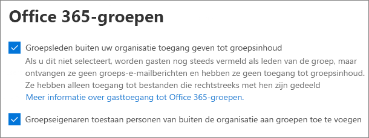

# Samenwerken met gasten op een siteCollaborate with guests in a site

Als u wilt samenwerken met gasten in documenten, gegevens en lijsten, kunt u een SharePoint-site gebruiken.If you need to collaborate with guests across documents, data, and lists, you can use a SharePoint site. Moderne SharePoint-sites zijn verbonden met Microsoft 365-groepen en kunnen het sitelidmaatschap beheren en aanvullende samenwerkingsprogramma's, zoals een gedeeld postvak en een agenda, verlenen.Modern SharePoint sites are connected to Microsoft 365 Groups and can manage the site membership and provide additional collaboration tools such as a shared mailbox and a calendar.

In dit artikel wordt de configuratiestappen voor Microsoft 365 beschreven die nodig zijn voor het instellen van een SharePoint-site voor samenwerking met gasten.In this article, we'll walk through the Microsoft 365 configuration steps necessary to set up a SharePoint site for collaboration with guests.

## VideodemonstratieVideo demonstration

In deze video ziet u de configuratiestappen die in dit document worden beschreven.This video shows the configuration steps described in this document. 

> [!VIDEO https://www.microsoft.com/videoplayer/embed/RE44Llg?autoplay=false]

## Instellingen voor externe samenwerking van AzureAzure external collaboration settings

Delen in Microsoft 365 wordt bepaald door de [instellingen voor B2B External collaboration in azure Active Directory](https://docs.microsoft.com/azure/active-directory/external-identities/delegate-invitations).Sharing in Microsoft 365 is governed at its highest level by the [B2B external collaboration settings in Azure Active Directory](https://docs.microsoft.com/azure/active-directory/external-identities/delegate-invitations). Als gasten delen is uitgeschakeld of niet beschikbaar is in azure AD, worden de instellingen voordelen overschreven die u configureert in Microsoft 365.If guest sharing is disabled or restricted in Azure AD, this setting overrides any sharing settings that you configure in Microsoft 365.

Controleer de instellingen voor B2B externe samenwerking om ervoor te zorgen dat delen met gasten niet is geblokkeerd.Check the B2B external collaboration settings to ensure that sharing with guests is not blocked.

Externe samenwerkings instellingen instellenTo set external collaboration settings

1. Meld u aan bij Azure Active Directory [https://aad.portal.azure.com](https://aad.portal.azure.com) .Log in to Azure Active Directory at [https://aad.portal.azure.com](https://aad.portal.azure.com).
2. Klik in het linker navigatiedeelvenster op **Azure Active Directory**.In the left navigation pane, click **Azure Active Directory**.
3. Klik op **externe identiteiten**.Click **External identities**.
4. Klik in het scherm aan de **slag** in het linker navigatiedeelvenster op **instellingen voor externe samenwerking**.On the **Get started** screen, in the left navigation pane, click **External collaboration settings**.
5. Zorg ervoor dat **beheerders en gebruikers in de rol gast uitnodiging kunnen uitnodigen** en dat **leden kunnen uitnodigen** zijn ingesteld op **Ja**.Ensure that **Admins and users in the guest inviter role can invite** and **Members can invite** are both set to **Yes**.
6. Als u wijzigingen hebt aangebracht, klikt u op **Opslaan**.If you made changes, click **Save**.

Let op de instellingen in de sectie **samenwerkings beperkingen** .Note the settings in the **Collaboration restrictions** section. Zorg ervoor dat de domeinen van de gasten waarmee u wilt samenwerken, niet zijn geblokkeerd.Make sure that the domains of the guests that you want to collaborate with aren't blocked.

Als u met gasten in meerdere organisaties werkt, is het raadzaam om de toegang van Directory-gegevens te beperken.If you work with guests from multiple organizations, you may want to restrict their ability to access directory data. Hiermee kunt u voorkomen dat ze zien welke iemand anders een gast is in de adreslijst.This will prevent them from seeing who else is a guest in the directory. Als u dit wilt doen, selecteert u onder **toegangsbeperkingen** voor gastgebruikers de optie **gastgebruikers beperkte toegang tot eigenschappen en lidmaatschap van adreslijst objecten** of **toegang voor gastgebruikers is beperkt tot eigenschappen en lidmaatschap van eigen directoryobjecten**.To do this, under **Guest user access restrictions**, select **Guest users have limited access to properties and membership of directory objects settings** or **Guest user access is restricted to properties and memberships of their own directory objects**.

## Gastinstellingen voor Microsoft 365-groepenMicrosoft 365 Groups guest settings

Moderne SharePoint-sites gebruikmaken Microsoft 365 groepen om de toegang van de site te beheren.Modern SharePoint sites use Microsoft 365 Groups to control site access. De gastinstellingen voor Microsoft 365 groepen moeten zijn ingeschakeld voor gasttoegang in SharePoint-sites om te werken.The Microsoft 365 Groups guest settings must be turned on in order for guest access in SharePoint sites to work.

De gastinstellingen van Microsoft 365 groepen instellenTo set Microsoft 365 Groups guest settings

1. In het Microsoft 365-Beheercentrum, in het linker navigatiedeelvenster, vouwt u **instellingen** uit.In the Microsoft 365 admin center, in the left navigation pane, expand **Settings**.
2. Klik op **instellingen voor organisatie**.Click **Org settings**.
3. Klik in de lijst op **Microsoft 365 groepen**.In the list, click **Microsoft 365 Groups**.
4. Zorg ervoor dat de selectievakjes **eigenaren van gebruikers buiten uw organisatie toevoegen aan Microsoft 365-groepen als gasten** en de selectievakjes voor **groepsleden toegang krijgen tot groepsinhoud** beide zijn ingeschakeld.Ensure that the **Let group owners add people outside your organization to Microsoft 365 Groups as guests** and **Let guest group members access group content** check boxes are both checked.
5. Als u wijzigingen hebt aangebracht, klikt u op **wijzigingen opslaan**.If you made changes, click **Save changes**.

## Instellingen voordelen op SharePoint-organisatieniveauSharePoint organization-level sharing settings

Als u wilt dat gasten toegang hebben tot SharePoint-sites, moet u de instellingen voordelen van SharePoint op organisatieniveau toestaan voordelen met gasten.In order for guests to have access to SharePoint sites, the SharePoint organization-level sharing settings must allow for sharing with guests.

De instellingen op het niveau van organisatie bepalen de instellingen die beschikbaar zijn voor afzonderlijke sites.The organization-level settings determine the settings that will be available for individual sites. Site-instellingen kunnen niet hoger zijn dan de instellingen op organisatieniveau.Site settings cannot be more permissive than the organization-level settings.

Als u niet-geverifieerde bestanden en mappen wilt delen, kiest u **iedereen**.If you want to allow unauthenticated file and folder sharing, choose **Anyone**. Als u ervoor wilt zorgen dat alle personen van buiten uw organisatie verificatie hebben, kiest u **nieuwe en bestaande gasten**.If you want to ensure that all people outside your organization have to authenticate, choose **New and existing guests**. Kies de meest strikte instelling die moet worden gebruikt door alle sites in uw organisatie.Choose the most permissive setting that will be needed by any site in your organization.

Instellingen voordelen van SharePoint op organisatieniveau instellenTo set SharePoint organization-level sharing settings

1. Klik in het Microsoft 365-Beheercentrum, in het linker navigatiedeelvenster, onder **beheer centra** op **SharePoint**.In the Microsoft 365 admin center, in the left navigation pane, under **Admin centers**, click **SharePoint**.
2. Klik in het SharePoint-Beheercentrum, in het linker navigatiedeelvenster, onder **beleid**, op **delen**.In the SharePoint admin center, in the left navigation pane, under **Policies**, click **Sharing**.
3. Zorg ervoor dat extern delen voor SharePoint is ingesteld op **iedereen** of **nieuwe en bestaande gasten**.Ensure that external sharing for SharePoint is set to **Anyone** or **New and existing guests**.
4. Als u wijzigingen hebt aangebracht, klikt u op **Opslaan**.If you made changes, click **Save**.

## Een site makenCreate a site

De volgende stap is het maken van de site die u wilt gebruiken om samen te werken met gasten.The next step is to create the site that you plan to use for collaborating with guests.

Een site makenTo create a site
1. Klik in het SharePoint-beheercentrum onder **Sites** op **Actieve sites**.In the SharePoint admin center, under **Sites**, click **Active sites**.
2. Klik op **Maken**.Click **Create**.
3. Klik op **team site**.Click **Team site**.
4. Typ een naam voor de site en voer een naam in voor de eigenaar van de groep (site-eigenaar).Type a site name and enter a name for the Group owner (site owner).
5. Kies onder **Geavanceerde instellingen** of u deze site een openbare of persoonlijke versie wilt maken.Under **Advanced settings**, choose if you want this site to be a public or private one.
6. Klik op **Volgende**.Click **Next**.
7. Klik op **Voltooien**.Click **Finish**.

We nodigen later gebruikers uit.We'll invite users later. Vervolgens moet u de instellingen voordelen op siteniveau voor deze site controleren.Next, it's important to check the site-level sharing settings for this site.

## Instellingen voordelen op SharePoint-siteniveauSharePoint site-level sharing settings

Controleer de instellingen op siteniveau delen om ervoor te zorgen dat ze het gewenste type toegang voor deze site toestaan.Check the site-level sharing settings to make sure that they allow the type of access that you want for this site. Als u bijvoorbeeld de instellingen op organisatieniveau instelt op **iedereen**, maar u wilt dat alle gasten verificatie voor deze site verifiëren, controleert u of de instellingen voordelen op het siteniveau zijn ingesteld op **nieuwe en bestaande gasten**.For example, if you set the organization-level settings to **Anyone**, but you want all guests to authenticate for this site, then make sure the site-level sharing settings are set to **New and existing guests**.

Houd er rekening mee dat de site niet kan worden gedeeld met niet-geverifieerde personen (**iedereen** ), maar ook afzonderlijke bestanden en mappen.Note that the site cannot be shared with unauthenticated people (**Anyone** setting), but individual files and folders can.

U kunt ook de [instellingen voor het extern delen van SharePoint-sites](https://docs.microsoft.com/microsoft-365/compliance/sensitivity-labels-teams-groups-sites)met behulp van palletlabels gebruiken.You can also use [sensitivity labels to control external sharing settings for SharePoint sites](https://docs.microsoft.com/microsoft-365/compliance/sensitivity-labels-teams-groups-sites).

Instellingen voordelen op siteniveau instellenTo set site-level sharing settings
1. Vouw **Sites** uit in het SharePoint Online Beheercentrum in het navigatievenster aan de linkerkant en klik op **Delen**.In the SharePoint admin center, in the left navigation, expand **Sites** and click **Active sites**.
2. Selecteer de site die u wilt delen.Select the site that you want to share.
3. Klik op... en klik op **delen**.Click ..., and click **Sharing**.
4. Zorg ervoor dat delen is ingesteld op **iedereen** of **nieuwe en bestaande gasten**.Ensure that sharing is set to **Anyone** or **New and existing guests**.
5. Als u wijzigingen hebt aangebracht, klikt u op **Opslaan**.If you made changes, click **Save**.

## Gebruikers uitnodigenInvite users

Instellingen voor het delen van gasten zijn nu geconfigureerd, zodat u interne gebruikers en gasten aan uw site kunt toevoegen.Guest sharing settings are now configured, so you can start adding internal users and guests to your site. De toegang tot de site wordt bestuurd via de bijbehorende Microsoft 365-groep, dus we zullen gebruikers daar toevoegen.Site access is controlled through the associated Microsoft 365 Group, so we'll be adding users there.

Interne gebruikers voor een groep uitnodigenTo invite internal users to a group
1. Ga naar de site waaraan u gebruikers wilt toevoegen.Navigate to the site where you want to add users.
2. Klik op de koppeling **leden** in de rechterbovenhoek waarmee het aantal leden wordt aangegeven.Click **Members** link in the upper right which denotes the member count.
3. Klik op **leden toevoegen**.Click **Add members**.
4. Typ de namen of e-mailadressen van de gebruikers die u wilt uitnodigen voor de site en klik op **Opslaan**.Type the names or email addresses of the users that you want to invite to the site, and then click **Save**.

U kunt geen gasten toevoegen vanaf de site.Guests can't be added from the site. U moet ze toevoegen met de webversie van Outlook.You need to add them using Outlook on the web. Daarom moet u als vereisten voor het toevoegen en uitnodigen van gasten aan een groep klikken op de URL van de site in de kolom **URL**  om naar de specifieke sitepagina te gaan.Therefore, as a prerequisite to add and invite guests to a group, click the URL of the site in the **URL**  column to navigate to the site-specific page. Klik op deze pagina op het pictogram van het **startprogramma voor apps** en selecteer **Outlook**.From this page, click the **App launcher** icon and select **Outlook**. Dit is het scherm waarmee u gasten kunt uitnodigen voor een groep, waaronder de onderstaande procedure wordt beschreven.This is the screen from which you can invite guests into a group, for which procedure is described below.

Gasten voor een groep uitnodigenTo invite guests to a group
1. Klik onder **groepen** op de groep waaraan u gasten wilt uitnodigen.Under **Groups**, click the group to which you want to invite guests.
2. Open het visitekaartje van de groep, klik op de koppeling **leden** in de rechterbovenhoek (de koppeling die het aantal leden aanduidt).Open the group contact card, click **Members** link in the upper right (the link which denotes the member count).
3. Klik op **leden toevoegen**.click **Add members**.
4. Voer de e-mailadressen in van de gasten die u wilt uitnodigen en klik op **toevoegen**.Type the email addresses of the guests that you want to invite, and then click **Add**.
5. Klik op **Sluiten**.Click **Close**.
Houd er rekening mee dat u op alleen **sluiten** moet klikken als u niet de eigenaar van de groep bent en daarom niet is toegestaan om de gast toe te voegen aan de groep.Note that you need to click **Close** only if you are not the owner of the group and as a result, you are not allowed to add the guest into the group. In dergelijke gevallen wordt de aanvraag om de gast toe te voegen aan de groep, doorgestuurd naar de groepseigenaar voorgoed keuring.In such cases, the request to add the guest into the group is transferred to the group owner for approval.

## Zie ookSee also

[Aanbevolen procedures voor het delen van bestanden en mappen met niet-geverifieerde gebruikersBest practices for sharing files and folders with unauthenticated users](best-practices-anonymous-sharing.md)

[Accidentele blootstelling aan bestanden beperken tijdens het delen met gastenLimit accidental exposure to files when sharing with guests](share-limit-accidental-exposure.md)

[Een beveiligde omgeving voor het delen met gasten makenCreate a secure guest sharing environment](create-secure-guest-sharing-environment.md)

[Een B2B-extranet maken met beheerde gastenCreate a B2B extranet with managed guests](b2b-extranet.md)

[Integratie van SharePoint en OneDrive met Azure AD B2BSharePoint and OneDrive integration with Azure AD B2B](https://docs.microsoft.com/sharepoint/sharepoint-azureb2b-integration-preview)
