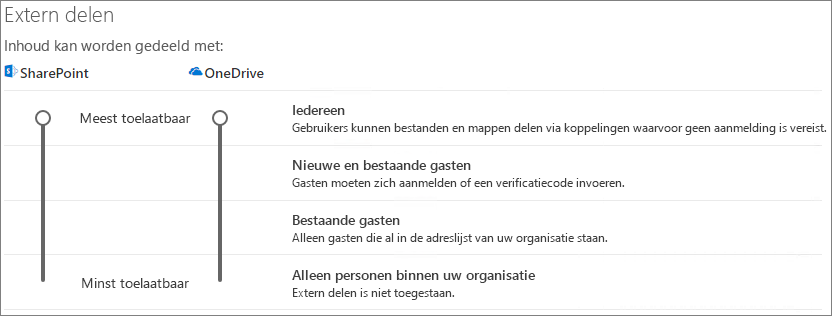

# Samenwerken met gasten aan een documentCollaborate with guests on a document

Als u met personen buiten uw organisatie moet samenwerken aan documenten in SharePoint of OneDrive, kunt u een koppeling voordelen naar het document verzenden.If you need to collaborate with people outside your organization on documents in SharePoint or OneDrive, you can send them a sharing link to the document. In dit artikel worden 365 de stappen beschreven die u moet uitvoeren om koppelingen voordelen voor SharePoint en OneDrive in te stellen voor de behoeften van uw organisatie.In this article, we'll walk through the Microsoft 365 configuration steps necessary to set up sharing links for SharePoint and OneDrive for the needs of your organization.

## VideodemonstratieVideo demonstration

In deze video ziet u de configuratiestappen die in dit document worden beschreven.This video shows the configuration steps described in this document. 

> [!VIDEO https://www.microsoft.com/videoplayer/embed/RE450Vt?autoplay=false]

## Instellingen van Azure organisatie relatiesAzure Organizational relationships settings

Delen in Microsoft 365 wordt bepaald met het hoogste niveau van de [instellingen voor organisatie relaties in azure Active Directory](https://docs.microsoft.com/azure/active-directory/external-identities/delegate-invitations).Sharing in Microsoft 365 is governed at its highest level by the [organizational relationships settings in Azure Active Directory](https://docs.microsoft.com/azure/active-directory/external-identities/delegate-invitations). Als gasten delen is uitgeschakeld of niet beschikbaar is in azure AD, worden de instellingen voordelen die u configureert in Microsoft 365 genegeerd.If guest sharing is disabled or restricted in Azure AD, this will override any sharing settings that you configure in Microsoft 365.

Controleer de instellingen van de organisatie om te controleren of delen met gasten niet is geblokkeerd.Check the organizational relationships settings to ensure that sharing with guests is not blocked.

Instellingen voor organisatie relaties instellenTo set organizational relationship settings

1. Meld u aan bij Microsoft Azure at [https://portal.azure.com](https://portal.azure.com) .Log in to Microsoft Azure at [https://portal.azure.com](https://portal.azure.com).
2. Klik in het linkernavigatievenster op **Azure Active Directory**.In the left navigation, click **Azure Active Directory**.
3. Klik in het deelvenster **overzicht** op **organisatie relaties**.In the **Overview** pane, click **Organizational relationships**.
4. Klik in het deelvenster **relaties organisatie** op **instellingen**.In the **Organizational relationships** pane, click **Settings**.
5. Zorg ervoor dat **beheerders en gebruikers in de rol gast uitnodiging kunnen uitnodigen** en dat **leden kunnen uitnodigen** zijn ingesteld op **Ja**.Ensure that **Admins and users in the guest inviter role can invite** and **Members can invite** are both set to **Yes**.
6. Als u wijzigingen hebt aangebracht, klikt u op **Opslaan**.If you made changes, click **Save**.

Let op de instellingen in de sectie **samenwerkings beperkingen** .Note the settings in the **Collaboration restrictions** section. Zorg ervoor dat de domeinen van de gasten waarmee u wilt samenwerken, niet zijn geblokkeerd.Make sure that the domains of the guests that you want to collaborate with aren't blocked.

Als u met gasten in meerdere organisaties werkt, is het raadzaam om de toegang van Directory-gegevens te beperken.If you work with guests from multiple organizations, you may want to restrict their ability to access directory data. Hiermee kunt u voorkomen dat ze zien welke iemand anders een gast is in de adreslijst.This will prevent them from seeing who else is a guest in the directory. Als u dit wilt doen, selecteert u onder **toegangsbeperkingen**voor gastgebruikers de optie **gastgebruikers beperkte toegang tot eigenschappen en lidmaatschap van adreslijst objecten** of **toegang voor gastgebruikers is beperkt tot eigenschappen en lidmaatschap van eigen directoryobjecten**.To do this, under **Guest user access restrictions**, select **Guest users have limited access to properties and membership of directory objects settings** or **Guest user access is restricted to properties and memberships of their own directory objects**.

## Instellingen voordelen van SharePoint-organisatieniveauSharePoint organization level sharing settings

Als u wilt dat personen van buiten uw organisatie toegang hebben tot een document in SharePoint of OneDrive, moeten de instellingen voordelen van SharePoint en OneDrive delen toestaan voordelen met personen buiten uw organisatie.In order for people outside your organization to have access to a document in SharePoint or OneDrive, the SharePoint and OneDrive organization-level sharing settings must allow for sharing with people outside your organization.

De instellingen op organisatieniveau voor SharePoint bepalen welke instellingen beschikbaar zijn voor afzonderlijke SharePoint-sites.The organization-level settings for SharePoint determine what settings are available for individual SharePoint sites. Site-instellingen kunnen niet hoger zijn dan de instellingen op organisatieniveau.Site settings cannot be more permissive than the organization-level settings. Met de instelling op organisatieniveau voor OneDrive wordt bepaald welk niveau van delen beschikbaar is in de OneDrive-bibliotheken van de gebruikers.The organization-level setting for OneDrive determines what level of sharing is available in users' OneDrive libraries.

Voor SharePoint en OneDrive, als u niet-geverifieerde bestanden en mappen wilt delen, kiest u **iedereen**.For SharePoint and OneDrive, if you want to allow unauthenticated file and folder sharing, choose **Anyone**. Als u er zeker van wilt zijn dat mensen van buiten uw organisatie verificatie hebben, kiest u **nieuwe en bestaande gasten**.If you want to ensure that people outside your organization have to authenticate, choose **New and existing guests**. *Iedereen* is de eenvoudigste manier om te delen: personen buiten uw organisatie kunnen de koppeling openen zonder verificatie en kunnen deze ook aan anderen doorgeven.*Anyone* links are the easiest way to share: people outside your organization can open the link without authentication and are free to pass it on to others.

Voor SharePoint kiest u de meest strikte instelling die moet worden gebruikt door alle sites in uw organisatie.For SharePoint, choose the most permissive setting that will be needed by any site in your organization.

Instellingen voordelen van SharePoint-organisatieniveau instellenTo set SharePoint organization level sharing settings

1. Klik in het Microsoft 365-Beheercentrum, in het linkernavigatievenster, onder **beheer centra**op **SharePoint**.In the Microsoft 365 admin center, in the left navigation, under **Admin centers**, click **SharePoint**.
2. Klik in het SharePoint Online Beheercentrum in het navigatievenster aan de linkerkant op **delen**.In the SharePoint admin center, in the left navigation, click **Sharing**.
3. Zorg ervoor dat extern delen voor SharePoint of OneDrive is ingesteld op **iedereen** of **nieuwe en bestaande gasten**.Ensure that external sharing for SharePoint or OneDrive is set to **Anyone** or **New and existing guests**. (Houd er rekening mee dat de instelling OneDrive niet hoger is dan de instelling van SharePoint).(Note that the OneDrive setting cannot be more permissive than the SharePoint setting.)
4. Als u wijzigingen hebt aangebracht, klikt u op **Opslaan**.If you made changes, click **Save**.

## Standaard koppelingsinstellingen SharePoint-organisatieniveauSharePoint organization level default link settings

De standaardinstellingen voor het koppelen van bestanden en mappen bepalen welke koppelingsoptie standaard voor de gebruiker wordt weergegeven wanneer ze een bestand of map delen.The default file and folder link settings determine which link option is shown to the user by default when they share a file or folder. Gebruikers kunnen het koppelingstype wijzigen in een van de andere opties voordat u het deelt.Users can change the link type to one of the other options before sharing if desired.

Houd er rekening mee dat deze instelling van invloed is op SharePoint-sites in uw organisatie en in OneDrive.Keep in mind that this setting affects SharePoint sites in your organization, as well as OneDrive.

Kies het type koppeling dat standaard wordt geselecteerd wanneer gebruikers bestanden en mappen delen:Choose the type of link that's selected by default when users share files and folders:

- **Iedereen met de koppeling** : Kies deze optie als u verwacht dat u een groot aantal niet-geverifieerde bestanden en mappen wilt delen.**Anyone with the link** - Choose this option if you expect to do a lot of unauthenticated file and folder sharing. Als u iedereen wilt toestaan die wel of niet is gemachtigd voor het delen van *onbevoegd* delen, kunt u het beste een van de andere opties als standaard instellen.If you want to allow *Anyone* links but are concerned about accidental unauthenticated sharing, consider one of the other options as the default. Dit koppelingstype is alleen beschikbaar als **iedereen** het delen heeft toegestaan.This link type is only available if you've enabled **Anyone** sharing.
- **Alleen personen in uw organisatie** : Kies deze optie als u verwacht dat u de meeste bestanden en mappen wilt delen met personen binnen uw organisatie.**Only people in your organization** - Choose this option if you expect most file and folder sharing to be with people inside your organization.
- **Specifieke personen** : Houd deze optie ingedrukt als u verwacht dat u een groot aantal bestanden en mappen deelt met gasten.**Specific people** - Consider this option if you expect to do a lot of file and folder sharing with guests. Dit type koppeling werkt met gasten en vereist ze voor verificatie.This type of link works with guests and requires them to authenticate.
 

De standaardinstellingen voor de koppeling naar het SharePoint-en OneDrive-organisatieniveau instellenTo set the SharePoint and OneDrive organization level default link settings

1. Ga naar de pagina delen in het SharePoint-Beheercentrum.Navigate to the Sharing page in the SharePoint admin center.
2. Selecteer onder **koppelingen voor bestanden en mappen**de standaardkoppeling voordelen die u wilt gebruiken.Under **File and folder links**, select the default sharing link that you want to use.
3. Als u wijzigingen hebt aangebracht, klikt u op **Opslaan**.If you made changes, click **Save**.

## Instellingen voordelen op het SharePoint-siteniveauSharePoint site level sharing settings

Als u bestanden en mappen deelt die zich op een SharePoint-site bevinden, moet u ook de instellingen voordelen op siteniveau voor die site controleren.If you're sharing files and folders that are in a SharePoint site, you also need to check the site-level sharing settings for that site.

Instellingen voordelen op siteniveau instellenTo set site-level sharing settings
1. Vouw **Sites** uit in het SharePoint Online Beheercentrum in het navigatievenster aan de linkerkant en klik op **Delen**.In the SharePoint admin center, in the left navigation, expand **Sites** and click **Active sites**.
2. Selecteer de site die u zojuist hebt gemaakt.Select the site that you just created.
3. Klik op het lint op **Delen**.In the ribbon, click **Sharing**.
4. Zorg ervoor dat delen is ingesteld op **iedereen** of **nieuwe en bestaande gasten**.Ensure that sharing is set to **Anyone** or **New and existing guests**.
5. Als u wijzigingen hebt aangebracht, klikt u op **Opslaan**.If you made changes, click **Save**.

## Gebruikers uitnodigenInvite users

Instellingen voor het delen van inhoud zijn nu geconfigureerd, zodat gebruikers nu bestanden en mappen kunnen delen met personen buiten uw organisatie.Guest sharing settings are now configured, so users can now share files and folders with people outside your organization. Zie [bestanden en mappen in OneDrive delen](https://support.office.com/article/9fcc2f7d-de0c-4cec-93b0-a82024800c07) en [SharePoint-bestanden of-mappen delen](https://support.office.com/article/1fe37332-0f9a-4719-970e-d2578da4941c) voor meer informatie.See [Share OneDrive files and folders](https://support.office.com/article/9fcc2f7d-de0c-4cec-93b0-a82024800c07) and [Share SharePoint files or folders](https://support.office.com/article/1fe37332-0f9a-4719-970e-d2578da4941c) for more information.

## Zie ookSee Also

[Aanbevolen procedures voor het delen van bestanden en mappen met niet-geverifieerde gebruikersBest practices for sharing files and folders with unauthenticated users](best-practices-anonymous-sharing.md)

[Accidentele blootstelling aan bestanden beperken tijdens het delen met gastenLimit accidental exposure to files when sharing with guests](share-limit-accidental-exposure.md)

[Integratie van SharePoint en OneDrive met Azure AD B2BSharePoint and OneDrive integration with Azure AD B2B](https://docs.microsoft.com/sharepoint/sharepoint-azureb2b-integration-preview)