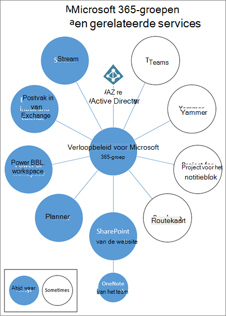
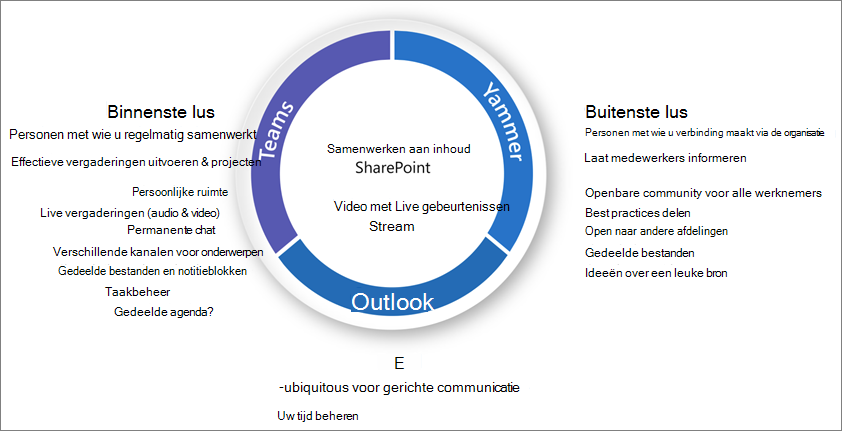

# Wat is samenwerkingsbeheer?

Samenwerkingsbeheer is hoe u de toegang van gebruikers tot resources, naleving van uw bedrijfsstandaarden en de beveiliging van uw gegevens beheert.

Organisaties gebruiken vandaag de dag een diverse set hulpprogramma's. Er is het team van ontwikkelaars dat teamchat gebruikt, de leidinggevenden die e-mail verzenden en de hele organisatie die verbinding maakt via sociaal ondernemen. Er worden meerdere samenwerkingshulpmiddelen gebruikt omdat elke groep uniek is en zijn eigen functionele behoeften en werkstijl heeft. Sommige gebruiken alleen e-mail, terwijl anderen voornamelijk in chat zullen wonen. 

Als gebruikers vinden dat de it-hulpprogramma's niet aan hun behoeften voldoen, downloaden ze waarschijnlijk hun favoriete consumenten-app die hun scenario's ondersteunt. Hoewel dit proces gebruikers in staat stelt snel aan de slag te gaan, leidt dit tot een frustrerende gebruikerservaring in de hele organisatie met meerdere aanmeldingen, problemen met delen en geen enkele locatie om inhoud te bekijken. Dit concept wordt 'Schaduw-IT' genoemd en vormt een aanzienlijk risico voor organisaties. Het vermindert de mogelijkheid om gebruikerstoegang op een uniforme manier te beheren, beveiliging en servicevereisten te waarborgen.

Services zoals Microsoft 365-groepen, Teams en Yammer bieden gebruikers meer mogelijkheden en verkleinen het risico op schaduw-IT door de benodigde hulpmiddelen te bieden om samen te werken. Microsoft 365 beschikt over een uitgebreide set hulpprogramma's voor het implementeren van beheermogelijkheden die uw organisatie mogelijk nodig heeft. 

In deze reeks artikelen krijgt u inzicht in de interactie tussen groepen, teams en SharePoint-instellingen, welke beheermogelijkheden beschikbaar zijn en hoe u een beheerplan maakt en implementeert voor de samenwerkingsfuncties in Microsoft 365.

### Veilige samenwerking met Microsoft 365 instellen

Er zijn veel opties voor het implementeren van Microsoft 365 Groepen en Teams voor veilige samenwerking in uw organisatie. We raden u aan deze beheerinhoud te gebruiken naast Veilige samenwerking met [Microsoft 365](setup-secure-collaboration-with-teams.md) en de bijbehorende artikelen instellen om de beste samenwerkingsoplossing voor uw organisatie te maken.

### Data-ingezetenschap

Als uw organisatie multi-national is en u vereisten hebt voor gegevenslocatie voor verschillende regio's, kunt u [Microsoft 365 Multi-Geo](/microsoft-365/enterprise/microsoft-365-multi-geo) opnemen als onderdeel van uw samenwerkingsplan.

## Waarom Microsoft 365-groepen belangrijk zijn

Met Microsoft 365-groepen kunt u een set personen kiezen met wie u wilt samenwerken en eenvoudig een verzameling bronnen instellen die deze personen kunnen delen. Als u leden toevoegt aan de groep, worden automatisch de benodigde machtigingen verleend aan alle activa die door de groep worden geleverd. Teams en Yammer gebruiken Microsoft 365-groepen om hun lidmaatschap te beheren.

Microsoft 365-groepen bevatten een suite met gekoppelde resources die gebruikers kunnen gebruiken voor communicatie en samenwerking. Groepen bevatten altijd een SharePoint-site, Planner, een Power BI-werkruimte, een postvak en agenda en Stream. Afhankelijk van hoe u de groep maakt, kunt u desgewenst andere services toevoegen, zoals Teams, Yammer en Project.

|Resource|Beschrijving|
|:------|:----------|
|[Agenda](https://support.office.com/article/schedule-a-meeting-on-a-group-calendar-in-outlook-0cf1ad68-1034-4306-b367-d75e9818376a)|Voor het plannen van gebeurtenissen met betrekking tot de groep|
|[Postvak IN](https://support.office.com/article/have-a-group-conversation-in-outlook-a0482e24-a769-4e39-a5ba-a7c56e828b22)|Voor e-mailgesprekken tussen groepsleden. Dit Postvak IN heeft een e-mailadres en kan worden ingesteld voor het accepteren van berichten van personen buiten de groep en zelfs van buiten uw organisatie, net als een traditionele distributielijst.|
|[OneNote-notitieblok](https://support.office.com/article/get-started-with-onenote-e768fafa-8f9b-4eac-8600-65aa10b2fe97)|Voor het verzamelen van ideeën, onderzoek en informatie|
|[Planner](https://support.office.com/article/microsoft-planner-help-4a9a13c6-3adf-4a60-a6fc-15c0b15e16fc)|Voor het toewijzen en beheren van projecttaken onder uw groepsleden|
|[Power BI Workspace](https://docs.microsoft.com/power-bi/collaborate-share/service-new-workspaces)|Een ruimte voor gegevenssamenwerking met dashboards en rapporten|
|[Project en routekaart](https://support.microsoft.com/project)|Webgebaseerde hulpprogramma's voor projectmanagement|
|[SharePoint-teamsite](https://support.office.com/article/what-is-a-sharepoint-team-site-75545757-36c3-46a7-beed-0aaa74f0401e)|Een centrale opslagplaats voor informatie, koppelingen en inhoud met betrekking tot uw groep|
|[Stream](https://support.microsoft.com/microsoft-stream)|Een videostreamingservice|
|[Teams](https://support.microsoft.com/teams)|Een chatwerkruimte in Microsoft 365|
|[Yammer-groep](https://support.office.com/article/Learn-about-Office-365-groups-b565caa1-5c40-40ef-9915-60fdb2d97fa2)|Een veelgebruikte plek om gesprekken te voeren en informatie te delen|

Microsoft 365 Groepen bevat diverse beheerbesturingselementen, waaronder een verloopbeleid, naamgevingsconventies en een beleid voor geblokkeerde woorden, om u te helpen bij het beheren van groepen in uw organisatie. Omdat groepen het lidmaatschap en de toegang tot deze reeks resources beheren, is het beheren van groepen een belangrijk onderdeel van de samenwerking in Microsoft 365.

## Een samenwerkingsstrategie voor uw organisatie definiëren

Er zijn meerdere locaties om samen te werken en gesprekken te voeren in Microsoft 365. Als u weet waar gebruikers gesprekken kunnen starten, kunt u een strategie voor communicatie definiëren.

Microsoft 365 ondersteunt drie belangrijke communicatiemethoden:

- Outlook: samenwerking via e-mail met een gedeeld postvak IN en agenda van een groep
- Microsoft Teams: een werkruimte op basis van permanente chats waar u informele, realtime gesprekken kunt voeren rond een verscheidenheid aan onderwerpen, georganiseerd door specifieke subgroepen
- Yammer: sociale ervaring voor ondernemingen voor samenwerking

- Teams: werkruimte op basis van chats (samenwerking met hoge snelheid) – inner loop
  - Ontworpen voor samenwerking met de personen met wie uw gebruikers elke dag werken
  - Stelt informatie binnen handbereik van gebruikers in één ervaring
  - Tabbladen, verbindingslijnen en bots toevoegen
  - Livechat, audio-/videovergaderingen, opgenomen vergaderingen

- Yammer: connect across the org (enterprise social) – outer loop
  - Praktijkgemeenschappen: functionele groepen personen die een gemeenschappelijk belang of expertise delen, maar niet per se dagelijks samenwerken
  - Verbinding met leiderschap, leergemeenschappen, op rollen gebaseerde community's

- Postvak en agenda (samenwerking per e-mail)
  - Gebruikt voor gerichte communicatie met een groep personen
  - Gedeelde agenda voor vergaderingen met andere groepsleden
 
Terwijl u bepaalt hoe u samenwerkingsfuncties in Microsoft 365 wilt gebruiken, moet u rekening houden met deze communicatiemethoden en welke gebruikers waarschijnlijk in verschillende scenario's zullen gebruiken.

> [!NOTE]
> Wanneer een nieuwe Office 365-groep wordt gemaakt via Yammer of Teams, is de groep niet zichtbaar in Outlook of het adresboek, omdat de primaire communicatie tussen deze gebruikers in hun respectieve clients gebeurt. Yammer-groepen kunnen niet worden verbonden met Teams.

## Aanbevolen procedures

Houd rekening met deze best practices wanneer u aan het beheerplanningsproces begint:

- **Praat met uw gebruikers:** identificeer uw grootste gebruikers van samenwerkingsfuncties en vergader met hen om hun belangrijkste bedrijfsvereisten te begrijpen en scenario's te gebruiken.

- **Risico's en voordelen** in balans brengen: bekijk uw zakelijke, wettelijke, wettelijke en compliancebehoeften en plan een oplossing die voor alle resultaten wordt geoptimaliseerd.

- **Pas u aan** aan verschillende organisaties en verschillende typen inhoud en scenario's: houd rekening met de verschillende behoeften voor verschillende groepen of afdelingen en verschillende soorten inhoud, zoals intranetinhoud ten opzichte van oneDrive-inhoud van een gebruiker.

- **Lijn af op zakelijke prioriteiten:** met zakelijke doelstellingen kunt u bepalen hoeveel tijd en energie u nodig hebt om te investeren in beheer.

- **Beheerbeslissingen rechtstreeks insluiten in** de oplossingen die u maakt: veel beheerbeslissingen kunnen worden geïmplementeerd door functies in Microsoft 365 in of uit te schakelen.

- **Een gefaseerd aanpak gebruiken:** rol samenwerkingsfuncties eerst uit naar een kleine groep gebruikers. Krijg feedback van hen, let op helpdesktickets en werk de benodigde instellingen of processen bij voordat u naar een grotere groep gaat.

- **Versterken met training:** pas oplossingen aan zoals [Microsoft 365-leerpaden](https://docs.microsoft.com/office365/customlearning) om ervoor te zorgen dat uw organisatiespecifieke verwachtingen worden versterkt met door Microsoft verstrekte training.

- **Hebt u een strategie** voor het communiceren van beheerbeleid en -richtlijnen in uw organisatie: maak een Microsoft 365 Adoption Center op een SharePoint-communicatiesite om beleid en procedures te communiceren.

- **Definieer** rollen en verantwoordelijkheden: identificeer uw kernteam voor governance en neem eerst belangrijke beslissingen over het inrichten en benoemen van namen en externe toegang en werk vervolgens door de resterende beslissingen.

- **Bekijk uw beslissingen opnieuw als zakelijke en technologische wijzigingen:** kom regelmatig bijeen om nieuwe mogelijkheden en nieuwe zakelijke verwachtingen te bekijken.

Lees Uw samenwerkingsplan maken voor meer informatie over deze [procedures.](collaboration-governance-first.md)

## Impact van eindgebruikers en wijzigingsbeheer

Omdat groepen en teams op verschillende manieren kunnen worden gemaakt, raden we u aan uw gebruikers te trainen om de methode te gebruiken die het beste bij uw organisatie past:

- Als uw organisatie de meeste communicatie via e-mail doet, instrueert u uw gebruikers om groepen te maken in Outlook.
- Als uw organisatie sharePoint intensief gebruikt of on-premises migreert vanuit SharePoint, geeft u uw gebruikers de opdracht om SharePoint-teamsites te maken voor samenwerking.
- Als uw organisatie Teams heeft geïmplementeerd, geeft u uw gebruikers de opdracht een team te maken wanneer ze een samenwerkingsruimte nodig hebben.

Dit helpt verwarring te voorkomen als gebruikers niet bekend zijn met de relatie tussen groepen en hun gerelateerde services. Zie Microsoft [365 Groepen](../admin/create-groups/explain-groups-knowledge-worker.md)uitleggen aan uw gebruikers voor meer informatie over het praten met uw gebruikers over groepen.

## Belangrijke beheermogelijkheden en licentievereisten

Beheermogelijkheden voor samenwerking in Microsoft 365 omvatten functies in Microsoft 365, Teams, SharePoint en Azure Active Directory.

| Functie | Beschrijving | Licenties |
|:----------------------|:------------|:----------|
|Team- en site delen|Bepalen of teams, groepen en sites kunnen worden gedeeld met personen buiten uw organisatie.|Microsoft 365 E5 of E3|
|Domein toestaan/blokkeren|Deel delen met personen buiten uw organisatie beperken tot personen van specifieke domeinen.|Microsoft 365 E5 of E3|
|Selfservicesite maken|Toestaan of voorkomen dat gebruikers hun eigen SharePoint-sites maken.|Microsoft 365 E5 of E3|
|Beperkte site- en bestandsdeling|Het delen van site, bestanden en mappen beperken tot leden van een specifieke beveiligingsgroep.|Microsoft 365 E5 of E3|
|Beperkte groepscreatie|Het maken van teams en groepen beperken tot leden van een specifieke beveiligingsgroep.|Microsoft 365 E5 of E3 met Azure AD Premium- of Azure AD Basic EDU-licenties|
|Groepsbeleid voor naamgeving|Voorvoegsels of achtervoegsels afdwingen voor groeps- en teamnamen.|Microsoft 365 E5 of E3 met Azure AD Premium- of Azure AD Basic EDU-licenties|
|Verloopbeleid groep|Stel inactieve groepen en teams zo in dat ze verlopen en worden verwijderd na een bepaalde periode.|Microsoft 365 E5 of E3 met Azure AD Premium-licenties|
|Gasttoegang per groep|Toestaan of voorkomen dat team- en groep delen met personen buiten uw organisatie per groep.|Microsoft 365 E5 of E3|

## Planning van samenwerkingsbeheer stap voor stap

Volg de volgende basisstappen om uw beheerplan te maken:

1. Houd rekening met belangrijke bedrijfsdoelen en -processen: [maak uw beheerplan](collaboration-governance-first.md) om aan de behoeften van uw bedrijf te voldoen.
2. Informatie over instellingen in services: instellingen in groepen [en SharePoint](groups-sharepoint-governance.md) werken met elkaar samen, net als instellingen [in groepen, SharePoint en Teams](groups-sharepoint-teams-governance.md) en andere [services.](groups-services-interactions.md) Zorg ervoor dat u deze interacties begrijpt terwijl u uw beheerstrategie plant.
3. Plan het beheren van gebruikerstoegang: plan het toegangsniveau dat u gebruikers wilt verlenen [in groepen, SharePoint en Teams.](groups-teams-access-governance.md)
4. Plan om compliance-instellingen te beheren: bekijk de beschikbare [complianceopties voor Microsoft 365-groepen, Teams en SharePoint-samenwerking.](groups-teams-compliance-governance.md)
5. Plan het beheren van communicatie: bekijk de beschikbare [opties voor communicatiebeheer voor samenwerkingsscenario's.](groups-teams-communication-governance.md)
6. Plan organisatie- en levenscyclusbeheer: kies het beleid dat u wilt gebruiken voor het maken van groepen en [teams, naamgeving, verloop en archivering.](plan-organization-lifecycle-governance.md) Lees ook het [einde van de levenscyclusopties voor groepen, teams en Yammer](end-life-cycle-groups-teams-sites-yammer.md)

## Training voor beheerders

Deze trainingsmodules van Microsoft Learn kunnen u helpen bij het leren van de beheerfuncties in Microsoft 365.

#### Gegevensbescherming

|Training:|Informatiebeveiliging en beheer beheren|
|:---|:---|
||De hoeveelheid gegevens die vandaag wordt gegenereerd, groeit sneller dan ooit, werknemers willen overal aan het werk en het regelgevingslandschap verandert voortdurend. De oplossingen van Microsoft voor informatiebeveiliging en beheer helpen organisaties om de juiste balans te vinden tussen het beschermen van hun gegevens en hun mensen productief. Met dit leerpad kunt u zich voorbereiden op de certificeringen Microsoft 365 Certified: Security Administrator Associate en Microsoft 365 Certified: Enterprise Administration Expert.  5 uur 13 min - Leerpad - 7 modules|

> [!div class="nextstepaction"]
> [Start >](https://docs.microsoft.com/learn/modules/m365-compliance-information-governance/introduction/)

  

|Training:|Bedrijfsgegevens beveiligen met Microsoft 365|
|:---|:---|
||Het beveiligen en beveiligen van de gegevens van uw organisatie is lastiger dan ooit. In het leerpad Ondernemingsgegevens beveiligen met Microsoft 365 wordt besproken hoe u uw gevoelige informatie kunt beschermen tegen onbedoelde overbelasting of misbruik, hoe u gegevens kunt ontdekken en classificeren, hoe u deze kunt beschermen met gevoeligheidslabels en hoe u uw gevoelige gegevens kunt bewaken en analyseren om te beschermen tegen verlies. Met dit leerpad kunt u zich voorbereiden op de certificeringen Microsoft 365 Certified: Security Administrator Associate en Microsoft 365 Certified: Enterprise Administration Expert..  1 uur - Leerpad - 5 modules|

> [!div class="nextstepaction"]
> [Start >](https://docs.microsoft.com/learn/modules/m365-security-info-overview/introduction/)

#### Beveiliging en compliance

|Training:|Fundamentele kennis van de beveiligings- en compliancemogelijkheden van Microsoft 365 demonstreren|
|:---|:---|
||Meer informatie over de beveiligings- en complianceoplossingen van Microsoft 365 en de mogelijkheden die beschikbaar zijn om ondernemingen te helpen hun bedrijf te beveiligen en te voldoen aan wettelijke vereisten. Als u niet bekend bent met basisconcepten voor cloud computing, raden we u aan [cloudconcepten - Principes van cloud computing - te gebruiken.](https://docs.microsoft.com/learn/modules/principles-cloud-computing/index)  3 uur 11 min - Leerpad - 8 modules|

> [!div class="nextstepaction"]
> [Start >](https://docs.microsoft.com/learn/modules/what-is-m365/1-introduction/)

## Illustraties

Met deze illustraties krijgt u inzicht in de interactie tussen groepen en teams met andere services in Microsoft 365 en welke beheer- en compliancefuncties beschikbaar zijn om u te helpen bij het beheren van deze services in uw organisatie.

### Groepen in Microsoft 365 voor IT-architecten
Wat IT-architecten moeten weten over Microsoft 365-groepen

|**Item**|**Beschrijving**|
|:-----|:-----|
|   [PDF](https://github.com/MicrosoftDocs/microsoft-365-docs/raw/public/microsoft-365/downloads/msft-m365-groups.pdf) \| [Visio](https://github.com/MicrosoftDocs/OfficeDocs-Enterprise/raw/live/Enterprise/downloads/msft-m365-groups.vsdx)   Laatst bijgewerkt: juni 2019|Deze illustraties tonen verschillende soorten groepen, hoe ze worden gemaakt en beheerd, en enkele aanbevelingen voor beheer.|

### Microsoft Teams en gerelateerde productiviteitsservices in Microsoft 365 voor IT-architecten
De logische architectuur van productiviteitsservices in Microsoft 365, geleid door Microsoft Teams.

|**Item**|**Beschrijving**|
|:-----|:-----|
|   [PDF](https://github.com/MicrosoftDocs/microsoft-365-docs/raw/public/microsoft-365/downloads/msft-m365-teams-logical-architecture.pdf) \| [Visio](https://github.com/MicrosoftDocs/OfficeDocs-Enterprise/raw/live/Enterprise/downloads/msft-m365-teams-logical-architecture.vsdx)   Laatst bijgewerkt: april 2019   |Microsoft biedt een pakket met productiviteitsservices die samenwerken met behulp van functies voor gegevensbeheer, beveiliging en compliance.    Deze reeks illustraties biedt een overzicht van de logische architectuur van productiviteitsservices voor ondernemingsarchitecten, geleid door Microsoft Teams.|

### Microsoft 365-informatiebeveiligings- en compliancemogelijkheden

Microsoft 365 bevat een breed scala aan mogelijkheden voor informatiebeveiliging en compliance. Samen met de productiviteitshulpprogramma's van Microsoft zijn deze mogelijkheden ontworpen om organisaties te helpen in realtime samen te werken terwijl ze zich houden aan strikte regelgevingskaders. 

Deze reeks illustraties maakt gebruik van een van de meest gereguleerde bedrijfstakken, financiële services, om aan te tonen hoe deze mogelijkheden kunnen worden toegepast om te voldoen aan gemeenschappelijke wettelijke vereisten. U kunt deze illustraties aan uw eigen wensen aanpassen. 

| Item | Beschrijving |
|:-----|:-----|
|   Engels: [Downloaden als PDF](https://download.microsoft.com/download/3/a/6/3a6ab1a3-feb0-4ee2-8e77-62415a772e53/m365-compliance-illustrations.pdf)\| [Downloaden als Visio  ](https://download.microsoft.com/download/3/a/6/3a6ab1a3-feb0-4ee2-8e77-62415a772e53/m365-compliance-illustrations.vsdx)   Japans: [Downloaden als PDF](https://download.microsoft.com/download/6/f/1/6f1a7d0e-dd8e-442e-b073-8e94327ae4f8/m365-compliance-illustrations.pdf)\| [Downloaden als Visio  ](https://download.microsoft.com/download/6/f/1/6f1a7d0e-dd8e-442e-b073-8e94327ae4f8/m365-compliance-illustrations.vsdx)   Laatst bijgewerkt: november 2020|Omvat: <ul><li>  Microsoft informatiebescherming en preventie van gegevensverlies</li><li>Bewaarbeleid en retentielabels </li><li>Informatiebelemmeringen</li><li>Communicatiecompliance</li><li>Insider-risico</li><li>Gegevens ingestie van derden</li>|

## Vergadersessies

Bekijk deze vergaderingssessies voor meer informatie over beheer voor Microsoft 365 Groepen en Teams.

**Fundamentals**

Leer de basisprincipes en nieuwe innovaties in Microsoft 365 Groepen, waaronder beheer en beheer op schaal, best practices voor het stimuleren van gebruik en acceptatie en selfservice.

- [Microsoft 365-groepen omarmen](https://www.youtube.com/watch?v=dAamBF1gb7M)

**Beheermodel**

Lees hoe u de levenscyclus van uw groepen kunt instellen, naamgevingsbeleid, classificatielabels, samenwerking met externe gasten en machtigingen voor het maken van groepen kunt beheren.

- [Samenwerking transformeren en schaduw-IT bestrijden met Office 365-groepen](https://www.youtube.com/watch?v=Bhf_bKx3lAg)

**Voorbeeld van klant**

Bekijk een voorbeeld achter de schermen van hoe Microsoft 365 Groepen, SharePoint, Teams en Yammer samenwerken om een wereldwijd samenwerkingsplatform te bieden.

- [Uw samenwerking zoeken met Office 365 Groepen, SharePoint, Teams en Yammer](https://www.youtube.com/watch?v=Rx9eVwqXeQk)

## Zie ook

[Documentatie over Microsoft 365-beveiliging](https://docs.microsoft.com/microsoft-365/security)

[Microsoft 365-compliancedocumentatie](https://docs.microsoft.com/microsoft-365/compliance)
