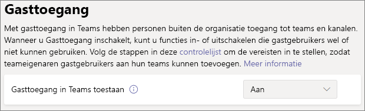

# Teams met basisbescherming configurerenConfigure teams with baseline protection

In dit artikel leest u hoe u teams met een basisbescherming kunt implementeren.In this article, we look at how to deploy teams with a baseline level of protection. Gebruikers kunnen bij een basisbescherming een groot aantal opties voor samenwerking gebruiken terwijl het beheer van machtigingen wordt verbeterd en er beveiliging tegen te veel delen wordt geboden.This level allows users a wide range of options for collaboration while enhancing permissions management and providing basic protection against oversharing. Aanbevolen beveiliging voor de basisbescherming bestaat onder andere uit beleidsregels voor apparaattoegang en beveiliging tegen malware.Recommended protections for this level include identity and device access policies and protection against malware. Daarnaast kunt u eventueel beleid voor voorwaardelijke toegang en bescherming tegen gegevensverlies toepassen.Additionally, you can apply conditional access policies and data loss protections as needed.

## Initiële beschermingInitial protections

Als eerste stap wordt u aangeraden basisbeleid voor identiteiten en apparaattoegang te configureren.As a first step, we recommend that you configure basic identity and device-access policies. Zie [Beleidsaanbevelingen voor het beveiligen van Teams-chats, -groepen en -bestanden](../security/office-365-security/teams-access-policies.md) voor meer informatie.See [Policy recommendations for securing Teams chats, groups, and files](../security/office-365-security/teams-access-policies.md) for details.

We raden u ook aan de basisfuncties van Defender voor Office 365 in te schakelen voor de bescherming tegen malware in documenten, bijlagen en koppelingen.We also recommend turning on basic Defender for Office 365 features to guard against malware in documents, attachments, and links. We adviseren u om de opties in de volgende tabel in te schakelen.We recommend turning on each of the options in the following table.

|OptieOption|InformatieInformation|
|:------|:-----------|
|Veilige bijlagen voor SPO, OneDrive en TeamsSafe Attachments for SPO, OneDrive and Teams|[Veilige bijlagenSafe Attachments](https://docs.microsoft.com/microsoft-365/security/office-365-security/atp-safe-attachments) [Defender voor Office 365 - SharePoint, OneDrive en Microsoft TeamsDefender for Office 365 - SharePoint, OneDrive, and Microsoft Teams](https://docs.microsoft.com/microsoft-365/security/office-365-security/atp-for-spo-odb-and-teams)|
|Veilige documentenSafe Documents|[Veilige documenten in Microsoft Defender voor Office 365Safe Documents in Microsoft Defender for Office 365](https://docs.microsoft.com/microsoft-365/security/office-365-security/safe-docs)|
|Veilige koppelingen voor TeamsSafe Links for Teams|[Veilige Office 365-koppelingen in TeamsOffice 365 Safe Links in Teams](https://docs.microsoft.com/microsoft-365/security/office-365-security/atp-safe-links-for-teams) [Veilige koppelingenSafe Links](https://docs.microsoft.com/microsoft-365/security/office-365-security/atp-safe-links)|

## Delen met gasten in TeamsTeams guest sharing

In elk van de lagen kan er worden gedeeld met personen buiten uw organisatie.In each of the tiers, we have the option of sharing with people outside your organization. Voor de gevoelige en zeer gevoelige lagen kan het delen met gasten worden uitgeschakeld op teamniveau door gevoeligheidslabels te gebruiken.For the sensitive and highly sensitive tiers, we will have the option to turn guest sharing off at the team level by using sensitivity labels. Maar de instelling voor het delen met gasten op organisatieniveau moet zijn ingeschakeld om het delen met gasten in Teams te kunnen laten werken.But the organization-level guest sharing setting must be turned on for guest sharing to work at all in Teams.

Instellingen voor gasttoegang in Teams instellenTo set Teams guest access settings

1. Meld u aan bij het Microsoft 365-beheercentrum op [https://admin.microsoft.com](https://admin.microsoft.com).Log in to the Microsoft 365 admin center at [https://admin.microsoft.com](https://admin.microsoft.com).
2. Klik in het navigatievenster aan de linkerkant op **Alles weergeven**.In the left navigation, click **Show all**.
3. Klik onder **Beheercentra** op **Teams**.Under **Admin centers**, click **Teams**.
4. Vouw in het Teams-beheercentrum in het linkernavigatievenster **Instellingen voor hele organisatie** uit en klik vervolgens op **Gasttoegang**.In the Teams admin center, in the left navigation, expand **Org-wide settings** and click **Guest access**.
5. Zorg ervoor dat **Gasttoegang in Teams toestaan** is ingesteld op **Aan**.Ensure that **Allow guest access in Teams** is set to **On**.
6. Breng de gewenste wijzigingen aan in de extra gastinstellingen en klik vervolgens op **Opslaan**.Make any desired changes to the additional guest settings, and then click **Save**.

> [!NOTE]
> Het kan 24 uur duren voordat de instelling voor gasten in Teams actief wordt nadat u deze hebt ingeschakeld.It may take up to twenty-four hours for the Teams guest setting to become active after you turn it on.

Delen met gasten is standaard ingeschakeld voor Office 365-groepen en SharePoint, maar als u eerder een van de instellingen voor het delen met gasten hebt gewijzigd voor uw organisatie, wordt u aangeraden [Samenwerken met gasten in een team](https://docs.microsoft.com/microsoft-365/solutions/collaborate-as-team) te controleren om ervoor te zorgen dat de functie voor het delen met gasten beschikbaar is in Teams.Guest sharing is turned on by default for Office 365 groups and SharePoint, however if you have previously changed any of the guest sharing settings for your organization, we recommend that you review [Collaborate with guests in a team](https://docs.microsoft.com/microsoft-365/solutions/collaborate-as-team) to ensure that guest sharing will be available in Teams.

## Sites en bestanden delenSite and file sharing

Als u het risico van het onbedoeld delen van bestanden of mappen met personen buiten uw organisatie wilt beperken, kunt u het beste de standaardkoppeling voor delen voor SharePoint wijzigen in *Alleen personen in uw organisatie*.To reduce the risk of accidentally sharing files or folders with people outside your organization, we recommend changing the default sharing link for SharePoint to *Only people in your organization*. (Als gebruikers extern moeten kunnen delen en u het delen met gasten hebt ingeschakeld, kunnen ze het koppelingstype nog steeds wijzigen wanneer ze delen.)(If users need to share externally, and you have enabled guest sharing, they can still change the link type when they share.)

De standaardkoppeling voor delen wijzigenTo change the default sharing link
1. Open het [SharePoint-beheercentrum](https://admin.microsoft.com/sharepoint).Open the [SharePoint admin center](https://admin.microsoft.com/sharepoint).
2. Klik onder **Beleid** op **Delen**.Under **Policies**, click **Sharing**.
3. Selecteer onder **Koppelingen naar bestanden en mappen** de optie **Alleen personen binnen uw organisatie**.Under **File and folder links**, select **Only people in your organization**.
4. Klik op **Opslaan**.Click **Save**.

Voor de beste ervaring voor het delen met gasten wordt u ook aangeraden om [SharePoint- en OneDrive-integratie met Azure AD B2B](https://docs.microsoft.com/sharepoint/sharepoint-azureb2b-integration-preview) in te schakelen.For the best guest sharing experience, we also recommend that you enable [SharePoint and OneDrive integration with Azure AD B2B](https://docs.microsoft.com/sharepoint/sharepoint-azureb2b-integration-preview).

## Een team makenCreate a team

Er wordt een extra configuratie uitgevoerd voor de basisbescherming in de SharePoint-site die is gekoppeld aan een team.Additional configuration for the baseline level of protection is done in the SharePoint site associated with a team. [Maak een openbaar of persoonlijk team](https://support.office.com/article/174adf5f-846b-4780-b765-de1a0a737e2b) voordat u verder gaat met de volgende sectie.[Create a public or private team](https://support.office.com/article/174adf5f-846b-4780-b765-de1a0a737e2b) before proceeding to the next section.

## Instellingen voor het delen van een siteSite sharing settings

Leden van een SharePoint-site kunnen standaard anderen uitnodigen voor de site.By default, members of a SharePoint site can invite others to the site. Wanneer een site deel uitmaakt van een team, worden teamleden opgenomen als siteleden.When a site is part of a team, team members are included as site members. Personen die rechtstreeks aan de site worden toegevoegd, hebben echter geen toegang tot de rest van het team.However, people added directly to the site don't have access to the rest of the team. Om deze reden wordt u aangeraden machtigingen uitsluitend te beheren via het team.For this reason, we recommend managing permissions exclusively through the team.

Om u te helpen bij het beheer van machtigingen wordt u aangeraden de bijbehorende site zo te configureren dat alleen eigenaren zelf de site mogen delen.To help with permissions management, we recommend configuring the associated site to only allow owners to share the site by itself. Dit vereenvoudigt het beheer van machtigingen en helpt voorkomen dat anderen toegang krijgen zonder dat de eigenaar hiervan op de hoogte is.This simplifies permissions management and helps prevent access by people without a team owner's knowledge. Doe dit voor elk team waarvoor basisbescherming is vereist.Do this for each team that requires baseline protection.

De instellingen voor het delen van een site bijwerkenTo update the site sharing settings
1. Klik op de werkbalk van het team op **Bestanden**.In the tool bar for the team, click **Files**.
2. Klik op **Openen in SharePoint**.Click **Open in SharePoint**.
3. Klik op de werkbalk van de SharePoint-site op het pictogram Instellingen en vervolgens op **Sitemachtigingen**.In the tool bar of the SharePoint site, click the settings icon, and then click **Site permissions**.
4. Klik in het deelvenster **Sitemachtigingen** onder **Instellingen voor delen** op **Instellingen voor delen wijzigen**.In the **Site permissions** pane, under **Sharing settings**, click **Change sharing settings**.
5. Selecteer onder **Machtigingen voor delen** de optie **Site-eigenaren en leden, en personen met machtigingen voor bewerken kunnen bestanden en mappen delen, maar alleen site-eigenaren kunnen de site delen** en klik vervolgens op **Opslaan**.Under **Sharing permissions**, choose **Site owners and members, and people with Edit permissions can share files and folders, but only site owners can share the site**, and then click **Save**.

## Aanvullende beveiligingsmaatregelenAdditional protections

Microsoft 365 biedt aanvullende methoden voor het beveiligen van uw inhoud.Microsoft 365 offers additional methods for securing your content. Overweeg of de volgende opties de beveiliging van uw organisatie zouden kunnen verbeteren.Consider if the following options would help improve security for your organization.

- Laat uw gastgebruikers akkoord gaan met de [gebruiksrechtenovereenkomst](https://docs.microsoft.com/azure/active-directory/conditional-access/terms-of-use).Have guests agree to a [terms of use](https://docs.microsoft.com/azure/active-directory/conditional-access/terms-of-use).
- Configureer een [beleid voor de time-out van een sessie](https://docs.microsoft.com/azure/active-directory/conditional-access/howto-conditional-access-session-lifetime) voor gasten.Configure a [session timeout policy](https://docs.microsoft.com/azure/active-directory/conditional-access/howto-conditional-access-session-lifetime) for guests.
- Maak [typen voor gevoelige informatie](https://docs.microsoft.com/microsoft-365/compliance/custom-sensitive-info-types) en gebruik [gegevensverliesbeveiliging](https://docs.microsoft.com/microsoft-365/compliance/data-loss-prevention-policies) om beleid in te stellen rond toegang tot gevoelige informatie.Create [sensitive information types](https://docs.microsoft.com/microsoft-365/compliance/custom-sensitive-info-types) and use [data loss protection](https://docs.microsoft.com/microsoft-365/compliance/data-loss-prevention-policies) to set policies around accessing sensitive information.

## Zie ookSee Also

[Vergaderingsbeleid beheren in TeamsManage meeting policies in Teams](https://docs.microsoft.com/microsoftteams/meeting-policies-in-teams)

[Aan de slag met insider-risicobeheerGet started with insider risk management](https://docs.microsoft.com/microsoft-365/compliance/insider-risk-management-configure)
