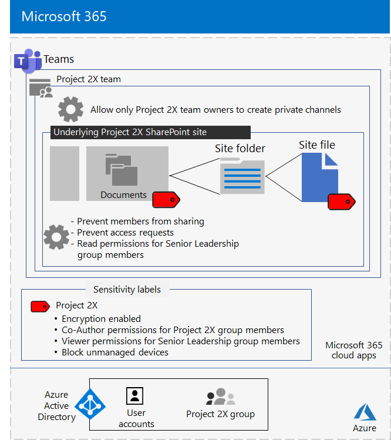

# Geïsoleerd team voor een topgeheim project van de Contoso Corporation

Nadat de CEO van Contoso een executive offsite had gemaakt, heeft de CEO van Contoso opdracht gegeven een nieuwe suite met producten en services te ontwikkelen die de winst van Contoso in de komende vijf jaar zou kunnen verdubbelen. Het topgeheime project voor het ontwikkelen van het bedrijfs-, technische en marktplan kreeg de naam **Project 2X** en belangrijke personeelsleden in het hele bedrijf zijn aangeworven. 

De tijdlijnen voor onderzoek en ontwikkeling waren strak, wat betekent dat de samenwerking efficiënt moest zijn en veilige vergaderingen, lopende gesprekken en bestandsopslag moest bieden.

De resulterende producten voor Project 2X waren bedrijfsplannen, product- en technische specificaties en marketingmaterialen en -planningen in de vorm van Word-, Excel- en PowerPoint-bestanden. 

Vanwege hun gevoelige aard waren de volgende bestanden toegankelijk:

- Beperkt tot Project 2X-teamleden en senior leidinggevenden.
- Versleuteld en beveiligd met machtigingen om alleen toegang toe te staan aan Project 2X-teamleden en senior leidinggevenden, zelfs als de bestanden buiten hun beveiligde mappen zijn gedistribueerd.

It-medewerkers van Contoso hebben een [team gebruikt met beveiligingsisolatie](secure-teams-security-isolation.md) voor Project 2X en deze stappen.

## Stap 1: Een privéteam gemaakt

Om de toegang tot de onderliggende SharePoint-site voor het team te beveiligen, hebben IT-beheerders van Contoso het aanbevolen [SharePoint-toegangsbeleid geconfigureerd.](../security/office-365-security/sharepoint-file-access-policies.md)

Vervolgens heeft een CONTOSO-IT-beheerder een nieuw privéteam met de naam Project 2X gemaakt en de gebruikersaccounts van Project 2X-medewerkers toegevoegd als leden. Ze hebben het team ook zo geconfigureerd dat alleen project 2X-teameigenaren privékanalen kunnen maken.

Zie Een privéteam maken voor de [configuratiegegevens.](secure-teams-security-isolation.md#create-a-private-team)

## Stap 2: Een gevoeligheidslabel gemaakt voor het Project 2X-team

Contoso-beheerders hebben een nieuw gevoeligheidslabel met de naam **Project 2X** gemaakt dat:

- Ingeschakelde versleuteling.
- Toegestane Co-Author voor de Project 2X Microsoft 365-groep.
- Machtigingen voor Viewer toegestaan voor de groep Senior Leadership.
- Geblokkeerde toegang tot niet-bemande apparaten.

Bestanden in de **sectie Documenten** van de onderliggende Project 2X SharePoint-site zijn beveiligd door:

- De sitemachtigingen, die alleen volledige machtigingen toestaan voor leden van de Project 2X Microsoft 365-groep en leesmachtigingen voor de groep Senior Leadership.
- Het gevoeligheidslabel Project 2X, met versleuteling en machtigingen die met het bestand worden verplaatst of gekopieerd van de site.

Zie Een gevoeligheidslabel maken voor de [configuratiedetails.](secure-teams-security-isolation.md#create-a-sensitivity-label)

## Stap 3: De onderliggende SharePoint-site configureren

Om de toegang tot de onderliggende SharePoint-site voor het team te beveiligen, hebben IT-beheerders van Contoso het aanbevolen [SharePoint-toegangsbeleid geconfigureerd.](../security/office-365-security/sharepoint-file-access-policies.md)

Vervolgens hebben ze aanvullende machtigingsinstellingen voor de site geconfigureerd:

- Om te voorkomen dat leden van de Project 2X-groep toegang tot de site kunnen delen. Zie SharePoint-instellingen voor een team met beveiligingsisolatie voor de [configuratiegegevens.](secure-teams-security-isolation.md#sharepoint-settings)
- Voor leesmachtigingen voor de groep Senior Leadership.

Vervolgens hebben ze aanvullende machtigingsinstellingen voor de site geconfigureerd om te voorkomen dat project 2X-groepsleden toegang tot de site kunnen delen. 

Aangezien er privékanalen voor Project 2X zijn gemaakt, heeft de groepseigenaar het delen van gasten uitgeschakeld en de standaardkoppeling voor delen ingesteld voor **de waarde Specifieke** personen.

Hier is de resulterende configuratie van het Project 2X-team met beveiligingsisolatie.

 ## Stap 4: Getrainde Project 2X-teamleden

De beveiligingsmedewerkers van Contoso hebben de Project 2X-teamleden opgeleid in een verplichte cursus waarin ze het volgende hebben geleerd:

- Toegang krijgen tot het nieuwe Project 2X-team, vergaderingen en chats gebruiken en samenwerken aan teambestanden.
- Nieuwe bestanden in het team maken en nieuwe bestanden uploaden die lokaal zijn gemaakt.
- Bestanden labelen met het gevoeligheidslabel project 2X.
- Een demonstratie van hoe het label Project 2X een bestand beschermt, zelfs wanneer het het team verlaat.

Het eindresultaat was een veilige omgeving waarin Project 2X-teamleden samenwerkten in een veilige omgeving voor chats, vergaderingen en bestanden.

Hier is een voorbeeld van een bestand dat is opgeslagen op de onderliggende Project 2X-site met het gevoeligheidslabel Project 2X toegewezen.

In een paar gevallen hebben project 2X-teamleden bestanden gedownload die zijn beveiligd met het label Project 2X naar een lokaal station voor offlinewerk. 

Nadat ze bij het openen van de referenties echter om referenties waren gevraagd, beseften ze hun fout en verwijderden ze ze.

Vanwege de samenwerkingsomgeving van Teams en de beveiligingsfuncties van Microsoft 365 zijn de details van Project 2X geheim gehouden gedurende de duur van het project. Contoso heeft haar plannen aangekondigd en is bezig met de uitrol van de nieuwe producten en services tot grote vreugde van haar klanten en investeerders en tot ergernis van haar concurrenten.

## Volgende stap

[Implementeer een team met beveiligingsisolatie](secure-teams-security-isolation.md) in uw organisatie.

