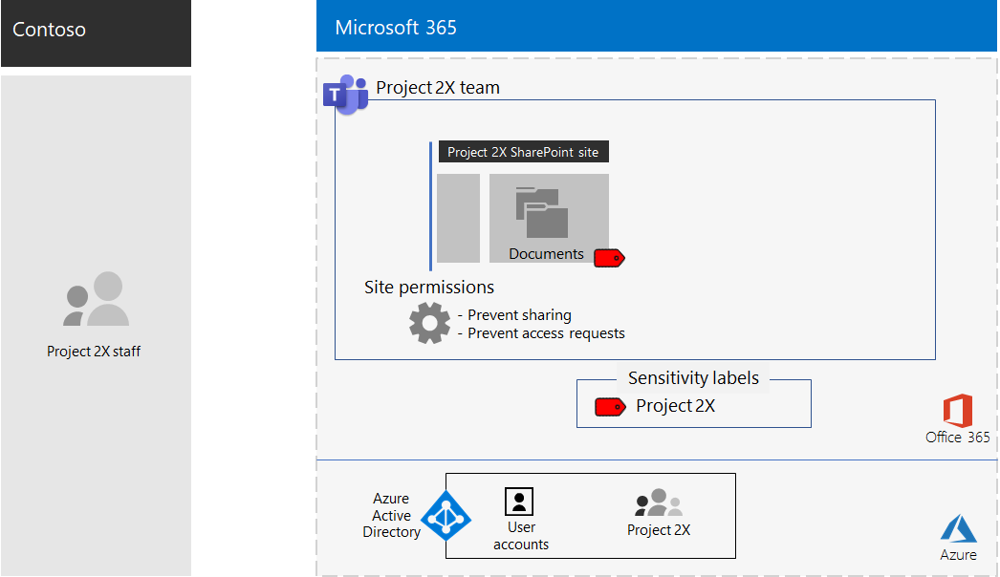

# Geïsoleerd team voor een topgeheim project van de Contoso Corporation

Na een executive offsite, Contoso's CEO beval de ontwikkeling van een nieuwe suite van producten en diensten die de winst van Contoso zou kunnen verdubbelen in de komende vijf jaar. Het topgeheime project voor de ontwikkeling van het bedrijfs-, engineering- en marktplan kreeg de naam **Project 2X** en belangrijke medewerkers in het hele bedrijf werden aangeworven. 

De tijdlijnen voor onderzoek en ontwikkeling waren strak, wat betekende dat samenwerking efficiënt moest zijn en moest zorgen voor veilige vergaderingen, lopende gesprekken en bestandsopslag.

De resulterende deliverables voor Project 2X waren bedrijfsplannen, product- en engineeringspecificaties en marketingmaterialen en -schema's in de vorm van Word-, Excel- en PowerPoint-bestanden. 

Vanwege hun gevoelige aard, de toegang tot deze bestanden waren:

- Beperkt tot Project 2X-teamleden.
- Versleuteld en beveiligd met machtigingen om alleen toegang te verlenen aan Project 2X-teamleden, zelfs als de bestanden buiten hun beveiligde mappen zijn gedistribueerd.

Het IT-personeel van Contoso maakte voor Project 2X en deze stappen gebruik van een [team met beveiligingsisolatie.](secure-teams-security-isolation.md)

## Stap 1: Een privéteam maken

Ten eerste, om de toegang tot de onderliggende SharePoint-site voor het team te beschermen, hebben De IT-beheerders van Contoso het [aanbevolen SharePoint-toegangsbeleid](../enterprise/sharepoint-file-access-policies.md)geconfigureerd.

Vervolgens heeft een It-beheerder van Contoso een nieuw privéteam met de naam Project 2X gemaakt en de gebruikersaccounts van Project 2X-medewerkers als leden toegevoegd.

Zie [Een privéteam maken](secure-teams-security-isolation.md#create-a-private-team)voor de configuratiegegevens.

## Stap 2: Een gevoeligheidslabel maken voor het Project 2X-team

Contoso-beheerders hebben een nieuw gevoeligheidslabel gemaakt met de naam **Project 2X** dat:

- Vereist versleuteling.
- Hiermee kunnen machtigingen voor co-auteur worden toegestaan voor de Project 2X Microsoft 365-groep.

Bestanden in de sectie **Documenten** van de onderliggende Project 2X SharePoint-site zijn beveiligd door:

- De sitemachtigingen, die alleen toegang geven tot leden van de Project 2X Microsoft 365-groep.
- Het label Voor de gevoeligheid van Project 2X, met versleuteling en machtigingen die met het bestand reizen als het wordt verplaatst of gekopieerd van de site.

Zie [Een gevoeligheidslabel maken](secure-teams-security-isolation.md#create-a-sensitivity-label)voor de configuratiedetails.

## Stap 3: De onderliggende SharePoint-site configureren

Ten eerste, om de toegang tot de onderliggende SharePoint-site voor het team te beschermen, hebben De IT-beheerders van Contoso het [aanbevolen SharePoint-toegangsbeleid](../enterprise/sharepoint-file-access-policies.md)geconfigureerd.

Vervolgens hebben ze extra machtigingsinstellingen voor de site geconfigureerd om te voorkomen dat Project 2X toegang tot de site deelt. Zie [SharePoint-instellingen voor een team met beveiligingsisolatie voor](secure-teams-security-isolation.md#sharepoint-settings)de configuratiegegevens.

Hier is de resulterende configuratie van het Project 2X-team.

 ## Stap 4: Getrainde Project 2X-teamleden

Contoso security medewerkers trainden de Project 2X teamleden in een verplichte cursus die hen door:

- Hoe u toegang krijgt tot het nieuwe Project 2X-team, vergaderingen en chats gebruiken en samenwerken aan teambestanden.
- Nieuwe bestanden maken in het team en nieuwe bestanden uploaden die lokaal zijn gemaakt.
- Een demonstratie van hoe het DLP-beleid blokkeert dat bestanden extern worden gedeeld.
- Bestanden labelen met het label Project 2X-gevoeligheid.
- Een demonstratie van hoe het Project 2X-label een bestand beschermt, zelfs wanneer het team verlaat.

Het eindresultaat was een veilige omgeving waarin Project 2X-teamleden samenwerkten in een veilige omgeving voor chats, vergaderingen en bestanden.

Hier vindt u een voorbeeld van een bestand dat is opgeslagen in de onderliggende Project 2X-site met het label Project 2X-gevoeligheid toegewezen.

In een paar gevallen hebben project 2X-teamleden bestanden die door het Project 2X-label zijn beveiligd, gedownload naar een lokale schijf voor offline werk. Echter, na te zijn gevraagd om referenties bij het openen van hen, realiseerden ze hun fout en verwijderde ze.

Vanwege de samenwerkingsomgeving van Teams en de beveiligingsfuncties van Microsoft 365 werden de details van Project 2X geheim gehouden voor de duur van het project. Contoso kondigde haar plannen aan en is bezig met de uitrol van de nieuwe producten en diensten tot grote vreugde van haar klanten en investeerders en de ergernis van haar concurrenten.

## Volgende stap

[Implementeer een team met beveiligingsisolatie](secure-teams-security-isolation.md) in uw organisatie.

