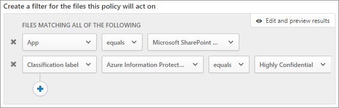

# Een beveiligde omgeving voor het delen met gasten makenCreate a secure guest sharing environment

In dit artikel vindt u verschillende opties voor het maken van een veilige omgeving voor het delen met gasten in Microsoft 365.In this article, we'll walk through a variety of options for creating a secure guest sharing environment in Microsoft 365. Dit is een voorbeeldscenario om u een idee te geven van de beschikbare opties.This is an example scenario to give you an idea of the options available. U kunt deze procedures in verschillende combinaties gebruiken om te voldoen aan de beveiligings- en compliance-behoeften van uw organisatie.You can use these procedures in different combinations to meet the security and compliance needs of your organization. Aan het einde van het artikel zullen we een testcase doorlopen om te zien hoe sommige van deze opties samenwerken.At the end of the article, we'll walk through a test case to see how some of these options work together.

Dit scenario omvat:This scenario includes:

- Meervoudige verificatie voor gasten instellen.Setting up multi-factor authentication for guests.
- Gebruiksvoorwaarden voor gasten instellen.Setting up a terms of use for guests.
- Driemaandelijkse beoordelingen voor gasttoegang instellen om periodiek te valideren of gasten nog steeds toestemming nodig hebben voor teams en sites.Setting up quarterly guest access reviews to periodically validate whether guests continue to need permissions to teams and sites.
- Gasten beperken tot alleen webtoegang voor onbeheerde apparaten.Restricting guests to web-only access for unmanaged devices.
- Een time-outbeleid voor sessies configureren om ervoor te zorgen dat gasten dagelijks worden geverifieerd.Configuring a session timeout policy to ensure guests authenticate daily.
- Gevoeligheidslabels maken en publiceren om inhoud te classificeren.Creating and publishing sensitivity labels to classify content.
- Een type voor gevoelige informatie maken voor een zeer gevoelig project.Creating a sensitive information type for a highly sensitive project.
- Automatisch een label *Zeer gevoelig* toewijzen aan documenten die het type gevoelige informatie bevatten.Automatically assigning a *highly sensitive* label to documents that contain the sensitive information type.
- Gasttoegang automatisch verwijderen voor bestanden die als *zeer gevoelig* zijn aangemerkt.Automatically removing guest access from files labeled as *highly sensitive*.

Voor een aantal van de opties die in dit artikel worden beschreven, moeten gasten een account hebben in Azure Active Directory.Some of the options discussed in this article require guests to have an account in Azure Active Directory. Als u er zeker van wilt zijn dat gasten worden opgenomen in de adreslijst wanneer u bestanden en mappen met hen deelt, gebruikt u de [SharePoint- en OneDrive-integratie met Azure AD B2B Preview](https://docs.microsoft.com/sharepoint/sharepoint-azureb2b-integration-preview).To ensure that guests are included in the directory when you share files and folders with them, use the [SharePoint and OneDrive integration with Azure AD B2B Preview](https://docs.microsoft.com/sharepoint/sharepoint-azureb2b-integration-preview).

Merk op dat we het in dit artikel niet hebben over het inschakelen van instellingen voor het delen met gasten.Note that we won't discuss enabling guest sharing settings in this article. Zie [Samenwerken met personen buiten uw organisatie](collaborate-with-people-outside-your-organization.md) voor meer informatie over het inschakelen van de functie voor het delen met gasten onder verschillende scenario's.See [Collaborating with people outside your organization](collaborate-with-people-outside-your-organization.md) for details about enabling guest sharing for different scenarios.

## Meervoudige verificatie instellen voor gastenSet up multi-factor authentication for guests

Meervoudige verificatie vermindert de kans dat een account wordt aangetast aanzienlijk.Multi-factor authentication greatly reduces the chances of an account being compromised. Aangezien gastgebruikers mogelijk persoonlijke e-mailaccounts gebruiken die niet voldoen aan enig beleid of aanbevolen procedures, is het belangrijk dat u meervoudige verificatie van gasten vereist.Since guest users may be using personal email accounts that don't adhere to any governance policies or best practices, it's especially important to require multi-factor authentication for guests. Als de gebruikersnaam en het wachtwoord van een gastgebruiker worden gestolen, vermindert het vereisen van een tweede verificatiestap de kans dat onbekende partijen toegang krijgen tot uw sites en bestanden aanzienlijk.If a guest user's username and password is stolen, requiring a second factor of authentication greatly reduces the chances of unknown parties gaining access to your sites and files.

In dit voorbeeld wordt meervoudige verificatie voor gasten ingesteld met behulp van een beleid voor voorwaardelijke toegang in Azure Active Directory.In this example, we'll set up multi-factor authentication for guests by using a conditional access policy in Azure Active Directory.

Meervoudige verificatie instellen voor gastenTo set up multi-factor authentication for guests
1. Zoek in Microsoft Azure naar *voorwaardelijke toegang*.In Microsoft Azure, search for *Conditional access*.
2. Klik in de blade **voorwaardelijke toegang - beleid** op **nieuw beleid**.On the **Conditional Access - Policies** blade, click **New policy**.
3. Typ in het veld **naam** *gast-MFA*.In the **Name** field, type *Guest MFA*.
4. Klik onder **toewijzingen**op **gebruikers en groepen**.Under **Assignments**, click **Users and groups**.
5. Selecteer op de blade **Gebruikers en groepen**, de optie **Gebruikers en groepen selecteren**. Schakel vervolgens het selectievakje **Alle gasten en externe gebruikers** in.On the **Users and groups** blade, select **Select users and groups**, select the **All guests and external users** check box.
6. Klik onder **Toewijzingen** op **Cloud-apps of -acties**.Under **Assignments**, click **Cloud apps or actions**.
7. Selecteer op de blade **Cloud-apps of -acties**, **Alle Cloud-apps** op het tabblad **Opnemen**.On the **Cloud apps or actions** blade, select **All cloud apps** on the **Include** tab.
8. Klik onder **Toegangsbeheer**op **Toewijzen**.Under **Access controls**, click **Grant**.
9. Schakel op de blade **Toewijzen** het selectievakje **Meervoudige verificatie vereisen** in en klik vervolgens op **Selecteren**.On the **Grant** blade, select the **Require multi-factor authentication** check box, and then click **Select**.
10. Klik op de blade **Nieuw** onder **Beleid inschakelen** op **Aan** en klik vervolgens op **Maken**.On the **New** blade, under **Enable policy**, click **On**, and then click **Create**.

Nu moeten gasten zich eerst inschrijven voor meervoudige verificatie voordat ze toegang krijgen tot gedeelde inhoud, sites of teams.Now, guest will be required to enroll in multi-factor authentication before they can access shared content, sites, or teams.

### Meer informatieMore information

[Een cloudgebaseerde implementatie van Azure Multi-Factor Authentication plannenPlanning a cloud-based Azure Multi-Factor Authentication deployment](https://docs.microsoft.com/azure/active-directory/authentication/howto-mfa-getstarted)

## Gebruiksvoorwaarden voor gasten instellenSet up a terms of use for guests

Vaak hebben gastgebruikers mogelijk geen geheimhoudingsovereenkomsten of andere juridische overeenkomsten met uw organisatie ondertekend.Often times guest users may not have signed non-disclosure agreements or other legal agreements with your organization. U kunt instellen dat gasten een gebruiksrechtovereenkomst moeten accepteren, voordat ze toegang krijgen tot bestanden die met hen zijn gedeeld.You can require guests to agree to a terms of use before accessing files that are shared with them. De gebruiksvoorwaarden kunnen worden weergegeven wanneer ze de eerste keer proberen toegang te krijgen tot een gedeeld bestand of een gedeelde site.The terms of use can be displayed the first time they attempt to access a shared file or site.

Als u gebruiksvoorwaarden wilt maken, moet u eerst het document maken in Word of een andere tekstverwerker en het vervolgens opslaan als een PDF-bestand.To create a terms of use, you first need to create the document in Word or another authoring program, and then save it as a .pdf file. Dit bestand kan vervolgens worden geüpload naar Azure AD.This file can then be uploaded to Azure AD.

Gebruiksvoorwaarden voor Azure AD makenTo create an Azure AD terms of use
1. Meld u aan bij Azure als een globale beheerder, beveiligingsbeheerder of beheerder van voorwaardelijke toegang.Sign in to Azure as a Global Administrator, Security Administrator, or Conditional Access Administrator.
2. Navigeer naar [gebruiksvoorwaarden](https://aka.ms/catou).Navigate to [Terms of use](https://aka.ms/catou).
3. Klik op **nieuwe voorwaarden**.Click **New terms**. 
   
4. Typ in de vakken **naam** en **weergegeven naam**, *gebruiksvoorwaarden voor gasten*.In the **Name** and **Display name** boxes, type *Guest terms of use*.
6. Voor **gebruiksrechtovereenkomst**bladert u naar het PDF-bestand dat u hebt gemaakt en selecteert u het.For **Terms of use document**, browse to the pdf file that you created and select it.
7. Selecteer de taal voor uw gebruiksrechtovereenkomst.Select the language for your terms of use document.
8. Stel **Gebruikers verplichten om de gebruiksvoorwaarden uit te vouwen** in op **Aan**.Set **Require users to expand the terms of use** to **On**.
9. Kies onder **Voorwaardelijke toegang** in de lijst **Afdwingen met sjabloon voor voorwaardelijke toegang**, **Maak later een beleid voor voorwaardelijke toegang**.Under **Conditional Access**, in the **Enforce with Conditional Access policy template** list choose **Create conditional access policy later**.
10. Klik op **Maken**.Click **Create**.

Als u de gebruiksvoorwaarden hebt gemaakt, is de volgende stap het maken van een beleid voor voorwaardelijke toegang waarin de gebruiksrechtovereenkomst voor gastgebruikers wordt weergegeven.Once you've created the terms of use, the next step is to create a conditional access policy that displays the terms of use to guest users.

Een voorwaardelijk toegangsbeleid makenTo create a conditional access policy
1. Zoek in Microsoft Azure naar *voorwaardelijke toegang*.In Microsoft Azure, search for *Conditional access*.
2. Klik in de blade **voorwaardelijke toegang - beleid** op **nieuw beleid**.On the **Conditional Access - Policies** blade, click **New policy**.
3. Typ in het vak **naam** *gebruiksrechtovereenkomst voor gastgebruikers*.In the **Name** box, type *Guest user terms of use policy*.
4. Klik onder **toewijzingen**op **gebruikers en groepen**.Under **Assignments**, click **Users and groups**.
5. Selecteer op de blade **Gebruikers en groepen** de optie **Gebruikers en groepen selecteren**, schakel het selectievakje **Alle gasten en externe gebruikers** in en klik vervolgens op **Gereed**.On the **Users and groups** blade, select **Select users and groups**, select the **All guests and external users** check box, and then click **Done**.
6. Klik onder **toewijzingen**op **cloud-apps of -acties**.Under **Assignments**, click **Cloud apps or actions**.
7. Selecteer op het tabblad **Opnemen**, **Apps selecteren** en klik vervolgens op **Selecteren**.On the **Include** tab, select **Select apps**, and then click **Select**.
8. Selecteer op de blade **selecteren**, **Microsoft Teams**, **Office 365 SharePoint Online** en **Outlook Groups** en klik vervolgens op **Selecteren**.On the **Select** blade, select **Microsoft Teams**, **Office 365 SharePoint Online**, and **Outlook Groups**, and then click **Select**.
9. Klik op de blade **Cloud-apps of -acties** op **Gereed**.On the **Cloud apps or actions** blade, click **Done**.
10. Klik onder **toegangsbeheer**op **toewijzen**.Under **Access controls**, click **Grant**.
11. Selecteer op de blade **Toewijzen** de optie **Gebruiksrechtovereenkomst voor gasten** en klik vervolgens op **Selecteren**.On the **Grant** blade, select **Guest terms of use**, and then click **Select**.
12. Klik op de blade **Nieuw** onder **Beleid inschakelen** op **Aan** en klik vervolgens op **Maken**.On the **New** blade, under **Enable policy**, click **On**, and then click **Create**.

De eerste keer dat een gastgebruiker probeert toegang te krijgen tot inhoud of een team of site in uw organisatie, moeten ze de gebruiksvoorwaarden accepteren.Now, the first time a guest user attempts to access content or a team or site in your organization, they will be required to accept the terms of use.

> [!NOTE]
> Het gebruik van voorwaardelijke toegang vereist een licentie voor Azure AD Premium P1.Using Conditional Access requires an Azure AD Premium P1 license. Raadpleeg [Wat is voorwaardelijke toegang](https://docs.microsoft.com/azure/active-directory/conditional-access/overview) voor meer informatie.For more information, see [What is Conditional Access](https://docs.microsoft.com/azure/active-directory/conditional-access/overview).

### Meer informatieMore information
[Gebruiksvoorwaarden voor Azure Active DirectoryAzure Active Directory terms of use](https://docs.microsoft.com/azure/active-directory/conditional-access/terms-of-use)

## Revisies voor gasttoegang instellenSet up guest access reviews

Met toegangscontroles in Azure AD kunt u een periodieke beoordeling van gebruikerstoegang tot verschillende teams en groepen automatiseren.With access reviews in Azure AD, you can automate a periodic review of user access to various teams and groups. Door specifiek een toegangscontrole voor gasten te vereisen, kunt u ervoor zorgen dat gastgebruikers niet langer toegang houden tot gevoelige informatie van uw organisatie dan nodig is.By requiring an access review for guests specifically, you can help ensure guest users do not retain access to your organization's sensitive information for longer than is necessary.

Toegangscontroles kunnen in programma's worden georganiseerd.Access reviews can be organized into programs. Een programma is een groepering van vergelijkbare toegangscontroles die kunnen worden gebruikt om toegangscontroles te organiseren voor rapportage- en auditdoeleinden.A program is a grouping of similar access reviews that can be used to organize access reviews for reporting and auditing purposes.

In dit voorbeeld maken we een programma voor de controle van gasttoegang.In this example, we'll create a program for guest access reviews.

Een programma makenTo create a program
1. Meld u aan bij de Azure-portal en open de pagina [identiteitsbeheer](https://portal.azure.com/#blade/Microsoft_AAD_ERM/DashboardBlade).Sign in to the Azure portal and open the [Identity Governance page](https://portal.azure.com/#blade/Microsoft_AAD_ERM/DashboardBlade).
2. Klik in het linkermenu op **Programma's**In the left menu, click **Programs**
3. Klik op **nieuw programma**.Click **New program**.
4. Typ in het vak **Naam** *programma voor het controleren van gasttoegang*.In the **Name** box, type *Guest access review program*.
5. Typ in het vak **beschrijving** *programma voor controle van gasttoegang*.In the **Description** box, type *Program for guest access reviews*.
6. Klik op **Maken**.Click **Create**.

Wanneer het programma is gemaakt, kunnen we toegangscontrole voor gasten maken en aan het programma koppelen.Once the program has been created, we can create a guest access review and associate it with the program.

De controle van de toegang van een gastgebruiker instellenTo set up a guest user access review
1. Klik op de pagina [Identiteitsbeheer](https://portal.azure.com/#blade/Microsoft_AAD_ERM/DashboardBlade) in het linkermenu op **Toegangscontroles**.On the [Identity Governance page](https://portal.azure.com/#blade/Microsoft_AAD_ERM/DashboardBlade), in the left menu, click **Access reviews**.
2. Klik op **nieuwe toegangscontrole**.Click **New access review**. 
   
3. Typ in het vak **Naam** *driemaandelijkse gasttoegangscontrole*.In the **Name** box, type *Quarterly guest access review*.
4. Voor **frequentie**kiest u **driemaandelijks**.For **Frequency**, choose **Quarterly**.
5. Kies voor **beëindigen** de optie **nooit**.For **End**, choose **Never**.
6. Kies **alleen gastgebruikers**voor **bereik**.For **Scope**, choose **Guest users only**.
7. Klik op **groep**, selecteer de groepen die u wilt opnemen in de toegangscontrole en klik vervolgens op **selecteren**.Click **Group**, select the groups that you want to include in the access review, and then click **Select**.
8. Klik onder **Programma's** op **koppeling naar programma**.Under **Programs**, click **Link to program**.
9. Kies op de blade **Selecteer een programma** de optie **Programma gasttoegangscontrole**On the **Select a program** blade, choose **Guest access review program**
10. Klik op **Start**.Click **Start**.

Voor elke groep die u opgeeft, wordt een afzonderlijke toegangscontrole gemaakt.A separate access review is created for each group that you specify. Groepseigenaren van elke groep worden driemaandelijks gemaild om gasttoegang tot hun groepen goed te keuren of te weigeren.Group owners of each groups will be emailed quarterly to approve or deny guest access to their groups.

Het is belangrijk op te merken dat gasten toegang kunnen krijgen tot teams of groepen, of tot individuele bestanden en mappen.It's important to note that guests can be given access to teams or groups, or to individual files and folders. Als u toegang tot bestanden en mappen hebt gegeven, worden gasten mogelijk niet aan een bepaalde groep toegevoegd.When given access to files and folders, guests may not be added to any particular group. Als u toegangscontroles wilt uitvoeren op gastgebruikers die niet tot een team of groep behoren, kunt u een dynamische groep in Azure AD maken die alle gasten bevat en vervolgens een toegangscontrole voor die groep maken.If you want to do access reviews on guest users who don't belong to a team or group, you can create a dynamic group in Azure AD to contain all guests and then create an access review for that group.

### Meer informatieMore information
[Gasttoegang beheren met Azure AD-toegangscontrolesManage guest access with Azure AD access reviews](https://docs.microsoft.com/azure/active-directory/governance/manage-guest-access-with-access-reviews)

[Een toegangscontrole maken voor groepen of toepassingen in Azure AD-toegangscontrolesCreate an access review of groups or applications in Azure AD access reviews](https://docs.microsoft.com/azure/active-directory/governance/create-access-review)

## Stel webtoegang in voor gastgebruikersSet up web-only access for guest users

U kunt het risico op een aanval beperken en het beheer vereenvoudigen door gastgebruikers alleen toegang te verlenen tot uw teams, sites en bestanden via een webbrowser.You can reduce your attack surface and ease administration by requiring guest users to access your teams, sites, and files by using a web browser only. Dit wordt gedaan met beleid voor voorwaardelijke toegang van Azure AD.This is done with an Azure AD conditional access policy.

De toegang van gasten tot beperken tot alleen webtoegangTo restrict guests to web-ony access
1. Zoek in Microsoft Azure naar *voorwaardelijke toegang*.In Microsoft Azure, search for *Conditional access*.
2. Klik in de blade **voorwaardelijke toegang - beleid** op **nieuw beleid**.On the **Conditional Access - Policies** blade, click **New policy**.
3. Typ in het vak **naam** *browsertoegang voor gastgebruikers*.In the **Name** box, type *Guest user browser access*.
4. Klik onder **toewijzingen**op **gebruikers en groepen**.Under **Assignments**, click **Users and groups**.
5. Selecteer op de blade **Gebruikers en groepen** de optie **Gebruikers en groepen selecteren**, schakel het selectievakje **Alle gasten en externe gebruikers** in en klik vervolgens op **Gereed**.On the **Users and groups** blade, select **Select users and groups**, select the **All guests and external users** check box, and then click **Done**.
6. Klik onder **toewijzingen**op **cloud-apps of -acties**.Under **Assignments**, click **Cloud apps or actions**.
7. Selecteer op het tabblad **Opnemen**, **Apps selecteren** en klik vervolgens op **Selecteren**.On the **Include** tab, select **Select apps**, and then click **Select**.
8. Selecteer op de blade **selecteren**, **Microsoft Teams**, **Office 365 SharePoint Online** en **Outlook Groups** en klik vervolgens op **Selecteren**.On the **Select** blade, select **Microsoft Teams**, **Office 365 SharePoint Online**, and **Outlook Groups**, and then click **Select**.
9. Klik op de blade **Cloud-apps of -acties** op **Gereed**.On the **Cloud apps or actions** blade, click **Done**.
10. Klik onder **toewijzingen**op **voorwaarden**.Under **Assignments**, click **Conditions**.
11. Klik op de blade **Voorwaarden** op **Client-apps**.On the **Conditions** blade, click **Client apps**.
12. Klik op de blade **Client-apps** op **Ja** voor\*\* Configureren\*\* en selecteer vervolgens de instellingen voor **Mobiele apps en bureaublad-clients**.On the **Client apps** blade, click **Yes** for **Configure**, and then select the **Mobile apps and desktop clients** setting. 
    
13. Klik op **gereed**en klik vervolgens op de blade **voorwaarden** en daarna nogmaals op **gereed**.Click **Done**, and then on the **Conditions** blade, click **Done** again.
14. Klik onder **toegangsbeheer**op **toewijzen**.Under **Access controls**, click **Grant**.
15. Selecteer op de blade **toewijzen** de optie **vereisen dat apparaat moet worden gemarkeerd als compatibel** en **vereisen dat hybride Azure AD-aan het apparaat is toegevoegd**.On the **Grant** blade, select **Require device to be marked as compliant** and **Require Hybrid Azure AD joined device**.
16. Selecteer onder **voor meerdere besturingselementen** **een van de geselecteerde besturingselementen vereisen**en klik vervolgens op **selecteren**.Under **For multiple controls**, select **Require one of the selected controls**, and then click **Select**.
17. Klik op de blade **Nieuw** onder **Beleid inschakelen** op **Aan** en klik vervolgens op **Maken**.On the **New** blade, under **Enable policy**, click **On**, and then click **Create**.

## Een sessietime-out configureren voor gastgebruikersConfigure a session timeout for guest users

Vereisen dat gasten regelmatig verifiëren, kan de kans verkleinen dat onbekende gebruikers toegang krijgen tot de inhoud van uw organisatie, als het apparaat van een gastgebruiker niet veilig is.Requiring guests to authenticate on a regular basis can reduce the possibility of unknown users accessing your organization's content if a guest user's device isn't kept secure. U kunt een voorwaardelijk toegangsbeleid voor sessie time-outs configureren voor gastgebruikers in Azure AD.You can configure a session timeout conditional access policy for guest users in Azure AD.

Een beleid voor de time-out van een gastsessie configurerenTo configure a guest session timeout policy
1. Zoek in Microsoft Azure naar *voorwaardelijke toegang*.In Microsoft Azure, search for *Conditional access*.
2. Klik in de blade **voorwaardelijke toegang - beleid** op **nieuw beleid**.On the **Conditional Access - Policies** blade, click **New policy**.
3. Typ in het vak **naam** *time-out van gast sessie*.In the **Name** box, type *Guest session timeout*.
4. Klik onder **toewijzingen**op **gebruikers en groepen**.Under **Assignments**, click **Users and groups**.
5. Selecteer op de blade **Gebruikers en groepen** de optie **Gebruikers en groepen selecteren**, schakel het selectievakje **Alle gasten en externe gebruikers** in en klik vervolgens op **Gereed**.On the **Users and groups** blade, select **Select users and groups**, select the **All guests and external users** check box, and then click **Done**.
6. Klik onder **toewijzingen**op **cloud-apps of -acties**.Under **Assignments**, click **Cloud apps or actions**.
7. Selecteer op het tabblad **Opnemen**, **Apps selecteren** en klik vervolgens op **Selecteren**.On the **Include** tab, select **Select apps**, and then click **Select**.
8. Selecteer op de blade **selecteren**, **Microsoft Teams**, **Office 365 SharePoint Online** en **Outlook Groups** en klik vervolgens op **Selecteren**.On the **Select** blade, select **Microsoft Teams**, **Office 365 SharePoint Online**, and **Outlook Groups**, and then click **Select**.
9. Klik op de blade **Cloud-apps of -acties** op **Gereed**.On the **Cloud apps or actions** blade, click **Done**.
10. Klik onder **toegangsbeheer**op **sessie**.Under **Access controls**, click **Session**.
11. Op de blade **sessie** selecteert u **aanmeldingsfrequentie**.On the **Session** blade, select **Sign-in frequency**.
12. Selecteer **1** en **dagen** voor de tijdsperiode en klik vervolgens op **selecteren**.Select **1** and **Days** for the time period, and then click **Select**.
13. Klik op de blade **Nieuw** onder **Beleid inschakelen** op **Aan** en klik vervolgens op **Maken**.On the **New** blade, under **Enable policy**, click **On**, and then click **Create**.

## Gevoeligheidslabels makenCreate sensitivity labels

Gevoeligheidslabels kunnen op verschillende manieren worden gebruikt om de gegevens van uw organisatie te classificeren en te beveiligen.Sensitivity labels can be used in a variety of ways to classify and protect your organization's information. In dit voorbeeld ziet u hoe labels kunnen worden gebruikt om u te helpen bij het beheren van gasttoegang tot gedeelde bestanden en mappen.In this example, we'll look at how labels can be used to help you manage guest access to shared files and folders.

Eerst maken we drie gevoeligheidslabels in het Microsoft 365 Compliance Center:First, we'll create three sensitivity labels in the Microsoft 365 Compliance Center:

- AlgemeenGeneral
- gevoeligsensitive
- Zeer gevoeligHighly sensitive

Gebruik de volgende procedure om de labels *Algemeen* en *Gevoelig* te maken.Use the following procedure to create the *General* and *sensitive* labels.

Een classificatielabel maken (Algemeen en Gevoelig)To create a classification label (General and sensitive)
1. Vouw in het [Microsoft 365 Compliance Center](https://compliance.microsoft.com) in de linkernavigatiebalk **Classificatie** uit en klik vervolgens op **Gevoeligheidslabels**.In the [Microsoft 365 Compliance Center](https://compliance.microsoft.com), in the left navigation, expand **Classification**, and then click **Sensitivity labels**.
2. Klik op **een label maken**.Click **Create a label**.
3. Typ bij **Labelnaam** *Algemeen* of *Gevoelig*.In **Label name**, type *General* or *sensitive*.
4. In **Knopinfo** typt u *Algemene informatie die kan worden gedeeld met werknemers, gasten en partners* of *Gevoelige informatie. Deel alleen met werknemers en geautoriseerde gasten*. Klik vervolgens op **Volgende**.In **Tooltip**, type *General information that can be shared with employees, guests, and partners* or *sensitive information. Share only with employees and authorized guests*, and then click **Next**.
5. Laat de versleuteling **uit** en klik op **volgende**.Leave encryption **Off** and click **Next**.
6. Laat de markering van inhoud **uit** en klik op **volgende**.Leave content marking **Off** and click **Next**.
7. Laat het verlies van gegevensverlies voorkomen **uit** en klik op **volgende**.Leave endpoint data loss prevention **Off** and click **Next**.
8. Laat automatische labeling **uit** en klik op **volgende**.Leave auto labeling **Off** and click **Next**.
9. Klik op **Maken**.Click **Create**.

Met het label *Zeer gevoelig* voegen we met het label automatische watermerken van documenten toe.With the *Highly sensitive* label, we'll add automatic watermarking of documents with the label.

Een classificatielabel maken (Zeer gevoelig)To create a classification label (Highly sensitive)
1. Klik op **een label maken**.Click **Create a label**.
2. In **Labelnaam** typt u *Zeer gevoelig*.In **Label name**, type *Highly sensitive*.
3. In **Knopinfo** typt u *Zeer gevoelige informatie. Niet delen met gasten*. Vervolgens klikt u op **volgende**.In **Tooltip**, type *Highly sensitive information. Do not share with guests*, and then click **Next**.
4. Laat de versleuteling **uit** en klik op **volgende**.Leave encryption **Off** and click **Next**.
5. Schakel de markerings voor inhoud **aan**, voeg een selectievakje **koptekst toevoegen** toe en klik vervolgens op **tekst aanpassen**.Turn content marking **On**, select the **Add a header** check box, and then click **Customize text**.
6. Typ *Zeer gevoelig* voor de koptekst en klik op **Opslaan**.Type *Highly sensitive* for the header text and click **Save**.
7. Schakel op de pagina **inhoudsmarkering** de inhoudsmarkering **in**.On the **Content marking** page, turn content marking **On**.
8. Selecteer het selectievakje **een watermerk toevoegen** en klik vervolgens op **tekst aanpassen**.Select the **Add a watermark** check box, and then click **Customize text**.
9. Bij **Tekst voor het watermerk** typt u *Zeer gevoelig*.For **Watermark text**, type *Highly sensitive*.
10. Typ *24* voor **tekengrootte** en klik vervolgens op **opslaan**.Type *24* for **Font size**, and then click **Save**.
11. Klik op de pagina **inhoudsmarkering** op **volgende**.On the **Content marking** page, click **Next**.
12. Laat het verlies van gegevensverlies voorkomen **uit** en klik op **volgende**.Leave endpoint data loss prevention **Off** and click **Next**.
13. Laat automatische labeling **uit** en klik op **volgende**.Leave auto labeling **Off** and click **Next**.
14. Klik op **Maken**.Click **Create**.

Nadat u de labels heeft gemaakt, is de volgende stap het publiceren ervan.Once you've created the labels, the next step is to publish them. 

Labels publicerenTo publish labels
1. Klik op de pagina **gevoeligheidslabels** op **labels publiceren**.On the **Sensitivity labels** page, click **Publish labels**.
2. Klik op **labels kiezen om te publiceren**.Click **Choose labels to publish**.
3. Klik op **toevoegen**, selecteer de labels die u hebt gemaakt en klik vervolgens op **toevoegen**.Click **Add**, select the labels that you created, and then click **Add**.
4. Klik op **Gereed**.Click **Done**.
5. Klik op **Volgende**.Click **Next**.
6. Laat de gebruikers en groepen op **alle** staan en klik op **volgende**.Leave the users and groups set to **All** and click **Next**.
7. Kies in de lijst **dit label standaard toepassen op documenten en e-mail** de optie **algemeen** en klik vervolgens op **volgende**.In the **Apply this label by default to documents and email** list, choose **General**, and then click **Next**.
8. Typ op de pagina **Beleidsinstellingen** *Documentgevoeligheid* voor de naam en klik vervolgens op **Volgende**.On the **Policy settings** page, type *Document sensitivity* for the name, and then click **Next**.
9. Klik op **Publiceren**.Click **Publish**.

De gepubliceerde labels zijn nu beschikbaar voor gebruikers van Office-bureaublad-apps.With the labels published, they're available to users of Office desktop apps. Wanneer gebruikers het label **Zeer gevoelig** toepassen, wordt er automatisch een watermerk aan het document toegevoegd.When users apply the **Highly sensitive** label, a watermark is automatically added to the document.

### Meer informatieMore information
[Overzicht van gevoeligheidslabelsOverview of sensitivity labels](https://docs.microsoft.com/Office365/SecurityCompliance/sensitivity-labels)

## Een type voor gevoelige informatie maken voor een zeer gevoelig projectCreate a sensitive information type for a highly sensitive project

De typen gevoelige informatie zijn vooraf gedefinieerde tekenreeksen die kunnen worden gebruikt in werkstromen om nalevingsvereisten af te dwingen.Sensitive information types are predefined strings that can be used in policy workflows to enforce compliance requirements. Het Microsoft 365 Compliance Center bevat meer dan honderd soorten gevoelige informatie, waaronder rijbewijsnummers, creditcardnummers, bankrekeningnummers, enz.The Microsoft 365 Compliance Center comes with over one hundred sensitive information types, including driver's license numbers, credit card numbers, bank account numbers, etc.

U kunt aangepaste typen gevoelige informatie maken om inhoud te beheren die specifiek is voor uw organisatie.You can create custom sensitive information types to help manage content specific to your organization. In dit voorbeeld maken we een aangepast type voor gevoelige informatie voor een zeer gevoelig project.In this example, we'll create a custom sensitive information type for a highly sensitive project. Vervolgens kunnen we dit gevoelig informatietype gebruiken om automatisch een classificatielabel toe te wijzen.We can then use this sensitive information type to automatically apply a classification label.

Een gevoelig informatietype makenTo create a sensitive information type
1. Vouw in het [Microsoft 365 Compliance Center](https://compliance.microsoft.com) in de linkernavigatiebalk **Classificatie** uit en klik vervolgens op **Gevoelige informatietypen**.In the [Microsoft 365 Compliance Center](https://compliance.microsoft.com), in the left navigation, expand **Classification**, and then click **Sensitive info types**.
2. Klik op **Maken**.Click **Create**.
3. Voor **naam** en **beschrijving**typt u **Project Saturnus**en klik vervolgens op **volgende**.For **Name** and **Description**, type **Project Saturn**, and then click **Next**.
4. Klik op **een element toevoegen**.Click **Add an element**.
5. Selecteer **Trefwoorden** in de lijst **Inhoud zoeken met** en typ *Project Saturnus* in het trefwoordvak.On the **Detect content containing** list, select **Keywords**, and then type *Project Saturn* in the keyword box.
6. Klik op **Volgende** en vervolgens op **Voltooien**.Click **Next**, and then click **Finish**.
7. Als u wordt gevraagd of u het gevoelige informatietype wilt testen, klikt u op **Nee**.If asked if you would like to test the sensitive information type, click **No**.

### Meer informatieMore information
[Aangepaste gevoelige informatietypenCustom sensitive information types](https://docs.microsoft.com/Office365/SecurityCompliance/custom-sensitive-info-types)

## Een beleid maken om een label toe te wijzen op basis van een gevoelig informatietypeCreate a policy to assign a label based on a sensitive information type

Zodra het type gevoelige informatie is gemaakt, kunnen we een bestandsbeleid in Microsoft Cloud App Security maken dat automatisch het label *Zeer gevoelig* toepast op documenten die de *Project Saturnus*-tekenreeks bevatten.Once the sensitive information type is created, we can create a file policy in Microsoft Cloud App Security to apply the *Highly sensitive* label to documents that contain the *Project Saturn* string automatically.

> [!NOTE]
> Er is een replicatieproces waarmee gevoeligheidslabels beschikbaar worden in Cloud App Security.There is a replication process that makes sensitivity labels available in Cloud App Security. Het is mogelijk dat u het label voor een beleid niet onmiddellijk kunt zien.You may not see the label available for a policy right away.

Een bestandsbeleid op basis van een gevoelig informatietype makenTo create a sensitive information type-based file policy
1. Open [Microsoft Cloud App Security](https://portal.cloudappsecurity.com).Open [Microsoft Cloud App Security](https://portal.cloudappsecurity.com).
2. Vouw in het navigatievenster aan de linkerkant **Beheer**uit en klik vervolgens op **Beleid**.In the left navigation, expand **Control**, and then click **Policies**.
3. Klik op **Beleid maken**en kies vervolgens **Bestandsbeleid**.Click **Create policy**, and then choose **File policy**.
4. Typ voor **Beleidsnaam** *Project Saturnus labeling*.For **Policy name**, type *Project Saturn labeling*.
5. Klik onder **een filter maken voor de bestanden waarop dit beleid wordt toegepast** tweemaal op X om de standaardfilters te verwijderen.Under **Create a filter for the files this policy will act on**, click X twice to delete the default filters.
7. Kies **App** in de lijst **Selecteer een filter** en selecteer vervolgens **Microsoft SharePoint Online** in de lijst **Apps selecteren...**.In the **Select a filter** list, choose **App**, and then select **Microsoft SharePoint Online** from the **Select apps...** list.
8. Kies onder **inspectiemethode**, **dataclassificeringsservice**.Under **Inspection method**, choose **Data classification service**.
9. Kies in de lijst **Inspectietype kiezen**, **Gevoelig informatietype**.On the **Choose inspection type** list, choose **Sensitive information type**.
10. Zoek en selecteer het gevoeligheidslabel *Project Saturnus* en klik vervolgens op **Gereed**.Search for and select the *Project Saturn* sensitivity label, and then click **Done**. 
   
11. Vouw onder **Beheermodel** de optie **Microsoft SharePoint Online** uit.Under **Governance**, expand **Microsoft SharePoint Online**.
12. Schakel het selectievakje **Classificatielabel toepassen** in en selecteer het label **Zeer gevoelig**.Select the **Apply classification label** check box and select the **Highly sensitive** label.
13. Klik op **Maken**.Click **Create**.

Als het beleid van kracht is, zal Cloud App Security, wanneer een gebruiker 'Project Saturnus' in een document typt, automatisch het label *Zeer gevoelig* toepassen wanneer het bestand wordt gescand.With the policy in place, when a user types "Project Saturn" into a document, Cloud App Security will automatically apply the *Highly sensitive* label when it scans the file.

### Meer informatieMore information
[BestandsbeleidsregelsFile policies](https://docs.microsoft.com/cloud-app-security/data-protection-policies)

## Een beleid maken voor het verwijderen van gasttoegang tot zeer gevoelige bestandenCreate a policy to remove guest access to highly sensitive files

In het voorbeeld in dit artikel mogen bestanden met het label *Zeer gevoelig* niet worden gedeeld met gasten.In the example in this article, files with the *Highly sensitive* label shouldn't be shared with guests. We kunnen een bestandsbeleid maken in de cloud app Security waarmee gasttoegang automatisch wordt verwijderd voor bestanden met dat label.We can create a file policy in Cloud App Security that automatically removes guest access from files with that label.

Hiermee wordt niet voorkomen dat gebruikers deze bestanden delen of opnieuw delen.Note that this doesn't prevent users from sharing or re-sharing these files. U bent nog steeds afhankelijk van uw gebruikersbeleid voor het beheer van bestanden die zijn opgeslagen op sites die het delen met gasten toestaan.You're still reliant on your users to follow your governance policies for files that are stored in sites that allow guest sharing. Dit is echter een handig hulpmiddel om gasttoegang te verwijderen voor bestanden waaraan gevoelige informatie is toegevoegd nadat ze zijn gedeeld met gasten.However, this can be a useful tool for removing guest access from files that had sensitive information added to them after they were shared with guests.

Een op labels gebaseerd bestandsbeleid makenTo create a label-based file policy
1. Open [Microsoft Cloud App Security](https://portal.cloudappsecurity.com).Open [Microsoft Cloud App Security](https://portal.cloudappsecurity.com).
2. Vouw in het navigatievenster aan de linkerkant **Beheer**uit en klik vervolgens op **Beleid**.In the left navigation, expand **Control**, and then click **Policies**.
3. Klik op **Beleid maken**en kies vervolgens **Bestandsbeleid**.Click **Create policy**, and then choose **File policy**.
4. Typ voor **Beleidsnaam** *Project Saturn - gasttoegang verwijderen*.For **Policy name**, type *Project Saturn - remove guest access*.
5. Klik onder **een filter maken voor de bestanden waarop dit beleid wordt toegepast** tweemaal op X om de standaardfilters te verwijderen.Under **Create a filter for the files this policy will act on**, click X twice to delete the default filters.
6. Kies **App** in de lijst **Selecteer een filter** en selecteer vervolgens **Microsoft SharePoint Online** in de lijst **Apps selecteren...**.In the **Select a filter** list, choose **App**, and then select **Microsoft SharePoint Online** from the **Select apps...** list.
7. Klik op **een filter toevoegen**.Click **Add a filter**.
8. Kies in de lijst **Selecteer een filter** de optie **Classificatielabel** en selecteer vervolgens **Azure Information Protection** in de lijst **Filter selecteren...**.In the **Select a filter** list, choose **Classification label**, and then select **Azure Information Protection** from the **Select filter...** list.
9. Selecteer in de lijst **Classificatielabel selecteren** de optie **Zeer gevoelig**.In the **Select classification label** list, select **Highly sensitive**. 
   
10. Vouw onder **Beheermodel** de optie **Microsoft SharePoint Online** uit.Under **Governance**, expand **Microsoft SharePoint Online**.
11. Schakel de selectievakjes **Beleidovereenkomst verzenden naar bestandseigenaar** en **Externe gebruikers verwijderen** in.Select the **Send policy-match digest to file owner** and **Remove external users** check boxes.
12. Typ voor het aangepaste meldingsbericht *Dit bestand is zeer gevoelig. Het bedrijfsbeleid verbiedt het delen met gasten*.For the custom notification message, type *This file is highly sensitive. Company policy prohibits sharing it with guests*.
13. Klik op **Maken**.Click **Create**.

Het is belangrijk op te merken dat dit beleid de toegang verwijdert voor bestanden die worden gedeeld via een koppeling voor *specifieke personen*.It's important to note, that this policy removes access for files shared using a *Specific people* link. Het ontzegt niet de toegang tot niet-geverifieerde koppelingen (*voor iedereen*).It doesn't remove access from unauthenticated (*Anyone*) links. Bovendien wordt de toegang niet ontzegd als de gast lid is van de site of het team als geheel.It also doesn't remove access if the guest is a member of the site or team as a whole. Als u van plan bent om zeer gevoelige documenten te gebruiken in een site of team met gastleden, kunt u overwegen [persoonlijke kanalen in Teams](https://support.office.com/article/60ef929a-4d68-418b-bf4f-5784db184ec9) te gebruiken en alleen leden van uw organisatie toe te laten tot de persoonlijke kanalen.If you plan to have highly sensitive documents in a site or team with guest members, consider using [private channels in Teams](https://support.office.com/article/60ef929a-4d68-418b-bf4f-5784db184ec9) and only allowing members of your organization in the private channels.

## De oplossing testenTest the solution

Als u de oplossing wilt testen die in dit artikel wordt beschreven, maakt u een Word-document en slaat u het op in een documentbibliotheek.To test the solution described in this article, create a Word document and save it to a document library. Het bestand delen met een gastgebruiker.Share the file with a guest user. Wanneer de gast probeert toegang te krijgen tot het document, moeten ze zich inschrijven voor meervoudige verificatie en vervolgens de gebruiksvoorwaarden accepteren.When the guest attempts to access the document, they should be required to enroll in multi-factor authentication, and then accept the terms of use.

Zodra de gasttoegang tot het document heeft, typt u *Project Saturnus* in het document en slaat u het op.Once the guest has access to the document, type *Project Saturn* in the document and save it. Wanneer het document door Cloud App Security wordt gescand, moet het label *Zeer gevoelig* worden toegepast en moet de gastgebruiker er geen toegang meer toe kunnen krijgen.Once Cloud App Security scans the document, the *Highly sensitive* label should be applied and the guest user should no longer have access to it.

U kunt de hulpprogramma's die in dit artikel worden beschreven, gebruiken in verschillende combinaties om een productieve, veilige omgeving voor het delen met gasten te maken voor uw organisatie.You can use the tools described in this article in various combinations to help create a productive but safe guest sharing environment for your organization.

## Aanvullende optiesAdditional options

Er zijn enkele extra opties beschikbaar in Microsoft 365 en Azure Active Directory waarmee u uw omgeving voor het delen met gasten kunt beveiligen.There are some additional options in Microsoft 365 and Azure Active Directory that can help secure your guest sharing environment.

- U kunt een lijst maken met toegestane of geweigerde domeinen om te beperken met wie gebruikers kunnen delen.You can create a list of allowed or denied sharing domains to limit who users can share with. Zie [Delen van SharePoint- en OneDrive-inhoud per domein beperken](https://docs.microsoft.com/sharepoint/restricted-domains-sharing) en [Uitnodigingen voor B2B-gebruikers van specifieke organisaties toestaan of blokkeren](https://docs.microsoft.com/azure/active-directory/b2b/allow-deny-list) voor meer informatie.See [Restrict sharing of SharePoint and OneDrive content by domain](https://docs.microsoft.com/sharepoint/restricted-domains-sharing) and [Allow or block invitations to B2B users from specific organizations](https://docs.microsoft.com/azure/active-directory/b2b/allow-deny-list) for more information.
- U kunt bepalen met welke andere Azure Active Directory-tenants uw gebruikers verbinding kunnen maken.You can limit which other Azure Active Directory tenants your users can connect to. Zie [Tenant beperkingen gebruiken voor het beheren van de toegang tot SaaS-cloud-toepassingen](https://docs.microsoft.com/azure/active-directory/manage-apps/tenant-restrictions) voor meer informatie.See [Use tenant restrictions to manage access to SaaS cloud applications](https://docs.microsoft.com/azure/active-directory/manage-apps/tenant-restrictions) for information.
- U kunt een beheerde omgeving maken waar partners kunnen helpen bij het beheren van gastaccounts.You can create a managed environment where partners can help manage guest accounts. Zie [Een B2B-extranet maken met beheerde gasten](https://docs.microsoft.com/Office365/Enterprise/b2b-extranet) voor meer informatie.See [Create a B2B extranet with managed guests](https://docs.microsoft.com/Office365/Enterprise/b2b-extranet) for information.

## Zie ookSee Also

[Accidentele blootstelling aan bestanden beperken tijdens het delen met gastenLimit accidental exposure to files when sharing with guests](share-limit-accidental-exposure.md)

[Aanbevolen procedures voor het delen van bestanden en mappen met niet-geverifieerde gebruikersBest practices for sharing files and folders with unauthenticated users](best-practices-anonymous-sharing.md)

[Een B2B-extranet maken met beheerde gastenCreate a B2B extranet with managed guests](b2b-extranet.md)
