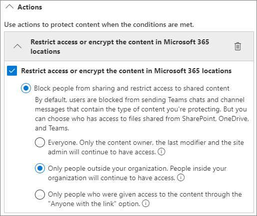

# Een beveiligde omgeving voor het delen met gasten maken

In dit artikel vindt u verschillende opties voor het maken van een veilige omgeving voor het delen met gasten in Microsoft 365. Dit zijn voorbeelden om u een idee te geven van de beschikbare opties. U kunt deze procedures in verschillende combinaties gebruiken om te voldoen aan de beveiligings- en compliance-behoeften van uw organisatie.

Dit artikel bevat:

- Meervoudige verificatie voor gasten instellen.
- Gebruiksvoorwaarden voor gasten instellen.
- Driemaandelijkse beoordelingen voor gasttoegang instellen om periodiek te valideren of gasten nog steeds toestemming nodig hebben voor teams en sites.
- Gasten beperken tot alleen webtoegang voor onbeheerde apparaten.
- Een time-outbeleid voor sessies configureren om ervoor te zorgen dat gasten dagelijks worden geverifieerd.
- Een type voor gevoelige informatie maken voor een zeer gevoelig project.
- Automatisch een vertrouwelijkheidslabel toewijzen aan documenten die het type gevoelige informatie bevatten.
- Gasttoegang automatisch verwijderen voor bestanden met een vertrouwelijkheidslabel.

Voor een aantal van de opties die in dit artikel worden beschreven, moeten gasten een account hebben in Azure Active Directory. Als u er zeker van wilt zijn dat gasten worden opgenomen in de adreslijst wanneer u bestanden en mappen met hen deelt, gebruikt u de [SharePoint- en OneDrive-integratie met Azure AD B2B Preview](https://docs.microsoft.com/sharepoint/sharepoint-azureb2b-integration-preview).

Merk op dat we het in dit artikel niet hebben over het inschakelen van instellingen voor het delen met gasten. Zie [Samenwerken met personen buiten uw organisatie](collaborate-with-people-outside-your-organization.md) voor meer informatie over het inschakelen van de functie voor het delen met gasten onder verschillende scenario's.

## Meervoudige verificatie instellen voor gasten

Meervoudige verificatie vermindert de kans dat een account wordt aangetast aanzienlijk. Aangezien gastgebruikers mogelijk persoonlijke e-mailaccounts gebruiken die niet voldoen aan enig beleid of aanbevolen procedures, is het belangrijk dat u meervoudige verificatie van gasten vereist. Als de gebruikersnaam en het wachtwoord van een gastgebruiker worden gestolen, vermindert het vereisen van een tweede verificatiestap de kans dat onbekende partijen toegang krijgen tot uw sites en bestanden aanzienlijk.

In dit voorbeeld wordt meervoudige verificatie voor gasten ingesteld met behulp van een beleid voor voorwaardelijke toegang in Azure Active Directory.

Meervoudige verificatie instellen voor gasten

1. Ga naar [Beleid voor voorwaardelijke toegang in Azure](https://portal.azure.com/#blade/Microsoft_AAD_IAM/ConditionalAccessBlade).
2. Klik in de blade **Voorwaardelijke toegang | Beleid** op **Nieuw beleid**.
3. Typ een naam in het veld **Naam**.
4. Klik onder **toewijzingen** op **gebruikers en groepen**.
5. Selecteer op de blade **Gebruikers en groepen**, de optie **Gebruikers en groepen selecteren**. Schakel vervolgens het selectievakje **Alle gasten en externe gebruikers** in.
6. Klik onder **Toewijzingen** op **Cloud-apps of -acties**.
7. Selecteer op de blade **Cloud-apps of -acties**, **Alle Cloud-apps** op het tabblad **Opnemen**.
8. Klik onder **Toegangsbeheer** op **Toewijzen**.
9. Schakel op de blade **Toewijzen** het selectievakje **Meervoudige verificatie vereisen** in en klik vervolgens op **Selecteren**.
10. Klik op de blade **Nieuw** onder **Beleid inschakelen** op **Aan** en klik vervolgens op **Maken**.

Nu moeten gasten zich eerst inschrijven voor meervoudige verificatie voordat ze toegang krijgen tot gedeelde inhoud, sites of teams.

### Meer informatie

[Een implementatie van meervoudige verificatie in Azure AD plannen](https://docs.microsoft.com/azure/active-directory/authentication/howto-mfa-getstarted)

## Gebruiksvoorwaarden voor gasten instellen

In sommige situaties hebben gastgebruikers mogelijk geen geheimhoudingsovereenkomsten of andere juridische overeenkomsten met uw organisatie ondertekend. U kunt instellen dat gasten een gebruiksrechtovereenkomst moeten accepteren, voordat ze toegang krijgen tot bestanden die met hen zijn gedeeld. De gebruiksvoorwaarden kunnen worden weergegeven wanneer ze de eerste keer proberen toegang te krijgen tot een gedeeld bestand of een gedeelde site.

Als u gebruiksvoorwaarden wilt maken, moet u eerst het document maken in Word of een andere tekstverwerker en het vervolgens opslaan als een PDF-bestand. Dit bestand kan vervolgens worden geüpload naar Azure AD.

Gebruiksvoorwaarden voor Azure AD maken

1. Meld u aan bij Azure als een globale beheerder, beveiligingsbeheerder of beheerder van voorwaardelijke toegang.
2. Navigeer naar [gebruiksvoorwaarden](https://aka.ms/catou).
3. Klik op **nieuwe voorwaarden**.

   

4. Typ een **Naam** en **Weergavenaam**.
6. Voor **gebruiksrechtovereenkomst** bladert u naar het PDF-bestand dat u hebt gemaakt en selecteert u het.
7. Selecteer de taal voor uw gebruiksrechtovereenkomst.
8. Stel **Gebruikers verplichten om de gebruiksvoorwaarden uit te vouwen** in op **Aan**.
9. Kies onder **Voorwaardelijke toegang** in de lijst **Afdwingen met sjabloon voor voorwaardelijke toegang**, **Maak later een beleid voor voorwaardelijke toegang**.
10. Klik op **Maken**.

Als u de gebruiksvoorwaarden hebt gemaakt, is de volgende stap het maken van een beleid voor voorwaardelijke toegang waarin de gebruiksrechtovereenkomst voor gastgebruikers wordt weergegeven.

Een voorwaardelijk toegangsbeleid maken

1. Ga naar [Beleid voor voorwaardelijke toegang in Azure](https://portal.azure.com/#blade/Microsoft_AAD_IAM/ConditionalAccessBlade).
2. Klik in de blade **Voorwaardelijke toegang | Beleid** op **Nieuw beleid**.
3. Typ een naam in het vak **Naam**.
4. Klik onder **toewijzingen** op **gebruikers en groepen**.
5. Selecteer op de blade **Gebruikers en groepen**, de optie **Gebruikers en groepen selecteren**. Schakel vervolgens het selectievakje **Alle gasten en externe gebruikers** in.
6. Klik onder **Toewijzingen** op **Cloud-apps of -acties**.
7. Selecteer op het tabblad **Opnemen**, **Apps selecteren** en klik vervolgens op **Selecteren**.
8. Selecteer op de blade **selecteren**, **Microsoft Teams**, **Office 365 SharePoint Online** en **Outlook Groups** en klik vervolgens op **Selecteren**.
9. Klik onder **Toegangsbeheer** op **Toewijzen**.
10. Selecteer op de blade **Toewijzen** de optie **Gebruiksrechtovereenkomst voor gasten** en klik vervolgens op **Selecteren**.
11. Klik op de blade **Nieuw** onder **Beleid inschakelen** op **Aan** en klik vervolgens op **Maken**.

De eerste keer dat een gastgebruiker probeert toegang te krijgen tot inhoud of een team of site in uw organisatie, moeten ze de gebruiksvoorwaarden accepteren.

> [!NOTE]
> Het gebruik van voorwaardelijke toegang vereist een licentie voor Azure AD Premium P1. Raadpleeg [Wat is voorwaardelijke toegang](https://docs.microsoft.com/azure/active-directory/conditional-access/overview) voor meer informatie.

### Meer informatie

[Gebruiksvoorwaarden voor Azure Active Directory](https://docs.microsoft.com/azure/active-directory/conditional-access/terms-of-use)

## Revisies voor gasttoegang instellen

Met toegangscontroles in Azure AD kunt u een periodieke beoordeling van gebruikerstoegang tot verschillende teams en groepen automatiseren. Door specifiek een toegangscontrole voor gasten te vereisen, kunt u ervoor zorgen dat gastgebruikers niet langer toegang houden tot gevoelige informatie van uw organisatie dan nodig is.

Toegangscontroles kunnen in programma's worden georganiseerd. Een programma is een groepering van vergelijkbare toegangscontroles die kunnen worden gebruikt om toegangscontroles te organiseren voor rapportage- en auditdoeleinden.

Een programma maken

1. Meld u aan bij de Azure-portal en open de pagina [identiteitsbeheer](https://portal.azure.com/#blade/Microsoft_AAD_ERM/DashboardBlade).
2. Klik in het linkermenu op **Programma's**
3. Klik op **nieuw programma**.
4. Typ een **Naam** en **Beschrijving**.
5. Klik op **Maken**.

Wanneer het programma is gemaakt, kunnen we toegangscontrole voor gasten maken en aan het programma koppelen.

De controle van de toegang van een gastgebruiker instellen

1. Klik op de pagina [Identiteitsbeheer](https://portal.azure.com/#blade/Microsoft_AAD_ERM/DashboardBlade) in het linkermenu op **Toegangscontroles**.
2. Klik op **nieuwe toegangscontrole**.

   

3. Typ een naam in het vak **Naam**.
4. Voor **frequentie** kiest u **driemaandelijks**.
5. Kies voor **beëindigen** de optie **nooit**.
6. Kies **alleen gastgebruikers** voor **bereik**.
7. Klik op **groep**, selecteer de groepen die u wilt opnemen in de toegangscontrole en klik vervolgens op **selecteren**.
8. Klik onder **Programma's** op **koppeling naar programma**.
9. Kies op de blade **Selecteer een programma** de optie **Programma gasttoegangscontrole**
10. Klik op **Start**.

Voor elke groep die u opgeeft, wordt een afzonderlijke toegangscontrole gemaakt. Groepseigenaren van elke groep worden driemaandelijks gemaild om gasttoegang tot hun groepen goed te keuren of te weigeren.

Het is belangrijk op te merken dat gasten toegang kunnen krijgen tot teams of groepen, of tot individuele bestanden en mappen. Als u toegang tot bestanden en mappen hebt gegeven, worden gasten mogelijk niet aan een bepaalde groep toegevoegd. Als u toegangscontroles wilt uitvoeren op gastgebruikers die niet tot een team of groep behoren, kunt u een dynamische groep in Azure AD maken die alle gasten bevat en vervolgens een toegangscontrole voor die groep maken. Site-eigenaren kunnen ook de [vervaltijd van gasttoegang voor de site](https://support.microsoft.com/office/25bee24f-42ad-4ee8-8402-4186eed74dea) beheren

### Meer informatie

[Gasttoegang beheren met Azure AD-toegangscontroles](https://docs.microsoft.com/azure/active-directory/governance/manage-guest-access-with-access-reviews)

[Een toegangscontrole maken voor groepen of toepassingen in Azure AD-toegangscontroles](https://docs.microsoft.com/azure/active-directory/governance/create-access-review)

## Stel webtoegang in voor gastgebruikers

U kunt het risico op een aanval beperken en het beheer vereenvoudigen door gastgebruikers alleen toegang te verlenen tot uw teams, sites en bestanden via een webbrowser.

Voor Microsoft 365 en Teams wordt dit gedaan met beleid voor voorwaardelijke toegang van Azure AD. Voor SharePoint is dit geconfigureerd in het SharePoint-beheercentrum. (U kunt ook [vertrouwelijkheidslabel gebruiken om de toegang van gasten te beperken tot alleen webtoegang ](https://docs.microsoft.com/microsoft-365/compliance/sensitivity-labels-teams-groups-sites).)

De toegang van gasten beperken tot alleen webtoegang voor groepen en teams

1. Ga naar [Beleid voor voorwaardelijke toegang in Azure](https://portal.azure.com/#blade/Microsoft_AAD_IAM/ConditionalAccessBlade).
2. Klik in de blade **Voorwaardelijke toegang - Beleid** op **Nieuw beleid**.
3. Typ een naam in het vak **Naam**.
4. Klik onder **toewijzingen** op **gebruikers en groepen**.
5. Selecteer op de blade **Gebruikers en groepen**, de optie **Gebruikers en groepen selecteren**. Schakel vervolgens het selectievakje **Alle gasten en externe gebruikers** in.
6. Klik onder **Toewijzingen** op **Cloud-apps of -acties**.
7. Selecteer op het tabblad **Opnemen**, **Apps selecteren** en klik vervolgens op **Selecteren**.
8. Selecteer op de blade **Selecteren** de opties **Microsoft Teams** eb **Outlook Groups** en klik vervolgens op **Selecteren**.
9. Klik onder **toewijzingen** op **voorwaarden**.
10. Klik op de blade **Voorwaarden** op **Client-apps**.
11. Klik op de blade **Client-apps** op **Ja** voor **Configureren** en selecteer vervolgens de instellingen voor **Mobiele apps- en bureaublad-clients**, **Exchange ActiveSync-clients** en **Andere clients**. Schakel het selectievakje **Browser** uit.

    

12. Klik op **Gereed**.
13. Klik onder **Toegangsbeheer** op **Toewijzen**.
14. Selecteer op de blade **toewijzen** de optie **vereisen dat apparaat moet worden gemarkeerd als compatibel** en **vereisen dat hybride Azure AD-aan het apparaat is toegevoegd**.
15. Selecteer onder **voor meerdere besturingselementen** **een van de geselecteerde besturingselementen vereisen** en klik vervolgens op **selecteren**.
16. Klik op de blade **Nieuw** onder **Beleid inschakelen** op **Aan** en klik vervolgens op **Maken**.

De toegang van gasten beperken tot alleen webtoegang voor SharePoint

1. Vouw in het [SharePoint Online Beheercentrum](https://admin.microsoft.com/sharepoint) **Beleid** uit en klik op **Toegangsbeheer**.
2. Klik op **Niet-beheerde apparaten**.
3. Schakel de optie **Alleen beperkte webtoegang toestaan** in en klik op **Opslaan**.

Met deze instelling in het SharePoint-beheercentrum wordt een bijbehorend beleid voor voorwaardelijke toegang in Azure Active Directory gemaakt.

## Een sessietime-out configureren voor gastgebruikers

Vereisen dat gasten regelmatig verifiëren, kan de kans verkleinen dat onbekende gebruikers toegang krijgen tot de inhoud van uw organisatie, als het apparaat van een gastgebruiker niet veilig is. U kunt een voorwaardelijk toegangsbeleid voor sessie time-outs configureren voor gastgebruikers in Azure AD.

Een beleid voor de time-out van een gastsessie configureren

1. Ga naar [Beleid voor voorwaardelijke toegang in Azure](https://portal.azure.com/#blade/Microsoft_AAD_IAM/ConditionalAccessBlade).
2. Klik in de blade **voorwaardelijke toegang - beleid** op **nieuw beleid**.
3. Typ in het vak **naam** *time-out van gast sessie*.
4. Klik onder **toewijzingen** op **gebruikers en groepen**.
5. Selecteer op de blade **Gebruikers en groepen**, de optie **Gebruikers en groepen selecteren**. Schakel vervolgens het selectievakje **Alle gasten en externe gebruikers** in.
6. Klik onder **Toewijzingen** op **Cloud-apps of -acties**.
7. Selecteer op het tabblad **Opnemen**, **Apps selecteren** en klik vervolgens op **Selecteren**.
8. Selecteer op de blade **selecteren**, **Microsoft Teams**, **Office 365 SharePoint Online** en **Outlook Groups** en klik vervolgens op **Selecteren**.
9. Klik onder **toegangsbeheer** op **sessie**.
10. Op de blade **sessie** selecteert u **aanmeldingsfrequentie**.
11. Selecteer **1** en **dagen** voor de tijdsperiode en klik vervolgens op **selecteren**.
12. Klik op de blade **Nieuw** onder **Beleid inschakelen** op **Aan** en klik vervolgens op **Maken**.

## Een type voor gevoelige informatie maken voor een zeer gevoelig project

De typen gevoelige informatie zijn vooraf gedefinieerde tekenreeksen die kunnen worden gebruikt in werkstromen om nalevingsvereisten af te dwingen. Het Microsoft 365 Compliance Center bevat meer dan honderd soorten gevoelige informatie, waaronder rijbewijsnummers, creditcardnummers, bankrekeningnummers, enz.

U kunt aangepaste typen gevoelige informatie maken om inhoud te beheren die specifiek is voor uw organisatie. In dit voorbeeld maken we een aangepast type voor gevoelige informatie voor een zeer gevoelig project. Vervolgens kunnen we dit type gevoelige informatie gebruiken om automatisch een vertrouwelijkheidslabel toe te wijzen.

Een gevoelig informatietype maken

1. Vouw in het [Microsoft 365 Compliance Center](https://compliance.microsoft.com) in de linkernavigatiebalk **Classificatie** uit en klik vervolgens op **Gevoelige informatietypen**.
2. Klik op **Maken**.
3. Voor **naam** en **beschrijving** typt u **Project Saturnus** en klik vervolgens op **volgende**.
4. Klik op **een element toevoegen**.
5. Selecteer **Trefwoorden** in de lijst **Inhoud zoeken met** en typ *Project Saturnus* in het trefwoordvak.
6. Klik op **Volgende** en vervolgens op **Voltooien**.
7. Als u wordt gevraagd of u het gevoelige informatietype wilt testen, klikt u op **Nee**.

### Meer informatie

[Aangepaste gevoelige informatietypen](https://docs.microsoft.com/Office365/SecurityCompliance/custom-sensitive-info-types)

## Een beleid voor automatisch labellen maken om een vertrouwelijkheidslabel toe te wijzen op basis van een type gevoelige informatie

Als u in uw organisatie vertrouwelijkheidslabel gebruikt, kunt u automatisch een label toepassen op bestanden die gedefinieerde typen gevoelige informatie bevatten. 

Een beleid voor automatisch labellen maken

1. Open het [Microsoft 365-compliancecentrum](https://compliance.microsoft.com).
2. Klik in het navigatievenster aan de linkerkant op **Informatiebeveiliging**.
3. Klik op het tabblad **Automatisch labellen** op **Beleid voor automatisch labellen maken**.
4. Op de pagina **Kies de info waarop dit label moet worden toegepast** kiest u **Aangepast** en klikt u op **Volgende**.
5. Typ een naam en beschrijving voor het beleid en klik op **Volgende**.
6. Op de pagina **Locaties kiezen waarop u het label wilt toepassen**, schakelt u **SharePoint-sites** in en klikt u op **Sites kiezen**.
7. Voeg de URL's toe van de sites waarvoor u automatisch labellen wilt inschakelen en klik op **Gereed**.
8. Klik op **Volgende**.
9. Kies op de pagina **Algemene of geavanceerde regels instellen** de optie **Algemene regels** en klik op **Volgende**.
10. Klik op de pagina **Regels voor inhoud op alle locaties definiëren** op **Nieuwe regel**.
11. Geef op de pagina **Nieuwe regel** een naam op voor de regel, klik op **Voorwaarde toevoegen** en klik vervolgens op **Inhoud bevat typen gevoelige info**.
12. Klik op **Toevoegen**, klik op **Typen gevoelige informatie**, kies de typen gevoelige informatie die u wilt gebruiken, klik op **Toevoegen** en klik vervolgens op **Opslaan**.
13. Klik op **Volgende**.
14. Klik op **Kies een label**, selecteer het label dat u wilt gebruiken en klik vervolgens op **Toevoegen**.
15. Klik op **Volgende**.
16. Laat het beleid in de simulatiemodus staan en klik op **Volgende**.
17. Klik op **Beleid maken** en klik vervolgens op **Gereed**.

Als het beleid van kracht is, zal het beleid voor automatisch labellen, wanneer een gebruiker 'Project Saturnus' in een document typt, automatisch het gespecificeerde label toepassen wanneer het bestand wordt gescand.

### Meer informatie

[Een vertrouwelijkheidslabel automatisch toepassen op inhoud](https://docs.microsoft.com/microsoft-365/compliance/apply-sensitivity-label-automatically)

## Een DLP-beleid maken voor het verwijderen van gasttoegang tot zeer gevoelige bestanden

U kunt [Preventie van gegevensverlies (DLP)](https://docs.microsoft.com/microsoft-365/compliance/data-loss-prevention-policies) gebruiken om het ongewenst delen van gevoelige inhoud met gasten te voorkomen. Preventie van gegevensverlies kan actie ondernemen op basis van het vertrouwelijkheidslabel van een bestand en gasttoegang verwijderen.

Een DLP-regel maken

1. Ga in het Microsoft 365-compliancecentrum naar de pagina [Preventie van gegevensverlies](https://compliance.microsoft.com/datalossprevention).
2. Klik op **Beleid maken**.
3. Kies **Aangepast** en klik op **Volgende**.
4. Typ een naam voor het beleid en klik op **Volgende**.
5. Schakel op de pagina **Locaties waarop het beleid wordt toegepast** alle instellingen uit, behalve **SharePoint-sites** en **OneDrive-accounts** en klik vervolgens op **Volgende**.
6. Klik op de pagina **Beleidsinstellingen definiëren** op **Volgende**.
7. Klik op de pagina **Geavanceerde DLP-regels aanpassen** op **Regel maken** en typ een naam voor de regel.
8. Klik onder **Voorwaarden** op **Voorwaarde toevoegen** en kies **Inhoud bevat**.
9. Klik op **Toevoegen**, kies **Vertrouwelijkheidslabels**, kies de labels die u wilt gebruiken en klik op **Toevoegen**.

   

10. Klik onder **Acties** op **Een actie toevoegen** en kies vervolgens **Inhoud van de Microsoft 365-locaties versleutelen of de toegang beperken**.
11. Selecteer het selectievakje **Inhoud van de Microsoft 365-locaties versleutelen of de toegang beperken** en kies vervolgens de optie **Alleen personen buiten uw organisatie**.

      

12. Klik op **Opslaan** en klik vervolgens op **Volgende**.
13. Kies de testopties en klik op **Volgende**.
14. Klik op **Verzenden** en klik vervolgens op **Gereed**.

Houd er rekening mee dat met dit beleid de toegang niet wordt ontzegd als de gast lid is van de site of het team als geheel. Als u van plan bent om zeer gevoelige documenten te gebruiken in een site of team met gastleden, kunt u overwegen [persoonlijke kanalen in Teams](https://support.microsoft.com/office/de3e20b0-7494-439c-b7e5-75899ebe6a0e) te gebruiken en alleen leden van uw organisatie toe te laten tot de persoonlijke kanalen.

## Aanvullende opties

Er zijn enkele extra opties beschikbaar in Microsoft 365 en Azure Active Directory waarmee u uw omgeving voor het delen met gasten kunt beveiligen.

- U kunt een lijst maken met toegestane of geweigerde domeinen om te beperken met wie gebruikers kunnen delen. Zie [Delen van SharePoint- en OneDrive-inhoud per domein beperken](https://docs.microsoft.com/sharepoint/restricted-domains-sharing) en [Uitnodigingen voor B2B-gebruikers van specifieke organisaties toestaan of blokkeren](https://docs.microsoft.com/azure/active-directory/b2b/allow-deny-list) voor meer informatie.
- U kunt bepalen met welke andere Azure Active Directory-tenants uw gebruikers verbinding kunnen maken. Zie [Tenant beperkingen gebruiken voor het beheren van de toegang tot SaaS-cloud-toepassingen](https://docs.microsoft.com/azure/active-directory/manage-apps/tenant-restrictions) voor meer informatie.
- U kunt een beheerde omgeving maken waar partners kunnen helpen bij het beheren van gastaccounts. Zie [Een B2B-extranet maken met beheerde gasten](https://docs.microsoft.com/Office365/Enterprise/b2b-extranet) voor meer informatie.

## Zie ook

[Accidentele blootstelling aan bestanden beperken tijdens het delen met gasten](share-limit-accidental-exposure.md)

[Aanbevolen procedures voor het delen van bestanden en mappen met niet-geverifieerde gebruikers](best-practices-anonymous-sharing.md)

[Een B2B-extranet maken met beheerde gasten](b2b-extranet.md)
