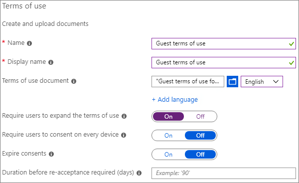
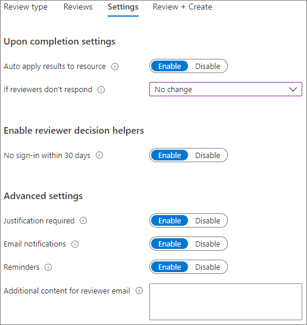

# Een beveiligde omgeving voor het delen met gasten makenCreate a secure guest sharing environment

In dit artikel vindt u verschillende opties voor het maken van een veilige omgeving voor het delen met gasten in Microsoft 365.In this article, we'll walk through a variety of options for creating a secure guest sharing environment in Microsoft 365. Dit zijn voorbeelden om u een idee te geven van de beschikbare opties.These are examples to give you an idea of the options available. U kunt deze procedures in verschillende combinaties gebruiken om te voldoen aan de beveiligings- en compliance-behoeften van uw organisatie.You can use these procedures in different combinations to meet the security and compliance needs of your organization.

Dit artikel bevat:This article includes:

- Meervoudige verificatie voor gasten instellen.Setting up multi-factor authentication for guests.
- Gebruiksvoorwaarden voor gasten instellen.Setting up a terms of use for guests.
- Driemaandelijkse beoordelingen voor gasttoegang instellen om periodiek te valideren of gasten nog steeds toestemming nodig hebben voor teams en sites.Setting up quarterly guest access reviews to periodically validate whether guests continue to need permissions to teams and sites.
- Gasten beperken tot alleen webtoegang voor onbeheerde apparaten.Restricting guests to web-only access for unmanaged devices.
- Een time-outbeleid voor sessies configureren om ervoor te zorgen dat gasten dagelijks worden geverifieerd.Configuring a session timeout policy to ensure guests authenticate daily.
- Een type voor gevoelige informatie maken voor een zeer gevoelig project.Creating a sensitive information type for a highly sensitive project.
- Automatisch een vertrouwelijkheidslabel toewijzen aan documenten die het type gevoelige informatie bevatten.Automatically assigning a sensitivity label to documents that contain a sensitive information type.
- Gasttoegang automatisch verwijderen voor bestanden met een vertrouwelijkheidslabel.Automatically removing guest access from files with a sensitivity label.

Voor een aantal van de opties die in dit artikel worden beschreven, moeten gasten een account hebben in Azure Active Directory.Some of the options discussed in this article require guests to have an account in Azure Active Directory. Als u er zeker van wilt zijn dat gasten worden opgenomen in de adreslijst wanneer u bestanden en mappen met hen deelt, gebruikt u de [SharePoint- en OneDrive-integratie met Azure AD B2B Preview](https://docs.microsoft.com/sharepoint/sharepoint-azureb2b-integration-preview).To ensure that guests are included in the directory when you share files and folders with them, use the [SharePoint and OneDrive integration with Azure AD B2B Preview](https://docs.microsoft.com/sharepoint/sharepoint-azureb2b-integration-preview).

Merk op dat we het in dit artikel niet hebben over het inschakelen van instellingen voor het delen met gasten.Note that we won't discuss enabling guest sharing settings in this article. Zie [Samenwerken met personen buiten uw organisatie](collaborate-with-people-outside-your-organization.md) voor meer informatie over het inschakelen van de functie voor het delen met gasten onder verschillende scenario's.See [Collaborating with people outside your organization](collaborate-with-people-outside-your-organization.md) for details about enabling guest sharing for different scenarios.

## Meervoudige verificatie instellen voor gastenSet up multi-factor authentication for guests

Meervoudige verificatie vermindert de kans dat een account wordt aangetast aanzienlijk.Multi-factor authentication greatly reduces the chances of an account being compromised. Aangezien gasten mogelijk persoonlijke e-mailaccounts gebruiken die niet voldoen aan enig beleid of aanbevolen procedures, is het belangrijk dat u meervoudige verificatie van gasten vereist.Since guests may be using personal email accounts that don't adhere to any governance policies or best practices, it's especially important to require multi-factor authentication for guests. Als de gebruikersnaam en het wachtwoord van een gast worden gestolen, vermindert het vereisen van een tweede verificatiestap de kans dat onbekende partijen toegang krijgen tot uw sites en bestanden aanzienlijk.If a guest's username and password is stolen, requiring a second factor of authentication greatly reduces the chances of unknown parties gaining access to your sites and files.

In dit voorbeeld wordt meervoudige verificatie voor gasten ingesteld met behulp van een beleid voor voorwaardelijke toegang in Azure Active Directory.In this example, we'll set up multi-factor authentication for guests by using a conditional access policy in Azure Active Directory.

Meervoudige verificatie instellen voor gastenTo set up multi-factor authentication for guests

1. Ga naar [Beleid voor voorwaardelijke toegang in Azure](https://portal.azure.com/#blade/Microsoft_AAD_IAM/ConditionalAccessBlade).Go to [Azure conditional access policies](https://portal.azure.com/#blade/Microsoft_AAD_IAM/ConditionalAccessBlade).
2. Klik in de blade **Voorwaardelijke toegang | Beleid** op **Nieuw beleid**.On the **Conditional Access | Policies** blade, click **New policy**.
3. Typ een naam in het veld **Naam**.In the **Name** field, type a name.
4. Klik onder **toewijzingen** op **gebruikers en groepen**.Under **Assignments**, click **Users and groups**.
5. Selecteer op de blade **Gebruikers en groepen**, de optie **Gebruikers en groepen selecteren**. Schakel vervolgens het selectievakje **Alle gasten en externe gebruikers** in.On the **Users and groups** blade, select **Select users and groups**, select the **All guests and external users** check box.
6. Klik onder **Toewijzingen** op **Cloud-apps of -acties**.Under **Assignments**, click **Cloud apps or actions**.
7. Selecteer op de blade **Cloud-apps of -acties**, **Alle Cloud-apps** op het tabblad **Opnemen**.On the **Cloud apps or actions** blade, select **All cloud apps** on the **Include** tab.
8. Klik onder **Toegangsbeheer** op **Toewijzen**.Under **Access controls**, click **Grant**.
9. Schakel op de blade **Toewijzen** het selectievakje **Meervoudige verificatie vereisen** in en klik vervolgens op **Selecteren**.On the **Grant** blade, select the **Require multi-factor authentication** check box, and then click **Select**.
10. Klik op de blade **Nieuw** onder **Beleid inschakelen** op **Aan** en klik vervolgens op **Maken**.On the **New** blade, under **Enable policy**, click **On**, and then click **Create**.

Nu moeten gasten zich eerst inschrijven voor meervoudige verificatie voordat ze toegang krijgen tot gedeelde inhoud, sites of teams.Now, guest will be required to enroll in multi-factor authentication before they can access shared content, sites, or teams.

### Meer informatieMore information

[Een implementatie van meervoudige verificatie in Azure AD plannenPlanning an Azure AD Multi-Factor Authentication deployment](https://docs.microsoft.com/azure/active-directory/authentication/howto-mfa-getstarted)

## Gebruiksvoorwaarden voor gasten instellenSet up a terms of use for guests

In sommige situaties hebben gasten mogelijk geen geheimhoudingsovereenkomsten of andere juridische overeenkomsten met uw organisatie ondertekend.In some situations guests may not have signed non-disclosure agreements or other legal agreements with your organization. U kunt instellen dat gasten een gebruiksrechtovereenkomst moeten accepteren, voordat ze toegang krijgen tot bestanden die met hen zijn gedeeld.You can require guests to agree to a terms of use before accessing files that are shared with them. De gebruiksvoorwaarden kunnen worden weergegeven wanneer ze de eerste keer proberen toegang te krijgen tot een gedeeld bestand of een gedeelde site.The terms of use can be displayed the first time they attempt to access a shared file or site.

Als u gebruiksvoorwaarden wilt maken, moet u eerst het document maken in Word of een andere tekstverwerker en het vervolgens opslaan als een PDF-bestand.To create a terms of use, you first need to create the document in Word or another authoring program, and then save it as a .pdf file. Dit bestand kan vervolgens worden geüpload naar Azure AD.This file can then be uploaded to Azure AD.

Gebruiksvoorwaarden voor Azure AD makenTo create an Azure AD terms of use

1. Meld u aan bij Azure als een globale beheerder, beveiligingsbeheerder of beheerder van voorwaardelijke toegang.Sign in to Azure as a Global Administrator, Security Administrator, or Conditional Access Administrator.
2. Navigeer naar [gebruiksvoorwaarden](https://aka.ms/catou).Navigate to [Terms of use](https://aka.ms/catou).
3. Klik op **nieuwe voorwaarden**.Click **New terms**.

   

4. Typ een **Naam** en **Weergavenaam**.Type a **Name** and **Display name**.
6. Voor **gebruiksrechtovereenkomst** bladert u naar het PDF-bestand dat u hebt gemaakt en selecteert u het.For **Terms of use document**, browse to the pdf file that you created and select it.
7. Selecteer de taal voor uw gebruiksrechtovereenkomst.Select the language for your terms of use document.
8. Stel **Gebruikers verplichten om de gebruiksvoorwaarden uit te vouwen** in op **Aan**.Set **Require users to expand the terms of use** to **On**.
9. Kies onder **Voorwaardelijke toegang** in de lijst **Afdwingen met sjabloon voor voorwaardelijke toegang**, **Maak later een beleid voor voorwaardelijke toegang**.Under **Conditional Access**, in the **Enforce with Conditional Access policy template** list choose **Create conditional access policy later**.
10. Klik op **Maken**.Click **Create**.

Als u de gebruiksvoorwaarden hebt gemaakt, is de volgende stap het maken van een beleid voor voorwaardelijke toegang waarin de gebruiksrechtovereenkomst voor gasten wordt weergegeven.Once you've created the terms of use, the next step is to create a conditional access policy that displays the terms of use to guests.

Een voorwaardelijk toegangsbeleid makenTo create a conditional access policy

1. Ga naar [Beleid voor voorwaardelijke toegang in Azure](https://portal.azure.com/#blade/Microsoft_AAD_IAM/ConditionalAccessBlade).Go to [Azure conditional access policies](https://portal.azure.com/#blade/Microsoft_AAD_IAM/ConditionalAccessBlade).
2. Klik in de blade **Voorwaardelijke toegang | Beleid** op **Nieuw beleid**.On the **Conditional Access | Policies** blade, click **New policy**.
3. Typ een naam in het vak **Naam**.In the **Name** box, type a name.
4. Klik onder **toewijzingen** op **gebruikers en groepen**.Under **Assignments**, click **Users and groups**.
5. Selecteer op de blade **Gebruikers en groepen**, de optie **Gebruikers en groepen selecteren**. Schakel vervolgens het selectievakje **Alle gasten en externe gebruikers** in.On the **Users and groups** blade, select **Select users and groups**, select the **All guests and external users** check box.
6. Klik onder **Toewijzingen** op **Cloud-apps of -acties**.Under **Assignments**, click **Cloud apps or actions**.
7. Selecteer op het tabblad **Opnemen**, **Apps selecteren** en klik vervolgens op **Selecteren**.On the **Include** tab, select **Select apps**, and then click **Select**.
8. Selecteer op de blade **selecteren**, **Microsoft Teams**, **Office 365 SharePoint Online** en **Outlook Groups** en klik vervolgens op **Selecteren**.On the **Select** blade, select **Microsoft Teams**, **Office 365 SharePoint Online**, and **Outlook Groups**, and then click **Select**.
9. Klik onder **Toegangsbeheer** op **Toewijzen**.Under **Access controls**, click **Grant**.
10. Selecteer op de blade **Toewijzen** de optie **Gebruiksrechtovereenkomst voor gasten** en klik vervolgens op **Selecteren**.On the **Grant** blade, select **Guest terms of use**, and then click **Select**.
11. Klik op de blade **Nieuw** onder **Beleid inschakelen** op **Aan** en klik vervolgens op **Maken**.On the **New** blade, under **Enable policy**, click **On**, and then click **Create**.

De eerste keer dat een gast probeert toegang te krijgen tot inhoud of een team of site in uw organisatie, moeten ze de gebruiksvoorwaarden accepteren.Now, the first time a guest attempts to access content or a team or site in your organization, they will be required to accept the terms of use.

> [!NOTE]
> Het gebruik van voorwaardelijke toegang vereist een licentie voor Azure AD Premium P1.Using Conditional Access requires an Azure AD Premium P1 license. Raadpleeg [Wat is voorwaardelijke toegang](https://docs.microsoft.com/azure/active-directory/conditional-access/overview) voor meer informatie.For more information, see [What is Conditional Access](https://docs.microsoft.com/azure/active-directory/conditional-access/overview).

### Meer informatieMore information

[Gebruiksvoorwaarden voor Azure Active DirectoryAzure Active Directory terms of use](https://docs.microsoft.com/azure/active-directory/conditional-access/terms-of-use)

## Revisies voor gasttoegang instellenSet up guest access reviews

Met toegangscontroles in Azure AD kunt u een periodieke beoordeling van gebruikerstoegang tot verschillende teams en groepen automatiseren.With access reviews in Azure AD, you can automate a periodic review of user access to various teams and groups. Door specifiek een toegangscontrole voor gasten te vereisen, kunt u ervoor zorgen dat gasten niet langer toegang houden tot gevoelige informatie van uw organisatie dan nodig is.By requiring an access review for guests specifically, you can help ensure guests do not retain access to your organization's sensitive information for longer than is necessary.

De controle van de toegang van een gast instellenTo set up a guest access review

1. Klik op de pagina [Identiteitsbeheer](https://portal.azure.com/#blade/Microsoft_AAD_ERM/DashboardBlade) in het linkermenu op **Toegangscontroles**.On the [Identity Governance page](https://portal.azure.com/#blade/Microsoft_AAD_ERM/DashboardBlade), in the left menu, click **Access reviews**.
2. Klik op **nieuwe toegangscontrole**.Click **New access review**.
3. Kies de optie **Teams + Groepen**.Choose the **Teams + Groups** option.
4. Kies de optie **Alle Microsoft 365-groepen met gastgebruikers**.Choose the **All Microsoft 365 groups with guest users** option. Klik **Groep(en) selecteren om uit te sluiten** als u groepen wilt uitsluiten.Click **Select group(s) to exclude** if you want to exclude any groups.
5. Kies de optie **Alleen gastgebruikers** en klik vervolgens op **Volgende: Beoordelingen**.Choose the **Guest users only** option, and then click **Next: Reviews**.
6. Kies onder **Revisoren selecteren** de optie **Groepseigenaar(s)**.Under **Select reviewers**, choose **Group Owner(s)**.
7. Klik **Revisoren voor terugval selecteren**, kies wie de revisoren voor de terugval moeten zijn en klik vervolgens op **Selecteren**.Click **Select fallback reviewers**, choose who should be the fallback reviewers, and then click **Select**.
8. Kies onder **Terugkeerpatroon voor revisie specificeren** de optie **Elk kwartaal**.Under **Specify recurrence of review**, choose **Quarterly**.
9. Selecteer een begindatum en duur.Select a start date and duration.
10. Kies voor **Einde** de optie **Nooit** en klik vervolgens op **Volgende: Instellingen**.For **End**, choose **Never**, and then click **Next: Settings**.

    

11. Controleer op het tabblad **Instellingen** de instellingen voor naleving van uw bedrijfsregels.On the **Settings** tab, review the settings for compliance with your business rules.

    

12. Klik op **Volgendet: Controleren + Maken**.Click **Next: Review + Create**.
13. Typ een **Controlenaam** en controleer de instellingen.Type a **Review name** and review the settings.
14. Klik op **Maken**.Click **Create**.

Het is belangrijk op te merken dat gasten toegang kunnen krijgen tot teams of groepen, of tot individuele bestanden en mappen.It's important to note that guests can be given access to teams or groups, or to individual files and folders. Als u toegang tot bestanden en mappen hebt gegeven, worden gasten mogelijk niet aan een bepaalde groep toegevoegd.When given access to files and folders, guests may not be added to any particular group. Als u toegangscontroles wilt uitvoeren op gasten die niet tot een team of groep behoren, kunt u een dynamische groep in Azure AD maken die alle gasten bevat en vervolgens een toegangscontrole voor die groep maken.If you want to do access reviews on guests who don't belong to a team or group, you can create a dynamic group in Azure AD to contain all guests and then create an access review for that group. Site-eigenaren kunnen ook de [vervaltijd van gasttoegang voor de site](https://support.microsoft.com/office/25bee24f-42ad-4ee8-8402-4186eed74dea) beherenSite owners can also manage [guest expiration for the site](https://support.microsoft.com/office/25bee24f-42ad-4ee8-8402-4186eed74dea)

### Meer informatieMore information

[Gasttoegang beheren met Azure AD-toegangscontrolesManage guest access with Azure AD access reviews](https://docs.microsoft.com/azure/active-directory/governance/manage-guest-access-with-access-reviews)

[Een toegangscontrole maken voor groepen of toepassingen in Azure AD-toegangscontrolesCreate an access review of groups or applications in Azure AD access reviews](https://docs.microsoft.com/azure/active-directory/governance/create-access-review)

## Stel webtoegang in voor gastenSet up web-only access for guests

U kunt het risico op een aanval beperken en het beheer vereenvoudigen door gasten alleen toegang te verlenen tot uw teams, sites en bestanden via een webbrowser.You can reduce your attack surface and ease administration by requiring guests to access your teams, sites, and files by using a web browser only.

Voor Microsoft 365 en Teams wordt dit gedaan met beleid voor voorwaardelijke toegang van Azure AD.For Microsoft 365 Groups and Teams, this is done with an Azure AD conditional access policy. Voor SharePoint is dit geconfigureerd in het SharePoint-beheercentrum.For SharePoint, this is configured in the SharePoint admin center. (U kunt ook [vertrouwelijkheidslabels gebruiken om de toegang van gasten te beperken tot alleen webtoegang ](https://docs.microsoft.com/microsoft-365/compliance/sensitivity-labels-teams-groups-sites).)(You can also [use sensitivity labels to restrict guests to web-only access](https://docs.microsoft.com/microsoft-365/compliance/sensitivity-labels-teams-groups-sites).)

De toegang van gasten beperken tot alleen webtoegang voor Groepen en Teams:To restrict guests to web-only access for Groups and Teams:

1. Ga naar [Beleid voor voorwaardelijke toegang in Azure](https://portal.azure.com/#blade/Microsoft_AAD_IAM/ConditionalAccessBlade).Go to [Azure conditional access policies](https://portal.azure.com/#blade/Microsoft_AAD_IAM/ConditionalAccessBlade).
2. Klik in de blade **voorwaardelijke toegang - beleid** op **nieuw beleid**.On the **Conditional Access - Policies** blade, click **New policy**.
3. Typ een naam in het vak **Naam**.In the **Name** box, type a name.
4. Klik onder **toewijzingen** op **gebruikers en groepen**.Under **Assignments**, click **Users and groups**.
5. Selecteer op de blade **Gebruikers en groepen**, de optie **Gebruikers en groepen selecteren**. Schakel vervolgens het selectievakje **Alle gasten en externe gebruikers** in.On the **Users and groups** blade, select **Select users and groups**, select the **All guests and external users** check box.
6. Klik onder **Toewijzingen** op **Cloud-apps of -acties**.Under **Assignments**, click **Cloud apps or actions**.
7. Selecteer op het tabblad **Opnemen**, **Apps selecteren** en klik vervolgens op **Selecteren**.On the **Include** tab, select **Select apps**, and then click **Select**.
8. Selecteer op de blade **Selecteren** de opties **Microsoft Teams** eb **Outlook Groups** en klik vervolgens op **Selecteren**.On the **Select** blade, select **Microsoft Teams** and **Outlook Groups**, and then click **Select**.
9. Klik onder **toewijzingen** op **voorwaarden**.Under **Assignments**, click **Conditions**.
10. Klik op de blade **Voorwaarden** op **Client-apps**.On the **Conditions** blade, click **Client apps**.
11. Klik op de blade **Client-apps** op **Ja** voor **Configureren** en selecteer vervolgens de instellingen voor **Mobiele apps- en bureaublad-clients**, **Exchange ActiveSync-clients** en **Andere clients**.On the **Client apps** blade, click **Yes** for **Configure**, and then select the **Mobile apps and desktop clients**, **Exchange ActiveSync clients**, and **Other clients** settings. Schakel het selectievakje **Browser** uit.Clear the **Browser** check box.

    

12. Klik op **Gereed**.Click **Done**.
13. Klik onder **Toegangsbeheer** op **Toewijzen**.Under **Access controls**, click **Grant**.
14. Selecteer op de blade **toewijzen** de optie **vereisen dat apparaat moet worden gemarkeerd als compatibel** en **vereisen dat hybride Azure AD-aan het apparaat is toegevoegd**.On the **Grant** blade, select **Require device to be marked as compliant** and **Require Hybrid Azure AD joined device**.
15. Selecteer onder **voor meerdere besturingselementen** **een van de geselecteerde besturingselementen vereisen** en klik vervolgens op **selecteren**.Under **For multiple controls**, select **Require one of the selected controls**, and then click **Select**.
16. Klik op de blade **Nieuw** onder **Beleid inschakelen** op **Aan** en klik vervolgens op **Maken**.On the **New** blade, under **Enable policy**, click **On**, and then click **Create**.

De toegang van gasten beperken tot alleen webtoegang voor SharePointTo restrict guests to web-ony access for SharePoint

1. Vouw in het [SharePoint Online Beheercentrum](https://admin.microsoft.com/sharepoint) **Beleid** uit en klik op **Toegangsbeheer**.In the [SharePoint admin center](https://admin.microsoft.com/sharepoint), expand **Policies** and click **Access control**.
2. Klik op **Niet-beheerde apparaten**.Click **Unmanaged devices**.
3. Schakel de optie **Alleen beperkte webtoegang toestaan** in en klik op **Opslaan**.Select the **Allow limited, web-only access** option, and then click **Save**.

Met deze instelling in het SharePoint-beheercentrum wordt een bijbehorend beleid voor voorwaardelijke toegang in Azure Active Directory gemaakt.Note that this setting in the SharePoint admin center creates a supporting conditional access policy in Azure AD.

## Configureer een beleid voor de time-out van een sessie voor gasten.Configure a session timeout for guests

Vereisen dat gasten regelmatig verifiëren, kan de kans verkleinen dat onbekende gebruikers toegang krijgen tot de inhoud van uw organisatie, als het apparaat van een gast niet veilig is.Requiring guests to authenticate on a regular basis can reduce the possibility of unknown users accessing your organization's content if a guest's device isn't kept secure. U kunt een voorwaardelijk toegangsbeleid voor sessie time-outs configureren voor gasten in Azure AD.You can configure a session timeout conditional access policy for guests in Azure AD.

Een beleid voor de time-out van een gastsessie configurerenTo configure a guest session timeout policy

1. Ga naar [Beleid voor voorwaardelijke toegang in Azure](https://portal.azure.com/#blade/Microsoft_AAD_IAM/ConditionalAccessBlade).Go to [Azure conditional access policies](https://portal.azure.com/#blade/Microsoft_AAD_IAM/ConditionalAccessBlade).
2. Klik in de blade **voorwaardelijke toegang - beleid** op **nieuw beleid**.On the **Conditional Access - Policies** blade, click **New policy**.
3. Typ in het vak **naam** *time-out van gast sessie*.In the **Name** box, type *Guest session timeout*.
4. Klik onder **toewijzingen** op **gebruikers en groepen**.Under **Assignments**, click **Users and groups**.
5. Selecteer op de blade **Gebruikers en groepen**, de optie **Gebruikers en groepen selecteren**. Schakel vervolgens het selectievakje **Alle gasten en externe gebruikers** in.On the **Users and groups** blade, select **Select users and groups**, select the **All guests and external users** check box.
6. Klik onder **Toewijzingen** op **Cloud-apps of -acties**.Under **Assignments**, click **Cloud apps or actions**.
7. Selecteer op het tabblad **Opnemen**, **Apps selecteren** en klik vervolgens op **Selecteren**.On the **Include** tab, select **Select apps**, and then click **Select**.
8. Selecteer op de blade **selecteren**, **Microsoft Teams**, **Office 365 SharePoint Online** en **Outlook Groups** en klik vervolgens op **Selecteren**.On the **Select** blade, select **Microsoft Teams**, **Office 365 SharePoint Online**, and **Outlook Groups**, and then click **Select**.
9. Klik onder **toegangsbeheer** op **sessie**.Under **Access controls**, click **Session**.
10. Op de blade **sessie** selecteert u **aanmeldingsfrequentie**.On the **Session** blade, select **Sign-in frequency**.
11. Selecteer **1** en **dagen** voor de tijdsperiode en klik vervolgens op **selecteren**.Select **1** and **Days** for the time period, and then click **Select**.
12. Klik op de blade **Nieuw** onder **Beleid inschakelen** op **Aan** en klik vervolgens op **Maken**.On the **New** blade, under **Enable policy**, click **On**, and then click **Create**.

## Een type voor gevoelige informatie maken voor een zeer gevoelig projectCreate a sensitive information type for a highly sensitive project

De typen gevoelige informatie zijn vooraf gedefinieerde tekenreeksen die kunnen worden gebruikt in werkstromen om nalevingsvereisten af te dwingen.Sensitive information types are predefined strings that can be used in policy workflows to enforce compliance requirements. Het Microsoft 365 Compliance Center bevat meer dan honderd soorten gevoelige informatie, waaronder rijbewijsnummers, creditcardnummers, bankrekeningnummers, enz.The Microsoft 365 Compliance Center comes with over one hundred sensitive information types, including driver's license numbers, credit card numbers, bank account numbers, etc.

U kunt aangepaste typen gevoelige informatie maken om inhoud te beheren die specifiek is voor uw organisatie.You can create custom sensitive information types to help manage content specific to your organization. In dit voorbeeld maken we een aangepast type voor gevoelige informatie voor een zeer gevoelig project.In this example, we'll create a custom sensitive information type for a highly sensitive project. Vervolgens kunnen we dit type gevoelige informatie gebruiken om automatisch een vertrouwelijkheidslabel toe te wijzen.We can then use this sensitive information type to automatically apply a sensitivity label.

Een gevoelig informatietype makenTo create a sensitive information type

1. Vouw in het [Microsoft 365 Compliance Center](https://compliance.microsoft.com) in de linkernavigatiebalk **Classificatie** uit en klik vervolgens op **Gevoelige informatietypen**.In the [Microsoft 365 Compliance Center](https://compliance.microsoft.com), in the left navigation, expand **Classification**, and then click **Sensitive info types**.
2. Klik op **Maken**.Click **Create**.
3. Voor **naam** en **beschrijving** typt u **Project Saturnus** en klik vervolgens op **volgende**.For **Name** and **Description**, type **Project Saturn**, and then click **Next**.
4. Klik op **een element toevoegen**.Click **Add an element**.
5. Selecteer **Trefwoorden** in de lijst **Inhoud zoeken met** en typ *Project Saturnus* in het trefwoordvak.On the **Detect content containing** list, select **Keywords**, and then type *Project Saturn* in the keyword box.
6. Klik op **Volgende** en vervolgens op **Voltooien**.Click **Next**, and then click **Finish**.
7. Als u wordt gevraagd of u het gevoelige informatietype wilt testen, klikt u op **Nee**.If asked if you would like to test the sensitive information type, click **No**.

### Meer informatieMore information

[Aangepaste gevoelige informatietypenCustom sensitive information types](https://docs.microsoft.com/Office365/SecurityCompliance/custom-sensitive-info-types)

## Een beleid voor automatisch labellen maken om een vertrouwelijkheidslabel toe te wijzen op basis van een type gevoelige informatieCreate an auto-labeling policy to assign a sensitivity label based on a sensitive information type

Als u in uw organisatie vertrouwelijkheidslabel gebruikt, kunt u automatisch een label toepassen op bestanden die gedefinieerde typen gevoelige informatie bevatten.If you are using sensitivity labels in your organization, you can automatically apply a label to files that contain defined sensitive information types. 

Een beleid voor automatisch labellen makenTo create an auto-labeling policy

1. Open het [Microsoft 365-compliancecentrum](https://compliance.microsoft.com).Open the [Microsoft 365 compliance admin center](https://compliance.microsoft.com).
2. Klik in het navigatievenster aan de linkerkant op **Informatiebeveiliging**.In the left navigation, click **Information protection**.
3. Klik op het tabblad **Automatisch labellen** op **Beleid voor automatisch labellen maken**.On the **Auto-labeling** tab, click **Create auto-labeling policy**.
4. Op de pagina **Kies de info waarop dit label moet worden toegepast** kiest u **Aangepast** en klikt u op **Volgende**.On the **Choose info you want this label applied to** page, choose **Custom** and click **Next**.
5. Typ een naam en beschrijving voor het beleid en klik op **Volgende**.Type a name and description for the policy and click **Next**.
6. Op de pagina **Locaties kiezen waarop u het label wilt toepassen**, schakelt u **SharePoint-sites** in en klikt u op **Sites kiezen**.On the **Choose locations where you want to apply the label** page, turn on **SharePoint sites** and click **Choose sites**.
7. Voeg de URL's toe van de sites waarvoor u automatisch labellen wilt inschakelen en klik op **Gereed**.Add the URLs for the sites where you want to turn on auto-labeling and click **Done**.
8. Klik op **Volgende**.Click **Next**.
9. Kies op de pagina **Algemene of geavanceerde regels instellen** de optie **Algemene regels** en klik op **Volgende**.On the **Set up common or advanced rules** page, choose **Common rules** and click **Next**.
10. Klik op de pagina **Regels voor inhoud op alle locaties definiëren** op **Nieuwe regel**.On the **Define rules for content in all locations** page, click **New rule**.
11. Geef op de pagina **Nieuwe regel** een naam op voor de regel, klik op **Voorwaarde toevoegen** en klik vervolgens op **Inhoud bevat typen gevoelige info**.On the **New rule** page, give the rule a name, click **Add condition**, and then click **Content contains sensitive info types**.
12. Klik op **Toevoegen**, klik op **Typen gevoelige informatie**, kies de typen gevoelige informatie die u wilt gebruiken, klik op **Toevoegen** en klik vervolgens op **Opslaan**.Click **Add**, click **Sensitive info types**, choose the sensitive info types that you want to use, click **Add**, and then click **Save**.
13. Klik op **Volgende**.Click **Next**.
14. Klik op **Kies een label**, selecteer het label dat u wilt gebruiken en klik vervolgens op **Toevoegen**.Click **Choose a label**, select the label you want to use, and then click **Add**.
15. Klik op **Volgende**.Click **Next**.
16. Laat het beleid in de simulatiemodus staan en klik op **Volgende**.Leave the policy in simulation mode and click **Next**.
17. Klik op **Beleid maken** en klik vervolgens op **Gereed**.Click **Create policy**, and then click **Done**.

Als het beleid van kracht is, zal het beleid voor automatisch labellen, wanneer een gebruiker 'Project Saturnus' in een document typt, automatisch het gespecificeerde label toepassen wanneer het bestand wordt gescand.With the policy in place, when a user types "Project Saturn" into a document, the auto-labeling policy will automatically apply the specified label when it scans the file.

### Meer informatieMore information

[Een vertrouwelijkheidslabel automatisch toepassen op inhoudApply a sensitivity label to content automatically](https://docs.microsoft.com/microsoft-365/compliance/apply-sensitivity-label-automatically)

## Een DLP-beleid maken voor het verwijderen van gasttoegang tot zeer gevoelige bestandenCreate a DLP policy to remove guest access to highly sensitive files

U kunt [Preventie van gegevensverlies (DLP)](https://docs.microsoft.com/microsoft-365/compliance/data-loss-prevention-policies) gebruiken om het ongewenst delen van gevoelige inhoud met gasten te voorkomen.You can use [data loss prevention (DLP)](https://docs.microsoft.com/microsoft-365/compliance/data-loss-prevention-policies) to prevent unwanted guest sharing of sensitive content. Preventie van gegevensverlies kan actie ondernemen op basis van het vertrouwelijkheidslabel van een bestand en gasttoegang verwijderen.Data loss prevention can take action based on a file's sensitivity label and remove guest access.

Een DLP-regel makenTo create a DLP rule

1. Ga in het Microsoft 365-compliancecentrum naar de pagina [Preventie van gegevensverlies](https://compliance.microsoft.com/datalossprevention).In the Microsoft 365 compliance admin center, go to the [Data loss prevention page](https://compliance.microsoft.com/datalossprevention).
2. Klik op **Beleid maken**.Click **Create policy**.
3. Kies **Aangepast** en klik op **Volgende**.Choose **Custom** and click **Next**.
4. Typ een naam voor het beleid en klik op **Volgende**.Type a name for the policy and click **Next**.
5. Schakel op de pagina **Locaties waarop het beleid wordt toegepast** alle instellingen uit, behalve **SharePoint-sites** en **OneDrive-accounts** en klik vervolgens op **Volgende**.On the **Locations to apply the policy** page turn off all settings except **SharePoint sites** and **OneDrive accounts**, and then click **Next**.
6. Klik op de pagina **Beleidsinstellingen definiëren** op **Volgende**.On the **Define policy settings** page, click **Next**.
7. Klik op de pagina **Geavanceerde DLP-regels aanpassen** op **Regel maken** en typ een naam voor de regel.On the **Customize advanced DLP rules** page, click **Create rule** and type a name for the rule.
8. Klik onder **Voorwaarden** op **Voorwaarde toevoegen** en kies **Inhoud bevat**.Under **Conditions**, click **Add condition**, and choose **Content contains**.
9. Klik op **Toevoegen**, kies **Vertrouwelijkheidslabels**, kies de labels die u wilt gebruiken en klik op **Toevoegen**.Click **Add**, choose **Sensitivity labels**, choose the labels you want to use, and click **Add**.

   

10. Klik onder **Acties** op **Een actie toevoegen** en kies vervolgens **Inhoud van de Microsoft 365-locaties versleutelen of de toegang beperken**.Under **Actions** click **Add an action** and choose **Restrict access or encrypt the content in Microsoft 365 locations**.
11. Selecteer het selectievakje **Inhoud van de Microsoft 365-locaties versleutelen of de toegang beperken** en kies vervolgens de optie **Alleen personen buiten uw organisatie**.Select the **Restrict access or encrypt the content in Microsoft 365 locations** check box and then choose the **Only people outside your organization** option.

      

12. Klik op **Opslaan** en klik vervolgens op **Volgende**.Click **Save** and then click **Next**.
13. Kies de testopties en klik op **Volgende**.Choose your test options and click **Next**.
14. Klik op **Verzenden** en klik vervolgens op **Gereed**.Click **Submit**, and then click **Done**.

Houd er rekening mee dat met dit beleid de toegang niet wordt ontzegd als de gast lid is van de site of het team als geheel.It's important to note that this policy doesn't remove access if the guest is a member of the site or team as a whole. Als u van plan bent om zeer gevoelige documenten te gebruiken in een site of team met gastleden, kunt u overwegen [persoonlijke kanalen in Teams](https://support.microsoft.com/office/de3e20b0-7494-439c-b7e5-75899ebe6a0e) te gebruiken en alleen leden van uw organisatie toe te laten tot de persoonlijke kanalen.If you plan to have highly sensitive documents in a site or team with guest members, consider using [private channels in Teams](https://support.microsoft.com/office/de3e20b0-7494-439c-b7e5-75899ebe6a0e) and only allowing members of your organization in the private channels.

## Aanvullende optiesAdditional options

Er zijn enkele extra opties beschikbaar in Microsoft 365 en Azure Active Directory waarmee u uw omgeving voor het delen met gasten kunt beveiligen.There are some additional options in Microsoft 365 and Azure Active Directory that can help secure your guest sharing environment.

- U kunt een lijst maken met toegestane of geweigerde domeinen om te beperken met wie gebruikers kunnen delen.You can create a list of allowed or denied sharing domains to limit who users can share with. Zie [Delen van SharePoint- en OneDrive-inhoud per domein beperken](https://docs.microsoft.com/sharepoint/restricted-domains-sharing) en [Uitnodigingen voor B2B-gebruikers van specifieke organisaties toestaan of blokkeren](https://docs.microsoft.com/azure/active-directory/b2b/allow-deny-list) voor meer informatie.See [Restrict sharing of SharePoint and OneDrive content by domain](https://docs.microsoft.com/sharepoint/restricted-domains-sharing) and [Allow or block invitations to B2B users from specific organizations](https://docs.microsoft.com/azure/active-directory/b2b/allow-deny-list) for more information.
- U kunt bepalen met welke andere Azure Active Directory-tenants uw gebruikers verbinding kunnen maken.You can limit which other Azure Active Directory tenants your users can connect to. Zie [Tenant beperkingen gebruiken voor het beheren van de toegang tot SaaS-cloud-toepassingen](https://docs.microsoft.com/azure/active-directory/manage-apps/tenant-restrictions) voor meer informatie.See [Use tenant restrictions to manage access to SaaS cloud applications](https://docs.microsoft.com/azure/active-directory/manage-apps/tenant-restrictions) for information.
- U kunt een beheerde omgeving maken waar partners kunnen helpen bij het beheren van gastaccounts.You can create a managed environment where partners can help manage guest accounts. Zie [Een B2B-extranet maken met beheerde gasten](https://docs.microsoft.com/Office365/Enterprise/b2b-extranet) voor meer informatie.See [Create a B2B extranet with managed guests](https://docs.microsoft.com/Office365/Enterprise/b2b-extranet) for information.

## Zie ookSee Also

[Accidentele blootstelling aan bestanden beperken tijdens het delen met gastenLimit accidental exposure to files when sharing with guests](share-limit-accidental-exposure.md)

[Aanbevolen procedures voor het delen van bestanden en mappen met niet-geverifieerde gebruikersBest practices for sharing files and folders with unauthenticated users](best-practices-anonymous-sharing.md)

[Een B2B-extranet maken met beheerde gastenCreate a B2B extranet with managed guests](b2b-extranet.md)
