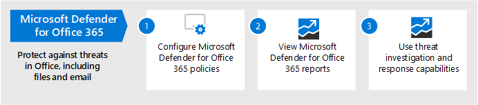
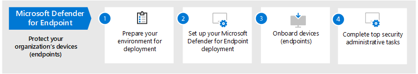

# Mogelijkheden voor bedreigingsbeveiliging configureren in Microsoft 365Configure threat protection capabilities across Microsoft 365

Volg deze stappen om bedreigingsbeveiliging te configureren in Microsoft 365.Follow these steps to configure threat protection across Microsoft 365.

## Stap 1: Meervoudige verificatie en beleidsregels voor voorwaardelijke toegang instellenStep 1: Set up multi-factor authentication and Conditional Access policies

[Bij meervoudige verificatie](https://docs.microsoft.com/azure/active-directory/authentication/concept-mfa-howitworks) (MFA) moeten gebruikers hun identiteit verifiëren met een telefoonoproep- of verificatie-app.[Multi-factor authentication](https://docs.microsoft.com/azure/active-directory/authentication/concept-mfa-howitworks) (MFA) requires users to verify their identity with a phone call or authenticator app. [Beleidsregels voor voorwaardelijke](https://docs.microsoft.com/azure/active-directory/conditional-access/overview) toegang definiëren bepaalde vereisten die moeten worden voldaan om ervoor te zorgen dat gebruikers toegang hebben tot apps en gegevens in Microsoft 365.[Conditional access policies](https://docs.microsoft.com/azure/active-directory/conditional-access/overview) define certain requirements that must be met in order for users to access apps and data in Microsoft 365. Beleidsregels voor MFA en voorwaardelijke toegang werken samen om uw organisatie te beschermen.MFA and Conditional Access policies work together to protect your organization. Als iemand zich bijvoorbeeld probeert aan te melden vanaf een mobiel apparaat met een account dat niet is ingeschakeld voor MFA en voor een beleid voor voorwaardelijke toegang is vereist dat MFA van kracht is, kan die gebruiker zich niet aanmelden.For example, if someone attempts to sign in from a mobile device using an account that  is not enabled for MFA, and a Conditional Access policy requires MFA to be in effect, that user will be prevented from signing in.  

Microsoft heeft een specifieke set voorwaardelijke toegang en verwante beleidsregels getest en aanbevolen voor de beveiliging van de toegang tot al uw SaaS-toepassingen, met name Microsoft 365.Microsoft has tested and recommends a specific set of Conditional Access and related policies for protecting access to all of your SaaS applications, especially Microsoft 365. Beleid wordt aanbevolen voor basislijnbeveiliging, gevoelige en sterk reguleerde beveiliging.Policies are recommended for baseline, sensitive, and highly regulated protection. Implementeert eerst het beleid voor basislijnbeveiliging.Begin by implementing the policies for baseline protection. 

 
 [een grotere versie van deze afbeelding](https://github.com/MicrosoftDocs/microsoft-365-docs/raw/public/microsoft-365/media/microsoft-365-policies-configurations/Identity_device_access_policies_byplan.png)
[See a larger version of this image](https://github.com/MicrosoftDocs/microsoft-365-docs/raw/public/microsoft-365/media/microsoft-365-policies-configurations/Identity_device_access_policies_byplan.png)

### Basislijnbeveiliging implementeren voor Microsoft 365To implement baseline protection for Microsoft 365

 

1. [Configureer vereisten, waaronder Azure AD Identity Protection.](../security/office-365-security/identity-access-prerequisites.md)[Configure prerequisites, including Azure AD Identity Protection](../security/office-365-security/identity-access-prerequisites.md).
2. [Configureer algemene beleidsregels voor identiteits- en apparaattoegang](../security/office-365-security/identity-access-policies.md) voor basislijnbeveiliging.[Configure common identity and device access policies](../security/office-365-security/identity-access-policies.md) for baseline protection.
3. Beleid configureren [voor gastgebruikers,](../security/office-365-security/identity-access-policies-guest-access.md) [Microsoft Teams,](../security/office-365-security/teams-access-policies.md) [Exchange Online,](../security/office-365-security/secure-email-recommended-policies.md) [SharePoint Online en OneDrive.](../security/office-365-security/sharepoint-file-access-policies.md)Configure policies for [guest users](../security/office-365-security/identity-access-policies-guest-access.md), [Microsoft Teams](../security/office-365-security/teams-access-policies.md), [Exchange Online](../security/office-365-security/secure-email-recommended-policies.md), and [SharePoint Online and OneDrive](../security/office-365-security/sharepoint-file-access-policies.md).

### Meer informatie over het beveiligen van identiteitenMore information about protecting identities

- [Configuratie van identiteiten en apparaattoegangIdentity and device access configurations](../security/office-365-security/microsoft-365-policies-configurations.md)
- [Beveiligings richtlijnen voor Azure MFASecurity guidance for Azure MFA](https://docs.microsoft.com/azure/active-directory/authentication/multi-factor-authentication-security-best-practices)

## Stap 2: Microsoft Defender configureren voor identiteitStep 2: Configure Microsoft Defender for Identity

[Microsoft Defender for Identity](https://docs.microsoft.com/azure-advanced-threat-protection/what-is-atp) is een cloud-gebaseerde beveiligingsoplossing die werkt met uw on-premises Active Directory Domain Services (AD DS) signalen voor het identificeren, detecteren en onderzoeken van geavanceerde bedreigingen, gekromde identiteiten en kwaadaardige insideracties die zijn gericht op uw organisatie.[Microsoft Defender for Identity](https://docs.microsoft.com/azure-advanced-threat-protection/what-is-atp) is a cloud-based security solution that works with your on-premises Active Directory Domain Services (AD DS) signals to identify, detect, and investigate advanced threats, compromised identities, and malicious insider actions directed at your organization.

Met Microsoft Defender for Identity worden beveiligingsbewerkingen (SecOps)-analisten en beveiligingsprofessionals die moeite hebben om geavanceerde aanvallen in hybride omgevingen te detecteren om het volgende te doen:Microsoft Defender for Identity enables security operations (SecOps) analysts and security professionals struggling to detect advanced attacks in hybrid environments to:
- Houd gebruikers, gedrag van entiteiten en activiteiten in de gaten met op leer gebaseerde analyse.Monitor users, entity behavior, and activities with learning-based analytics.
- Gebruikersidentiteiten en -referenties beveiligen die zijn opgeslagen in Active Directory.Protect user identities and credentials stored in Active Directory.
- Verdachte gebruikersactiviteiten en geavanceerde aanvallen in de hele kill chain identificeren en onderzoeken.Identify and investigate suspicious user activities and advanced attacks throughout the kill chain.
- Heldere incidentinformatie verstrekken op een eenvoudige tijdlijn voor snelle sortering.Provide clear incident information on a simple timeline for fast triage.

### Microsoft Defender instellen voor identiteitTo set up Microsoft Defender for Identity

 

1. [Stel Microsoft Defender voor identiteit in om](https://docs.microsoft.com/azure-advanced-threat-protection/install-atp-step1) uw primaire omgevingen te beveiligen.[Set up Microsoft Defender for Identity](https://docs.microsoft.com/azure-advanced-threat-protection/install-atp-step1) to protect your primary environments.
2. Bescherm al uw [domeincontrollers](https://docs.microsoft.com/azure-advanced-threat-protection/atp-sensor-monitoring) en [-forests.](https://docs.microsoft.com/azure-advanced-threat-protection/atp-multi-forest)Protect all your [domain controllers](https://docs.microsoft.com/azure-advanced-threat-protection/atp-sensor-monitoring) and [forests](https://docs.microsoft.com/azure-advanced-threat-protection/atp-multi-forest).
3. Integreer [microsoft Defender voor identiteitswaarschuwingen](https://docs.microsoft.com/azure-advanced-threat-protection/suspicious-activity-guide?tabs=external) in uw werkstroom voor beveiligingsbewerkingen (SecOps).Integrate [Microsoft Defender for Identity alerts](https://docs.microsoft.com/azure-advanced-threat-protection/suspicious-activity-guide?tabs=external) into your security operations (SecOps) workflow.

### Meer informatie over Microsoft Defender voor identiteitMore information about Microsoft Defender for Identity

- [Wat is Microsoft Defender for Identity?What is Microsoft Defender for Identity?](https://docs.microsoft.com/azure-advanced-threat-protection/what-is-atp)
- [Video: Inleiding tot Microsoft Defender voor identiteitVideo: Introduction to Microsoft Defender for Identity](https://www.youtube.com/watch?reload=9&v=EGY2m8yU_KE)
- [Microsoft Defender voor identiteitsimplementatieMicrosoft Defender for Identity deployment](https://docs.microsoft.com/azure-advanced-threat-protection/what-is-atp#whats-next)

## Stap 3: Microsoft 365 Defender in te zettenStep 3: Turn on Microsoft 365 Defender

[Microsoft 365 Defender combineert](https://docs.microsoft.com/microsoft-365/security/mtp/microsoft-threat-protection) signalen en mogelijkheden om zo één oplossing te maken.[Microsoft 365 Defender](https://docs.microsoft.com/microsoft-365/security/mtp/microsoft-threat-protection) combines signals and orchestrates capabilities into a single solution. Met de geïntegreerde Microsoft 365 Defender-oplossing kunnen beveiligingsprofessionals samenwerken aan de bedreigingssignalen dat elk van deze producten het volledige bereik en de impact van de bedreiging ontvangt en bepaalt. hoe de omgeving is ingevoerd, wat de gevolgen zijn en hoe deze op dit moment van invloed is op de organisatie.With the integrated Microsoft 365 Defender solution, security professionals can stitch together the threat signals that each of these products receive and determine the full scope and impact of the threat; how it entered the environment, what it's affected, and how it's currently impacting the organization. Microsoft 365 Defender voert automatische acties uit om de aanval en postvakken, eindpunten en gebruikersidentiteiten te voorkomen of te stoppen.Microsoft 365 Defender takes automatic action to prevent or stop the attack and self-heal affected mailboxes, endpoints, and user identities.

Microsoft 365 Defender defificeert waarschuwingen, incidenten, geautomatiseerd onderzoek en reactie, en geavanceerd zoeken naar werkbelastingen (Microsoft Defender for Identity, Microsoft Defender voor Office 365, Microsoft Defender voor Eindpunt en Microsoft Cloud App-beveiliging) in één deelvenster met een uitgebreide ervaring.Microsoft 365 Defender unifies alerts, incidents, automated investigation and response, and advanced hunting across workloads (Microsoft Defender for Identity, Microsoft Defender for Office 365, Microsoft Defender for Endpoint, and Microsoft Cloud App Security) into a single pane of glass experience. Nadat u een of meer van uw Defender voor Office 365-services hebt geconfigureerd, kunt u Microsoft 365 Defender in bedrijf zetten.After you have configured one or more of your Defender for Office 365 services, turn on Microsoft 365 Defender. Nieuwe functies worden voortdurend toegevoegd aan Microsoft 365 Defender. overweeg om preview-functies te ontvangen.New features are added continually to Microsoft 365 Defender; consider opting in to receive preview features.

### Microsoft 365 Defender instellenTo set up Microsoft 365 Defender

 

1. [Controleer de vereisten.](https://docs.microsoft.com/microsoft-365/security/mtp/prerequisites)[Review the prerequisites](https://docs.microsoft.com/microsoft-365/security/mtp/prerequisites).
2. [Schakel Microsoft 365 Defender in.](https://docs.microsoft.com/microsoft-365/security/mtp/mtp-enable)[Turn on Microsoft 365 Defender](https://docs.microsoft.com/microsoft-365/security/mtp/mtp-enable).
3. [Kies voor voorbeeldfuncties.](https://docs.microsoft.com/microsoft-365/security/mtp/preview)[Opt in for preview features](https://docs.microsoft.com/microsoft-365/security/mtp/preview).

### Meer informatie over Microsoft 365 DefenderMore information about Microsoft 365 Defender

- [Wat is Microsoft 365 Defender?What is Microsoft 365 Defender?](https://docs.microsoft.com/microsoft-365/security/mtp/microsoft-threat-protection)
- [Wat is er nieuw in Microsoft 365 DefenderWhat's new in Microsoft 365 Defender](https://docs.microsoft.com/microsoft-365/security/mtp/whats-new)

## Stap 4: Microsoft Defender voor Office 365 configurerenStep 4: Configure Microsoft Defender for Office 365

[Microsoft Defender voor Office 365](https://docs.microsoft.com/microsoft-365/security/office-365-security/office-365-atp) beschermt uw organisatie tegen schadelijke bedreigingen in e-mailberichten (bijlagen en URL's), Office-documenten en samenwerkingshulpmiddelen.[Microsoft Defender for Office 365](https://docs.microsoft.com/microsoft-365/security/office-365-security/office-365-atp) safeguards your organization against malicious threats in email messages (attachments and URLs), Office documents, and collaboration tools. De volgende tabel bevat de functies en mogelijkheden van Microsoft Defender voor Office 365 die deel uit maken van Microsoft 365 E5:The following table lists Microsoft Defender for Office 365 features and capabilities that are included in Microsoft 365 E5:

|Mogelijkheden voor configuratie, beveiliging en detectieConfiguration, protection, and detection capabilities|Automatiserings-, onderzoeks-, herstel- en onderwijsmogelijkhedenAutomation, investigation, remediation, and education capabilities|
|---|---|
|[Veilige bijlagenSafe Attachments](https://docs.microsoft.com/microsoft-365/security/office-365-security/atp-safe-attachments) [Veilige koppelingenSafe Links](https://docs.microsoft.com/microsoft-365/security/office-365-security/atp-safe-links) [Veilige documentenSafe Documents](https://docs.microsoft.com/microsoft-365/security/office-365-security/safe-docs) [ATP voor SharePoint, OneDrive en Microsoft TeamsATP for SharePoint, OneDrive, and Microsoft Teams](https://docs.microsoft.com/microsoft-365/security/office-365-security/atp-for-spo-odb-and-teams) [Bescherming tegen phishing in Defender voor Office 365Anti-phishing in Defender for Office 365 protection](https://docs.microsoft.com/microsoft-365/security/office-365-security/set-up-anti-phishing-policies#exclusive-settings-in-atp-anti-phishing-policies)|[BedreigingsoverzichtenThreat Trackers](https://docs.microsoft.com/microsoft-365/security/office-365-security/threat-trackers) [BedreigingsverkennerThreat Explorer](https://docs.microsoft.com/microsoft-365/security/office-365-security/threat-explorer) [Geautomatiseerd onderzoek en reactieAutomated investigation and response](https://docs.microsoft.com/microsoft-365/security/office-365-security/office-365-air) [AanvalssimulatorAttack Simulator](https://docs.microsoft.com/microsoft-365/security/office-365-security/attack-simulator)|
|

Met Microsoft Defender voor Office 365 kunnen personen in uw organisatie veiliger communiceren en samenwerken, met bedreigingsbeveiliging voor hun e-mailinhoud en Office-documenten.With Microsoft Defender for Office 365, people across your organization can communicate and collaborate more securely, with threat protection for their email content and Office documents.

### Microsoft Defender instellen voor Office 365To set up Microsoft Defender for Office 365

 

1. [Stel uw beleidsregels van Microsoft Defender voor Office 365 in en configureer ze.](https://docs.microsoft.com/microsoft-365/security/office-365-security/protect-against-threats)[Set up and configure your Microsoft Defender for Office 365 policies](https://docs.microsoft.com/microsoft-365/security/office-365-security/protect-against-threats).
2. [Bekijk en gebruik uw Microsoft Defender voor Office 365-rapporten.](https://docs.microsoft.com/microsoft-365/security/office-365-security/view-reports-for-atp)[View and use your Microsoft Defender for Office 365 reports](https://docs.microsoft.com/microsoft-365/security/office-365-security/view-reports-for-atp).
3. [Gebruik bedreigingsonderzoek en reactiemogelijkheden.](https://docs.microsoft.com/microsoft-365/security/office-365-security/office-365-ti)[Use threat investigation and response capabilities](https://docs.microsoft.com/microsoft-365/security/office-365-security/office-365-ti).

### Meer informatie over Microsoft Defender voor Office 365More information about Microsoft Defender for Office 365

- [Overzicht van Microsoft Defender voor Office 365Microsoft Defender for Office 365 overview](https://docs.microsoft.com/microsoft-365/security/office-365-security/office-365-atp)
- [Nieuw in Microsoft Defender voor Office 365What's new in Microsoft Defender for Office 365](https://docs.microsoft.com/microsoft-365/security/office-365-security/whats-new-in-office-365-atp)

## Stap 5: Microsoft Defender configureren voor het eindpuntStep 5: Configure Microsoft Defender for Endpoint

[Microsoft Defender for Endpoint](https://docs.microsoft.com/windows/security/threat-protection) beschermt de apparaten van uw organisatie (ook wel eindpunten genoemd) tegen cyberaanvallen, geavanceerde aanvallen en gegevensinbreuken.[Microsoft Defender for Endpoint](https://docs.microsoft.com/windows/security/threat-protection) protects your organizations devices (also referred to as endpoints) from cyberthreats, advanced attacks, and data breaches. Beveiligingsteams kunnen efficiënter werken met het beheren van de beveiliging van hun eindpunten.Security teams can be more efficient in managing the security of their endpoints. Krachtige hulpprogramma's helpen organisaties op de hoogte te blijven van ongepatchte systemen met behulp van beveiligingsdetectie met het beheer [van bedreigingen en kwetsbaarheid.](https://docs.microsoft.com/windows/security/threat-protection/microsoft-defender-atp/next-gen-threat-and-vuln-mgt)Robust tools help organizations keep up with unpatched systems using  vulnerability detection with [Threat and Vulnerability management](https://docs.microsoft.com/windows/security/threat-protection/microsoft-defender-atp/next-gen-threat-and-vuln-mgt). Geautomatiseerde detectie- en herstelmogelijkheden, zoals het verminderen van het aanvallenoppervlak, volgende  [generatie-beveiliging,](https://docs.microsoft.com/windows/security/threat-protection/windows-defender-antivirus/windows-defender-antivirus-in-windows-10) [eindpuntdetectie](https://docs.microsoft.com/windows/security/threat-protection/microsoft-defender-atp/overview-endpoint-detection-response)en -reactie, en geautomatiseerd onderzoek en herstel helpen uw apparaten te beschermen tegen malware. Automated detection and remediation capabilities, such as [attack surface reduction](https://docs.microsoft.com/windows/security/threat-protection/microsoft-defender-atp/overview-attack-surface-reduction), [next-generation protection](https://docs.microsoft.com/windows/security/threat-protection/windows-defender-antivirus/windows-defender-antivirus-in-windows-10), [endpoint detection and response](https://docs.microsoft.com/windows/security/threat-protection/microsoft-defender-atp/overview-endpoint-detection-response), and [automated investigation and remediation](https://docs.microsoft.com/windows/security/threat-protection/microsoft-defender-atp/automated-investigations) help keep your devices safe from malware. Klanten kunnen bovendien proactieve meldingen ontvangen en contact opnemen met Microsoft Threat Experts op aanvraag, als onderdeel van de opt-in beheerde zoekservice.On top of these capabilities, customers can get proactive notifications and consult with Microsoft Threat Experts on demand, as part of the opt-in managed hunting service. 

### Microsoft Defender instellen voor eindpuntSet up Microsoft Defender for Endpoint

 

1. [Bereid uw implementatie van Microsoft Defender voor eindpunt voor.](https://docs.microsoft.com/windows/security/threat-protection/microsoft-defender-atp/deployment-phases)[Prepare your Microsoft Defender for Endpoint deployment](https://docs.microsoft.com/windows/security/threat-protection/microsoft-defender-atp/deployment-phases).
2. [Uw implementatie van Microsoft Defender voor eindpunt instellenSet up your Microsoft Defender for Endpoint deployment](https://docs.microsoft.com/windows/security/threat-protection/micros.oft-defender-atp/production-deployment)
3. [Onboard to the Microsoft Defender for Endpoint service.](https://docs.microsoft.com/windows/security/threat-protection/microsoft-defender-atp/onboarding)[Onboard to the Microsoft Defender for Endpoint service](https://docs.microsoft.com/windows/security/threat-protection/microsoft-defender-atp/onboarding).
4. [Voltooi uw belangrijkste beveiligingstaken.](https://docs.microsoft.com/windows/security/threat-protection/microsoft-defender-atp/tvm-security-recommendation)[Complete your top security administrative tasks](https://docs.microsoft.com/windows/security/threat-protection/microsoft-defender-atp/tvm-security-recommendation).

### Meer informatie over Microsoft Defender voor eindpuntMore information about Microsoft Defender for Endpoint

- [Meer informatie over Microsoft Defender voor eindpunt.](https://docs.microsoft.com/windows/security/threat-protection)[Learn more about Microsoft Defender for Endpoint](https://docs.microsoft.com/windows/security/threat-protection).
- [Probeer de evaluatietest lab van Microsoft Defender for Endpoint.](https://docs.microsoft.com/windows/security/threat-protection/microsoft-defender-atp/evaluation-lab)[Try the Microsoft Defender for Endpoint evaluation lab](https://docs.microsoft.com/windows/security/threat-protection/microsoft-defender-atp/evaluation-lab).

## Stap 6: Beveiliging van Microsoft Cloud-apps configurerenStep 6: Configure Microsoft Cloud App Security

[Microsoft Cloud App Security](https://docs.microsoft.com/cloud-app-security) is een Cloud Access Security Connector die ondersteuning biedt voor logboekverzamelingen, API-connectors en reverse-proxy.[Microsoft Cloud App Security](https://docs.microsoft.com/cloud-app-security) is a Cloud Access Security Broker that supports log collection, API connectors, and reverse proxy. Microsoft Cloud App Security biedt uitgebreide zichtbaarheid, controle over gegevensreizen en geavanceerde analyses om cyberaanvallen in al uw cloudservices te identificeren en te bestrijden.Microsoft Cloud App Security provides rich visibility, control over data travel, and sophisticated analytics to identify and combat cyberthreats across all your cloud services. Met Microsoft Cloud App Security kunnen uw beveiligingsbewerkingen de gevoelige informatie van uw organisatie beschermen, beschermen tegen cyberaanvallen en -anales, apps vinden en bewaken die toegang krijgen tot de gegevens van uw organisatie en ervoor zorgen dat de cloud-apps van uw organisatie voldoen aan nalevingsvereisten.With Microsoft Cloud App Security, your security operations can protect your organization's sensitive information, protect against cyberthreats and anomalies, discover and monitor apps that access your organization's data, and help make sure your organization's cloud apps meet compliance requirements.

### Beveiliging van Microsoft Cloud-apps instellenSet up Microsoft Cloud App Security

 

1. [Stel de portal en andere basisvereisten in.](https://docs.microsoft.com/cloud-app-security/general-setup)[Set up the portal and other basic requirements](https://docs.microsoft.com/cloud-app-security/general-setup).
2. [Clouddetectie instellen en](https://docs.microsoft.com/cloud-app-security/set-up-cloud-discovery) [apps verbinden.](https://docs.microsoft.com/cloud-app-security/enable-instant-visibility-protection-and-governance-actions-for-your-apps)[Set up cloud discovery](https://docs.microsoft.com/cloud-app-security/set-up-cloud-discovery) and [connect apps](https://docs.microsoft.com/cloud-app-security/enable-instant-visibility-protection-and-governance-actions-for-your-apps).
3. [Voorwaardelijke toegang tot app-besturingselementen implementeren voor aanbevolen apps.](https://docs.microsoft.com/cloud-app-security/proxy-deployment-aad)[Deploy Conditional Access app control for featured apps](https://docs.microsoft.com/cloud-app-security/proxy-deployment-aad).
4. [Gebruik de onderzoekshulpprogramma's en dashboards.](https://docs.microsoft.com/cloud-app-security/investigate)[Use the investigation tools and dashboards](https://docs.microsoft.com/cloud-app-security/investigate).

### Meer informatie over Microsoft Cloud App SecurityMore information about Microsoft Cloud App Security

- [Bekijk de nieuwe functies en mogelijkheden.](https://docs.microsoft.com/cloud-app-security/release-notes)[Review new features and capabilities](https://docs.microsoft.com/cloud-app-security/release-notes).
- [Meer informatie over Microsoft Cloud App Security.](https://docs.microsoft.com/cloud-app-security/what-is-cloud-app-security)[Learn more about Microsoft Cloud App Security](https://docs.microsoft.com/cloud-app-security/what-is-cloud-app-security).

## Stap 7: Status controleren en acties uitvoerenStep 7: Monitor status and take actions

Nadat u uw beveiligingsservices en -mogelijkheden hebt ingesteld en geïmplementeerd, is de volgende stap het controleren van bedreigingsdetectie en het uitvoeren van de juiste acties.After you have set up and deployed your threat protection services and capabilities, your next step is to monitor threat detections, and take appropriate actions. Het beste uitgangspunt is het Microsoft 365-beveiligingscentrum, waar u de beveiliging in al uw [https://security.microsoft.com](https://security.microsoft.com) Microsoft-identiteiten, gegevens, apparaten, apps en infrastructuur kunt bewaken en beheren.Your best starting point is the Microsoft 365 security center ([https://security.microsoft.com](https://security.microsoft.com)), where you can monitor and managing security across your Microsoft identities, data, devices, apps, and infrastructure. 

Het Microsoft 365-beveiligingscentrum is speciaal bedoeld voor beveiligingsbeheerders en teams met beveiligingsbewerkingen.The Microsoft 365 security center is specifically intended for security admins and security operations teams. In het Microsoft 365-beveiligingscentrum kunt u:In the Microsoft 365 security center, you can:
- Bekijk de algehele beveiligingstoestand van uw organisatie met [Secure Score.](https://docs.microsoft.com/microsoft-365/security/mtp/microsoft-secure-score)View the overall security health of your organization with [Secure Score](https://docs.microsoft.com/microsoft-365/security/mtp/microsoft-secure-score).
- [U kunt rapporten controleren](https://docs.microsoft.com/microsoft-365/security/mtp/monitoring-and-reporting) en weergeven over de status van uw identiteiten, gegevens, apparaten, apps en infrastructuur.[Monitor and view reports](https://docs.microsoft.com/microsoft-365/security/mtp/monitoring-and-reporting) on the status of your identities, data, devices, apps, and infrastructure.
- Verbind de puntjes op waarschuwingen via [incidenten.](https://docs.microsoft.com/microsoft-365/security/mtp/incident-queue)Connect the dots on alerts through [incidents](https://docs.microsoft.com/microsoft-365/security/mtp/incident-queue).
- Gebruik [geautomatiseerd onderzoek en herstel om bedreigingen](https://docs.microsoft.com/microsoft-365/security/mtp/mtp-autoir) aan te pakken.Use [automated investigation and remediation](https://docs.microsoft.com/microsoft-365/security/mtp/mtp-autoir) to address threats.
- [U kunt proactief zoeken naar bedreigingen,](https://docs.microsoft.com/microsoft-365/security/mtp/advanced-hunting-overview)zoals inbreukpogingen of inbreuken op uw e-mail, gegevens, apparaten en identiteiten.[Proactively hunt for threats](https://docs.microsoft.com/microsoft-365/security/mtp/advanced-hunting-overview), such as intrusion attempts or breach activity affecting your email, data, devices, and identities.
- [Meer informatie over de nieuwste aanvalscampagnes](https://docs.microsoft.com/microsoft-365/security/mtp/latest-attack-campaigns) en -technieken met bedreigingsanalyse.[Understand the latest attack campaigns](https://docs.microsoft.com/microsoft-365/security/mtp/latest-attack-campaigns) and techniques with threat analytics.
- ... en meer!... and more!

### Meer informatie over het Microsoft 365-beveiligingscentrumMore information about the Microsoft 365 security center

- [Aan de slag met het Microsoft 365-beveiligingscentrum.](https://docs.microsoft.com/microsoft-365/security/mtp/overview-security-center)[Get started with the Microsoft 365 security center](https://docs.microsoft.com/microsoft-365/security/mtp/overview-security-center).
- [Rapporten bewaken en weergeven.](https://docs.microsoft.com/microsoft-365/security/mtp/monitoring-and-reporting)[Monitor and view reports](https://docs.microsoft.com/microsoft-365/security/mtp/monitoring-and-reporting).
- [Zie de beveiligingsportals in Microsoft 365.](https://docs.microsoft.com/microsoft-365/security/mtp/portals)[See the security portals in Microsoft 365](https://docs.microsoft.com/microsoft-365/security/mtp/portals).

## Stap 8: Gebruikers trainenStep 8: Train users

Trainingsgebruikers kunnen uw gebruikers en beveiligingsbewerkingsteam veel tijd en frustratie besparen.Training users can save your users and security operations team much time and frustration. Slimme gebruikers openen minder snel bijlagen of klikken op koppelingen in twijfelachtige e-mailberichten en ze vermijden dan waarschijnlijk verdachte websites.Savvy users are less likely to open attachments or click links in questionable email messages, and they are more likely to avoid suspicious websites. 

Het handboek Marketingcampagne van Harvard [School biedt](https://go.microsoft.com/fwlink/?linkid=2015598&amp;clcid=0x409) uitstekende richtlijnen voor het creëren van een sterke beveiligingscultuur binnen uw organisatie, waaronder training voor het identificeren van phishing-aanvallen.The Harvard Kennedy School [Cybersecurity Campaign Handbook](https://go.microsoft.com/fwlink/?linkid=2015598&amp;clcid=0x409) provides excellent guidance on establishing a strong culture of security awareness within your organization, including training users to identify phishing attacks. 

Microsoft 365 biedt de volgende informatiebronnen om gebruikers in uw organisatie op de hoogte te stellen:Microsoft 365 provides the following resources to help inform users in your organization:

|ConceptConcept  |ResourcesResources  |
|---------|---------|
|Microsoft 365Microsoft 365     |[Aanpasbare leerroutesCustomizable learning pathways](https://docs.microsoft.com/office365/customlearning/) 
Deze bronnen kunnen u helpen bij het organiseren van trainingen voor eindgebruikers in uw organisatieThese resources can help you put together training for end users in your organization        |
|Microsoft 365-beveiligingMicrosoft 365 security |[Leermodule: Uw organisatie beveiligen met ingebouwde, intelligente beveiliging van Microsoft 365Learning module: Secure your organization with built-in, intelligent security from Microsoft 365](https://docs.microsoft.com/learn/modules/security-with-microsoft-365) 
Met deze module kunt u beschrijven hoe Microsoft 365-beveiligingsfuncties samenwerken en de voordelen van deze beveiligingsfuncties duidelijk maken.This module enables you to describe how Microsoft 365 security features work together and to articulate the benefits of these security features. |
|Meervoudige verificatieMulti-factor authentication     | [Verificatie in twee stappen: Wat is de extra verificatiepagina?Two-step verification: What is the additional verification page?](https://docs.microsoft.com/azure/active-directory/user-help/multi-factor-authentication-end-user-first-time) 
Dit artikel helpt eindgebruikers te begrijpen wat meervoudige verificatie is en waarom deze in uw organisatie wordt gebruikt.This article helps end users understand what multi-factor authentication is and why it's being used at your organization.    |

Naast deze richtlijnen raadt Microsoft uw gebruikers aan de acties uit te voeren die in dit artikel worden beschreven: Bescherm uw account en apparaten [tegen hackers en malware.](https://support.office.com/article/066d6216-a56b-4f90-9af3-b3a1e9a327d6.aspx)In addition to this guidance, Microsoft recommends that your users take the actions described in this article: [Protect your account and devices from hackers and malware](https://support.office.com/article/066d6216-a56b-4f90-9af3-b3a1e9a327d6.aspx). Dit zijn onder andere de volgende acties:These actions include:
- Sterke wachtwoorden gebruikenUsing strong passwords
- Apparaten beveiligenProtecting devices 
- Beveiligingsfuncties inschakelen op Windows 10- en Mac-pc's (voor niet-beherende apparaten)Enabling security features on Windows 10 and Mac PCs (for unmanaged devices)
    
Microsoft raadt gebruikers ook aan hun persoonlijke e-mailaccounts te beveiligen door de acties uit te voeren die worden aanbevolen in de volgende artikelen:Microsoft also recommends that users protect their personal email accounts by taking the actions recommended in the following articles:
- [Uw e-mailaccount Outlook.com beveiligenHelp protect your Outlook.com email account](https://support.microsoft.com/office/help-protect-your-outlook-com-email-account-a4f20fc5-4307-4ece-8231-6d4d4bd8a9ba)
- [Uw Gmail-account beveiligen met verificatie in twee stappenProtect your Gmail account with 2-step verification](https://go.microsoft.com/fwlink/?linkid=2015688&amp;clcid=0x409)
