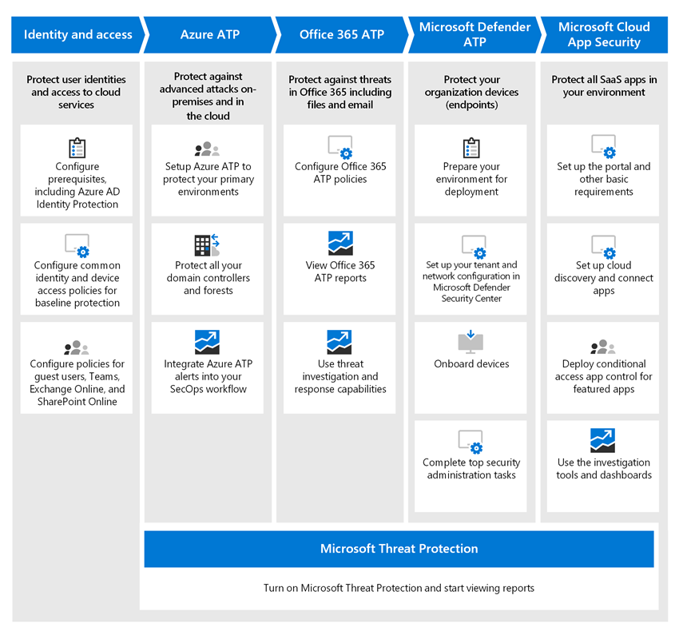
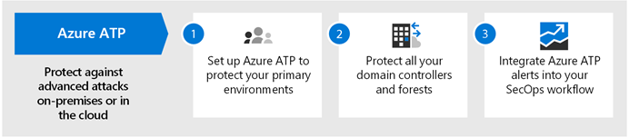
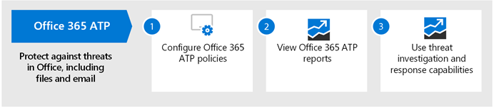

# Mogelijkheden voor bedreigingsbescherming implementeren in Microsoft 365

[Malware](https://docs.microsoft.com/windows/security/threat-protection/intelligence/understanding-malware)en geavanceerde cyberaanvallen, zoals [bestandsloze bedreigingen,](https://docs.microsoft.com/windows/security/threat-protection/intelligence/fileless-threats)komen vaak voor. Bedrijven moeten zichzelf en hun klanten beschermen. Dergelijke aanvallen kunnen grote problemen veroorzaken voor uw organisatie, variërend van een verlies van vertrouwen tot financiële ellende, bedrijfsbedreigende downtime en meer. Beschermen tegen bedreigingen is belangrijk, maar het kan een uitdaging zijn om te bepalen waar de tijd, moeite en middelen van uw organisatie moeten worden ingezet. 

Microsoft-beveiligingsoplossingen zijn ingebouwd in onze producten en services. Automatiserings- en machine learning-mogelijkheden verminderen de belasting van uw beveiligingsteams om ervoor te zorgen dat de juiste items worden aangepakt. En de kracht van Microsoft-beveiligingsoplossingen is gebaseerd op triljoenen signalen die we elke dag verwerken in onze [Intelligent Security Graph.](https://cloud-platform-assets.azurewebsites.net/intelligent-security-graph) Microsoft 365-beveiligingsoplossingen omvatten [Microsoft Threat Protection](https://docs.microsoft.com/microsoft-365/security/mtp/microsoft-threat-protection), een oplossing die signalen samenbrengt via uw e-mail, gegevens, apparaten en identiteiten om een beeld te schetsen van geavanceerde bedreigingen tegen uw organisatie.

Bekijk deze video voor een overzicht van het implementatieproces.

> [!VIDEO https://www.microsoft.com/videoplayer/embed/RE4vsI7]

Gebruik dit artikel als een handleiding voor het implementeren van uw oplossing voor bedreigingsbescherming.

## Bescherming tegen bedreigingen in Microsoft 365 E5

[Microsoft 365 E5](https://www.microsoft.com/microsoft-365/enterprise-e5-business-software?activetab=pivot%3aoverviewtab) stelt u in staat om uw organisatie te beschermen met adaptieve, ingebouwde intelligentie. Met de functies voor bedreigingsbescherming in Microsoft 365 E5 u geavanceerde bedreigingen, gecompromitteerde identiteiten en schadelijke acties in uw on-premises en cloudomgevingen detecteren en onderzoeken.

In Microsoft 365 E5 zijn standaard mogelijkheden voor bedreigingsbescherming geïntegreerd. Signalen van elke mogelijkheid voegen kracht toe aan het algemene vermogen om bedreigingen te detecteren en erop te reageren. De gecombineerde set mogelijkheden biedt de beste bescherming voor organisaties, met name multinationale organisaties, in vergelijking met het uitvoeren van niet-Microsoft-producten. De volgende afbeelding toont de services en mogelijkheden voor bedreigingsbescherming in Microsoft 365 E5 die in dit artikel worden beschreven.

Zodra u een van de geavanceerde mogelijkheden voor bedreigingsbescherming implementeert, u Microsoft Threat Protection inschakelen, waardoor de signalen en gegevens op één plaats worden samengebracht. 

In de volgende afbeelding wordt een aanbevolen pad weergegeven voor het implementeren van deze afzonderlijke mogelijkheden. 

|Oplossing/mogelijkheden  |Beschrijving  |
|---------|---------|
|Meervoudige verificatie en voorwaardelijke toegang     |Bescherm tegen gecompromitteerde identiteiten en apparaten. Begin met deze bescherming, want het is fundamenteel. De configuratie die in deze richtlijnen wordt aanbevolen, bevat Azure AD-identiteitsbeveiliging als voorwaarde.     |
|Azure Advanced Threat Protection     |  Een cloudgebaseerde beveiligingsoplossing die uw on-premises Active Directory-signalen gebruikt om geavanceerde bedreigingen, gecompromitteerde identiteiten en schadelijke insideracties gericht op uw organisatie te identificeren, detecteren en onderzoeken. Focus op dit volgende omdat het uw on-prem en uw cloudinfrastructuur beschermt, geen afhankelijkheden of vereisten heeft en onmiddellijk voordeel kan bieden.       | 
|Office 365 Advanced Threat Protection     | Beschermt uw organisatie tegen schadelijke bedreigingen van e-mailberichten, koppelingen (URL's) en samenwerkingstools. Beveiligingen voor malware, phishing, spoofing en andere soorten aanvallen. Dit wordt vervolgens aanbevolen omdat wijzigingscontrole, migratie-instellingen van het zittende systeem en andere overwegingen langer kunnen duren om te implementeren.   Opmerking: zorg ervoor dat u ook de mogelijkheden voor bedreigingsbescherming configureert die zijn opgenomen in alle Office 365-abonnementen (Exchange Online Protection).       |
|Microsoft Defender Advanced Threat Protection    | Een endpoint-beveiligingsplatform dat geavanceerde bedreigingen helpt voorkomen, detecteren, onderzoeken en erop reageert. Dit duurt langer om te implementeren, maar kan parallel met de andere mogelijkheden worden gedaan als andere beheerders verantwoordelijk zijn.   |
|Microsoft Cloud App Security     |   Een cloudtoegangsbeveiligingsbroker voor detectie, onderzoek en governance. U dit vroeg inschakelen om te beginnen met het verzamelen van gegevens en inzichten. Het implementeren van informatie en andere gerichte bescherming in uw SaaS-apps omvat planning en kan meer tijd in beslag nemen.       | 

> [!TIP]
> Organisaties met meerdere beveiligingsteams kunnen deze mogelijkheden parallel implementeren.

## Uw oplossing voor bedreigingsbescherming implementeren

Om ervoor te zorgen dat uw organisatie de best mogelijke bescherming heeft, stelt u uw beveiligingsoplossing in en implementeert u deze met de volgende stappen:

1. [Beleid voor meervoudige verificatie en voorwaardelijke toegang instellen](#step-1-set-up-multi-factor-authentication-and-conditional-access-policies)
2. [Azure Advanced Threat Protection configureren](#step-2-configure-azure-advanced-threat-protection)
3. [Microsoft Threat Protection inschakelen](#step-3-turn-on-microsoft-threat-protection)
4. [Geavanceerde bedreigingsbeveiliging van Office 365 configureren](#step-4-configure-office-365-advanced-threat-protection)
5. [Geavanceerde bedreigingsbeveiliging van Microsoft Defender configureren](#step-5-configure-microsoft-defender-advanced-threat-protection)
6. [Beveiliging van Microsoft Cloud-apps configureren](#step-6-configure-microsoft-cloud-app-security)
7. [Status controleren en acties ondernemen](#step-7-monitor-status-and-take-actions)
8. [Treingebruikers](#step-8-train-users)

Uw functies voor bedreigingsbeveiliging kunnen parallel worden geconfigureerd, dus als u meerdere beveiligingsteams hebt die verantwoordelijk zijn voor verschillende services, kunnen ze tegelijkertijd de beveiligingsfuncties van uw organisatie configureren. Het volgende diagram illustreert het proces op hoog niveau voor het implementeren van mogelijkheden voor bedreigingsbescherming. 

 

## Stap 1: Beleid voor meervoudige verificatie en voorwaardelijke toegang instellen

[Multi-factor authenticatie](https://docs.microsoft.com/azure/active-directory/authentication/concept-mfa-howitworks) (MFA) vereist dat gebruikers hun identiteit verifiëren met een telefoongesprek of authenticator-app. [In het beleid voor voorwaardelijke toegang](https://docs.microsoft.com/azure/active-directory/conditional-access/overview) worden bepaalde vereisten gedefinieerd waaraan moet worden voldaan om gebruikers toegang te geven tot apps en gegevens in Microsoft 365. MFA- en voorwaardelijke toegangsbeleid werken samen om uw organisatie te beschermen. Als iemand bijvoorbeeld probeert in te loggen vanaf een mobiel apparaat met een account dat niet is ingeschakeld voor MFA, en een beleid voor voorwaardelijke toegang vereist dat MFA van kracht is, wordt die gebruiker verhinderd zich aan te melden.  

Microsoft heeft een specifieke set voorwaardelijke toegang en bijbehorend beleid voor het beschermen van toegang tot al uw SaaS-toepassingen, met name Microsoft 365, getest en aanbevolen. Beleid wordt aanbevolen voor basislijn, gevoelige en sterk gereguleerde bescherming. Begin met de uitvoering van het beleid voor basisbescherming. 

[Zie een grotere versie van deze afbeelding](https://github.com/MicrosoftDocs/microsoft-365-docs/raw/public/microsoft-365/media/Identity_device_access_policies_byplan.png)

### Basislijnbeveiliging voor Microsoft 365 implementeren

 

1. [Vereisten configureren, waaronder Azure Identity Protection](../enterprise/identity-access-prerequisites.md).
2. [Veelvoorkomende identiteits- en apparaattoegangsbeleidsregels configureren](../enterprise/identity-access-policies.md) voor basislijnbeveiliging.
3. Beleid configureren voor [gastgebruikers,](../enterprise/identity-access-policies-guest-access.md) [Microsoft Teams,](../enterprise/teams-access-policies.md) [Exchange Online](../enterprise/secure-email-recommended-policies.md)en [SharePoint Online en OneDrive](../enterprise/sharepoint-file-access-policies.md).

### Meer informatie over het beschermen van identiteiten

- [Configuratie van identiteiten en apparaattoegang](../enterprise/microsoft-365-policies-configurations.md)
- [Beveiligingsrichtlijnen voor Azure MFA](https://docs.microsoft.com/azure/active-directory/authentication/multi-factor-authentication-security-best-practices)

## Stap 2: Azure Advanced Threat Protection configureren

[Azure Advanced Threat Protection](https://docs.microsoft.com/azure-advanced-threat-protection/what-is-atp) (Azure ATP) is een cloudgebaseerde beveiligingsoplossing die werkt met uw on-premises [Azure Active Directory-signalen](https://docs.microsoft.com/azure/active-directory/fundamentals/active-directory-whatis) om geavanceerde bedreigingen, gecompromitteerde identiteiten en schadelijke insideracties gericht op uw organisatie te identificeren, detecteren en onderzoeken.

Azure ATP stelt analisten en beveiligingsprofessionals (Security Operations) in staat om geavanceerde aanvallen in hybride omgevingen te detecteren:
- Monitor gebruikers, entiteitsgedrag en activiteiten met op leergebaseerde analyses.
- Gebruikersidentiteiten en -referenties beveiligen die zijn opgeslagen in Active Directory.
- Verdachte gebruikersactiviteiten en geavanceerde aanvallen in de hele kill chain identificeren en onderzoeken.
- Heldere incidentinformatie verstrekken op een eenvoudige tijdlijn voor snelle sortering.

### Azure ATP instellen

 

1. [Azure ATP instellen](https://docs.microsoft.com/azure-advanced-threat-protection/install-atp-step1) om uw primaire omgevingen te beschermen.
2. Bescherm al uw [domeincontrollers](https://docs.microsoft.com/azure-advanced-threat-protection/atp-sensor-monitoring) en [forests.](https://docs.microsoft.com/azure-advanced-threat-protection/atp-multi-forest)
3. Integreer [Azure ATP-waarschuwingen](https://docs.microsoft.com/azure-advanced-threat-protection/suspicious-activity-guide?tabs=external) in de werkstroom (SecOps) van uw beveiligingsbewerkingen.

### Meer informatie over Azure ATP

- [Wat is Azure ATP?](https://docs.microsoft.com/azure-advanced-threat-protection/what-is-atp)
- [Video: Inleiding tot Azure ATP](https://www.youtube.com/watch?reload=9&v=EGY2m8yU_KE)
- [Azure ATP-implementatie](https://docs.microsoft.com/azure-advanced-threat-protection/what-is-atp#whats-next)

## Stap 3: Microsoft-bedreigingsbeveiliging inschakelen

[Microsoft Threat Protection](https://docs.microsoft.com/microsoft-365/security/mtp/microsoft-threat-protection) combineert signalen en orkestreert mogelijkheden in één oplossing. Met de geïntegreerde Microsoft Threat Protection-oplossing kunnen beveiligingsprofessionals de bedreigingssignalen die elk van deze producten ontvangen samenvoegen en de volledige omvang en impact van de bedreiging bepalen; hoe het in de omgeving is gekomen, wat het wordt beïnvloed en hoe het momenteel van invloed is op de organisatie. Microsoft Threat Protection onderneemt automatische actie om de aanval te voorkomen of te stoppen en aangetaste postvakken, eindpunten en gebruikersidentiteiten zelf te genezen.

Microsoft Threat Protection maakt waarschuwingen, incidenten, geautomatiseerd onderzoek en respons en geavanceerde jacht op workloads (Azure ATP, Office 365 ATP, Microsoft Defender ATP en Microsoft Cloud App Security) tot één ruit van glaservaring. Nadat u een of meer van uw geavanceerde services voor bedreigingsbescherming hebt geconfigureerd, schakelt u Microsoft Threat Protection in. Er worden voortdurend nieuwe functies toegevoegd aan Microsoft Threat Protection; overweeg u zich aan te melden voor preview-functies.

### Microsoft-bedreigingsbeveiliging instellen

 

1. [Bekijk de voorwaarden](https://docs.microsoft.com/microsoft-365/security/mtp/prerequisites).
2. [Microsoft Threat Protection inschakelen](https://docs.microsoft.com/microsoft-365/security/mtp/mtp-enable).
3. [Opt-in voor preview-functies](https://docs.microsoft.com/microsoft-365/security/mtp/preview).

### Meer informatie over Microsoft Threat Protection

- [Wat is Microsoft Threat Protection?](https://docs.microsoft.com/microsoft-365/security/mtp/microsoft-threat-protection)
- [Wat is er nieuw in Microsoft Threat Protection](https://docs.microsoft.com/microsoft-365/security/mtp/whats-new)

## Stap 4: Geavanceerde bedreigingsbeveiliging van Office 365 configureren

[Office 365 Advanced Threat Protection](https://docs.microsoft.com/microsoft-365/security/office-365-security/office-365-atp) (Office 365 ATP) beschermt uw organisatie tegen schadelijke bedreigingen in e-mailberichten (bijlagen en URL's), Office-documenten en samenwerkingstools. In de volgende tabel worden office 365 ATP-functies en -mogelijkheden weergegeven die zijn opgenomen in Microsoft 365 E5:

|||
|---|---|
|Configuratie-, beveiligings- en detectiemogelijkheden|Mogelijkheden voor automatisering, onderzoek, sanering en onderwijs|
|[Veilige bijlagen](https://docs.microsoft.com/microsoft-365/security/office-365-security/atp-safe-attachments) [Veilige koppelingen](https://docs.microsoft.com/microsoft-365/security/office-365-security/atp-safe-links) [Veilige documenten](https://docs.microsoft.com/microsoft-365/security/office-365-security/safe-docs) [ATP voor SharePoint, OneDrive en Microsoft Teams](https://docs.microsoft.com/microsoft-365/security/office-365-security/atp-for-spo-odb-and-teams) [BESCHERMING tegen ATP-anti-phishing](https://docs.microsoft.com/microsoft-365/security/office-365-security/set-up-anti-phishing-policies#exclusive-settings-in-atp-anti-phishing-policies)|[Bedreigingsoverzichten](https://docs.microsoft.com/microsoft-365/security/office-365-security/threat-trackers) [Bedreigingsverkenner](https://docs.microsoft.com/microsoft-365/security/office-365-security/threat-explorer) [Geautomatiseerd onderzoek en reactie](https://docs.microsoft.com/microsoft-365/security/office-365-security/office-365-air) [Aanvalssimulator](https://docs.microsoft.com/microsoft-365/security/office-365-security/attack-simulator)|
|

Met Office 365 ATP kunnen mensen in uw hele organisatie veiliger communiceren en samenwerken, met bescherming van bedreigingen voor hun e-mailinhoud en Office-documenten.

### Office 365 ATP instellen

 

1. [Uw Office 365 ATP-beleid instellen en configureren.](https://docs.microsoft.com/microsoft-365/security/office-365-security/protect-against-threats)
2. [Uw Office 365 ATP-rapporten weergeven en gebruiken.](https://docs.microsoft.com/microsoft-365/security/office-365-security/view-reports-for-atp)
3. [Gebruik mogelijkheden voor bedreigingsonderzoek en -respons](https://docs.microsoft.com/microsoft-365/security/office-365-security/office-365-ti).

### Meer informatie over Office 365 ATP

- [Overzicht van Office 365 ATP](https://docs.microsoft.com/microsoft-365/security/office-365-security/office-365-atp)
- [Nieuw in Office 365 ATP](https://docs.microsoft.com/microsoft-365/security/office-365-security/whats-new-in-office-365-atp)

## Stap 5: Geavanceerde bedreigingsbeveiliging van Microsoft Defender configureren

[Microsoft Defender Advanced Threat Protection](https://docs.microsoft.com/windows/security/threat-protection) (Microsoft Defender ATP) beschermt uw organisaties apparaten (ook wel endpoints genoemd) tegen cyberbedreigingen, geavanceerde aanvallen en datalekken. Beveiligingsteams kunnen efficiënter omgaan met de beveiliging van hun eindpunten. Robuuste tools helpen organisaties om ongepatchte systemen bij te houden met behulp van kwetsbaarheidsdetectie met [threat and vulnerability management.](https://docs.microsoft.com/windows/security/threat-protection/microsoft-defender-atp/next-gen-threat-and-vuln-mgt) Geautomatiseerde detectie- en herstelmogelijkheden, zoals vermindering van [het aanvalsoppervlak,](https://docs.microsoft.com/windows/security/threat-protection/microsoft-defender-atp/overview-attack-surface-reduction) [bescherming van de volgende generatie,](https://docs.microsoft.com/windows/security/threat-protection/windows-defender-antivirus/windows-defender-antivirus-in-windows-10) [endpointdetectie en -respons](https://docs.microsoft.com/windows/security/threat-protection/microsoft-defender-atp/overview-endpoint-detection-response)en [geautomatiseerde onderzoek en herstel,](https://docs.microsoft.com/windows/security/threat-protection/microsoft-defender-atp/automated-investigations) helpen uw apparaten te beschermen tegen malware. Naast deze mogelijkheden kunnen klanten proactieve meldingen ontvangen en op aanvraag contact opnemen met Microsoft Threat Experts, als onderdeel van de opt-in managed hunting-service. 

### Microsoft Defender ATP instellen

 

1. [Bereid uw Microsoft Defender ATP-implementatie voor.](https://docs.microsoft.com/windows/security/threat-protection/microsoft-defender-atp/deployment-phases)
2. [Uw Microsoft Defender ATP-implementatie instellen](https://docs.microsoft.com/windows/security/threat-protection/micros.oft-defender-atp/production-deployment)
3. [Aan boord van de Microsoft Defender ATP-service.](https://docs.microsoft.com/windows/security/threat-protection/microsoft-defender-atp/onboarding)
4. [Voltooi uw belangrijkste beveiligingsbeheertaken.](https://docs.microsoft.com/windows/security/threat-protection/microsoft-defender-atp/tvm-security-recommendation)

### Meer informatie over Microsoft Defender ATP

- [Meer informatie over Microsoft Defender ATP](https://docs.microsoft.com/windows/security/threat-protection).
- [Probeer het Microsoft Defender ATP-evaluatielab](https://docs.microsoft.com/windows/security/threat-protection/microsoft-defender-atp/evaluation-lab).

## Stap 6: Beveiliging van Microsoft Cloud-apps configureren

[Microsoft Cloud App Security](https://docs.microsoft.com/cloud-app-security) is een Cloud Access Security Broker die logboekverzameling, API-connectors en reverse proxy ondersteunt. Microsoft Cloud App Security biedt uitgebreide zichtbaarheid, controle over gegevensreizen en geavanceerde analyses om cyberbedreigingen in al uw cloudservices te identificeren en te bestrijden. Met Microsoft Cloud App Security kunnen uw beveiligingsactiviteiten de gevoelige informatie van uw organisatie beschermen, beschermen tegen cyberbedreigingen en afwijkingen, apps ontdekken en bewaken die toegang hebben tot de gegevens van uw organisatie en ervoor zorgen dat de cloud-apps van uw organisatie voldoen aan nalevingsvereisten.

### Beveiliging van Microsoft Cloud-apps instellen

 

1. [Stel het portaal en andere basisvereisten in.](https://docs.microsoft.com/cloud-app-security/general-setup)
2. [Clouddetectie instellen](https://docs.microsoft.com/cloud-app-security/set-up-cloud-discovery) en [apps verbinden.](https://docs.microsoft.com/cloud-app-security/enable-instant-visibility-protection-and-governance-actions-for-your-apps)
3. [Implementeren van voorwaardelijke toegang app besturingselement voor aanbevolen apps](https://docs.microsoft.com/cloud-app-security/proxy-deployment-aad).
4. [Gebruik de onderzoekstools en dashboards.](https://docs.microsoft.com/cloud-app-security/investigate)

### Meer informatie over Microsoft Cloud App Security

- [Bekijk nieuwe functies en mogelijkheden](https://docs.microsoft.com/cloud-app-security/release-notes).
- [Meer informatie over Microsoft Cloud App Security](https://docs.microsoft.com/cloud-app-security/what-is-cloud-app-security).

## Stap 7: Status controleren en acties ondernemen

Nadat u uw services en mogelijkheden voor bedreigingsbescherming hebt ingesteld en geïmplementeerd, is uw volgende stap het controleren van bedreigingsdetecties en het nemen van passende acties. Het beste uitgangspunt is het Microsoft 365-beveiligingscentrum ( ),[https://security.microsoft.com](https://security.microsoft.com)waar u de beveiliging van uw Microsoft-identiteiten, gegevens, apparaten, apps en infrastructuur bewaken en beheren. 

:::image type="content" source="../media/solutions-architecture-center/m365-security-center.png" alt-text="Microsoft 365-beveiligingscentrum":::

Het Microsoft 365-beveiligingscentrum is specifiek bedoeld voor beveiligingsbeheerders en beveiligingsteams. In het Microsoft 365-beveiligingscentrum u het als:
- Bekijk de algehele beveiligingsstatus van uw organisatie met [Secure Score.](https://docs.microsoft.com/microsoft-365/security/mtp/microsoft-secure-score)
- Rapporten over de status van uw identiteit, gegevens, apparaten, apps en infrastructuur bewaken en [weergeven.](https://docs.microsoft.com/microsoft-365/security/mtp/monitoring-and-reporting)
- Verbind de puntjes op waarschuwingen via [incidenten.](https://docs.microsoft.com/microsoft-365/security/mtp/incident-queue)
- Gebruik [geautomatiseerd onderzoek en herstel](https://docs.microsoft.com/microsoft-365/security/mtp/mtp-autoir) om bedreigingen aan te pakken.
- [Ga proactief op zoek naar bedreigingen,](https://docs.microsoft.com/microsoft-365/security/mtp/advanced-hunting-overview)zoals inbraakpogingen of inbreukactiviteiten die van invloed zijn op uw e-mail, gegevens, apparaten en identiteiten.
- [Begrijp de nieuwste aanvalscampagnes](https://docs.microsoft.com/microsoft-365/security/mtp/latest-attack-campaigns) en -technieken met bedreigingsanalyses.
- ... en meer!

### Meer informatie over het Microsoft 365-beveiligingscentrum

- [Ga aan de slag met het Microsoft 365-beveiligingscentrum.](https://docs.microsoft.com/microsoft-365/security/mtp/overview-security-center)
- [Rapporten bewaken en bekijken](https://docs.microsoft.com/microsoft-365/security/mtp/monitoring-and-reporting).
- [Bekijk de beveiligingsportalen in Microsoft 365](https://docs.microsoft.com/microsoft-365/security/mtp/portals).

## Stap 8: Gebruikers trainen

Het trainen van gebruikers kan uw gebruikers en beveiligingsteam veel tijd en frustratie besparen. Savvy gebruikers hebben minder kans om bijlagen te openen of klik op links in twijfelachtige e-mailberichten, en ze hebben meer kans om verdachte websites te vermijden. 

Het Harvard Kennedy School [Cybersecurity Campaign Handbook](https://go.microsoft.com/fwlink/?linkid=2015598&amp;clcid=0x409) biedt uitstekende richtlijnen voor het opzetten van een sterke cultuur van beveiligingsbewustzijn binnen uw organisatie, inclusief het trainen van gebruikers om phishing-aanvallen te identificeren. 

Microsoft 365 biedt de volgende bronnen om gebruikers in uw organisatie te informeren:

|Concept  |Resources  |
|---------|---------|
|Microsoft 365     |[Aanpasbare leertrajecten](https://docs.microsoft.com/office365/customlearning/) 
Met deze bronnen u training samenstellen voor eindgebruikers in uw organisatie        |
|Microsoft 365-beveiliging |[Leermodule: beveilig uw organisatie met ingebouwde, intelligente beveiliging van Microsoft 365](https://docs.microsoft.com/learn/modules/security-with-microsoft-365) 
Met deze module u beschrijven hoe microsoft 365-beveiligingsfuncties samenwerken en de voordelen van deze beveiligingsfuncties verwoorden. |
|Meervoudige verificatie     | [Verificatie in twee stappen: wat is de extra verificatiepagina?](https://docs.microsoft.com/azure/active-directory/user-help/multi-factor-authentication-end-user-first-time) 
Dit artikel helpt eindgebruikers te begrijpen wat multi-factor authenticatie is en waarom het wordt gebruikt in uw organisatie.    |

Naast deze richtlijnen raadt Microsoft uw gebruikers aan de in dit artikel beschreven acties te ondernemen: [Bescherm uw account en apparaten tegen hackers en malware.](https://support.office.com/article/066d6216-a56b-4f90-9af3-b3a1e9a327d6.aspx) Deze acties omvatten:
- Sterke wachtwoorden gebruiken
- Apparaten beveiligen 
- Beveiligingsfuncties inschakelen op Windows 10- en Mac-pc's (voor niet-beheerde apparaten)
    
Microsoft raadt gebruikers ook aan hun persoonlijke e-mailaccounts te beschermen door de in de volgende artikelen aanbevolen acties uit te voeren:
- [Uw Outlook.com e-mailaccount beschermen](https://support.microsoft.com/en-us/office/help-protect-your-outlook-com-email-account-a4f20fc5-4307-4ece-8231-6d4d4bd8a9ba)
- [Bescherm je Gmail-account met verificatie in twee stappen](https://go.microsoft.com/fwlink/?linkid=2015688&amp;clcid=0x409)
