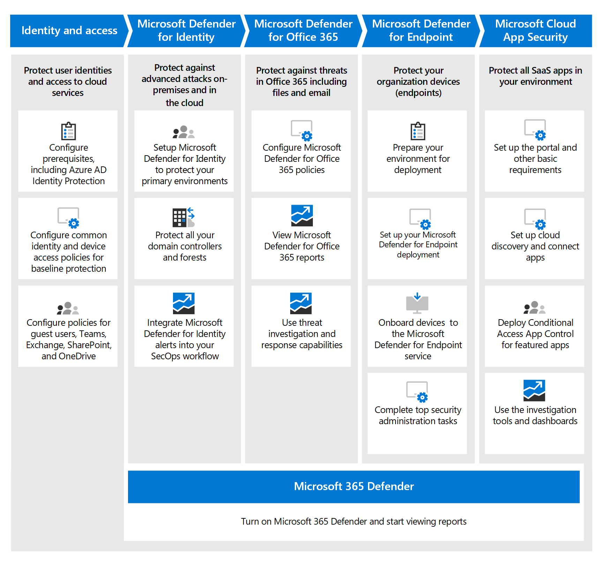

# Mogelijkheden voor bedreigingsbeveiliging implementeren in Microsoft 365 E5Deploy threat protection capabilities across Microsoft 365 E5

Deze oplossing beschrijft krachtige mogelijkheden voor bedreigingsbeveiliging in Microsoft 365 E5 en legt uit waarom bedreigingsbeveiliging belangrijk is.This solution describes powerful threat protection capabilities across Microsoft 365 E5 and explains why threat protection is important. Lees dit artikel voor een overzicht van bedreigingsbeveiliging in Microsoft 365 E5 en hoe u de installatie en configuratie voor uw organisatie kunt benaderen.Read this article to get an overview of threat protection in Microsoft 365 E5 and how to approach setup and configuration for your organization.

## Waarom bedreigingsbeveiliging belangrijk isWhy threat protection is important 

[Malware](/windows/security/threat-protection/intelligence/understanding-malware)en geavanceerde cyberaanvallen, zoals [bestandsloze](/windows/security/threat-protection/intelligence/fileless-threats)bedreigingen, komen vaak voor.[Malware](/windows/security/threat-protection/intelligence/understanding-malware), and sophisticated cyberattacks, such as [fileless threats](/windows/security/threat-protection/intelligence/fileless-threats), are a common occurrence. Bedrijven moeten zichzelf en hun klanten beschermen met effectieve IT-beveiligingsmogelijkheden.Businesses need to protect themselves and their customers with effective IT security capabilities. Cyberaanvallen kunnen grote problemen veroorzaken voor uw organisatie, variërend van een verlies van vertrouwen tot financiële problemen, bedrijfsbedreigende downtime en meer.Cyberattacks can cause major problems for your organization, ranging from a loss of trust to financial woes, business-threatening downtime, and more. Bescherming tegen bedreigingen is belangrijk, maar het kan lastig zijn om te bepalen waar u de tijd, moeite en resources van uw organisatie kunt concentreren.Protecting against threats is important, but it can be challenging to determine where to focus your organization's time, effort, and resources. Microsoft 365 E5 kan u helpen.Microsoft 365 E5 can help. 

Microsoft-beveiligingsoplossingen zijn ingebouwd in onze producten en services.Microsoft security solutions are built into our products and services. Automatiserings- en machine learning-mogelijkheden verminderen de belasting van uw beveiligingsteams om ervoor te zorgen dat de juiste items worden aangepakt.Automation and machine learning capabilities reduce the load on your security teams to make sure the right items are addressed. En de kracht van Microsoft-beveiligingsoplossingen is gebaseerd op triljoenen signalen die we elke dag verwerken in [onze Intelligent Security Graph.](/graph/security-concept-overview)And the strength of Microsoft security solutions is built on trillions of signals we process every day in our [Intelligent Security Graph](/graph/security-concept-overview). Microsoft 365-beveiligingsoplossingen zijn [Microsoft 365 Defender,](../security/defender/microsoft-365-defender.md)een oplossing waarmee signalen in uw e-mail, gegevens, apparaten en identiteiten worden verzameld om een beeld te schetsen van geavanceerde bedreigingen tegen uw organisatie.Microsoft 365 security solutions include [Microsoft 365 Defender](../security/defender/microsoft-365-defender.md), a solution that brings together signals across your email, data, devices, and identities to paint a picture of advanced threats against your organization.

Bekijk deze video voor een overzicht van het implementatieproces.Watch this video for an overview of the deployment process.
  
> [!VIDEO https://www.microsoft.com/videoplayer/embed/RE4vsI7]

## Bedreigingsbeveiliging in Microsoft 365 E5Threat protection in Microsoft 365 E5

[Met Microsoft 365 E5](https://www.microsoft.com/microsoft-365/enterprise-e5-business-software?activetab=pivot%3aoverviewtab) kunt u uw organisatie beschermen met adaptieve, ingebouwde intelligentie.[Microsoft 365 E5](https://www.microsoft.com/microsoft-365/enterprise-e5-business-software?activetab=pivot%3aoverviewtab) enables you to protect your organization with adaptive, built-in intelligence. Met de functies voor bedreigingsbeveiliging in Microsoft 365 E5 kunt u geavanceerde bedreigingen, gecompromitteerde identiteiten en schadelijke acties detecteren en onderzoeken in uw on-premises en cloudomgeving.With the threat protection features in Microsoft 365 E5, you can detect and investigate advanced threats, compromised identities, and malicious actions across your on-premises and cloud environment.

In Microsoft 365 E5 zijn de mogelijkheden voor bedreigingsbeveiliging standaard geïntegreerd.In Microsoft 365 E5, threat protection capabilities are integrated by default. Signalen van elke mogelijkheid vergroten de algehele mogelijkheid om bedreigingen op te sporen en te beantwoorden.Signals from each capability add strength to the overall ability to detect and respond to threats. De gecombineerde set mogelijkheden biedt de beste bescherming voor organisaties, met name multinationale organisaties, in vergelijking met het uitvoeren van niet-Microsoft-producten.The combined set of capabilities offers the best protection for organizations, especially multi-national organizations, compared to running non-Microsoft products. In de volgende afbeelding worden de services en mogelijkheden voor bedreigingsbeveiliging in Microsoft 365 E5 weergegeven die in dit artikel worden beschreven.The following image depicts the threat protection services and capabilities in Microsoft 365 E5 that are described in this article.

Microsoft 365 Defender brengt de signalen en gegevens samen in een [geïntegreerd Microsoft 365-beveiligingscentrum.](/microsoft-365/security/defender/overview-security-center)Microsoft 365 Defender brings the signals and data together into a [unified Microsoft 365 security center](/microsoft-365/security/defender/overview-security-center). 

> [!div class="mx-imgBorder"]
> 

In de volgende afbeelding wordt een aanbevolen pad weergegeven voor het implementeren van deze afzonderlijke mogelijkheden.The following illustration depicts a recommended path for deploying these individual capabilities. 

> [!div class="mx-imgBorder"]
> 

|Oplossing/mogelijkhedenSolution/capabilities  |BeschrijvingDescription  |
|---------|---------|
|Meervoudige verificatie en Voorwaardelijke toegangMulti-factor authentication and Conditional Access     |Bescherm u tegen gecompromitteerde identiteiten en apparaten.Protect against compromised identities and devices. Begin met deze beveiliging omdat deze basis is.Begin with this protection because it's foundational. De configuratie die in deze richtlijn wordt aanbevolen, bevat Azure AD Identity Protection als een vereiste.The configuration recommended in this guidance includes Azure AD Identity Protection as a prerequisite.     |
|Microsoft Defender for IdentityMicrosoft Defender for Identity     |  Een cloudgebaseerde beveiligingsoplossing die uw on-premises Ad DS-signalen (Active Directory Domain Services) gebruikt om geavanceerde bedreigingen, gecompromitteerde identiteiten en kwaadaardige insideracties die zijn gericht op uw organisatie te identificeren, te detecteren en te onderzoeken.A cloud-based security solution that uses your on-premises Active Directory Domain Services (AD DS) signals to identify, detect, and investigate advanced threats, compromised identities, and malicious insider actions directed at your organization. Focus vervolgens op Microsoft Defender voor identiteit omdat het uw on-premises en cloudinfrastructuur beschermt, geen afhankelijkheden of vereisten heeft en directe beveiligingsvoordelen kan bieden.Focus on Microsoft Defender for Identity next because it protects your on-premises and cloud infrastructure, has no dependencies or prerequisites, and can provide immediate security benefits. | 
|Microsoft Defender voor Office 365Microsoft Defender for Office 365     | Beschermt uw organisatie tegen schadelijke bedreigingen die worden veroorzaakt door e-mailberichten, koppelingen (URL's) en samenwerkingshulpmiddelen.Safeguards your organization against malicious threats posed by email messages, links (URLs), and collaboration tools. Beveiligingen voor malware, phishing, spoofing en andere soorten aanvallen.Protections for malware, phishing, spoofing, and other attack types. Het configureren van Microsoft Defender voor Office 365 wordt vervolgens aanbevolen, omdat het implementeren van beheer, het migreren van instellingen van het bestaande systeem en andere aandachtspunten langer kan duren.Configuring Microsoft Defender for Office 365 is recommended next because change control, migrating settings from incumbent system, and other considerations can take longer to deploy. 
**OPMERKING:** Zorg ervoor dat u de mogelijkheden voor bedreigingsbeveiliging configureert die zijn opgenomen in alle Office 365-abonnementen (Exchange Online Protection).**NOTE**: Make sure to configure the threat protection capabilities that are included in all Office 365 subscriptions (Exchange Online Protection).       |
|Microsoft Defender for EndpointMicrosoft Defender for Endpoint    | Een eindpuntbeveiligingsplatform waarmee geavanceerde bedreigingen worden voorkomen, gedetecteerd, onderzocht en beantwoord.An endpoint protection platform that helps prevent, detect, investigate, and respond to advanced threats.  Het kan enige tijd duren om Defender voor Eindpunt te implementeren, maar de configuratie kan parallel met andere mogelijkheden worden uitgevoerd.Defender for Endpoint can take some time to deploy, but configuration can be done in parallel with other capabilities.   |
|Microsoft Cloud App SecurityMicrosoft Cloud App Security     |   Een beveiligingsagent voor cloudtoegang voor detectie, onderzoek en beheer.A cloud access security broker for discovery, investigation, and governance. U kunt Microsoft Cloud App Security vroeg inschakelen om te beginnen met het verzamelen van gegevens en inzichten.You can enable Microsoft Cloud App Security early to begin collecting data and insights. Bij het implementeren van informatie en andere gerichte beveiliging in uw SaaS-apps is planning nodig en kan het meer tijd kosten.Implementing information and other targeted protection across your SaaS apps involves planning and can take more time.       | 

> [!TIP]
> Organisaties met meerdere beveiligingsteams kunnen deze mogelijkheden parallel implementeren.Organizations who have multiple security teams can implement these capabilities in parallel. 

## Plan om uw oplossing voor bedreigingsbeveiliging te implementerenPlan to deploy your threat protection solution

In het volgende diagram ziet u het proces op hoog niveau voor het implementeren van mogelijkheden voor bedreigingsbeveiliging.The following diagram illustrates the high-level process for deploying threat protection capabilities. 

Als u ervoor wilt zorgen dat uw organisatie de best mogelijke beveiliging biedt, stelt u uw beveiligingsoplossing in en implementeert u deze met een proces dat de volgende stappen bevat:To make sure your organization has the best protection possible, set up and deploy your security solution with a process that includes the following steps:

1. [Meervoudige verificatie en beleidsregels voor voorwaardelijke toegang instellen.](deploy-threat-protection-configure.md#step-1-set-up-multi-factor-authentication-and-conditional-access-policies)[Set up multi-factor authentication and Conditional Access policies](deploy-threat-protection-configure.md#step-1-set-up-multi-factor-authentication-and-conditional-access-policies).
2. [Microsoft Defender configureren voor identiteit.](deploy-threat-protection-configure.md#step-2-configure-microsoft-defender-for-identity)[Configure Microsoft Defender for Identity](deploy-threat-protection-configure.md#step-2-configure-microsoft-defender-for-identity).
3. [Schakel Microsoft 365 Defender in.](deploy-threat-protection-configure.md#step-3-turn-on-microsoft-365-defender)[Turn on Microsoft 365 Defender](deploy-threat-protection-configure.md#step-3-turn-on-microsoft-365-defender).
4. [ConfigureEr Defender voor Office 365](deploy-threat-protection-configure.md#step-4-configure-microsoft-defender-for-office-365).[Configure Defender for Office 365](deploy-threat-protection-configure.md#step-4-configure-microsoft-defender-for-office-365).
5. [Microsoft Defender configureren voor eindpunt](deploy-threat-protection-configure.md#step-5-configure-microsoft-defender-for-endpoint).[Configure Microsoft Defender for Endpoint](deploy-threat-protection-configure.md#step-5-configure-microsoft-defender-for-endpoint).
6. [Microsoft Cloud App-beveiliging configureren.](deploy-threat-protection-configure.md#step-6-configure-microsoft-cloud-app-security)[Configure Microsoft Cloud App Security](deploy-threat-protection-configure.md#step-6-configure-microsoft-cloud-app-security).
7. [Status controleren en acties uitvoeren.](deploy-threat-protection-configure.md#step-7-monitor-status-and-take-actions)[Monitor status and take actions](deploy-threat-protection-configure.md#step-7-monitor-status-and-take-actions).
8. [Train gebruikers](deploy-threat-protection-configure.md#step-8-train-users).[Train users](deploy-threat-protection-configure.md#step-8-train-users).

Uw beveiligingsfuncties voor bedreigingen kunnen parallel worden geconfigureerd, dus als u meerdere netwerkbeveiligingsteams hebt die verantwoordelijk zijn voor verschillende services, kunnen ze de beveiligingsfuncties van uw organisatie tegelijkertijd configureren.Your threat protection features can be configured in parallel, so if you have multiple network security teams responsible for different services, they can configure your organization’s protection features at the same time.

## Volgende stapNext step

Ga verder [met Het configureren van mogelijkheden voor bedreigingsbeveiliging in Microsoft 365](deploy-threat-protection-configure.md).Continue to [Configure threat protection capabilities across Microsoft 365](deploy-threat-protection-configure.md).

