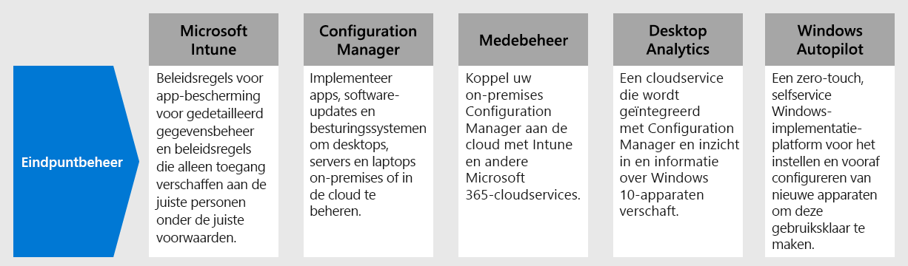

# Stap 3.Step 3. Eindpuntbeheer voor uw apparaten, pc's en andere eindpunten implementerenDeploy endpoint management for your devices, PCs, and other endpoints

Als u externe medewerkers hebt, moet u steeds meer persoonlijke apparaten ondersteunen.With remote workers, you need to support a growing number of personal devices. Eindpuntbeheer biedt op beleid gebaseerde beveiliging waarbij apparaten moeten voldoen aan specifieke criteria voordat ze toegang krijgen tot bronnen.Endpoint management is a policy-based approach to security that requires devices to comply with specific criteria before they are granted access to resources. Microsoft Endpoint Manager biedt een moderne werkplek en moderne beheermogelijkheden om uw gegevens in de cloud en on-premises veilig te houden.Microsoft Endpoint Manager delivers a modern workplace and modern management capabilities to keep your data secure in the cloud and on-premises. 

Endpoint Manager biedt services en hulpprogramma‘s voor het beheer van mobiele apparaten, desktopcomputers, virtuele machines, embedded apparaten en servers door enkele services te combineren die u mogelijk al kent en gebruikt:Endpoint Manager provides services and tools for managing mobile devices, desktop computers, virtual machines, embedded devices, and servers by combining the following services you may already know and be using.

## Microsoft IntuneMicrosoft Intune

Intune is ontworpen om u te helpen gegevens te beschermen wanneer de gegevens van uw organisatie toegankelijk zijn vanaf apparaten die niet door u worden beheerd.Intune is designed to help you safeguard data when you don’t manage the devices used to access organization data. Met het beleid voor app-bescherming van Intune in combinatie met voorwaardelijke toegang in Azure AD hebt u gedetailleerde controle over de gegevens op mobiele apparaten.Intune app protection policies combined with Azure AD Conditional Access provide granular control over data on mobile devices. Met Intune kunt u ook uitgebreid beleid definiëren waardoor alleen de juiste mensen onder de juiste omstandigheden toegang hebben tot uw bedrijfsgegevens. U kunt ervoor zorgen dat de gegevens beschermd blijven door te bepalen hoe deze worden gebruikt in Office, Outlook en andere mobiele apps.Intune also enables you to define comprehensive policies that allow only the right people under the right conditions to access your company data and ensure the data stays protected by controlling how they use it within Office, Outlook and other mobile apps.

Zie voor meer informatie dit [overzicht van Microsoft Intune](https://docs.microsoft.com/intune/fundamentals/what-is-intune).For more information, see this [overview of Microsoft Intune](https://docs.microsoft.com/intune/fundamentals/what-is-intune).

## Configuration ManagerConfiguration Manager

Configuration Manager is een on-premises beheeroplossing voor het beheer van desktops, servers en laptops op uw netwerk of op internet.Configuration Manager is an on-premises management solution to manage desktops, servers, and laptops that are on your network or internet-based. U kunt de oplossing in de cloud gebruiken voor integratie met Intune, Azure AD, Microsoft Defender ATP en andere cloudservices.You can cloud-enable it to integrate with Intune, Azure AD, Microsoft Defender ATP, and other cloud services. Gebruik Configuration Manager om apps, software-updates en besturingssystemen te implementeren.Use Configuration Manager to deploy apps, software updates, and operating systems. U kunt ook toezicht houden op naleving, clients in real time doorzoeken en hiermee communiceren, en nog veel meer.You can also monitor compliance, query and act on clients in real time, and much more.

Zie voor meer informatie dit [overzicht van Configuration Manager](https://docs.microsoft.com/mem/configmgr/core/understand/introduction).For more information, see this [overview of Configuration Manager](https://docs.microsoft.com/mem/configmgr/core/understand/introduction).

## Co-managementCo-management

Met co-management wordt uw bestaande on-premises Configuration Manager gekoppeld aan de cloud via Intune en andere Microsoft 365-cloudservices.Co-management combines your existing on-premises Configuration Manager investment with the cloud using Intune and other Microsoft 365 cloud services. U kiest of u Configuration Manager of Intune wilt gebruiken als beheerautoriteit voor de zeven verschillende werklastgroepen.You choose whether Configuration Manager or Intune is the management authority for the seven different workload groups.

Co-management is een onderdeel van Endpoint Manager dat gebruikmaakt van cloudfuncties, waaronder voorwaardelijke toegang.As part of Endpoint Manager, co-management uses cloud features, including Conditional Access. U kunt bepaalde taken on-premises blijven doen terwijl u andere taken in de cloud uitvoert met Intune.You keep some tasks on-premises, while running other tasks in the cloud with Intune.

Zie voor meer informatie dit [overzicht van co-management](https://docs.microsoft.com/mem/configmgr/comanage/overview).For more information, see this [overview of co-management](https://docs.microsoft.com/mem/configmgr/comanage/overview).

## Desktop AnalyticsDesktop Analytics

Desktop Analytics is een cloudservice die kan worden geïntegreerd met Configuration Manager en die u inzicht en informatie biedt, zodat u weloverwogen beslissingen kunt nemen over uw Windows-clients.Desktop Analytics is a cloud-based service that integrates with Configuration Manager and provides you with insight and intelligence so you can make informed decisions about your Windows clients. De service combineert gegevens van uw organisatie met gegevens verzameld van miljoenen apparaten die zijn verbonden met Microsoft-cloudservices.It combines data from your organization with data aggregated from millions of devices connected to Microsoft cloud services. Met Desktop Analytics kunt u een inventarisatie maken van apps die in uw organisatie worden uitgevoerd, de compatibiliteit van apps beoordelen met de nieuwste functie-updates voor Windows 10, compatibiliteitsproblemen identificeren en suggesties voor risicobeperking ontvangen op basis van gegevensinzichten in de cloud, pilotgroepen maken die model staan voor alle toepassingen en stuurprogramma's op een minimale set apparaten, en Windows 10 implementeren op apparaten die worden beheerd voor testen en productie.With Desktop Analytics, you can create an inventory of apps running in your organization, assess app compatibility with the latest Windows 10 feature updates, identify compatibility issues, and receive mitigation suggestions based on cloud-enabled data insights, create pilot groups that represent the entire application and driver estate across a minimal set of devices, and deploy Windows 10 to pilot and production-managed devices.

Zie voor meer informatie dit [overzicht van Desktop Analytics](https://docs.microsoft.com/mem/configmgr/desktop-analytics/overview)For more information, see this [overview of Desktop Analytics](https://docs.microsoft.com/mem/configmgr/desktop-analytics/overview)

## Windows AutopilotWindows Autopilot

Windows Autopilot is een zero-touch, selfservice Windows-implementatieplatform.Windows Autopilot is a zero-touch, self-service Windows deployment platform. Het platform bevat een verzameling technologieën die worden gebruikt om nieuwe apparaten in te stellen en vooraf te configureren, zodat ze klaar zijn voor productief gebruik.It includes a collection of technologies used to set up and pre-configure new devices, getting them ready for productive use. U kunt Windows Autopilot ook gebruiken om apparaten opnieuw in te stellen, aan te passen en te herstellen.You can also use Windows Autopilot to reset, repurpose and recover devices. De IT-afdeling kan dit doen via een gemakkelijk en eenvoudig proces en (bijna) zonder infrastructuur om te beheren.This solution enables an IT department to achieve the above with little to no infrastructure to manage, with a process that's easy and simple. De apparaten voor gebruikers kunnen met slechts enkele eenvoudige bewerkingen worden klaargemaakt voor gebruik.From the user's perspective, it only takes a few simple operations to make their device ready to use. En IT-professionals hoeven er alleen maar voor te zorgen dat eindgebruikers verbinding kunnen maken met een netwerk door hun referenties te verifiëren.From the IT pro's perspective, the only interaction required from the end user is to connect to a network and to verify their credentials.

Voor meer informatie raadpleegt u dit [overzicht van Windows Autopilot](https://docs.microsoft.com/windows/deployment/windows-autopilot/windows-autopilot).For more information, see this [overview of Windows Autopilot](https://docs.microsoft.com/windows/deployment/windows-autopilot/windows-autopilot).

## Technische bronnen voor eindpuntbeheerdersAdmin technical resources for endpoint management

- [Beheerde apparaten inschrijven voor beveiliging, app-instellingen gebruiken voor onbeheerde apparaten en gebruikmaken van apparaat- en app-beleidEnroll managed devices for security, leverage app settings for unmanaged devices, and use device and app policies](https://docs.microsoft.com/microsoft-365/enterprise/mobility-infrastructure)
- [Verschillende typen apparaten inschrijven voor Mobile Device Management (MDM)How to enroll different types of devices for mobile device management (MDM)](https://docs.microsoft.com/mem/intune/enrollment/device-enrollment)
- [Uw eindgebruikers informeren over Microsoft IntuneHow to educate your end users about Microsoft Intune](https://docs.microsoft.com/mem/intune/fundamentals/end-user-educate)
 
## Resultaten van stap 3Results of Step 3

U gebruikt de reeks functies en mogelijkheden van Endpoint Manager om mobiele apparaten, desktopcomputers, virtuele machines, embedded apparaten en servers te beheren.You are using the suite of Endpoint Manager features and capabilities to manage mobile devices, desktop computers, virtual machines, embedded devices, and servers.

## Volgende stapNext step

Ga verder met [stap 4](empower-people-to-work-remotely-teams-productivity-apps.md) om externe toegang te bieden tot on-premises apps en services.Continue with [Step 4](empower-people-to-work-remotely-teams-productivity-apps.md) to provide remote access to on-premises apps and services.
