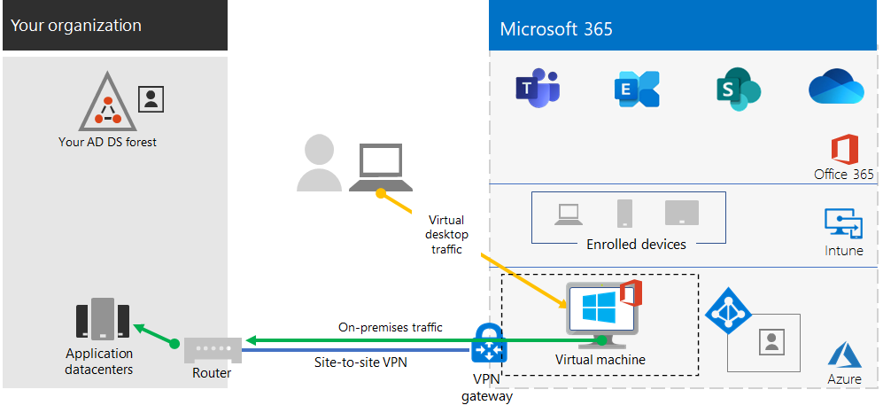

# Stap 2.Step 2. Externe toegang bieden tot on-premises apps en servicesProvide remote access to on-premises apps and services

Als uw organisatie een VPN-oplossing voor externe toegang gebruikt, meestal met VPN-servers aan de rand van uw netwerk en VPN-clients geïnstalleerd op de apparaten van uw gebruikers, kunnen uw gebruikers VPN-verbindingen voor externe toegang gebruiken voor toegang tot on-premises apps en servers.If your organization uses a remote access VPN solution, typically with VPN servers on the edge of your network and VPN clients installed on your users' devices, your users can use remote access VPN connections to access on-premises apps and servers. Het kan zijn dat u het verkeer naar de Microsoft 365-cloudservices moet optimaliseren.But you may need to optimize traffic to Microsoft 365 cloud-based services.

Als uw gebruikers geen VPN-oplossing gebruiken, kunt u Azure AD-toepassingsproxy (Active Directory) en Azure P2S-VPN (Point-to-Site) gebruiken om toegang te bieden, afhankelijk van het feit of al uw apps webversies zijn.If your users do not use a VPN solution, you can use Azure Active Directory (Azure AD) Application Proxy and Azure Point-to-Site (P2S) VPN to provide access, depending on whether all your apps are web-based.

Dit zijn de belangrijkste configuraties voor externe toegang:Here are the primary configurations for remote access:

- U gebruikt al een VPN-oplossing voor externe toegang.You are already using a remote access VPN solution.
- U gebruikt geen VPN-oplossing voor externe toegang en u wilt dat uw externe werknemers hun persoonlijke computers kunnen gebruiken.You are not using a remote access VPN solution and you want your remote workers to use their personal computers.
- U gebruikt geen VPN-oplossing voor externe toegang, u hebt een hybride identiteit en u hebt alleen externe toegang nodig tot on-premises web-apps.You are not using a remote access VPN solution, you have hybrid identity, and you need remote access only to on-premises web-based apps.
- U gebruikt geen VPN-oplossing voor externe toegang en u hebt toegang nodig tot on-premises apps, waarvan sommige niet op internet zijn gebaseerd.You are not using a remote access VPN solution and you need access to on-premises apps, some of which are not web-based.

Bekijk deze stroomdiagram voor de configuratieopties voor externe toegang die in dit artikel worden beschreven.See this flowchart for the remote access configuration options discussed in this article.

Met externe toegangsverbindingen kunt u ook [Extern bureaublad](https://support.microsoft.com/help/4028379/windows-10-how-to-use-remote-desktop) gebruiken om uw gebruikers verbinding te laten maken met een on-premises pc.With remote access connections, you can also use [Remote Desktop](https://support.microsoft.com/help/4028379/windows-10-how-to-use-remote-desktop) to connect your users to an on-premises PC. Een externe medewerker kan bijvoorbeeld Extern bureaublad gebruiken om verbinding te maken met de pc op zijn kantoor vanuit zijn Windows-, iOS- of Android-apparaat.For example, a remote worker can use Remote Desktop to connect to the PC in their office from their Windows, iOS, or Android device. Zodra hij extern verbinding heeft gemaakt, kan hij deze gebruiken alsof hij erachter zit.Once they are remotely connected, they can use it as if they were sitting in front of it.

## Prestaties optimaliseren voor VPN-clients voor externe toegang tot Microsoft 365-cloudservicesOptimize performance for remote access VPN clients to Microsoft 365 cloud services

Als uw externe medewerkers een traditionele VPN-client gebruiken om extern toegang te krijgen tot uw bedrijfsnetwerk, verifieer dan dat de VPN-client split tunneling ondersteunt.If your remote workers are using a traditional VPN client to obtain remote access to your organization network, verify that the VPN client has split tunneling support.

Zonder split tunneling wordt al uw externe werk verzonden via de VPN-verbinding, terwijl het moet worden doorgestuurd naar de edge-apparaten van uw bedrijf, worden verwerkt en dan verzonden op internet.Without split tunneling, all of your remote work traffic gets sent across the VPN connection, where it must be forwarded to your organization’s edge devices, get processed, and then sent on the Internet.

Microsoft 365-verkeer moet een indirecte route gebruiken binnen jouw organisatie en kan worden doorgestuurd naar een Microsoft-netwerkingangspunt ver van de fysieke locatie van de VPN-client vandaan.Microsoft 365 traffic must take an indirect route through your organization, which could be forwarded to a Microsoft network entry point far away from the VPN client’s physical location. Met dit indirecte pad wordt een vertraging toegevoegd aan het netwerkverkeer en wordt de algehele prestatie negatief beïnvloed. This indirect path adds latency to the network traffic and decreases overall performance. 

Met split tunneling kunt u uw VPN-client zo configureren dat specifieke typen verkeer niet via de VPN-verbinding naar het bedrijfsnetwerk worden verzonden.With split tunneling, you can configure your VPN client to exclude specific types of traffic from being sent over the VPN connection to the organization network.

Configureer uw split tunneling VPN-clients zodanig dat verkeer wordt uitgesloten naar de Microsoft 365-eindpuntcategorie **Optimaliseren** over de VPN-verbinding om toegang tot Microsoft 365-cloudresources te optimaliseren.To optimize access to Microsoft 365 cloud resources, configure your split tunneling VPN clients to exclude traffic to the **Optimize** category Microsoft 365 endpoints over the VPN connection. Zie [Office 365-eindpuntcategorieën](../enterprise/microsoft-365-network-connectivity-principles.md#new-office-365-endpoint-categories) voor meer informatie. For more information, see [Office 365 endpoint categories](../enterprise/microsoft-365-network-connectivity-principles.md#new-office-365-endpoint-categories). Bekijk [de lijst](../enterprise/urls-and-ip-address-ranges.md) met eindpunten met categorie Optimaliseren.See [this list](../enterprise/urls-and-ip-address-ranges.md) of Optimize category endpoints.

Hier vindt u de stroom die het resultaat is van de gegevensoverdracht, waarin de meeste verkeer naar Cloud-apps voor Microsoft 365 de VPN-verbinding omzeilen.Here is the resulting traffic flow, in which most of the traffic to Microsoft 365 cloud apps bypass the VPN connection.

Hiermee kan de VPN-client cruciaal Microsoft 365-cloudserviceverkeer direct over internet verzenden en ontvangen en via het dichtstbijzijnde ingangspunt in het Microsoft-netwerk.This allows the VPN client to send and receive crucial Microsoft 365 cloud service traffic directly over the Internet and to the nearest entry point into the Microsoft network.

Bekijk [Office 365-connectiviteit optimaliseren voor externe gebruikers met VPN-split-tunneling](../enterprise/microsoft-365-vpn-split-tunnel.md) voor meer informatie en richtlijnen.For more information and guidance, see [Optimize Office 365 connectivity for remote users using VPN split tunneling](../enterprise/microsoft-365-vpn-split-tunnel.md).

## Externe toegang implementeren wanneer al uw apps web-apps zijn en u een hybride identiteit hebtDeploy remote access when all your apps are web apps and you have hybrid identity

Als uw externe medewerkers geen traditionele VPN-client gebruiken en uw on-premises gebruikersaccounts en -groepen worden gesynchroniseerd met Azure AD, kunt u Azure AD-toepassingsproxy gebruiken om veilige externe toegang te bieden voor webtoepassingen die worden gehost op lokale servers.If your remote workers are not using a traditional VPN client and your on-premises user accounts and groups are synchronized with Azure AD, you can use Azure AD Application Proxy to provide secure remote access for web-based applications hosted on on-premises servers. Webtoepassingen omvatten onder meer SharePoint Server-sites, Outlook-webtoegangsservers of andere bedrijfswebtoepassingen.Web-based applications include SharePoint Server sites, Outlook Web Access servers, or any other web-based line of business applications. 

Hier vindt u de onderdelen van Azure AD-toepassingsproxy.Here are the components of Azure AD Application Proxy.

Zie dit [overzicht van Azure AD-toepassingsproxy](/azure/active-directory/manage-apps/application-proxy)voor meer informatie.For more information, see this [overview of Azure AD Application Proxy](/azure/active-directory/manage-apps/application-proxy).

>[!Note]
>Azure AD-toepassingsproxy maakt geen deel uit van een Microsoft 365-abonnement.Azure AD Application Proxy is not included with a Microsoft 365 subscription. U moet betalen voor het gebruik met een afzonderlijk Azure-abonnement.You must pay for usage with a separate Azure subscription.
>

## Externe toegang implementeren wanneer niet al uw apps web-apps zijnDeploy remote access when not all your apps are web apps

Als uw externe medewerkers geen traditionele VPN-client gebruiken en sommige van uw apps zijn geen web-apps, kunt u een Azure P2S-VPN (Point-to-Site) gebruiken.If your remote workers are not using a traditional VPN client and you have apps that are not web-based, you can use an Azure Point-to-Site (P2S) VPN.

Een P2S VPN-verbinding maakt een beveiligde verbinding met uw bedrijfsnetwerk vanaf het apparaat van de externe medewerker via een virtueel Azure-netwerk.A P2S VPN connection creates a secure connection from a remote worker’s device to your organization network through an Azure virtual network. 

Zie dit [overzicht van P2S VPN](/azure/vpn-gateway/point-to-site-about) voor meer informatie.For more information, see this [overview of P2S VPN](/azure/vpn-gateway/point-to-site-about).

>[!Note]
>Azure P2S VPN maakt geen deel uit van een Microsoft 365-abonnement.Azure P2S VPN is not included with a Microsoft 365 subscription. U moet betalen voor het gebruik met een afzonderlijk Azure-abonnement.You must pay for usage with a separate Azure subscription.
>

## Windows-virtueel bureaublad implementeren om externe toegang te bieden voor externe medewerkers met persoonlijke apparatenDeploy Windows Virtual Desktop to provide remote access for remote workers using personal devices 

Om externe medewerkers te ondersteunen die alleen hun persoonlijke en onbeheerde apparaten kunnen gebruiken, gebruikt u Windows-virtueel bureaublad in Azure om virtuele bureaubladen te maken en toe te wijzen aan uw gebruikers die thuiswerken.To support remote workers who can only use their personal and unmanaged devices, use Windows Virtual Desktop in Azure to create and allocate virtual desktops for your users to use from home. Gevirtualiseerde pc's werken net als pc's die verbinding hebben met uw bedrijfsnetwerk.Virtualized PCs can act just like PCs connected to your organization network.

Voor meer informatie raadpleegt u dit [overzicht van Windows-virtueel bureaublad](/azure/virtual-desktop/overview).For more information, see this [overview of Windows Virtual Desktop](/azure/virtual-desktop/overview). 

>[!Note]
>Windows Virtual Desktop maakt geen deel uit van een Microsoft 365-abonnement.Windows Virtual Desktop is not included with a Microsoft 365 subscription. U moet betalen voor het gebruik met een afzonderlijk Azure-abonnement.You must pay for usage with a separate Azure subscription.
>

## Verbindingen voor Extern bureaublad-services beveiligen met de Extern bureaublad-servicesgatewayProtect your Remote Desktop Services connections with the Remote Desktop Services Gateway

Als u Extern bureaublad-services (RDS) gebruikt om medewerkers verbinding te laten maken met Windows-computers in het on-premises-netwerk, moet u een Extern bureaublad-servicesgateway van Microsoft in het edgenetwerk gebruiken.If you are using Remote Desktop Services (RDS) to allow employees to connect into Windows-based computers on your on-premises network, you should use a Microsoft Remote Desktop Services gateway in your edge network. De gateway maakt gebruik van Transport Layer Security (TLS) om verkeer te versleutelen en voorkomt dat de lokale computer die als host fungeert voor RDS een onveilige verbinding heeft met internet.The gateway uses Transport Layer Security (TLS) to encrypt traffic and prevents the on-premises computer hosting RDS from being directly exposed to the Internet.

Zie [dit artikel](https://www.microsoft.com/security/blog/2020/04/16/security-guidance-remote-desktop-adoption/) voor meer informatie.See [this article](https://www.microsoft.com/security/blog/2020/04/16/security-guidance-remote-desktop-adoption/) for more information.

## Technische bronnen voor beheerders voor externe toegangAdmin technical resources for remote access

- [Office 365-verkeer snel optimaliseren voor externe medewerkers en de belasting van uw infrastructuur verminderenHow to quickly optimize Office 365 traffic for remote staff & reduce the load on your infrastructure](https://techcommunity.microsoft.com/t5/office-365-blog/how-to-quickly-optimize-office-365-traffic-for-remote-staff-amp/ba-p/1214571)
- [Office 365-connectiviteit optimaliseren voor externe gebruikers met VPN-split-tunnelingOptimize Office 365 connectivity for remote users using VPN split tunneling](../enterprise/microsoft-365-vpn-split-tunnel.md)

## Resultaten van stap 2Results of Step 2

Na de implementatie van een oplossing voor externe toegang voor uw externe medewerkers:After deployment of a remote access solution for your remote workers:

| Configuratie voor externe toegangRemote access configuration | ResultatenResults |
|:-------|:-----|
| Er is een VPN-oplossing voor externe toegang geïnstalleerdA remote access VPN solution is in place | U hebt uw VPN-client voor externe toegang voor split tunneling en de Microsoft 365-eindpuncategorie Optimaliseren geconfigureerd.You have configured your remote access VPN client for split tunneling and for the Optimize category of Microsoft 365 endpoints. |
| Geen VPN-oplossing voor externe toegang en u hebt alleen externe toegang nodig tot on-premises web-appsNo remote access VPN solution and you need remote access only to on-premises web-based apps | U hebt Azure-toepassingsproxy geconfigureerd.You have configured Azure Application Proxy. |
| Geen VPN-oplossing voor externe toegang en u hebt externe toegang nodig tot on-premises apps, waarvan sommige niet op internet zijn gebaseerdNo remote access VPN solution and you need access to on-premises apps, some of which are not web-based | U hebt Azure P2S VPN geconfigureerd.You have configured Azure P2S VPN. |
| Externe medewerkers gebruiken hun persoonlijke apparaten thuisRemote workers are using their personal devices from home | U hebt Windows-virtueel bureaublad geconfigureerd.You have configured Windows Virtual Desktop. |
| Externe werknemers gebruiken RDS om verbinding te maken met on-premises-systemenRemote workers are using RDS connections to on-premises systems | U hebt een Extern bureaublad-servicesgateway in het edgenetwerk geïmplementeerd.You have deployed a Remote Desktop Services gateway in your edge network. |
|||

## Volgende stapNext step

Ga verder met [stap 3](empower-people-to-work-remotely-security-compliance.md) om beveiligings- en complianceservices van Microsoft 365 te implementeren om uw apps, gegevens en apparaten te beveiligen.Continue with [Step 3](empower-people-to-work-remotely-security-compliance.md) to deploy Microsoft 365 security and compliance services to protect your apps, data, and devices.