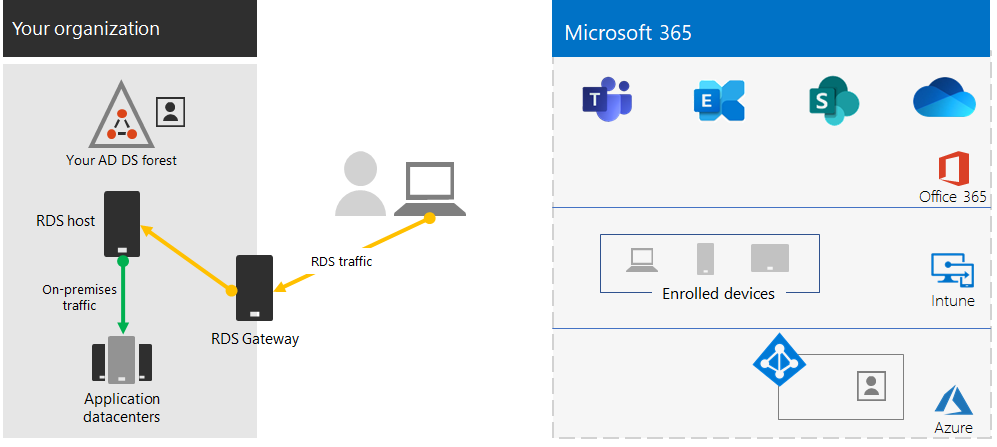
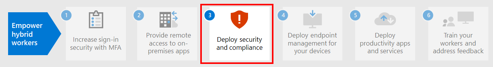

# Stap 2. Externe toegang bieden tot on-premises apps en services

Als uw organisatie een VPN-oplossing voor externe toegang gebruikt, meestal met VPN-servers aan de rand van uw netwerk en VPN-clients geïnstalleerd op de apparaten van uw gebruikers, kunnen uw gebruikers VPN-verbindingen voor externe toegang gebruiken voor toegang tot on-premises apps en servers. Het kan zijn dat u het verkeer naar de Microsoft 365-cloudservices moet optimaliseren.

Als uw gebruikers geen VPN-oplossing gebruiken, kunt u Azure AD-toepassingsproxy (Active Directory) en Azure P2S-VPN (Point-to-Site) gebruiken om toegang te bieden, afhankelijk van het feit of al uw apps webversies zijn.

Er zijn drie primaire configuraties:

1. U gebruikt al een VPN-oplossing voor externe toegang.
2. U gebruikt geen VPN-oplossing voor externe toegang, u hebt een hybride identiteit en u hebt alleen externe toegang nodig tot on-premises web-apps.
3. U gebruikt geen VPN-oplossing voor externe toegang en u hebt toegang nodig tot on-premises apps, waarvan sommige niet op internet zijn gebaseerd.

Bekijk deze stroomdiagram voor de configuratieopties voor externe toegang die in dit artikel worden beschreven.

Met externe toegangsverbindingen kunt u ook [Extern bureaublad](https://support.microsoft.com/help/4028379/windows-10-how-to-use-remote-desktop) gebruiken om uw gebruikers verbinding te laten maken met een on-premises pc. Een externe medewerker kan bijvoorbeeld Extern bureaublad gebruiken om verbinding te maken met de pc op zijn kantoor vanuit zijn Windows-, iOS- of Android-apparaat. Zodra hij extern verbinding heeft gemaakt, kan hij deze gebruiken alsof hij erachter zit.

## Prestaties optimaliseren voor VPN-clients voor externe toegang tot Microsoft 365-cloudservices

Als uw externe medewerkers een traditionele VPN-client gebruiken om extern toegang te krijgen tot uw bedrijfsnetwerk, verifieer dan dat de VPN-client split tunneling ondersteunt.

Zonder split tunneling wordt al uw externe werk verzonden via de VPN-verbinding, terwijl het moet worden doorgestuurd naar de edge-apparaten van uw bedrijf, worden verwerkt en dan verzonden op internet.

Microsoft 365-verkeer moet een indirecte route gebruiken binnen uw organisatie dat dan kan worden doorgestuurd naar een Microsoft-netwerkingangspunt ver verwijderd van de fysieke locatie van de VPN-client. Met dit indirecte pad wordt een vertraging toegevoegd aan het netwerkverkeer en wordt de algehele prestatie negatief beïnvloed.  

Met split tunneling kunt u uw VPN-client zo configureren dat specifieke typen verkeer niet via de VPN-verbinding naar het bedrijfsnetwerk worden verzonden.

Configureer uw split tunneling VPN-clients zodanig dat verkeer wordt uitgesloten naar de Microsoft 365-eindpuntcategorie **Optimaliseren** over de VPN-verbinding om toegang tot Microsoft 365-cloudresources te optimaliseren. Zie [Office 365-eindpuntcategorieën](https://docs.microsoft.com/microsoft-365/enterprise/microsoft-365-network-connectivity-principles#new-office-365-endpoint-categories) voor meer informatie.  Bekijk [hier](https://docs.microsoft.com/microsoft-365/enterprise/urls-and-ip-address-ranges) de lijst met eindpunten met categorie Optimaliseren.

Hiermee kan de VPN-client cruciaal Microsoft 365-cloudserviceverkeer direct over internet verzenden en ontvangen en via het dichtstbijzijnde ingangspunt in het Microsoft-netwerk.

Bekijk [Office 365-connectiviteit optimaliseren voor externe gebruikers met VPN-split-tunneling](https://docs.microsoft.com/microsoft-365/enterprise/microsoft-365-vpn-split-tunnel??) voor meer informatie en richtlijnen.

## Externe toegang implementeren wanneer al uw apps web-apps zijn en u een hybride identiteit hebt

Als uw externe medewerkers geen traditionele VPN-client gebruiken en uw on-premises gebruikersaccounts en -groepen worden gesynchroniseerd met Azure AD, kunt u Azure AD-toepassingsproxy gebruiken om veilige externe toegang te bieden voor webtoepassingen die worden gehost op intranetservers. Webtoepassingen omvatten onder meer SharePoint-sites, Outlook-webtoegangsservers of andere bedrijfswebtoepassingen. 

Hier vindt u de onderdelen van Azure AD-toepassingsproxy.

Raadpleeg voor meer informatie dit [overzicht van Azure AD-toepassingsproxy](https://docs.microsoft.com/azure/active-directory/manage-apps/application-proxy) en [deel 3 van de video over het gebruik van Azure AD-toepassingsproxy](https://resources.techcommunity.microsoft.com/enabling-remote-work/#security).

>[!Note]
>Azure AD-toepassingsproxy maakt geen deel uit van een Microsoft 365-abonnement. U moet betalen voor het gebruik met een afzonderlijk Azure-abonnement.
>

## Externe toegang implementeren wanneer niet al uw apps web-apps zijn

Als uw externe medewerkers geen traditionele VPN-client gebruiken en sommige van uw apps zijn geen web-apps, kunt u een Azure P2S-VPN (Point-to-Site) gebruiken.

Een P2S VPN-verbinding maakt een beveiligde verbinding met uw bedrijfsnetwerk vanaf het apparaat van de externe medewerker via een virtueel Azure-netwerk. 

Zie dit [overzicht van P2S VPN](https://docs.microsoft.com/azure/vpn-gateway/point-to-site-about) voor meer informatie.

>[!Note]
>Azure P2S VPN maakt geen deel uit van een Microsoft 365-abonnement. U moet betalen voor het gebruik met een afzonderlijk Azure-abonnement.
>

## Windows-virtueel bureaublad implementeren om externe toegang te bieden voor externe medewerkers met persoonlijke apparaten 

Om externe medewerkers te ondersteunen die alleen hun persoonlijke en onbeheerde apparaten kunnen gebruiken, gebruikt u Windows-virtueel bureaublad in Azure om virtuele bureaubladen te maken en toe te wijzen aan uw gebruikers die thuiswerken. Gevirtualiseerde pc's werken net als pc's die verbinding hebben met uw bedrijfsnetwerk.

Zie voor meer informatie: 

- [Dit overzicht van Windows Virtual Desktop](https://docs.microsoft.com/azure/virtual-desktop/overview).
- [Deel 2 van de video over het gebruik van Windows Virtual Desktop voor externe werknemers](https://resources.techcommunity.microsoft.com/enabling-remote-work/#productivity).

>[!Note]
>Windows Virtual Desktop maakt geen deel uit van een Microsoft 365-abonnement. U moet betalen voor het gebruik met een afzonderlijk Azure-abonnement.
>

## Verbindingen voor Extern bureaublad-services beveiligen met de Extern bureaublad-servicesgateway

Als u Extern bureaublad-services (RDS) gebruikt om medewerkers verbinding te laten maken met Windows-computers in het on-premises-netwerk, moet u een Extern bureaublad-servicesgateway van Microsoft in het edgenetwerk gebruiken. De gateway maakt gebruik van Secure Sockets Layer (SSL) om communicatie te versleutelen en voorkomt dat het systeem dat als host fungeert voor RDS onbeveiligd met het internet is verbonden.

Zie [dit artikel](https://www.microsoft.com/security/blog/2020/04/16/security-guidance-remote-desktop-adoption/) voor meer informatie.

## Technische bronnen voor beheerders voor externe toegang

- [Office 365-verkeer snel optimaliseren voor externe medewerkers en de belasting van uw infrastructuur verminderen](https://techcommunity.microsoft.com/t5/office-365-blog/how-to-quickly-optimize-office-365-traffic-for-remote-staff-amp/ba-p/1214571)
- [Office 365-connectiviteit optimaliseren voor externe gebruikers met VPN-split-tunneling](https://docs.microsoft.com/microsoft-365/enterprise/microsoft-365-vpn-split-tunnel?)

## Resultaten van stap 2

Na de implementatie van een oplossing voor externe toegang voor uw externe medewerkers:

| Configuratie voor externe toegang | Resultaten |
|:-------|:-----|
| Er is een VPN-oplossing voor externe toegang geïnstalleerd | U hebt uw VPN-client voor externe toegang voor split tunneling en de Microsoft 365-eindpuncategorie Optimaliseren geconfigureerd. |
| Geen VPN-oplossing voor externe toegang en u hebt alleen externe toegang nodig tot on-premises web-apps | U hebt Azure-toepassingsproxy geconfigureerd. |
| Geen VPN-oplossing voor externe toegang en u hebt externe toegang nodig tot on-premises apps, waarvan sommige niet op internet zijn gebaseerd | U hebt Azure P2S VPN geconfigureerd. |
| Externe medewerkers gebruiken hun persoonlijke apparaten thuis | U hebt Windows-virtueel bureaublad geconfigureerd. |
| Externe werknemers gebruiken RDS om verbinding te maken met on-premises-systemen | U hebt een Extern bureaublad-servicesgateway in het edgenetwerk geïmplementeerd. |
|||

## Volgende stap

Ga verder met [stap 3](empower-people-to-work-remotely-security-compliance.md) om beveiligings- en complianceservices van Microsoft 365 te implementeren om uw apps, gegevens en apparaten te beveiligen.

