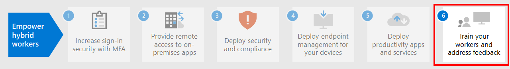

# Stap 5.Step 5. Productiviteitsapps en -services implementeren voor externe medewerkersDeploy remote worker productivity apps and services

Om productief te zijn, moeten mensen met elkaar kunnen communiceren en samenwerken.To be productive, people need to communicate and collaborate with one another. Ze moeten kunnen vergaderen, chatten via spraak en tekst, nieuwe inhoud kunnen maken, bestanden en informatie delen, e-mails uitwisselen en agenda's en taken kunnen beheren.They need to meet, chat by voice and text, create new content and share information and files, exchange email, and manage calendars and tasks. Microsoft 365 bied cloudservices voor al deze belangrijke functies:Microsoft 365 provides cloud-based services for all of these key functions:

| IT-functieIT function | Microsoft 365-onderdelenMicrosoft 365 components | OmschrijvingDescription |
|:-------|:-----|:-------|
| E-mailservicesEmail services | Exchange OnlineExchange Online | E-mail uitwisselen en agenda's, contactpersonen en taken beheren met de Outlook-client.Exchange email and manage calendars, contacts, and tasks with the Outlook client. |
| Organigram, VOIP (Voice Over IP) en samenwerking op basis van teamsOrganizational chat, voice over IP (VOIP), and team-based collaboration | Microsoft TeamsMicrosoft Teams | Zorg dat mensen verbonden blijven terwijl ze op andere plaatsen werken. Teams biedt een gemeenschappelijke communicatiehub voor vergaderingen, chatberichten en bestandsopslag voor organisaties, afdelingen, kleine teams en individuele personen.Keep people connected while they work apart with a common hub of communication for meetings, chats, and file storage for the organization, departments, and for small teams and individuals. |
| Internetsites, samenwerken aan documentenIntranet sites, document collaboration | SharePoint en OneDriveSharePoint and OneDrive | Sla bestanden op en werk er samen aan in een webbrowser of in Teams.Store and collaborate on files within a web browser or within Teams. |
| Office-toepassingen voor bureaublad en mobiele apparatenDesktop and mobile device Office applications | Microsoft 365-appsMicrosoft 365 Apps | Microsoft 365-apps zijn versies van Word, PowerPoint, Excel en Outlook die zijn geïnstalleerd op uw lokale computer en die voortdurend functie- en beveiligingsupdates ontvangen. Gebruik deze apps voor het maken van nieuwe inhoud of samenwerken aan bestaande inhoud.Create new content or collaborate on existing content with versions of Word, PowerPoint, Excel, and Outlook that are installed on your local computer and receive ongoing feature and security updates. |
||||

## Houd iedereen verbonden met Microsoft TeamsKeep people connected with Microsoft Teams

Met Teams kunt u op één plek chatten, vergaderen, bellen en samenwerken.Teams allows you to chat, meet, call, and collaborate all in one place. Miljoenen mensen doen elke dag hun werk in Teams, omdat het alles wat u nodig hebt om extern te werken, samenbrengt in een hub voor teamwork.Millions of people get their work done in Teams every day because it brings together everything you need to work remotely into a hub for teamwork. 

Voor gedetailleerde informatie, zie[Externe medewerkers ondersteunen met Microsoft Teams](/microsoftteams/support-remote-work-with-teams).For detailed guidance, see [Support remote workers using Microsoft Teams](/microsoftteams/support-remote-work-with-teams). 

Bekijk de [webcasts Inschakelen van hybride werkzaamheden met Microsoft Teams](https://resources.techcommunity.microsoft.com/enabling-hybrid-work/) voor hulp bij en demo's over het gebruik van Teams voor extern werk.Watch the [Enabling hybrid work with Microsoft Teams webcasts](https://resources.techcommunity.microsoft.com/enabling-hybrid-work/) for guidance and demos on using Teams for remote work.

### Chat en gesprekkenChat and conversations

Chat en gesprekken met threads staan centraal in Teams met ondersteuning voor één-op-één-gesprekken en groepsgesprekken.Chat and threaded conversations are at the center of Teams with support for individual 1:1 chats and group chats and conversations. Externe medewerkers kunnen gegevens, meningen en karakter delen door GIF's, stickers en emoji's te gebruiken in groepschats of persoonlijke berichten.Remote workers can share information, opinions, and personality by using gifs, stickers, and emojis in group chats or one-to-one messages.

### Besprekingen en vergaderingenMeetings and conferencing 

Teams biedt zeker hulp bij het onderhouden van communicatie en het delen van gegevens met externe medewerkers, met name met vergaderingen voor maximaal 250 mensen.Teams can certainly help maintain communications and information sharing with remote workers, especially with meetings that support up to 250 people. Teams-vergaderingen bieden interactieve, gezamenlijke vergaderingen met mensen binnen en buiten uw organisatie.Teams meetings enable interactive, collaborative meetings with people inside and outside your organization. Externe medewerkers kunnen Teams-vergaderingen gebruiken voor dagelijkse activiteiten waaronder terugkerende projectcontrolepunten, bijpraten met collega's, brainstormsessies en gesprekken met klanten.Remote workers can use Teams meetings for day-to-day activities including recurring project checkpoints, catching-up with colleagues, brainstorming sessions, and facilitating conversations with customers. 

### BellenCalling

Teams ondersteunt rechtstreekse VoIP-gesprekken tussen gebruikers en zelfs andere organisaties die gebruikmaken van federatie.Teams supports direct VoIP calling between users and even other organizations using federation. Teams gebruikt dezelfde codecs als vergaderingen en biedt wereldwijd geweldige audio zonder extra PSTN-kosten.It uses the same codecs as meetings and provide great audio world-wide without additional PSTN charges. Sommige gebruikers hebben echter mogelijk een speciaal telefoonnummer nodig om externe gesprekken aan te nemen wanneer ze extern werken.However, some users may need a dedicated phone number to take external calls when working remotely. Teams kan snel cloudtelefoonservice bieden voor deze gebruikers om telefoongesprekken te beginnen en te ontvangen.Teams can quickly provide cloud phone service for these users to make and receive phone calls.

### Apps en werkstromenApps and workflows

Teams biedt een platform voor apps en werkstromen die kunnen worden geopend vanaf de desktop-, web- en mobiele versies van Teams.Teams provides a platform for apps and workflows that can be accessed from the desktop, web, and mobile versions of Teams. Teams bevat honderden toepassingen die door Microsoft en derden zijn gepubliceerd, waarmee gebruikers beter kunnen samenwerken en waarmee veelgebruikte zakelijke services in Teams kunnen worden geïntegreerd.Teams provides hundreds of apps published by Microsoft and by third parties to engage users, support productivity, and integrate commonly used business services into Teams. Gebruikers en beheerders kunnen ook aangepaste apps en geautomatiseerde werkstromen voor Teams maken met Power Apps en Power Automate-ontwikkelhulpmiddelen met weinig code.Users and Admins can also create custom apps and automated workflows for Teams using the low-code Power Apps and Power Automate development tools.

Met apps en werkstromen zijn externe medewerkers productiever in Teams, door het verzamelen en delen van belangrijke gegevens, het automatiseren van herhalende taken en de mogelijkheid te chatten met een interactieve bot.Apps and workflows let remote workers be more productive in Teams, by collecting and sharing critical information, automating repetitive tasks, and allowing them to chat with interactive bot. Apps vastmaken aan een kanaal of de Teams-app-balk is een goede manier voor gebruikers om deze apps snel beschikbaar te hebben op een relevante plek en beheerders kunnen apps vastmaken om bewustwording en acceptatie te bewerkstelligen van de apps die iedereen zou moeten gebruiken.Pinning apps to a channel or the Teams app bar is a great way for users to make these apps easily accessible in a relevant space, and admins can pin apps to drive awareness and adoption of the apps that everyone should be using.

## E-mail uitwisselen en agenda's, contactpersonen en taken beheren met Exchange Online en OutlookExchange email and manage calendars, contacts, and tasks with Exchange Online and Outlook

Met Outlook kunnen externe medewerkers verbonden en georganiseerd blijven met e-mail, agenda's, contactpersonen en meer. Allemaal samen op één plek.With Outlook, remote workers can stay connected and organized with email, calendars, contacts, tasks, and more—together in one place. Met Outlook blijft u op koers en kunt u uw dagindeling prioriteren op basis van wat voor u relevant is.Outlook helps you stay on track and prioritize your day based on what’s relevant to you. Met Outlook kunt u rechtstreeks vanuit OneDrive bijlagen delen, Teams-vergaderingen plannen en eraan deelnemen, agenda's delen en bekijken en anderen machtigen.Outlook enables you to share attachments right from OneDrive, plan and join Teams meetings, view and share calendars, and provide delegate permissions to others. Door te weten wat eraan zit te komen qua werk- en privé-verplichtingen en wat er aandacht nodig heeft, kunnen externe medewerkers zich richten op wat belangrijk is.Knowing what’s coming up next across both work and personal commitments and what needs attention can help remote workers focus on what matters. Outlook biedt handige manieren voor externe medewerkers om hun tijd in te delen en eenvoudig te vinden wat ze zoeken, met inbegrip van bestanden, personen in de organisatie en meer.Outlook provides helpful ways for remote workers to manage their time and to find what they need easily, including files, people in the organization, and more. 

Zie [dit artikel](../security/defender-365-security/secure-email-recommended-policies.md) voor het aanbevolen beleid voor identiteiten en apparaattoegang om e-mailberichten en e-mailclients van organisaties te beveiligen waarmee moderne verificatie en voorwaardelijke toegang worden ondersteund.See [this article](../security/defender-365-security/secure-email-recommended-policies.md) for the recommended identity and device access policies to protect organizational email and email clients that support modern authentication and Conditional Access.

## Samenwerken aan en opslaan van bestanden met SharePoint en OneDriveStore and collaborate on files with SharePoint and OneDrive

Bij het samenwerken aan inhoud kunnen externe medewerkers SharePoint- en OneDrive-mappen gebruiken als centrale locatie in de cloud om bestanden op te slaan en te delen, eraan samen te werken, te cocreëren en te communiceren.For content collaboration, remote workers can use SharePoint and OneDrive folders as a central place in the cloud to store and share files, co-author, communicate, and collaborate. Externe medewerkers kunnen overal veilig werken vanuit een webbrowser, Teams en Office-apps.Remote workers can securely work from anywhere from a web browser, from Teams, and from Office apps.

Mogelijk moet u uw documenten migreren naar SharePoint of OneDrive vanuit:You might have to migrate your documents to SharePoint or OneDrive from:

- [SharePoint Server-teamsitesSharePoint Server Team Sites](/sharepointmigration/sp-teams-sites-migration-guide)
- [MySitesMySites](/sharepointmigration/mysites-to-onedrive-migration-guide)
- [BestandssharesFile shares](/sharepointmigration/fileshare-to-odsp-migration-guide)
- [VakBox](/sharepointmigration/box-to-onedrive-and-sharepoint-migration-guide)

Zie [dit artikel](../security/defender-365-security/sharepoint-file-access-policies.md) voor het aanbevolen beleid voor identiteiten en apparaattoegang om SharePoint en OneDrive te beveiligen.To protect SharePoint and OneDrive, see [this article](../security/defender-365-security/sharepoint-file-access-policies.md) for the recommended identity and device access policies.

## Maken van en samenwerken aan inhoud met Microsoft 365 AppsCreate and collaborate on content with Microsoft 365 Apps

Microsoft 365-apps is de meest productieve en veiligste Office-ervaring voor ondernemingen, waarmee medewerkers naadloos samen kunnen werken vanaf elke locatie op elk moment.Microsoft 365 Apps is the most productive and secure Office experience for enterprises, allowing people to work together seamlessly from anywhere, anytime. Externe medewerkers kunnen met meerdere personen tegelijk aan een document werken en in realtime bewerkingen en wijzigingen zien vanaf elk(e) laptop, pc of mobiel apparaat.Remote workers can collaborate on a document with multiple people simultaneously, see edits and changes in real time, and coauthor with others on any laptop, PC, or mobile device.

Zie de [implementatiehandleiding voor Microsoft 365-apps](/deployoffice/deployment-guide-microsoft-365-apps) voor meer informatie.For more information, see the [Deployment guide for Microsoft 365 Apps](/deployoffice/deployment-guide-microsoft-365-apps).

## Technische bronnen voor beheerders voor productiviteits-apps en -servicesAdmin technical resources for productivity apps and services

- [Externe medewerkers ondersteunen met Microsoft TeamsSupport remote workers using Microsoft Teams](/microsoftteams/support-remote-work-with-teams)
- [Webcasts Hybride werkzaamheden inschakelen met Microsoft TeamsEnabling hybrid work with Microsoft Teams webcasts](https://resources.techcommunity.microsoft.com/enabling-hybrid-work/)
- [Teams Customer Success Kit downloadenTeams Customer Success Kit download](https://www.microsoft.com/download/details.aspx?id=54244)
- [Hulpmiddelen voor de acceptatie van TeamsTools for driving Teams adoption](/microsoftteams/adopt-tools-and-downloads) 
- [Een strategie voor veranderingsmanagement maken voor Microsoft TeamsCreate a change management strategy for Microsoft Teams](/MicrosoftTeams/change-management-strategy)
- [Teams met drie beschermingsniveausTeams with three tiers of protection](configure-teams-three-tiers-protection.md)

## Bronnen voor gebruikerstraining voor productiviteits-apps en -servicesUser training resources for productivity apps and services

- [Uw gebruikers trainen in Office en Microsoft 365Train your users on Office and Microsoft 365](https://support.microsoft.com/office/train-your-users-on-office-and-microsoft-365-7cba3c97-7f19-46ed-a1c6-763971a26c27)
- [De webversie van Office gebruikenUse Office for the web](https://support.microsoft.com/office/get-started-with-office-for-the-web-in-microsoft-365-5622c7c9-721d-4b3d-8cb9-a7276c2470e5)

## Volgende stapNext step

Ga verder met [stap 6](empower-people-to-work-remotely-train-monitor-usage.md) om uw gebruikers te trainen en hun succes te bewaken.Continue with [Step 6](empower-people-to-work-remotely-train-monitor-usage.md) to train your users and monitor their success.