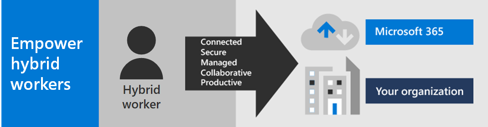
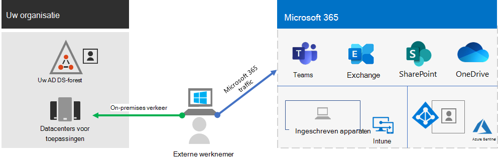
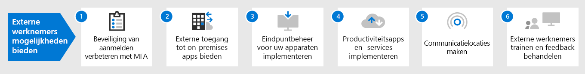

# Externe werknemers mogelijkheden bieden met Microsoft 365

De werknemers van uw bedrijf moeten mogelijk vanuit huis veilige toegang tot on-premises- en cloudgegevens, hulpprogramma's en informatiebronnen van uw organisatie kunnen krijgen. Werknemers in staat stellen buiten kantoor te werken is belangrijk voor veel organisaties om:

- Besparen op kantoorruimte.
- Werknemers aannemen en behouden die niet bereid zijn te verhuizen.
- De reistijd van werknemers verminderen, waardoor er meer tijd overblijft om productief te zijn en stress verlagende activiteiten uit te voeren buiten werktijd.

Microsoft 365 biedt de mogelijkheden om uw werknemers in staat te stellen om op afstand te werken.

Bekijk deze video voor een overzicht van het implementatieproces.
 
> [!VIDEO https://www.microsoft.com/videoplayer/embed/RE4F1af]

Deze oplossing biedt de volgende belangrijke mogelijkheden.

- Verbonden

  Externe werknemers hebben overal ter wereld en op elk gewenst moment toegang tot: 

  - Op de cloud gebaseerde services en gegevens in uw Microsoft 365-abonnement. 

  - Resources van de organisatie, zoals de resources van on-premises toepassingsdatacenters.

- Beveiligd

  Aanmeldingen worden beveiligd met meervoudige verificatie (MFA) en ingebouwde beveiligingsfuncties van Microsoft 365 en Windows 10 beveiligen tegen malware, kwaadwillige aanvallen en gegevensverlies.

- Beheerd

  De apparaten van uw externe werknemers kunnen worden beheerd vanuit de cloud met beveiligingsinstellingen, toegestane apps en door naleving van de systeemstatus te vereisen.

- Samenwerking en productiviteit

  Uw externe werknemers kunnen net zo productief zijn als op kantoor in een omgeving waar samenwerking eenvoudig is met:

  - Online vergaderingen en chatsessies met Teams. 

  - Gedeelde werkruimten voor cloudopslag met wereldwijde toegankelijkheid en realtime samenwerking met SharePoint en OneDrive.

  - Gedeelde taken en werkstromen om het werk te verdelen en taken uit te voeren. 

Voor een naadloze aanmeldervaring moeten de gebruikersaccounts voor on-premises Active Directory Domain Services (AD DS) zijn gesynchroniseerd met Azure Active Directory (Azure AD). Om uw Windows 10-apparaten te beveiligen, moeten ze worden geregistreerd in Intune. Dit is een algemeen overzicht van de infrastructuur.

Als je de mogelijkheden van Microsoft 365 wilt inschakelen voor uw externe werknemers, kun je gebruikmaken van de volgende functies van Microsoft 365.

| Functie | Beschrijving | Licenties |
|:-------|:-----|:-------|
| Afgedwongen door MFA en met standaardbeveiligingsinstellingen   | Voorkom gecompromitteerde identiteiten en apparaten met een tweede vorm van verificatie voor aanmeldingen. Als standaardinstelling voor de beveiliging is MFA vereist voor alle gebruikersaccounts.   | Microsoft 365 E3 of E5 |
| Afgedwongen door MFA en met voorwaardelijke toegang| Gebruik beleid voor voorwaardelijke toegang om MFA te vereisen op basis van de eigenschappen van de aanmelding.    | Microsoft 365 E3 of E5 | 
| Afgedwongen door MFA en met voorwaardelijke toegang op basis van risico   | Vereis MFA op basis van het risico van de gebruikersaanmelding met Microsoft Defender for Identity. | Microsoft 365 E5 of E3 met Azure AD Premium P2-licenties | 
| Selfservice voor wachtwoordherstel (SSPR)    | Sta toe dat gebruikers hun wachtwoorden of accounts opnieuw kunnen instellen of ontgrendelen.  | Microsoft 365 E3 of E5 |
| Azure AD-toepassingsproxy    | Bied beveiligde externe toegang bieden voor webtoepassingen die worden gehost op intranetservers.   | Hiervoor is een afzonderlijk betaald Azure-abonnement vereist |
| Azure-punt-naar-site-VPN   | Maak een veilige verbinding tussen het apparaat van een externe werknemer en uw intranet via een virtueel Azure-netwerk.   | Hiervoor is een afzonderlijk betaald Azure-abonnement vereist |
| Windows Virtual Desktop   | Bied ondersteuning voor externe werknemers die alleen hun persoonlijke en niet-beheerde apparaten kunnen gebruiken met virtuele bureaubladen die worden uitgevoerd in Azure. | Hiervoor is een afzonderlijk betaald Azure-abonnement vereist |
| Extern bureaublad-services (RDS) | Geef werknemers toestemming om verbinding te maken met Windows-computers op uw intranet. | Microsoft 365 E3 of E5 | 
| Gateway voor extern bureaublad-services   | Versleutel de communicatie en voorkom dat de RDS-hosts rechtstreeks worden weergegeven op internet. | Hiervoor zijn afzonderlijke Windows Server-licenties vereist |
| Microsoft Intune | Beheer apparaten en toepassingen.   | Microsoft 365 E3 of E5 | 
| Configuration Manager | Software-installaties, updates en instellingen op uw apparaten beheren | Hiervoor zijn afzonderlijke Configuration Manager-licenties vereist |
| Desktop Analytics | Bepaal de updategereedheid van uw Windows-clients.   | Hiervoor zijn afzonderlijke Configuration Manager-licenties vereist |
| Windows Autopilot | Configureer de nieuwe Windows 10-apparaten vooraf voor productief gebruik.   | Microsoft 365 E3 of E5 |
| Microsoft Teams, Exchange Online, SharePoint Online en OneDrive, Microsoft 365-apps, Microsoft Power Platform en Yammer | Maak, communiceer en werk samen. | Microsoft 365 E3 of E5 |
||||

Raadpleeg [Beveiliging en compliance implementeren voor beveiligings- en compliancecriteria voor externe werknemers](empower-people-to-work-remotely-security-compliance.md).

 Zie de [Poster Externe werknemers mogelijkheden bieden](../downloads/empower-remote-workers.pdf) voor een overzicht van twee pagina's van deze oplossing.

U kunt deze poster ook downloaden in [PDF](https://github.com/MicrosoftDocs/microsoft-365-docs/raw/public/microsoft-365/downloads/empower-remote-workers.pdf)-indeling en afdrukken op papier met formaat Letter, Legal of Tabloid (27,9 x 43,2 cm).

Gebruik de volgende stappen om de toegang tot de servers en cloudservices van je organisatie te beveiligen en optimaliseren, en je externe werknemers maximaal productief te laten zijn.

1. [Beveiliging van aanmelden verbeteren met MFA](empower-people-to-work-remotely-secure-sign-in.md)
2. [Externe toegang tot on-premises apps en services bieden](empower-people-to-work-remotely-remote-access.md)
3. [Beveiligings- en complianceservices implementeren](empower-people-to-work-remotely-security-compliance.md)
4. [Eindpuntbeheer voor uw apparaten, pc's en andere eindpunten implementeren](empower-people-to-work-remotely-manage-endpoints.md)
5. [Productiviteitsapps en -services voor externe medewerkers implementeren](empower-people-to-work-remotely-teams-productivity-apps.md)
6. [Externe werknemers trainen en voor feedback over gebruik zorgen](empower-people-to-work-remotely-train-monitor-usage.md)

Voor de meest recente informatie van Microsoft over het ondersteunen van externe werknemers, raadpleegt u de [Site voor het mogelijk maken van hybride werken met Microsoft Teams](https://resources.techcommunity.microsoft.com/enabling-hybrid-work/).

Als u wilt zien welke mogelijkheden een fictieve, maar representatieve multinational zijn externe werknemers heeft geboden, raadpleegt u [De COVID-19-aanpak en de infrastructuur voor extern en onsite werken van Contoso](contoso-remote-onsite-work.md).
