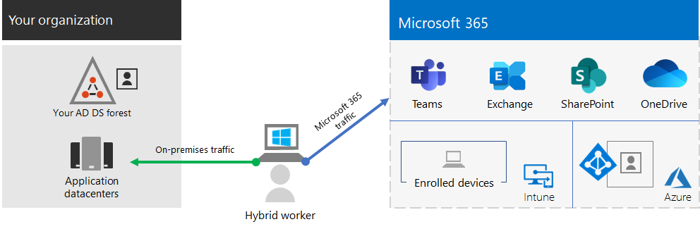

# Externe werknemers mogelijkheden bieden met Microsoft 365Empower remote workers with Microsoft 365

De werknemers van uw bedrijf moeten mogelijk vanuit huis veilige toegang tot on-premises- en cloudgegevens, hulpprogramma's en informatiebronnen van uw organisatie kunnen krijgen. Werknemers in staat stellen buiten kantoor te werken is belangrijk voor veel organisaties om:Your business may need to enable your workers to have secure access to your organization's on-premises and cloud-based information, tools, and resources from their homes. Allowing workers to work away from the office is important for many organizations to:

- Besparen op kantoorruimte.Save on office space.
- Werknemers aannemen en behouden die niet bereid zijn te verhuizen.Hire and retain workers who are unwilling to relocate.
- De reistijd van werknemers verminderen, waardoor er meer tijd overblijft om productief te zijn en stress verlagende activiteiten uit te voeren buiten werktijd.Reduce worker commuting, leaving them with more time to be productive and for stress-reducing activities outside of work.

Microsoft 365 biedt de mogelijkheden om uw werknemers in staat te stellen om op afstand te werken.Microsoft 365 has the capabilities to empower your workers to work remotely.

Bekijk deze video voor een overzicht van het implementatieproces.Watch this video for an overview of the deployment process.
 
> [!VIDEO https://www.microsoft.com/videoplayer/embed/RE4F1af]

Deze oplossing biedt de volgende belangrijke mogelijkheden.This solution provides these key capabilities.

- VerbondenConnected

  Externe werknemers hebben overal ter wereld en op elk gewenst moment toegang tot:From anywhere in the world and at any time, remote workers are able to access: 

  - Op de cloud gebaseerde services en gegevens in uw Microsoft 365-abonnement.Cloud-based services and data in your Microsoft 365 subscription. 

  - Resources van de organisatie, zoals de resources van on-premises toepassingsdatacenters.Organization resources, such those offered by on-premises application datacenters.

- BeveiligdSecure

  Aanmeldingen worden beveiligd met meervoudige verificatie (MFA) en ingebouwde beveiligingsfuncties van Microsoft 365 en Windows 10 beveiligen tegen malware, kwaadwillige aanvallen en gegevensverlies.Sign-ins are secured with multi-factor authentication (MFA) and built-in security features of Microsoft 365 and Windows 10 protect against malware, malicious attacks, and data loss.

- BeheerdManaged

  De apparaten van uw externe werknemers kunnen worden beheerd vanuit de cloud met beveiligingsinstellingen, toegestane apps en door naleving van de systeemstatus te vereisen.Your remote worker's devices can be managed from the cloud with security settings, allowed apps, and to require compliance with system health.

- Samenwerking en productiviteitCollaborative and productive

  Uw externe werknemers kunnen net zo productief zijn als op kantoor in een omgeving waar samenwerking eenvoudig is met:Your remote workers can be as productive as on-premises in a highly collaborative way with:

  - Online vergaderingen en chatsessies met Teams.Online meetings and chat sessions with Teams. 

  - Gedeelde werkruimten voor cloudopslag met wereldwijde toegankelijkheid en realtime samenwerking met SharePoint en OneDrive.Shared workspaces for cloud-based file storage with global accessibility and real-time collaboration with SharePoint and OneDrive.

  - Gedeelde taken en werkstromen om het werk te verdelen en taken uit te voeren.Shared tasks and workflows to divide up the work and get things done. 

Voor een naadloze aanmeldervaring moeten de gebruikersaccounts voor on-premises Active Directory Domain Services (AD DS) zijn gesynchroniseerd met Azure Active Directory (Azure AD). Om uw Windows 10-apparaten te beveiligen, moeten ze worden geregistreerd in Intune. Dit is een algemeen overzicht van de infrastructuur.For a seamless sign-in experience, your on-premises Active Directory Domain Services (AD DS) user accounts should be synchronized with Azure Active Directory (Azure AD). To protect your Windows 10 devices, they should be enrolled in Intune. Here is a high-level view of the infrastructure.

Als je de mogelijkheden van Microsoft 365 wilt inschakelen voor uw externe werknemers, kun je gebruikmaken van de volgende functies van Microsoft 365.To enable the capabilities of Microsoft 365 for your remote workers, use these Microsoft 365 features.

| FunctieCapability or feature | BeschrijvingDescription | LicentiesLicensing |
|:-------|:-----|:-------|
| Afgedwongen door MFA en met standaardbeveiligingsinstellingenMFA enforced with security defaults   | Voorkom gecompromitteerde identiteiten en apparaten met een tweede vorm van verificatie voor aanmeldingen. Als standaardinstelling voor de beveiliging is MFA vereist voor alle gebruikersaccounts.Protect against compromised identities and devices by requiring a second form of authentication for sign-ins. Security defaults requires MFA for all user accounts.   | Microsoft 365 E3 of E5Microsoft 365 E3 or E5 |
| Afgedwongen door MFA en met voorwaardelijke toegangMFA enforced with Conditional Access| Gebruik beleid voor voorwaardelijke toegang om MFA te vereisen op basis van de eigenschappen van de aanmelding.Require MFA based on the properties of the sign-in with Conditional Access policies.    | Microsoft 365 E3 of E5Microsoft 365 E3 or E5 | 
| Afgedwongen door MFA en met voorwaardelijke toegang op basis van risicoMFA enforced with risk-based Conditional Access   | Vereis MFA op basis van het risico van de gebruikersaanmelding met Microsoft Defender for Identity.Require MFA based on the risk of the user sign-in with Microsoft Defender for Identity. | Microsoft 365 E5 of E3 met Azure AD Premium P2-licentiesMicrosoft 365 E5 or E3 with Azure AD Premium P2 licenses | 
| Selfservice voor wachtwoordherstel (SSPR)Self-Service Password Reset (SSPR)    | Sta toe dat gebruikers hun wachtwoorden of accounts opnieuw kunnen instellen of ontgrendelen.Allow your users to reset or unlock their passwords or accounts.  | Microsoft 365 E3 of E5Microsoft 365 E3 or E5 |
| Azure AD-toepassingsproxyAzure AD Application Proxy    | Bied beveiligde externe toegang bieden voor webtoepassingen die worden gehost op intranetservers.Provide secure remote access for web-based applications hosted on intranet servers.   | Hiervoor is een afzonderlijk betaald Azure-abonnement vereistRequires separate paid Azure subscription |
| Azure-punt-naar-site-VPNAzure Point-to-Site VPN   | Maak een veilige verbinding tussen het apparaat van een externe werknemer en uw intranet via een virtueel Azure-netwerk.Create a secure connection from a remote worker’s device to your intranet through an Azure virtual network.   | Hiervoor is een afzonderlijk betaald Azure-abonnement vereistRequires separate paid Azure subscription |
| Windows Virtual DesktopWindows Virtual Desktop   | Bied ondersteuning voor externe werknemers die alleen hun persoonlijke en niet-beheerde apparaten kunnen gebruiken met virtuele bureaubladen die worden uitgevoerd in Azure.Support remote workers who can only use their personal and unmanaged devices with virtual desktops running in Azure. | Hiervoor is een afzonderlijk betaald Azure-abonnement vereistRequires separate paid Azure subscription |
| Extern bureaublad-services (RDS)Remote Desktop Services (RDS) | Geef werknemers toestemming om verbinding te maken met Windows-computers op uw intranet.Allow employees to connect into Windows-based computers on your intranet. | Microsoft 365 E3 of E5Microsoft 365 E3 or E5 | 
| Gateway voor extern bureaublad-servicesRemote Desktop Services Gateway   | Versleutel de communicatie en voorkom dat de RDS-hosts rechtstreeks worden weergegeven op internet.Encrypt communications and prevent the RDS hosts from being directly exposed to the Internet. | Hiervoor zijn afzonderlijke Windows Server-licenties vereistRequires separate Windows Server licenses |
| Microsoft IntuneMicrosoft Intune | Beheer apparaten en toepassingen.Manage devices and applications.   | Microsoft 365 E3 of E5Microsoft 365 E3 or E5 | 
| Configuration ManagerConfiguration Manager | Software-installaties, updates en instellingen op uw apparaten beherenManage software installations, updates, and settings on your devices | Hiervoor zijn afzonderlijke Configuration Manager-licenties vereistRequires separate Configuration Manager licenses |
| Desktop AnalyticsDesktop Analytics | Bepaal de updategereedheid van uw Windows-clients.Determine the update readiness of your Windows clients.   | Hiervoor zijn afzonderlijke Configuration Manager-licenties vereistRequires separate Configuration Manager licenses |
| Windows AutopilotWindows Autopilot | Configureer de nieuwe Windows 10-apparaten vooraf voor productief gebruik.Set up and pre-configure new Windows 10 devices for productive use.   | Microsoft 365 E3 of E5Microsoft 365 E3 or E5 |
| Microsoft Teams, Exchange Online, SharePoint Online en OneDrive, Microsoft 365-apps, Microsoft Power Platform en YammerMicrosoft Teams, Exchange Online, SharePoint Online and OneDrive, Microsoft 365 Apps, Microsoft Power Platform, and Yammer | Maak, communiceer en werk samen.Create, communicate, and collaborate. | Microsoft 365 E3 of E5Microsoft 365 E3 or E5 |
||||

Raadpleeg [Beveiliging en compliance implementeren voor beveiligings- en compliancecriteria voor externe werknemers](empower-people-to-work-remotely-security-compliance.md).For security and compliance criteria, see [Deploy security and compliance for remote workers](empower-people-to-work-remotely-security-compliance.md).

 Zie de [Poster Externe werknemers mogelijkheden bieden](../downloads/empower-remote-workers.pdf) voor een overzicht van twee pagina's van deze oplossing.For a 2-page summary of this solution, see the [Empower remote workers poster](../downloads/empower-remote-workers.pdf).

U kunt deze poster ook downloaden in [PDF](https://github.com/MicrosoftDocs/microsoft-365-docs/raw/public/microsoft-365/downloads/empower-remote-workers.pdf)-indeling en afdrukken op papier met formaat Letter, Legal of Tabloid (27,9 x 43,2 cm).You can also download this poster in [PDF](https://github.com/MicrosoftDocs/microsoft-365-docs/raw/public/microsoft-365/downloads/empower-remote-workers.pdf) and print it on letter, legal, or tabloid (11 x 17) size paper.

Gebruik de volgende stappen om de toegang tot de servers en cloudservices van je organisatie te beveiligen en optimaliseren, en je externe werknemers maximaal productief te laten zijn.Use these steps to secure and optimize access to your organization's servers and cloud services and maximize your remote worker's productivity.

1. [Beveiliging van aanmelden verbeteren met MFAIncrease sign-in security with MFA](empower-people-to-work-remotely-secure-sign-in.md)
2. [Externe toegang tot on-premises apps en services biedenProvide remote access to on-premises apps and services](empower-people-to-work-remotely-remote-access.md)
3. [Beveiligings- en complianceservices implementerenDeploy security and compliance services](empower-people-to-work-remotely-security-compliance.md)
4. [Eindpuntbeheer voor uw apparaten, pc's en andere eindpunten implementerenDeploy endpoint management for your devices, PCs, and other endpoints](empower-people-to-work-remotely-manage-endpoints.md)
5. [Productiviteitsapps en -services voor externe medewerkers implementerenDeploy remote worker productivity apps and services](empower-people-to-work-remotely-teams-productivity-apps.md)
6. [Externe werknemers trainen en voor feedback over gebruik zorgenTrain remote workers and address usage feedback](empower-people-to-work-remotely-train-monitor-usage.md)

Voor de meest recente informatie van Microsoft over het ondersteunen van externe werknemers, raadpleegt u de [Site voor het mogelijk maken van hybride werken met Microsoft Teams](https://resources.techcommunity.microsoft.com/enabling-hybrid-work/).For the latest information from Microsoft about supporting remote workers, see the [Enabling hybrid work with Microsoft Teams site](https://resources.techcommunity.microsoft.com/enabling-hybrid-work/).

Als u wilt zien welke mogelijkheden een fictieve, maar representatieve multinational zijn externe werknemers heeft geboden, raadpleegt u [De COVID-19-aanpak en de infrastructuur voor extern en onsite werken van Contoso](contoso-remote-onsite-work.md).To see how a fictional but representative multi-national organization empowered its remote workers, see [Contoso's COVID-19 response and infrastructure for remote and onsite work](contoso-remote-onsite-work.md).
