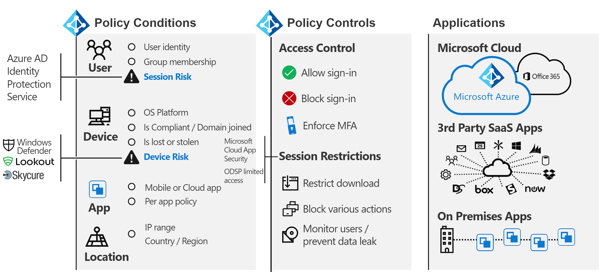
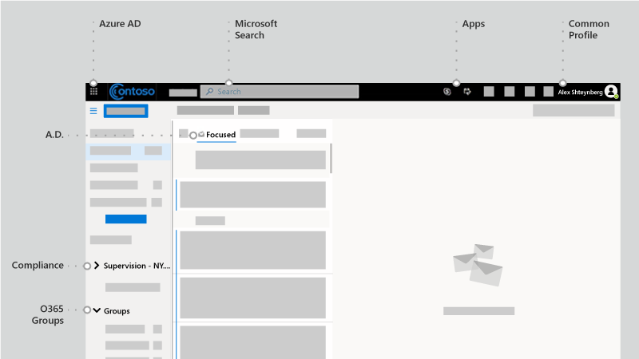
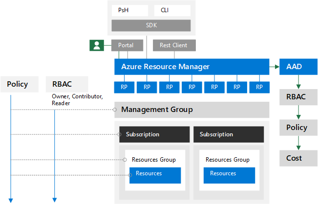

# Naar identiteit en verder: het gezichtspunt van één architect

In dit artikel bespreekt [Alex Shteynberg](https://www.linkedin.com/in/alex-shteynberg/), Principal Technical Architect bij Microsoft, de belangrijkste ontwerpstrategieën voor ondernemingen die Microsoft 365 en andere Microsoft-cloudservices gebruiken.

## Over de auteur

Ik ben een principal technical architect bij het New York [Microsoft Technology Center.](https://www.microsoft.com/mtc?rtc=1) Ik werk voornamelijk met grote klanten en complexe vereisten. Mijn standpunt en adviezen zijn gebaseerd op deze interacties en zijn mogelijk niet van toepassing op elke situatie. Als we klanten echter kunnen helpen met de meest complexe uitdagingen, kunnen we in mijn ervaring alle klanten helpen.

Ik werk meestal met meer dan 100 klanten per jaar. Hoewel elke organisatie unieke kenmerken heeft, is het interessant om trends en overeenkomsten te zien. Eén trend is bijvoorbeeld de interesse tussen verschillende bedrijfstaken voor veel klanten. Een banktak kan immers ook een koffiehuis en een buurtcentrum zijn.

In mijn rol richt ik me op het helpen van klanten bij het vinden van de beste technische oplossing om hun unieke set zakelijke doelen aan te pakken. Officieel richt ik me op Identiteit, Beveiliging, Privacy en Compliance. Ik vind het geweldig dat deze alles aanraken wat we doen. Het biedt mij de mogelijkheid om betrokken te zijn bij de meeste projecten. Dit houdt me erg bezig en geniet van deze rol.

Ik woon in New York City (de beste!) en geniet echt van de diversiteit van de cultuur, het eten en de mensen (geen verkeer). Ik reis graag wanneer ik kan en hoop dat ik het grootste deel van de wereld in mijn leven kan zien. Ik onderzoek momenteel een reis naar Afrika om meer te weten te komen over wilde dieren.

## Richtlijnen

- **Eenvoudig is vaak beter:** u kunt (bijna) alles met technologie doen, maar dat betekent niet dat u dat moet doen. Vooral in de beveiligingsruimte zijn veel klanten overgineeroplossingen. Ik vind [deze video van](https://www.youtube.com/watch?v=SOQgABDSYZE) de Stripe-conferentie van Google leuk om dit punt te onderstrepen.
- **Personen, proces, technologie:** [ontwerp voor personen om](https://en.wikipedia.org/wiki/Human-centered_design) het proces te verbeteren, niet eerst tech. Er zijn geen 'perfecte' oplossingen. We moeten verschillende risicofactoren in balans brengen en beslissingen zijn voor elk bedrijf verschillend. Te veel klanten ontwerpen een benadering die hun gebruikers later vermijden.
- **Focus eerst op 'waarom' en 'hoe' later:** Wees het vervelende 7-yr oude kind met een miljoen vragen. We kunnen niet tot het juiste antwoord komen als we niet de juiste vragen weten. Veel klanten gaan ervan uit hoe dingen moeten werken in plaats van het zakelijke probleem te definiëren. Er zijn altijd meerdere paden die u kunt volgen.
- **Lange staart van eerdere best practices:** erken dat best practices met een lichte snelheid veranderen. Als u Azure AD meer dan drie maanden geleden hebt bekeken, bent u waarschijnlijk verouderd. Alles hier kan na publicatie worden gewijzigd. De optie 'Beste' is over zes maanden mogelijk niet meer hetzelfde.

## Basislijnconcepten

Sla deze sectie niet over. Ik vind vaak dat ik terug moet naar deze onderwerpen, zelfs voor klanten die al jaren cloudservices gebruiken.
Taal is helaas geen nauwkeurig hulpmiddel. We gebruiken vaak hetzelfde woord om verschillende concepten of verschillende woorden te betekenen om hetzelfde concept te betekenen. Ik gebruik dit diagram hieronder vaak om bepaalde basislijnterminologie en 'hiërarchiemodel' vast te stellen.
  

  

 

Wanneer u leert zwemmen, is het beter om te beginnen in het zwembad en niet in het midden van de oceaan. Ik probeer technisch niet nauwkeurig te zijn met dit diagram. Het is een model om enkele basisconcepten te bespreken.

In het diagram:

- Tenant = een exemplaar van Azure AD. Het is aan de 'bovenkant' van een hiërarchie of niveau 1 in het diagram. We kunnen dit beschouwen als de['grens'](/azure/active-directory/users-groups-roles/licensing-directory-independence)waar al het andere gebeurt ([Azure AD B2B](/azure/active-directory/b2b/what-is-b2b) terzijde). Alle Microsoft Enterprise Cloud Services maken deel uit van een van deze tenants. Consumentenservices zijn gescheiden. 'Tenant' wordt weergegeven in documentatie als Office 365-tenant, Azure-tenant, WVD-tenant, en meer. Ik vind vaak dat deze variaties verwarring veroorzaken voor klanten.
- Services/abonnementen, niveau 2 in het diagram, behoren tot één en slechts één tenant. De meeste SaaS-services zijn 1:1 en kunnen niet worden verplaatst zonder migratie. Azure is anders, u kunt [facturering en/of](/azure/cost-management-billing/manage/billing-subscription-transfer) een [abonnement](/azure/active-directory/fundamentals/active-directory-how-subscriptions-associated-directory) naar een andere tenant verplaatsen. Er zijn veel klanten die Azure-abonnementen moeten verplaatsen. Dit heeft verschillende gevolgen. Objecten die buiten het abonnement voorkomen, worden niet verplaatst (bijvoorbeeld op rollen gebaseerde toegangsbeheer of Azure RBAC- en Azure AD-objecten, waaronder groepen, apps, beleidsregels, etc. ). Sommige services (zoals Azure Key Vault, Data Bricks, etc.) zijn ook beschikbaar. Migreert geen services zonder een goede zakelijke behoefte. Sommige scripts die nuttig kunnen zijn voor migratie, [worden gedeeld op GitHub.](https://github.com/lwajswaj/azure-tenant-migration)
- Een bepaalde service heeft meestal een soort subniveaugrens of niveau 3 (L3). Dit is handig om te begrijpen voor het scheiden van beveiliging, beleid, beheer, en meer. Helaas is er geen uniforme naam die ik ken. Enkele voorbeelden van namen voor L3 zijn: Azure Subscription = [resource](/azure/azure-resource-manager/management/manage-resources-portal); Dynamics 365 CE = [exemplaar](/dynamics365/admin/new-instance-management); Power BI = [werkruimte](/power-bi/service-create-the-new-workspaces); Power Apps = [omgeving](/power-platform/admin/environments-overview); en zo verder.
- Niveau 4 is de plaats waar de werkelijke gegevens zich in leven houden. Dit 'gegevensvlak' is een complex onderwerp. Sommige services gebruiken Azure AD voor RBAC, andere niet. Ik bespreek het een beetje als we bij delegeringsonderwerpen zijn.

Enkele andere concepten die ik veel klanten (en Microsoft-werknemers) vind, zijn verwarrend of hebben vragen over het volgende:

- Iedereen kan [zonder](/azure/active-directory/fundamentals/active-directory-access-create-new-tenant) kosten veel tenants [maken.](https://azure.microsoft.com/pricing/details/active-directory/) U hebt geen service nodig die binnen deze service is ingericht. Ik heb er tientallen. Elke tenantnaam is uniek in de wereldwijde cloudservice van Microsoft (met andere woorden: geen twee tenants kunnen dezelfde naam hebben). Ze hebben allemaal de indeling van TenantName.onmicrosoft.com. Er zijn ook processen die tenants automatisch maken[(niet-gemanagede tenants).](/azure/active-directory/users-groups-roles/directory-self-service-signup) Dit kan bijvoorbeeld gebeuren wanneer een gebruiker zich bij een ondernemingsservice meldt met een e-maildomein dat niet bestaat in een andere tenant.
- In een beheerde tenant kunnen veel [DNS-domeinen](/azure/active-directory/fundamentals/add-custom-domain) erin worden geregistreerd. De oorspronkelijke tenantnaam wordt hierdoor niet gewijzigd. Er is momenteel geen eenvoudige manier om de naam van een tenant te wijzigen (anders dan migratie). Hoewel de naam van de tenant technisch gezien niet kritiek is tegenwoordig, kan dit voor sommigen een beperking zijn.
- U moet een tenantnaam voor uw organisatie reserveren, zelfs als u nog geen services wilt implementeren. Anders kan iemand het van u af nemen en is er geen eenvoudig proces om het terug te nemen (hetzelfde probleem als DNS-namen). Ik hoor dit veel te vaak van klanten. Wat uw tenantnaam moet zijn, is ook een discussieonderwerp.
- Als u eigenaar bent van DNS-naamruimten, moet u deze allemaal toevoegen aan uw tenant(s). Anders kunt u een [niet-beheerde tenant](/azure/active-directory/users-groups-roles/directory-self-service-signup) met deze naam maken, waardoor deze vervolgens wordt [beheerd.](/azure/active-directory/users-groups-roles/domains-admin-takeover)
- DNS-naamruimte (zoals contoso.com) kan tot één tenant behoren. Dit heeft gevolgen voor verschillende scenario's (bijvoorbeeld het delen van een e-maildomein tijdens een fusie of overname, etc.). Er is een manier om een DNS-sub (zoals div.contoso.com) te registreren in een andere tenant, maar dat moet worden vermeden. Door een domeinnaam op het hoogste niveau te registreren, wordt ervan uitgegaan dat alle subdomeinen tot dezelfde tenant behoren. In scenario's met meerdere tenants (zie hieronder) zou ik normaal gesproken adviseren om een andere domeinnaam op het hoogste niveau te gebruiken (zoals contoso.ch of ch-contoso.com).
- Wie moet een tenant 'bezitten'? Ik zie vaak klanten die niet weten wie momenteel eigenaar is van hun tenant. Dit is een grote rode vlag. Bel microsoft-ondersteuning zo snel mogelijk. Net zo problematisch is het als een service-eigenaar (vaak een Exchange-beheerder) is aangewezen voor het beheren van een tenant. De tenant bevat alle services die u mogelijk in de toekomst wilt gebruiken. De tenanteigenaar moet een groep zijn die de beslissing kan nemen voor het inschakelen van alle cloudservices in een organisatie. Een ander probleem is wanneer een tenanteigenaargroep wordt gevraagd om alle services te beheren. Dit wordt niet geschaald voor grote organisaties.
- Er is geen concept van een sub-/super tenant. Om de een of andere reden blijft deze mythe zich herhalen. Dit geldt ook [voor Azure AD B2C-tenants.](/azure/active-directory-b2c/) Ik hoor te vaak: 'Mijn B2C-omgeving is in mijn XYZ-tenant' of 'Hoe verplaats ik mijn Azure-tenant naar mijn Office 365-tenant?'
- Dit document is voornamelijk gericht op de commerciële wereldwijde cloud, omdat dit is wat de meeste klanten gebruiken. Het is soms handig om te weten over [soevereine wolken.](/azure/active-directory/develop/authentication-national-cloud) Soevereine wolken hebben extra gevolgen om te bespreken welke buiten het bereik van deze discussie vallen.

## Basislijnidentiteitsonderwerpen

Er is veel documentatie over het identiteitsplatform van Microsoft: Azure Active Directory (Azure AD). Voor degenen die net beginnen, voelt het vaak overweldigend. Zelfs nadat u er meer over hebt geleerd, kan het lastig zijn om constant bij te blijven met innovatie en verandering. In mijn klantinteracties vind ik vaak dat ik dienst doe als 'vertaler' tussen zakelijke doelen en 'Goed, Beter, Beste' benaderingen om deze (en menselijke 'cliff notes' voor deze onderwerpen aan te pakken). Er is zelden een perfect antwoord en de 'juiste' beslissing is een evenwicht tussen verschillende risicofactoren. Hieronder vindt u enkele veelvoorkomende vragen en verwarringsgebieden die ik vaak met klanten bespreek.

### Inrichting

Azure AD lost niet op bij een gebrek aan beheer in uw identiteitswereld! [Identiteitsbeheer](/azure/active-directory/governance/identity-governance-overview) moet een kritiek element zijn dat onafhankelijk is van beslissingen in de cloud. De beheervereisten veranderen in de tijd, daarom is het een programma en geen hulpmiddel.

[Azure AD Connect](/azure/active-directory/hybrid/whatis-azure-ad-connect) vs. [Microsoft Identity Manager](/microsoft-identity-manager/microsoft-identity-manager-2016) (MIM) versus iets anders (derden of aangepast)? Bespaar uzelf nu en in de toekomst veel kopzorgen en ga met Azure AD Connect. Er zijn allerlei smarts in dit hulpprogramma om specifieke klantconfiguraties en doorlopende innovaties aan te pakken.

Sommige edge cases die naar een complexere architectuur kunnen leiden:

- Ik heb meerdere AD-forests zonder netwerkverbinding tussen deze. Er is een nieuwe optie genaamd [Cloud provisioning.](/azure/active-directory/cloud-provisioning/what-is-cloud-provisioning)
- Ik heb geen Active Directory en wil deze ook niet installeren. Azure AD Connect kan worden geconfigureerd om te [worden gesynchroniseerd met LDAP](/azure/active-directory/hybrid/plan-hybrid-identity-design-considerations-tools-comparison) (partner is mogelijk vereist).
- Ik moet dezelfde objecten inrichten voor meerdere tenants. Dit wordt technisch niet ondersteund, maar is afhankelijk van de definitie van 'hetzelfde'.

Moet ik standaardsynchronisatieregels aanpassen[(filterobjecten,](/azure/active-directory/hybrid/how-to-connect-sync-configure-filtering) [wijzigingskenmerken,](/azure/active-directory/hybrid/reference-connect-sync-attributes-synchronized) [alternatieve aanmeldings-id,](/azure/active-directory/hybrid/plan-connect-userprincipalname)en ga zo maar door)? Vermijd dit! Een identiteitsplatform is alleen zo waardevol als de services die het gebruiken. Hoewel u allerlei nootachtige configuraties kunt doen, moet u de gevolgen voor toepassingen bekijken om deze vraag te beantwoorden. Als u objecten met e-mail filtert, is de gal voor onlineservices onvolledig. als de toepassing afhankelijk is van specifieke kenmerken, heeft filteren deze onvoorspelbare gevolgen; en zo verder. Het is geen beslissing van het identiteitsteam.

XYZ SaaS ondersteunt Just-in-Time (JIT)-inrichting, waarom moet ik synchroniseren? Zie het bovenstaande. Veel toepassingen hebben 'profielgegevens' nodig voor functionaliteit. U kunt geen gal hebben als niet alle objecten met e-mail beschikbaar zijn. Hetzelfde geldt voor [het inrichten van gebruikers](/azure/active-directory/app-provisioning/user-provisioning) in toepassingen die zijn geïntegreerd met Azure AD.

### Verificatie

[Wachtwoordhashsynchronisatie](/azure/active-directory/hybrid/how-to-connect-password-hash-synchronization) (PHS) versus [pass-through authentication](/azure/active-directory/hybrid/how-to-connect-pta-how-it-works) (PTA) vs. [federatie](/azure/active-directory/hybrid/how-to-connect-fed-compatibility).

Meestal is er een [gepassioneerde discussie](/azure/active-directory/hybrid/choose-ad-authn) rond federatie. Eenvoudiger is meestal beter en gebruik daarom PHS, tenzij u een goede reden hebt om dit niet te doen. Het is ook mogelijk om verschillende verificatiemethoden te configureren voor verschillende DNS-domeinen in dezelfde tenant. 

Sommige klanten maken federatie + PHS voornamelijk mogelijk voor:

- Een optie om [terug te keren](/azure/active-directory/hybrid/plan-migrate-adfs-password-hash-sync) naar (voor herstel na nood) als de federatieservice niet beschikbaar is.
- Extra mogelijkheden (bijvoorbeeld: [Azure AD DS)](/azure/active-directory-domain-services/tutorial-configure-password-hash-sync)en beveiligingsservices (bijvoorbeeld [gelekte referenties)](/azure/active-directory/reports-monitoring/concept-risk-events#leaked-credentials)
- Ondersteuning voor services in Azure die federatief verificatie niet begrijpen (bijvoorbeeld [Azure Files).](/azure/storage/files/storage-files-active-directory-overview)

Ik loop klanten vaak door de clientverificatiestroom om enkele misvattingen te verduidelijken. Het resultaat ziet eruit als de onderstaande afbeelding, die niet zo goed is als het interactieve proces om er te komen.

Dit type whiteboardtekening illustreert waar beveiligingsbeleid wordt toegepast binnen de stroom van een verificatieaanvraag. In dit voorbeeld worden beleidsregels die worden afgedwongen via Active Directory Federation Service (AD FS) toegepast op de eerste serviceaanvraag, maar niet op de volgende serviceaanvragen. Dit is ten minste één reden om beveiligingsbesturingselementen zoveel mogelijk naar de cloud te verplaatsen.

We hebben de droom  van eenmalige aanmelding (SSO) al zo lang achtervolgen als ik me kan herinneren. Sommige klanten denken dit te kunnen bereiken door de sts-provider ('juiste' federatie) te kiezen. Azure AD kan aanzienlijk helpen bij het [inschakelen](/azure/active-directory/manage-apps/plan-sso-deployment) van SSO-mogelijkheden, maar geen STS is magisch. Er zijn te veel 'oudere' verificatiemethoden die nog steeds worden gebruikt voor kritieke toepassingen. Als u Azure AD uitbreidt [met partneroplossingen,](/azure/active-directory/saas-apps/tutorial-list) kunnen veel van deze scenario's worden aangepakt. SSO is een strategie en een reis. U kunt er niet komen zonder naar standaarden [voor toepassingen te gaan.](/azure/active-directory/develop/v2-app-types) Gerelateerd aan dit onderwerp is een reis naar [wachtwoordloze](/azure/active-directory/authentication/concept-authentication-passwordless) verificatie, die ook geen magisch antwoord heeft.

[Multi-factor authentication](/azure/active-directory/authentication/concept-mfa-howitworks) (MFA) is vandaag essentieel[(hier voor](https://techcommunity.microsoft.com/t5/azure-active-directory-identity/your-pa-word-doesn-t-matter/ba-p/731984) meer). Voeg hieraan [gebruikersgedragsanalyse toe](/azure/active-directory/authentication/tutorial-risk-based-sspr-mfa) en u hebt een oplossing die de meest voorkomende cyberaanvallen voorkomt. Zelfs consumentenservices gaan over op het vereisen van MFA. Toch ontmoet ik nog steeds veel klanten die niet naar moderne verificatiemethoden [willen](../enterprise/hybrid-modern-auth-overview.md) gaan. Het grootste argument dat ik hoor, is dat dit van invloed is op gebruikers en oudere toepassingen. Soms kan een goede kick klanten helpen om door te gaan - door Exchange Online [aangekondigde wijzigingen.](https://techcommunity.microsoft.com/t5/exchange-team-blog/basic-auth-and-exchange-online-february-2020-update/ba-p/1191282) Er zijn nu veel Azure [AD-rapporten](/azure/active-directory/fundamentals/concept-fundamentals-block-legacy-authentication) beschikbaar om klanten te helpen bij deze overgang.

### Autorisatie

Per [Wikipedia](https://en.wikipedia.org/wiki/Authorization)moet u een toegangsbeleid definiëren om te machtigen. Veel mensen zien het als de mogelijkheid om toegangsbesturingselementen voor een object (bestand, service, etc. te definiëren). In de huidige wereld van cyberdreigingen ontwikkelt dit concept zich snel naar een dynamisch beleid dat kan reageren op verschillende bedreigingsvectoren en snel toegangsbesturingselementen hierop kan aanpassen. Als ik bijvoorbeeld vanaf een ongebruikelijke locatie toegang heb tot mijn bankrekening, krijg ik aanvullende bevestigingsstappen. Om dit te benaderen, moeten we niet alleen rekening houden met het beleid zelf, maar ook met het ecosysteem van methoden voor bedreigingsdetectie en signaalcorrelatie.

De beleids-engine van Azure AD wordt geïmplementeerd met beleid [voor voorwaardelijke toegang.](/azure/active-directory/conditional-access/overview) Dit systeem is afhankelijk van informatie van verschillende andere systemen voor het detecteren van bedreigingen om dynamische beslissingen te nemen. Een eenvoudige weergave lijkt op de volgende afbeelding:

Als u al deze signalen combineert, kunt u dynamische beleidsregels als deze maken:

- Als er een bedreiging wordt gedetecteerd op uw apparaat, wordt uw toegang tot gegevens alleen beperkt tot web zonder de mogelijkheid om te downloaden.
- Als u een ongebruikelijk hoog gegevensvolume downloadt, wordt alles wat u downloadt versleuteld en beperkt.
- Als u een service vanaf een niet-bemand apparaat gebruikt, wordt u geblokkeerd voor zeer gevoelige gegevens, maar hebt u toegang tot niet-beperkte gegevens zonder dat u deze naar een andere locatie kunt kopiëren.

Als u akkoord gaat met deze uitgebreide definitie van autorisatie, moet u aanvullende oplossingen implementeren. Welke oplossingen u implementeert, is afhankelijk van de dynamische manier waarop u het beleid wilt uitvoeren en welke bedreigingen u prioriteit wilt geven. Enkele voorbeelden van dergelijke systemen zijn:

- [Azure AD Identity Protection](/azure/active-directory/identity-protection/) 
- [Microsoft Defender for Identity](/azure-advanced-threat-protection/)
- [Microsoft Defender voor Endpoint](/windows/security/threat-protection/microsoft-defender-atp/microsoft-defender-advanced-threat-protection)
- [Microsoft Defender voor Office 365](../security/office-365-security/defender-for-office-365.md?view=o365-worldwide)
- [Microsoft Cloud App Security](/cloud-app-security/) (MCAS)
- [Microsoft 365 Defender](../security/defender/microsoft-365-defender.md?view=o365-worldwide)
- [Microsoft Intune](/mem/intune/)
- [Microsoft Information Protection](../compliance/information-protection.md?view=o365-worldwide) (MIP)
- [Azure Sentinel](/azure/sentinel/)

Naast Azure AD hebben verschillende services en toepassingen natuurlijk hun eigen specifieke autorisatiemodellen. Sommige van deze onderwerpen worden later besproken in de sectie Delegatie.

### Controle

Azure AD heeft uitgebreide [audit- en rapportagemogelijkheden.](/azure/active-directory/reports-monitoring/) Dit is echter meestal niet de enige bron van informatie die nodig is om beveiligingsbeslissingen te nemen. Zie meer discussie over dit onderwerp in de sectie Delegatie.

## Er is geen Exchange

Geen paniek! Dit betekent niet dat Exchange wordt afgeschaft (of SharePoint, en zo verder). Het is nog steeds een kernservice. Wat ik bedoel is dat technologieproviders al geruime tijd overstappen op gebruikerservaringen (UX) om onderdelen van meerdere services te omvatten. In Microsoft 365 is een eenvoudig voorbeeld '[moderne](https://support.office.com/article/Attach-files-or-insert-pictures-in-Outlook-email-messages-BDFAFEF5-792A-42B1-9A7B-84512D7DE7FC)bijlagen' waarin bijlagen aan e-mail worden opgeslagen in SharePoint Online of OneDrive voor Bedrijven.

Als u de Outlook-client bekijkt, ziet u veel services die 'verbonden' zijn als onderdeel van deze ervaring, niet alleen in Exchange. Dit omvat Azure AD, Microsoft Search, Apps, Profiel, compliance en Office 365-groepen. 

Lees meer [over Microsoft Fluid Framework voor](https://techcommunity.microsoft.com/t5/microsoft-365-blog/microsoft-ignite-blog-microsoft-fluid-framework-preview/ba-p/978268) een voorbeeld van toekomstige mogelijkheden. In de preview-versie kan ik Teams-gesprekken rechtstreeks in Outlook lezen en beantwoorden. In feite is de [Teams-client](https://products.office.com/microsoft-teams/download-app) een van de meest prominente voorbeelden van deze strategie. 

Over het algemeen wordt het steeds moeilijker om een duidelijke lijn te trekken tussen Office 365 en andere services in Microsoft-clouds. Ik zie het als een groot voordeel voor klanten, omdat ze kunnen profiteren van totale innovatie in alles wat we doen, zelfs als ze één onderdeel gebruiken. Behoorlijk cool en heeft verreikende gevolgen voor veel klanten.

Vandaag vind ik dat veel IT-groepen van klanten zijn gestructureerd rond 'producten'. Het is logisch voor een on-premises wereld, omdat u een expert nodig hebt voor elk specifiek product. Ik ben echter helemaal blij dat ik nooit meer een Active Directory- of Exchange-database hoef te debuggen als deze services naar de cloud zijn verplaatst. Automatisering (welk type cloud is) verwijdert bepaalde terugkerende handmatige taken (kijk wat er met fabrieken is gebeurd). Deze worden echter vervangen door complexere vereisten om inzicht te krijgen in interactie tussen verschillende services, impact, zakelijke behoeften, en dergelijke. Als u wilt [leren,](/learn/)zijn er geweldige mogelijkheden voor cloudtransformatie. Voordat ik de technologie ga gebruiken, praat ik vaak met klanten over het beheren van veranderingen in IT-vaardigheden en teamstructuren.

Vraag aan alle SharePoint-fans en ontwikkelaars niet meer 'Hoe kan ik XYZ doen in SharePoint online?' Gebruik [Power Automate](/power-automate/) (of Flow) voor werkstroom, het is een veel krachtiger platform. Gebruik [Azure Bot Framework om](/azure/bot-service/?view=azure-bot-service-4.0) een betere UX te maken voor uw lijst met 500 K-items. Gebruik [Microsoft Graph in plaats](https://developer.microsoft.com/graph/) van CSOM. [Microsoft Teams](/MicrosoftTeams/Teams-overview) bevat SharePoint, maar ook een wereld meer. Er zijn nog veel meer voorbeelden die ik kan noemen. Er is een groot en prachtig universum. Open de deur en [begin te verkennen.]()

De andere veelvoorkomende impact is in het compliancegebied. Deze benadering voor meerdere services lijkt veel compliancebeleid volledig te verwarren. Ik blijf organisaties zien met de status 'Ik moet alle e-mailcommunicatie naar een eDiscovery-systeem bij houden'. Wat betekent dit eigenlijk als e-mail niet langer alleen e-mail is, maar een venster naar andere services? Office 365 heeft een uitgebreide aanpak voor [compliance,](../compliance/index.yml)maar het wijzigen van personen en processen is vaak veel moeilijker dan technologie.

Er zijn veel andere personen en gevolgen voor het proces. Naar mijn mening is dit een kritiek en onderbediscussieerd gebied. Misschien meer in een ander artikel.

## Opties voor tenantstructuur

### Eén tenant versus meerdere tenants

Over het algemeen moeten de meeste klanten slechts één productie tenant hebben. Er zijn veel redenen waarom meerdere tenants lastig zijn (geef het een [Bing-zoekopdracht)](https://www.bing.com/search?q=office%20365%20multiple%20tenants)of lees dit [whitepaper.](https://aka.ms/multi-tenant-user) Tegelijkertijd hebben veel zakelijke klanten met mij een andere (kleine) tenant voor IT-leren, testen en experimenteren. Azure Access voor cross-tenants wordt eenvoudiger gemaakt met [Azure Lighthouse.](https://azure.microsoft.com/services/azure-lighthouse/) Office 365 en veel andere SaaS-services hebben limieten voor scenario's met meerdere tenants. Er is veel om rekening mee te houden in [Azure AD B2B-scenario's.](/azure/active-directory/b2b/what-is-b2b)

Veel klanten eindigen met meerdere productieten na een fusie en overname (M&A) en willen samenvoegen. Vandaag is dat niet eenvoudig en vereist Microsoft Consulting Services (MCS) of een partner plus software van derden. Er is doorlopend technisch werk om in de toekomst verschillende scenario's met klanten met meerdere tenants aan te pakken.

Sommige klanten kiezen ervoor om met meer dan één tenant te gaan. Dit moet een zeer zorgvuldige beslissing en bijna altijd zakelijke reden zijn! Enkele voorbeelden zijn de volgende:

- Een bedrijfsstructuur van het type holding waarbij eenvoudige samenwerking tussen verschillende entiteiten niet vereist is en er sterke administratieve en andere isolatiebehoeften zijn.
- Na een overname wordt besloten om twee entiteiten gescheiden te houden.
- Simulatie van de omgeving van een klant die de productieomgeving van de klant niet wijzigt. 
- Ontwikkeling van software voor klanten.

In deze scenario's met meerdere tenants willen klanten vaak een bepaalde configuratie voor tenants hetzelfde houden of rapporteren over configuratiewijzigingen en -afwisselingen. Dit betekent vaak dat u over moet gaan van handmatige wijzigingen naar configuratie als code. Ondersteuning voor Microsoft Premiere biedt een workshop voor dit soort vereisten op basis van dit openbare IP-adres: [https://Microsoft365dsc.com](https://Microsoft365dsc.com) .

### Multi-Geo

Aan [Multi-Geo](../enterprise/microsoft-365-multi-geo.md) of niet naar Multi-Geo, dat is de vraag. Met Office 365 Multi-Geo kunt u gegevens inrichten en opslaan op de geolocaties die u hebt gekozen om te voldoen aan de vereisten voor [gegevensopslag.](../enterprise/o365-data-locations.md) Er zijn veel misvattingen over deze mogelijkheid. Houd het volgende in gedachten:

- Het biedt geen prestatievoordelen. De prestaties kunnen slechter worden als het [netwerkontwerp](https://aka.ms/office365networking) niet correct is. Apparaten 'sluiten' bij het Microsoft-netwerk, niet per se bij uw gegevens.
- Het is geen oplossing voor [avg-naleving.](https://www.microsoft.com/trust-center/privacy/gdpr-overview) De AVG richt zich niet op gegevenssoevereiniteit of opslaglocaties. Er zijn andere compliancekaders voor.
- De overdracht van beheer (zie hieronder) of informatiebarrières worden [niet opgelost.](../compliance/information-barriers.md)
- Het is niet hetzelfde als multitenten en vereist extra werkstromen voor het [inrichten van](https://github.com/MicrosoftDocs/azure-docs-pr/blob/master/articles/active-directory/hybrid/how-to-connect-sync-feature-preferreddatalocation.md) gebruikers.
- De tenant [(uw](../enterprise/moving-data-to-new-datacenter-geos.md) Azure AD) wordt niet verplaatst naar een andere geografie. 

## Delegeren van beheer

In de meeste grote organisaties is scheiding van taken en functiegebaseerd toegangsbeheer (RBAC) een noodzakelijke realiteit. Ik ga me van tevoren verontschuldigen. Dit is niet zo eenvoudig als sommige klanten willen. Klant-, juridische, compliance- en andere vereisten zijn verschillend en soms conflicterend over de hele wereld. Eenvoud en flexibiliteit staan vaak tegenover elkaar. Begrijp me niet verkeerd, we kunnen hier beter aan werken. Er zijn (en zal) aanzienlijke verbeteringen zijn aangebracht in de tijd. Ga naar het lokale [Microsoft Technology Center om](https://www.microsoft.com/mtc) het model uit te werken dat past bij uw bedrijfsvereisten zonder 379230 documenten te lezen! Hier zal ik me concentreren op wat u moet bedenken en niet waarom het op deze manier is. Hieronder vindt u vijf verschillende gebieden om te plannen en enkele veelvoorkomende vragen die ik heb ondervonden.

### Azure AD- en Microsoft 365-beheercentra

Er is een lange en groeiende lijst met [ingebouwde rollen.](/azure/active-directory/users-groups-roles/directory-assign-admin-roles) Elke rol bestaat uit een lijst met rollenmachtigingen die zijn gegroepeerd om specifieke acties uit te voeren. U kunt deze machtigingen zien op het tabblad Beschrijving in elke rol. U kunt ook een beter leesbare versie van deze versies zien in het Microsoft 365-beheercentrum. De definities voor ingebouwde rollen kunnen niet worden gewijzigd. In het algemeen groeper ik deze in drie categorieën:

- **Globale beheerder:** deze 'krachtige' rol moet [net](../enterprise/protect-your-global-administrator-accounts.md) als in andere systemen sterk worden beveiligd. Typische aanbevelingen zijn: geen permanente toewijzing en gebruik Azure AD Privileged Identity Management (PIM); sterke verificatie; en zo verder. Het is interessant dat deze rol u niet standaard toegang geeft tot alles. Meestal zie ik verwarring over compliancetoegang en Azure-toegang, die later worden besproken. Deze rol kan echter altijd toegang toewijzen aan andere services in de tenant. 
- **Specifieke servicebeheerders:** Sommige services (Exchange, SharePoint, Power BI, e.d.) gebruiken beheerrollen op hoog niveau van Azure AD. Dit is niet consistent voor alle services en er worden later meer servicespecifieke rollen besproken.
- **Functioneel:** Er is een lange (en groeiende) lijst met rollen die zijn gericht op specifieke bewerkingen (gastvernodiger, etc.). Regelmatig worden er meer toegevoegd op basis van de behoeften van de klant.

Het is niet mogelijk om alles te delegeren (hoewel de kloof kleiner wordt), wat betekent dat de rol globale beheerder soms moet worden gebruikt. Configuratie-als-code en automatisering moeten worden overwogen in plaats van personen die lid zijn van deze rol.

**Opmerking:** Het Microsoft 365-beheercentrum heeft een gebruiksvriendelijkere interface, maar heeft subset van mogelijkheden ten opzichte van de Azure AD-beheerervaring. Beide portals gebruiken dezelfde Azure AD-rollen, dus wijzigingen vinden op dezelfde plaats plaats. Tip: als u een op identiteitsbeheer gerichte beheer-gebruikersinterface wilt zonder alle onbelangrijke Azure-informatie, gebruikt u [https://aad.portal.azure.com](https://aad.portal.azure.com) . 

Wat staat er in de naam? Maak geen aannames op de naam van de rol. Taal is niet erg nauwkeurig. Het doel moet zijn om bewerkingen te definiëren die moeten worden gedelegeerd voordat u kijkt welke rollen nodig zijn. Door iemand toe te voegen aan de rol 'Beveiligingslezer' kunnen ze niet overal beveiligingsinstellingen zien.

De mogelijkheid om aangepaste rollen [te maken](/azure/active-directory/users-groups-roles/roles-custom-overview) is een veelvoorkomende vraag. Dit is beperkt in Azure AD vandaag (zie hieronder), maar zal in de tijd toenemen in mogelijkheden. Ik zie deze als van toepassing op functies in Azure AD en kan het hiërarchiemodel (hierboven besproken) niet 'omlaag' overspannen. Wanneer ik te maken heb met 'aangepast', ga ik meestal terug naar mijn hoofd van 'eenvoudig is beter'.

Een andere veelvoorkomende vraag is de mogelijkheid om rollen te scopen tot een subset van een adreslijst. Een voorbeeld is zoiets als 'Helpdeskbeheerder voor alleen gebruikers in de EU'. [Administratieve eenheden](/azure/active-directory/users-groups-roles/directory-administrative-units) (AU) zijn bedoeld om dit aan te pakken. Zoals hierboven zie ik deze als van toepassing op functies in Azure AD en kan het niet 'omlaag' gaan. Natuurlijk hebben bepaalde rollen geen zin in het bereik (globale beheerders, servicebeheerders, etc.).

Voor al deze rollen is direct lidmaatschap vereist (of dynamische toewijzing als u [Azure AD PIM gebruikt).](/azure/active-directory/privileged-identity-management/) Dit betekent dat klanten deze rechtstreeks moeten beheren in Azure AD en dat deze niet kunnen worden gebaseerd op een lidmaatschap van een beveiligingsgroep. Ik ben geen fan van het maken van scripts om deze te beheren, omdat deze moeten worden uitgevoerd met verhoogde rechten. Ik adviseer over het algemeen API-integratie met processystemen zoals ServiceNow of het gebruik van partnerbeheerhulpmiddelen zoals Saviynt. Er zijn technische werkzaamheden gaande om dit in de tijd aan te pakken.

Ik heb [Azure AD PIM](/azure/active-directory/privileged-identity-management/) een paar keer genoemd. Er is een bijbehorende MIM-oplossing [(Privileged Access Management)](/microsoft-identity-manager/pam/privileged-identity-management-for-active-directory-domain-services) (MIM) voor on-premises besturingselementen. U kunt ook kijken naar [Privileged Access Workstations](/windows-server/identity/securing-privileged-access/privileged-access-workstations) (PAWs) en [Azure AD Identity Governance](/azure/active-directory/governance/identity-governance-overview). Er zijn ook verschillende hulpprogramma's van derden die just-in-time, just-enough en dynamische rolverheffing kunnen inschakelen. Dit maakt meestal deel uit van een grotere discussie voor het beveiligen van een omgeving. 

Soms vragen scenario's om een externe gebruiker toe te voegen aan een rol (zie de sectie met meerdere tenants, hierboven). Dit werkt prima. [Azure AD B2B](/azure/active-directory/b2b/) is een ander groot en leuk onderwerp om klanten door te helpen, misschien in een ander artikel.

### Beveiligings- en compliancecentrum (SCC)

[Machtigingen in het Office 365-beveiligings- & compliancecentrum](../security/office-365-security/permissions-in-the-security-and-compliance-center.md) zijn een verzameling 'rollengroepen', die los staan van Azure AD-rollen. Dit kan verwarrend zijn omdat sommige van deze rollengroepen dezelfde naam hebben als Azure AD-rollen (bijvoorbeeld Beveiligingslezer), maar ze kunnen een ander lidmaatschap hebben. Ik geef de voorkeur aan het gebruik van Azure AD-rollen. Elke rollengroep bestaat uit een of meer 'rollen' (zie wat ik bedoel met het hergebruik van hetzelfde woord?) en bevat leden uit Azure AD, die objecten zijn die zijn ingeschakeld voor e-mail. U kunt ook een rollengroep maken met dezelfde naam als een rol, die al dan niet die rol bevat (vermijd deze verwarring).

In zekere zin zijn dit een evolutie van het Exchange-rolgroepenmodel. Exchange Online heeft echter een eigen [interface voor rollengroepbeheer.](/exchange/permissions-exo) Sommige rollengroepen in Exchange Online worden vergrendeld en beheerd vanuit Azure AD & het Beveiligings- & Compliancecentrum, maar andere kunnen dezelfde of soortgelijke namen hebben en worden beheerd in Exchange Online (wat de verwarring kan vergroten). Ik raad u aan de gebruikersinterface van Exchange Online te vermijden, tenzij u ruimte nodig hebt voor Exchange-beheer.

U kunt geen aangepaste rollen maken. Rollen worden gedefinieerd door services die door Microsoft zijn gemaakt en worden groter naarmate er nieuwe services worden geïntroduceerd. Dit is in concept vergelijkbaar met [rollen die zijn gedefinieerd door toepassingen](/azure/active-directory/develop/howto-add-app-roles-in-azure-ad-apps) in Azure AD. Wanneer nieuwe services zijn ingeschakeld, moeten er vaak nieuwe rollengroepen worden gemaakt om toegang tot deze services te verlenen of te delegeren (bijvoorbeeld [insider risk management).](../compliance/insider-risk-management-configure.md?view=o365-worldwide)

Deze rollengroepen vereisen ook direct lidmaatschap en kunnen geen Azure AD-groepen bevatten. Helaas worden deze rollengroepen vandaag de dag niet ondersteund door Azure AD PIM. Net als Azure AD-rollen, ben ik geneigd om het beheer van deze functies aan te bevelen via API's of een partnerbeheerproduct zoals Saviynt of anderen.

Beveiligings & compliancecentrumrollen overspannen Microsoft 365 en u kunt deze rollengroepen niet beperken tot een subset van de omgeving (zoals met beheereenheden in Azure AD). Veel klanten vragen hoe ze subdelegate kunnen maken. Bijvoorbeeld: 'Maak alleen een DLP-beleid voor EU-gebruikers'. Als u vandaag rechten hebt op een specifieke functie in het beveiligings- & compliancecentrum, hebt u rechten op alles wat onder deze functie in de tenant valt. Veel beleidsregels hebben echter mogelijkheden om zich te richten op een subset van de omgeving (bijvoorbeeld 'deze [labels](../compliance/create-sensitivity-labels.md#publish-sensitivity-labels-by-creating-a-label-policy) alleen beschikbaar maken voor deze gebruikers'). Goed beheer en communicatie vormen een belangrijk onderdeel om conflicten te voorkomen. Sommige klanten kiezen ervoor om een 'configuratie als code' te implementeren voor het adres van subdelegatie in & compliancecentrum. Sommige specifieke services ondersteunen subdelegatie (zie hieronder).

Het is vermeldenswaard dat besturingselementen die momenteel worden beheerd via het & Compliance Center (protection.office.com) worden gemigreerd naar twee afzonderlijke beheerportalen: security.microsoft.com en compliance.microsoft.com. Wijziging is de enige constante!

### Service-specifiek

Zoals eerder is aangegeven, willen veel klanten een gedetailleerder delegatiemodel realiseren. Een veelvoorkomende voorbeeld: 'Manage XYZ service only for Division X users and locations' (of een andere dimensie). De mogelijkheid om dit te doen is afhankelijk van elke service en is niet consistent voor alle services en mogelijkheden. Bovendien kan elke service een afzonderlijk en uniek RBAC-model hebben. In plaats van deze allemaal te bespreken (het duurt een eeuwigheid), voeg ik relevante koppelingen toe voor elke service. Dit is geen volledige lijst, maar u wordt wel aan de slag.

- **Exchange Online** - [https://docs.microsoft.com/exchange/permissions-exo/permissions-exo](/exchange/permissions-exo/permissions-exo) 
- **SharePoint Online** - [https://docs.microsoft.com/sharepoint/manage-site-collection-administrators](/sharepoint/manage-site-collection-administrators) 
- **Microsoft Teams**  -  [https://docs.microsoft.com/microsoftteams/itadmin-readiness](/microsoftteams/itadmin-readiness)
- **eDiscovery** - [https://docs.microsoft.com/microsoft-365/compliance/assign-ediscovery-permissions](../compliance/index.yml) 
  + **Machtigingsfilters**  -  [https://docs.microsoft.com/microsoft-365/compliance/permissions-filtering-for-content-search](../compliance/index.yml)
  + **Compliancegrenzen**  -  [https://docs.microsoft.com/microsoft-365/compliance/set-up-compliance-boundaries](../compliance/set-up-compliance-boundaries.md)
  + **Geavanceerde eDiscovery**  -  [https://docs.microsoft.com/microsoft-365/compliance/overview-ediscovery-20](../compliance/overview-ediscovery-20.md)
- **Yammer** - [https://docs.microsoft.com/yammer/manage-yammer-users/manage-yammer-admins](/yammer/manage-yammer-users/manage-yammer-admins) 
- **Multi-geo** - [https://docs.microsoft.com/microsoft-365/enterprise/add-a-sharepoint-geo-admin](../enterprise/add-a-sharepoint-geo-admin.md) 
- **Dynamics 365** – [https://docs.microsoft.com/dynamics365/](/dynamics365/)  
  Opmerking: deze koppeling is de hoofdmap van de documentatie. Er zijn meerdere typen services met variaties in het beheer-/delegeringsmodel.
- **Power Platform**  -  [https://docs.microsoft.com/power-platform/admin/admin-documentation](/power-platform/admin/admin-documentation)
  + **Power Apps**  -  [https://docs.microsoft.com/power-platform/admin/wp-security](/power-platform/admin/wp-security)  
    Opmerking: er zijn meerdere typen met variaties in de beheer-/delegeringsmodellen.
  + **Power Automate**  -  [https://docs.microsoft.com/power-automate/environments-overview-admin](/power-automate/environments-overview-admin)
  + **Power BI**  -  [https://docs.microsoft.com/power-bi/service-admin-governance](/power-bi/service-admin-governance)  
Opmerking: beveiliging en delegering van gegevensplatforms (waarvan Power BI een onderdeel is) is een complex gebied.
- **MEM/Intune**  -  [https://docs.microsoft.com/mem/intune/fundamentals/role-based-access-control](/mem/intune/fundamentals/role-based-access-control)
- **Microsoft Defender voor Eindpunt**  -  [https://docs.microsoft.com/windows/security/threat-protection/microsoft-defender-atp/user-roles](/windows/security/threat-protection/microsoft-defender-atp/user-roles)
- **Microsoft 365 Defender** - [https://docs.microsoft.com/microsoft-365/security/mtp/mtp-permissions](../security/defender/m365d-permissions.md)
- **Microsoft Cloud App-beveiliging** - [https://docs.microsoft.com/cloud-app-security/manage-admins](/cloud-app-security/manage-admins)
- **Stream**  -  [https://docs.microsoft.com/stream/assign-administrator-user-role](/stream/assign-administrator-user-role)
- **Informatiebarrières**  -  [https://docs.microsoft.com/microsoft-365/compliance/information-barriers](../compliance/information-barriers.md)

Voor de rest is zoeken in Docs de laatste tijd erg goed geweest- [https://docs.microsoft.com/](../compliance/information-barriers.md) . 

### Activiteitenlogboeken

Office 365 heeft een [geïntegreerd auditlogboek](../compliance/search-the-audit-log-in-security-and-compliance.md). Het is een zeer [gedetailleerd logboek,](/office/office-365-management-api/office-365-management-activity-api-schema)maar lees niet te veel in de naam. Het bevat mogelijk niet alles wat u wilt of nodig hebt voor uw beveiligings- en compliancebehoeften. Sommige klanten zijn ook erg geïnteresseerd in [Advanced Audit.](../compliance/advanced-audit.md)

Voorbeelden van Microsoft 365-logboeken die worden gebruikt via andere API's, zijn de volgende:

- [Azure AD](/azure/azure-monitor/platform/diagnostic-settings) (activiteiten die niet gerelateerd zijn aan Office 365)
- [Exchange-berichten bijhouden](/powershell/module/exchange/get-messagetrace)
- Threat/UEBA Systems hierboven besproken (bijvoorbeeld Azure AD Identity Protection, Microsoft Cloud App Security, Microsoft Defender for Endpoint, e.d.)
- [Microsoft-informatiebeveiliging](../compliance/data-classification-activity-explorer.md?view=o365-worldwide)
- [Microsoft Defender voor Endpoint](/windows/security/threat-protection/microsoft-defender-atp/api-power-bi)
- [Microsoft Graph](https://graph.microsoft.com)

Het is belangrijk om eerst alle logboekbronnen te identificeren die nodig zijn voor een beveiligings- en complianceprogramma. Houd er ook rekening mee dat verschillende logboeken verschillende online bewaarlimieten hebben. 

Vanuit het perspectief van beheerdersdelegering hebben de meeste Activiteitenlogboeken van Microsoft 365 geen ingebouwd RBAC-model. Als u toestemming hebt om een logboek te zien, kunt u alles in het logboek zien. Een veelvoorkomende voorbeeld van een klantvereiste is: 'Ik wil alleen activiteiten voor EU-gebruikers kunnen query's uitvoeren' (of een andere dimensie). Om aan deze vereiste te voldoen, moeten we logboeken overbrengen naar een andere service. In de Microsoft-cloud wordt u aangeraden deze over te brengen naar [Azure Sentinel](/azure/sentinel/overview) of [Log Analytics.](/azure/azure-monitor/learn/quick-create-workspace) 

Diagram op hoog niveau:

  

Het bovenstaande diagram vertegenwoordigt ingebouwde mogelijkheden voor het verzenden van logboeken naar Event Hub en/of Azure Storage en/of Azure Log Analytics. Nog niet alle systemen bevatten deze out-of-the-box. Er zijn echter andere manieren om deze logboeken naar dezelfde opslagplaats te verzenden. Zie Bijvoorbeeld Uw [Teams beveiligen met Azure Sentinel.](https://techcommunity.microsoft.com/t5/azure-sentinel/protecting-your-teams-with-azure-sentinel/ba-p/1265761)

Het combineren van alle logboeken in één opslaglocatie omvat extra voordelen, zoals kruiscorrelatie, aangepaste bewaartijden, het aanvullen met gegevens die nodig zijn om het RBAC-model te ondersteunen, en dergelijke. Wanneer gegevens zich in dit opslagsysteem hebben geplaatst, kunt u een Power BI-dashboard (of een ander type visualisatie) maken met een geschikt RBAC-model.

Logboeken hoeft niet alleen naar één plaats te worden doorgestuurd. Het kan ook handig zijn om [Office 365-logboeken](/cloud-app-security/connect-office-365-to-microsoft-cloud-app-security) te integreren met Microsoft Cloud App Security of een aangepast RBAC-model in [Power BI.](../admin/usage-analytics/usage-analytics.md?view=o365-worldwide) Verschillende opslagplaatsen hebben verschillende voordelen en doelgroepen.

Het is vermeldenswaard dat er een zeer rijk ingebouwde analysesysteem is voor beveiliging, bedreigingen, beveiligingsproblemen, en ga zo maar door in een service genaamd [Microsoft 365 Defender.](../security/defender/microsoft-365-defender.md?view=o365-worldwide)

Veel grote klanten willen deze logboekgegevens overbrengen naar een systeem van derden (bijvoorbeeld SIEM). Hiervoor zijn verschillende benaderingen beschikbaar, maar in het algemeen [zijn Azure Event Hub](/azure/azure-monitor/platform/stream-monitoring-data-event-hubs) en [Graph](/graph/security-integration) goede uitgangspunten.

### Azure

Mij wordt vaak gevraagd of er een manier is om functies met hoge bevoegdheden te scheiden tussen Azure AD, Azure en SaaS (bijvoorbeeld Globale beheerder voor Office 365, maar niet Azure).  Niet echt.  Architectuur met meerdere tenants is nodig als volledige beheerscheiding vereist is, maar dat zorgt voor een aanzienlijke [complexiteit](https://aka.ms/multi-tenant-user) (zie hierboven). Al deze services maken deel uit van dezelfde beveiligings- en identiteitsgrens (kijk naar het bovenstaande hiërarchiemodel).  

Het is belangrijk om de relaties tussen verschillende services in dezelfde tenant te begrijpen. Ik werk samen met veel klanten die zakelijke oplossingen bouwen voor Azure, Office 365 en Power Platform (en vaak ook on-premises en cloudservices van derden). Een veelvoorkomende voorbeeld:

1. Ik wil samenwerken aan een set documenten/afbeeldingen/etc (Office 365)
2. Verzend ze allemaal via een goedkeuringsproces (Power Platform)
3.  Nadat alle onderdelen zijn goedgekeurd, kunt u deze samenstellen in een geïntegreerde Deliverable(s) (Azure) [Microsoft Graph API.](/azure/active-directory/develop/microsoft-graph-intro)  Niet onmogelijk, maar aanzienlijk complexer om een oplossing te ontwerpen die meerdere [tenants beslaat.](/azure/active-directory/develop/single-and-multi-tenant-apps)

Azure Role-Based Access Control (RBAC) maakt fijnkorrelig toegangsbeheer voor Azure mogelijk. Met RBAC kunt u de toegang tot resources beheren door gebruikers de minste machtigingen te verlenen die nodig zijn om hun taken uit te voeren. Details zijn buiten het bereik van dit document, maar zie Wat is op rollen gebaseerd toegangsbeheer [(RBAC) in Azure voor meer informatie over RBAC?](/azure/role-based-access-control/overview) RBAC is belangrijk, maar slechts een deel van de beheeroverwegingen voor Azure. [Cloud Adoption Framework](/azure/cloud-adoption-framework/govern/) is een goed uitgangspunt voor meer informatie. Ik vind het leuk hoe mijn vriend Andres Ravinet klanten stap voor stap door verschillende onderdelen laat lopen om de aanpak te bepalen. Weergave op hoog niveau voor verschillende elementen (niet zo goed als het proces om het werkelijke klantmodel te bereiken) is zoiets als dit:

Zoals u kunt zien in bovenstaande afbeelding, moeten veel andere services worden beschouwd als onderdeel van het ontwerp (bijvoorbeeld [Azure-beleid,](/azure/governance/policy/overview) [Azure Blauwdrukken,](/azure/governance/blueprints/overview) [Beheergroepen,](/azure/governance/management-groups/)en ga zo maar door).

## Conclusie

Gestart als een korte samenvatting, die langer is dan ik had verwacht.  Ik hoop dat u nu klaar bent om u te verdiepen in het maken van een delegatiemodel voor uw organisatie.  Dit gesprek komt veel voor bij klanten. Er is geen enkel model dat voor iedereen werkt. Wachten op een paar geplande verbeteringen van Microsoft Engineering voordat u algemene patronen documenteert die we bij klanten zien. In de tussentijd kunt u samen met uw Microsoft-accountteam een bezoek aan het dichtstbijzijnde [Microsoft Technology Center regelen.](https://www.microsoft.com/mtc)  Tot ziens!