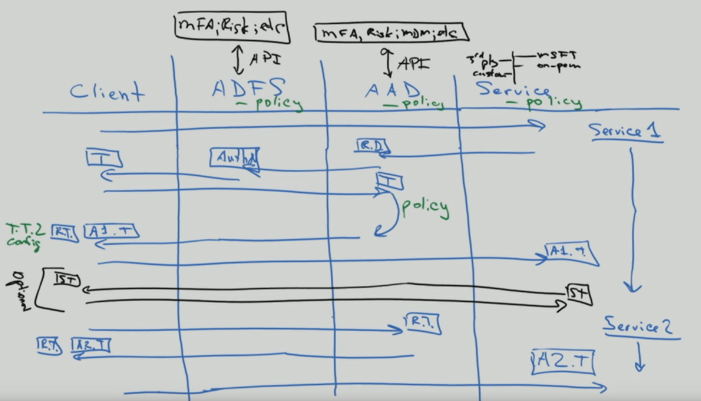

# Naar identiteit en verder - het werk van één architectTo identity and beyond—One architect's viewpoint

In dit artikel bespreekt [Alex Shteynberg,](https://www.linkedin.com/in/alex-shteynberg/)Principal Technical Architect bij Microsoft, de belangrijkste ontwerpstrategieën voor ondernemingen die Microsoft 365 en andere Microsoft-cloudservices gebruiken.In this article, [Alex Shteynberg](https://www.linkedin.com/in/alex-shteynberg/), Principal Technical Architect at Microsoft, discusses top design strategies for enterprise organizations adopting Microsoft 365 and other Microsoft cloud services.

## Over de auteurAbout the author

Ik ben een principal Technical Architect van het New York [Microsoft Technology Center.](https://www.microsoft.com/mtc?rtc=1)I'm a Principal Technical Architect at the New York [Microsoft Technology Center](https://www.microsoft.com/mtc?rtc=1). Ik werk voornamelijk met grote klanten en complexe vereisten.I mostly work with large customers and complex requirements. Mijn mening en mening zijn gebaseerd op deze interacties en zijn mogelijk niet van toepassing op elke situatie.My viewpoint and opinions are based on these interactions and may not apply to every situation. In mijn ervaring kunnen we echter alle klanten helpen met de meest complexe uitdagingen.However, in my experience, if we can help customers with the most complex challenges, we can help all customers.

Ik werk meestal met meer dan 100 klanten per jaar.I typically work with 100+ customers each year. Hoewel elke organisatie unieke kenmerken heeft, is het interessant om trends en overeenkomsten te zien.While every organization has unique characteristics, it's interesting to see trends and commonalities. Eén trend is bijvoorbeeld de interesse in verschillende bedrijfstaken voor veel klanten.For example, one trend is cross-industry interest for many customers. Een bankvertakking kan tenslotte ook een café en een communitycentrum zijn.After all, a bank branch can also be a coffee shop and a community center.

In mijn rol richt ik mij op het helpen van klanten om de beste technische oplossing te vinden om hun unieke set zakelijke doelen te bereiken.In my role, I focus on helping customers arrive at the best technical solution to address their unique set of business goals. Officieel focus ik op Identiteit, Beveiliging, Privacy en Naleving.Officially, I focus on Identity, Security, Privacy, and Compliance. Ik vind het leuk dat dit alles aanraakt wat we doen.I love the fact that these touch everything we do. Het geeft mij de mogelijkheid betrokken te zijn bij de meeste projecten.It gives me an opportunity to be involved with most projects. Zo blijf ik druk en geniet ik van deze rol.This keeps me quite busy and enjoying this role.

Ik woon in New York City (de beste!) en geniet van de diversiteit van de cultuur, het eten en de mensen (niet de verkeersdrukte).I live in New York City (the best!) and really enjoy the diversity of its culture, food, and people (not traffic). Ik ben dol op reizen als dat kan en hopen de meeste van de wereld in mijn leven te zien.I love to travel when I can and hope to see most of the world in my lifetime. Ik onderzoek momenteel een reis naar Afrika om meer te weten te komen over het wild.I'm currently researching a trip to Africa to learn about wildlife.

## UitgangspuntenGuiding principles

- **Eenvoudig is vaak beter:** u kunt (bijna) alles met technologie doen, maar het betekent niet dat u dat moet doen.**Simple is often better**: You can do (almost) anything with technology, but it doesn't mean you should. Met name in de beveiligingsruimte hebben veel klanten veel te veel oplossingen nodig.Especially in the security space, many customers overengineer solutions. Ik vind [deze video van](https://www.youtube.com/watch?v=SOQgABDSYZE) google's Stripe-vergadering leuk om dit punt te onderstrepen.I like [this video](https://www.youtube.com/watch?v=SOQgABDSYZE) from Google’s Stripe conference to underscore this point.
- **Personen, processen, technologie:** ontwerp voor [personen om](https://en.wikipedia.org/wiki/Human-centered_design) het proces te verbeteren, niet eerst technische informatie.**People, process, technology**: [Design for people](https://en.wikipedia.org/wiki/Human-centered_design) to enhance process, not tech first. Er zijn geen perfecte oplossingen.There are no "perfect" solutions. We moeten verschillende risicofactoren in balans brengen en beslissingen zullen voor elk bedrijf verschillend zijn.We need to balance various risk factors and decisions will be different for each business. Te veel klanten ontwerpen een benadering die hun gebruikers later vermijden.Too many customers design an approach that their users later avoid.
- **Focus eerst op 'waarom' en 'hoe' later:** Wees het hinderlijke, 7-yr oude kind met een miljoen vragen.**Focus on 'why' first and 'how' later**: Be the annoying 7-yr old kid with a million questions. We kunnen niet op het juiste antwoord komen als we niet weten wat de juiste vragen zijn.We can't arrive at the right answer if we don't know the right questions to ask. Veel klanten gaan ervan uit dat zaken moeten werken in plaats van het bedrijfsprobleem te definiëren.Lots of customers make assumptions on how things need to work instead of defining the business problem. Er zijn altijd meerdere paden die u kunt volgen.There are always multiple paths that can be taken.
- **Lange eind van best practices uit het verleden:** beken dat de beste werkwijzen snel veranderen.**Long tail of past best practices**: Recognize that best practices are changing at light speed. Als u Azure AD meer dan drie maanden geleden hebt bekeken, bent u waarschijnlijk verouderd.If you've looked at Azure AD more than three month ago, you are likely out of date. Alles hier kan na publicatie worden gewijzigd.Everything here is subject to change after publication. De optie 'Beste' over zes maanden is mogelijk niet hetzelfde.“Best” option today may not be the same six months from now.

## BasislijnconceptenBaseline concepts

Sla deze sectie niet over.Don't skip this section. Ik vind vaak dat ik terug moet naar deze onderwerpen, zelfs voor klanten die al jaren cloudservices gebruiken.I often find that I must step-back to these topics, even for customers who have been using cloud services for years.
Helaas, taal is geen heel nauwkeurig hulpmiddel.Alas, language isn't a precise tool. Vaak gebruiken we hetzelfde woord om verschillende concepten of andere woorden te gebruiken om hetzelfde concept te betekenen.We quite often use the same word to mean different concepts or different words to mean the same concept. Ik gebruik dit diagram vaak hieronder voor het maken van enkele basislijnterminologie en 'hiërarchiemodel'.I often use this diagram below to establish some baseline terminology and "hierarchy model."
  

  

 

Wanneer u leert zwemmen, is het beter om in het pool te beginnen en niet in het midden van de oceaan.When you learn to swim it's better to start in the pool and not in the middle of the ocean. Ik probeer technisch gezien niet nauwkeurig te zijn met dit diagram.I'm not trying to be technically accurate with this diagram. Het is een model om enkele basisconcepten te bespreken.It's a model to discuss some basic concepts.

In het diagram:In the diagram:

- Tenant = een exemplaar van Azure AD.Tenant = an instance of Azure AD. Deze staat boven aan een hiërarchie of op niveau 1 in het diagram.It is at the "top" of a hierarchy, or Level 1 in the diagram. We kunnen dit beschouwen als de "[grens](https://docs.microsoft.com/azure/active-directory/users-groups-roles/licensing-directory-independence)" waar alles anders gebeurt[(Azure AD B2B apart).](https://docs.microsoft.com/azure/active-directory/b2b/what-is-b2b)We can consider this to be the "[boundary](https://docs.microsoft.com/azure/active-directory/users-groups-roles/licensing-directory-independence)" where everything else occurs ([Azure AD B2B](https://docs.microsoft.com/azure/active-directory/b2b/what-is-b2b) aside). Alle cloudservices van Microsoft Enterprise maken deel uit van een van deze tenants.All Microsoft enterprise cloud services are part of one of these tenants. Consumentenservices zijn gescheiden.Consumer services are separate. 'Tenant' wordt in de documentatie weergegeven als Office 365-tenant, Azure-tenant, WVD-tenant, en meer."Tenant" appears in documentation as Office 365 tenant, Azure tenant, WVD tenant, and so on. Deze variaties zorgen vaak voor verwarring bij klanten.I often find these variations cause confusion for customers.
- Services/abonnementen, niveau 2 in het diagram, behoren tot één tenant.Services/subscriptions, Level 2 in the diagram, belong to one and only one tenant. De meeste SaaS-services zijn 1:1 en kunnen niet zonder migratie worden verplaatst.Most SaaS services are 1:1 and can't move without migration. Azure is anders, u kunt [facturering en/of](https://docs.microsoft.com/azure/cost-management-billing/manage/billing-subscription-transfer) een [abonnement naar](https://docs.microsoft.com/azure/active-directory/fundamentals/active-directory-how-subscriptions-associated-directory) een andere tenant verplaatsen.Azure is different, you can [move billing](https://docs.microsoft.com/azure/cost-management-billing/manage/billing-subscription-transfer) and/or a [subscription](https://docs.microsoft.com/azure/active-directory/fundamentals/active-directory-how-subscriptions-associated-directory) to another tenant. Er zijn veel klanten die Azure-abonnementen moeten verplaatsen.There are many customers that need to move Azure subscriptions. Dit heeft verschillende gevolgen.This has various implications. Objecten die buiten het abonnement aanwezig zijn, worden niet verplaatst (bijvoorbeeld toegangsbeheer op basis van rollen of Azure RBAC- en Azure AD-objecten, waaronder groepen, apps, beleidsregels, etc.).Objects that exist outside of the subscription do not move (for example, role-based access control, or Azure RBAC, and Azure AD objects including groups, apps, policies, and so on). Sommige services (zoals Azure Key Vault, Gegevenssteens, etc.)Also, some services  (such as Azure Key Vault, Data Bricks, and so on). Mier geen services zonder een goede zakelijke behoefte.Don't migrate services without a good business need. Sommige scripts die handig kunnen zijn voor migratie, [worden gedeeld op GitHub.](https://github.com/lwajswaj/azure-tenant-migration)Some scripts that can be helpful for migration are [shared on GitHub](https://github.com/lwajswaj/azure-tenant-migration).
- Een bepaalde service heeft meestal een bepaalde soort grens op het subniveau of niveau 3 (L3).A given service usually has some sort of "sublevel" boundary, or Level 3 (L3). Dit is handig om te weten voor de scheiding van beveiliging, beleid, beheer, en meer.This is useful to understand for segregation of security, policies, governance, and so on. Er is helaas geen uniforme naam die ik ken.Unfortunately, there is no uniform name that I know of. Enkele voorbeelden van namen voor L3 zijn: Azure Subscription = [resource](https://docs.microsoft.com/azure/azure-resource-manager/management/manage-resources-portal); Dynamics 365 CE = [instance](https://docs.microsoft.com/dynamics365/admin/new-instance-management); Power BI = [werkruimte](https://docs.microsoft.com/power-bi/service-create-the-new-workspaces); Power Apps = [omgeving](https://docs.microsoft.com/power-platform/admin/environments-overview); en zo verder.Some examples names for L3 are: Azure Subscription = [resource](https://docs.microsoft.com/azure/azure-resource-manager/management/manage-resources-portal); Dynamics 365 CE = [instance](https://docs.microsoft.com/dynamics365/admin/new-instance-management); Power BI = [workspace](https://docs.microsoft.com/power-bi/service-create-the-new-workspaces); Power Apps = [environment](https://docs.microsoft.com/power-platform/admin/environments-overview); and so on.
- Niveau 4 is waar de werkelijke gegevens zich opslaan.Level 4 is where the actual data lives. Dit 'gegevensvlak' is een complex onderwerp.This 'data plane' is a complex topic. Sommige services maken gebruik van Azure AD voor RBAC, andere niet.Some services are using Azure AD for RBAC, others are not. Ik bespreekt het even als we bij de delegatieonderwerpen zijn.I'll discuss it a bit when we get to delegation topics.

Enkele andere concepten waar ik veel klanten (en Microsoft-werknemers) van vind, zijn onder meer:Some additional concepts that I find many customers (and Microsoft employees) are confused about or have questions about include the following:

- Iedereen kan [zonder](https://docs.microsoft.com/azure/active-directory/fundamentals/active-directory-access-create-new-tenant) kosten veel tenants [maken.](https://azure.microsoft.com/pricing/details/active-directory/)Anyone can [create](https://docs.microsoft.com/azure/active-directory/fundamentals/active-directory-access-create-new-tenant) many tenants at [no cost](https://azure.microsoft.com/pricing/details/active-directory/). U hebt een service binnen deze service niet nodig.You do not need a service provisioned within it. Ik heb er tientallen.I have dozens. Elke tenantnaam is uniek in de wereldwijde cloudservice van Microsoft (met andere woorden: twee tenants mogen niet dezelfde naam hebben).Each Tenant name is unique in Microsoft's worldwide cloud service (in other words, no two tenants can have the same name). Ze hebben allemaal de indeling van TenantName.onmicrosoft.com.They all are in the format of TenantName.onmicrosoft.com. Er zijn ook processen die tenants automatisch[(onmanaged tenants) maken.](https://docs.microsoft.com/azure/active-directory/users-groups-roles/directory-self-service-signup)There are also processes that create Tenants automatically ([unmanaged tenants](https://docs.microsoft.com/azure/active-directory/users-groups-roles/directory-self-service-signup)). Dit kan bijvoorbeeld gebeuren wanneer een gebruiker zich voor een enterprise-service meldt met een e-maildomein dat niet in een andere tenant aanwezig is.For example, this can occur when a user signs up for an enterprise service with an email domain that does not exist in any other tenant.
- In een beheerde tenant kunnen veel [DNS-domeinen](https://docs.microsoft.com/azure/active-directory/fundamentals/add-custom-domain) in de tenant worden geregistreerd.In a managed tenant, many [DNS domains](https://docs.microsoft.com/azure/active-directory/fundamentals/add-custom-domain) can be registered in it. Hiermee wordt de naam van de oorspronkelijke tenant niet gewijzigd.This doesn't change the original tenant name. Het is op dit moment niet eenvoudig om de naam van een tenant te wijzigen (anders dan migratie).There is currently no easy way to rename a tenant (other than migration). Hoewel de naam van de tenant technisch gezien niet kritiek is tegenwoordig, kunnen sommigen dit beperkend vinden.Although the tenant name is technically not critical these days, some may find this to be limiting.
- Reserveer een tenantnaam voor uw organisatie, zelfs als u nog niet van plan bent om services te implementeren.You should reserve a tenant name for your organization even if you are not yet planning to deploy any services. Anders kan iemand het van u af halen en is er geen eenvoudig proces om het terug te nemen (hetzelfde probleem als dns-namen).Otherwise somebody can take it from you and there is no simple process to take it back (same problem as DNS names). Ik hoor dit te vaak van klanten.I hear this way too often from customers. Wat de naam van uw tenant moet zijn, is ook een discussieonderwerp.What your tenant name should be is a debate topic as well.
- Als u eigenaar bent van DNS-naamruimten, moet u deze allemaal aan uw tenant(s) toevoegen.If you own DNS namespace(s), you should add all of these to your tenant(s). Anders zou er een [onmanagede tenant met](https://docs.microsoft.com/azure/active-directory/users-groups-roles/directory-self-service-signup) deze naam kunnen worden aangeslagen, waardoor de tenant [niet kan worden beheerd.](https://docs.microsoft.com/azure/active-directory/users-groups-roles/domains-admin-takeover)Otherwise one could create an [unmanaged tenant](https://docs.microsoft.com/azure/active-directory/users-groups-roles/directory-self-service-signup) with this name, which then causes disruption to [make it managed](https://docs.microsoft.com/azure/active-directory/users-groups-roles/domains-admin-takeover).
- DNS-naamruimte (zoals contoso.com) kan bij één tenant horen.DNS namespace (such as contoso.com) can belong to one and only one Tenant. Dit heeft gevolgen voor verschillende scenario's (bijvoorbeeld het delen van een e-maildomein tijdens een fusie of overname, etc.).This has implications for various scenarios (for example, sharing an email domain during a merger or acquisition, and so on). Er is een manier om een DNS-sub (zoals div.contoso.com) te registreren in een andere tenant, maar dat moet u vermijden.There is a way to register a DNS sub (such as div.contoso.com) in a different tenant, but that should be avoided. Als u een domeinnaam op het hoogste niveau registreert, wordt ervan uitgegaan dat alle subdomeinen deel uitmaken van dezelfde tenant.By registering a top-level domain name, all subdomains are assumed to belong to the same tenant. In scenario's met meerdere tenants (zie hieronder) zou ik normaal gesproken een andere domeinnaam op het hoogste niveau gebruiken (zoals contoso.ch of ch-contoso.com).In multi-tenant scenarios (see below) I would normally recommend using another top-level domain name (such as contoso.ch or ch-contoso.com).
- Wie moet 'eigenaar' zijn van een tenant?Who should "own" a tenant? Ik zie vaak klanten die niet weten wie de eigenaar is van hun tenant.I often see customers that do not know who currently owns their tenant. Dit is een grote rode vlag.This is a big red flag. Bel zo snel mogelijk met Microsoft Ondersteuning.Call Microsoft support ASAP. Even problematisch is wanneer een service-eigenaar (vaak een Exchange-beheerder) is aangewezen voor het beheren van een tenant.Just as problematic is when a service owner (often an Exchange administrator) is designated to manage a tenant. De tenant bevat in de toekomst alle services die u mogelijk wilt gebruiken.The tenant will contain all services that you may want in the future. De tenant-eigenaar moet een groep zijn die kan beslissen of alle cloudservices in een organisatie moeten worden ingeschakeld.The tenant owner should be a group that can make decision for enablement of all cloud services in an organization. Een ander probleem is dat een groep tenanteigenaars wordt gevraagd alle services te beheren.Another problem is when a tenant owner group is asked to manage all services. De schaal is niet groot voor grote organisaties.This doesn't scale for large organizations.
- Er is geen concept van een sub-/super-tenant.There is no concept of a sub/super tenant. Om een of andere reden blijft deze myth zich herhalen.For some reason, this myth keeps repeating itself. Dit geldt ook [voor B2C-tenants van Azure AD.](https://docs.microsoft.com/azure/active-directory-b2c/)This applies to [Azure AD B2C](https://docs.microsoft.com/azure/active-directory-b2c/) tenants as well. Ik hoor te vaak 'Mijn B2C-omgeving staat in mijn XYZ-tenant' of 'Hoe verplaats ik mijn Azure-tenant naar mijn Office 365-tenant?'I hear too many times, "My B2C environment is in my XYZ Tenant," or "How do I move my Azure tenant into my Office 365 tenant?"
- Dit document is voornamelijk gericht op de commerciële wereldwijde cloud, omdat dit is wat de meeste klanten gebruiken.This document mostly focuses on the commercial worldwide cloud as this is what most customers are using. Soms is het handig om te weten over [soevereine wolken.](https://docs.microsoft.com/azure/active-directory/develop/authentication-national-cloud)It sometimes useful to know about [sovereign clouds](https://docs.microsoft.com/azure/active-directory/develop/authentication-national-cloud). Soevereine clouds hebben aanvullende gevolgen om te bespreken welke buiten het bereik voor deze discussie vallen.Sovereign clouds have additional implications to discuss which are out of scope for this discussion.

## BasislijnidentiteitsonderwerpenBaseline identity topics

Er is veel documentatie over Het identiteitsplatform van Microsoft: Azure Active Directory (Azure AD).There is much documentation about Microsoft's identity platform – Azure Active Directory (Azure AD). Voor degenen die nog maar net beginnen, voelt dit vaak overweldigend.For those who are just starting, it often feels overwhelming. Zelfs nadat u erover hebt geleerd, kan het lastig zijn om voortdurend innovatie en veranderingen te behouden.Even after you learn about it, keeping up with constant innovation and change can be challenging. In mijn interacties met klanten vind ik vaak dat ik dienst moet doen als 'vertaler' tussen zakelijke doelen en 'Goed, beter, beste' benaderingen om deze (en menselijke 'klippen' voor deze onderwerpen aan te pakken).In my customer interactions I often find myself serving as "translator" between business goals and "Good, Better, Best" approaches to address these (and human "cliff notes" for these topics). Er is zelden een perfect antwoord en de 'juiste' beslissing is een balans tussen verschillende risicofactoren.There's rarely a perfect answer and the "right" decision is a balance of various risk factors. Hieronder vindt u enkele veelvoorkomende vragen en verwarrende zaken die ik vaak met klanten bespreekt.Below are some of the common questions and confusion areas I tend to discuss with customers.

### InrichtingProvisioning

Azure AD lost niet op bij een gebrek aan beheermodel in uw identiteits wereld!Azure AD does not solve for lack of governance in your identity world! [Identiteitsbeheer](https://docs.microsoft.com/azure/active-directory/governance/identity-governance-overview) moet een kritiek element zijn, onafhankelijk van cloudbeslissingen.[Identity governance](https://docs.microsoft.com/azure/active-directory/governance/identity-governance-overview) should be a critical element independent of any cloud decisions. De beheervereisten veranderen in de tijd, daarom is het een programma en niet een hulpmiddel.Governance requirements change over time, which is why it is a program and not a tool.

[Azure AD Connect](https://docs.microsoft.com/azure/active-directory/hybrid/whatis-azure-ad-connect) versus [Microsoft Identity Manager](https://docs.microsoft.com/microsoft-identity-manager/microsoft-identity-manager-2016) (MIM) versus iets anders (derden of aangepast)?[Azure AD Connect](https://docs.microsoft.com/azure/active-directory/hybrid/whatis-azure-ad-connect) vs. [Microsoft Identity Manager](https://docs.microsoft.com/microsoft-identity-manager/microsoft-identity-manager-2016) (MIM) vs. something else (third party or custom)? Bespaar uzelf nu en in de toekomst een hoop kop en ga aan de hand van Azure AD Connect.Save yourself a lot of headache now and in the future and go with Azure AD Connect. Dit hulpprogramma biedt allerlei soorten smarts om specifieke klantconfiguraties en continue innovaties aan te pakken.There are all kinds of smarts in this tool to address peculiar customer configurations and ongoing innovations.

Sommige rand gevallen die leiden tot een complexere architectuur:Some edge cases that may drive towards a more complex architecture:

- Ik heb meerdere AD-forests zonder netwerkverbinding tussen deze forests.I have multiple AD forests without network connectivity between these. Er is een nieuwe optie met de [naam Cloud provisioning.](https://docs.microsoft.com/azure/active-directory/cloud-provisioning/what-is-cloud-provisioning)There is a new option called [Cloud Provisioning](https://docs.microsoft.com/azure/active-directory/cloud-provisioning/what-is-cloud-provisioning).
- Ik heb geen Active Directory en wil het ook niet installeren.I don't have Active Directory, nor do I want to install it. Azure AD Connect kan worden geconfigureerd voor [synchronisatie vanuit LDAP](https://docs.microsoft.com/azure/active-directory/hybrid/plan-hybrid-identity-design-considerations-tools-comparison) (partner is mogelijk vereist).Azure AD Connect can be configures to [sync from LDAP](https://docs.microsoft.com/azure/active-directory/hybrid/plan-hybrid-identity-design-considerations-tools-comparison) (partner may be required).
- Ik moet dezelfde objecten inrichten voor meerdere tenants.I need to provision the same objects to multiple tenants. Dit wordt technisch gezien niet ondersteund, maar is afhankelijk van de definitie van 'hetzelfde'.This isn't technically supported but depends on definition of "same."

Moet ik standaardsynchronisatieregels aanpassen[(filterobjecten,](https://docs.microsoft.com/azure/active-directory/hybrid/how-to-connect-sync-configure-filtering)kenmerken wijzigen, [alternatieve aanmeldings-id,](https://docs.microsoft.com/azure/active-directory/hybrid/plan-connect-userprincipalname)en meer)? Should I customize default synchronization rules ([filter objects](https://docs.microsoft.com/azure/active-directory/hybrid/how-to-connect-sync-configure-filtering), [change attributes](https://docs.microsoft.com/azure/active-directory/hybrid/reference-connect-sync-attributes-synchronized), [alternate login ID](https://docs.microsoft.com/azure/active-directory/hybrid/plan-connect-userprincipalname), and so on)? Vermijd het!Avoid it! Een identiteitsplatform is net zo waardevol als de services die het gebruiken.An identity platform is only as valuable as the services that use it. U kunt allerlei typen configuraties maken, maar als u deze vraag wilt beantwoorden, moet u kijken wat de gevolgen zijn voor toepassingen.While you can do all kinds of nutty configurations, to answer this question you need to look at the impact on applications. Als u objecten met e-mail filtert, is de gal voor onlineservices onvolledig. als de toepassing afhankelijk is van specifieke kenmerken, kan het filteren van deze kenmerken onvoorspelbare gevolgen hebben. en zo verder.If you filter mail-enabled objects, then the GAL for online services will be incomplete; if the application relies on specific attributes, filtering these will have unpredictable impact; and so on. Het is geen beslissing van het identiteitsteam.It's not an identity team decision.

XYZ SaaS ondersteunt Just-in-Time (JIT)-inrichting. Waarom moet ik synchroniseren?XYZ SaaS supports Just-in-Time (JIT) provisioning, why are you requiring me to synchronize? Zie het bovenstaande.See above. Veel toepassingen hebben profielinformatie nodig voor functionaliteit.Many applications need "profile" information for functionality. U kunt geen gal hebben als niet alle objecten met e-mail beschikbaar zijn.You can't have a GAL if all mail-enabled objects aren't available. Hetzelfde geldt voor [gebruikers provisioning](https://docs.microsoft.com/azure/active-directory/app-provisioning/user-provisioning) in toepassingen die zijn geïntegreerd met Azure AD.Same applies to [user provisioning](https://docs.microsoft.com/azure/active-directory/app-provisioning/user-provisioning) in applications integrated with Azure AD.

### VerificatieAuthentication

[Wachtwoord-hashsynchronisatie](https://docs.microsoft.com/azure/active-directory/hybrid/how-to-connect-password-hash-synchronization) versus [Pass Through-verificatie](https://docs.microsoft.com/azure/active-directory/hybrid/how-to-connect-pta-how-it-works) (PTA) versus [federatie.](https://docs.microsoft.com/azure/active-directory/hybrid/how-to-connect-fed-compatibility)[Password hash sync](https://docs.microsoft.com/azure/active-directory/hybrid/how-to-connect-password-hash-synchronization) (PHS) vs. [pass-through authentication](https://docs.microsoft.com/azure/active-directory/hybrid/how-to-connect-pta-how-it-works) (PTA) vs. [federation](https://docs.microsoft.com/azure/active-directory/hybrid/how-to-connect-fed-compatibility).

Meestal is er een betrokken [discussie](https://docs.microsoft.com/azure/active-directory/hybrid/choose-ad-authn) over federatie.Usually there is a passionate [debate](https://docs.microsoft.com/azure/active-directory/hybrid/choose-ad-authn) around federation. Eenvoudiger is meestal beter en gebruik daarom PHS, tenzij u een goede reden hebt om dat niet te doen.Simpler is usually better and therefore use PHS unless you have a good reason not to. Het is ook mogelijk om verschillende verificatiemethoden te configureren voor verschillende DNS-domeinen in dezelfde tenant.It is also possible to configure different authentication methods for different DNS domains in the same tenant. 

Sommige klanten gebruiken federatie en PHS voornamelijk voor:Some customers enable federation + PHS mainly for:

- Een optie om [op terug te](https://docs.microsoft.com/azure/active-directory/hybrid/plan-migrate-adfs-password-hash-sync) vallen (voor herstel na noodherstel) als de federatieservice niet beschikbaar is.An option to [fall back](https://docs.microsoft.com/azure/active-directory/hybrid/plan-migrate-adfs-password-hash-sync) to (for disaster recovery) if the federation service isn't available.
- Extra mogelijkheden (bijvoorbeeld: [Azure AD DS)](https://docs.microsoft.com/azure/active-directory-domain-services/tutorial-configure-password-hash-sync)en beveiligingsservices (bijvoorbeeld: [gelekte referenties)](https://docs.microsoft.com/azure/active-directory/reports-monitoring/concept-risk-events#leaked-credentials)Additional capabilities (ex.: [Azure AD DS](https://docs.microsoft.com/azure/active-directory-domain-services/tutorial-configure-password-hash-sync)) and security services (ex.: [leaked credentials](https://docs.microsoft.com/azure/active-directory/reports-monitoring/concept-risk-events#leaked-credentials))
- Ondersteuning voor services in Azure die geen inzicht hebben in federatieverificatie (bijvoorbeeld [Azure-bestanden).](https://docs.microsoft.com/azure/storage/files/storage-files-active-directory-overview)Support for services in Azure that do not understand federated authentication (for example, [Azure Files](https://docs.microsoft.com/azure/storage/files/storage-files-active-directory-overview)).

Ik doorloop klanten vaak door de clientverificatiestroom om enkele misconcepten te verduidelijken.I often walk customers through client authentication flow to clarify some misconceptions. Het resultaat lijkt op de onderstaande afbeelding, die niet zo goed is als het interactieve proces om er te komen.The result looks like the picture below, which isn't as good as the interactive process of getting there.

Dit type whiteboardtekening illustreert waar beveiligingsbeleid wordt toegepast binnen de stroom van een verificatieaanvraag.This type of whiteboard drawing illustrates where security policies are applied within the flow of an authentication request. In dit voorbeeld worden beleidsregels die worden afgedwongen via Active Directory Federation Service (AD FS), toegepast op de eerste serviceaanvraag, maar niet op de volgende serviceaanvragen.In this example, policies enforced through Active Directory Federation Service (AD FS) are applied to the first service request, but not subsequent service requests. Dit is ten minste één reden om beveiligingsbesturingselementen zo veel mogelijk naar de cloud te verplaatsen.This is at least one reason to move security controls to the cloud as much as possible.

We hebben de droom  van eenmalige aanmelding (SSO) al zo lang gehad als ik me kan herinneren.We've been chasing the dream of [single sign-on](https://docs.microsoft.com/azure/active-directory/manage-apps/what-is-single-sign-on) (SSO) for as long as I can remember. Sommige klanten denken dit te kunnen bereiken door de 'juiste' federatieprovider (STS) te kiezen.Some customers believe they can achieve this by choosing the "right" federation (STS) provider. Azure AD kan aanzienlijk helpen bij [het inschakelen van SSO-mogelijkheden,](https://docs.microsoft.com/azure/active-directory/manage-apps/plan-sso-deployment) maar geen STS is magische.Azure AD can help significantly to [enable SSO](https://docs.microsoft.com/azure/active-directory/manage-apps/plan-sso-deployment) capabilities, but no STS is magical. Er zijn te veel 'verouderde' verificatiemethoden die nog worden gebruikt voor essentiële toepassingen.There are too many "legacy" authentication methods that are still used for critical applications. Veel van deze [scenario's kunnen worden uitgebreid](https://docs.microsoft.com/azure/active-directory/saas-apps/tutorial-list) met Azure AD met partneroplossingen.Extending Azure AD with [partner solutions](https://docs.microsoft.com/azure/active-directory/saas-apps/tutorial-list) can address many of these scenarios. Eenmalige aanmelding is een strategie en een reis.SSO is a strategy and a journey. U komt er alleen als u standaarden [voor toepassingen gaat gebruiken.](https://docs.microsoft.com/azure/active-directory/develop/v2-app-types)You can't get there without moving towards [standards for applications](https://docs.microsoft.com/azure/active-directory/develop/v2-app-types). Gerelateerd aan dit onderwerp is een reis [naar](https://docs.microsoft.com/azure/active-directory/authentication/concept-authentication-passwordless) wachtwoordloze verificatie, die ook geen magische antwoord heeft.Related to this topic is a journey to [passwordless](https://docs.microsoft.com/azure/active-directory/authentication/concept-authentication-passwordless) authentication, which also doesn't have a magical answer.

[Meervoudige verificatie (Multi-Factor Authentication,](https://docs.microsoft.com/azure/active-directory/authentication/concept-mfa-howitworks) MFA) is vandaag[(hier voor](https://techcommunity.microsoft.com/t5/azure-active-directory-identity/your-pa-word-doesn-t-matter/ba-p/731984) meer) essentieel.[Multi-factor authentication](https://docs.microsoft.com/azure/active-directory/authentication/concept-mfa-howitworks) (MFA) is essential today ([here](https://techcommunity.microsoft.com/t5/azure-active-directory-identity/your-pa-word-doesn-t-matter/ba-p/731984) for more). Voeg er een [analyse van gebruikersgedrag aan](https://docs.microsoft.com/azure/active-directory/authentication/tutorial-risk-based-sspr-mfa) toe en je hebt een oplossing die de meeste veelvoorkomende cyberaanvallen voorkomt.Add to it [user behavior analytics](https://docs.microsoft.com/azure/active-directory/authentication/tutorial-risk-based-sspr-mfa) and you have a solution that prevents most common cyber-attacks. Zelfs consumentenservices willen MFA vereisen.Even consumer services are moving to require MFA. Toch ontmoet ik nog steeds veel klanten die geen gebruik willen maken van moderne [verificatiemethoden.](https://docs.microsoft.com/microsoft-365/enterprise/hybrid-modern-auth-overview)Yet, I still meet with many customers who don't want to move to [modern authentication](https://docs.microsoft.com/microsoft-365/enterprise/hybrid-modern-auth-overview) approaches. Het grootste argument dat ik hoor, is dat dit van invloed is op gebruikers en oudere toepassingen.The biggest argument I hear is that it will impact users and legacy applications. Soms kan een goede start helpen om de overstap te maken : Exchange Online [heeft de wijzigingen aangekondigd.](https://techcommunity.microsoft.com/t5/exchange-team-blog/basic-auth-and-exchange-online-february-2020-update/ba-p/1191282)Sometimes a good kick might help customers move along - Exchange Online [announced changes](https://techcommunity.microsoft.com/t5/exchange-team-blog/basic-auth-and-exchange-online-february-2020-update/ba-p/1191282). Er zijn  nu veel Azure AD-rapporten beschikbaar om klanten te helpen bij deze overgang.Lots of Azure AD [reports](https://docs.microsoft.com/azure/active-directory/fundamentals/concept-fundamentals-block-legacy-authentication) are now available to help customers with this transition.

### AutorisatieAuthorization

Per [Wikipedia](https://en.wikipedia.org/wiki/Authorization)is "to authorize" het definiëren van een toegangsbeleid.Per [Wikipedia](https://en.wikipedia.org/wiki/Authorization), "to authorize" is to define an access policy. Veel personen zien het als de mogelijkheid om toegangsbesturingselementen voor een object (bestand, service, etc.) te definiëren.Many people look at it as the ability to define access controls to an object (file, service, and so on). In de huidige wereld van cyberaanvallen ontwikkelt dit concept zich snel naar een dynamisch beleid dat kan reageren op verschillende bedreigingsvectoren en snel de toegangsbesturingselementen hierop kan aanpassen.In the current world of cyber threats, this concept is rapidly evolving to a dynamic policy that can react to various threat vectors and quickly adjust access controls in response to these. Als ik bijvoorbeeld vanaf een ongebruikelijke locatie toegang tot mijn bankrekening krijg, krijg ik extra bevestigingsstappen.For example, if I access my bank account from an unusual location, I get additional confirmation steps. Om dit te kunnen aanpakken, moeten we niet alleen rekening houden met het beleid zelf, maar ook met het ecosysteem voor bedreigingsdetectie en signaal correlatiemethodiek.To approach this, we need to consider not just the policy itself but the ecosystem of threat detection and signal correlation methodologies.

De beleidsen engine van Azure AD wordt geïmplementeerd met behulp van [beleidsregels voor voorwaardelijke toegang.](https://docs.microsoft.com/azure/active-directory/conditional-access/overview)The policy engine of Azure AD is implemented using [Conditional Access policies](https://docs.microsoft.com/azure/active-directory/conditional-access/overview). Dit systeem is afhankelijk van gegevens uit diverse andere systemen voor bedreigingsdetectie om dynamische beslissingen te nemen.This system depends on information from a variety of other threat detection systems to make dynamic decisions. Een eenvoudige weergave zou er als volgt uit zien:A simple view would be something like the following illustration:

Als u al deze signalen combineert, is er een dynamisch beleid zoals dit:Combining all these signals together allows for dynamic policies like these:

- Als er een bedreiging wordt gedetecteerd op uw apparaat, wordt uw toegang tot gegevens alleen beperkt tot internet, zonder dat u deze kunt downloaden.If a threat is detected on your device, your access to data will be reduced to web only without the ability to download.
- Als u een ongebruikelijk grote hoeveelheid gegevens downloadt, wordt alles wat u downloadt versleuteld en beperkt.If you are downloading an unusually high volume of data, anything you download will be encrypted and restricted.
- Als u toegang krijgt tot een service vanaf een onmand apparaat, wordt u geblokkeerd voor zeer gevoelige gegevens, maar hebt u toegang tot niet-beperkte gegevens zonder de mogelijkheid om deze naar een andere locatie te kopiëren.If you access a service from an unmanaged device, you'll be blocked from highly sensitive data but allowed to access non-restricted data without the ability to copy it to another location.

Als u akkoord gaat met deze uitgebreide autorisatiedefinitie, moet u aanvullende oplossingen implementeren.If you agree with this expanded definition of authorization, then you need to implement additional solutions. Welke oplossingen u implementeert, is afhankelijk van hoe dynamisch het beleid moet zijn en van welke bedreigingen u prioriteit wilt geven.Which solutions you implement will depend on how dynamic you want the policy to be and which threats you want to prioritize. Enkele voorbeelden van dergelijke systemen zijn:Some examples of such systems are:

- [Azure AD Identity ProtectionAzure AD Identity Protection](https://docs.microsoft.com/azure/active-directory/identity-protection/) 
- [Microsoft Defender for IdentityMicrosoft Defender for Identity](https://docs.microsoft.com/azure-advanced-threat-protection/)
- [Microsoft Defender for EndpointMicrosoft Defender for Endpoint](https://docs.microsoft.com/windows/security/threat-protection/microsoft-defender-atp/microsoft-defender-advanced-threat-protection)
- [Microsoft Defender voor Office 365Microsoft Defender for Office 365](https://docs.microsoft.com/microsoft-365/security/office-365-security/office-365-atp?view=o365-worldwide)
- [Microsoft Cloud App Security](https://docs.microsoft.com/cloud-app-security/) (MCAS)[Microsoft Cloud App Security](https://docs.microsoft.com/cloud-app-security/) (MCAS)
- [Microsoft 365 DefenderMicrosoft 365 Defender](https://docs.microsoft.com/microsoft-365/security/mtp/microsoft-threat-protection?view=o365-worldwide)
- [Microsoft IntuneMicrosoft Intune](https://docs.microsoft.com/mem/intune/)
- [Microsoft Information Protection](https://docs.microsoft.com/microsoft-365/compliance/protect-information?view=o365-worldwide) (MIP)[Microsoft Information Protection](https://docs.microsoft.com/microsoft-365/compliance/protect-information?view=o365-worldwide) (MIP)
- [Azure SentinelAzure Sentinel](https://docs.microsoft.com/azure/sentinel/)

Naast Azure AD hebben verschillende services en toepassingen natuurlijk hun eigen specifieke autorisatiemodellen.Of course, in addition to Azure AD, various services and applications have their own specific authorization models. Sommige van deze onderwerpen worden later besproken in de sectie delegatie.Some of these are discussed later in the delegation section.

### ControleAudit

Azure AD heeft uitgebreide [controle- en rapportagemogelijkheden.](https://docs.microsoft.com/azure/active-directory/reports-monitoring/)Azure AD has detailed [audit and reporting](https://docs.microsoft.com/azure/active-directory/reports-monitoring/) capabilities. Meestal is dit echter niet de enige bron van informatie die nodig is om beveiligingsbeslissingen te nemen.However, this is usually not the only source of information needed to make security decisions. Zie de sectie Delegatie voor meer informatie over dit onderwerp.See more discussion on this in the delegation section.

## Er is geen ExchangeThere's no Exchange

Geen paniek!Don't Panic! Dit betekent niet dat Exchange wordt afgeschaft (of SharePoint, etc.).This does not mean Exchange is being deprecated (or SharePoint, and so on). Het is nog steeds een kernservice.It is still a core service. Wat ik wil zeggen, is dat technologieproviders al enige tijd gebruikservaringen (UX) gebruiken die onderdeel zijn van meerdere services.What I mean is, for quite some time now, technology providers have been transitioning user experiences (UX) to encompass components of multiple services. In Microsoft 365 is een eenvoudig voorbeeld['moderne](https://support.office.com/article/Attach-files-or-insert-pictures-in-Outlook-email-messages-BDFAFEF5-792A-42B1-9A7B-84512D7DE7FC)bijlagen' waarbij bijlagen bij e-mail worden opgeslagen in SharePoint Online of OneDrive voor Bedrijven.In Microsoft 365, a simple example is "[modern attachments](https://support.office.com/article/Attach-files-or-insert-pictures-in-Outlook-email-messages-BDFAFEF5-792A-42B1-9A7B-84512D7DE7FC)" where attachments to email are stored in SharePoint Online or OneDrive for Business.

Als u naar de Outlook-client kijkt, ziet u veel services die zijn 'verbonden' als onderdeel van deze ervaring, niet alleen Exchange.Looking at the Outlook client you can see many services that are "connected" as part of this experience, not just Exchange. Dit geldt voor Azure AD, Microsoft Search, Apps, Profiel, Compliance en Office 365-groepen.This includes Azure AD, Microsoft Search, Apps, Profile, compliance, and Office 365 groups. 

Lees meer [over Microsoft Fluid Framework voor](https://techcommunity.microsoft.com/t5/microsoft-365-blog/microsoft-ignite-blog-microsoft-fluid-framework-preview/ba-p/978268) een preview van komende mogelijkheden.Read about [Microsoft Fluid Framework](https://techcommunity.microsoft.com/t5/microsoft-365-blog/microsoft-ignite-blog-microsoft-fluid-framework-preview/ba-p/978268) for preview of upcoming capabilities. In de voorbeeldweergave kan ik Teams-gesprekken rechtstreeks in Outlook lezen en beantwoorden.In preview now, I can read and reply to Teams conversations directly in Outlook. De [Teams-client](https://products.office.com/microsoft-teams/download-app) is in feite een van de prominente voorbeelden van deze strategie.In fact, the [Teams client](https://products.office.com/microsoft-teams/download-app) is one of the more prominent examples of this strategy. 

Over het algemeen wordt het steeds moeilijker om een duidelijke lijn te trekken tussen Office 365 en andere services in Microsoft Clouds.Overall, it's becoming harder to draw a clear line between Office 365 and other services in Microsoft clouds. Ik bekijk het als een groot voordeel voor klanten, omdat ze kunnen profiteren van totale innovatie voor alles wat we doen, zelfs als ze één onderdeel gebruiken.I view it as a great benefit to customers since they can benefit from total innovation across everything we do even if they use one component. Dit heeft grote gevolgen voor veel klanten.Pretty cool and has far reaching implications for many customers.

Tegenwoordig vind ik dat veel IT-groepen van klanten zijn gestructureerd rond 'producten'.Today, I find many customer IT groups are structured around "products." Het is logisch voor een on-premises wereld, omdat u voor elk specifiek product een expert nodig hebt.It's logical for an on-premises world since you need an expert for each specific product. Ik ben echter helemaal blij dat ik een Active Directory- of Exchange-database nooit meer hoef op te sporen als deze services naar de cloud zijn verplaatst.However, I am totally happy that I don't have to debug an Active Directory or Exchange database ever again as these services have moved to the cloud. Automatisering (het type cloud) verwijdert bepaalde terugkerende handmatige taken (kijk wat er is gebeurd).Automation (which cloud kind of is) removes certain repetitive manual jobs (look what happened to factories). Deze zijn echter vervangen door complexere vereisten om inzicht te krijgen in interactie tussen services, invloed, bedrijfsbehoeften, en dergelijke.However, these are replaced with more complex requirements to understand cross-services interaction, impact, business needs, and so on. Als u bereid bent om [te leren,](https://docs.microsoft.com/learn/)zijn er grote mogelijkheden die mogelijk worden gemaakt door de cloudtransformatie.If you are willing to [learn](https://docs.microsoft.com/learn/), there are great opportunities enabled by cloud transformation. Voordat ik over technologie ga, praat ik vaak met klanten over het beheren van de veranderingen in IT-vaardigheden en teamstructuren.Before jumping into technology, I often talk to customers about managing change in IT skills and team structures.

Voor alle SharePoint-fan-personen en ontwikkelaars hoeft u niet meer te vragen: 'Hoe kan ik XYZ in SharePoint Online doen?'To all SharePoint fan-people and developers, please stop asking "How can I do XYZ in SharePoint online?" Gebruik [Power Automate](https://docs.microsoft.com/power-automate/) (of Flow) voor werkstromen, het is een veel krachtiger platform.Use [Power Automate](https://docs.microsoft.com/power-automate/) (or Flow) for workflow, it is a much more powerful platform. Gebruik [Azure Bot Framework om](https://docs.microsoft.com/azure/bot-service/?view=azure-bot-service-4.0) een betere UX te maken voor uw itemlijst van 500 K.Use [Azure Bot Framework](https://docs.microsoft.com/azure/bot-service/?view=azure-bot-service-4.0) to create a better UX for your 500-K item list. Gebruik [Microsoft Graph in](https://developer.microsoft.com/graph/) plaats van CSOM.Start using [Microsoft Graph](https://developer.microsoft.com/graph/) instead of CSOM. [Microsoft Teams](https://docs.microsoft.com/MicrosoftTeams/Teams-overview) bevat SharePoint, maar ook nog een hele wereld.[Microsoft Teams](https://docs.microsoft.com/MicrosoftTeams/Teams-overview) includes SharePoint but also a world more. Er zijn nog veel meer voorbeelden die ik kan noemen.There are many other examples I can list. Er is een groot en geweldig universum.There's a vast and wonderful universe out there. Open de deur en [begin te verkennen.](https://docs.microsoft.com)Open the door and [start exploring](https://docs.microsoft.com).

De overige algemene impact heeft te maken met het nalevingsgebied.The other common impact is in the compliance area. Deze benadering voor meerdere services is een benadering die een groot aantal nalevingsbeleidsregels volledig met elkaar verwart.This cross-services approach seems to completely confuse many compliance policies. Ik blijf organisaties zien met deze status: 'Ik wil alle e-mailcommunicatie naar een eDiscovery-systeem in het logboek bewaren'.I keep seeing organizations that state, "I need to journal all email communications to an eDiscovery system." Wat betekent dit wanneer e-mail niet meer alleen e-mail is maar een venster in andere services?What does this really mean when email is no longer just email but a window into other services? Office 365 heeft een uitgebreide benadering voor [naleving,](https://docs.microsoft.com/microsoft-365/compliance/)maar veranderende personen en processen zijn vaak veel moeilijker dan technologie.Office 365 has a comprehensive approach for [compliance](https://docs.microsoft.com/microsoft-365/compliance/), but changing people and processes are often much more difficult than technology.

Er zijn veel andere personen en gevolgen voor het proces.There are many other people and process implications. Naar mijn mening is dit een kritiek en onderbediscusseerd gebied.In my opinion, this is a critical and under-discussed area. Misschien meer informatie in een ander artikel.Perhaps more in another article.

## Opties tenantstructuurTenant structure options

### Eén tenant versus meerdere tenantsSingle tenant vs. multi-tenant

Over het algemeen hebben de meeste klanten slechts één productie-tenant.In general, most customers should have only one production tenant. Er zijn veel redenen waarom meerdere tenants moeilijk zijn (door ze een [Bing-zoekopdracht](https://www.bing.com/search?q=office%20365%20multiple%20tenants)te geven) of deze [whitepaper te lezen.](https://aka.ms/multi-tenant-user)There are many reasons why multiple tenants are challenging (give it a [Bing search](https://www.bing.com/search?q=office%20365%20multiple%20tenants)) or read this [whitepaper](https://aka.ms/multi-tenant-user). Tegelijkertijd hebben veel zakelijke klanten met mij een andere (kleine) tenant voor it-leren, testen en experimenteren.At the same time, many enterprise customers I work with have another (small) tenant for IT learning, testing, and experimentation. Azure-toegang tussen tenants wordt gemakkelijker gemaakt met [Azure Lighthouse.](https://azure.microsoft.com/services/azure-lighthouse/)Cross-tenant Azure access is made easier with [Azure Lighthouse](https://azure.microsoft.com/services/azure-lighthouse/). Office 365 en vele andere SaaS-services hebben limieten voor scenario's tussen tenants.Office 365 and many other SaaS services have limits for cross-tenant scenarios. Er is veel om rekening mee te houden in B2B-scenario's voor [Azure AD.](https://docs.microsoft.com/azure/active-directory/b2b/what-is-b2b)There's a lot to consider in [Azure AD B2B](https://docs.microsoft.com/azure/active-directory/b2b/what-is-b2b) scenarios.

Veel klanten hebben meerdere productieten tenants na een fusie en overname (M&A) en willen samenvoegen.Many customers end-up with multiple production tenants after a merger and acquisition (M&A) and want to consolidate. Dat is niet eenvoudig en vereist microsoft Consulting Services (MCS) of een partner plus software van derden.Today that's not simple and would require Microsoft Consulting Services (MCS) or a partner plus third-party software. Er is doorlopend technisch werk nodig om in de toekomst verschillende scenario's met klanten met meerdere tenants aan te pakken.There's ongoing engineering work to address various scenarios with multi-tenant customers in the future.

Sommige klanten kiezen voor meer dan één tenant.Some customers choose to go with more than one tenant. Dit moet een zeer voorzichtige beslissing zijn en bijna altijd op het goede werk.This should be a very careful decision and almost always business reason driven! Enkele voorbeelden:Some examples include the following:

- Een bedrijfsstructuur van het type bedrijf, waarin eenvoudig samenwerken tussen verschillende entiteiten niet is vereist en er sprake is van sterk administratief en andere isolatiebehoeften.A holding type company structure where easy collaboration between different entities is not required and there is strong administrative and other isolation needs.
- Na een aanschaf wordt besloten om twee entiteiten gescheiden te houden.After an acquisition, a business decision is made to keep two entities separate.
- Het gebruik van een omgeving van een klant die de productieomgeving van de klant niet wijzigt.Simulation of a customer's environment that does not change the customer's production environment. 
- De ontwikkeling van software voor klanten.Development of software for customers.

In deze scenario's met meerdere tenants willen klanten vaak de configuratie voor tenants hetzelfde houden of over configuratiewijzigingen en aanpassingen rapporteren.In these multi-tenant scenarios, customers often want to keep some configuration the same across tenants, or report on configuration changes and drifts. Dit betekent vaak dat u moet overgeschakeld van handmatige wijzigingen naar configuratie als code.This often means moving from manual changes to configuration as code. De ondersteuning voor Microsoft Doornen biedt een workshop voor dit soort vereisten op basis van dit openbare [https://Microsoft365dsc.com](https://Microsoft365dsc.com) IP-adres:Microsoft Premiere support offers a workshop for these types of requirements based on this public IP: [https://Microsoft365dsc.com](https://Microsoft365dsc.com).

### Multi-GeoMulti-Geo

Voor [Multi-Geo](https://docs.microsoft.com/microsoft-365/enterprise/microsoft-365-multi-geo) of niet voor Multi-Geo is dat de vraag.To [Multi-Geo](https://docs.microsoft.com/microsoft-365/enterprise/microsoft-365-multi-geo) or not to Multi-Geo, that is the question. Met Office 365 Multi-Geo kunt u gegevens inrichten en opslaan in de  geografische locaties die u hebt gekozen om te voldoen aan de vereisten voor gegevensopslag.With Office 365 Multi-Geo, you can provision and store data at rest in the geo locations that you've chosen to meet [data residency](https://docs.microsoft.com/microsoft-365/enterprise/o365-data-locations) requirements. Er zijn veel misconcepten over deze mogelijkheid.There are many misconceptions about this capability. Houd het volgende in gedachten:Keep the following in mind:

- Dit levert geen prestatievoordelen op.It does not to provide performance benefits. Dit kan de prestaties slechter maken als [het netwerkontwerp](https://aka.ms/office365networking) niet juist is.It could make performance worse if the [network design](https://aka.ms/office365networking) is not correct. Laat apparaten 'sluiten' bij het Microsoft-netwerk, niet per se uw gegevens.Get devices "close" to the Microsoft network, not necessarily to your data.
- Het is geen oplossing voor [avg-naleving.](https://www.microsoft.com/trust-center/privacy/gdpr-overview)It is not a solution for [GDPR compliance](https://www.microsoft.com/trust-center/privacy/gdpr-overview). De AVG richt zich niet op het opslaan van gegevens of opslaglocaties.GDPR does not focus on data sovereignty or storage locations. Er zijn andere nalevingskaders voor.There are other compliance frameworks for that.
- De delegatie van beheer (zie hieronder) of informatiebarrières worden [niet opgelost.](https://docs.microsoft.com/microsoft-365/compliance/information-barriers)It does not solve delegation of administration (see below) or [information barriers](https://docs.microsoft.com/microsoft-365/compliance/information-barriers).
- Het is niet hetzelfde als de meervoudige tenant en hiervoor zijn extra gebruikers [inrichtingswerkstromen](https://github.com/MicrosoftDocs/azure-docs-pr/blob/master/articles/active-directory/hybrid/how-to-connect-sync-feature-preferreddatalocation.md) vereist.It is not the same as multi-tenant and requires additional [user provisioning](https://github.com/MicrosoftDocs/azure-docs-pr/blob/master/articles/active-directory/hybrid/how-to-connect-sync-feature-preferreddatalocation.md) workflows.
- Uw tenant [(Azure](https://docs.microsoft.com/microsoft-365/enterprise/moving-data-to-new-datacenter-geos) AD) wordt niet naar een andere geografie verplaatst.It does not [move your tenant](https://docs.microsoft.com/microsoft-365/enterprise/moving-data-to-new-datacenter-geos) (your Azure AD) to another geography. 

## BeheerdelegeringDelegation of administration

In de meeste grote organisaties is een scheiding van taken en toegangsbeheer op basis van rollen (RBAC) noodzakelijk.In most large organizations, separation of duties and role-based access control (RBAC) is a necessary reality. Ik ga mijn excuses van tevoren aanbieden.I am going to apologize ahead of time. Dit is niet zo eenvoudig als sommige klanten willen.This is not as simple as some customers want it to be. Klant-, juridische, nalevings- en andere vereisten verschillen en conflicteren soms over de hele wereld.Customer, legal, compliance, and other requirements are different and sometimes conflicting around the world. Eenvoud en flexibiliteit liggen vaak tegenover elkaar.Simplicity and flexibility are often on opposite sides of each other. Be begrijp me niet verkeerd, we kunnen hier iets beters aan doen.Don't get me wrong, we can do a better job at this. Er zijn (en zullen) aanzienlijke verbeteringen zijn geweest in de tijd.There have been (and will be) significant improvements over time. Ga naar uw lokale [Microsoft Technology Center om](https://www.microsoft.com/mtc) het model uit te werken dat past bij uw bedrijfsvereisten zonder dat u 379230 documenten moet lezen.Visit your local [Microsoft Technology Center](https://www.microsoft.com/mtc) to work out the model that fits your business requirements without reading 379230 docs! Hier ga ik me richten op wat u moet bedenken en niet waarom het op deze manier gebeurt.Here, I'll focus on what you should think about and not why it is this way. Hieronder vindt u vijf verschillende gebieden waar u enkele veelvoorkomende vragen kunt plannen.Below are five different areas to plan for and some of the common questions I've encountered.

### Azure AD- en Microsoft 365-beheercentraAzure AD and Microsoft 365 admin centers

Er is een lange en groeiende lijst met [ingebouwde rollen.](https://docs.microsoft.com/azure/active-directory/users-groups-roles/directory-assign-admin-roles)There's a long and growing list of [built-in roles](https://docs.microsoft.com/azure/active-directory/users-groups-roles/directory-assign-admin-roles). Elke rol bestaat uit een lijst met rollenmachtigingen die zijn gegroepeerd zodat specifieke acties kunnen worden uitgevoerd.Each role consists of a list of role permissions grouped together to allow specific actions to be performed. U kunt deze machtigingen zien op het tabblad Beschrijving binnen elke rol.You can see these permissions in the "Description" tab inside each role. U kunt ook een beter leesbare versie van deze versies bekijken in het Microsoft 365-beheercentrum.Alternatively you can see a more human readable version of these in the Microsoft 365 Admin Center. De definities voor ingebouwde rollen kunnen niet worden gewijzigd.The definitions for built-in roles cannot be modified. Over het algemeen groeper ik deze in drie categorieën:I generally, group these into three categories:

- **Globale beheerder:** deze 'alle krachtige' rol moet sterk worden [beschermd,](https://docs.microsoft.com/microsoft-365/enterprise/protect-your-global-administrator-accounts) net als in andere systemen.**Global administrator**: This "all powerful" role should be [highly protected](https://docs.microsoft.com/microsoft-365/enterprise/protect-your-global-administrator-accounts) just like you would in other systems. Gebruikelijke aanbevelingen zijn: geen permanente toewijzing en gebruik Azure AD Privileged Identity Management (PIM); sterke verificatie; en zo verder.Typical recommendations include: no permanent assignment and use Azure AD Privileged Identity Management (PIM); strong authentication; and so on. Het is ook mogelijk dat u met deze rol niet standaard toegang krijgt tot alles.Interestingly, this role doesn't give you access to everything by default. Meestal zie ik verwarring over toegang tot naleving en Azure-toegang, die later worden besproken.Typically, I see confusion about compliance access and Azure access, discussed later. Deze rol kan echter altijd toegang toewijzen aan andere services in de tenant.However, this role can always assign access to other services in the tenant. 
- **Specifieke servicebeheerders:** sommige services (Exchange, SharePoint, Power BI, e.d.) gebruiken beheerrollen op hoog niveau van Azure AD.**Specific service admins**: Some services (Exchange, SharePoint, Power BI, and so on) consume high-level administration roles from Azure AD. Dit is niet in alle services consistent en er zijn meer servicespecifieke rollen die later worden besproken.This isn't consistent across all services and there are more service-specific roles discussed later.
- **Functioneel:** er is een lange (en groeiende) lijst met rollen die zijn gericht op specifieke bewerkingen (gast genodigde, etc.).**Functional**: There is a long (and growing) list of roles focused on specific operations (guest inviter, and so on). Regelmatig worden er meer toegevoegd op basis van de behoeften van de klant.Periodically, more of these are added based on customer needs.

Het is niet mogelijk om alles te delegeren (hoewel de tussenruimte afneemt), wat betekent dat de globale beheerdersrol soms moet worden gebruikt.It is not possible to delegate everything (although the gap is decreasing), which means the Global admin role would need to be used sometimes. Bij deze rol moet rekening worden gehouden met configuratie als code en automatisering, in plaats van het lidmaatschap van personen.Configuration-as-code and automation should be considered instead of people membership of this role.

**Opmerking:** Het Microsoft 365-beheercentrum heeft een gebruiksvriendelijkere interface, maar heeft een subset van mogelijkheden in vergelijking met de Azure AD-beheerervaring.**Note**: The Microsoft 365 admin center has a more user-friendly interface but has subset of capabilities compared to the Azure AD admin experience. Beide portals gebruiken dezelfde rollen voor Azure AD, dus vinden wijzigingen plaats op dezelfde plaats.Both portals use the same Azure AD roles, so changes are occurring in the same place. Tip: als u een op identiteitsbeheer gerichte gebruikersinterface voor beheerders wilt zonder al het onbelangrijke Azure, gebruik dan [https://aad.portal.azure.com](https://aad.portal.azure.com) .Tip: if you want an identity-management focused admin UI without all the Azure clutter, use [https://aad.portal.azure.com](https://aad.portal.azure.com). 

Wat staat er in de naam?What's in the name? Ga niet uit van de naam van de rol.Don't make assumptions from the name of the role. Taal is niet erg nauwkeurig.Language is not a very precise tool. Het doel is om bewerkingen te definiëren die moeten worden gedelegeerd voordat wordt gekeken welke rollen er nodig zijn.The goal should be to define operations that need to be delegated before looking at what roles are needed. Als u iemand toevoegt aan de rol 'Beveiligingslezer', zien ze niet overal de beveiligingsinstellingen.Adding somebody to the "Security Reader" role does not make them see security settings across everything.

De mogelijkheid om aangepaste [rollen te maken](https://docs.microsoft.com/azure/active-directory/users-groups-roles/roles-custom-overview) is een veelvoorkomende vraag.The ability to create [custom roles](https://docs.microsoft.com/azure/active-directory/users-groups-roles/roles-custom-overview) is a common question. Dit is momenteel beperkt in Azure AD (zie hieronder), maar zal in de tijd steeds meer mogelijkheden krijgen.This is limited in Azure AD today (see below) but will grow in capabilities over time. Ik denk dat deze van toepassing zijn op functies in Azure AD en die mogelijk niet 'omlaag' gaan in het hiërarchiemodel (hierboven besproken).I think of these as applicable to functions in Azure AD and may not span "down" the hierarchy model (discussed above). Wanneer ik 'aangepast' ga doen, ga ik meestal terug naar de principal van 'eenvoudig is beter'.Whenever I deal with "custom," I tend to go back to my principal of "simple is better."

Een andere veelvoorkomende vraag is de mogelijkheid om het bereik van rollen te bepalen tot een subset van een adreslijst.Another common question is ability to scope roles to a subset of a directory. Een voorbeeld is zoiets als 'Helpdeskbeheerder alleen voor gebruikers in de EU'.One example is something like "Helpdesk Administrator for users in EU only." [Administratieve eenheden](https://docs.microsoft.com/azure/active-directory/users-groups-roles/directory-administrative-units) (AU) zijn bedoeld om dit probleem op te pakken.[Administrative Units](https://docs.microsoft.com/azure/active-directory/users-groups-roles/directory-administrative-units) (AU) are intended to address this. Net als hierboven denk ik dat deze van toepassing zijn op functies in Azure AD en mogelijk niet 'omlaag' gaan.Like above, I think of these as applicable to functions in Azure AD and may not span "down." Bepaalde rollen hebben natuurlijk geen zin in het bereik (globale beheerders, servicebeheerders, etc.).Of course, certain roles don't make sense to scope (global admins, service admins, and so on).

Voor al deze rollen is direct lidmaatschap vereist (of dynamische toewijzing als u [Azure AD PIM gebruikt).](https://docs.microsoft.com/azure/active-directory/privileged-identity-management/)Today, all these roles require direct membership (or dynamic assignment if you use [Azure AD PIM](https://docs.microsoft.com/azure/active-directory/privileged-identity-management/)). Dit betekent dat klanten deze rechtstreeks in Azure AD moeten beheren en dat deze niet kunnen worden gebaseerd op het lidmaatschap van een beveiligingsgroep.This means customers must manage these directly in Azure AD and these cannot be based on a security group membership. Ik ben geen fan van het maken van scripts om deze te beheren, omdat het met verhoogde rechten moet worden uitgevoerd.I'm not a fan of creating scripts to manage these as it would need to run with elevated rights. Ik adviseer over het algemeen API-integratie met processystemen zoals ServiceNow of het gebruik van partnerbeheerhulpprogramma's zoals Saviynt.I generally recommend API integration with process systems like ServiceNow or using partner governance tools like Saviynt. Er is een technisch werk aan de hand om dit in de weg te staan.There's engineering work going on to address this over time.

Ik heb [Azure AD PIM een paar](https://docs.microsoft.com/azure/active-directory/privileged-identity-management/) keer vermeld.I mentioned [Azure AD PIM](https://docs.microsoft.com/azure/active-directory/privileged-identity-management/) a few times. Er is een bijbehorende MICROSOFT Identity Manager -oplossing (MIM) [Privileged Access Management](https://docs.microsoft.com/microsoft-identity-manager/pam/privileged-identity-management-for-active-directory-domain-services) (PAM) voor on-premises besturingselementen.There is a corresponding Microsoft Identity Manager (MIM) [Privileged Access Management](https://docs.microsoft.com/microsoft-identity-manager/pam/privileged-identity-management-for-active-directory-domain-services) (PAM) solution for on-premises controls. U kunt ook de paws-werkstations [(Privileged Access Workstations)](https://docs.microsoft.com/windows-server/identity/securing-privileged-access/privileged-access-workstations) en [Azure AD Identity Governance bekijken.](https://docs.microsoft.com/azure/active-directory/governance/identity-governance-overview)You might also want to look at [Privileged Access Workstations](https://docs.microsoft.com/windows-server/identity/securing-privileged-access/privileged-access-workstations) (PAWs) and [Azure AD Identity Governance](https://docs.microsoft.com/azure/active-directory/governance/identity-governance-overview). Er zijn ook verschillende hulpprogramma's van derden waarmee u op tijd, net voldoende en dynamisch rolverheffing kunt inschakelen.There are various third-party tools as well, which can enable just-in-time, just-enough, and dynamic role elevation. Dit maakt meestal deel uit van een grotere discussie over het beveiligen van een omgeving.This is usually part of a larger discussion for securing an environment. 

Soms is het nodig om een externe gebruiker toe te voegen aan een rol (zie het gedeelte met meerdere tenants hierboven).Sometimes scenarios call for adding an external user to a role (see the multi-tenant section, above). Dit werkt prima.This works just fine. [Azure AD B2B](https://docs.microsoft.com/azure/active-directory/b2b/) is een ander groot en leuk onderwerp om klanten door te lopen, misschien in een ander artikel.[Azure AD B2B](https://docs.microsoft.com/azure/active-directory/b2b/) is another large and fun topic to walk customers through, perhaps in another article.

### Beveiligings- en compliancecentrum (SCC)Security and Compliance Center (SCC)

[Machtigingen in het Office 365-beveiligings- & compliancecentrum](https://docs.microsoft.com/microsoft-365/security/office-365-security/permissions-in-the-security-and-compliance-center) zijn een verzameling 'rollengroepen', die afzonderlijk en verschillen van de rollen van Azure AD.[Permissions in the Office 365 Security & Compliance Center](https://docs.microsoft.com/microsoft-365/security/office-365-security/permissions-in-the-security-and-compliance-center) are a collection of "role groups", which are separate and distinct from Azure AD roles. Dit kan verwarrend zijn omdat sommige van deze rollengroepen dezelfde naam hebben als Azure AD-rollen (bijvoorbeeld Beveiligingslezer), maar ze kunnen wel een ander lidmaatschap hebben.This can be confusing because some of these role groups have the same name as Azure AD roles (for example, Security Reader), yet they can have different membership. Ik geef de voorkeur aan het gebruik van Azure AD-rollen.I prefer the use of Azure AD roles. Elke rollengroep bestaat uit een of meer 'rollen' (zie wat ik bedoel met het hergebruik van hetzelfde woord?) en leden uit Azure AD, die e-mailobjecten zijn.Each role group consists of one or more "roles" (see what I mean about reusing the same word?) and have members from Azure AD, which are email enabled objects. U kunt ook een rollengroep maken met dezelfde naam als een rol, die al dan niet deze rol bevat (vermijd deze verwarring).Also, you can create a role group with the same name as a role, which may or may not contain that role (avoid this confusion).

In de zin van deze zijn dit een ontwikkeling van het Exchange-rollengroepenmodel.In a sense, these are an evolution of the Exchange role groups model. Exchange Online heeft echter een eigen interface [voor rollengroepsbeheer.](https://docs.microsoft.com/exchange/permissions-exo)However, Exchange Online has its own [role group management](https://docs.microsoft.com/exchange/permissions-exo) interface. Sommige rollengroepen in Exchange Online worden vergrendeld en beheerd vanuit Azure AD of het &-compliancecentrum voor beveiliging, maar anderen hebben mogelijk dezelfde of vergelijkbare namen en worden beheerd in Exchange Online (wat tot verwarring leidt).Some role groups in Exchange Online are locked and managed from Azure AD or the Security & Compliance Center, but others might have the same or similar names and are managed in Exchange Online (adding to the confusion). Het is raadzaam de gebruikersinterface van Exchange Online niet te gebruiken, tenzij u een bereik nodig hebt voor Exchange-beheer.I recommend you avoid using the Exchange Online user interface unless you need scopes for Exchange management.

U kunt geen aangepaste rollen maken.You can't create custom roles. Rollen worden gedefinieerd door services die door Microsoft zijn gemaakt en worden steeds groter naarmate er nieuwe services worden geïntroduceerd.Roles are defined by services created by Microsoft and will grow as new services are introduced. Dit is in concept vergelijkbaar met [rollen die zijn gedefinieerd door toepassingen](https://docs.microsoft.com/azure/active-directory/develop/howto-add-app-roles-in-azure-ad-apps) in Azure AD.This is similar in concept to [roles defined by applications](https://docs.microsoft.com/azure/active-directory/develop/howto-add-app-roles-in-azure-ad-apps) in Azure AD. Wanneer nieuwe services zijn ingeschakeld, moeten er vaak nieuwe rollengroepen worden gemaakt om toegang te verlenen of te delegeren tot deze groepen (bijvoorbeeld [insider-risicobeheer).](https://docs.microsoft.com/microsoft-365/compliance/insider-risk-management-configure?view=o365-worldwide#step-1-required-enable-permissions-for-insider-risk-management)When new services are enabled, often new role groups need to be created in order to grant or delegate access to these (for example, [insider risk management](https://docs.microsoft.com/microsoft-365/compliance/insider-risk-management-configure?view=o365-worldwide#step-1-required-enable-permissions-for-insider-risk-management)).

Deze rollengroepen vereisen ook direct lidmaatschap en kunnen geen Azure AD-groepen bevatten.These role groups also require direct membership and cannot contain Azure AD groups. Helaas worden deze rollengroepen momenteel niet ondersteund door Azure AD PIM.Unfortunately, today these role groups are not supported by Azure AD PIM. Net zoals bij rollen in Azure AD, ben ik geneigd deze te beheren via API's of een partnerbeheerproduct zoals 'Zwaarste' of andere.Like Azure AD roles, I tend to recommend management of these through APIs or a partner governance product like Saviynt, or others.

Rollen & compliancecentrum in Microsoft 365 en u kunt deze rollengroepen niet beperken tot een subset van de omgeving (zoals dat kan met beheereenheden in Azure AD).Security & Compliance Center roles span Microsoft 365 and you can't scope these role groups to a subset of the environment (like you can with administrative units in Azure AD). Veel klanten vragen hoe ze subdelegate kunnen maken.Many customers ask how they can subdelegate. U kunt bijvoorbeeld 'alleen DLP-beleid maken voor gebruikers in de EU'.For example, "create a DLP policy only for EU users." Als u op dit moment rechten hebt voor een bepaalde functie in het beveiligings- & compliancecentrum, hebt u de rechten op alles wat wordt gedekt door deze functie in de tenant.Today, if you have rights to a specific function in the Security & Compliance Center, you have rights to everything covered by this function in the tenant. Veel beleidsregels hebben echter mogelijkheden om zich te richten op een subset van de omgeving (bijvoorbeeld 'deze labels alleen beschikbaar [maken](https://docs.microsoft.com/microsoft-365/compliance/create-sensitivity-labels#publish-sensitivity-labels-by-creating-a-label-policy) voor deze gebruikers').However, many policies have capabilities to target a subset of the environment (for example, "make these [labels](https://docs.microsoft.com/microsoft-365/compliance/create-sensitivity-labels#publish-sensitivity-labels-by-creating-a-label-policy) available only to these users"). Een correct beheer en communicatie vormen een belangrijk onderdeel om conflicten te voorkomen.Proper governance and communication are a key component to avoid conflicts. Sommige klanten kiezen ervoor om een 'configuratie als code'-benadering te implementeren om subdelegatie aan te pakken in het & compliancecentrum.Some customers choose to implement a "configuration as code" approach to address subdelegation in the Security & Compliance Center. Sommige specifieke services ondersteunen subdelegatie (zie hieronder).Some specific services support subdelegation (see below).

De besturingselementen die momenteel worden beheerd via het beveiligings &- en compliancecentrum (protection.office.com), worden gemigreerd naar twee afzonderlijke beheerportals: security.microsoft.com en compliance.microsoft.com.It's worth noting that controls currently managed through the Security & Compliance Center (protection.office.com) are in the process of being migrated to two separate admin portals: security.microsoft.com and compliance.microsoft.com. Wijziging is de enige constante.Change is the only constant!

### Service specifiekService Specific

Zoals eerder is gezegd, willen veel klanten een model voor gedetailleerdere delegatie bereiken.As stated earlier, many customers are looking to achieve a more granular delegation model. Een veelvoorkomende voorbeeld: 'XYZ-service alleen beheren voor Division X-gebruikers en -locaties' (of een andere dimensie).A common example: “Manage XYZ service only for Division X users and locations” (or some other dimension). De mogelijkheid om dit te doen is afhankelijk van elke service en is niet consistent voor de services en mogelijkheden.The ability to do this depends on each service and is not consistent across services and capabilities. Daarnaast kan elke service een afzonderlijk en uniek RBAC-model hebben.In-addition, each service may have a separate and unique RBAC model. In plaats van deze allemaal te bespreken (het duurt eeuwen), voeg ik relevante koppelingen toe voor elke service.Instead of discussing all of these (it will take forever), I am adding relevant links for each service. Dit is geen volledige lijst, maar u kunt hiermee aan de slag.This is not a complete list, but it will get you started.

- **Exchange Online** - [https://docs.microsoft.com/exchange/permissions-exo/permissions-exo](https://docs.microsoft.com/exchange/permissions-exo/permissions-exo)**Exchange Online** - [https://docs.microsoft.com/exchange/permissions-exo/permissions-exo](https://docs.microsoft.com/exchange/permissions-exo/permissions-exo) 
- **SharePoint Online** - [https://docs.microsoft.com/sharepoint/manage-site-collection-administrators](https://docs.microsoft.com/sharepoint/manage-site-collection-administrators)**SharePoint Online** - [https://docs.microsoft.com/sharepoint/manage-site-collection-administrators](https://docs.microsoft.com/sharepoint/manage-site-collection-administrators) 
- **Microsoft Teams**  -  [https://docs.microsoft.com/microsoftteams/itadmin-readiness](https://docs.microsoft.com/microsoftteams/itadmin-readiness )**Microsoft Teams** - [https://docs.microsoft.com/microsoftteams/itadmin-readiness ](https://docs.microsoft.com/microsoftteams/itadmin-readiness )
- **eDiscovery** - [https://docs.microsoft.com/microsoft-365/compliance/assign-ediscovery-permissions](https://docs.microsoft.com/microsoft-365/compliance/)**eDiscovery** - [https://docs.microsoft.com/microsoft-365/compliance/assign-ediscovery-permissions](https://docs.microsoft.com/microsoft-365/compliance/) 
  + **Machtigingen filteren**  -  [https://docs.microsoft.com/microsoft-365/compliance/permissions-filtering-for-content-search](https://docs.microsoft.com/microsoft-365/compliance/)**Permission Filtering** - [https://docs.microsoft.com/microsoft-365/compliance/permissions-filtering-for-content-search ](https://docs.microsoft.com/microsoft-365/compliance/)
  + **Nalevingsgrenzen**  -  [https://docs.microsoft.com/microsoft-365/compliance/set-up-compliance-boundaries](https://docs.microsoft.com/microsoft-365/compliance/set-up-compliance-boundaries )**Compliance Boundaries** - [https://docs.microsoft.com/microsoft-365/compliance/set-up-compliance-boundaries ](https://docs.microsoft.com/microsoft-365/compliance/set-up-compliance-boundaries )
  + **Advanced eDiscovery**  -  [https://docs.microsoft.com/microsoft-365/compliance/overview-ediscovery-20](https://docs.microsoft.com/microsoft-365/compliance/overview-ediscovery-20 )**Advanced eDiscovery** - [https://docs.microsoft.com/microsoft-365/compliance/overview-ediscovery-20 ](https://docs.microsoft.com/microsoft-365/compliance/overview-ediscovery-20 )
- **Yammer** - [https://docs.microsoft.com/yammer/manage-yammer-users/manage-yammer-admins](https://docs.microsoft.com/yammer/manage-yammer-users/manage-yammer-admins)**Yammer** - [https://docs.microsoft.com/yammer/manage-yammer-users/manage-yammer-admins](https://docs.microsoft.com/yammer/manage-yammer-users/manage-yammer-admins) 
- **Multi-geo** - [https://docs.microsoft.com/microsoft-365/enterprise/add-a-sharepoint-geo-admin](https://docs.microsoft.com/microsoft-365/enterprise/add-a-sharepoint-geo-admin)**Multi-geo** - [https://docs.microsoft.com/microsoft-365/enterprise/add-a-sharepoint-geo-admin](https://docs.microsoft.com/microsoft-365/enterprise/add-a-sharepoint-geo-admin) 
- **Dynamics 365** – [https://docs.microsoft.com/dynamics365/](https://docs.microsoft.com/dynamics365/)**Dynamics 365** – [https://docs.microsoft.com/dynamics365/](https://docs.microsoft.com/dynamics365/)  
  Opmerking: deze koppeling is naar de hoofdmap van de documentatie.Note: this link is to the root of documentation. Er zijn meerdere soorten services met variaties in het beheer-/delegeringsmodel.There are multiple types of services with variations in the admin/delegation model.
- **Power Platform**  -  [https://docs.microsoft.com/power-platform/admin/admin-documentation](https://docs.microsoft.com/power-platform/admin/admin-documentation )**Power Platform** - [https://docs.microsoft.com/power-platform/admin/admin-documentation ](https://docs.microsoft.com/power-platform/admin/admin-documentation )
  + **Power Apps**  -  [https://docs.microsoft.com/power-platform/admin/wp-security](https://docs.microsoft.com/power-platform/admin/wp-security )**Power Apps** - [https://docs.microsoft.com/power-platform/admin/wp-security ](https://docs.microsoft.com/power-platform/admin/wp-security )  
    Opmerking: er zijn meerdere typen met variaties in de beheer-/delegatiemodellen.Note: there are multiple types with variations in the admin/delegation models.
  + **Power Automate**  -  [https://docs.microsoft.com/power-automate/environments-overview-admin](https://docs.microsoft.com/power-automate/environments-overview-admin )**Power Automate** - [https://docs.microsoft.com/power-automate/environments-overview-admin ](https://docs.microsoft.com/power-automate/environments-overview-admin )
  + **Power BI**  -  [https://docs.microsoft.com/power-bi/service-admin-governance](https://docs.microsoft.com/power-bi/service-admin-governance )**Power BI** - [https://docs.microsoft.com/power-bi/service-admin-governance ](https://docs.microsoft.com/power-bi/service-admin-governance )  
Opmerking: beveiliging en delegatie van gegevensplatforms (Power BI is een onderdeel) is een complex gebied.Note: data platform security and delegation (which Power BI is a component) is a complex area.
- **MEM/Intune**  -  [https://docs.microsoft.com/mem/intune/fundamentals/role-based-access-control](https://docs.microsoft.com/mem/intune/fundamentals/role-based-access-control )**MEM/Intune** - [https://docs.microsoft.com/mem/intune/fundamentals/role-based-access-control ](https://docs.microsoft.com/mem/intune/fundamentals/role-based-access-control )
- **Microsoft Defender voor eindpunt**  -  [https://docs.microsoft.com/windows/security/threat-protection/microsoft-defender-atp/user-roles](https://docs.microsoft.com/windows/security/threat-protection/microsoft-defender-atp/user-roles )**Microsoft Defender for Endpoint** - [https://docs.microsoft.com/windows/security/threat-protection/microsoft-defender-atp/user-roles ](https://docs.microsoft.com/windows/security/threat-protection/microsoft-defender-atp/user-roles )
- **Microsoft 365 Defender** - [https://docs.microsoft.com/microsoft-365/security/mtp/mtp-permissions](https://docs.microsoft.com/microsoft-365/security/mtp/mtp-permissions)**Microsoft 365 Defender** - [https://docs.microsoft.com/microsoft-365/security/mtp/mtp-permissions](https://docs.microsoft.com/microsoft-365/security/mtp/mtp-permissions)
- **Beveiliging van Microsoft Cloud-apps** - [https://docs.microsoft.com/cloud-app-security/manage-admins](https://docs.microsoft.com/cloud-app-security/manage-admins)**Microsoft Cloud App Security** - [https://docs.microsoft.com/cloud-app-security/manage-admins](https://docs.microsoft.com/cloud-app-security/manage-admins)
- **Streamen**  -  [https://docs.microsoft.com/stream/assign-administrator-user-role](https://docs.microsoft.com/stream/assign-administrator-user-role )**Stream** - [https://docs.microsoft.com/stream/assign-administrator-user-role ](https://docs.microsoft.com/stream/assign-administrator-user-role )
- **Informatiebarrières**  -  [https://docs.microsoft.com/microsoft-365/compliance/information-barriers](https://docs.microsoft.com/microsoft-365/compliance/information-barriers )**Information barriers** - [https://docs.microsoft.com/microsoft-365/compliance/information-barriers ](https://docs.microsoft.com/microsoft-365/compliance/information-barriers )

Verder was het zoeken in Docs de laatste tijd heel [https://docs.microsoft.com/](https://docs.microsoft.com/microsoft-365/compliance/information-barriers) goed.For the rest, search in Docs has been really good lately - [https://docs.microsoft.com/](https://docs.microsoft.com/microsoft-365/compliance/information-barriers). 

### ActiviteitslogboekenActivity Logs

Office 365 heeft een [geïntegreerd auditlogboek.](https://docs.microsoft.com/microsoft-365/compliance/search-the-audit-log-in-security-and-compliance)Office 365 has a [unified audit log](https://docs.microsoft.com/microsoft-365/compliance/search-the-audit-log-in-security-and-compliance). Het is een zeer [gedetailleerd logboek,](https://docs.microsoft.com/office/office-365-management-api/office-365-management-activity-api-schema)maar lees niet te veel in de naam.It’s a very [detailed log](https://docs.microsoft.com/office/office-365-management-api/office-365-management-activity-api-schema), but don’t read too much into the name. Het bevat mogelijk niet alles wat u nodig hebt of nodig hebt voor uw behoeften op het gebied van beveiliging en naleving.It may not contain everything you want or need for your security and compliance needs. Sommige klanten zijn ook zeer geïnteresseerd in [Geavanceerde controle.](https://docs.microsoft.com/microsoft-365/compliance/advanced-audit)Also, some customers are really interested in [Advanced Audit](https://docs.microsoft.com/microsoft-365/compliance/advanced-audit).

Voorbeelden van Microsoft 365-logboeken die worden gebruikt via andere API's zijn:Examples of Microsoft 365 logs that are accessed through other APIs include the following:

- [Azure AD](https://docs.microsoft.com/azure/azure-monitor/platform/diagnostic-settings) (activiteiten die niet gerelateerd zijn aan Office 365)[Azure AD](https://docs.microsoft.com/azure/azure-monitor/platform/diagnostic-settings) (activities not related to Office 365)
- [Berichten bijhouden in ExchangeExchange Message Tracking](https://docs.microsoft.com/powershell/module/exchange/get-messagetrace)
- Bedreigings-/UEBA-systemen die hierboven zijn besproken (bijvoorbeeld Azure AD Identity Protection, Microsoft Cloud App Security, Microsoft Defender voor eindpunt, en meer)Threat/UEBA Systems discussed above (for example, Azure AD Identity Protection, Microsoft Cloud App Security, Microsoft Defender for Endpoint, and so on)
- [Microsoft-gegevensbeschermingMicrosoft information protection](https://docs.microsoft.com/microsoft-365/compliance/data-classification-activity-explorer?view=o365-worldwide)
- [Microsoft Defender for EndpointMicrosoft Defender for Endpoint](https://docs.microsoft.com/windows/security/threat-protection/microsoft-defender-atp/api-power-bi)
- [Microsoft GraphMicrosoft Graph](https://graph.microsoft.com)

Het is belangrijk om eerst alle logboekbronnen te identificeren die nodig zijn voor een beveiligings- en nalevingsprogramma.It is important to first identify all log sources needed for a security and compliance program. Houd er ook rekening mee dat verschillende logboeken verschillende bewaarlimieten per regel hebben.Also note that different logs have different on-line retention limits. 

Vanuit het beheerdelegerings perspectief hebben de meeste Activiteitenlogboeken van Microsoft 365 geen ingebouwd RBAC-model.From the admin delegation perspective, most Microsoft 365 activity logs do not have a built-in RBAC model. Als u bent machtigingen hebt om een logboek te bekijken, kunt u alles in het logboek zien.If you have permission to see a log, then you can see everything in it. Een veelvoorkomende voorbeeld van klantvereiste is: "Ik wil alleen een query kunnen uitvoeren op activiteiten van de EU-gebruikers" (of een andere dimensie).A common example of a customer requirement is: “I want to be able to query activity only for EU users” (or some other dimension). Hiervoor moeten logboeken naar een andere service worden overdraagd.To achieve this requirement, we need to transfer logs to another service. In de Microsoft-cloud wordt u aangeraden deze over te brengen naar [Azure Eerst](https://docs.microsoft.com/azure/sentinel/overview) of [Logboekanalyse.](https://docs.microsoft.com/azure/azure-monitor/learn/quick-create-workspace)In the Microsoft cloud, we recommend transferring it to either [Azure Sentinel](https://docs.microsoft.com/azure/sentinel/overview) or [Log Analytics](https://docs.microsoft.com/azure/azure-monitor/learn/quick-create-workspace). 

Diagram op hoog niveau:High level diagram:

  

Het bovenstaande diagram vertegenwoordigt ingebouwde mogelijkheden voor het verzenden van logboeken naar de Event Hub en/of Azure Storage en/of Azure Log Analytics.The diagram above represents built-in capabilities to send logs to Event Hub and/or Azure Storage and/or Azure Log Analytics. Nog niet in alle systemen is deze gebruiks klaar.Not all systems include this out-of-the-box yet. Er zijn echter andere methoden om deze logboeken naar dezelfde opslagplaats te verzenden.But there are other approaches to send these logs to the same repository. Zie bijvoorbeeld [Uw Teams beschermen met Azure Azure Azure.](https://techcommunity.microsoft.com/t5/azure-sentinel/protecting-your-teams-with-azure-sentinel/ba-p/1265761)For example, see [Protecting your Teams with Azure Sentinel](https://techcommunity.microsoft.com/t5/azure-sentinel/protecting-your-teams-with-azure-sentinel/ba-p/1265761).

Als u alle logboeken op één opslaglocatie combineert, omvat dit extra voordeel, zoals correlaties, aangepaste bewaartijden, aanvulling met gegevens die nodig zijn om het RBAC-model te ondersteunen, en dergelijke.Combining all the logs into one storage location includes added benefit, such as cross-correlations, custom retention times, augmenting with data needed to support RBAC model, and so on. Als de gegevens in dit opslagsysteem zijn opgeslagen, kunt u een Power BI-dashboard (of een ander type visualisatie) maken met een geschikt RBAC-model.Once data is in this storage system, you can create a Power BI dashboard (or another type of visualization) with an appropriate RBAC model.

Logboeken hoeft niet alleen naar één plek te worden doorgestuurd.Logs do not have to be directed to one place only. Het kan ook nuttig zijn om [Office 365-logboeken](https://docs.microsoft.com/cloud-app-security/connect-office-365-to-microsoft-cloud-app-security) te integreren met Microsoft Cloud App Security of een aangepast RBAC-model in [Power BI.](https://docs.microsoft.com/microsoft-365/admin/usage-analytics/usage-analytics?view=o365-worldwide)It might also be beneficial to integrate [Office 365 Logs with Microsoft Cloud App Security](https://docs.microsoft.com/cloud-app-security/connect-office-365-to-microsoft-cloud-app-security) or a custom RBAC model in [Power BI](https://docs.microsoft.com/microsoft-365/admin/usage-analytics/usage-analytics?view=o365-worldwide). Verschillende opslagplaatsen hebben verschillende voordelen en doelgroepen.Different repositories have different benefits and audiences.

Het is de moeite waard om te vermelden dat er een zeer uitgebreid ingebouwd analysesysteem is voor beveiliging, bedreigingen, beveiligingsproblemen, en meer in een service met de naam [Microsoft 365 Defender.](https://docs.microsoft.com/microsoft-365/security/mtp/microsoft-threat-protection?view=o365-worldwide)It's worth mentioning that there is a very rich built-in analytics system for security, threats, vulnerabilities, and so on in a service called [Microsoft 365 Defender](https://docs.microsoft.com/microsoft-365/security/mtp/microsoft-threat-protection?view=o365-worldwide).

Veel grote klanten willen deze logboekgegevens overbrengen naar een systeem van derden (bijvoorbeeld SIEM).Many large customers want to transfer this log data to a third-party system (for example, SIEM). Hiervoor zijn verschillende benaderingen beschikbaar, maar over het algemeen [zijn Azure Event Hub](https://docs.microsoft.com/azure/azure-monitor/platform/stream-monitoring-data-event-hubs) en [Graph](https://docs.microsoft.com/graph/security-integration) een goed uitgangspunt.There are different approaches for this, but in-general [Azure Event Hub](https://docs.microsoft.com/azure/azure-monitor/platform/stream-monitoring-data-event-hubs) and [Graph](https://docs.microsoft.com/graph/security-integration) are good starting points.

### AzureAzure

Mij wordt vaak gevraagd of er een manier is om rollen met hoge bevoegdheden te scheiden tussen Azure AD, Azure en SaaS (bijvoorbeeld: globale beheerder voor Office 365, maar niet Azure).I am often asked if there is a way to separate high-privilege roles between Azure AD, Azure, and SaaS (ex.: Global Administrator for Office 365 but not Azure).  Niet echt.Not really.  Architectuur met meerdere tenants is nodig als een volledige beheerscheiding is vereist, maar die de complexiteit wel aanzienlijk complex [maakt](https://aka.ms/multi-tenant-user) (zie boven).Multi-tenant architecture is needed if complete administrative separation is required, but that adds significant [complexity](https://aka.ms/multi-tenant-user) (see above). Al deze services maken deel uit van dezelfde beveiligings-/identiteitsgrens (kijk naar het bovenstaande hiërarchiemodel).All these services are part of the same security/identity boundary (look at the hierarchy model above).  

Het is belangrijk om de relaties tussen verschillende services in dezelfde tenant te begrijpen.It is important to understand relationships between various services in the same tenant. Ik werk met veel klanten die bedrijfsoplossingen bouwen voor Azure, Office 365 en Power Platform (en vaak ook on-premises cloudservices en externe cloudservices).I am working with many customers that are building business solutions that span Azure, Office 365, and Power Platform (and often also on-premises and third-party cloud services). Een veelvoorkomende voorbeeld:One common example:

1. Ik wil samenwerken aan een set documenten/afbeeldingen/enzovoort (Office 365)I want to collaborate on a set of documents/images/etc (Office 365)
2. Elk van deze verzenden via een goedkeuringsproces (Power Platform)Send each one of them through an approval process (Power Platform)
3.  Nadat alle onderdelen zijn goedgekeurd, kunt u deze samenstellen tot een geïntegreerde Microsoft [Graph API](https://docs.microsoft.com/azure/active-directory/develop/microsoft-graph-intro) (Deliverable(s) die u het best kunt gebruiken.After all components are approved, assemble these into a unified deliverable(s) (Azure) [Microsoft Graph API](https://docs.microsoft.com/azure/active-directory/develop/microsoft-graph-intro) is your best friend for these.  Niet onmogelijk, maar aanzienlijk ingewikkelder om een oplossing te ontwerpen die meerdere [tenants omspant.](https://docs.microsoft.com/azure/active-directory/develop/single-and-multi-tenant-apps)Not impossible, but significantly more complex to design a solution spanning [multiple tenants](https://docs.microsoft.com/azure/active-directory/develop/single-and-multi-tenant-apps).

Azure Role-Based Access Control (RBAC) maakt fijnac-toegangsbeheer voor Azure mogelijk.Azure Role-Based Access Control (RBAC) enables fine-grained access management for Azure. Met toegangsstructuur kunt u de toegang tot resources beheren door gebruikers de minste machtigingen te verlenen die nodig zijn om hun taken uit te voeren.Using RBAC, you can manage access to resources by granting users the fewest permissions needed to perform their jobs. Details van dit document zijn buiten het bereik, maar zie Wat is toegangsbeheer op basis van rollen in Azure voor meer informatie over toegangsbeheer op basis van [rollen?](https://docs.microsoft.com/azure/role-based-access-control/overview)Details are out of scope for this document, but for more information on RBAC, see [What is role-based access control (RBAC) in Azure?](https://docs.microsoft.com/azure/role-based-access-control/overview) Beheerstructuur is belangrijk, maar maakt slechts deel uit van de beheeroverwegingen voor Azure.RBAC is important but only part of the governance considerations for Azure. [Cloud Adoption Framework](https://docs.microsoft.com/azure/cloud-adoption-framework/govern/) is een goed uitgangspunt voor meer informatie.[Cloud Adoption Framework](https://docs.microsoft.com/azure/cloud-adoption-framework/govern/) is a great starting point to learn more. Ik vind het leuk hoe mijn vriend AndresInet klanten stap voor stap door diverse onderdelen laat lopen om de aanpak te bepalen.I like how my friend, Andres Ravinet walks customers step by step though various components to decide on the approach. De weergave op hoog niveau voor verschillende elementen (niet zo goed als het proces om het werkelijke klantmodel te krijgen) is zoiets als:High-level view for various elements (not as good as the process to get to actual customer model) is something like this:

Zoals u in de bovenstaande afbeelding ziet, moeten veel andere services worden beschouwd als onderdeel van het ontwerp (bijvoorbeeld: Azure-beleid, [Azure Blauwdrukken,](https://docs.microsoft.com/azure/governance/blueprints/overview) [Beheergroepen,](https://docs.microsoft.com/azure/governance/management-groups/)etc.).As you can see from above picture, many other services should be considered as part of the design (ex.: [Azure Policies](https://docs.microsoft.com/azure/governance/policy/overview), [Azure Blueprints](https://docs.microsoft.com/azure/governance/blueprints/overview), [Management Groups](https://docs.microsoft.com/azure/governance/management-groups/), and so on).

## ConclusieConclusion

Gestart als een kort overzicht, maar het duurt langer dan verwacht.Started as a short summary, ended-up longer than I expected.  Ik hopen dat u er alles aan kunt doen om een delegatiemodel voor uw organisatie te maken.I hope you are now ready to venture into a deep see of creating delegation model for your organization.  Dit gesprek is zeer gebruikelijk bij klanten.This conversation is very common with customers. Er is geen model dat voor iedereen werkt.There is no one model that works for everyone. Wacht op een paar geplande verbeteringen van Microsoft Engineering voordat u gemeenschappelijke patronen documenteert die we bij klanten zien.Waiting for a few planned improvements from Microsoft engineering before documenting common patterns we see across customers. Ondertussen kunt u samen met uw Microsoft-accountteam een bezoek brengen aan het [dichtstbijzijnde Microsoft Technology Center.](https://www.microsoft.com/mtc)In the meantime, you can work with your Microsoft account team to arrange a visit to the nearest [Microsoft Technology Center](https://www.microsoft.com/mtc).  Tot daar!See you there!
