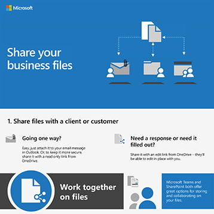

# Microsoft 365 infographics voor uw gebruikersMicrosoft 365 infographics for your users

Deze infographics vertegenwoordigen best practices voor het werken en samenwerken in Microsoft 365.These infographics represent best practices for working and collaborating in Microsoft 365. Deel ze met uw gebruikers om ervoor te zorgen dat ze profiteren van veilige opslag en delen van bestanden, gezamenlijke vergaderingen houden en meer.Share them with your users to help ensure that they are taking advantage of secure storage and sharing for files, holding collaborative meetings, and more.

Meer [downloadbare Office-infographics vindt](https://support.microsoft.com/office/great-ways-to-work-with-office-6fe70269-b9a4-4ef0-a96e-7a5858b3bd5a) u op de [Microsoft 365-trainingssite.](https://support.microsoft.com/training)Find more [downloadable Office infographics](https://support.microsoft.com/office/great-ways-to-work-with-office-6fe70269-b9a4-4ef0-a96e-7a5858b3bd5a) on the [Microsoft 365 training](https://support.microsoft.com/training) site.

## BeveiligingstipsSecurity tips

Download deze infographic met beveiligingstips voor de leden van uw team, of uw team nu een bedrijf of non-profitorganisatie is, zoals een politieke campagne:Download this infographic with security tips for the members of your team - whether your team is a business or nonprofit organization, such as a political campaign:

| ItemItem | BeschrijvingDescription |
|:-----|:-----|
|   [Downloaden als PDF](../campaigns/downloads/M365CampaignsWhatCanUsersDoToSecure.pdf)  \  [Downloaden als een PowerPoint](../campaigns/downloads/M365CampaignsWhatCanUsersDoToSecure.pptx)[Download as a PDF](../campaigns/downloads/M365CampaignsWhatCanUsersDoToSecure.pdf) \ [Download as a PowerPoint](../campaigns/downloads/M365CampaignsWhatCanUsersDoToSecure.pptx)| Deel deze best practices voor het beveiligen van de gegevens van uw organisatie.Share these best practices for keeping your organization's information secure. Deze infographic is gemaakt ter ondersteuning van het personeel van politieke campagnes, omdat deze zijn gericht op geavanceerde hackers.This infographic was created to support the staff of political campaigns because these are targeted by sophisticated hackers. U bent van harte welkom om de PowerPoint-infographic te gebruiken om deze infographic aan te passen voor uw eigen organisatie.You are welcome to use the PowerPoint to customize this infographic for your own organization. Gerelateerd artikel: [Hoe de beveiligingsaanbevelingen voor Microsoft 365 van invloed zijn op uw gebruikers](../campaigns/m365-campaigns-users.md)Related article: [How the security recommendations for Microsoft 365 affect your users](../campaigns/m365-campaigns-users.md)|

## Uw zakelijke bestanden delenShare your business files

Download een infographic om snel een overzicht te krijgen van manieren om uw zakelijke bestanden te delen:Download an infographic to get a quick overview of ways to share your business files:
  
| ItemItem | BeschrijvingDescription |
|:-----|:-----|
|   [Downloaden als PDF](https://go.microsoft.com/fwlink/?linkid=2079435)  \  [Downloaden als een PowerPoint](https://go.microsoft.com/fwlink/?linkid=2079438)[Download as a PDF](https://go.microsoft.com/fwlink/?linkid=2079435) \ [Download as a PowerPoint](https://go.microsoft.com/fwlink/?linkid=2079438) | Gebruik deze best practices wanneer u zakelijke bestanden deelt en samenwerkt, zodat u uw gegevens veilig en beveiligd kunt houden.Use these best practices when you share and collaborate on business files so you can keep your information secure and protected. Gerelateerd artikel: [Overzicht van het delen van zakelijke bestanden](../business-video/overview-file-sharing.md)Related article: [Overview of sharing business files](../business-video/overview-file-sharing.md)|

## Onlinevergaderingen hostenHost online meetings

Download een infographic om snel een overzicht te krijgen van het deelnemen aan of het hosten van een onlinevergadering met Microsoft Teams:Download an infographic to get a quick overview of how to join or host an online meeting with Microsoft Teams:

| ItemItem | BeschrijvingDescription |
|:-----|:-----|
|   [Downloaden als PDF](https://go.microsoft.com/fwlink/?linkid=2078712)  \  [Downloaden als een PowerPoint](https://go.microsoft.com/fwlink/?linkid=2079515)[Download as a PDF](https://go.microsoft.com/fwlink/?linkid=2078712) \ [Download as a PowerPoint](https://go.microsoft.com/fwlink/?linkid=2079515) | Een korte inleiding over het hosten of deelnemen aan een onlinevergadering met Microsoft Teams.A quick introduction to how to host or join an online meeting with Microsoft Teams. Gerelateerd artikel: [Onlinevergaderingen voor uw bedrijf hosten](../business-video/overview-online-meetings.md)Related article: [Host online meetings for your business](../business-video/overview-online-meetings.md)|

## Werken vanaf elke locatieWork from anywhere

Download een infographic om tips te krijgen voor werken vanaf elke locatie:Download an infographic to get tips for working from anywhere:

| ItemItem | BeschrijvingDescription |
|:-----|:-----|
|   [Downloaden als PDF](https://go.microsoft.com/fwlink/?linkid=2079451)  \  [Downloaden als een PowerPoint](https://go.microsoft.com/fwlink/?linkid=2079455)[Download as a PDF](https://go.microsoft.com/fwlink/?linkid=2079451) \ [Download as a PowerPoint](https://go.microsoft.com/fwlink/?linkid=2079455) | Zie tips voor het instellen van uw mobiele apparaten zodat u overal kunt werken.See tips for how to set up your mobile devices to allow you to work from anywhere. Gerelateerd artikel: [Overal werken](../business-video/work-from-anywhere.md)Related article: [Work from anywhere](../business-video/work-from-anywhere.md)|

## Klanten enquête met formulierenSurvey customers with Forms

Download een infographic om erachter te komen hoe u klanten (intern of extern) kunt enquêten met Microsoft Forms:Download an infographic to find out how to survey customers (internal or external) with Microsoft Forms:

| ItemItem | BeschrijvingDescription |
|:-----|:-----|
|   [Downloaden als PDF](https://go.microsoft.com/fwlink/?linkid=2079526)  \  [Downloaden als een PowerPoint](https://go.microsoft.com/fwlink/?linkid=2079446)[Download as a PDF](https://go.microsoft.com/fwlink/?linkid=2079526) \ [Download as a PowerPoint](https://go.microsoft.com/fwlink/?linkid=2079446) | Gebruik Microsoft Forms om erachter te komen wat uw klanten vinden.Use Microsoft Forms to find out what your customers think. Gerelateerd artikel: [Gegevens verzamelen met Microsoft Forms](https://support.microsoft.com/topic/collect-information-with-microsoft-forms-a55d6e0d-04f6-45b8-b05f-b141b8ecb4d5)Related article: [Collect information with Microsoft Forms](https://support.microsoft.com/topic/collect-information-with-microsoft-forms-a55d6e0d-04f6-45b8-b05f-b141b8ecb4d5)|
