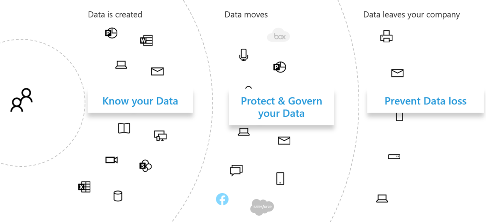

# Privacyrisico's voor gegevens beoordelen en gevoelige items identificeren met Microsoft 365

Het beoordelen van de privacyregels en risico's voor uw organisatie is een belangrijke eerste stap voordat u gerelateerde verbeteringsacties implementeert, waaronder acties die kunnen worden uitgevoerd met Microsoft 365 functies en services.

## Mogelijk toepasselijke privacyregels voor gegevens

Zie de [Microsoft Services Trust Portal](https://servicetrust.microsoft.com/) en de reeks artikelen over de Algemene verordening gegevensbescherming [(AVG)](/compliance/regulatory/gdpr)en andere materialen over de regelgeving die u in uw branche of regio kunt gebruiken voor een goede verwijzing naar het bredere regelgevingskader voor privacyregels voor gegevens.

### AVG

De AVG, de meest bekende en geciteerde van de privacyregels voor gegevens, regelt het verzamelen, opslaan, verwerken en delen van persoonsgegevens die betrekking hebben op een geïdentificeerde of identificeerbare natuurlijke persoon die een ingezetene is van de Europese Unie (EU).

Artikel 4 van de AVG:

- 'persoonlijke gegevens': alle gegevens met betrekking tot een geïdentificeerde of identificeerbare natuurlijke persoon ('betrokkene'); een identificeerbare natuurlijke persoon is iemand die direct of indirect kan worden geïdentificeerd, met name door te verwijzen naar een id, zoals een naam, een identificatienummer, locatiegegevens, een online-id of een of meer factoren die specifiek zijn voor de fysieke, fysiologische, genetische, mentale, economische, culturele of sociale identiteit van die natuurlijke persoon.

### ISO 27001

Naleving van andere standaarden, zoals ISO 27001, is ook door verschillende Europese toezichthoudende autoriteiten gezien als een geldige proxy of intent in het personen-, proces- en technologiespectrum. De standaarden die worden opgegeven voor overlapping en naleving van iso-27001-gestuurde beveiligingsmechanismen, kunnen in bepaalde omstandigheden worden beschouwd als een proxy die aan bepaalde privacyverplichtingen voldoet.

### Andere privacyregels voor gegevens

Andere belangrijke privacyregels voor gegevens bevatten ook vereisten voor de verwerking van persoonsgegevens.

In de Verenigde Staten zijn dit de California Consumer Protection Act[(CTPA),](/compliance/regulatory/ccpa-faq)HIPAA-HITECH (Amerikaanse privacywet voor gezondheidszorg) en de Graham Leach Bliley Act (GLBA). Aanvullende staatsspecifieke voorschriften zijn ook van toepassing of in ontwikkeling.

Over de hele wereld zijn er nog meer voorbeelden van de National GDPR Implementation Act (BDSG) van Duitsland, de Brazil Data Protection Act (LGPD) en vele andere.

## Toewijzing van regelgeving aan Microsoft 365 categorieën voor technisch beheer

Veel van de privacygerelateerde voorschriften voor gegevens hebben overlappende vereisten, dus u moet begrijpen aan welke voorschriften ze zijn onderworpen voordat u een technisch beheerschema ontwikkelt.

Voor latere verwijzingen in de artikelen van deze algemene oplossing bevat deze tabel fragmenten uit een steekproef van privacyregels voor gegevens.

| Regelgeving | Artikel/sectie | Fragment | Toepasselijke categorieën voor technisch beheer |
|:-------|:-----|:-------|:-------|
| AVG | Artikel 5, lid 1, onder f) | Persoonsgegevens worden op een wijze verwerkt die de juiste beveiliging van de persoonsgegevens garandeert, met inbegrip van bescherming tegen ongeoorloofde of onrechtmatige verwerking en tegen onbedoeld verlies, vernieling of schade, met behulp van passende technische of organisatorische maatregelen ('integriteit en vertrouwelijkheid'.  |  (Alle)   Identiteit   Apparaat   Bedreigingsbeveiliging   Gegevens beveiligen   Informatie bepalen   Ontdekken en reageren |
|  | Artikel (32)(1)(a) | Rekening houdend met de stand van de techniek, de kosten van de implementatie en de aard, het bereik, de context en de doeleinden van de verwerking, evenals het risico van verschillende waarschijnlijkheid en ernst voor de rechten en vrijheid van natuurlijke personen, implementeren de controller en de verwerker passende technische en organisatorische maatregelen om een beveiligingsniveau te waarborgen dat geschikt is voor het risico , met inbegrip van onder meer: (a) de pseudonimisering en versleuteling van persoonlijke gegevens. | Gegevens beveiligen |
|  | Artikel (13)(2)(a) | "... de verantwoordelijke voor de verwerking verstrekt de persoon op het moment dat persoonsgegevens worden verkregen de volgende verdere informatie die nodig is om een eerlijke en transparante verwerking te garanderen: a) de periode waarvoor de persoonsgegevens worden opgeslagen of, indien dit niet mogelijk is, de criteria die worden gebruikt om die periode te bepalen. | Informatie bepalen |
|  | Artikel (15)(1)(e) | De gegevenspersoon heeft het recht om van de controller te bevestigen of er al dan niet persoonlijke gegevens over hem of haar worden verwerkt, en in dat geval toegang tot de persoonsgegevens en de volgende gegevens: (e) het bestaan van het recht om bij de controller om rectificatie of wissen van persoonsgegevens te vragen of beperking van de verwerking van persoonsgegevens met betrekking tot de betreffende persoon of om bezwaar te maken tegen dergelijke gegevens verwerken | Ontdekken en reageren |
| LGPD | Artikel 46 | Verwerkingsagenten nemen beveiligings-, technische en administratieve maatregelen die persoonsgegevens kunnen beschermen tegen ongeautoriseerde toegang en onbedoelde of onrechtmatige situaties van vernieling, verlies, wijziging, communicatie of elk type onjuiste of onrechtmatige verwerking. | Gegevens beveiligen   Informatie bepalen   Ontdekken en reageren|
|  | Artikel 48 | De controller moet aan de nationale autoriteit en aan de betrokkene het optreden van een beveiligingsincident melden dat risico's of relevante schade kan veroorzaken voor de betrokken personen. | Ontdekken en reageren |
| HIPPA-HITECH | 45 CFR 164.312(e)(1) | Implementeert technische beveiligingsmaatregelen om te voorkomen dat onbevoegden toegang krijgen tot elektronisch beveiligde gezondheidsgegevens die via een elektronisch communicatienetwerk worden verzonden. | Gegevens beveiligen |
|  | 45 C.F.R. 164.312(e)(2)(ii) | Implementeert een mechanisme voor het versleutelen van elektronisch beveiligde gezondheidsgegevens wanneer dit nodig wordt geacht. | Gegevens beveiligen |
|  | 45 CFR 164.312(c)(2) | Implementeert elektronische mechanismen om te bevestigen dat elektronisch beveiligde gezondheidsgegevens niet op een niet-geautoriseerde manier zijn gewijzigd of vernietigd. | Informatie bepalen |
|  | 45 CFR 164.316(b)(1)(i) | Als een actie, activiteit of beoordeling vereist is voor dit subdeel dat moet worden gedocumenteerd, houdt u een geschreven (mogelijk elektronische) record bij van de actie, activiteit of beoordeling | Informatie bepalen |
|  | 45 CFR 164.316(b)(1)(ii) | Behoudt de documentatie die vereist is in alinea (b)(1) van deze sectie voor 6 jaar vanaf de datum van de creatie of de datum waarop deze voor het laatst van kracht was, indien deze later is. | Informatie bepalen |
|  | 45 C.F.R. 164.308(a)(1)(ii)(D) | Procedures implementeren voor het regelmatig controleren van records van activiteiten in het informatiesysteem, zoals auditlogboeken, toegangsrapporten en beveiligingsincidentrapportages | Ontdekken en reageren |
|  | 45 C.F.R. 164.308(a)(6)(ii) | Verdachte of bekende beveiligingsincidenten identificeren en beantwoorden; voor zover mogelijk schadelijke effecten beperken van beveiligingsincidenten die bekend zijn bij de gedekte entiteit of zakenpartner; en documentbeveiligingsincidenten en hun resultaten. | Ontdekken en reageren |
|  | 45 C.F.R. 164.312(b) | Implementeert hardware-, software- en proceduremechanismen die activiteiten registreren en onderzoeken in informatiesystemen die elektronisch beveiligde gezondheidsgegevens bevatten of gebruiken. | Ontdekken en reageren |
| CTPA | 1798.105(c) | Een bedrijf dat een controleerbaar verzoek van een consument ontvangt om de persoonlijke gegevens van de consument te verwijderen op grond van onderverdeling (a) van deze sectie, verwijdert de persoonlijke gegevens van de consument uit de records en stuurt alle serviceproviders om de persoonlijke gegevens van de consument uit hun administratie te verwijderen | Ontdekken en reageren |
|  | 1798.105(d) | (uitzonderingen op 1798.105(c)   Een bedrijf of een serviceprovider hoeft niet te voldoen aan het verzoek van een consument om de persoonlijke gegevens van de consument te verwijderen als het voor het bedrijf of de serviceprovider noodzakelijk is om de persoonlijke gegevens van de consument te onderhouden, zodat deze het volgende kunnen doen: (zie de huidige verordening voor aanvullende informatie). | Ontdekken en reageren |
|||||

> [!IMPORTANT]
> Dit is niet bedoeld als een volledige lijst. Raadpleeg [Compliance manager of](../compliance/compliance-manager.md) uw juridisch of complianceadviseur voor meer informatie over de toepassing van de geciteerde secties voor de vermelde categorieën voor technisch beheer.

## Uw gegevens kennen

Ongeacht de voorschriften aan wie u bent onderworpen, waarbij verschillende gebruikersgegevenstypen binnen en buiten uw organisatie met uw systemen werken, zijn allemaal belangrijke factoren die van invloed kunnen zijn op uw algehele strategie voor bescherming van persoonlijke gegevens, afhankelijk van de branche- en overheidsvoorschriften die van toepassing zijn op uw organisatie. Dit geldt ook voor de plaats waar persoonlijke gegevens worden opgeslagen, welk type het is en hoeveel ervan er is en onder welke omstandigheden deze zijn verzameld.

### Overdraagbaarheid van gegevens

Gegevens worden ook verplaatst in de tijd terwijl deze worden verwerkt, verfijnd en er andere versies van worden afgeleid. Een eerste momentopname is nooit genoeg. Er moet een doorlopend proces zijn voor het kennen van uw gegevens. Dit is een van de grootste uitdagingen voor grote organisaties die grote hoeveelheden persoonlijke gegevens verwerken. Organisaties die het probleem 'uw gegevens kennen' niet oplossen, kunnen mogelijk zeer hoge risico's en mogelijke boetes van regelgevende instanties krijgen.

### Waar de persoonsgegevens zich

Als u privacyregels voor gegevens wilt aanpakken, kunt u niet vertrouwen op algemene ideeën over waar u denkt dat persoonlijke gegevens kunnen bestaan, nu of in de toekomst. Voor de privacyregels voor gegevens moeten organisaties aantonen dat ze weten waar persoonsgegevens zich voortdurend vinden. Dit maakt het belangrijk om een eerste momentopname te maken van al uw gegevensbronnen voor mogelijke opslag van persoonlijke gegevens, inclusief uw Microsoft 365-omgeving, en mechanismen vast te stellen voor doorlopend toezicht en detectie.

Als u uw algehele gereedheid en risico's die zijn gekoppeld aan privacyregels voor gegevens nog niet hebt beoordeeld, gebruikt u het volgende 3-stappenkader om aan de slag te gaan.

> [!NOTE]
> Dit artikel en de inhoud ervan zijn niet bedoeld om de plaats in te nemen van juridische adviesdiensten. Het bevat alleen enkele basishulpmiddelen en koppelingen naar hulpmiddelen die in de beginfase van uw beoordeling van pas kunnen komen.

## Stap 1: een basiskennis ontwikkelen van de scenario's voor persoonlijke gegevens van uw organisatie

U moet de blootstelling aan privacyrisico's voor gegevens meten op basis van het type persoonlijke gegevens dat momenteel wordt beheerd, waar deze worden opgeslagen, welke besturingselementen er worden geplaatst, hoe de levenscyclus wordt beheerd en wie er toegang toe heeft.

Als uitgangspunt is het belangrijk om te inventariseren welke typen persoonlijke gegevens er in uw Microsoft 365 voorkomen. Gebruik deze categorieën:

- Werknemersgegevens die nodig zijn voor het uitvoeren van dagelijkse bedrijfsfuncties
- Gegevens die de organisatie heeft over zakelijke klanten, partners en andere relaties in het B2B-scenario (business-to-business)
- Gegevens die de organisatie heeft over consumenten die informatie verstrekken aan onlineservices die de organisatie beheert in het scenario business-to-customer (B2C)

Hier volgen een voorbeeld van de verschillende typen gegevens voor normale afdelingen van een organisatie.

Een groot deel van de persoonsgegevens die onderworpen zijn aan privacyregels voor gegevens, wordt meestal verzameld en opgeslagen buiten Microsoft 365. Alle persoonlijke gegevens van web- of mobiele toepassingen die op consumenten zijn gericht, moeten zijn geëxporteerd van dergelijke toepassingen naar Microsoft 365 om binnen de app onderworpen te zijn aan gegevensbeschermingsonderzoek Microsoft 365.

Uw blootstelling aan gegevensbescherming in Microsoft 365 mogelijk beperkter ten opzichte van uw webtoepassingen en CRM-systemen, waar deze oplossing niet op is gericht.

Het is ook belangrijk om na te denken over de volgende veelvoorkomende uitdagingen op het gebied van naleving van gegevensbescherming bij het evalueren van uw risicoprofiel:

 - **Distributie van persoonlijke gegevens.** Hoe verspreid is informatie over een bepaald onderwerp? Is het goed genoeg bekend om regelgevende instanties ervan te overtuigen dat er goede controles zijn? Kan het zo nodig worden onderzocht en opgelost?
- **Beschermen tegen exfiltration.** Hoe kunt u persoonsgegevens van een bepaald type of bron beschermen tegen gevaar en hoe kunt u reageren als dat zo is?
- **Beveiliging versus risico.** Welke informatiebeveiligingsmechanismen zijn geschikt ten opzichte van het risico en hoe u bedrijfscontinuïteit en productiviteit kunt behouden en de impact van eindgebruikers kunt minimaliseren als tussenkomst van eindgebruikers vereist is? Moet u bijvoorbeeld handmatige classificatie of versleuteling gebruiken?
- **Bewaren van persoonlijke gegevens.** Hoe lang moeten gegevens die persoonlijke gegevens bevatten, worden bewaard om geldige zakelijke redenen en hoe u eerdere bewaringspraktijken kunt vermijden, in combinatie met bewaarbehoeften voor bedrijfscontinuïteit?
- **Aanvragen voor gegevensonderwerpen verwerken.** Welke mechanismen zijn nodig voor het verwerken van aanvragen van gegevensonderwerpen (DSR's) en eventuele herstelacties, zoals anonimisatie, redaction en verwijdering?
- **Lopende monitoring en rapportage.** Welke monitoring-, onderzoeks- en rapportagetechnieken zijn beschikbaar voor de verschillende gegevenstypen en bronnen?
- **Beperkingen voor gegevensverwerking.** Gelden er beperkingen voor gegevensgebruik voor gegevens die worden verzameld of opgeslagen via deze methoden die de organisatie moet weerspiegelen in privacybesturingselementen? Voor toezeggingen dat persoonsgegevens niet door verkoopmedewerkers worden gebruikt, moet uw organisatie bijvoorbeeld mechanismen in werking stellen om te voorkomen dat deze gegevens worden doorverplaatst of opgeslagen in systemen die zijn gekoppeld aan de verkooporganisatie.

### Werknemersgegevens die nodig zijn voor het uitvoeren van dagelijkse bedrijfsfuncties

Organisaties moeten van nature gegevens over werknemers verzamelen voor elektronische identiteits- en HR-doeleinden, afhankelijk van wat ze in hun werknemersovereenkomsten hebben ermee akkoord gaan. Zolang een persoon voor een bedrijf werkt, is dit meestal geen probleem. De organisatie wil mogelijk mechanismen in werking stellen om te voorkomen dat kwaadwillende partijen persoonlijke gegevens van werknemers uitfiltreren of uitlekken.

Als een persoon een bedrijf verlaat, hebben organisaties meestal processen, procedures en bewaar- en verwijderingsschema's voor het verwijderen van gebruikersaccounts, het buiten bedrijf stellen van postvakken en persoonlijke stations en het wijzigen van de werknemersstatus in zaken zoals personeelssystemen. In situaties waarin een geschil is betrokken, kan een werknemer of een andere partij bij een juridisch onderzoek geldige redenen hebben voor het verkrijgen van informatie over persoonlijke gegevens die zijn opgeslagen in de systemen van de organisatie. In sommige gevallen kan deze partij verzoeken om dergelijke gegevens te verwijderen of te anonimiseren.

Om aan dergelijke behoeften te voldoen, moeten organisaties processen en procedures hebben die gericht zijn op preventief, recherche- en herstelbehoeften om dergelijke aanvragen te vergemakkelijken, met de aandacht dat bepaalde informatie over een werknemer redelijkerwijs als essentieel kan worden beschouwd voor bedrijfscontinuïteit. Bijvoorbeeld informatie dat een persoon een bestand heeft geschreven of een functie heeft uitgevoerd.

> [!NOTE]
> Zie voor onderzoeks- en hersteltechnieken voor persoonlijke gegevens in Microsoft 365 het [artikel controleren en reageren.](information-protection-deploy-monitor-respond.md) Mogelijk wilt u ook geautomatiseerde classificatie- en beveiligingsschema's gebruiken om ervoor te zorgen dat persoonlijke gegevens binnen de organisatie worden beheerd en om te voorkomen dat deze de organisatie in schadelijke situaties verlaten. Zie het [artikel Informatie beveiligen voor](information-protection-deploy-protect-information.md) meer informatie.

### Gegevens van de organisatie over haar zakelijke klanten in het B2B-scenario

Het verzamelen van B2B-informatie is ook een uitdaging omdat uw organisatie mogelijk records van klantnamen en transacties moet bijhouden in de verschillende systemen voor bedrijfscontinuïteitsdoeleinden, maar die informatie toch moet beschermen tegen onbedoelde of schadelijke exfiltratie. Net als werknemersgegevens moeten organisaties beleidsregels, procedures en technische besturingselementen hebben om dergelijke gegevens te beveiligen en deze te verouderen volgens gedefinieerde bewaar- en verwijderingsschema's.

Contracten met externe klanten, partners en de andere entiteiten waarmee de organisatie zaken doet, hebben meestal taal voor de verwerking van dergelijke gegevens, zoals beveiliging, bewaring en verwijdering, zowel tijdens als nadat de entiteit een relatie met de organisatie heeft.

### Gegevens die de organisatie heeft over consumenten die informatie verstrekken aan onlineservices die de organisatie beheert in het B2C-scenario

Deze categorie is de categorie waar de meeste mensen aan denken voor gegevensbescherming, vanwege veel openbare gevallen van klantgegevenslekken. Dit kan opzettelijk zijn, zoals een derde partij onder contract bij de provider, of onbedoeld, zoals exfiltration door een kwaadwillende actor. Consumentengegevensbescherming is een van de belangrijkste redenen waarom de EU en anderen deze regelgeving hebben vastgesteld. Voor privacyregels voor gegevens, zoals AVG en CTPA, moet u de volgende planningen maken:

- [Controlelijsten voor](/compliance/regulatory/gdpr-action-plan) actieplannen [en verantwoordingsbereidheid](/compliance/regulatory/gdpr-arc-Office365)
- [Effectbeoordelingen voor gegevensbescherming](/compliance/regulatory/gdpr-data-protection-impact-assessments)
- [Meldingen van inbreuken](/compliance/regulatory/gdpr-breach-Office365)
- [Verzoeken van betrokkenen](/compliance/regulatory/gdpr-dsr-Office365)

Als uw organisatie niet veel direct-from-consumer-gegevensverzameling doet, is deze categorie mogelijk minder belangrijk. Het is echter mogelijk dat u nog steeds de processen moet doorstrekken die in deze artikelen worden beschreven om naleving te bereiken.

### Overzicht van stap 1

Inzicht in uw blootstelling aan risico' s en privacyregels voor gegevens is een belangrijke eerste stap die is gebaseerd op een basiskennis van de scenario's voor persoonlijke gegevens van uw organisatie.

Als u geen persoonlijke gegevens van consumenten hebt in uw Microsoft 365-omgeving of als deze beperkt is tot bepaalde delen van de omgeving en de noodzaak van een technische controle is gebaseerd op de blootstelling van gegevens van het type consument, hoeft die technische controle mogelijk alleen te worden gebruikt in gebieden met een hoog risico, niet overal.

Hoewel een aanbeveling voor een externe organisatie of standaardbeheerset, zoals van Compliance Manager in Microsoft 365, kan helpen bij het informeren van uw beheerstrategie, moet uw keuze voor implementatie worden aangestuurd door gegevensinventarisatie om uw werkelijke risicoblootstelling te kwantificeren.

De meeste organisaties hebben een bepaalde blootstelling aan een van de bovenstaande scenario's. Het is belangrijk om een integrale benadering van de beoordeling te kiezen.

## Stap 2: Uw gereedheid beoordelen voor het naleven van privacyregels voor gegevens

Hoewel deze specifiek is voor de AVG, zijn de vragen die worden gesteld in het gratis Microsoft GDPR-beoordelingshulpmiddel een goed begin om inzicht te krijgen in uw algehele gereedheid voor gegevensbescherming. 

Organisaties die onderworpen zijn aan andere privacyregels voor gegevens, zoals CTPA in de Verenigde Staten of de LGPD van Brazilië, kunnen ook profiteren van de inventaris van de gereedheidsbepalingen die moeten worden overlapt met de AVG.

Avg-beoordeling bestaat uit deze secties:

| Sectie | Omschrijving |
|:-------|:-----|
| Beheermodel | <ol><li>Wordt in uw privacybeleid expliciet vermeld welke gegevens worden verwerkt? </li><li>Voer u regelmatig privacy-effectbeoordelingen (PIA's) uit? </li><li> Gebruikt u een hulpprogramma om persoonlijke gegevens (PI) te beheren? </li><li> Hebt u de wettelijke bevoegdheid om zaken te doen met PI-gegevens voor een bepaalde persoon? Houdt u de toestemming voor gegevens bij? </li><li> Houdt u controlebesturingselementen bij, implementeert en beheert u deze? Controleert u op datalekken? </li></ol>|
| Verwijdering en melding | <ol><li>Geeft u expliciete instructies voor het openen van de gegevens van gebruikers? </li><li> Hebt u gedocumenteerde processen voor het afhandelen van opt-out-toestemming? </li><li> Hebt u een proces voor automatisch verwijderen voor gegevens? </li><li>   Hebt u een proces om identiteit te valideren wanneer u contact hebt met een klant? </li></ol>|
| Risicobeperking en informatiebeveiliging | <ol><li>Gebruikt u hulpprogramma's om ongestructureerde gegevens te scannen? </li><li>Zijn alle servers up-to-date en gebruikt u firewalls om ze te beschermen? </li><li>Hebt u regelmatig back-ups van uw servers uitgevoerd? </li><li>Controleert u actief op datalekken? </li><li>Versleutelt u uw gegevens in rust en in overdracht? </li></ol>|
| Beleidsbeheer | <ol><li>Hoe beheert u uw bindende bedrijfsregels (BCR's)? </li><li>Houdt u de toestemming voor gegevens bij? </li><li> Hebben uw contracten betrekking op gegevensclassificaties en verwerkingsvereisten op een schaal van 1 tot en met 5, met 5 die volledig worden gedekt? </li><li>Hebt u en test u regelmatig een incidentresponsplan? </li><li>Welk beleid gebruikt u om toegang te beheren? </li></ol>|
|||

## Stap 3: Identificeer gevoelige informatietypen die voorkomen in uw Microsoft 365 omgeving.

Deze stap omvat de identificatie van bepaalde typen gevoelige informatie die onderworpen zijn aan specifieke wettelijke controles, evenals het voorkomen ervan in uw Microsoft 365 omgeving.

Het vinden van inhoud in uw omgeving met persoonlijke inhoud kan een formidabele taak zijn, waarbij voorheen een combinatie van compliance zoeken, eDiscovery, Advanced eDiscovery, DLP en auditing werd gebruikt.

Met de  nieuwe oplossing voor gegevensclassificatie in het Microsoft Compliance-beheercentrum is dit veel eenvoudiger geworden met de inhoudsverkenner-mogelijkheid, die werkt met ingebouwde of aangepaste gevoelige informatietypen, waaronder die met betrekking tot persoonlijke gegevens. 

### Typen gevoelige informatie

Het Microsoft Compliance-beheercentrum wordt geleverd met vooraf geladen meer dan 100 typen gevoelige informatie, meestal met betrekking tot het identificeren en lokaliseren van persoonlijke gegevens. Deze ingebouwde typen gevoelige informatie kunnen creditcardnummers, bankrekeningnummers, paspoortnummers en meer identificeren en beveiligen op basis van patronen die worden gedefinieerd door een reguliere expressie (regex) of een functie. Zie Waar de typen gevoelige informatie naar zoeken voor [meer informatie.](../compliance/sensitive-information-type-entity-definitions.md)

Als u een organisatiespecifieke of regionale soort gevoelige items wilt identificeren en beveiligen, zoals een aangepaste indeling voor werknemers-identiteiten of andere persoonlijke gegevens die nog niet onder een ingebouwde gevoelige informatietype vallen, kunt u met deze methoden een aangepast type gevoelige informatie maken:

- PowerShell
- Aangepaste regels met exacte gegevensmatch (EDM)
- Via de gebruikersinterface van het compliancecentrum, zoals gemarkeerd in het artikel Compliancescore en [compliancebeheer gebruiken](information-protection-deploy-compliance.md)

U kunt ook een bestaand, ingebouwde gevoelige informatietype aanpassen.

Zie deze artikelen voor meer informatie:

- [Een ingebouwd type gevoelige informatie aanpassen](../compliance/customize-a-built-in-sensitive-information-type.md)
- [Meer informatie over typen gevoelige informatie](../compliance/sensitive-information-type-learn-about.md)
- [Een aangepast type gevoelige informatie maken in het beveiligings- & compliancecentrum](../compliance/create-a-custom-sensitive-information-type.md)
- [Een aangepast type gevoelige informatie maken in het Beveiligings- en compliancecentrum PowerShell](../compliance/create-a-custom-sensitive-information-type-in-scc-powershell.md)
- [Aangepaste gevoelige informatietypen maken met een classificatie op basis van Exacte gegevensmatch](../compliance/create-custom-sensitive-information-types-with-exact-data-match-based-classification.md)

### Inhoudsverkenner

Een belangrijk hulpmiddel voor het bepalen van het voorkomen  van gevoelige items in uw omgeving is de nieuwe Inhoudsverkenner in het Microsoft 365 Compliance-beheercentrum. Het is een geautomatiseerd hulpmiddel voor het initiële en doorlopende scannen van uw Microsoft 365 voor het voorkomen van gevoelige informatietypen en het weergeven van de resultaten.

Met het nieuwe hulpmiddel Inhoudverkenner kunt u snel de locaties van gevoelige items in uw omgeving identificeren, met ingebouwde gevoelige informatietypen of aangepaste informatietypen. Dit kan betekenen dat een proces tot stand wordt brengen en dat de verantwoordelijkheid wordt toegewezen om regelmatig de aanwezigheid en locatie van gevoelige items te onderzoeken.

Samen met de andere stappen die in dit artikel worden beschreven, biedt dit een beginpunt voor het identificeren van uw algehele blootstelling aan risico's, gereedheid en locatie van gevoelige items die u wilt beveiligen via geplande Microsoft 365 configuratie en monitoring.

### Andere methoden om persoonlijke gegevens in uw omgeving te identificeren

Naast de Inhoudsverkenner hebben organisaties toegang tot de functie Inhoud zoeken om aangepaste zoekopdrachten te maken om persoonlijke gegevens in hun omgeving te vinden, met behulp van geavanceerde zoekcriteria en aangepaste filters.

Gedetailleerde richtlijnen voor het gebruik van Inhoud zoeken naar het vinden van persoonlijke gegevens worden in [dit artikel beschreven.](/compliance/regulatory/gdpr) Inhoud zoeken en andere detectietechnieken worden ook verkend in [DSR's voor de AVG en CTPA.](/compliance/regulatory/gdpr-dsr-Office365#introduction-to-dsrs)

Aanvullende inzichten over onderzoeks- en hersteltechnieken voor persoonsgegevens in Microsoft 365 worden in het [artikel monitor en antwoord gegeven.](information-protection-deploy-monitor-respond.md)

> [!NOTE]
> Als u wilt weten welke gevoelige informatie u hebt in bestanden die on-premises zijn opgeslagen, raadpleegt u [Azure Information Protection](/azure/information-protection/quickstart-findsensitiveinfo).