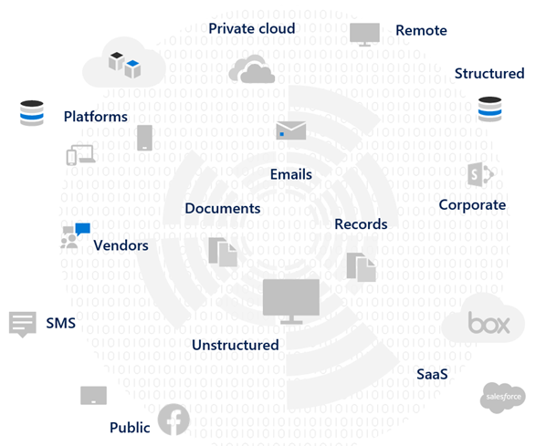

# Gegevens privacy-Risico's beoordelen en gevoelige items identificeren met Microsoft 365

De beoordeling van de voorschriften en risico's voor de privacy van uw organisatie is een belangrijke stap voordat u gerelateerde verbeteringen implementeert, waaronder de functies en services van Microsoft 365. 

## Mogelijk toepasselijke regelgeving voor informatie privacy

Zie de [Trust portal van Microsoft services](https://servicetrust.microsoft.com/) en de [artikelen reeks over de algemene verordening gegevensbescherming (AVG)](../compliance/gdpr.md)voor een goed overzicht van de richtlijnen van Microsoft-services en de artikelen over de voorschriften die u onder uw bedrijfstak of regio kunt plaatsen.

### AVG

Het AVG, het meest bekend en bekend maken van het Data Privacy Reglement, bepaalt de verzameling, de opslag, de verwerking en het delen van persoonlijke gegevens met betrekking tot een geïdentificeerde of identificeerbare natuurlijke persoon die een ingezetene is van de Europese Unie (EU). 

Volgens AVG artikel 4: 

- ' persoonlijke gegevens ': alle informatie met betrekking tot een geïdentificeerde of identificeerbare natuurlijke persoon (' gegevens onderwerp '); een identificeerbare natuurlijke persoon is één persoon die met name rechtstreeks of indirect kan worden geïdentificeerd met name naar een identificatie, zoals een naam, een identificatienummer, locatiegegevens, een online identificatie of een of meer factoren die specifiek zijn voor de fysieke, fysiologische, genetische, mentale, economische, culturele of sociale identiteit van die natuurlijke persoon.

### ISO 27001

Het voldoet aan andere normen, zoals ISO 27001, zijn ook herkend door meerdere Europese toezichthoudende autoriteiten als een geldige proxy van de intentie van de personen, het proces en de technologie. De standaarden die in de voorwaarden worden beschreven, zijn van toepassing op de naleving van ISO-27001-mechanismen voor beveiliging.

### Overige voorschriften voor data privacy

Andere regels voor informatie privacy dienen ook voorschriften voor de verwerking van persoonlijke gegevens op te geven.

In de Verenigde Staten omvat dit de wet van de Californië ter bescherming van het bedrijf ([CCPA](../compliance/ccpa-faq.md)), HIPAA-Hitech (Verenigde Staten gezondheidszorg) en de Graham-Uitloog Bliley Act (GLBA). Er zijn ook aanvullende taalspecifieke voorschriften of in ontwikkeling. 

Wereldwijd, extra voorbeelden zijn de nationale AVG-implementatie Act (BDSG) van Duitsland, de wet Data Protection Act (LGPD) en vele andere voordelen.

## Regulering van de toewijzing aan de technische controlecategorieën Microsoft 365

In veel van de regelgeving voor gegevensbeveiliging gelden overlappende vereisten, dus moet u nagaan welke voorschriften ze ondervinden voordat ze een regeling voor technische controle ontwikkelen. 

Voor latere naslaginformatie in de artikelen van deze algemene oplossing bevat deze tabel fragmenten uit een steekproef op het Reglement van de privacy van gegevens. 

| Verordening | Artikel/sectie | Gebaseerd | Toepasselijke categorieën voor technische controle |
|:-------|:-----|:-------|:-------|
| AVG | Artikel 5 (1) (f) | Persoonlijke gegevens worden verwerkt op een wijze die de juiste veiligheid van de persoonsgegevens waarborgt, met inbegrip van de bescherming tegen ongeoorloofde of onwettige verwerking en tegen verlies, vernietiging of schade, op basis van adequate technische of organisatie maatregelen (integriteit en vertrouwelijkheid).  |  Al   Identiteit   Apparaat   Bedreigingsbeveiliging   Informatie beschermen   Informatie regelen   Ontdekken en reageren |
|  | Artikel (32) (1) (a) | Rekening houdend met de status van de illustratie, de kosten van implementatie en de aard, omvang, context en doeleinden van de verwerkingskosten en het risico om de gevolgen en vrijheden van natuurlijke personen te variëren, kunnen de controller en de processor de juiste technische-en organisatie maatregelen treffen om ervoor te zorgen dat het risico een niveau van zekerheid houdt. met inbegrip van de juiste voorwaarde: (a) de pseudonymization en versleuteling van persoonlijke gegevens. | Informatie beschermen |
|  | Artikel (13) (2) (a) | "... de verantwoordelijke van de controleur dient op het tijdstip waarop persoonlijke gegevens worden verkregen, de volgende aanvullende informatie te verstrekken om te zorgen voor een billijke en ondoorzichtige verwerking: (a) de termijn waarbinnen de persoonsgegevens worden bewaard of indien dit niet mogelijk is. | Informatie regelen |
|  | Artikel (15) (1) (e) | Het onderwerp van de verantwoordelijke persoon dient het recht te verkrijgen van de verantwoordelijke voor de controleur, ongeacht of er al dan niet persoonlijke gegevens voor hem of haar zijn verwerkt. en waar het geval is, de toegang tot de persoonlijke gegevens en de volgende informatie: (e) het recht om aan te vragen van de controleur rectificatie of verwijdering van persoonlijke gegevens of beperking van de verwerking van persoonlijke gegevens met betrekking tot het betrokken gebied of het object in deze verwerking | Ontdekken en reageren |
| LGPD | Artikel 46 | Verwerkings medewerkers dienen beveiligings-, technische en administratieve maatregelen te nemen om persoonlijke gegevens te beschermen tegen onbevoegde toegang en accidentele en onwettige situaties van vernietiging, verlies, wijziging, communicatie of een type onwettige verwerking. | Informatie beschermen   Informatie regelen   Ontdekken en reageren|
|  | Artikel 48 | De controller dient met de nationale instantie te communiceren en aan de gegevens die het voorval van een veiligheidsincident kunnen maken dat risico kan maken. | Ontdekken en reageren |
| HITECH | 45 CFR 164.312 (e) (1) | Implementeer technische beveiligingsmaatregelen om te beschermen tegen onbevoegde toegang tot elektronische beschermde informatie over de gezondheid die via een elektronisch communicatienetwerk worden verzonden. | Informatie beschermen |
|  | 45 C.F.R. 164.312 (e) (2) (II) | Implementeer een mechanisme voor het versleutelen van elektronische beveiligde gezondheidsinformatie, indien van toepassing. | Informatie beschermen |
|  | 45 CFR 164.312 (c) (2) | Implementeer elektronische mechanismen om te corroborate dat de elektronische beveiligde gezondheidsinformatie niet is gewijzigd of vernietigd op een niet-geautoriseerde manier. | Informatie regelen |
|  | 45 CFR 164.316 (b) (1) (i) | Als in dit subdeel een actie, activiteit of beoordeling is vereist, dient u schriftelijk te zorgen dat de actie, de activiteit of de beoordeling een elektronische record heeft. | Informatie regelen |
|  | 45 CFR 164.316 (b) (1) (II) | Bewaren de documentatie die is vereist uit paragraaf (b) (1) van deze sectie gedurende zes jaar na de aanmaakdatum of de datum waarop het achternaam van kracht werd, wat later is. | Informatie regelen |
|  | 45 C.F.R. 164.308 (a) (1) (II) (D) | Procedures voor het regelmatig nakijken van de activiteiten van informatiesystemen, zoals controlelogboeken, Access-rapporten en rapporten bijhouden van beveiligingsincidenten | Ontdekken en reageren |
|  | 45 C.F.R. 164.308 (a) (6) (II) | Verdachte of bekende beveiligingsincidenten identificeren en beantwoorden; verkleint, voor zover mogelijk schadelijke effecten van beveiligingsincidenten die bekend zijn bij de gedekte entiteit of de zakelijke partner; en de resultaten van documenten beveiligingsincidenten. | Ontdekken en reageren |
|  | 45 C.F.R. 164.312 (b) | Implementeer hardware, software en procedure regelingen waarmee activiteiten worden vastgelegd en onderzocht in informatiesystemen die elektronische beschermde gezondheidsinformatie bevatten of gebruiken. | Ontdekken en reageren |
| CCPA | 1798.105 (c) | Een bedrijf dat een verifieerbare aanvraag ontvangt van een consument om de persoonlijke gegevens van de consument overeenkomstig de onderverdeling (a) van deze sectie te verwijderen, verwijdert de persoonlijke gegevens van de consument uit de bijbehorende records en stuurt een service provider om de persoonlijke gegevens van de consument uit hun records te verwijderen | Ontdekken en reageren |
|  | 1798.105 (d) | (uitzonderingen op 1798.105 (c)   Een bedrijf of service provider mag de persoonlijke gegevens van een consument niet navoldoen als het nodig is om de persoonlijke gegevens van de consument te verwijderen, indien nodig voor de bedrijf of service provider om de persoonlijke gegevens van de consument te behouden om te: (Zie de actuele voorschriften voor aanvullende informatie). | Ontdekken en reageren |
|||||

>[!Important]
>Dit is geen volledige lijst. Raadpleeg [nalevings beheer](../compliance/compliance-manager.md) of de adviseur voor naleving of naleving voor verdere informatie over de toepassing van de geciteerde secties in de lijst met technische besturings categorieën.
>

## Uw gegevens weten

Ongeacht de voorwaarden waar u van invloed zijn op de verschillende soorten gebruikersgegevens binnen en buiten uw organisatie met uw systemen, zijn alle belangrijke factoren die van invloed kunnen zijn op de algehele strategie met persoonlijke gegevensbescherming, onder voorbehoud van de bedrijfstak en de regerings voorschriften die van toepassing zijn op uw organisatie. Dit geldt ook voor het opslaan van persoonlijke gegevens, wat betekent dat u dit doet en wat de beschikbare gegevens zijn, onder de omstandigheden die ze hebben verzameld.
 

### Data portabiliteit 

Gegevens lopen ook over de tijd waarop deze is verwerkt, geraffineerd en andere versies zijn afgeleid. Een eerste momentopname is nooit genoeg. U moet een continu proces maken om uw gegevens te weten. Dit staat voor een van de grootste uitdagingen voor grote organisaties die grote hoeveelheden persoonlijke gegevens verwerken. Organisaties die niet het probleem weten dat u uw gegevens kent, kunnen uiteindelijk oplopen met zeer hoog risico en mogelijke verfijningen van wettelijke agentschappen.

 
### Waar de persoonlijke gegevens worden

Voor het oplossen van regels voor de privacy van gegevens kunt u niet gebruikmaken van algemene begrippen waarbij u denkt dat persoonlijke gegevens al bestaan, nu of in de toekomst. Voor de regels voor gegevens privacy moet een organisatie bewijzen dat de persoonlijke gegevens doorlopend zijn. Dit maakt het belangrijk om een eerste momentopname van al uw gegevensbronnen te maken voor mogelijke opslag van persoonlijke gegevens, waaronder uw Microsoft 365-omgeving, en mechanismen te creëren voor de voortdurende controle en detectie.

Als u nog niet al uw voorbereiding en risico op basis van richtlijnen voor informatie privacy hebt beoordeeld, gebruikt u de volgende drie stappen van het framework om aan de slag te gaan. 

>[!Note]
>Dit artikel en de inhoud van dit artikel zijn niet bedoeld ter plaatse van juridisch adviesdiensten. Dit biedt u een aantal basisrichtlijnen en koppelingen naar hulpmiddelen die in de eerste fasen van de beoordeling mogelijk van hulp zijn.
>
 
## Stap 1: een uitgebreide uitleg van de persoonlijke gegevens scenario's van uw organisatie ontwikkelen 

U moet de bestraling van de bestraling tegen het gegevenstype van de persoon die het momenteel beheert, van invloed zijn op de blootstelling van het gegevenstype van de persoon die op dat moment wordt beheerd, wat er gebeurt en wat er wordt ondergebracht en wie er toegang toe heeft. 

Het is belangrijk om te zien welke typen persoonlijke gegevens er in uw Microsoft 365-omgeving voorkomen. Gebruik deze categorieën:

- Werknemersgegevens die nodig zijn voor het uitvoeren van dagelijkse bedrijfsfuncties
- Gegevens die de organisatie heeft over de zakelijke klanten, partners en andere relaties in het Business-to-Business (B2B) scenario
- Gegevens die de organisatie heeft over consumenten die informatie verschaffen over online services die de organisatie beheert in het Business-to-Customer-scenario (B2C)

Hier ziet u een voorbeeld van de verschillende soorten gegevens voor typische afdelingen van een organisatie.

Veel van de persoonsgegevens die onderworpen zijn aan de privacy-regelgeving van Microsoft, worden meestal verzameld en opgeslagen buiten Microsoft 365. Alle persoonlijke gegevens van client gerichte webservices of mobiele toepassingen dienen van dergelijke toepassingen naar Microsoft 365 te worden geëxporteerd om na te gaan of de privacycontrole voor gegevens in Microsoft 365. 

De blootstelling van de privacy in Microsoft 365 is wellicht beperkt tot uw webtoepassingen en CRM-systemen, wat deze oplossing niet benadert.

Het is ook belangrijk om rekening te houden met de volgende veelvoorkomende problemen met betrekking tot de privacy van gegevens wanneer u uw risicoprofiel evalueert:

 - **Persoonlijke Gegevensdistributie.** Hoe verstrooit informatie over een bepaald onderwerp? Is het goed genoeg om wettelijke organen te overtuigen die de juiste besturingselementen hebben? Kan de service indien nodig worden onderzocht en hersteld?
- **Bescherming tegen exfiltration.** Hoe kan ik persoonlijke gegevens van een bepaald type of bron beschermen tegen compromissen en reageren op een bepaald type?
- **Beveiliging versus risico.** Welke technieken voor informatiebescherming zijn van invloed op het risico en hoe u de continuïteit en productiviteit van het bedrijf kunt waarborgen en de impact van de eindgebruikers moet minimaliseren als de interventie van de eindgebruiker is vereist? Moet u bijvoorbeeld handmatige classificatie of versleuteling gebruiken?
- **Voorbehoud van persoonlijke gegevens.** Hoelang informatie die persoonlijke gegevens bevat, moet worden bewaard voor geldige zakelijke redenen en hoe u oude en niet-permanente activiteiten in evenwicht kunt vermijden, in overeenstemming met de continuïteits behoeften voor bedrijven?
- **Verwerkings verzoeken van gegevens.** Welke mechanismen zijn nodig voor het verwerken van aanvragen voor gegevens verzoeken (DSRs) en eventuele herstelbewerkingen, zoals anonimiseren, redactie en verwijdering?
- **Voortdurende controle en rapportage.** Welke verschillende gegevenstypen en welke rapportage technieken zijn er voor de verschillende gegevenstypen en bronnen beschikbaar?
- **Beperkingen voor het verwerken van gegevens.** Gelden er beperkingen voor gegevens die worden verzameld of opgeslagen via deze methoden die in de organisatie moeten worden weergegeven in de privacy-instellingen? Toezeggingen die persoonlijke gegevens niet door de verkoopmedewerkers worden gebruikt, kunnen uw organisatie vragen stellen ter voorkoming van overdracht of opslag van die gegevens in systemen die zijn gekoppeld aan de verkooporganisatie.

### Werknemersgegevens die nodig zijn voor het uitvoeren van dagelijkse bedrijfsfuncties

Organisaties op basis van aard moeten gegevens verzamelen over de werknemers voor elektronische identiteit en PZ, onder voorbehoud van welke ze akkoord gaan met hun werknemers overeenkomsten. Wanneer een persoon werkt voor een bedrijf, is dit gewoonlijk geen probleem. De organisatie wil wellicht mechanismen ter plaatse stellen om kwaadaardige actoren van exfiltration of het lekken van werknemersgegevens te voorkomen. 

Als een persoon een bedrijf verlaat, hebben organisaties meestal processen, procedures en bewaarschema's voor het verwijderen van gebruikersaccounts, het buiten gebruik stellen van postvakken en persoonlijke stations, en het wijzigen van de status van werknemers in zaken als Human Resources-systemen. In situaties waarin rechtszaken van toepassing is, kan een werknemer of een andere partij een juridisch onderzoek geldige redenen hebben voor het verkrijgen van informatie over persoonlijke gegevens die zijn opgeslagen op de systemen van de organisatie. In sommige gevallen kan die partij verzoeken dat dergelijke gegevens worden verwijderd of geanonimiseerde. 

Om een dergelijk behoeften te kunnen beantwoorden, moeten organisaties processen en procedures hebben ter bevordering van preventie, detectie en hergebruik van dergelijke aanvragen, zodat bepaalde informatie over een werknemer redelijkerwijs mogelijk wordt beschouwd voor de continuïteit van het bedrijf. Bijvoorbeeld informatie die een gebruiker heeft gemaakt bij het maken van een bestand of het uitvoeren van een functie. 

>[!Note]
>Zie het [artikel monitor en respond](information-protection-deploy-monitor-respond.md)voor informatie over technieken voor onderzoek en herstel voor personal data in microsoft 365. U kunt ook geautomatiseerde classificatie-en beveiligingsschema's gebruiken om ervoor te zorgen dat persoonlijke gegevens binnen de organisatie worden bestuurd en voorkomen dat de organisatie wordt verlaten in kwaadaardige actor-situaties. Zie het [artikel Beveilig informatie](information-protection-deploy-protect-information.md) voor meer informatie.
>
 
### Gegevens die de organisatie heeft voor de zakelijke klanten in het B2B-scenario

Het verzamelen van B2B-gegevens is ook een uitdaging omdat uw organisatie de klantnamen en transacties in de verschillende systemen voor de continuïteit van het bedrijf mogelijk moet houden. Net als werk nemergegevens moeten organisaties beleidsregels, procedures en technische besturingselementen op hun plaats hebben om gegevens te beschermen, en er wordt uitgegaan van overeenstemming met gedefinieerde Bewaar-en verwijderings schema's. 

In het algemeen zijn contracten met externe klanten, partners en de andere entiteiten waarmee de organisatie zaken doet, in staat om de verwerking van dergelijke gegevens, met inbegrip van bescherming, bewaren, en het verwijderen van beide activiteiten te voorkomen, onder en na de entiteit heeft een relatie met de organisatie. 

### Gegevens die de organisatie heeft over consumenten die informatie verschaffen over online services die de organisatie beheert in het B2C-scenario

Deze categorie is de enige die de meeste mensen denken voor de privacy van gegevens, vanwege een groot aantal openbare exemplaren van klantgegevens lekkage. Dit kan doel zijn, zoals een derde partij onder contract voor de provider, of onbedoelde, bijvoorbeeld exfiltration door een kwaadaardige actor. Consumenten gegevensbescherming vormt een van de belangrijkste redenen waarom de EU en de anderen deze regels hebben uitgevaardigd. Voor de privacyinstellingen van gegevens, zoals AVG en CCPA, moet u de volgende taken uitvoeren:

- [Actieplannen](../compliance/gdpr-action-plan.md) en [Controlelijsten voor gereedheids](../compliance/gdpr-arc-office365.md) bewerkingen
- [Impact beoordelingen van gegevensbescherming](../compliance/gdpr-data-protection-impact-assessments.md)
- [Meldingen over overtreding](../compliance/gdpr-breach-office365.md)
- [Verzoeken van betrokkenen](../compliance/gdpr-dsr-office365.md)

Als uw organisatie geen veel van de gegevensverzameling rechtstreeks van de consument hoeft te verzamelen, kan deze categorie minder problemen veroorzaken. Mogelijk moet u mogelijk nog steeds de processen die in deze artikelen worden beschreven, doorlopen om naleving te verkrijgen.

### Overzicht van stap 1

Inzicht in de belichtingstijd en de privacy van gegevens is een belangrijke eerste stap op basis van een uitstraling van de persoonlijke gegevens scenario's van uw organisatie.

Als u geen persoonlijke gegevens van consumenten hebt in uw Microsoft 365-omgeving, of als deze aan bepaalde delen van de omgeving is gebonden en de behoeften van de technische controle van toepassing zijn op de blootstelling van de consument, mag de technische controle slechts in hoge risico delen van het milieu, niet overal, worden gebruikt.

Hoewel u met een externe organisatie of standaard afstandsbedienings functie, zoals van Compliance Manager in Microsoft 365, kan bijdragen aan de controlestrategie, moet u zich op de hoogte brengen van gegevens inventarisatie om uw werkelijke risico bloot te leggen.

De meeste organisaties hebben een deel van de bovenvermelde scenario's. De beoordeling van een holistische aanpak is belangrijk.

## Stap 2: controleren of u klaar bent om te voldoen aan de regelgeving voor informatiebescherming

Hoewel specifiek bedoeld is voor AVG, zijn de vragen die betrekking hebben op het gratis [Microsoft AVG assessment tool](https://www.microsoft.com/cyberassessment/en/gdpr/uso365) een goed overzicht van de algemene voorbereiding van gegevens privacy. 

Organisaties die onderworpen zijn aan andere regels voor informatie privacy, zoals CCPA in de LGPD van de Verenigde Staten of Brazilië, kunnen ook gebruikmaken van dit hulpprogramma voor de voorbereiding van de voorbereiding op voorbereiding met de AVG.

AVG-beoordeling omvat de volgende secties:

| Middengedeelte | Beschrijving |
|:-------|:-----|
| Beheermodel | <ol><li>Wordt in uw privacybeleid expliciet aangeven welke gegevens gegevens worden verwerkt? </li><li>Uitvoert u regelmatig privacy impact beoordelingen (Pia's)? </li><li> Gebruikt u een hulpmiddel om persoonlijke gegevens te beheren (PI)? </li><li> Hebt u wettelijke bevoegdheid om zaken te doen met behulp van PI-gegevens op een bepaald individu? Houdt u toestemming voor gegevens bij? </li><li> Wilt u controle besturingselementen bijhouden, implementeren en beheren? Controleert u op gegevens lekkages? </li></ol>|
| Verwijdering en meldingen | <ol><li>Geeft u expliciet instructies voor het openen van gebruikersgegevens? </li><li> Hebt u gedocumenteerde processen ter verwerkings instemming? </li><li> Hebt u een geautomatiseerde procedure voor het verwijderen van gegevens? </li><li>   Hebt u een proces voor het valideren van de identiteit wanneer u een klant doet? </li></ol>|
| Risicobeperking en beveiliging van de gegevens | <ol><li>Gebruikt u de hulpmiddelen om ongestructureerde gegevens te scannen? </li><li>Zijn alle servers up-to-date en verdeelt u de firewalls om ze te beveiligen? </li><li>Voert u regelmatige back-ups van uw servers uit? </li><li>Controleert u actief op gegevens lekkage? </li><li>Versleutelt u de gegevens op rest en in een overdracht? </li></ol>|
| Beleidsbeheer | <ol><li>Hoe beheert u uw bindende bedrijfsregels (BCRs)? </li><li>Houdt u toestemming voor gegevens bij? </li><li> Met een schaal van 1 tot en met 5, moet u uw contracten bedekken over de gegevens classificaties en de bewerkings vereisten? </li><li>Hebt u en regelmatig een incident-antwoord plan getest? </li><li>Welk beleid gebruikt u om toegang te beheren? </li></ol>|
|||
 
## Stap 3: Identificeer gevoelige informatie typen die zich voordoen in uw Microsoft 365-omgeving. 

Deze stap omvat het identificeren van bepaalde gevoelige informatie typen die onderworpen zijn aan specifieke regelgevende besturingselementen, en de plaats van de gegevens in uw Microsoft 365-omgeving. 

Het zoeken naar inhoud in uw omgeving met persoonlijk kan een Andrei-taak zijn, vroeger met een combinatie van zoekopdrachten voor compliance, eDiscovery, Advanced eDiscovery, DLP en controle. 

Met de nieuwe oplossing voor **gegevens classificaties** in het Microsoft compliance-Beheercentrum is dit veel makkelijker geworden met de functionaliteit van de [inhouds Verkenner](../compliance/data-classification-content-explorer.md) , wat geschikt is voor ingebouwde of aangepaste gevoelige informatie typen, waaronder de oplossingen die betrekking hebben op persoonlijke gegevens.
 
### Typen gevoelige informatie

Het Microsoft compliance-Beheercentrum wordt vooraf geladen met meer dan 100 gevoelige informatie typen, meestal met betrekking tot het identificeren en vinden van persoonlijke gegevens. Deze ingebouwde gevoelige informatie typen kunnen creditcardnummers, bankrekeningnummers, paspoort nummers en meer identificeren en beschermen op basis van patronen die zijn gedefinieerd met een reguliere expressie (regex) of een functie. Zie voor meer informatie [hoe de typen gevoelige informatie eruitzien](../compliance/what-the-sensitive-information-types-look-for.md).

Als u een organisatie-specifiek of regionaal type van gevoelige items, zoals een aangepaste notatie voor werknemers-Id's, wilt identificeren en beschermen, of andere persoonlijke informatie die nog niet is gedekt door een ingebouwd gevoelige informatietype, kunt u een aangepast gevoelige informatietype maken met de volgende methoden: 

- PowerShell
- Aangepaste regels met exacte gegevens overeenkomst (EDM)
- Via de GEBRUIKERSINTERFACE van het compliance Center, zoals gemarkeerd in het [artikel compliance Score en Compliance Manager gebruiken](information-protection-deploy-compliance.md)

U kunt ook een bestaand, ingebouwd gevoelige informatietype aanpassen.

Zie de volgende artikelen voor meer informatie:

- [Een ingebouwd type gevoelige informatie aanpassen](../compliance/customize-a-built-in-sensitive-information-type.md)
- [Aangepaste gevoelige informatietypen](../compliance/custom-sensitive-info-types.md)
- [Een aangepast, kwetsbaar informatietype maken in de beveiligings & nalevings centrum](../compliance/create-a-custom-sensitive-information-type.md)
- [Een aangepast, kwetsbaar informatietype maken in beveiligings & nalevings centrum voor PowerShell](../compliance/create-a-custom-sensitive-information-type-in-scc-powershell.md)
- [Aangepaste, gevoelige informatie typen met exact exacte gegevens overeenkomsten op basis van een classificatie](../compliance/create-custom-sensitive-information-types-with-exact-data-match-based-classification.md)

### Inhouds Verkenner

Een belangrijk hulpmiddel voor het bepalen van het geval van gevoelige items in uw omgeving is de nieuwe [inhouds Verkenner](../compliance/data-classification-content-explorer.md) in het microsoft 365 compliance-Beheercentrum. Het is een geautomatiseerd hulpmiddel voor een initiële en voortdurende scan van uw volledige Microsoft 365-abonnement voor het geval van gevoelige informatie typen en het weergeven van de resultaten.
 
Met het hulpprogramma nieuwe inhouds Verkenner kunt u snel de locaties van gevoelige items in uw omgeving identificeren met behulp van ingebouwde gevoelige informatie typen of aangepaste sjablonen. Dit kan van invloed zijn op het opzetten van een proces en de toegewezen verantwoordelijkheid om regelmatig de aanwezigheid en locatie van gevoelige items te onderzoeken.

Met de andere stappen in dit artikel is dit een uitgangspunt voor het identificeren van uw algemene risico, voorbereiding en locatie van gevoelige items ter bescherming via de geplande Microsoft 365-configuratie en-controle. 

### Andere manieren om persoonlijke gegevens in uw omgeving te identificeren

Naast de inhoud van de inhouds Verkenner hebben organisaties geen toegang tot de mogelijkheid om inhoud te doorzoeken, zodat ze aangepaste zoekresultaten in hun omgeving kunnen vinden met behulp van geavanceerde zoekcriteria en aangepaste filters.

In [dit artikel](../compliance/search-for-and-find-personal-data.md)vindt u gedetailleerde informatie over het gebruik van inhoud zoeken voor het detecteren van persoonlijke gegevens. Het zoeken naar inhoud en andere detectietechnieken worden ook verkend in [DSRs voor de AVG en CCPA](../compliance/gdpr-dsr-office365.md#introduction-to-dsrs).

U vindt meer informatie over technieken voor onderzoek en hersteltechnieken voor personal data in Microsoft 365 in het [artikel monitor en reageren](information-protection-deploy-monitor-respond.md).
