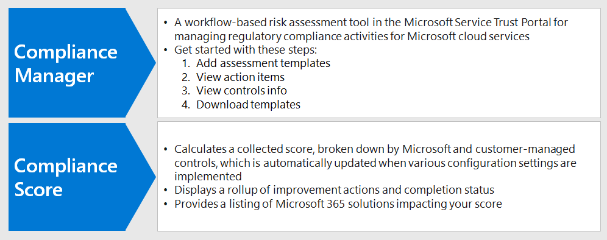

# Compliance Score en Compliance Manager gebruiken om verbeteracties te beherenUse Compliance Score and Compliance Manager to manage improvement actions

Microsoft Compliance Score en Compliance Manager kunnen samen worden gebruikt om verbeteringen in verband met de regelgeving inzake gegevensprivacy te beheren, zoals de [Algemene Verordening Gegevensbescherming (AVG) van](../compliance/gdpr.md)de Europese Unie, de California Consumer Protection Act [CCPA),](../compliance/ccpa-faq.md)HIPAA-HITECH (US Health Care Privacy Act) en de Brazil Data Protection Act (LGPD).Microsoft Compliance Score and Compliance Manager can be used together to manage improvements related to data privacy regulations such as the European Union [General Data Protection Regulation (GDPR)](../compliance/gdpr.md), [California Consumer Protection Act CCPA)](../compliance/ccpa-faq.md), HIPAA-HITECH (US health care privacy act), and the Brazil Data Protection Act (LGPD). 

In dit artikel vindt u richtlijnen voor het gebruik van deze hulpmiddelen voor gegevensprivacydoeleinden.This article provides guidance on the use of these tools for data privacy purposes.

>[!Note]
>De klantacties in Compliance Manager zijn aanbevelingen.The customer actions provided in Compliance Manager are recommendations. Het is aan u om de effectiviteit van deze aanbevelingen in uw regelgevingsomgevingen te evalueren voordat deze worden geïmplementeerd.It is up to you to evaluate the effectiveness of these recommendations in your regulatory environments prior to implementation. Aanbevelingen van compliancemanagers mogen niet worden geïnterpreteerd als een garantie voor naleving.Compliance Manager recommendations should not be interpreted as a guarantee of compliance.
>

## Geplande updates voor Compliance Score en Compliance ManagerPlanned updates for Compliance Score and Compliance Manager

[Compliance Score](../compliance/compliance-score.md) (momenteel in preview) vereist het toevoegen van uw doelbeoordelingen voor een verordening (zoals GDPR) van de [Compliance Manager.](../compliance/compliance-manager-overview.md)[Compliance Score](../compliance/compliance-score.md) (currently in preview) requires adding your target assessments for a regulation (such as GDPR) from the [Compliance Manager](../compliance/compliance-manager-overview.md). In een toekomstige release wordt een groot deel van de functionaliteit in Compliance Manager samengevoegd tot een uniforme Compliance Score-ervaring, waardoor er minder behoefte is aan meerdere tools.In a future release, much of the functionality in Compliance Manager will be merged into a unified Compliance Score experience, reducing the need for multiple tools.

Dit zijn de tools voor uw abonnement, waarvoor u zich moet aanmelden:Here are the tools for your subscription, which require you to sign-in:

- [Compliance Score in het Microsoft Compliance-beheercentrumCompliance Score in the Microsoft Compliance admin center](https://compliance.microsoft.com/compliancescore)
- [Compliance Manager in de Microsoft Services Trust PortalCompliance Manager in the Microsoft Services Trust Portal](https://servicetrust.microsoft.com/ComplianceManager/V3)

## Aan de slag met Compliance ManagerGetting started with Compliance Manager 

[Compliance Manager](../compliance/working-with-compliance-manager.md) (momenteel in preview) is een gratis workflowgebaseerde risicobeoordelingstool in de Microsoft Service Trust Portal voor het beheren van regelgevingsactiviteiten met betrekking tot Microsoft-cloudservices.[Compliance Manager](../compliance/working-with-compliance-manager.md) (currently in preview) is a free workflow-based risk assessment tool in the Microsoft Service Trust Portal for managing regulatory compliance activities related to Microsoft cloud services. Als onderdeel van uw Microsoft 365- of Azure Active Directory -abonnement (Azure AD) helpt Compliance Manager u bij het beheren van naleving van de regelgeving binnen het gedeelde verantwoordelijkheidsmodel voor Microsoft-cloudservices.As part of your Microsoft 365 or Azure Active Directory (Azure AD) subscription, Compliance Manager helps you manage regulatory compliance within the shared responsibility model for Microsoft cloud services.

Hoewel u uw algemene nalevingsscore bekijken en een aantal andere functies uitvoeren op de **compliancescorepagina** van het Compliance center, moet u Compliance Manager gebruiken via de Services Trust Portal om eerst beoordelingen voor uw regelgeving inzake gegevensprivacy te configureren.While you can view your overall compliance score and perform a number of other functions in the Compliance center's **Compliance Score** page, you need to use Compliance Manager through the Services Trust Portal to first configure assessments for your data privacy regulations. Gegevens uit deze beoordelingen worden vervolgens weergegeven in de nalevingsscore voor verder bekijken en filteren.Data from these assessments will then show up in Compliance Score for further viewing and filtering. 

Met behulp van de interface voor Compliance Manager u een of meer gegevensprivacygerelateerde regelgevingssjablonen selecteren en deze groeperen om vereiste verbeteringsacties in de set te beoordelen en bij te houden.Using the Compliance Manager interface, you can select one or more data privacy-related regulation templates and group them to assess and track required improvement actions across the set. U ook informatie bekijken over de besturingselementen die elke verordening vraagt om specifiek voor de doelservice, gescheiden door microsoft versus door de klant beheerde besturingselementen.You can also view information about the controls each regulation calls for specific to the target service, separated by Microsoft vs. customer-managed controls.

Beoordelingen en verbeteringsstatus die hier zijn geselecteerd, worden ook weergegeven in de compliancescore in het Microsoft Compliance Center, die het belang van uw eerste installatie in Compliance Manager benadrukken.Assessments and improvement status selected here also appear in Compliance Score in the Microsoft Compliance Center, which emphasize the importance of your initial setup in Compliance Manager. Deze relaties worden weergegeven in deze figuur.These relationships are shown in this figure.
 

Hier volgen de belangrijkste stappen om u op weg te helpen.Here are the key steps to help you get started.

### 1. Beoordelingssjablonen1. Assessment templates

Vanuit de Compliance Manager is de eerste stap het toevoegen van beoordelingen die specifiek zijn voor de privacywetgeving van belang en deze op te nemen in een gedefinieerde groep "Gegevensprivacyverordeningen".From the Compliance Manager, the first step is to add assessments specific to the data privacy regulations of interest and include them in a defined "Data Privacy Regulations" group.

[Groepen](../compliance/working-with-compliance-manager.md#groups) zijn containers waarmee u beoordelingen organiseren en algemene informatie en werkstroomtaken delen tussen beoordelingen met dezelfde of gerelateerde door de klant beheerde besturingselementen.[Groups](../compliance/working-with-compliance-manager.md#groups) are containers that allow you to organize Assessments and share common information and workflow tasks between Assessments that have the same or related customer-managed controls. Wanneer twee verschillende beoordelingen in dezelfde groep door de klant beheerde controle delen, worden de voltooiing van implementatiegegevens, tests en status voor het besturingselement automatisch gesynchroniseerd met hetzelfde besturingselement in een andere beoordeling in de groep.When two different Assessments in the same group share customer-managed control, the completion of implementation details, testing, and status for the control automatically synchronize to the same control in any other Assessment in the Group. Dit verenigt de toegewezen actie-items voor elk besturingselement in de groep en vermindert dubbel werk.This unifies the assigned Action Items for each control across the group and reduces duplicating work. 

U er ook voor kiezen om groepen te gebruiken om te organiseren.You can also choose to use groups to organize. Beoordelingen per jaar, gebied, nalevingsnorm of andere groeperingen om uw nalevingswerk te organiseren.Assessments by year, area, compliance standard, or other groupings to help organize your compliance work.

### 2. Actiepunten2. Action items

Zodra de beoordelingen zijn toegevoegd, u actiepunten bekijken die specifiek zijn voor elke groep of afzonderlijke verordening:Once the assessments have been added, you can view Action Items specific to each group or individual regulation:

- **Actielijst voor verbetering.****Improvement action list.** Navigeer naar de lijst Actieitems en bekijk de verbeteringsacties die zijn gekoppeld aan de regelgeving die in de groep is opgenomen.Navigate to the Action Items list and view the improvement actions associated across the regulations included in the group. Veel acties omvatten regelgeving, zodat een enkele lijst item kan meerdere verordeningen vertegenwoordigen.Many actions span regulations so a single list item may represent multiple regulations. 
 
- **Verbetering actie filtering.****Improvement action filtering.** Voor veel regelgeving voor gegevensprivacy en groepen regelgeving kan de lijst met verbeteracties vrij groot zijn, dus overweeg de lijst te filteren met behulp van de vervolgkeuzelijst filteren.For many data privacy regulations and groups of regulations, the list of improvement actions can be quite large, so consider filtering the list using the filter drop down. Als u bijvoorbeeld 'technische besturingselementen' selecteert, wordt de lijst teruggebracht tot alleen de taken met een technische implementatie in de organisatie, omdat veel van de acties gerelateerd zijn aan administratieve bewerkingen in verschillende aspecten van het bedrijf die ook zijn gedocumenteerd in Compliance Manager.For example, if you select "technical controls", the list will be reduced to just those which have a technical implementation in the organization, as many of the actions are related to administrative operations in various aspects of the business which are also documented in Compliance Manager. In dit artikel zullen we ons richten op technische controles, dus deze filteringsaanpak wordt aanbevolen.In this article, we will focus on technical controls, so this filtering approach is recommended.
 
- **Aanvullende informatie en beoordeling.****Additional information and review.** Voor elke actie u op de link naar **Lees meer**klikken, die u meer vertelt over de aanbevolen activiteit of **Beoordeling**, waarmee u het volgende doen:For each action, you can click on the link to **Read More**, which tells you more about the recommended activity, or **Review**, which opens a form allowing you to do the following:
 
   - De actie toewijzen aan iemand in uw organisatie om te beherenAssign the action to a someone in your organization to manage
   - Documenten beheren met betrekking tot het aanpakken van de actieManage documents related to addressing the action
   - Status voor het item opgevenSpecify status for the item
   - Uitvoerings- en testdatums opgevenSpecify implementation and test dates
   - Aanvullende informatie, implementatienotities en testplannotities voor de onderwerpactie opnemenRecord additional information, implementation notes, and test plan notes for the subject action
  
- **Niet-toepasselijke items als buiten het bereik.****Non-applicable items as out-of-scope.** Sommige verbeteringsacties in de lijst Actieitems zijn mogelijk niet van toepassing op uw geplande implementatie.Some improvement actions included in the Action Items list might not apply to your planned implementation. U opgeven dat ze buiten het bereik van Compliance Manager vallen en de actie en het bewijs verwijderen uit de berekening van de waarde van de nalevingsscore.You can specify that they are out of scope in Compliance Manager and remove the action and its evidence from the calculation of the compliance score value. 

Als uw organisatie er bijvoorbeeld voor heeft gekozen om Microsoft Managed Key te gebruiken, is een aanbeveling voor Het gebruik van klantsleutel niet van toepassing op uw implementatie.For example, if your organization has elected to use Microsoft Managed Key", a recommendation to Use Customer Key is not applicable to your deployment. In dit geval markeert uw organisatie deze als **Niet in het bereik** in de **beheeracties** voor de toepasselijke regelgevingssjabloon.In this case, your organization would mark it as **Not in scope** in the **Control Actions** for the applicable regulatory template.
 
### 3. Controle info3. Controls info

Bekijk de controlegegevens voor elke beoordelingsgroep voor een [beoordelingsspecifieke](../compliance/compliance-manager-overview.md#controls) weergave.For an assessment-specific view, view the [Controls Info](../compliance/compliance-manager-overview.md#controls) for each assessment group. Dit biedt een beoordelingsspecifieke weergave, die verschil maakt dan de lijst met actie-items, die een technische controlespecifieke weergave biedt.This provides an assessment-specific view, which is difference than the Action Items list, which provides a technical control-specific view.
 

Navigeer naar de lijst **Met de controlegegevens** en bekijk de lijst met services in het bereik van de betreffende verordening.Navigate to the **Controls Info** list and view the list of in-scope services for the regulation in question. 
 
Regelgevingsspecifieke controlegroepen vermelden de acties die worden uitgevoerd door het controlegebied voor elk servicegebied.Regulation-specific control groupings list the actions provided by control area for each service area. Voor elke reeks acties biedt de Compliance Manager meer informatie over de actie en kan de organisatie beoordelingsopties voorstellen of bieden om de organisatie te helpen bij het kiezen van een controleaanpak.For each set of actions, the Compliance Manager provides more information on the action and may suggest or provide review options to assist the organization in choosing a control approach.
 
Houd er rekening mee dat deze interface de mogelijkheid biedt om details te bekijken die specifiek zijn voor de technische actie, samen met de status van acties met betrekking tot de controle en aanvullende context over de regelgeving waaraan de actie is gerelateerd.Note that this interface provides the capability to view details specific to the technical action, together with the status of actions related to the control, and supplemental context about the regulations to which the action is related.

### 4. Sjabloon downloaden4. Template download

Voor degenen die meer vertrouwd zijn met spreadsheet-gebaseerde regelgevingsanalyse, een andere aanpak is het downloaden van de sjabloon voor elke respectieve beoordeling met behulp van de sjablonen vermelding.For those more familiar with spreadsheet-based regulatory analysis, another approach is to download the template for each respective assessment using the Templates listing. De gedownloade sjablonen bevatten zowel de wettelijke als technische controle-informatie voor elke sjabloon en kunnen voor bepaalde rollen gemakkelijker zijn om te navigeren/filteren en bedrijfsspecifieke weergaven te genereren.The downloaded templates list both the regulatory as well as technical control information for each template and may be easier for certain roles to navigate/filter and to generate business-specific views.
 
U ook een nieuwe sjabloon toevoegen die is aangepast voor uw organisatie op basis van een bestaande sjabloon, met **Sjabloon toevoegen.**You can also add a new template customized for your organization based on an existing template, using **Add Template**. Dit vereist dat u een sjabloon naar keuze downloadt (zoals HIPAA/HITECH)), deze vervolgens voor uw doeleinden wijzigt en terug uploadt naar de Compliance Manager-tool, waar het nu beoordelingen en scores zal stimuleren die vergelijkbaar zijn met andere sjablonen en beoordelingen als onderdeel van de algemene compliancemanager en compliancescoretoolset.This requires that you download a template of choice (such as HIPAA/HITECH)), then modify it for your purposes and upload back into the Compliance Manager tool, where it will now drive assessments and scoring similar to other templates and assessments as part of the overall Compliance Manager and Compliance Score toolset.
 
>[!Tip]
>Als u een groot aantal regelgeving of overlappende verbeteringsacties behandelt, u overwegen elke betreffende sjabloon te downloaden en de gegevenssets te combineren, verbeteringsacties of controletypen die niet van toepassing zijn op uw organisatie verwijderen en opnieuw uploaden.if dealing with a large number of regulations or overlapping improvement actions, consider downloading each respective template and combining the data sets, removing improvement actions or control types that do not apply to your organization, and re-uploading. Dit kan gemakkelijker zijn dan het navigeren in elke sectie controle-informatie en het markeren van elk als buiten het bereik.This may be easier than navigating every control info section and marking each as out of scope.
>

## CompliancescoreCompliance Score

Zodra de beoordelingen en beoordelingsspecificaties zijn uitgevoerd in Compliance Manager, u nu naar de [compliancescore-tool](../compliance/compliance-score.md) gaan en de score bekijken en de gegevens verder snijden en de gegevens in blokjes snijden, inclusief het controlegebied.Once the assessments and review specifications are performed in Compliance Manager, you can now go to the [Compliance Score](../compliance/compliance-score.md) tool and review the score and slice and dice the data further, including by control area.

De Compliance Score-tool in het Microsoft 365 Compliance-beheercentrum biedt verschillende benaderingen voor het beoordelen en filteren van nalevingsgegevens die zijn verkregen van Compliance Manager en verschillende Microsoft 365-services.The Compliance Score tool in the Microsoft 365 Compliance admin center provides several approaches to review and filter compliance data obtained from Compliance Manager and various Microsoft 365 services. Deze tool wordt automatisch bijgewerkt wanneer verschillende configuratie-instellingen worden geïmplementeerd en deelt signalen met de Microsoft Secure Score, zodat veel verbeteringsacties in beide scores worden weergegeven.This tool is automatically updated when various configuration settings are implemented and shares signals with the Microsoft Secure Score so that many improvement actions will show up in both scores. 
 
De compliancescore biedt:The Compliance Score provides:

- Een verzamelde score, uitgesplitst door Microsoft en door klanten beheerde besturingselementenA collected score, broken down by Microsoft and customer-managed controls
- Een rollup van verbeteracties en voltooiingsstatusA rollup of improvement actions and completion status
- Een lijst van Microsoft 365-oplossingen die van invloed zijn op uw scoreA listing of Microsoft 365 solutions impacting your score

### Hoe de nalevingsscore wordt berekendHow the compliance score gets calculated

Kortom, de score wordt berekend op basis van een combinatie van Microsoft en door klanten beheerde controle-implementaties, zoals nader wordt uitgelegd in het [berekeningsartikel van](../compliance/compliance-score-methodology.md)de Microsoft Compliance Score .In short, the score is calculated based on a combination of Microsoft and customer-managed control implementations, as explained in more detail in the [Microsoft Compliance Score calculation article](../compliance/compliance-score-methodology.md).

Besturingselementen krijgen een scorewaarde toegewezen op basis van of ze verplicht of discretionair zijn en of ze preventief, detective of correctief zijn.Controls are assigned a score value based on whether they're mandatory or discretionary, and whether they're preventative, detective, or corrective. Deze vormen gezamenlijk het risico dat het niet ten opzichte van andere controles wordt uitgevoerd.These collectively represent the risk of not implementing it relative to other controls.

Zoals gepresenteerd in het microsoft compliance score berekeningsartikel, krijgen preventieve controles een hogere score dan detective- en corrigerende controles en krijgen verplichte controles een hogere score dan discretionaire controles.As presented in the Microsoft Compliance Score calculation article, preventative controls get a higher score than detective and corrective ones, and mandatory controls get a higher score than discretionary ones.
 
Houd er rekening mee dat de gebruikersinterface van de beheerder van de nalevingsscore deze parameters niet vermeldt en ook niet de mogelijkheid biedt om erop te filteren.Note that the Compliance Score admin UI does not list these parameters, nor does it provide the ability to filter by them. Als u de bijbehorende sjabloon echter downloadt van het gereedschap Compliance Manager, worden deze parameters in de resulterende gegevensset wel vermeld voor de meeste regelgeving.However, if you download the associated template from the Compliance Manager tool, the resulting data set does list these parameters for most regulations.

Voor technische besturingselementen wordt de score voor verbeteringsactie automatisch bijgewerkt zodra de bijbehorende functie is geactiveerd.For technical controls, Compliance Score will automatically update the improvement action score once the related feature is activated. Andere, niet-technische &mdash; controleacties, zoals acties die operationeel zijn of gerelateerd zijn aan documentatie, moeten handmatig worden geregistreerd in de tool Compliance Manager op de Services Trust &mdash; Portal.Other, non-technical control actions&mdash;such as those that are operational or related to documentation&mdash;need to be recorded manually in the Compliance Manager tool on the Services Trust Portal. 

U veel ook de uitvoering van bepaalde verbetering acties voor andere doeleinden &mdash; voor bijvoorbeeld het gebruik van retentie labels om andere redenen dan de naleving van de regelgeving voor gegevensprivacy, zodat u krediet zou krijgen voor het gebruik van een dergelijke &mdash; functie, zelfs als het wordt gebruikt voor andere doeleinden, en geen deel uit van een opzettelijke naleving actie.You many also be implementing certain improvement actions for other purposes&mdash;for example using retention labels for reasons other than data privacy regulation compliance&mdash;so you would get credit for using such a feature even if it is being used for other purposes, and not part of a deliberate compliance action.

Uw compliancescore moet worden beschouwd als een relatieve maatregel om verbetering op grote schaal bij te houden.Your Compliance Score should be considered a relative measure to track improvement on a broad scale. Je moet niet streven naar een perfecte score.You should not pursue a perfect score. 

### Aanvullende richtlijnenAdditional guidance

Hier volgen enkele belangrijke tips voor het gebruik van Compliance Score en Compliance Manager voor u om naleving van de regelgeving voor gegevensprivacy te bereiken:Here are a few important tips for the use of Compliance Score and Compliance Manager for you to achieve data privacy regulation compliance:

- Elke verordening voor gegevensprivacy heeft een combinatie van technische controles, documentatiespecificaties en operationele, proces- en rapportagevereisten.Each data privacy regulation has a combination of technical controls, documentation specifications, and operational, process, and reporting requirements. Al deze verschijnen in de verbetering acties.All of these show up in the improvement actions. 

- Dit artikel richt zich op een subset van de technische besturingselementen die zijn opgegeven voor gegevensprivacy in Compliance Manager en Compliance Score.This article focuses on a subset of the technical controls specified for data privacy in Compliance Manager and Compliance Score. Raadpleeg de compliancemanager-tool en [documentatie](../compliance/compliance-score.md) voor meer informatie over niet-technische administratieve controles.Refer to the Compliance Manager tool and [documentation](../compliance/compliance-score.md) for more information on non-technical administrative controls.

- Als u de weergave van verbeteracties wilt richten op uw interessegebied, u filteren op actietype op het tabblad **Oplossingen** in de beheerder van de nalevingsscore.To focus the view of improvement actions to your area of interest, you can filter by action type in the **Solutions** tab in the Compliance Score admin.

- Het relatieve belang en de prioriteit van verbeteringsacties die zijn geïdentificeerd in de nalevingsscore, moet worden beschouwd als onderdeel van een bredere risicobeoordeling, samen met het risico op gegevensprivacy dat u hebt bepaald dat uw organisatie moet beheren.The relative importance and priority of improvement actions identified in Compliance Score should be considered as part of a broader risk review along with the data privacy risk you've determined your organization needs to manage. 

- Als u een wereldwijde organisatie bent en u meerdere sjablonen voor gegevensprivacyregelgeving toevoegt aan Compliance Manager als beoordelingen, combineert compliancescore elke toepasselijke sjabloon in een veldvermelding voor elke verbeteringsactie.If you are a global organization and you add multiple data privacy regulation templates into Compliance Manager as Assessments, Compliance Score will combine each applicable one in a field listing for each improvement action.
 
- Zelfs met verbeteringsactie aggregatie over meerdere wettelijke vereisten, als de regelgevingsbeoordelingssjablonen voor GDPR, LGPD, CCPA en HIPAA-HITECH worden geselecteerd, bijvoorbeeld, zullen bijna 400 verbeteringsacties worden geselecteerd in compliancescore.Even with improvement action aggregation across multiple regulatory requirements, if the regulation assessment templates for GDPR, LGPD, CCPA, and HIPAA-HITECH are selected, for example, almost 400 improvement actions will be listed in Compliance Score. Als u deze lange lijst beter wilt aanpakken, gebruikt u het filter voor verbeteringsactie om het resultaat te verlagen naar een meer beheersbare lijst.To better tackle this long list, use the improvement action filter to reduce the result set to a more manageable list.

- Het filter Categorieën biedt een middel om verbeteracties te filteren op logische groepering, waarop de artikelen Track, Prevent, Protect, Retain en Investigate in deze algemene oplossing zijn afgestemd.The Categories filter provides a means to filter improvement actions by logical grouping, which the Track, Prevent, Protect, Retain, and Investigate articles in this overall solution align to. 

- Sommige van de controles die in de verbeteringsacties worden vermeld kunnen meer direct worden gebonden aan een specifiek regelgevend artikel, terwijl andere controles indirect meer in verband met de geest van een verordening kunnen worden verbonden en vele tijden enkel dingen zijn u zou moeten nadenken doend hoe dan ook.Some of the controls listed in the improvement actions may be considered more directly tied to a specific regulatory article, while other controls may be more indirectly associated with the spirit of a regulation and are many times just things you should consider doing anyway.

