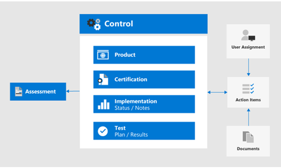

# Compliance Score en Compliance Manager gebruiken om verbeteracties te beheren

Microsoft Compliance Score en Compliance Manager kunnen samen worden gebruikt om verbeteringen in verband met de regelgeving inzake gegevensprivacy te beheren, zoals de [Algemene Verordening Gegevensbescherming (AVG) van](../compliance/gdpr.md)de Europese Unie, de California Consumer Protection Act [CCPA),](../compliance/ccpa-faq.md)HIPAA-HITECH (US Health Care Privacy Act) en de Brazil Data Protection Act (LGPD). 

In dit artikel vindt u richtlijnen voor het gebruik van deze hulpmiddelen voor gegevensprivacydoeleinden.

>[!Note]
>De klantacties in Compliance Manager zijn aanbevelingen. Het is aan u om de effectiviteit van deze aanbevelingen in uw regelgevingsomgevingen te evalueren voordat deze worden geïmplementeerd. Aanbevelingen van compliancemanagers mogen niet worden geïnterpreteerd als een garantie voor naleving.
>

## Geplande updates voor Compliance Score en Compliance Manager

[Compliance Score](../compliance/compliance-score.md) (momenteel in preview) vereist het toevoegen van uw doelbeoordelingen voor een verordening (zoals GDPR) van de [Compliance Manager.](../compliance/compliance-manager-overview.md) In een toekomstige release wordt een groot deel van de functionaliteit in Compliance Manager samengevoegd tot een uniforme Compliance Score-ervaring, waardoor er minder behoefte is aan meerdere tools.

Dit zijn de tools voor uw abonnement, waarvoor u zich moet aanmelden:

- [Compliance Score in het Microsoft Compliance-beheercentrum](https://compliance.microsoft.com/compliancescore)
- [Compliance Manager in de Microsoft Services Trust Portal](https://servicetrust.microsoft.com/ComplianceManager/V3)

## Aan de slag met Compliance Manager 

[Compliance Manager](../compliance/working-with-compliance-manager.md) (momenteel in preview) is een gratis workflowgebaseerde risicobeoordelingstool in de Microsoft Service Trust Portal voor het beheren van regelgevingsactiviteiten met betrekking tot Microsoft-cloudservices. Als onderdeel van uw Microsoft 365- of Azure Active Directory -abonnement (Azure AD) helpt Compliance Manager u bij het beheren van naleving van de regelgeving binnen het gedeelde verantwoordelijkheidsmodel voor Microsoft-cloudservices.

Hoewel u uw algemene nalevingsscore bekijken en een aantal andere functies uitvoeren op de **compliancescorepagina** van het Compliance center, moet u Compliance Manager gebruiken via de Services Trust Portal om eerst beoordelingen voor uw regelgeving inzake gegevensprivacy te configureren. Gegevens uit deze beoordelingen worden vervolgens weergegeven in de nalevingsscore voor verder bekijken en filteren. 

Met behulp van de interface voor Compliance Manager u een of meer gegevensprivacygerelateerde regelgevingssjablonen selecteren en deze groeperen om vereiste verbeteringsacties in de set te beoordelen en bij te houden. U ook informatie bekijken over de besturingselementen die elke verordening vraagt om specifiek voor de doelservice, gescheiden door microsoft versus door de klant beheerde besturingselementen.

Beoordelingen en verbeteringsstatus die hier zijn geselecteerd, worden ook weergegeven in de compliancescore in het Microsoft Compliance Center, die het belang van uw eerste installatie in Compliance Manager benadrukken. Deze relaties worden weergegeven in deze figuur.
 

Hier volgen de belangrijkste stappen om u op weg te helpen.

### 1. Beoordelingssjablonen

Vanuit de Compliance Manager is de eerste stap het toevoegen van beoordelingen die specifiek zijn voor de privacywetgeving van belang en deze op te nemen in een gedefinieerde groep "Gegevensprivacyverordeningen".

[Groepen](../compliance/working-with-compliance-manager.md#groups) zijn containers waarmee u beoordelingen organiseren en algemene informatie en werkstroomtaken delen tussen beoordelingen met dezelfde of gerelateerde door de klant beheerde besturingselementen. Wanneer twee verschillende beoordelingen in dezelfde groep door de klant beheerde controle delen, worden de voltooiing van implementatiegegevens, tests en status voor het besturingselement automatisch gesynchroniseerd met hetzelfde besturingselement in een andere beoordeling in de groep. Dit verenigt de toegewezen actie-items voor elk besturingselement in de groep en vermindert dubbel werk. 

U er ook voor kiezen om groepen te gebruiken om te organiseren. Beoordelingen per jaar, gebied, nalevingsnorm of andere groeperingen om uw nalevingswerk te organiseren.

### 2. Actiepunten

Zodra de beoordelingen zijn toegevoegd, u actiepunten bekijken die specifiek zijn voor elke groep of afzonderlijke verordening:

- **Actielijst voor verbetering.** Navigeer naar de lijst Actieitems en bekijk de verbeteringsacties die zijn gekoppeld aan de regelgeving die in de groep is opgenomen. Veel acties omvatten regelgeving, zodat een enkele lijst item kan meerdere verordeningen vertegenwoordigen. 
 
- **Verbetering actie filtering.** Voor veel regelgeving voor gegevensprivacy en groepen regelgeving kan de lijst met verbeteracties vrij groot zijn, dus overweeg de lijst te filteren met behulp van de vervolgkeuzelijst filteren. Als u bijvoorbeeld 'technische besturingselementen' selecteert, wordt de lijst teruggebracht tot alleen de taken met een technische implementatie in de organisatie, omdat veel van de acties gerelateerd zijn aan administratieve bewerkingen in verschillende aspecten van het bedrijf die ook zijn gedocumenteerd in Compliance Manager. In dit artikel zullen we ons richten op technische controles, dus deze filteringsaanpak wordt aanbevolen.
 
- **Aanvullende informatie en beoordeling.** Voor elke actie u op de link naar **Lees meer**klikken, die u meer vertelt over de aanbevolen activiteit of **Beoordeling**, waarmee u het volgende doen:
 
   - De actie toewijzen aan iemand in uw organisatie om te beheren
   - Documenten beheren met betrekking tot het aanpakken van de actie
   - Status voor het item opgeven
   - Uitvoerings- en testdatums opgeven
   - Aanvullende informatie, implementatienotities en testplannotities voor de onderwerpactie opnemen
  
- **Niet-toepasselijke items als buiten het bereik.** Sommige verbeteringsacties in de lijst Actieitems zijn mogelijk niet van toepassing op uw geplande implementatie. U opgeven dat ze buiten het bereik van Compliance Manager vallen en de actie en het bewijs verwijderen uit de berekening van de waarde van de nalevingsscore. 

Als uw organisatie er bijvoorbeeld voor heeft gekozen om Microsoft Managed Key te gebruiken, is een aanbeveling voor Het gebruik van klantsleutel niet van toepassing op uw implementatie. In dit geval markeert uw organisatie deze als **Niet in het bereik** in de **beheeracties** voor de toepasselijke regelgevingssjabloon.
 
### 3. Controle info

Bekijk de controlegegevens voor elke beoordelingsgroep voor een [beoordelingsspecifieke](../compliance/compliance-manager-overview.md#controls) weergave. Dit biedt een beoordelingsspecifieke weergave, die verschil maakt dan de lijst met actie-items, die een technische controlespecifieke weergave biedt.
 

Navigeer naar de lijst **Met de controlegegevens** en bekijk de lijst met services in het bereik van de betreffende verordening. 
 
Regelgevingsspecifieke controlegroepen vermelden de acties die worden uitgevoerd door het controlegebied voor elk servicegebied. Voor elke reeks acties biedt de Compliance Manager meer informatie over de actie en kan de organisatie beoordelingsopties voorstellen of bieden om de organisatie te helpen bij het kiezen van een controleaanpak.
 
Houd er rekening mee dat deze interface de mogelijkheid biedt om details te bekijken die specifiek zijn voor de technische actie, samen met de status van acties met betrekking tot de controle en aanvullende context over de regelgeving waaraan de actie is gerelateerd.

### 4. Sjabloon downloaden

Voor degenen die meer vertrouwd zijn met spreadsheet-gebaseerde regelgevingsanalyse, een andere aanpak is het downloaden van de sjabloon voor elke respectieve beoordeling met behulp van de sjablonen vermelding. De gedownloade sjablonen bevatten zowel de wettelijke als technische controle-informatie voor elke sjabloon en kunnen voor bepaalde rollen gemakkelijker zijn om te navigeren/filteren en bedrijfsspecifieke weergaven te genereren.
 
U ook een nieuwe sjabloon toevoegen die is aangepast voor uw organisatie op basis van een bestaande sjabloon, met **Sjabloon toevoegen.** Dit vereist dat u een sjabloon naar keuze downloadt (zoals HIPAA/HITECH)), deze vervolgens voor uw doeleinden wijzigt en terug uploadt naar de Compliance Manager-tool, waar het nu beoordelingen en scores zal stimuleren die vergelijkbaar zijn met andere sjablonen en beoordelingen als onderdeel van de algemene compliancemanager en compliancescoretoolset.
 
>[!Tip]
>Als u een groot aantal regelgeving of overlappende verbeteringsacties behandelt, u overwegen elke betreffende sjabloon te downloaden en de gegevenssets te combineren, verbeteringsacties of controletypen die niet van toepassing zijn op uw organisatie verwijderen en opnieuw uploaden. Dit kan gemakkelijker zijn dan het navigeren in elke sectie controle-informatie en het markeren van elk als buiten het bereik.
>

## Compliance Score

Zodra de beoordelingen en beoordelingsspecificaties zijn uitgevoerd in Compliance Manager, u nu naar de [compliancescore-tool](../compliance/compliance-score.md) gaan en de score bekijken en de gegevens verder snijden en de gegevens in blokjes snijden, inclusief het controlegebied.

De Compliance Score-tool in het Microsoft 365 Compliance-beheercentrum biedt verschillende benaderingen voor het beoordelen en filteren van nalevingsgegevens die zijn verkregen van Compliance Manager en verschillende Microsoft 365-services. Deze tool wordt automatisch bijgewerkt wanneer verschillende configuratie-instellingen worden geïmplementeerd en deelt signalen met de Microsoft Secure Score, zodat veel verbeteringsacties in beide scores worden weergegeven. 
 
De compliancescore biedt:

- Een verzamelde score, uitgesplitst door Microsoft en door klanten beheerde besturingselementen
- Een rollup van verbeteracties en voltooiingsstatus
- Een lijst van Microsoft 365-oplossingen die van invloed zijn op uw score

### Hoe de nalevingsscore wordt berekend

Kortom, de score wordt berekend op basis van een combinatie van Microsoft en door klanten beheerde controle-implementaties, zoals nader wordt uitgelegd in het [berekeningsartikel van](../compliance/compliance-score-methodology.md)de Microsoft Compliance Score .

Besturingselementen krijgen een scorewaarde toegewezen op basis van of ze verplicht of discretionair zijn en of ze preventief, detective of correctief zijn. Deze vormen gezamenlijk het risico dat het niet ten opzichte van andere controles wordt uitgevoerd.

Zoals gepresenteerd in het microsoft compliance score berekeningsartikel, krijgen preventieve controles een hogere score dan detective- en corrigerende controles en krijgen verplichte controles een hogere score dan discretionaire controles.
 
Houd er rekening mee dat de gebruikersinterface van de beheerder van de nalevingsscore deze parameters niet vermeldt en ook niet de mogelijkheid biedt om erop te filteren. Als u de bijbehorende sjabloon echter downloadt van het gereedschap Compliance Manager, worden deze parameters in de resulterende gegevensset wel vermeld voor de meeste regelgeving.

Voor technische besturingselementen wordt de score voor verbeteringsactie automatisch bijgewerkt zodra de bijbehorende functie is geactiveerd. Andere, niet-technische &mdash; controleacties, zoals acties die operationeel zijn of gerelateerd zijn aan documentatie, moeten handmatig worden geregistreerd in de tool Compliance Manager op de Services Trust &mdash; Portal. 

U veel ook de uitvoering van bepaalde verbetering acties voor andere doeleinden &mdash; voor bijvoorbeeld het gebruik van retentie labels om andere redenen dan de naleving van de regelgeving voor gegevensprivacy, zodat u krediet zou krijgen voor het gebruik van een dergelijke &mdash; functie, zelfs als het wordt gebruikt voor andere doeleinden, en geen deel uit van een opzettelijke naleving actie.

Uw compliancescore moet worden beschouwd als een relatieve maatregel om verbetering op grote schaal bij te houden. Je moet niet streven naar een perfecte score. 

### Aanvullende richtlijnen

Hier volgen enkele belangrijke tips voor het gebruik van Compliance Score en Compliance Manager voor u om naleving van de regelgeving voor gegevensprivacy te bereiken:

- Elke verordening voor gegevensprivacy heeft een combinatie van technische controles, documentatiespecificaties en operationele, proces- en rapportagevereisten. Al deze verschijnen in de verbetering acties. 

- Dit artikel richt zich op een subset van de technische besturingselementen die zijn opgegeven voor gegevensprivacy in Compliance Manager en Compliance Score. Raadpleeg de compliancemanager-tool en [documentatie](../compliance/compliance-score.md) voor meer informatie over niet-technische administratieve controles.

- Als u de weergave van verbeteracties wilt richten op uw interessegebied, u filteren op actietype op het tabblad **Oplossingen** in de beheerder van de nalevingsscore.

- Het relatieve belang en de prioriteit van verbeteringsacties die zijn geïdentificeerd in de nalevingsscore, moet worden beschouwd als onderdeel van een bredere risicobeoordeling, samen met het risico op gegevensprivacy dat u hebt bepaald dat uw organisatie moet beheren. 

- Als u een wereldwijde organisatie bent en u meerdere sjablonen voor gegevensprivacyregelgeving toevoegt aan Compliance Manager als beoordelingen, combineert compliancescore elke toepasselijke sjabloon in een veldvermelding voor elke verbeteringsactie.
 
- Zelfs met verbeteringsactie aggregatie over meerdere wettelijke vereisten, als de regelgevingsbeoordelingssjablonen voor GDPR, LGPD, CCPA en HIPAA-HITECH worden geselecteerd, bijvoorbeeld, zullen bijna 400 verbeteringsacties worden geselecteerd in compliancescore. Als u deze lange lijst beter wilt aanpakken, gebruikt u het filter voor verbeteringsactie om het resultaat te verlagen naar een meer beheersbare lijst.

- Het filter Categorieën biedt een middel om verbeteracties te filteren op logische groepering, waarop de artikelen Track, Prevent, Protect, Retain en Investigate in deze algemene oplossing zijn afgestemd. 

- Sommige van de controles die in de verbeteringsacties worden vermeld kunnen meer direct worden gebonden aan een specifiek regelgevend artikel, terwijl andere controles indirect meer in verband met de geest van een verordening kunnen worden verbonden en vele tijden enkel dingen zijn u zou moeten nadenken doend hoe dan ook.

