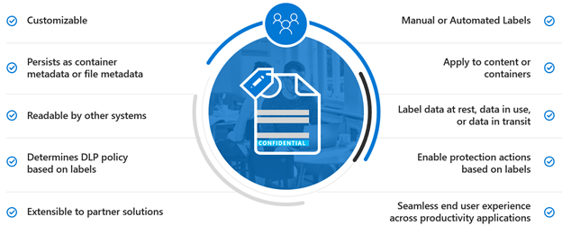
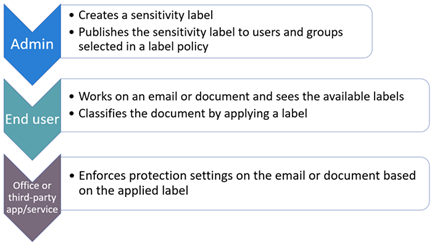
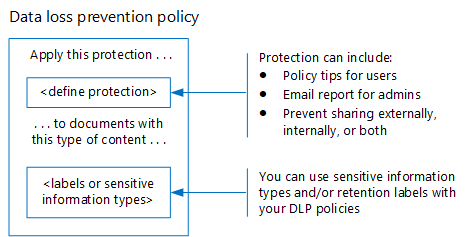
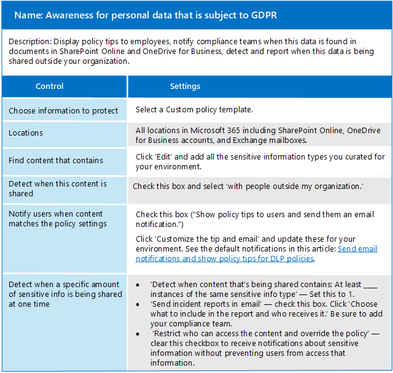

# Informatie beschermen die onderworpen is aan de privacywetgeving van gegevens

In uw abonnement kunnen een aantal besturingselementen voor informatiebescherming worden gebruikt om te helpen bij het voldoen aan de nalevingsbehoeften en -voorschriften voor gegevens over de privacy. Deze omvatten General Data Protection Regulation (GDPR), HIPAA-HITECH (de United States health care privacy act), California Consumer Protection Act (CCPA) en de Brazil Data Protection Act (LGPD).

Deze besturingselementen bevinden zich binnen de volgende oplossingsgebieden:

- Vertrouwelijkheidslabels
- Preventie van gegevensverlies (DLP)
- Ome -versleuteling van Office-berichten (OME)
- Toegangsbesturingselementen voor teams en sites

>[!Note]
>Deze oplossing beschrijft beveiligings- en nalevingsfuncties om informatie die onderworpen is aan de regelgeving inzake gegevensprivacy te beschermen. Zie [Microsoft 365-beveiligingsdocumentatie](https://docs.microsoft.com/microsoft-365/security/)voor een volledige lijst met beveiligingsfuncties in Microsoft 365. Zie [Microsoft 365-nalevingsdocumentatie](https://docs.microsoft.com/microsoft-365/compliance/)voor een volledige lijst met nalevingsfuncties in Microsoft 365.
>

## Regelgeving voor gegevensprivacy die van invloed is op de controle op informatiebescherming

Hier is een voorbeeldlijst van regelgeving voor gegevensprivacy die betrekking kunnen hebben op informatiebeschermingscontroles:

- AVG Artikel 5, lid 1, onder f))
- GDPR-artikel (32,1) onder a)
- LGPD Artikel 46
- HIPAA-HITECH (45 CFR 164.312(e)(1))
- HIPAA-HITECH (45 C.F.R. 164.312(e)(2)ii))

Zie de [beoordeling van de privacy van gegevens risico's en identificeren gevoelige items artikel](information-protection-deploy-assess.md) voor meer informatie over elk van de bovenstaande.

De privacyregels voor gegevensbescherming bevelen aan:

- Bescherming tegen verlies of ongeautoriseerde toegang, gebruik en/of transmissie.
- Op risico's gebaseerde toepassing van beschermingsmechanismen.
- Gebruik van encryptie waar nodig.

Uw organisatie wil microsoft 365-inhoud mogelijk ook beschermen voor andere doeleinden, zoals andere nalevingsbehoeften of om zakelijke redenen. Het opzetten van uw informatiebeschermingsregeling voor gegevensprivacy moet worden uitgevoerd als onderdeel van de algemene planning, implementatie en beheer van informatiebescherming.

Om u te helpen aan de slag te gaan met een informatiebeschermingsschema in Microsoft 365, bevat de volgende sectie een korte lijst met gerelateerde mogelijkheden en verbeteringsacties voor Microsoft 365. De lijst bevat mogelijkheden en verbeteringsacties die van toepassing zijn op de regelgeving inzake gegevensprivacy. Echter, de lijst bevat geen oudere technologieën als er een nieuwere mogelijkheid die grotendeels vervangt de oudere. Informatierechtenbeheer (IRM) voor SharePoint en OneDrive is bijvoorbeeld niet opgenomen in de lijst, maar gevoeligheidslabels zijn wel opgenomen.

## Informatiebeveiliging beheren in Microsoft 365

Microsoft-oplossingen voor [informatiebescherming](../compliance/protect-information.md) bevatten een aantal geïntegreerde mogelijkheden voor Microsoft 365, Microsoft Azure en Microsoft Windows. In Microsoft 365 omvatten oplossingen voor informatiebescherming:

- [Serviceversleuteling met klantsleutel](../compliance/customer-key-overview.md)
- [Gevoelige informatietypen](../compliance/what-the-sensitive-information-types-look-for.md) (beschreven in de [beoordeling van de privacyrisico's van gegevens en het identificeren van het artikel over gevoelige items)](information-protection-deploy-assess.md)
- [Vertrouwelijkheidslabels](../compliance/sensitivity-labels.md) 
  - Service/containerniveau
  - Client-side/content-level
  - Geautomatiseerd voor data-at-rest in SharePoint en OneDrive
- Preventie van gegevensverlies (DLP, Data Loss Prevention)
- [Office 365 Message Encryption new capabilities (OME)](../compliance/ome.md) and OME [Advanced Message Encryption](../compliance/ome-advanced-message-encryption.md)

Bovendien zijn bescherming op site- en bibliotheekniveau belangrijke mechanismen om in elk beschermingsstelsel op te nemen.

Zie voor informatie over andere mogelijkheden voor informatiebescherming buiten Microsoft 365:

- [Microsoft Cloud Application Security (MCAS)](https://docs.microsoft.com/cloud-app-security/)
- [Azure Information Protection](https://docs.microsoft.com/azure/information-protection/what-is-information-protection)
- [Microsoft Endpoint Manager](https://www.microsoft.com/microsoft-365/microsoft-endpoint-manager)
- [Windows-gegevensbescherming](https://docs.microsoft.com/windows/security/information-protection/windows-information-protection/protect-enterprise-data-using-wip)

## Vertrouwelijkheidslabels

Met gevoeligheidslabels van het Microsoft Information Protection framework u de gegevens van uw organisatie classificeren en beschermen zonder de productiviteit van gebruikers en hun vermogen om samen te werken te belemmeren.

### Voorwaarden voor gevoeligheidslabels

Voltooi deze activiteiten voordat u een van de hieronder gemarkeerde mogelijkheden op basis van gevoeligheidslabels implementeert:

1. Begrijp het volgende:
   - **Zakelijke vereisten.** Besbree de zakelijke redenen voor het toepassen van gevoeligheidslabels in uw onderneming. Bijvoorbeeld uw vereisten voor gegevensprivacy voor informatiebescherming.
   - **Gevoeligheidslabelmogelijkheden.** Gevoeligheidsetikettering kan complex worden, dus zorg ervoor dat u de documentatie van de [gevoeligheidslabels](../compliance/sensitivity-labels.md) leest voordat u aan de slag gaat.
   - **Belangrijke dingen om te onthouden** Gevoeligheidslabels worden beheerd in het Microsoft Compliance-beheercentrum, maar de targeting- en toepassingsopties variëren aanzienlijk.
      - Er zijn gevoeligheidslabels voor sites, groepen en Teams op containerniveau (de instellingen zijn niet van toepassing op inhoud in de container). Deze worden gepubliceerd aan gebruikers en groepen die ze toepassen wanneer een site, groep of team is ingericht.
      - Er zijn gevoeligheidslabels voor actieve inhoud. Deze worden ook gepubliceerd aan gebruikers of groepen, die ze handmatig toepassen of wanneer ze automatisch worden toegepast wanneer:
        - Het bestand wordt geopend/bewerkt/opgeslagen, naar het bureaublad van de gebruiker of naar een SharePoint-site.
        - Er wordt een e-mail opgesteld en verzonden.
      - Er zijn gevoeligheidslabels voor automatische toepassing op bestanden in rest in SharePoint en OneDrive, naast e-mails die onderweg zijn via Exchange. Deze zijn gericht op alle sites of specifieke sites en automatisch van toepassing op de bestanden in rust in deze omgevingen.

2. Rationaliseren van de huidige gevoeligheidsetikettering met vroegere of alternatieve methoden

   - Azure Information Protection

      Het huidige gevoeligheidsetiketteringssysteem moet mogelijk worden afgestemd op de bestaande implementatie van [Azure Information Protection-etikettering.](../compliance/sensitivity-labels.md#sensitivity-labels-and-azure-information-protection)
   - Ome

      Als u van plan bent om moderne gevoeligheidsetikettering te gebruiken voor e-mailbescherming en bestaande e-mailversleutelingsmethoden zoals OME zijn van kracht, kunnen ze naast elkaar bestaan, maar u moet de scenario's begrijpen waarin een van beide moet worden toegepast. Zie [Office 365 Message Encryption new capabilities (OME),](#office-365-message-encryption-ome-new-capabilities)die een tabel bevat waarin moderne bescherming van het gevoeligheidslabel wordt vergeleken met bescherming op basis van OME.

3. Plan voor integratie in een breder stelsel voor informatiebescherming. Naast coëxistentie met OME kunnen de huidige gevoeligheidslabels worden gebruikt langs de kant van mogelijkheden zoals Microsoft 365 data loss prevention (DLP) en Microsoft Cloud App Security. Zie [Gevoeligheidslabels en Microsoft Cloud App Security](../compliance/sensitivity-labels.md#sensitivity-labels-and-microsoft-cloud-app-security) om de doelstellingen voor gegevensbescherming te bereiken.

4. Ontwikkel een gevoeligheidslabelclassificatie- en controleschema. Zie [Taxonomie voor gegevensclassificatie en gevoeligheidslabel](https://aka.ms/dataclassificationwhitepaper).

### Algemene richtlijnen

1. **Schemadefinitie.** Voordat u technische mogelijkheden gebruikt om labels en beveiliging toe te passen, werkt u in uw hele organisatie aan het definiëren van een classificatieschema. Mogelijk beschikt u al over een classificatieschema, waardoor het gemakkelijker wordt om persoonlijke gegevens toe te voegen. 
2. **Slag.** Begin met het bepalen van het aantal en de namen van labels die moeten worden geïmplementeerd. Doe deze activiteit zonder je zorgen te maken over welke technologie je moet gebruiken en hoe labels worden toegepast. Pas dit schema universeel toe in uw hele organisatie, inclusief gegevens die zich op locatie en in andere cloudservices bevinden.
3. **Aanvullende aanbevelingen** Overweeg bij het ontwerpen en implementeren van beleid, labels en voorwaarden de volgende aanbevelingen:

   - **Gebruik het bestaande classificatieschema (indien aanwezig).** Veel organisaties gebruiken al gegevensclassificatie in een of andere vorm. Zorgvuldig evalueren van het bestaande label schema en indien mogelijk, gebruiken zoals het is. Het gebruik van bekende labels die herkenbaar zijn voor uw eindgebruikers zal de acceptatie stimuleren.
   - **Begin klein.** Er is vrijwel geen limiet aan het aantal labels dat u maken. Grote aantallen labels en sublabels kunnen de adoptie echter vertragen.
   - **Gebruik scenario's en use cases.** Identificeer veelvoorkomende gebruiksgevallen binnen uw organisatie en gebruik scenario's die zijn afgeleid van de regelgeving inzake gegevensprivacy waaraan u bent onderworpen. Controleer of de beoogde label- en classificatieconfiguratie in de praktijk zal werken.
   - **Vraag elk verzoek voor een nieuw label.** Heeft elk scenario of use case echt een nieuw label nodig of kun je gebruiken wat je al hebt? Het tot een minimum beperken van het aantal etiketten verbetert de adoptie.
   - **Gebruik sublabels voor belangrijke afdelingen.** Sommige afdelingen hebben specifieke behoeften die specifieke labels vereisen. Definieer deze labels als sublabels voor een bestaand label en overweeg scoped policies te gebruiken dat is toegewezen aan gebruikersgroepen in plaats van wereldwijd.
   - **Overweeg scoped beleid.** Beleid gericht op subsets van gebruikers voorkomt overbelasting van etiketten. Met een scoped-beleid u functie- of afdelingsspecifieke labels of sublabels toewijzen aan alleen werknemers die voor die specifieke afdeling werken. 
   - **Gebruik betekenisvolle labelnamen.** Probeer geen jargon, normen of afkortingen als labelnamen te gebruiken. Probeer namen te gebruiken die resoneren met de eindgebruiker om de acceptatie te verbeteren. In plaats van labels als PII, PCI, HIPAA, LBI, MBI en HBI te gebruiken, u namen als Non-Business, Public, General, Confidential en Highly Confidential overwegen.

### Gevoeligheidslabels maken en implementeren voor sites, groepen en teams

Wanneer u [gevoeligheidslabels](../compliance/sensitivity-labels-teams-groups-sites.md) maakt in het Microsoft 365-compliancecentrum, u deze nu toepassen op deze containers:

- Microsoft Teams-sites
- Microsoft 365-groepen (voorheen Office 365-groepen)
- SharePoint-sites

Gebruik de volgende labelinstellingen om de inhoud in die containers te beschermen:

- Privacy (openbaar of privé) van de teamsites met groep verbonden Microsoft 365
- Externe gebruikerstoegang
- Toegang vanaf niet-beheerde apparaten

Voor gegevensprivacy moet externe uitwisseling voor containers die worden gebruikt voor het opslaan van inhoud met gevoelige persoonlijke gegevens worden voorkomen, markeert u de bestanden met de gegevens als privé en vereist u beheerde apparaten.

### Gevoeligheidslabels maken en implementeren voor inhoud

Met gevoeligheidslabels die op bestanden worden toegepast, u de inhoud ervan versleutelen, de inhoud watermerken en andere besturingselementen definiëren voor inhoud van Office-toepassingen, waaronder Outlook en Office op internet.

Wanneer u klaar bent om de gegevens van uw organisatie te beschermen met gevoeligheidslabels:

1. **Maak de labels.** Maak en geef uw gevoeligheidslabels op basis van de classificatie-taxonomie van uw organisatie voor verschillende gevoeligheidsniveaus van inhoud. Zie de [whitepaper Data Classification and Sensitivity Label Taxonomy](https://aka.ms/dataclassificationwhitepaper)voor meer informatie over het ontwikkelen van een classificatie-taxonomie.
2. **Definieer wat elk label kan doen.** Configureer de gewenste beveiligingsinstellingen die aan elk label zijn gekoppeld. U wilt bijvoorbeeld dat inhoud met een lagere gevoeligheid (zoals een label 'Algemeen') alleen een kop- of voettekst heeft toegepast, terwijl inhoud met een hogere gevoeligheid (zoals een label 'Vertrouwelijk' een watermerk moet hebben en versleuteling moet zijn ingeschakeld.
3. **Publiceer de labels.** Nadat uw gevoeligheidslabels zijn geconfigureerd, publiceert u deze met behulp van een labelbeleid. Bepaal welke gebruikers en groepen de labels moeten hebben en welke beleidsinstellingen ze moeten gebruiken. Een enkel label is herbruikbaar. U definieert het eenmaal en vervolgens u het opnemen in verschillende labelbeleid dat aan verschillende gebruikers is toegewezen.

Zodra u gevoeligheidslabels publiceert vanuit het Microsoft 365-compliancecentrum, worden ze weergegeven in [Office-apps](../compliance/sensitivity-labels-office-apps.md) voor gebruikers om inhoud te classificeren en te beschermen terwijl deze is gemaakt of bewerkt.

Voor gegevensprivacy past u handmatig een gevoeligheidslabel met versleuteling en andere regels toe op e-mail of inhoud die gevoelige persoonlijke gegevens bevat.

>[!Note]
>Gevoeligheidslabels met versleuteling die zijn toegepast op e-mail, hebben een overlappende functionaliteit met OME. Zie [Beveiligde e-mailscenario's die worden vergeleken met OME- en gevoeligheidslabels](#secure-email-scenarios-comparison-with-ome-and-sensitivity-labels).

### Automatische labeling aan clientzijde wanneer gebruikers documenten bewerken of e-mails opstellen

Wanneer u een gevoeligheidslabel maakt, u [dat label automatisch toewijzen aan](../compliance/apply-sensitivity-label-automatically.md) inhoud, inclusief e-mail, wanneer het overeenkomt met de voorwaarden die u opgeeft.

De mogelijkheid om gevoeligheidslabels automatisch toe te passen op inhoud is belangrijk omdat:

- U hoeft uw gebruikers niet te trainen wanneer ze elk van uw classificaties moeten gebruiken.
- U hoeft niet te vertrouwen op gebruikers om alle inhoud correct te classificeren.
- Gebruikers hoeven niet meer op de hoogte te zijn van uw beleid, maar kunnen zich concentreren op hun werk.

Automatische etikettering ondersteunt het aanbevelen van een label aan gebruikers en het automatisch toepassen van een label. Maar in beide gevallen beslist de gebruiker of hij het label accepteert of weigert, om de juiste etikettering van inhoud te garanderen.

Deze labeling aan clientzijde heeft minimale vertraging voor documenten omdat het label kan worden toegepast nog voordat het document is opgeslagen. Niet alle client-apps ondersteunen echter autolabeling. Deze mogelijkheid wordt ondersteund door de unified labelingclient van Azure Information Protection en [enkele versies van Office-apps](../compliance/sensitivity-labels-office-apps.md#support-for-sensitivity-label-capabilities-in-apps).

Zie [Automatisch labelen configureren voor Office-apps voor configuratie-instructies.](../compliance/sensitivity-labels-office-apps.md#support-for-sensitivity-label-capabilities-in-apps)

Voor gegevensprivacy past u automatisch gevoeligheidslabels toe voor inhoud die gevoelige persoonlijke gegevens bevat.

### Automatische labeling aan servicezijde wanneer de inhoud al is opgeslagen

Deze methode wordt aangeduid als automatische classificatie met gevoeligheidslabels. U het ook horen aangeduid als automatische labeling voor gegevens in rust (voor documenten in SharePoint en OneDrive) en gegevens in transit (voor e-mail die wordt verzonden of ontvangen door Exchange). Voor Exchange bevat het geen e-mails in postvakken in rust.
 
Omdat deze etikettering wordt toegepast door de service zelf in plaats van door de toepassing van de gebruiker, hoeft u zich geen zorgen te maken over welke apps gebruikers hebben en welke versie. Hierdoor is deze mogelijkheid direct beschikbaar in uw hele organisatie en geschikt voor etikettering op schaal. Het beleid voor automatische labeling ondersteunt geen aanbevolen etikettering omdat de gebruiker geen interactie heeft met het etiketteringsproces. In plaats daarvan voert de beheerder het beleid in de simulatiemodus uit om ervoor te zorgen dat de inhoud correct wordt gelabeld voordat het label daadwerkelijk wordt toegepast.

Zie [Automatisch labelingsbeleid configureren voor SharePoint, OneDrive en Exchange voor configuratie-instructies.](../compliance/apply-sensitivity-label-automatically.md#how-to-configure-auto-labeling-policies-for-sharepoint-onedrive-and-exchange)

Voor gegevensprivacy binnen zorgwekkende sites, pushgevoeligheidslabels voor automatische versleuteling van inhoud die gevoelige persoonlijke informatie bevat.

## Preventie van gegevensverlies 

U [gegevensverliespreventie (DLP)](../compliance/data-loss-prevention-policies.md) in Microsoft 365 gebruiken om risicovolle, onbedoelde of ongepaste delen op te sporen, te waarschuwen en te blokkeren, zoals het delen van gegevens die persoonlijke gegevens bevatten, zowel intern als extern.

DLP stelt u in staat om:

- Identificeer en monitor risicovolle deelactiviteiten.
- Leid gebruikers met richtlijnen in de context om de juiste beslissingen te nemen.
- Beleid voor gegevensgebruik afdwingen op inhoud zonder de productiviteit te belemmeren.
- Integreren met classificatie en etikettering om gegevens te detecteren en te beschermen wanneer deze worden gedeeld.

### Ondersteunde workloads voor DLP

Met een DLP-beleid in het Microsoft 365-compliancecentrum u gevoelige items op veel locaties in Microsoft 365 identificeren, controleren en automatisch beveiligen, zoals Exchange Online, SharePoint, OneDrive en Microsoft Teams.

U bijvoorbeeld elk document identificeren dat een creditcardnummer bevat dat is opgeslagen op elke OneDrive-site, of u alleen de OneDrive-sites van specifieke personen controleren.

U ook gevoelige items controleren en beveiligen in de lokaal geïnstalleerde versies van Excel, PowerPoint en Word, waaronder de mogelijkheid om gevoelige items te identificeren en DLP-beleid toe te passen. DLP biedt continue monitoring wanneer mensen inhoud delen vanuit deze Office-apps.

Dit cijfer toont een voorbeeld van DLP die persoonsgegevens beschermt.

DLP wordt gebruikt om een document of e-mail met een statusrecord te identificeren en blokkeert vervolgens automatisch de toegang tot dat document of blokkeert de e-mail om te worden verzonden. DLP waarschuwt de ontvanger vervolgens met een beleidstip en stuurt een waarschuwing naar de eindgebruiker en beheerder.

### Planning voor DLP

Plan uw DLP-beleid voor: 

- Uw zakelijke vereisten.

- Een risicogebaseerde beoordeling van de organisatie zoals beschreven in de beoordeling van [de privacyrisico's van gegevens en het identificeren van gevoelige items.](information-protection-deploy-assess.md)

- Andere mechanismen voor informatiebescherming en governance die van kracht zijn of die de privacy van gegevens plannen.

- De gevoelige informatietypen die u hebt geïdentificeerd voor persoonlijke gegevens op basis van uw beoordelingswerk zoals beschreven in het artikel over de [privacy van gegevens beoordelen en het artikel van gevoelige items identificeren.](information-protection-deploy-assess.md) DLP-beleidsvoorwaarden kunnen worden gebaseerd op zowel gevoelige informatietypen als bewaarlabels.

- De bewaarlabels die u moet opgeven, moeten DLP-voorwaarden opgeven. Zie de [gegevens die onder de verordening gegevensprivacy vallen in uw organisatieartikel](information-protection-deploy-govern.md) voor meer informatie.

- Doorlopend DLP-beleidsbeheer, waarbij iemand in de organisatie beleid moet uitvoeren en afstemmen op wijzigingen in gevoelige informatietypen, bewaarlabels, regelgeving en nalevingsbeleid.

Hoewel gevoeligheidslabels niet kunnen worden gebruikt in DLP-beleidsvoorwaarden, kunnen bepaalde beveiligingsscenario's om toegang te voorkomen haalbaar zijn met alleen gevoeligheidslabels die automatisch kunnen worden toegepast op basis van gevoelige informatietypen. Als er een etikettering met een robuuste gevoeligheid is ingevoerd, moet u overwegen of DLP moet worden gebruikt om de bescherming te vergroten, omdat:

  - DLP kan het delen van bestanden voorkomen. Gevoeligheidslabels kunnen gewoon de toegang voorkomen.

  - DLP heeft meer gedetailleerde controleniveaus in termen van regels, voorwaarden en acties.

  - DLP-beleid kan worden toegepast op chat- en kanaalberichten van Teams. Gevoeligheidslabels kunnen alleen worden toegepast op documenten en e-mail.

### DLP-beleid

DLP-beleid is geconfigureerd in het Microsoft Compliance-beheercentrum en geeft het beschermingsniveau op, het gevoelige informatietype waar het beleid naar op zoek is en de doelworkloads. Hun basiscomponenten bestaan uit het identificeren van de bescherming en de soorten gegevens.

Hier is een voorbeeld DLP beleid voor het bewustzijn van gdpr.

Zie [dit artikel](../compliance/create-test-tune-dlp-policy.md) voor meer informatie over het maken en toepassen van DLP-beleid.

### Beschermingsniveaus voor gegevensprivacy

In de volgende tabel worden drie configuraties weergegeven met behulp van de bescherming met DLP.

De eerste configuratie, Awareness, kan worden gebruikt als uitgangspunt en minimumniveau van bescherming om tegemoet te komen aan de nalevingsbehoeften voor de regelgeving inzake gegevensprivacy.

>[!Note]
>Naarmate het beschermingsniveau toeneemt, zal het vermogen van gebruikers om informatie te delen en te openen in sommige gevallen afnemen en kunnen ze mogelijk hun productiviteit of vermogen om dagelijkse taken uit te voeren beïnvloeden.
>

Om uw medewerkers te helpen productief te blijven in een veiligere omgeving wanneer u het beschermingsniveau verhoogt, neemt u de tijd om hen te trainen en te informeren over nieuw beveiligingsbeleid en -procedures.

### Voorbeeld van het gebruik van gevoeligheidslabels met DLP

Gevoeligheidslabels kunnen samenwerken met DLP om gegevensprivacy te bieden in een sterk gereguleerde omgeving. Hier volgen de belangrijkste stappen van de geïntegreerde implementatie:

1. Wettelijke en anderszins zakelijke vereisten voor gegevensprivacy worden gedocumenteerd.
2. Doelgegevensbronnen, -typen en -eigendom worden gekarakteriseerd ten opzichte van problemen met de gegevensprivacy.
3. Er wordt een algemene strategie vastgesteld om aan de vereisten te voldoen en hotspots voor gegevensprivacy te beschermen en te regelen.
4. Er wordt een gefaseerd actieplan opgesteld om de strategie voor gegevensprivacybeheer aan te pakken.

Zodra deze elementen zijn bepaald, u gevoelige informatietypen, uw gevoeligheidsetiketterings taxonomie en DLP-beleid samen gebruiken. Dit cijfer toont een voorbeeld.

<!--

[See a larger version of this image](https://github.com/MicrosoftDocs/microsoft-365-docs/raw/public/microsoft-365/media/information-protection-deploy-protect-information/information-protection-deploy-protect-information-sensitivity-lables-dlp.png)

-->
Hier volgen enkele scenario's voor gegevensbescherming die DLP- en gevoeligheidslabels samen gebruiken, zoals in de figuur wordt weergegeven.

| Scenario | Proces |
|:-------|:-----|
| A | <ol><li>Gevoeligheidslabels voor inhoud worden door een beheerder gepubliceerd voor gebruikers en groepen voor handmatige of automatische toepassing op inhoud en e-mail. </li><li>Gebruiker A past de labels handmatig of automatisch toe bij interactie met inhoud, waarbij versleuteling of andere instellingen worden toegepast. </li><li>Gebruiker A stuurt een beveiligde e-mail of bestand naar gebruiker B, een gastgebruiker. </li></ol> |
| B | DLP-beleid dat door een beheerder van gebruiker A is gepubliceerd, blokkeert gebruiker A van het verzenden van de e-mail en/of het bestand naar gebruiker B. |
| C |  De instelling Gevoeligheidslabel met 'eigenaar kan geen gasten uitnodigen' wordt gepubliceerd op gebruiker A, die een Teams-team of SharePoint-site indeelt. Een andere gebruiker van de site probeert selectief een bestand te delen met gebruiker B, maar DLP blokkeert het. |
| D | Gevoeligheidslabel voor automatische toepassing op site-inhoud wordt gepubliceerd op een of meer sites, waardoor een andere beschermingslaag wordt geboden, wat resulteert in een beveiligde site. |
|||

## Nieuwe mogelijkheden voor Office 365 Message Encryption (OME)

Mensen gebruiken vaak e-mail om gevoelige items uit te wisselen, zoals gezondheidsinformatie van patiënten of klant- en werknemersinformatie. E-mailberichtenversleuteling zorgt ervoor dat alleen beoogde ontvangers de inhoud van berichten kunnen bekijken.

Met [OME](../compliance/ome.md)u versleutelde berichten verzenden en ontvangen tussen mensen binnen en buiten uw organisatie. OME werkt met Outlook.com, Yahoo!, Gmail en andere e-mailservices. OME zorgt ervoor dat alleen beoogde ontvangers de inhoud van berichten kunnen bekijken.

Voor gegevensprivacy gebruikt u OME om interne berichten met gevoelige items te beschermen. Office 365 Message Encryption is een onlineservice die is gebouwd op Microsoft Azure Rights Management (Azure RMS) die deel uitmaakt van Azure Information Protection. Dit omvat versleutelings-, identiteits- en autorisatiebeleid om uw e-mail te beveiligen. U berichten versleutelen met sjablonen voor rechtenbeheer, de optie Niet doorsturen en de optie alleen-versleuteling.

U ook regels voor e-mailstroom definiëren om deze beveiliging toe te passen. U bijvoorbeeld een regel maken waarvoor de versleuteling vereist is van alle berichten die zijn gericht aan een specifieke ontvanger, of die specifieke trefwoorden in de onderwerpregel bevat, en ook opgeven dat ontvangers de inhoud van het bericht niet kunnen kopiëren of afdrukken.

Bovendien helpt OME [Advanced Message Encryption](../compliance/ome-advanced-message-encryption.md) u om te voldoen aan nalevingsverplichtingen die flexibelere controles vereisen over externe ontvangers en hun toegang tot versleutelde e-mails. Met OME Advanced Message Encryption in Microsoft 365 u gevoelige e-mails die buiten de organisatie worden gedeeld, beheren met automatisch beleid dat gevoelige informatietypen detecteert. 

Voor gegevensprivacy u, als u e-mail wilt delen met een externe partij, een vervaldatum opgeven en berichten intrekken. U alleen een vervaldatum intrekken en instellen voor berichten die naar externe ontvangers worden verzonden.

### Veilige e-mailscenario's die worden vergeleken met OME- en gevoeligheidslabels

OME- en gevoeligheidslabels die worden toegepast op e-mail met versleuteling hebben enige overlap, dus het is belangrijk om te begrijpen op welke scenario's een van beide van toepassing kan zijn, zoals in deze tabel wordt weergegeven.

| Scenario | Gevoeligheidslabels | Ome |
|:-------|:-----|:-------|
| Interne + partners   Veilig communiceren en samenwerken tussen interne gebruikers en vertrouwde partners | Aanbevelen – labels met volledig aangepaste classificatie en bescherming | Ja - Versleutel alleen of Niet doorsturen bescherming zonder classificatie |
| Externe partijen   Veilig communiceren en samenwerken met externe/consumentengebruikers | Ja – vooraf ontvangers in label | Aanbevelen – just-in-time bescherming op basis van ontvangers |
| Interne + partners, met vervaldatum/intrekking   Toegang tot e-mail en inhoud beheren met interne gebruikers en vertrouwde partners met vervaldatum en intrekking | Recommend - volledig aangepaste beveiliging met toegangsduur, gebruiker kan bestanden handmatig bijhouden en intrekken | Nee – geen intrekking of vervaldatum voor interne e-mail |
| Externe partijen met expiratie/intrekking   Toegang tot e-mail en inhoud beheren met externe/consumentengebruikers met vervaldatum en intrekking | Ja - gebruiker kan bestanden handmatig bijhouden | Recommend (E5) – admin kan e-mail intrekken van Security & Compliance Center |
| Automatische etikettering   Organisatie wil e-mail/bijlagen automatisch beveiligen met specifieke gevoelige inhoud en/of specifieke ontvangers | Aanbevelen (E5) - Automatische labeling in Exchange- en Outlook-clients, vergroot regels voor e-mailstroom en DLP-beleid | Ja - regels voor e-mailstroom en DLP-beleid met alleen beveiliging versleutelen of Niet doorsturen |
||||

Er zullen ook verschillen zijn in de ervaringen van eindgebruikers en beheerders tussen deze twee methoden.

## Teams met bescherming voor zeer gevoelige gegevens

Zie Een [team configureren met beveiligingsisolatie](secure-teams-security-isolation.md)voor organisaties die van plan zijn om persoonsgegevens op te slaan die onderworpen zijn aan de regelgeving inzake gegevensprivacy opslaan in Teams, een team met beveiligingsisolatie configureren, dat gedetailleerde richtlijnen en configuratiestappen biedt voor:

- Identiteit en apparaattoegang
- Oprichting van een privéteam
- Afsluiten van onderliggende teamsitemachtigingen
- Een groepsgebaseerd gevoeligheidslabel met versleuteling
