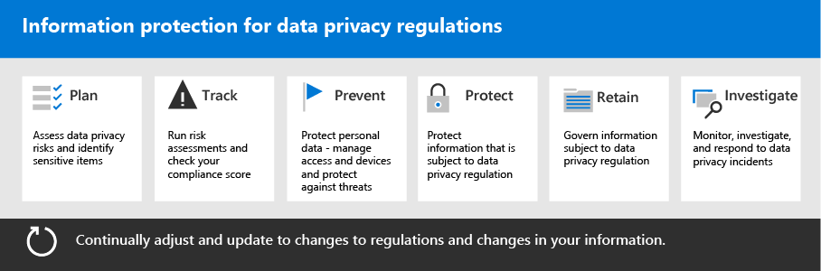

# Information Protection voor data privacy-regels implementeren met Microsoft 365

Het is mogelijk dat uw organisatie onderworpen is aan de nationale regels met betrekking tot de privacy van gegevens die u nodig hebt om persoonlijke gegevens in uw IT-infrastructuur te beschermen, te beheren en te controleren, waaronder zowel on-premises als in de Cloud. Het voorbeeld van een Data privacy verordening is de algemene verordening gegevensbescherming (AVG) van de Europese Unie. Fout bij het naleven van de regelgeving met betrekking tot de privacy van gegevens kan leiden tot grote boetes.

Voorbeelden van de typen gegevens in Microsoft 365 zijn onder andere chatsessies in Microsoft teams, e-mailberichten in Exchange en bestanden in SharePoint en OneDrive. Deze oplossing bevat richtlijnen voor het beoordelen van Risico's en het identificeren van informatie, bescherming, bescherming, bescherming en reageren op privacygegevens voor persoonlijke gegevens die zijn opgeslagen in Microsoft 365-services die zijn opgeslagen in Microsoft-services die onderworpen zijn aan de privacy-regels.

Aanvullende informatie is ook beschikbaar in het gebruik van de besturingselementen van Microsoft 365 identiteit, apparaten en beveiliging tegen bedreigingen voor uw behoeften aan gegevens. 

Om de criteria te voldoen voor de bescherming van de informatie over naleving van de regelgeving voor de privacy van gegevens kunt u deze Microsoft 365-functies en-functies gebruiken.

| Functie | Beschrijving | Licenties |
|:-------|:-----|:-------|
| Compliancebeheer | Compliance Compliance-activiteiten beheren, een algemene score voor de huidige compliance-configuratie krijgen en aanbevelingen vinden voor verbetering in dit hulpprogramma op werkstroom basis risico onderzoek in het Microsoft 365 compliance Center. | Microsoft 365 E3 en E5 |
| Office Advanced Threat Protection (ATP) | Beveilig uw Microsoft 365-apps en -gegevens tegen een aanval, zoals e-mailberichten, Office-documenten en hulpmiddelen voor samenwerking. | Microsoft 365 E3 en E5 | 
| Vertrouwelijkheidslabels | Classificeer en bescherm de gegevens van uw organisatie zonder de productiviteit van gebruikers en hun vermogen om samen te werken te belemmeren door het labelen van e-mail, bestanden of websites met diverse beschermingsniveaus. | Microsoft 365 E3 en E5 |
| Preventie van gegevensverlies (DLP) | Detecteer, waarschuw voor en blokkeer risicovol, onbedoeld of ongepast delen, zoals het delen van gegevens met persoonlijke informatie, zowel intern als extern. | Microsoft 365 E3 en E5 | 
| Labels en beleid voor gegevensretentie | Implementeer informatiebeheer-besturingselementen, zoals hoe lang gegevens bewaard blijven en vereisten voor het opslaan van persoonlijke gegevens van klanten, om te voldoen aan het beleid of de gegevensvoorschriften van uw organisatie. | Microsoft 365 E3 en E5 |
| E-mailversleuteling | Versleutelde e-mailberichten met gereguleerde gegevens, zoals persoonlijke gegevens van klanten, verzenden naar en ontvangen van personen binnen en buiten de organisatie. | Microsoft 365 E3 en E5 |
||||

## Organisatie van de richtlijnen in deze oplossing

Als u meer wilt weten over de Microsoft 365-hulpmiddelen die beschikbaar zijn om persoonlijke gegevens te identificeren, te beheren, te beheren en te controleren, onder voorbehoud van een of meer voorschriften met betrekking tot de privacy, zijn deze richtlijnen ingedeeld in secties.
 

Deze secties komen overeen met een apart artikel in deze oplossing.

>[!Note]
>Als u al bekend bent met de verplichtingen van uw privacy en het uitvoeren van een bestaand abonnement, is het raadzaam de richtlijnen voor voorstelling, beveiliging, behoud en onderzoek te activeren.

>[!Important]
>Aan de hand van deze richtlijnen hoeft u niet noodzakelijkerwijs te voldoen aan de regelgeving van de privacy van een Data, met name de stappen die nodig zijn voor de toepassing van de functies. U bent verantwoordelijk voor de naleving van uw compliance en het raadplegen van uw wettelijke en compliance teams of om richtlijnen en vragen te zoeken van derden die zijn gespecialiseerd in naleving.
>

## Plan: privacy-Risico's voor gegevens beoordelen en gevoelige items identificeren

De beoordeling van regels en risico's voor de privacy van uw organisatie is een belangrijke stap voordat u de verbeteringen implementeert, waaronder de functies die voor de configuratie van Microsoft 365 haalbaar zijn. Dit kan de algemene voorbereiding of identificatie van bepaalde gevoelige informatie typen zijn, onderworpen aan reglementaire zeggenschap, en de organisatie dient te voldoen aan de behoeften van uw organisatie en de situatie van deze typen in uw Microsoft 365-omgeving.

Voor meer informatie raadpleegt u de [beoordeelde Risico's en gevoelige items voor gegevens](information-protection-deploy-assess.md)controleren.

## Bijhouden: risicobeoordelingen uitvoeren en uw score voor naleving controleren

Nalevings beheer, dat beschikbaar is in het nalevings centrum voor Microsoft 365, biedt u een ingebouwde functie voor het bijhouden en beheren van verbeteringen in verband met de mogelijkheden van de regelgeving die voor u van toepassing zijn.

De ingebouwde beoordelings sjablonen die specifiek zijn voor elke verordening, waar u actie-items kunt bijhouden voor elke geselecteerde beoordelings sjabloon, en specifieke regelgevende besturingselementen weergeven, en deze koppelen aan specifieke acties.

Zie [Compliance Manager gebruiken voor het beheren van kwaliteits stappen](information-protection-deploy-compliance.md)voor meer informatie.

## Voorkomen: persoonlijke gegevens beveiligen

Microsoft 365 biedt een aantal mogelijkheden voor identiteiten, apparaten en beveiliging van bedreigingen waarmee u rekening moet houden met Compliance Compliance van data privacy. 

Zie [identiteit, apparaat en beveiliging van bedreigingen voor data privacy verordening gebruiken](information-protection-deploy-identity-device-threat.md)voor meer informatie.

In dit artikel wordt kort beschreven wat de algemene voorwaarden van de privacy van gegevens in deze zones zijn en biedt een lijst met verwante Microsoft 365-oplossingen, met koppelingen naar meer informatie om u te helpen bij het adresseren van de implementatievereisten. 

## Informatie beschermen onder de regelgeving van de privacy van data

Voorschriften met betrekking tot de privacy van gegevens kunt u een aantal persoonlijke beveiligingsmaatregelen voor de omgeving van persoonlijke gegevens gebruiken, waaronder meer dan 40 het beschermen van gegevenscontrole over de vier voorschriften voor de privacy van de gegevens in onze Voorbeeldset van AVG, Californië voor de consumenten-en de Data Protection Act (Verenigde Staten)

Voor meer informatie raadpleegt [u informatie beschermen met betrekking tot de privacy-regelgeving van de gegevens in uw organisatie](information-protection-deploy-protect-information.md).

In dit artikel worden de belangrijkste besturingssystemen vastgelegd die kunnen worden gebruikt voor de informatiebescherming van de privacy in uw organisatie.

## Bewaren: informatie over de levens wetgeving van gegevens

Voorschriften met betrekking tot de privacy van gegevens in uw omgeving, waaronder meer dan twintig besturingselementen in de vier voorschriften voor data privacy in onze Voorbeeldset van AVG, CCPA, HIPAA-HITECH en LGPD.

Zie voor meer informatie [de informatie over het onderwerp van de informatie over de privacy van de gegevens in uw organisatie](information-protection-deploy-govern.md).

Hoewel de regelgeving voor de privacy van gegevens kan worden nietszeggende met betrekking tot informatiebeheer &mdash; zoals Purposeful-behoud, verwijdering en archivering in &mdash; dit artikel worden de primaire besturingssystemen opgenomen die u nodig hebt om informatie te delen in uw organisatie.

## Onderzoek: een monitor, onderzoek en reageren op incidenten voor gegevens privacy

Er zijn Microsoft 365-functies beschikbaar om u te helpen bij het controleren, onderzoeken en beantwoorden van gebeurtenissen in uw organisatie, zoals de operationalize-gerelateerde mogelijkheden. 

Het hebben van processen, procedures en andere documentatie voor elk van deze kan van belang zijn om de naleving van de regelgevende instanties te illustreren.

Zie voor meer informatie [de beantwoordende gegevens voor privacy controleren en beantwoorden in uw organisatie](information-protection-deploy-monitor-respond.md).
