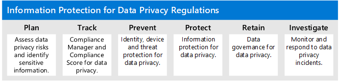

# Informatiebescherming implementeren voor regelgeving voor gegevensprivacy met Microsoft 365

Deze oplossing biedt richtlijnen voor het plannen en beschermen van persoonsgegevens die zijn opgeslagen in Microsoft 365-services en mogelijk onderworpen zijn aan regelgeving inzake gegevensprivacy, zoals de Algemene Verordening Gegevensbescherming (AVG) van de Europese Unie. Deze oplossing richt zich op de toepasselijke microsoft-functies voor informatiebescherming en naleving, Microsoft Compliance Score en beoordelingstools om u te helpen uw gegevens te kennen. 
 
Aanvullende informatie wordt ook verstrekt over het gebruik van Microsoft-besturingselementen voor identiteits-, apparaat- en bedreigingsbeveiliging voor uw gegevensprivacybehoeften, evenals hulpmiddelen voor het ontdekken en reageren op gegevensincidenten. 

## Organisatie van dit begeleidingsmateriaal

Om u inzicht te geven in de Microsoft 365-hulpprogramma's die beschikbaar zijn voor het identificeren, beheren, beheren en controleren van persoonsgegevens die onderworpen zijn aan een of meer privacygerelateerde voorschriften, is deze richtlijnen ingedeeld in secties.
 

Elk van deze secties komt overeen met een apart artikel in deze oplossing.

>[!Note]
>Als u al bekend bent met uw privacyverplichtingen en uitvoert tegen een bestaand abonnement, u zich richten op de richtlijnen Voor voorkomen, beschermen, behouden en onderzoeken.

>[!Important]
>Als u deze richtlijnen volgen, voldoet u niet noodzakelijkerwijs aan de regelgeving voor gegevensprivacy, vooral gezien het aantal vereiste stappen dat buiten de context van de functies valt. U bent verantwoordelijk voor het waarborgen van uw compliance en het raadplegen van uw juridische en compliance teams of om advies en advies in te winnen bij derden die gespecialiseerd zijn in compliance.
>

## Plan: De privacyrisico's van gegevens beoordelen en gevoelige items identificeren 

Het beoordelen van de privacyvoorschriften en -risico's waaraan uw organisatie is onderworpen, is een belangrijke eerste stap voordat u begint met het implementeren van verbeteringen, waaronder die welke mogelijk zijn via de Microsoft 365-configuratie. Dit kan een algemene beoordeling van de gereedheid of identificatie van bepaalde gevoelige informatietypen zijn die onderworpen zijn aan wettelijke controles waaraan uw organisatie moet voldoen, evenals het optreden ervan in uw Microsoft 365-omgeving.

Zie De [privacyrisico's van gegevens beoordelen en gevoelige items identificeren](information-protection-deploy-assess.md)voor meer informatie.

## Track: Compliance Score en Compliance Manager gebruiken 

Compliance Score en Compliance Manager bieden een geïntegreerde set tools die beschikbaar zijn in het Microsoft 365 Compliance-beheercentrum en servicesvertrouwensportal. Samen bieden deze tools u een ingebouwde mogelijkheid om verbeteringsacties in het algemeen bij te houden en te beheren, evenals die met betrekking tot de regelgeving inzake meerdere gegevensprivacy waaraan u wordt onderworpen.

Met de tools u ook gebruikmaken van ingebouwde beoordelingssjablonen die specifiek zijn voor elke verordening, waarbij u actiepunten voor elke geselecteerde beoordelingssjabloon bijhouden en specifieke regelgevingscontroles bekijken en deze relateren aan specifieke acties.

Zie [Compliance Score en Compliance Manager gebruiken om verbeteracties te beheren voor](information-protection-deploy-compliance.md)meer informatie.

## Voorkomen: identiteits-, apparaat- en bedreigingsbescherming gebruiken voor regelgeving voor gegevensprivacy

Microsoft 365 biedt een aantal mogelijkheden voor identiteits-, apparaat- en bedreigingsbescherming die u gebruiken om te voldoen aan de naleving van de naleving van de privacy van gegevens. 

Zie [Identiteits-, apparaat- en bedreigingsbescherming gebruiken voor de regelgeving op het spel](information-protection-deploy-identity-device-threat.md).

In dit artikel wordt kort beschreven waar de regelgeving voor gegevensprivacy in deze gebieden over het algemeen om vraagt en wordt een lijst gegeven van gerelateerde Microsoft 365-oplossingen, met links naar meer informatie om u te helpen eventuele implementatievereisten aan te pakken. 

## Informatie beschermen die onderworpen is aan de privacywetgeving van gegevens

De regelgeving inzake gegevensprivacy dicteert een aantal controles op de bescherming van persoonsgegevens die in uw omgeving kunnen worden gebruikt, waaronder meer dan veertig beschermingsinformatiecontroles voor alleen de vier voorschriften inzake gegevensprivacy in onze voorbeeldset van GDPR, California Consumer Protection Act (CCPA), HIPAA-HITECH (Us Health Care Privacy Act) en de Brazil Data Protection Act (LGPD).

Zie [Informatie beveiligen onder voorbehoud van de privacyregelgeving van gegevens in uw organisatie voor](information-protection-deploy-protect-information.md)meer informatie.

In dit artikel worden de belangrijkste controleschema's uiteengezet die kunnen worden gebruikt voor het aanpakken van informatiebeschermingsbehoeften voor gegevensprivacy in uw organisatie.

## Behouden: Informatie regelen die onderworpen is aan de privacywetgeving

De regelgeving inzake gegevensprivacy vraagt om controles op het beheer van persoonlijke gegevens die in uw omgeving kunnen worden gebruikt, waaronder meer dan vierentwintig controles in de vier regelgeving inzake gegevensprivacy in onze voorbeeldset van GDPR, CCPA, HIPAA-HITECH en LGPD.

Zie [Informatie beheren die onderworpen is aan de privacyregelgeving van gegevens in uw organisatie](information-protection-deploy-govern.md).

Hoewel de regelgeving inzake gegevensprivacy vaag kan zijn met betrekking tot &mdash; informatiebeheer, zoals doelgerichte bewaring, het verwijderen en archiveren van &mdash; dit artikel, worden de primaire controleschema's vastgelegd die u gebruiken om adresbeheerbehoeften voor gegevensprivacy in uw organisatie te gebruiken.

## Onderzoek: Monitor en reageer onder voorbehoud van de privacywetgeving

Er zijn Microsoft 365-functies beschikbaar om u te helpen bij het monitoren, onderzoeken en reageren op privacyincidenten in uw organisatie terwijl u gerelateerde mogelijkheden operationaliseert. 

Het hebben van processen, procedures en andere documentatie voor elk van deze kan belangrijk zijn om aan te tonen dat regelgevende instanties aan de regels voldoen.

Zie [Gegevensprivacy-incidenten in uw organisatie controleren en reageren op gegevensprivacy](information-protection-deploy-monitor-respond.md)voor meer informatie.
