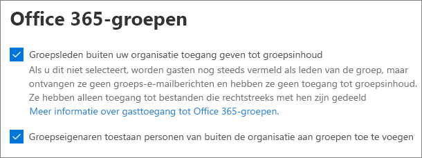
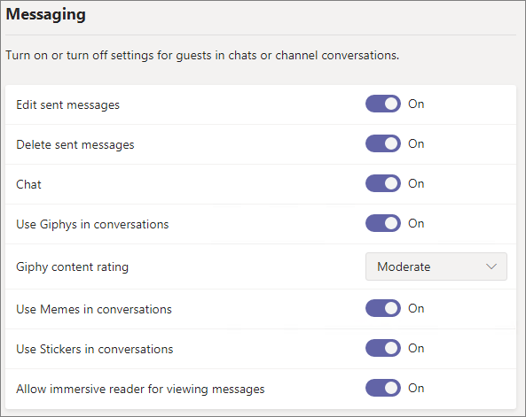
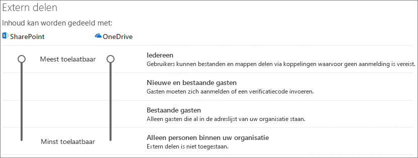
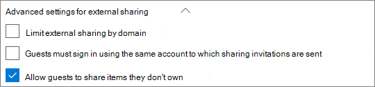
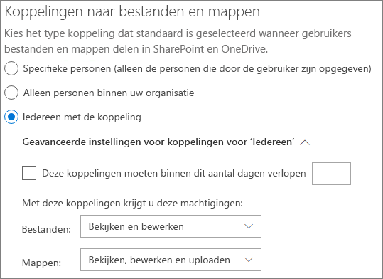
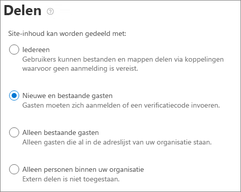

# Microsoft 365 guest sharing settings reference (Overzicht van de instellingen voor delen met gasten van Microsoft 365)Microsoft 365 guest sharing settings reference

In dit artikel vindt u een overzicht van de verschillende instellingen die van invloed kunnen zijn op het delen met personen buiten uw organisatie voor de Microsoft 365-workloads: Teams, Microsoft 365 Groepen, SharePoint en OneDrive.This article provides a reference for the various settings that can affect sharing with people outside your organization for the Microsoft 365 workloads: Teams, Microsoft 365 Groups, SharePoint, and OneDrive. Deze instellingen bevinden zich in de beheercentra van Microsoft Azure Active Directory, Microsoft 365, Teams en SharePoint.These settings are located in the Azure Active Directory, Microsoft 365, Teams, and SharePoint admin centers.

## Microsoft Azure Active DirectoryAzure Active Directory

**Beheerdersrol:** Hoofdbeheerder**Admin role:** Global administrator

Microsoft Azure Active Directory is de directoryservice die wordt gebruikt door Microsoft 365.Azure Active Directory is the directory service used by Microsoft 365. De instellingen voor organisatierelaties van de Microsoft Azure Active Directory zijn rechtstreeks van invloed op het delen in Teams, Microsoft 365 Groepen, SharePoint en OneDrive.The Azure Active Directory Organizational relationships settings directly affect sharing in Teams, Microsoft 365 Groups, SharePoint, and OneDrive.

> [!NOTE]
> Deze instellingen zijn alleen van invloed op SharePoint wanneer [SharePoint- en OneDrive-integratie met Microsoft Azure AD B2B (Voorbeeld)](/sharepoint/sharepoint-azureb2b-integration-preview) is geconfigureerd.These settings only affect SharePoint when [SharePoint and OneDrive integration with Azure AD B2B](/sharepoint/sharepoint-azureb2b-integration-preview) has been configured. In de onderstaande tabel wordt ervan uitgegaan dat dit is geconfigureerd.The table below assumes that this has been configured.

### Instellingen voor externe samenwerkingExternal collaboration settings

**Navigatie:** [Azure Active Directory-beheercentrum](https://aad.portal.azure.com) > Azure Active Directory-> Externe identiteiten> Externe collaboratie-instellingen**Navigation:** [Azure Active Directory admin center](https://aad.portal.azure.com) > Azure Active Directory > External Identities > External collaboration settings

| InstellingSetting | StandaardDefault | OmschrijvingDescription |
|:-----|:-----|:-----|
|GastgebruikerstoegangGuest user access|Gastgebruikers hebben beperkte toegang tot eigenschappen en lidmaatschappen van adreslijstobjectenGuest users have limited access to properties and memberships of directory objects|Bepaalt de [machtigingen die gasten hebben in Azure Active Directory](/azure/active-directory/fundamentals/users-default-permissions).Determines the [permissions that guests have in Azure Active Directory](/azure/active-directory/fundamentals/users-default-permissions).|
|Instellingen voor uitnodigingen voor gastenGuest invite settings|Iedereen in de organisatie kan gastgebruikers uitnodigen, inclusief gasten en niet-beheerdersAnyone in the organization can invite guest users including guests and non-admins|Bepaalt of gasten, leden en beheerders gasten kunnen uitnodigen voor de organisatie.Determines whether guests, members, and admins can invite guests to the organization. 
 Deze instelling heeft invloed op de deelopties van Microsoft 365, zoals Teams en SharePoint.This setting affects  Microsoft 365 sharing experiences such as Teams and SharePoint.|
|Selfservice-aanmelding voor gasten inschakelen via gebruikersstromenEnable guest self-service sign up via user flows|NeeNo|Bepaalt of u gebruikersstromen kunt maken waarmee iemand zich kan registreren voor een app die u hebt gemaakt en een nieuw gastaccount kan maken.Determines if you can create user flows that allow someone to sign up for an app that you created and create a new guest account.|
|SamenwerkingsbeperkingenCollaboration restrictions|Uitnodigingen verzenden naar ieder domein toestaanAllow invitations to be sent to any domain|Met deze instelling kunt u een lijst opgeven met voor het delen toegestane of geblokkeerde domeinen.This setting allows you to specify a list of allowed or blocked domains for sharing. Als toegestane domeinen worden opgegeven, kunnen uitnodigingen tot delen alleen naar deze domeinen worden verzonden.When allowed domains are specified, then sharing invitations can only be sent to those domains. Als geblokkeerde domeinen worden opgegeven, kunnen er geen uitnodigingen tot delen naar deze domeinen worden verzonden.When denied domains are specified, then sharing invitations cannot be sent to those domains. 
 Deze instelling heeft invloed op de deelopties van Microsoft 365, zoals Teams en SharePoint.This setting affects  Microsoft 365 sharing experiences such as Teams and SharePoint. U kunt domeinen nauwkeuriger toestaan of blokkeren door domeinfilters in SharePoint of Teams te gebruiken.You can allow or block domains at a more granular level by using domain filtering in SharePoint or Teams.|

Deze instellingen hebben invloed op de manier waarop gebruikers worden uitgenodigd voor de directory.These settings affect how users are invited to the directory. Ze hebben geen invloed op het delen met gasten die al aanwezig zijn in de directory.They do not affect sharing with guests who are already in the directory.

## Microsoft 365Microsoft 365

**Beheerdersrol:** Hoofdbeheerder**Admin role:** Global administrator

Het Microsoft 365-beheercentrum heeft instellingen op organisatieniveau voor delen en voor Microsoft 365 Groepen.The Microsoft 365 admin center has organization-level settings for sharing and for Microsoft 365 Groups.

### DelenSharing

**Navigatie:** [Microsoft 365-beheercentrum](https://admin.microsoft.com) > Instellingen > Organisatie-instellingen > tabblad Beveiliging & privacy > Delen**Navigation:** [Microsoft 365 admin center](https://admin.microsoft.com) > Settings > Org Settings > Security & privacy tab > Sharing

| InstellingSetting | StandaardDefault | OmschrijvingDescription |
|:-----|:-----|:-----|
|Gebruikers toestaan nieuwe gasten toe te voegen aan de organisatieLet users add new guests to the organization|AanOn|Wanneer ingesteld op **Ja** kunnen Microsoft Azure AD-leden gasten uitnodigen via Microsoft Azure AD. Wanneer ingesteld op **Nee** is dat niet mogelijk.When set to **Yes**, Azure AD members can invite guests via Azure AD; when set to **No**, they cannot. Wanneer ingesteld op **Ja** kunnen Microsoft 365-groepsleden gasten uitnodigen met goedkeuring van de eigenaar. Wanneer ingesteld op **Nee** kunnen Microsoft 365-groepsleden gasten uitnodigen met goedkeuring van de eigenaar, maar de eigenaren moeten hoofdbeheerders zijn om het goed te keuren.When set to **Yes**, Microsoft 365 Group members can invite guests with owner approval; when set to **No**, Microsoft 365 Group members can invite guests with owner approval but owners must be global administrators to approve. 
 Merk op dat **Leden kunnen uitnodigen** verwijst naar leden in Azure AD (in tegenstelling tot gasten) en niet naar site- of groepsleden in Microsoft 365.Note that **Members can invite** refers to members in Azure AD (as opposed to guests) and not to site or group members in  Microsoft 365. 
 Dit is hetzelfde als de instelling **Leden kunnen uitnodigen** in de instellingen voor organisatierelaties van Azure Active Directory.This is identical to the **Members can invite** setting in Azure Active Directory Organizational relationships settings.|

### Microsoft 365 GroepenMicrosoft 365 Groups

**Navigatie:** [Microsoft 365-beheercentrum](https://admin.microsoft.com) > Instellingen > Instellingen > Microsoft 365 Groepen**Navigation:** [Microsoft 365 admin center](https://admin.microsoft.com) > Settings > Settings > Microsoft 365 Groups

| InstellingSetting | StandaardDefault | OmschrijvingDescription |
|:-----|:-----|:-----|
|Groepsleden buiten uw organisatie toegang geven tot groepsinhoudLet group members outside your organization access group content|AanOn|Wanneer ingesteld op **Aan** hebben gasten toegang tot groepsinhoud. Wanneer ingesteld op **Uit** hebben ze geen toegang.When set to **On**, guests can access groups content; when set to **Off**, they can't. Deze instelling moet **Aan** zijn voor elk scenario waarin gasten werken met Microsoft 365 Groepen of Teams.This setting should be **On** for any scenario where guests are interacting with Microsoft 365 Groups or Teams.|
|Groepseigenaren toestaan personen van buiten de organisatie aan groepen toe te voegenLet group owners add people outside your organization to groups|AanOn|Wanneer **Aan** kunnen eigenaren van Microsoft 365 Groepen of Teams nieuwe gasten uitnodigen voor de groep.When **On**, Owners of Microsoft 365 Groups or Teams can invite new guests to the group. Wanneer **Uit** kunnen eigenaren gasten alleen uitnodigen als deze zich al in de directory bevinden.When **Off**, owners can only invite guests who are already in the directory.|

Deze instellingen bevinden zich op organisatieniveau.These settings are at the organization level. Zie [Instellingen voor een specifieke groep maken](/azure/active-directory/users-groups-roles/groups-settings-cmdlets#create-settings-for-a-specific-group) voor informatie over hoe u deze instellingen op groepsniveau kunt wijzigen met Windows PowerShell.See [Create settings for a specific group](/azure/active-directory/users-groups-roles/groups-settings-cmdlets#create-settings-for-a-specific-group) for information about how to change these settings at the group level by using PowerShell.

## TeamsTeams

De hoofdschakelaar gasttoegang van Teams, **Gasttoegang in Teams toestaan** moet **Aan** zijn om de andere gastinstellingen beschikbaar te maken.The Teams master guest access switch, **Allow guest access in Teams**, must be **On** for the other guest settings to be available.

**Beheerdersrol** Teams-servicebeheerder**Admin role:** Teams service administrator

### GasttoegangGuest access

**Navigatie:** [Beheercentrum van Teams](https://admin.teams.microsoft.com) > Organisatiebrede instellingen > Gasttoegang**Navigation:** [Teams admin center](https://admin.teams.microsoft.com) > Org-wide settings > Guest access

| InstellingSetting | StandaardDefault | OmschrijvingDescription |
|:-----|:-----|:-----|
|Gasttoegang in Teams toestaanAllow guest access in Teams|UitOff|Hiermee schakelt u de gasttoegang in of uit voor Teams als geheel.Turns guest access on or off for Teams overall. Het kan 24 uur duren voordat deze instelling is gewijzigd.This setting can take 24 hours to take effect once changed.|

### Bellen door gastGuest calling

**Navigatie:** [Beheercentrum van Teams](https://admin.teams.microsoft.com) > Organisatiebrede instellingen > Gasttoegang**Navigation:** [Teams admin center](https://admin.teams.microsoft.com) > Org-wide settings > Guest access

| InstellingSetting | StandaardDefault | OmschrijvingDescription |
|:-----|:-----|:-----|
|Privégesprekken voerenMake private calls|AanOn|Wanneer **Aan** kunnen gasten peer-to-peer-gesprekken voeren in Teams. Wanneer **Uit** is dit niet mogelijk.When **On**, guests can make peer-to-peer calls in Teams; when **Off**, they can't.|

### GastvergaderingGuest meeting

**Navigatie:** [Beheercentrum van Teams](https://admin.teams.microsoft.com) > Organisatiebrede instellingen > Gasttoegang**Navigation:** [Teams admin center](https://admin.teams.microsoft.com) > Org-wide settings > Guest access

| InstellingSetting | StandaardDefault | OmschrijvingDescription |
|:-----|:-----|:-----|
|IP-video toestaanAllow IP video|AanOn|Wanneer **Aan** kunnen gasten video gebruiken in hun gesprekken en vergaderingen. Wanneer **Uit** is dit niet mogelijk.When **On**, guests can use video in their calls and meetings; when **Off**, they can't.|
|Modus Scherm delenScreen sharing mode|Volledig schermEntire screen|Wanneer **Uitgeschakeld** kunnen gasten hun schermen niet delen in Teams.When **Disabled**, guests can't share their screens in Teams. Wanneer ingesteld op **Enkele toepassing** kunnen gasten slechts één toepassing op hun scherm delen.When set to **Single application**, guests can only share a single application on their screen. Wanneer ingesteld op **Volledig scherm** kunnen gasten een toepassing of het volledige scherm delen.When set to **Entire screen**, guests can choose to share an application or their entire screen.|
|Nu vergaderen toestaanAllow Meet Now|AanOn|Wanneer **Aan** kunnen gasten de functie Nu vergaderen in Teams gebruiken. Wanneer **Uit** is dit niet mogelijk.When **On**, guests can use the Meet Now feature in Teams; when **Off**, they can't.|

### Berichten van gastenGuest messaging

**Navigatie:** [Beheercentrum van Teams](https://admin.teams.microsoft.com) > Organisatiebrede instellingen > Gasttoegang**Navigation:** [Teams admin center](https://admin.teams.microsoft.com) > Org-wide settings > Guest access

| InstellingSetting | StandaardDefault | OmschrijvingDescription |
|:-----|:-----|:-----|
|Verzonden berichten bewerkenEdit sent messages|AanOn|Wanneer **Aan** kunnen gasten eerder verzonden berichten bewerken. Wanneer **Uit** is dit niet mogelijk.When **On**, guests can edit messages they previously sent; when **Off**, they can't.|
|Verzonden berichten verwijderenDelete sent messages|AanOn|Wanneer **Aan** kunnen gasten eerder verzonden berichten verwijderen. Wanneer **Uit** is dit niet mogelijk.When **On**, guests can delete messages they previously sent; when **Off**, they can't.|
|ChattenChat|AanOn|Wanneer **Aan** kunnen gasten de chatfunctie in Teams gebruiken. Wanneer **Uit** is dit niet mogelijk.When **On**, guests can use chat in Teams; when **Off**, they can't.|
|Giphy's in gesprekken gebruikenUse Giphys in conversations|AanOn|Wanneer **Aan** kunnen gasten Giphy's in gesprekken gebruiken. Wanneer **Uit** is dit niet mogelijk.When **On**, guests can use Giphys in conversations; when **Off**, they can't.|
|Classificatie giphy-inhoudGiphy content rating|GemiddeldModerate|Wanneer ingesteld op **Alle inhoud toestaan** kunnen gasten alle Giphy's invoegen in chats, ongeacht de inhoudsbeoordeling.When set to **Allow all content**, guests will can insert all Giphys in chats, regardless of the content rating. Wanneer ingesteld op **Gematigd** kunnen gasten Giphy's invoegen in chats, maar er zijn gematigde beperkingen rondom inhoud voor volwassenen.When set to **Moderate** guests can insert Giphys in chats, but will be moderately restricted from adult content. Wanneer ingesteld op **Streng** kunnen gasten Giphy's invoegen in chats, maar het is niet mogelijk om inhoud voor volwassenen in te voegen.When set to **Strict** guests can insert Giphys in chats, but will be restricted from inserting adult content.|
|Memes gebruiken in gesprekkenUse Memes in conversations|AanOn|Wanneer **Aan** kunnen gasten memes gebruiken in gesprekken. Wanneer **Uit** is dit niet mogelijk.When **On**, guests can use memes in conversations; when **Off**, they can't.|
|Stickers gebruiken in gesprekkenUser stickers in conversations|AanOn|Wanneer **Aan** kunnen gasten stickers gebruiken in gesprekken. Wanneer **Uit** is dit niet mogelijk.When **On**, guests can use stickers in conversations; when **Off**, they can't.|
|Insluitende lezer toestaan voor het weergeven van berichtenAllow immersive reader for viewing messages|AanOn|Wanneer **Aan** kunnen gasten berichten weergeven in Insluitende lezer. Wanneer **Uit** is dit niet mogelijk.When **On**, guests can view messages in Immersive Reader; when **Off**, they can't.|

## SharePoint en OneDrive (op organisatieniveau)SharePoint and OneDrive (organization-level)

**Beheerdersrol:** SharePoint-beheerder**Admin role:** SharePoint administrator

Deze instellingen hebben invloed op alle sites in de organisatie.These settings affect all of the sites in the organization. Ze zijn niet rechtstreeks van invloed op Microsoft 365 Groepen of Teams, maar we raden u aan deze instellingen af te stemmen met de instellingen voor Microsoft 365 Groepen en Teams om problemen voor de gebruikerservaring te voorkomen.They do not affect Microsoft 365 Groups or Teams directly, however we recommend that you align these settings with the settings for Microsoft 365 Groups and Teams to avoid user experience issues. (Bijvoorbeeld: Als delen met gasten is toegestaan in Teams, maar niet in SharePoint, hebben gasten in Teams geen toegang tot het tabblad Bestanden omdat Teams-bestanden worden opgeslagen in SharePoint.)(For example, if guest sharing is allowed in Teams but not SharePoint, then guests in Teams will not have access to the Files tab because Teams files are stored in SharePoint.)

### SharePoint- en OneDrive-instellingen voor delenSharePoint and OneDrive sharing settings

Omdat OneDrive een hiërarchie van sites binnen SharePoint is, hebben de instellingen voor delen op organisatieniveau rechtstreeks invloed op OneDrive, net zoals bij andere SharePoint-sites.Because OneDrive is a hierarchy of sites within SharePoint, the organization-level sharing settings directly affect OneDrive just as they do other SharePoint sites.

**Navigatie:** SharePoint Online-beheercentrum > Delen**Navigation:** SharePoint admin center > Sharing

| InstellingSetting | StandaardDefault | OmschrijvingDescription |
|:-----|:-----|:-----|
|SharePointSharePoint|IedereenAnyone|Hiermee geeft u de ruimste machtigingen voor delen die op SharePoint-sites zijn toegestaan.Specifies the most permissive sharing permissions allowed for SharePoint sites.|
|OneDriveOneDrive|IedereenAnyone|Hiermee geeft u de ruimste machtigingen voor delen die op OneDrive-sites zijn toegestaan.Specifies the most permissive sharing permissions allowed for OneDrive sites. Deze instelling kan niet ruimer zijn dan de SharePoint-instelling.This setting cannot be more permissive than the SharePoint setting.|

### Geavanceerde SharePoint- en OneDrive-instellingen voor delenSharePoint and OneDrive advanced sharing settings

**Navigatie:** SharePoint Online-beheercentrum > Delen**Navigation:** SharePoint admin center > Sharing

| InstellingSetting | StandaardDefault | OmschrijvingDescription |
|:-----|:-----|:-----|
|Extern delen per domein beperkenLimit external sharing by domain|UitOff|Met deze instelling kunt u een lijst opgeven met voor het delen toegestane of geblokkeerde domeinen.This setting allows you to specify a list of allowed or blocked domains for sharing. Als toegestane domeinen worden opgegeven, kunnen uitnodigingen tot delen alleen naar deze domeinen worden verzonden.When allowed domains are specified, then sharing invitations can only be sent to those domains. Als geblokkeerde domeinen worden opgegeven, kunnen er geen uitnodigingen tot delen naar deze domeinen worden verzonden.When denied domains are specified, then sharing invitations cannot be sent to those domains. 
 Deze instelling heeft invloed op alle SharePoint-en OneDrive-sites in de organisatie.This setting affects all SharePoint and OneDrive sites in the organization.|
|Alleen gebruikers in specifieke beveiligingsgroepen toestaan om extern te delenAllow only users in specific security groups to share externally|UitOff|Als u wilt beperken wie er met gasten kan delen in SharePoint en OneDrive, kunt u dit doen door delen te beperken tot personen in opgegeven beveiligingsgroepen.If you want to limit who can share with guests in SharePoint and OneDrive, you can do so by limiting sharing to people in specified security groups. Deze instellingen hebben geen invloed op delen via Microsoft 365 Groepen of Teams.These settings do not affect sharing via Microsoft 365 Groups or Teams. Gasten die via een groep of team zijn uitgenodigd, hebben ook toegang tot de bijbehorende site, hoewel het delen van documenten en mappen alleen kan worden uitgevoerd door personen in de opgegeven beveiligingsgroepen.Guests invited via a group or team would also have access to the associated site, though document and folder sharing could only be done by people in the specified security groups. 
 Voor elke opgegeven groep kunt u kiezen of die gebruikers kunnen delen met iedereen-koppelingen.For each specified group, you can choose of those users can share with Anyone links.|
|Gasten moeten zich aanmelden met behulp van hetzelfde account waarnaar de uitnodigingen voor delen worden verzendenGuests must sign in using the same account to which sharing invitations are sent|UitOff|Hiermee voorkomt u dat gasten uitnodigingen voor het delen van sites benutten met een ander e-mailadres dan waarnaar de uitnodiging werd verzonden.Prevents guests from redeeming site sharing invitations using a different email address than the invitation was sent to. 
 Bij [SharePoint- en OneDrive-integratie met Microsoft Azure AD B2B (voorbeeld)](/sharepoint/sharepoint-azureb2b-integration-preview) wordt deze instelling niet gebruikt, omdat alle gasten worden toegevoegd aan de directory op basis van het e-mailadres waarnaar de uitnodiging werd verzonden.[SharePoint and OneDrive integration with Azure AD B2B (Preview)](/sharepoint/sharepoint-azureb2b-integration-preview) does not use this setting because all guests are added to the directory based on the email address that the invitation was sent to. Alternatieve e-mailadressen kunnen niet worden gebruikt voor sitetoegang.Alternate email addresses cannot be used to access the site.|
|Gasten toestaan items te delen waarvan ze niet de eigenaar zijnAllow guests to share items they don't own|AanOn|Wanneer **Aan** kunnen gasten items waarvan ze niet de eigenaar zijn, delen met andere gebruikers of gasten. Wanneer **Uit** is dit niet mogelijk.When **On**, guests can share items that they don't own with other users or guests; when **Off** they cannot. Gasten kunnen altijd items delen waarover ze het volledige beheer hebben.Guests can always share items for which they have full control.|
|Personen die een verificatiecode gebruiken, moeten na dit aantal dagen opnieuw verifiërenPeople who use a verification code must reauthenticate after this many days|UitOff|Met deze instelling kunt u vereisen dat gebruikers die zich verifiëren met een eenmalige wachtwoordcode na een bepaald aantal dagen opnieuw moeten verifiëren.This setting allows you to require that users authenticating with a one-time passcode need to reauthenticate after a certain number of days.|

### Instellingen voor koppelingen naar bestanden en mappen in SharePoint en OneDriveSharePoint and OneDrive file and folder link settings

Wanneer bestanden en mappen in SharePoint en OneDrive worden gedeeld, wordt aan de ontvangers ervan een koppeling verzonden met daarin de machtigingen voor het bestand of de map in plaats van hen rechtstreeks toegang tot het bestand of de map te geven.When files and folders are shared in SharePoint and OneDrive, sharing recipients are sent a link with permissions to the file or folder rather than being granted direct access to the file or folder themselves. Er zijn verschillende typen koppelingen beschikbaar en u kunt het standaardkoppelingstype kiezen dat aan gebruikers wordt aangebonden wanneer ze een bestand of map delen.Several types of links are available, and you can choose the default link type presented to users when they share a file or folder. U kunt ook machtigingen en verloopopties instellen voor *Iedereen*-koppelingen.You can also set permissions and expiration options for *Anyone* links.

**Navigatie:** SharePoint Online-beheercentrum > Delen**Navigation:** SharePoint admin center > Sharing

| InstellingSetting | StandaardDefault | OmschrijvingDescription |
|:-----|:-----|:-----|
|Koppelingen naar bestanden en mappenFile and folder links|Iedereen met de koppelingAnyone with the link|Hiermee wordt bepaald welke koppeling voor delen standaard wordt weergegeven wanneer een gebruiker een bestand of map deelt.Specifies which sharing link is shown by default when a user shares a file or folder. Gebruikers kunnen desgewenst de optie wijzigen voordat ze delen.Users can change the option before sharing if they want. Als de standaardinstelling is ingesteld op **Iedereen met de koppeling** en delen met *Iedereen* is niet toegestaan voor een bepaalde site, dan worden **Alleen personen in uw organisatie** weergegeven als de standaardinstelling voor die site.If the default is set to **Anyone with the link** and *Anyone* sharing is not allowed for a given site, then **Only people in your organization** will be shown as the default for that site.|
|Deze koppelingen moeten binnen dit aantal dagen verlopenThese links must expire within this many days|Uit (geen verloopdatum)Off (no expiration)|Hiermee geeft u het aantal dagen na de dag van maken op waarna een *Iedereen*-koppeling vervalt.Specifies the number of days after an *Anyone* link is created that it expires. Verlopen koppelingen kunnen niet worden verlengd.Expired links cannot be renewed. Maak een nieuwe koppeling als u wilt doorgaan met het delen na de verloopdatum.Create a new link if you need to continue sharing past the expiration.|
|Machtigingen voor bestandenFile permissions|Bekijken en bewerkenView and edit|Hiermee worden de machtigingsniveaus bepaald die voor gebruikers beschikbaar zijn bij het maken van een *Iedereen*-koppeling.Specifies the file permission levels available to users when creating an *Anyone* link. Als **Bekijken** is geselecteerd, kunnen gebruikers alleen *Iedereen*-bestandskoppelingen maken met machtigingen voor bekijken.If **View** is selected, then users can only create *Anyone* file links with view permissions. Als **Bekijken en bewerken** is geselecteerd, kunnen gebruikers kiezen tussen de machtigingen bekijken en bekijken en bewerken wanneer ze de koppeling maken.If **View, and edit** is selected, then users can choose between view and view and edit permissions when they create the link.|
|Mapmachtigingen beherenFolder permissions|Bekijken, bewerken en uploadenView, edit, and upload|Hiermee worden de machtigingsniveaus voor mappen bepaald die voor gebruikers beschikbaar zijn bij het maken van een *Iedereen*-koppeling.Specifies the folder permission levels available to users when creating an *Anyone* link. Als **Bekijken** is geselecteerd, kunnen gebruikers alleen *Iedereen*-mapkoppelingen maken met machtigingen voor bekijken.If **View** is selected, then users can only create *Anyone* folder links with view permissions. Als **Bekijken, bewerken en uploaden** is geselecteerd, kunnen gebruikers kiezen tussen de machtigingen bekijken en bekijken, bewerken en uploaden wanneer ze de koppeling maken.If **View, edit, and upload** is selected, then users can choose between view and view, edit, and upload permissions when they creat the link.|

## SharePoint (siteniveau)SharePoint (site level)

**Beheerdersrol:** SharePoint-beheerder**Admin role:** SharePoint administrator

Aangezien deze instellingen afhankelijk zijn van de organisatiebrede instellingen voor SharePoint is het mogelijk dat de instelling voor het delen van bestanden voor de site wordt gewijzigd als de instelling op organisatieniveau verandert.Because these settings are subject to the organization-wide settings for SharePoint, the effective sharing setting for the site may change if the organization-level setting changes. Als u hier een instelling kiest en er wordt later op organisatieniveau een meer beperkende waarde ingesteld, wordt voor deze site die meer beperkende waarde gebruikt.If you choose a setting here and the organization-level is later set to a more restrictive value, then this site will operate at that more restrictive value. Als u bijvoorbeeld **Iedereen** kiest en de instelling op organisatieniveau wordt later ingesteld op **Nieuwe en bestaande gasten**, worden alleen nieuwe en bestaande gasten door deze site toegestaan.For example, if you choose **Anyone** and the organization-level setting is later set to **New and existing guests**, then this site will only allow new and existing guests. Als de instelling op organisatieniveau vervolgens weer wordt ingesteld op **Iedereen**, worden *Iedereen*-koppelingen weer toegestaan op de site.If the organization-level setting is then set back to **Anyone**, this site would again allow *Anyone* links.

### Delen van een siteSite sharing

U kunt voor elke site in SharePoint machtigingen voor het delen met gasten instellen.You can set guest sharing permissions for each site in SharePoint. Deze instelling geldt voor zowel het delen van sites als het delen van bestanden en mappen.This setting applies to both site sharing and file and folder sharing. (Met *Iedereen* delen is niet beschikbaar voor het delen van een site.(*Anyone* sharing is not available for site sharing. Als u **Iedereen** kiest, kunnen gebruikers bestanden en mappen delen met *Iedereen*-koppelingen en de site zelf met nieuwe en bestaande gasten.)If you choose **Anyone**, users will be able to share files and folders by using *Anyone* links, and the site itself with new and existing guests.)

Als op de site een gevoeligheidslabel is toegepast, kan dat label de instellingen voor extern delen beheren.If the site has a sensitivity label applied, that label may control the external sharing settings. Zie [Gevoeligheidslabels gebruiken om inhoud te beveiligen in Microsoft Teams, Microsoft 365-groepen en SharePoint-sites](../compliance/sensitivity-labels-teams-groups-sites.md) voor meer informatie.For more information, see [Use sensitivity labels to protect content in Microsoft Teams, Microsoft 365 groups, and SharePoint sites](../compliance/sensitivity-labels-teams-groups-sites.md).

**Navigatie:** SharePoint Online-beheercentrum > Actieve sites > Selecteer de site > tabblad Beleid > Extern delen bewerken**Navigation:** SharePoint admin center > Active sites > select the site > Policies tab > Edit External sharing

| InstellingSetting | StandaardDefault | OmschrijvingDescription |
|:-----|:-----|:-----|
|Site-inhoud kan worden gedeeld metSite content can be shared with|Verschilt per type site (Zie de onderstaande tabel)Varies by site type (see the table below)|Hiermee wordt het type extern delen aangegeven dat is toegestaan voor deze site.Indicates the type of external sharing allowed for this site. De hier beschikbare opties zijn afhankelijk van de instellingen voor delen op organisatieniveau voor SharePoint.Options available here are subject to the organization-level sharing settings for SharePoint.|

### Instellingen voor sitebestand en mapkoppelingSite file and folder link settings

U kunt voor elke site het standaardtype koppeling en de standaardmachtigingen en de verloopinstellingen instellen voor *Iedereen*-koppelingen.You can set defaults for link type and permissions, and expiration settings for *Anyone* links for each site. Als u deze instellingen op siteniveau instelt, worden de instellingen op organisatieniveau overschreven.When set at the site level, these settings override the organization-level settings. Merk op dat als *Iedereen*-koppelingen worden uitgeschakeld op organisatieniveau, *Iedereen*-koppelingen niet beschikbaar zijn als koppelingstype op siteniveau.Note that if *Anyone* links are disabled at the organization level, *Anyone* will not be an available link type at the site level.

**Navigatie:** SharePoint Online-beheercentrum > Actieve sites > Selecteer de site > tabblad Beleid > Extern delen bewerken**Navigation:** SharePoint admin center > Active sites > select the site > Policies tab > Edit External sharing

| InstellingSetting | StandaardDefault | OmschrijvingDescription |
|:-----|:-----|:-----|
|Delen beperken per domeinLimit sharing by domain|UitOff|Met deze instelling kunt u een lijst opgeven met voor het delen toegestane of geblokkeerde domeinen.This setting allows you to specify a list of allowed or blocked domains for sharing. Als toegestane domeinen worden opgegeven, kunnen uitnodigingen tot delen alleen naar deze domeinen worden verzonden.When allowed domains are specified, then sharing invitations can only be sent to those domains. Als geblokkeerde domeinen worden opgegeven, kunnen er geen uitnodigingen tot delen naar deze domeinen worden verzonden.When denied domains are specified, then sharing invitations cannot be sent to those domains. 
 Deze instelling kan niet worden gebruikt om de domeinbeperkingen die zijn ingesteld op het organisatieniveau of het Microsoft Azure AD-niveau te overschrijven.This setting cannot be used to override domain restrictions set at the organization or Azure AD level.|
|Standaardkoppelingstype voor delenDefault sharing link type|Hetzelfde als de instelling op organisatieniveauSame as organization-level setting|Met deze instelling kunt u de standaardkoppeling voor delen opgeven die worden weergegeven aan gebruikers op deze site.This setting allows you to specify the default sharing link presented to users in this site. De optie *Hetzelfde als de instelling op organisatieniveau* wordt gedefinieerd door een combinatie van de instellingen voor delen van de organisatie en de site.The *Same as organization-level setting* option is defined by a combination of organization and site sharing settings.|
|Geavanceerde instellingen voor Iedereen-koppelingenAdvanced settings for Anyone links|Hetzelfde als de instelling op organisatieniveauSame as organization-level setting|Hiermee geeft u het aantal dagen na de dag van maken op waarna een *Iedereen*-koppeling voor een bestand in deze site vervalt.Specifies the number of days after an *Anyone* link is created for a file in this site that it expires. Verlopen koppelingen kunnen niet worden verlengd.Expired links cannot be renewed. Maak een nieuwe koppeling als u wilt doorgaan met het delen na de verloopdatum.Create a new link if you need to continue sharing past the expiration.|
|Standaardmachtiging voor koppelingenDefault link permission|Hetzelfde als de instelling op organisatieniveauSame as organization-level setting|Met deze instelling kunt u de standaardmachtiging (Bekijken of bewerken) opgeven voor het delen van koppelingen naar bestanden op deze site.This setting allows you to specify the default permission (View or Edit) for sharing links created for files in this site.|

### Standaardinstellingen voor het delen van een siteDefault site sharing settings

In de onderstaande tabel ziet u de standaardinstelling voor delen voor elk type site.The table below shows the default sharing setting for each site type.

| SitetypeSite type | Standaardinstelling voor delenDefault sharing setting |
|:-----|:-----|
|KlassiekClassic|**Alleen personen binnen uw organisatie****Only people in your organization**|
|OneDriveOneDrive|**Iedereen****Anyone**|
|Met een groep verbonden sites (met inbegrip van Teams)Group-connected sites (including Teams)|**Nieuwe en bestaande gasten** als de instelling **Groepseigenaren toestaan personen van buiten de organisatie aan groepen toe te voegen** van Microsoft 365 Groepen **Aan** is. Anders **Alleen bestaande gasten****New and existing guests** if the Microsoft 365 Groups setting **Let group owners add people outside the organization to groups** is **On**; otherwise **Existing guests only**|
|CommunicatieCommunication|**Alleen personen binnen uw organisatie****Only people in your organization**|
|Moderne sites zonder groep (#STS3 TeamSite)Modern sites with no group (#STS3 TeamSite)|**Alleen personen binnen uw organisatie****Only people in your organization**|

> [!NOTE]
> De hoofdcommunicatiesite (tenant-name.sharepoint.com) heeft als standaardinstelling voor delen **Iedereen**.The root communication site (tenant-name.sharepoint.com) has a default sharing setting of **Anyone**.

## Zie ookSee also

[Overzicht van extern delen in SharePoint en OneDriveSharePoint and OneDrive external sharing overview](/sharepoint/external-sharing-overview)

[Gasttoegang in Microsoft TeamsGuest access in Microsoft Teams](/MicrosoftTeams/guest-access)

[Gasten toevoegen aan Microsoft 365 GroepenAdding guests to Microsoft 365 Groups](https://support.office.com/article/bfc7a840-868f-4fd6-a390-f347bf51aff6)
