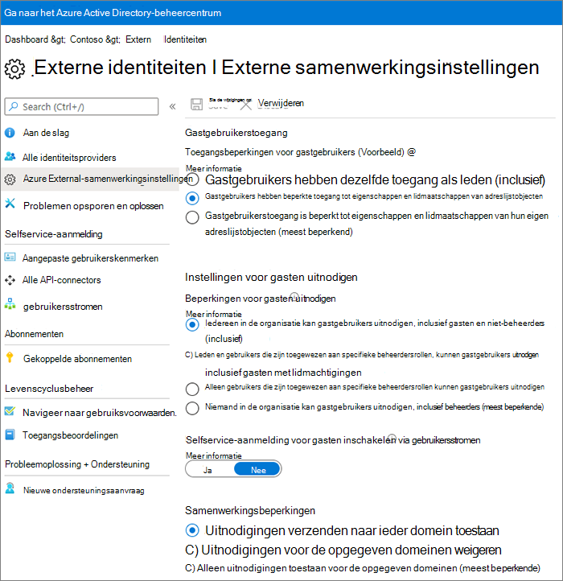

# Overzicht van instellingen voor delen met gasten in Microsoft 365

In dit artikel vindt u een overzicht van de verschillende instellingen die van invloed kunnen zijn op het delen met personen buiten uw organisatie voor de Microsoft 365-workloads: Teams, Microsoft 365 Groepen, SharePoint en OneDrive. Deze instellingen bevinden zich in de beheercentra van Microsoft Azure Active Directory, Microsoft 365, Teams en SharePoint.

## Microsoft Azure Active Directory

**Beheerdersrol:** Hoofdbeheerder

Microsoft Azure Active Directory is de directoryservice die wordt gebruikt door Microsoft 365. De instellingen voor organisatierelaties van de Microsoft Azure Active Directory zijn rechtstreeks van invloed op het delen in Teams, Microsoft 365 Groepen, SharePoint en OneDrive.

> [!NOTE]
> Deze instellingen zijn alleen van invloed op SharePoint wanneer [SharePoint- en OneDrive-integratie met Microsoft Azure AD B2B (Voorbeeld)](https://docs.microsoft.com/sharepoint/sharepoint-azureb2b-integration-preview) is geconfigureerd. In de onderstaande tabel wordt ervan uitgegaan dat dit is geconfigureerd.

### Instellingen voor organisatierelaties

**Navigatie:** [Azure Active Directory-beheercentrum](https://aad.portal.azure.com) > Azure Active Directory-> Organisatierelaties > Instellingen

|**Instelling**|**Standaard**|**Beschrijving**|
|:-----|:-----|:-----|
|Machtigingen voor gastgebruikers zijn beperkt|Ja|Deze instelling heeft invloed op de directorytaken die een gast kan uitvoeren.|
|Beheerders en gebruikers in de rol van gastuitnodiger kunnen uitnodigen|Ja|Wanneer ingesteld op **Ja** kunnen beheerders gasten uitnodigen via Microsoft Azure AD en via het deelopties van Microsoft 365, zoals Teams en SharePoint. Wanneer ingesteld op **Nee** is dat niet mogelijk.|
|Leden kunnen uitnodigen|Ja|Wanneer ingesteld op **Ja** kunnen Microsoft Azure AD-leden gasten uitnodigen via Microsoft Azure AD. Wanneer ingesteld op **Nee** is dat niet mogelijk. Wanneer ingesteld op **Ja** kunnen Microsoft 365-groepsleden gasten uitnodigen met goedkeuring van de eigenaar. Wanneer ingesteld op **Nee** kunnen Microsoft 365-groepsleden gasten uitnodigen met goedkeuring van de eigenaar, maar de eigenaren moeten hoofdbeheerders zijn om het goed te keuren.   Merk op dat **Leden kunnen uitnodigen** verwijst naar leden in Azure AD (in tegenstelling tot gasten) en niet naar site- of groepsleden in Microsoft 365.   Dit is hetzelfde als de instelling **Gebruikers toestaan nieuwe gasten aan de organisatie toe te voegen** in Beveiliging & privacy van Microsoft 365.|
|Gasten kunnen uitnodigen|Ja|Wanneer ingesteld op **Ja** kunnen gasten in de Directory andere gasten uitnodigen om samen te werken aan Microsoft Azure AD-resources en aan bestanden en mappen in SharePoint en OneDrive. Wanneer ingesteld op **Nee** is dat niet mogelijk.   Merk op dat**Externe gebruikers toestaan om gebruikersaccounts te zoeken in de adreslijst door exacte e-mail adressen te typen** in het SharePoint Online-beheercentrum moet zijn ingeschakeld voordat gasten bestanden en mappen met andere gasten kunnen delen.|
|Eenmalige e-mailwachtwoordcode voor gasten inschakelen (voorbeeld)|Nee|Wanneer ingesteld op **Ja** kunnen gasten zonder een MSA of een werk- of schoolaccount [verifiëren met Azure AD middels een eenmalige wachtwoordcode](https://docs.microsoft.com/azure/active-directory/b2b/one-time-passcode); wanneer ingesteld op **Nee** moeten gebruikers een Microsoft-account maken om te verifiëren. Deze instelling moet zijn ingesteld op **Ja** om [SharePoint- en OneDrive-integratie met Microsoft Azure AD B2B (voorbeeld)](https://docs.microsoft.com/sharepoint/sharepoint-azureb2b-integration-preview) te laten werken.|
|Samenwerkingsbeperkingen|Uitnodigingen verzenden naar ieder domein toestaan|Met deze instelling kunt u een lijst opgeven met voor het delen toegestane of geblokkeerde domeinen. Als toegestane domeinen worden opgegeven, kunnen uitnodigingen tot delen alleen naar deze domeinen worden verzonden. Als geblokkeerde domeinen worden opgegeven, kunnen er geen uitnodigingen tot delen naar deze domeinen worden verzonden.   Deze instelling heeft invloed op de deelopties van Microsoft 365, zoals Teams en SharePoint. U kunt domeinen nauwkeuriger toestaan of blokkeren door domeinfilters in SharePoint of Teams te gebruiken.|

Deze instellingen hebben invloed op de manier waarop gebruikers worden uitgenodigd voor de directory. Ze hebben geen invloed op het delen met gasten die al aanwezig zijn in de directory.

## Microsoft 365

**Beheerdersrol:** Hoofdbeheerder

Het Microsoft 365-beheercentrum heeft instellingen op organisatieniveau voor delen en voor Microsoft 365 Groepen.

### Delen

**Navigatie:** [Microsoft 365-beheercentrum](https://admin.microsoft.com) > Instellingen > Instellingen > tabblad Beveiliging & privacy > Delen

|**Instelling**|**Standaard**|**Beschrijving**|
|:-----|:-----|:-----|
|Gebruikers toestaan nieuwe gasten toe te voegen aan de organisatie|Aan|Wanneer ingesteld op **Ja** kunnen Microsoft Azure AD-leden gasten uitnodigen via Microsoft Azure AD. Wanneer ingesteld op **Nee** is dat niet mogelijk. Wanneer ingesteld op **Ja** kunnen Microsoft 365-groepsleden gasten uitnodigen met goedkeuring van de eigenaar. Wanneer ingesteld op **Nee** kunnen Microsoft 365-groepsleden gasten uitnodigen met goedkeuring van de eigenaar, maar de eigenaren moeten hoofdbeheerders zijn om het goed te keuren.   Merk op dat **Leden kunnen uitnodigen** verwijst naar leden in Azure AD (in tegenstelling tot gasten) en niet naar site- of groepsleden in Microsoft 365.   Dit is hetzelfde als de instelling **Leden kunnen uitnodigen** in de instellingen voor organisatierelaties van Azure Active Directory.|

### Microsoft 365 Groepen

**Navigatie:** [Microsoft 365-beheercentrum](https://admin.microsoft.com) > Instellingen > Instellingen > Microsoft 365 Groepen

|**Instelling**|**Standaard**|**Beschrijving**|
|:-----|:-----|:-----|
|Groepsleden buiten uw organisatie toegang geven tot groepsinhoud|Aan|Wanneer ingesteld op **Aan** hebben gasten toegang tot groepsinhoud. Wanneer ingesteld op **Uit** hebben ze geen toegang. Deze instelling moet **Aan** zijn voor elk scenario waarin gastgebruikers werken met Microsoft 365 Groepen of Teams.|
|Groepseigenaren toestaan personen van buiten de organisatie aan groepen toe te voegen|Aan|Wanneer **Aan** kunnen eigenaren van Microsoft 365 Groepen of Teams nieuwe gasten uitnodigen voor de groep. Wanneer **Uit** kunnen eigenaren gasten alleen uitnodigen als deze zich al in de directory bevinden.|

Deze instellingen bevinden zich op organisatieniveau. Zie [Instellingen voor een specifieke groep maken](https://docs.microsoft.com/azure/active-directory/users-groups-roles/groups-settings-cmdlets#create-settings-for-a-specific-group) voor informatie over hoe u deze instellingen op groepsniveau kunt wijzigen met Windows PowerShell.

## Teams

De hoofdschakelaar gasttoegang van Teams, **Gasttoegang in Teams toestaan** moet **Aan** zijn om de andere gastinstellingen beschikbaar te maken.

**Beheerdersrol** Teams-servicebeheerder

### Gasttoegang

**Navigatie:** [Beheercentrum van Teams](https://admin.teams.microsoft.com) > Organisatiebrede instellingen > Gasttoegang

|**Instelling**|**Standaard**|**Beschrijving**|
|:-----|:-----|:-----|
|Gasttoegang in Teams toestaan|Uit|Hiermee schakelt u de gasttoegang in of uit voor Teams als geheel. Het kan 24 uur duren voordat deze instelling is gewijzigd.|

### Bellen door gast

**Navigatie:** [Beheercentrum van Teams](https://admin.teams.microsoft.com) > Organisatiebrede instellingen > Gasttoegang

|**Instelling**|**Standaard**|**Beschrijving**|
|:-----|:-----|:-----|
|Privégesprekken voeren|Aan|Wanneer **Aan** kunnen gasten peer-to-peer-gesprekken voeren in Teams. Wanneer **Uit** is dit niet mogelijk.|

### Gastvergadering

**Navigatie:** [Beheercentrum van Teams](https://admin.teams.microsoft.com) > Organisatiebrede instellingen > Gasttoegang

|**Instelling**|**Standaard**|**Beschrijving**|
|:-----|:-----|:-----|
|IP-video toestaan|Aan|Wanneer **Aan** kunnen gasten video gebruiken in hun gesprekken en vergaderingen. Wanneer **Uit** is dit niet mogelijk.|
|Modus Scherm delen|Volledig scherm|Wanneer **Uitgeschakeld** kunnen gasten hun schermen niet delen in Teams. Wanneer ingesteld op **Enkele toepassing** kunnen gasten slechts één toepassing op hun scherm delen. Wanneer ingesteld op **Volledig scherm** kunnen gasten een toepassing of het volledige scherm delen.|
|Nu vergaderen toestaan|Aan|Wanneer **Aan** kunnen gasten de functie Nu vergaderen in Teams gebruiken. Wanneer **Uit** is dit niet mogelijk.|

### Berichten van gasten

**Navigatie:** [Beheercentrum van Teams](https://admin.teams.microsoft.com) > Organisatiebrede instellingen > Gasttoegang

|**Instelling**|**Standaard**|**Beschrijving**|
|:-----|:-----|:-----|
|Verzonden berichten bewerken|Aan|Wanneer **Aan** kunnen gasten eerder verzonden berichten bewerken. Wanneer **Uit** is dit niet mogelijk.|
|Verzonden berichten verwijderen|Aan|Wanneer **Aan** kunnen gasten eerder verzonden berichten verwijderen. Wanneer **Uit** is dit niet mogelijk.|
|Chatten|Aan|Wanneer **Aan** kunnen gasten de chatfunctie in Teams gebruiken. Wanneer **Uit** is dit niet mogelijk.|
|Giphy's in gesprekken gebruiken|Aan|Wanneer **Aan** kunnen gasten Giphy's in gesprekken gebruiken. Wanneer **Uit** is dit niet mogelijk.|
|Classificatie giphy-inhoud|Gemiddeld|Wanneer ingesteld op **Alle inhoud toestaan** kunnen gasten alle Giphy's invoegen in chats, ongeacht de inhoudsbeoordeling. Wanneer ingesteld op **Gematigd** kunnen gasten Giphy's invoegen in chats, maar er zijn gematigde beperkingen rondom inhoud voor volwassenen. Wanneer ingesteld op **Streng** kunnen gasten Giphy's invoegen in chats, maar het is niet mogelijk om inhoud voor volwassenen in te voegen.|
|Memes gebruiken in gesprekken|Aan|Wanneer **Aan** kunnen gasten memes gebruiken in gesprekken. Wanneer **Uit** is dit niet mogelijk.|
|Stickers gebruiken in gesprekken|Aan|Wanneer **Aan** kunnen gasten stickers gebruiken in gesprekken. Wanneer **Uit** is dit niet mogelijk.|
|Insluitende lezer toestaan voor het weergeven van berichten|Aan|Wanneer **Aan** kunnen gasten berichten weergeven in Insluitende lezer. Wanneer **Uit** is dit niet mogelijk.|

## SharePoint en OneDrive (op organisatieniveau)

**Beheerdersrol:** SharePoint-beheerder

Deze instellingen hebben invloed op alle sites in de organisatie. Ze zijn niet rechtstreeks van invloed op Microsoft 365 Groepen of Teams, maar we raden u aan deze instellingen af te stemmen met de instellingen voor Microsoft 365 Groepen en Teams om problemen voor de gebruikerservaring te voorkomen. (Bijvoorbeeld: Als delen met gasten is toegestaan in Teams, maar niet in SharePoint, hebben gasten in Teams geen toegang tot het tabblad Bestanden omdat Teams-bestanden worden opgeslagen in SharePoint.)

### SharePoint- en OneDrive-instellingen voor delen

Omdat OneDrive een hiërarchie van sites binnen SharePoint is, hebben de instellingen voor delen op organisatieniveau rechtstreeks invloed op OneDrive, net zoals bij andere SharePoint-sites.

**Navigatie:** SharePoint Online-beheercentrum > Delen

|**Instelling**|**Standaard**|**Beschrijving**|
|:-----|:-----|:-----|
|SharePoint|Iedereen|Hiermee geeft u de ruimste machtigingen voor delen die op SharePoint-sites zijn toegestaan.|
|OneDrive|Iedereen|Hiermee geeft u de ruimste machtigingen voor delen die op OneDrive-sites zijn toegestaan. Deze instelling kan niet ruimer zijn dan de SharePoint-instelling.|

### Geavanceerde SharePoint- en OneDrive-instellingen voor delen

**Navigatie:** SharePoint Online-beheercentrum > Delen

|**Instelling**|**Standaard**|**Beschrijving**|
|:-----|:-----|:-----|
|Extern delen per domein beperken|Uit|Met deze instelling kunt u een lijst opgeven met voor het delen toegestane of geblokkeerde domeinen. Als toegestane domeinen worden opgegeven, kunnen uitnodigingen tot delen alleen naar deze domeinen worden verzonden. Als geblokkeerde domeinen worden opgegeven, kunnen er geen uitnodigingen tot delen naar deze domeinen worden verzonden.   Deze instelling heeft invloed op alle SharePoint-en OneDrive-sites in de organisatie.|
|Gasten moeten zich aanmelden met behulp van hetzelfde account waarnaar de uitnodigingen voor delen worden verzenden|Uit|Hiermee voorkomt u dat gasten uitnodigingen voor het delen van sites benutten met een ander e-mailadres dan waarnaar de uitnodiging werd verzonden.  Bij [SharePoint- en OneDrive-integratie met Microsoft Azure AD B2B (voorbeeld)](https://docs.microsoft.com/sharepoint/sharepoint-azureb2b-integration-preview) wordt deze instelling niet gebruikt, omdat alle gasten worden toegevoegd aan de directory op basis van het e-mailadres waarnaar de uitnodiging werd verzonden. Alternatieve e-mailadressen kunnen niet worden gebruikt voor sitetoegang.|
|Gasten toestaan items te delen waarvan ze niet de eigenaar zijn|Aan|Wanneer **Aan** kunnen gasten items waarvan ze niet de eigenaar zijn, delen met andere gebruikers of gasten. Wanneer **Uit** is dit niet mogelijk. Gasten kunnen altijd items delen waarover ze het volledige beheer hebben.|

### Instellingen voor koppelingen naar bestanden en mappen in SharePoint en OneDrive

Wanneer bestanden en mappen in SharePoint en OneDrive worden gedeeld, wordt aan de ontvangers ervan een koppeling verzonden met daarin de machtigingen voor het bestand of de map in plaats van hen rechtstreeks toegang tot het bestand of de map te geven. Er zijn verschillende typen koppelingen beschikbaar en u kunt het standaardkoppelingstype kiezen dat aan gebruikers wordt aangebonden wanneer ze een bestand of map delen. U kunt ook machtigingen en verloopopties instellen voor *Iedereen*-koppelingen.

**Navigatie:** SharePoint Online-beheercentrum > Delen

|**Instelling**|**Standaard**|**Beschrijving**|
|:-----|:-----|:-----|
|Koppelingen naar bestanden en mappen|Iedereen met de koppeling|Hiermee wordt bepaald welke koppeling voor delen standaard wordt weergegeven wanneer een gebruiker een bestand of map deelt. Gebruikers kunnen desgewenst de optie wijzigen voordat ze delen. Als de standaardinstelling is ingesteld op **Iedereen met de koppeling** en delen met *Iedereen* is niet toegestaan voor een bepaalde site, dan worden **Alleen personen in uw organisatie** weergegeven als de standaardinstelling voor die site.|
|Deze koppelingen moeten binnen dit aantal dagen verlopen|Uit (geen verloopdatum)|Hiermee geeft u het aantal dagen na de dag van maken op waarna een *Iedereen*-koppeling vervalt. Verlopen koppelingen kunnen niet worden verlengd. Maak een nieuwe koppeling als u wilt doorgaan met het delen na de verloopdatum.|
|Machtigingen voor bestanden|Bekijken en bewerken|Hiermee worden de machtigingsniveaus bepaald die voor gebruikers beschikbaar zijn bij het maken van een *Iedereen*-koppeling. Als **Bekijken** is geselecteerd, kunnen gebruikers alleen *Iedereen*-bestandskoppelingen maken met machtigingen voor bekijken. Als **Bekijken en bewerken** is geselecteerd, kunnen gebruikers kiezen tussen de machtigingen bekijken en bekijken en bewerken wanneer ze de koppeling maken.|
|Mapmachtigingen beheren|Bekijken, bewerken en uploaden|Hiermee worden de machtigingsniveaus voor mappen bepaald die voor gebruikers beschikbaar zijn bij het maken van een *Iedereen*-koppeling. Als **Bekijken** is geselecteerd, kunnen gebruikers alleen *Iedereen*-mapkoppelingen maken met machtigingen voor bekijken. Als **Bekijken, bewerken en uploaden** is geselecteerd, kunnen gebruikers kiezen tussen de machtigingen bekijken en bekijken, bewerken en uploaden wanneer ze de koppeling maken.|

### SharePoint- en OneDrive-instellingen voor beveiligingsgroepen

Als u wilt beperken wie er met gasten kan delen in SharePoint en OneDrive, kunt u dit doen door delen te beperken tot personen in opgegeven beveiligingsgroepen. Deze instellingen hebben geen invloed op delen via Microsoft 365 Groepen of Teams. Gasten die via een groep of team zijn uitgenodigd, hebben ook toegang tot de bijbehorende site, hoewel het delen van documenten en mappen alleen kan worden uitgevoerd door personen in de opgegeven beveiligingsgroepen.

**Navigatie:** SharePoint Online-beheercentrum > Delen > Extern delen beperken tot specifieke beveiligingsgroepen

|**Instelling**|**Standaard**|**Beschrijving**|
|:-----|:-----|:-----|
|Alleen gebruikers in geselecteerde beveiligingsgroepen kunnen met externe gebruikers delen|Uit|Wanneer **Aan** kunnen alleen de personen in de opgegeven beveiligingsgroepen met externe gebruikers delen. Alleen *Specifieke personen*-koppelingen zijn beschikbaar. Met *Iedereen* delen wordt in feite uitgeschakeld, tenzij **Alleen gebruikers in geselecteerde beveiligingsgroepen toestaan met geverifieerde externe gebruikers delen en met gebruik van anonieme koppelingen** ook **Aan** is|
|Alleen gebruikers in geselecteerde beveiligingsgroepen kunnen met externe gebruikers delen en met gebruik van anonieme koppelingen|Uit|Wanneer **Aan** kunnen alleen de personen in de opgegeven beveiligingsgroepen met gasten delen. Zowel *Iedereen*- als *Specifieke personen*-koppelingen zijn beschikbaar.|

Beide instellingen kunnen tegelijkertijd worden gebruikt. Als een gebruiker in een beveiligingsgroep voor beide instellingen wordt opgegeven, is het hogere machtigingsniveau van toepassing (*Iedereen* plus *Specifieke gebruikers*).

## SharePoint (siteniveau)

**Beheerdersrol:** SharePoint-beheerder

Aangezien deze instellingen afhankelijk zijn van de organisatiebrede instellingen voor SharePoint is het mogelijk dat de instelling voor het delen van bestanden voor de site wordt gewijzigd als de instelling op organisatieniveau verandert. Als u hier een instelling kiest en er wordt later op organisatieniveau een meer beperkende waarde ingesteld, wordt voor deze site die meer beperkende waarde gebruikt. Als u bijvoorbeeld **Iedereen** kiest en de instelling op organisatieniveau wordt later ingesteld op **Nieuwe en bestaande gasten**, worden alleen nieuwe en bestaande gasten door deze site toegestaan. Als de instelling op organisatieniveau vervolgens weer wordt ingesteld op **Iedereen**, worden *Iedereen*-koppelingen weer toegestaan op de site.

### Delen van een site

U kunt voor elke site in SharePoint machtigingen voor het delen met gasten instellen. Deze instelling geldt voor zowel het delen van sites als het delen van bestanden en mappen. (Met *Iedereen* delen is niet beschikbaar voor het delen van een site. Als u **Iedereen** kiest, kunnen gebruikers bestanden en mappen delen met *Iedereen*-koppelingen en de site zelf met nieuwe en bestaande gasten.)

**Navigatie:** SharePoint Online-beheercentrum > Actieve sites > Selecteer de site > tabblad Beleid > Extern delen bewerken

|**Instelling**|**Standaard**|**Beschrijving**|
|:-----|:-----|:-----|
|Site-inhoud kan worden gedeeld met|Verschilt per type site (Zie de onderstaande tabel)|Hiermee wordt het type extern delen aangegeven dat is toegestaan voor deze site. De hier beschikbare opties zijn afhankelijk van de instellingen voor delen op organisatieniveau voor SharePoint.|

### Instellingen voor sitebestand en mapkoppeling

U kunt voor elke site het standaardtype koppeling en de standaardmachtigingen en de verloopinstellingen instellen voor *Iedereen*-koppelingen. Als u deze instellingen op siteniveau instelt, worden de instellingen op organisatieniveau overschreven. Merk op dat als *Iedereen*-koppelingen worden uitgeschakeld op organisatieniveau, *Iedereen*-koppelingen niet beschikbaar zijn als koppelingstype op siteniveau.

**Navigatie:** SharePoint Online-beheercentrum > Actieve sites > Selecteer de site > tabblad Beleid > Extern delen bewerken

|**Instelling**|**Standaard**|**Beschrijving**|
|:-----|:-----|:-----|
|Delen beperken per domein|Uit|Met deze instelling kunt u een lijst opgeven met voor het delen toegestane of geblokkeerde domeinen. Als toegestane domeinen worden opgegeven, kunnen uitnodigingen tot delen alleen naar deze domeinen worden verzonden. Als geblokkeerde domeinen worden opgegeven, kunnen er geen uitnodigingen tot delen naar deze domeinen worden verzonden.   Deze instelling kan niet worden gebruikt om de domeinbeperkingen die zijn ingesteld op het organisatieniveau of het Microsoft Azure AD-niveau te overschrijven.|
|Standaardkoppelingstype voor delen|Hetzelfde als de instelling op organisatieniveau|Met deze instelling kunt u de standaardkoppeling voor delen opgeven die worden weergegeven aan gebruikers op deze site. De optie *Hetzelfde als de instelling op organisatieniveau* wordt gedefinieerd door een combinatie van de instellingen voor delen van de organisatie en de site.|
|Geavanceerde instellingen voor Iedereen-koppelingen|Hetzelfde als de instelling op organisatieniveau|Hiermee geeft u het aantal dagen na de dag van maken op waarna een *Iedereen*-koppeling voor een bestand in deze site vervalt. Verlopen koppelingen kunnen niet worden verlengd. Maak een nieuwe koppeling als u wilt doorgaan met het delen na de verloopdatum.|
|Standaardmachtiging voor koppelingen|Hetzelfde als de instelling op organisatieniveau|Met deze instelling kunt u de standaardmachtiging (Bekijken of bewerken) opgeven voor het delen van koppelingen naar bestanden op deze site.|

### Standaardinstellingen voor het delen van een site

In de onderstaande tabel ziet u de standaardinstelling voor delen voor elk type site.

|**Type site**|**Standaardinstelling voor delen**|
|:-----|:-----|
|Klassiek|**Alleen personen binnen uw organisatie**|
|OneDrive|**Iedereen**|
|Met een groep verbonden sites (met inbegrip van Teams)|**Nieuwe en bestaande gasten** als de instelling **Groepseigenaren toestaan personen van buiten de organisatie aan groepen toe te voegen** van Microsoft 365 Groepen **Aan** is. Anders **Alleen bestaande gasten**|
|Communicatie|**Alleen personen binnen uw organisatie**|
|Moderne sites zonder groep (#STS3 TeamSite)|**Alleen personen binnen uw organisatie**|

> [!NOTE]
> De hoofdcommunicatiesite (tenant-name.sharepoint.com) heeft als standaardinstelling voor delen **Iedereen**.

## Zie ook

[Overzicht van extern delen in SharePoint en OneDrive](https://docs.microsoft.com/sharepoint/external-sharing-overview)

[Gasttoegang in Microsoft Teams](https://docs.microsoft.com/MicrosoftTeams/guest-access)

[Gasten toevoegen aan Microsoft 365 Groepen](https://support.office.com/article/bfc7a840-868f-4fd6-a390-f347bf51aff6)
