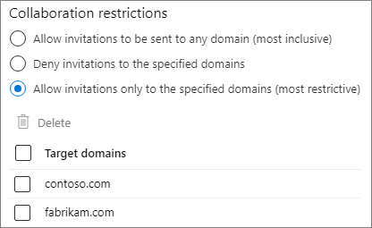

# <a name="limit-sharing-in-microsoft-365"></a><span data-ttu-id="63c35-103">Delen beperken in Microsoft 365</span><span class="sxs-lookup"><span data-stu-id="63c35-103">Limit sharing in Microsoft 365</span></span>

<span data-ttu-id="63c35-104">Hoewel u interne delen niet volledig kunt uitschakelen en de Delen-knop niet van sites kunt verwijderen, kunt u op verschillende manieren het delen in Microsoft 365 beperken om tegemoet te komen aan de behoeften van uw organisatie.</span><span class="sxs-lookup"><span data-stu-id="63c35-104">While you can't disable internal sharing entirely or remove the Share button from sites, there are a variety of ways that you can limit sharing in Microsoft 365 to meet the needs of your organization.</span></span>

<span data-ttu-id="63c35-105">De methoden voor het delen van bestanden worden weergegeven in de onderstaande tabel.</span><span class="sxs-lookup"><span data-stu-id="63c35-105">The methods of sharing files are listed in the table below.</span></span> <span data-ttu-id="63c35-106">Klik op de link in de kolom **Deelmethode** voor meer informatie.</span><span class="sxs-lookup"><span data-stu-id="63c35-106">Click the link in the **Sharing method** column for detailed information.</span></span>

|<span data-ttu-id="63c35-107">Deelmethode</span><span class="sxs-lookup"><span data-stu-id="63c35-107">Sharing method</span></span>|<span data-ttu-id="63c35-108">Beschrijving</span><span class="sxs-lookup"><span data-stu-id="63c35-108">Description</span></span>|<span data-ttu-id="63c35-109">Mogelijkheden beperken</span><span class="sxs-lookup"><span data-stu-id="63c35-109">Limiting options</span></span>|
|:-------------|:----------|:-------------|
|[<span data-ttu-id="63c35-110">Microsoft 365-groep of -team</span><span class="sxs-lookup"><span data-stu-id="63c35-110">Microsoft 365 group or team</span></span>](#microsoft-365-group-or-team)|<span data-ttu-id="63c35-111">Personen die toegang hebben tot een team van Microsoft Teams of Microsoft 365, hebben toegang tot bestanden in de gekoppelde SharePoint-site.</span><span class="sxs-lookup"><span data-stu-id="63c35-111">People granted access to a Microsoft Teams team or Microsoft 365 group have edit access to files in the associated SharePoint site.</span></span>|<span data-ttu-id="63c35-112">Indien de groep of het team privé is, worden uitnodigingen om lid te worden van het team naar de eigenaar gestuurd voor goedkeuring.</span><span class="sxs-lookup"><span data-stu-id="63c35-112">If the group or team is private, sharing invitations to join the team go to the owner for approval.</span></span> <span data-ttu-id="63c35-113">Beheerders kunnen gasttoegang uitschakelen of gevoeligheidslabels gebruiken om te voorkomen dat personen van buiten de organisatie toegang krijgen.</span><span class="sxs-lookup"><span data-stu-id="63c35-113">Admins can disable guest access or use sensitivity labels to prevent access by people from outside the organization.</span></span>|
|[<span data-ttu-id="63c35-114">SharePoint-site</span><span class="sxs-lookup"><span data-stu-id="63c35-114">SharePoint site</span></span>](#sharepoint-site)|<span data-ttu-id="63c35-115">Personen kunnen toegang krijgen tot een SharePoint-site als Eigenaar, Lid of Bezoeker, en hebben op dit niveau toegang tot bestanden op de site.</span><span class="sxs-lookup"><span data-stu-id="63c35-115">People can be granted Owner, Member, or Visitor access to a SharePoint site and will have that level of access to files in the site.</span></span>|<span data-ttu-id="63c35-116">Sitemachtigingen kunnen worden beperkt, zodat alleen site-eigenaren de site kunnen delen.</span><span class="sxs-lookup"><span data-stu-id="63c35-116">Site permissions can be restricted so that only site owners can share the site.</span></span> <span data-ttu-id="63c35-117">Beheerders kunnen een site instellen op alleen-lezen of de toegang helemaal blokkeren.</span><span class="sxs-lookup"><span data-stu-id="63c35-117">Admins can set a site to read-only or block access entirely.</span></span>|
|[<span data-ttu-id="63c35-118">Delen met specifieke personen</span><span class="sxs-lookup"><span data-stu-id="63c35-118">Sharing with specific people</span></span>](#sharing-with-specific-people)|<span data-ttu-id="63c35-119">Siteleden en personen met machtiging voor bewerkingen kunnen rechtstreekse machtigingen geven voor bestanden en mappen of ze delen met behulp van *Specifieke personen*-links.</span><span class="sxs-lookup"><span data-stu-id="63c35-119">Site members and people with edit permissions can give direct permissions to files and folders or share them by using *Specific people* links.</span></span>|<span data-ttu-id="63c35-120">Sitemachtigingen kunnen worden beperkt, zodat alleen site-eigenaren de bestanden en mappen kunnen delen.</span><span class="sxs-lookup"><span data-stu-id="63c35-120">Site permissions can be restricted so that only site owners can share files and folders.</span></span> <span data-ttu-id="63c35-121">In dit geval wordt het delen van rechtstreekse toegang en een *Specifieke personen*-link aan de site-eigenaar voorgelegd voor toestemming.</span><span class="sxs-lookup"><span data-stu-id="63c35-121">In this case, direct access and *Specific people* link sharing by site members goes to site owner for approval.</span></span>|
|[<span data-ttu-id="63c35-122">SharePoint- en OneDrive-bestanden delen met gasten</span><span class="sxs-lookup"><span data-stu-id="63c35-122">SharePoint and OneDrive guest sharing</span></span>](#sharepoint-guest-sharing)|<span data-ttu-id="63c35-123">SharePoint-site-eigenaren en -leden en OneDrive-eigenaren kunnen bestanden en mappen delen met personen buiten de organisatie.</span><span class="sxs-lookup"><span data-stu-id="63c35-123">SharePoint site owners and members and OneDrive owners can share files and folders with people outside the organization.</span></span>|<span data-ttu-id="63c35-124">Het delen van gasten kan worden uitgeschakeld voor de hele organisatie of voor afzonderlijke sites.</span><span class="sxs-lookup"><span data-stu-id="63c35-124">Guest sharing can be disabled for the entire organization or for individual sites.</span></span>|
|[<span data-ttu-id="63c35-125">*Personen in uw organisatie* links delen</span><span class="sxs-lookup"><span data-stu-id="63c35-125">*People in your organization* sharing links</span></span>](#people-in-your-organization-sharing-links)|<span data-ttu-id="63c35-126">SharePoint-site-eigenaren en -leden kunnen bestanden delen met *Personen in uw organisatie*-links. Dit werkt voor iedereen binnen de organisatie.</span><span class="sxs-lookup"><span data-stu-id="63c35-126">SharePoint site owners and members can share files using *People in your organization* links, which will work for anyone inside the organization.</span></span>|<span data-ttu-id="63c35-127">*Personen in uw organisatie*-links kunnen worden uitgeschakeld op siteniveau.</span><span class="sxs-lookup"><span data-stu-id="63c35-127">*People in your organization* links can be disabled at the site level.</span></span>|
|[<span data-ttu-id="63c35-128">Sites, groepen en teams maken</span><span class="sxs-lookup"><span data-stu-id="63c35-128">Create sites, groups, and teams</span></span>](#create-sites-groups-and-teams)|<span data-ttu-id="63c35-129">Standaard kunnen gebruikers nieuwe sites, groepen en teams maken waaruit inhoud kan worden gedeeld.</span><span class="sxs-lookup"><span data-stu-id="63c35-129">By default, users can create new sites, groups, and teams from which they can share content.</span></span>|<span data-ttu-id="63c35-130">Beheerders kunnen beperken wie sites, groepen en teams kan maken.</span><span class="sxs-lookup"><span data-stu-id="63c35-130">Admins can restrict who can create sites, groups, and teams.</span></span>|
|[<span data-ttu-id="63c35-131">E-mail</span><span class="sxs-lookup"><span data-stu-id="63c35-131">Email</span></span>](#email)|<span data-ttu-id="63c35-132">Personen met toegang tot een bestand kunnen het via e-mail naar anderen verzenden.</span><span class="sxs-lookup"><span data-stu-id="63c35-132">People with access to a file can send it to others via email.</span></span>|<span data-ttu-id="63c35-133">Beheerders kunnen bestanden versleutelen met behulp van gevoeligheidslabels om te voorkomen dat ze worden gedeeld met niet-geautoriseerde personen.</span><span class="sxs-lookup"><span data-stu-id="63c35-133">Admins can encrypt files by using sensitivity labels to prevent them being shared with unauthorized people.</span></span>|
|[<span data-ttu-id="63c35-134">Bestanden downloaden of kopiëren</span><span class="sxs-lookup"><span data-stu-id="63c35-134">Download or file copy</span></span>](#download-or-file-copy)|<span data-ttu-id="63c35-135">Personen met toegang tot een bestand kunnen het downloaden of kopiëren en delen met anderen buiten het bereik van Microsoft 365.</span><span class="sxs-lookup"><span data-stu-id="63c35-135">People with access to a file can download or copy it and share it with others outside the scope of Microsoft 365.</span></span>|<span data-ttu-id="63c35-136">Beheerders kunnen bestanden versleutelen met behulp van gevoeligheidslabels om te voorkomen dat ze worden gedeeld met niet-geautoriseerde personen.</span><span class="sxs-lookup"><span data-stu-id="63c35-136">Admins can encrypt files by using sensitivity labels to prevent them being shared with unauthorized people.</span></span>|

<span data-ttu-id="63c35-137">U kunt ook de voorwaarden beperken waaronder anderen toegang hebben tot gedeelde inhoud.</span><span class="sxs-lookup"><span data-stu-id="63c35-137">You can also restrict the conditions under which people access shared content.</span></span> <span data-ttu-id="63c35-138">Zie [voorwaardelijke toegang](#conditional-access) verderop in dit artikel voor meer informatie.</span><span class="sxs-lookup"><span data-stu-id="63c35-138">See [conditional access](#conditional-access) later in this article for more information.</span></span>

<span data-ttu-id="63c35-139">U kunt de beheerdersbesturingselementen die in dit artikel worden beschreven, gebruiken om het delen binnen uw organisatie te beperken. U wordt ten zeerste aangeraden de beveiligings- en compliance-functies in Microsoft 365 te gebruiken om een veilige deelomgeving te creëren.</span><span class="sxs-lookup"><span data-stu-id="63c35-139">While you can use the admin controls described in this article to limit sharing in your organization, we highly recommend that you consider using the security and compliance features available in Microsoft 365 to create a secure sharing environment.</span></span> <span data-ttu-id="63c35-140">Zie [Samenwerken aan bestanden in SharePoint met Microsoft 365](https://docs.microsoft.com/sharepoint/deploy-file-collaboration) en [Configureer een team met beveiligingsisolatie](secure-teams-security-isolation.md) voor meer informatie.</span><span class="sxs-lookup"><span data-stu-id="63c35-140">See [File collaboration in SharePoint with Microsoft 365](https://docs.microsoft.com/sharepoint/deploy-file-collaboration) and [Configure a team with security isolation](secure-teams-security-isolation.md) for information.</span></span>

<span data-ttu-id="63c35-141">Als u wilt weten hoe delen wordt gebruikt binnen uw organisatie, [laat u een rapport opstellen over het delen van bestanden en mappen](https://docs.microsoft.com/sharepoint/sharing-reports).</span><span class="sxs-lookup"><span data-stu-id="63c35-141">To understand how sharing is being used in your organization, [run a report on file and folder sharing](https://docs.microsoft.com/sharepoint/sharing-reports).</span></span>

## <a name="microsoft-365-group-or-team"></a><span data-ttu-id="63c35-142">Microsoft 365-groep of -team</span><span class="sxs-lookup"><span data-stu-id="63c35-142">Microsoft 365 group or team</span></span>

<span data-ttu-id="63c35-143">Als u het delen binnen een Microsoft 365-groep of Microsoft Teams-team wilt beperken, is het belangrijk dat u de groep of het team privé maakt.</span><span class="sxs-lookup"><span data-stu-id="63c35-143">If you want to limit sharing in a Microsoft 365 group or Microsoft Teams team, it's important to make the group or team private.</span></span> <span data-ttu-id="63c35-144">Personen binnen uw organisatie kunnen op elk gewenst moment lid worden van een openbare groep of team.</span><span class="sxs-lookup"><span data-stu-id="63c35-144">People inside your organization can join a public group or team anytime.</span></span> <span data-ttu-id="63c35-145">Tenzij de groep of het team privé is, kunt u het delen van het team of de bestanden binnen de organisatie niet beperken.</span><span class="sxs-lookup"><span data-stu-id="63c35-145">Unless the group or team is private, there's no way to limit sharing of the team or its files within the organization.</span></span>

### <a name="guest-sharing"></a><span data-ttu-id="63c35-146">Gasten delen</span><span class="sxs-lookup"><span data-stu-id="63c35-146">Guest sharing</span></span>

<span data-ttu-id="63c35-147">Als u wilt voorkomen dat gasttoegang in Teams wordt ingeschakeld, kunt u het delen met gasten uitschakelen in het Beheercentrum van Teams.</span><span class="sxs-lookup"><span data-stu-id="63c35-147">If you want to prevent guest access in Teams, you can turn off guest sharing in the Teams admin center.</span></span>

<span data-ttu-id="63c35-148">Het delen met gasten uitschakelen voor Teams</span><span class="sxs-lookup"><span data-stu-id="63c35-148">To turn off guest sharing for Teams</span></span>
1. <span data-ttu-id="63c35-149">Vouw in het Beheercentrum van Teams **Instellingen voor hele organisatie** uit en klik vervolgens op **Gasttoegang**.</span><span class="sxs-lookup"><span data-stu-id="63c35-149">In the Teams admin center, expand **Org-wide settings**, and then click **Guest access**.</span></span>
2. <span data-ttu-id="63c35-150">Schakel **Gasttoegang in Teams toestaan** uit.</span><span class="sxs-lookup"><span data-stu-id="63c35-150">Turn off **Allow guest access in Teams**.</span></span>
3. <span data-ttu-id="63c35-151">Klik op **Opslaan**.</span><span class="sxs-lookup"><span data-stu-id="63c35-151">Click **Save**.</span></span>

<span data-ttu-id="63c35-152">Als u gasttoegang in Microsoft 365-groepen wilt voorkomen, kunt u de instellingen voor gasttoegang in het Microsoft 365-beheercentrum uitschakelen.</span><span class="sxs-lookup"><span data-stu-id="63c35-152">If you want to prevent guest access in Microsoft 365 Groups, you can turn off the groups guest access settings in the Microsoft 365 admin center.</span></span>

<span data-ttu-id="63c35-153">Het delen met gasten uitschakelen in Microsoft 365-groepen</span><span class="sxs-lookup"><span data-stu-id="63c35-153">To turn off guest sharing in Microsoft 365 Groups</span></span>
1. <span data-ttu-id="63c35-154">Klik in het Microsoft 365-beheercentrum op **Instellingen** en vervolgens op **Organisatie-instellingen**.</span><span class="sxs-lookup"><span data-stu-id="63c35-154">In the Microsoft 365 admin center, click **Settings**, and then click **Org Settings**.</span></span>
2. <span data-ttu-id="63c35-155">Klik in het tabblad **Services** op **Microsoft 365-groepen**.</span><span class="sxs-lookup"><span data-stu-id="63c35-155">On the **Services** tab, click **Microsoft 365 Groups**.</span></span>
3. <span data-ttu-id="63c35-156">Schakel de selectievakjes voor **Groepsleden buiten uw organisatie toegang geven tot groepsinhoud** en **Groepseigenaren personen van buiten uw organisatie toe laten voegen aan groepen** uit.</span><span class="sxs-lookup"><span data-stu-id="63c35-156">Clear the **Let group members outside your organization access group content** and **Let group owners add people outside your organization to groups** check boxes.</span></span>
4. <span data-ttu-id="63c35-157">Klik op **Wijzigingen opslaan**.</span><span class="sxs-lookup"><span data-stu-id="63c35-157">Click **Save changes**.</span></span>

    

> [!NOTE]
> <span data-ttu-id="63c35-159">Als u het delen met gasten voor een bepaalde groep of een bepaald team wilt voorkomen, kunt u dit doen met behulp van [Microsoft PowerShell](per-group-guest-access.md) or [gevoeligheidslabels](https://docs.microsoft.com/microsoft-365/compliance/sensitivity-labels-teams-groups-sites).</span><span class="sxs-lookup"><span data-stu-id="63c35-159">If you want to prevent guest sharing for a particular group or team, you can do so by using [Microsoft PowerShell](per-group-guest-access.md) or [sensitivity labels](https://docs.microsoft.com/microsoft-365/compliance/sensitivity-labels-teams-groups-sites).</span></span>

<span data-ttu-id="63c35-160">U kunt het delen met gasten beperken voor gebruikers van specifieke domeinen door domeinen toe te staan of te blokkeren in Azure Active Directory.</span><span class="sxs-lookup"><span data-stu-id="63c35-160">You can limit guest sharing to users from specific domains by allowing or blocking domains in Azure Active Directory.</span></span> <span data-ttu-id="63c35-161">Dit is ook van invloed op het delen met gasten in SharePoint, als u [SharePoint-en OneDrive-integratie met Azure AD B2B](https://docs.microsoft.com/sharepoint/sharepoint-azureb2b-integration-preview)hebt ingeschakeld.</span><span class="sxs-lookup"><span data-stu-id="63c35-161">This will also affect guest sharing in SharePoint if you have enabled [SharePoint and OneDrive integration with Azure AD B2B](https://docs.microsoft.com/sharepoint/sharepoint-azureb2b-integration-preview).</span></span>

<span data-ttu-id="63c35-162">Uitnodigingen voor delen alleen bij specifieke domeinen toestaan</span><span class="sxs-lookup"><span data-stu-id="63c35-162">To allow sharing invitations only from specified domains</span></span>
1. <span data-ttu-id="63c35-163">Klik in Azure Active Directory op de Overzichtspagina op **Organisatierelaties**.</span><span class="sxs-lookup"><span data-stu-id="63c35-163">In Azure Active Directory, on the Overview page, click **Organizational relationships**.</span></span>
2. <span data-ttu-id="63c35-164">Klik op **Instellingen**.</span><span class="sxs-lookup"><span data-stu-id="63c35-164">Click **Settings**.</span></span>
3. <span data-ttu-id="63c35-165">Onder **Samenwerkingsbeperkingen** selecteert u **Uitnodigingen weigeren bij de gespecificeerde domeinen** of **Alleen uitnodigingen toestaan voor de gespecificeerde domeinen** en typ vervolgens de domeinen in die u wilt gebruiken.</span><span class="sxs-lookup"><span data-stu-id="63c35-165">Under **Collaboration restrictions**, select **Deny invitations to the specified domains** or **Allow invitations only to the specified domains**, and then type the domains that you want to use.</span></span>
4. <span data-ttu-id="63c35-166">Klik op **Opslaan**.</span><span class="sxs-lookup"><span data-stu-id="63c35-166">Click **Save**.</span></span>

    

## <a name="sharepoint-site"></a><span data-ttu-id="63c35-168">SharePoint-site</span><span class="sxs-lookup"><span data-stu-id="63c35-168">SharePoint site</span></span>

<span data-ttu-id="63c35-169">U kunt het delen van SharePoint-sites beperken tot alleen site-eigenaren.</span><span class="sxs-lookup"><span data-stu-id="63c35-169">You can limit SharePoint site sharing to site owners only.</span></span> <span data-ttu-id="63c35-170">Hiermee voorkomt u dat siteleden de site delen.</span><span class="sxs-lookup"><span data-stu-id="63c35-170">This prevents site members from sharing the site.</span></span> <span data-ttu-id="63c35-171">Als de site is verbonden met een Microsoft 365-groep, kunnen groepsleden anderen uitnodigen voor de groep en kunnen deze gebruikers toegang krijgen tot de site.</span><span class="sxs-lookup"><span data-stu-id="63c35-171">Keep in mind that if the site is connected to a Microsoft 365 group, group members can invite others to the group and those users will have site access.</span></span>

<span data-ttu-id="63c35-172">Het delen van een site beperken tot eigenaren</span><span class="sxs-lookup"><span data-stu-id="63c35-172">To limit site sharing to owners</span></span>
1. <span data-ttu-id="63c35-173">Klik in de werkbalk op het pictogram voor Instellingen en vervolgens op **Site-machtigingen**.</span><span class="sxs-lookup"><span data-stu-id="63c35-173">In the site, click the gear icon, and then click **Site permissions**.</span></span>
2. <span data-ttu-id="63c35-174">Klik onder **Instellingen voor delen** op **Instellingen voor delen wijzigen**.</span><span class="sxs-lookup"><span data-stu-id="63c35-174">Under **Sharing settings**, click **Change sharing settings**.</span></span>
3. <span data-ttu-id="63c35-175">Selecteer **Site-eigenaren en -leden, en personen met machtigingen voor bewerken kunnen bestanden en mappen delen, maar alleen site-eigenaren kunnen de site delen**.</span><span class="sxs-lookup"><span data-stu-id="63c35-175">Select **Site owners and members, and people with Edit permissions can share files and folders, but only site owners can share the site**.</span></span>
4. <span data-ttu-id="63c35-176">Klik op **Opslaan**.</span><span class="sxs-lookup"><span data-stu-id="63c35-176">Click **Save**.</span></span>

    

<span data-ttu-id="63c35-178">U kunt voorkomen dat gebruikers die geen deel uitmaken van de site toegang aanvragen door toegangsaanvragen uit te schakelen.</span><span class="sxs-lookup"><span data-stu-id="63c35-178">You can prevent users who are not members of the site from requesting access by turning off access requests.</span></span>

<span data-ttu-id="63c35-179">Toegangsaanvragen uitschakelen</span><span class="sxs-lookup"><span data-stu-id="63c35-179">To turn off access requests</span></span>
1. <span data-ttu-id="63c35-180">Klik in de werkbalk op het pictogram voor Instellingen en vervolgens op **Site-machtigingen**.</span><span class="sxs-lookup"><span data-stu-id="63c35-180">In the site, click the gear icon, and then click **Site permissions**.</span></span>
2. <span data-ttu-id="63c35-181">Klik onder **Instellingen voor delen** op **Instellingen voor delen wijzigen**.</span><span class="sxs-lookup"><span data-stu-id="63c35-181">Under **Sharing settings**, click **Change sharing settings**.</span></span>
3. <span data-ttu-id="63c35-182">Schakel **Toegangsaanvragen toestaan** uit en klik op **Opslaan**.</span><span class="sxs-lookup"><span data-stu-id="63c35-182">Turn off **Allow access requests**, and then click **Save**.</span></span>

<span data-ttu-id="63c35-183">U kunt het delen van een site beperken tot specifieke domeinen door domeinen toe te staan of te blokkeren voor de site.</span><span class="sxs-lookup"><span data-stu-id="63c35-183">You can limit site sharing to specific domains by allowing or blocking domains for the site.</span></span>

<span data-ttu-id="63c35-184">Het delen van een site beperken</span><span class="sxs-lookup"><span data-stu-id="63c35-184">To limit site sharing by domain</span></span>
1. <span data-ttu-id="63c35-185">Klik in het SharePoint-beheercentrum onder **Sites** op **Actieve sites**.</span><span class="sxs-lookup"><span data-stu-id="63c35-185">In the SharePoint admin center, under **Sites**, click **Active sites**.</span></span>
2. <span data-ttu-id="63c35-186">Klik op de site die u wilt configureren.</span><span class="sxs-lookup"><span data-stu-id="63c35-186">Click the site that you want to configure.</span></span>
3. <span data-ttu-id="63c35-187">Klik op het tabblad **Beleid** onder **Extern delen** op **Bewerken**.</span><span class="sxs-lookup"><span data-stu-id="63c35-187">On the **Policies** tab, under **External sharing** click **Edit**.</span></span>
4. <span data-ttu-id="63c35-188">Onder **Geavanceerde instellingen voor extern delen** selecteert u **Delen beperken per domein**.</span><span class="sxs-lookup"><span data-stu-id="63c35-188">Under **Advanced settings for external sharing**, select the **Limit sharing by domain**.</span></span>
5. <span data-ttu-id="63c35-189">Voeg de domeinen toe die u wilt toelaten of blokkeren en klik vervolgens op **Opslaan**.</span><span class="sxs-lookup"><span data-stu-id="63c35-189">Add the domains that you want to allow or block, and then click **Save**.</span></span>
6. <span data-ttu-id="63c35-190">Klik op **Opslaan**.</span><span class="sxs-lookup"><span data-stu-id="63c35-190">Click **Save**.</span></span>

    

### <a name="block-access-to-a-site"></a><span data-ttu-id="63c35-192">Toegang tot een site blokkeren</span><span class="sxs-lookup"><span data-stu-id="63c35-192">Block access to a site</span></span>

<span data-ttu-id="63c35-193">U kunt de toegang tot een site blokkeren of een site het kenmerk alleen-lezen geven door de vergrendelingsstatus van de site te wijzigen.</span><span class="sxs-lookup"><span data-stu-id="63c35-193">You can block access to a site or make a site read-only by changing the lock state of the site.</span></span> <span data-ttu-id="63c35-194">Zie voor meer informatie [Sites vergrendelen en ontgrendelen](https://docs.microsoft.com/sharepoint/manage-lock-status).</span><span class="sxs-lookup"><span data-stu-id="63c35-194">For details, see [Lock and unlock sites](https://docs.microsoft.com/sharepoint/manage-lock-status).</span></span>

### <a name="permissions-inheritance"></a><span data-ttu-id="63c35-195">Overname van machtigingen</span><span class="sxs-lookup"><span data-stu-id="63c35-195">Permissions inheritance</span></span>

<span data-ttu-id="63c35-196">Hoewel niet aanbevolen kunt u de [Overname van machtigingen in SharePoint](https://docs.microsoft.com/sharepoint/what-is-permissions-inheritance) gebruiken voor het aanpassen van toegangsniveaus tot sites en subsites.</span><span class="sxs-lookup"><span data-stu-id="63c35-196">While not recommended, you can use [SharePoint permissions inheritance](https://docs.microsoft.com/sharepoint/what-is-permissions-inheritance) to customize access levels to sites and subsites.</span></span>

## <a name="sharing-with-specific-people"></a><span data-ttu-id="63c35-197">Delen met specifieke personen</span><span class="sxs-lookup"><span data-stu-id="63c35-197">Sharing with specific people</span></span>

<span data-ttu-id="63c35-198">Als u het delen van een site of de inhoud ervan wilt beperken, kunt u de site zo configureren dat alleen site-eigenaren bestanden, mappen en de site kunnen delen.</span><span class="sxs-lookup"><span data-stu-id="63c35-198">if you want to limit the sharing of a site or its contents, you can configure the site to only allow site owners to share files, folders, and the site.</span></span> <span data-ttu-id="63c35-199">Wanneer dit is geconfigureerd, worden pogingen van siteleden om bestanden of mappen te delen met behulp van *Specifieke personen*-links naar de site-eigenaar doorgestuurd voor goedkeuring.</span><span class="sxs-lookup"><span data-stu-id="63c35-199">When this is configured, site members' attempts to share files or folders by using *Specific people* links will go to the site owner for approval.</span></span>

<span data-ttu-id="63c35-200">Het delen van de site, bestanden of mappen beperken tot eigenaren</span><span class="sxs-lookup"><span data-stu-id="63c35-200">To limit site, file, and folder sharing to owners</span></span>
1. <span data-ttu-id="63c35-201">Klik in de werkbalk op het pictogram voor Instellingen en vervolgens op **Site-machtigingen**.</span><span class="sxs-lookup"><span data-stu-id="63c35-201">In the site, click the gear icon, and then click **Site permissions**.</span></span>
2. <span data-ttu-id="63c35-202">Klik onder **Instellingen voor delen** op **Instellingen voor delen wijzigen**.</span><span class="sxs-lookup"><span data-stu-id="63c35-202">Under **Sharing settings**, click **Change sharing settings**.</span></span>
3. <span data-ttu-id="63c35-203">Selecteer **Alleen site-eigenaren kunnen bestanden, mappen en de site** delen.</span><span class="sxs-lookup"><span data-stu-id="63c35-203">Select **Only site owners can share files, folders, and the site**.</span></span>
4. <span data-ttu-id="63c35-204">Klik op **Opslaan**.</span><span class="sxs-lookup"><span data-stu-id="63c35-204">Click **Save**.</span></span>

    

## <a name="sharepoint-guest-sharing"></a><span data-ttu-id="63c35-206">Delen met gasten in SharePoint</span><span class="sxs-lookup"><span data-stu-id="63c35-206">SharePoint guest sharing</span></span>

<span data-ttu-id="63c35-207">Als u wilt voorkomen dat SharePoint- of OneDrive-bestanden of -mappen worden gedeeld met personen buiten uw organisatie, kunt u het delen met gasten voor de hele organisatie of voor een afzonderlijke site uitschakelen.</span><span class="sxs-lookup"><span data-stu-id="63c35-207">If you want to prevent sharing SharePoint or OneDrive files and folders with people outside your organization, you can turn off guest sharing for the entire organization or for an individual site.</span></span>

<span data-ttu-id="63c35-208">Delen met gasten in SharePoint uitschakelen voor uw organisatie</span><span class="sxs-lookup"><span data-stu-id="63c35-208">To turn off SharePoint guest sharing for your organization</span></span>
1. <span data-ttu-id="63c35-209">Klik in het SharePoint-beheercentrum onder **Beleid** op **Delen**.</span><span class="sxs-lookup"><span data-stu-id="63c35-209">In the SharePoint admin center, under **Policies**, click **Sharing**.</span></span>
2. <span data-ttu-id="63c35-210">Sleep de SharePoint-schuifregelaar onder **Extern delen** naar **Alleen personen in uw organisatie**.</span><span class="sxs-lookup"><span data-stu-id="63c35-210">Under **External sharing**, drag the SharePoint slider down to **Only people in your organization**.</span></span>
3. <span data-ttu-id="63c35-211">Klik op **Opslaan**.</span><span class="sxs-lookup"><span data-stu-id="63c35-211">Click **Save**.</span></span>

    


<span data-ttu-id="63c35-213">Het delen met gasten uitschakelen voor een site</span><span class="sxs-lookup"><span data-stu-id="63c35-213">To turn off guest sharing for a site</span></span>
1. <span data-ttu-id="63c35-214">Klik in het SharePoint-beheercentrum onder **Sites** op **Actieve sites**.</span><span class="sxs-lookup"><span data-stu-id="63c35-214">In the SharePoint admin center, under **Sites**, click **Active sites**.</span></span>
2. <span data-ttu-id="63c35-215">Klik op de site die u wilt configureren.</span><span class="sxs-lookup"><span data-stu-id="63c35-215">Click the site that you want to configure.</span></span>
3. <span data-ttu-id="63c35-216">Klik op het tabblad **Beleid** onder **Extern delen** op **Bewerken**.</span><span class="sxs-lookup"><span data-stu-id="63c35-216">On the **Policies** tab, under **External sharing** click **Edit**.</span></span>
4. <span data-ttu-id="63c35-217">Kies onder **Extern delen** voor **Alleen personen in uw organisatie** en klik vervolgens op **Opslaan**.</span><span class="sxs-lookup"><span data-stu-id="63c35-217">Under **External sharing**, choose **Only people in your organization**, and then click **Save**.</span></span>

    

<span data-ttu-id="63c35-219">U kunt delen met gasten uitschakelen voor een afzonderlijke OneDrive door op de gebruiker te klikken in het Microsoft 365-beheercentrum en **Extern delen beheren** te kiezen op het tabblad **OneDrive**.</span><span class="sxs-lookup"><span data-stu-id="63c35-219">You can turn off guest sharing for an individual OneDrive by clicking the user in the Microsoft 365 admin center and selecting **Manage external sharing** on the **OneDrive** tab.</span></span>

<span data-ttu-id="63c35-220">Als u het delen met personen buiten uw organisatie wilt toestaan, maar wel wilt dat iedereen wordt geverifieerd, kunt u de *Iedereen*-links (anoniem delen) voor de hele organisatie of voor een afzonderlijke site uitschakelen.</span><span class="sxs-lookup"><span data-stu-id="63c35-220">If you would like to allow sharing with people outside your organization but you want to make sure that everyone authenticates, you can disable *Anyone* (anonymous sharing) links for the entire organization or for an individual site.</span></span>

<span data-ttu-id="63c35-221">*Iedereen*-links op organisatieniveau uitschakelen</span><span class="sxs-lookup"><span data-stu-id="63c35-221">To turn off *Anyone* links at the organization level</span></span>
1. <span data-ttu-id="63c35-222">Klik in het SharePoint-beheercentrum onder **Beleid** op **Delen**.</span><span class="sxs-lookup"><span data-stu-id="63c35-222">In the SharePoint admin center, under **Policies**, click **Sharing**.</span></span>
2. <span data-ttu-id="63c35-223">Sleep de SharePoint-schuifregelaar onder **Extern delen** naar **Nieuwe en bestaande gasten**.</span><span class="sxs-lookup"><span data-stu-id="63c35-223">Under **External sharing**, drag the SharePoint slider down to **New and existing guests**.</span></span>
3. <span data-ttu-id="63c35-224">Klik op **Opslaan**.</span><span class="sxs-lookup"><span data-stu-id="63c35-224">Click **Save**.</span></span>

    

<span data-ttu-id="63c35-226">*Iedereen*-links voor een site uitschakelen</span><span class="sxs-lookup"><span data-stu-id="63c35-226">To turn off *Anyone* links for a site</span></span>
1. <span data-ttu-id="63c35-227">Klik in het SharePoint-beheercentrum onder **Sites** op **Actieve sites**.</span><span class="sxs-lookup"><span data-stu-id="63c35-227">In the SharePoint admin center, under **Sites**, click **Active sites**.</span></span>
2. <span data-ttu-id="63c35-228">Klik op de site die u wilt configureren.</span><span class="sxs-lookup"><span data-stu-id="63c35-228">Click the site that you want to configure.</span></span>
3. <span data-ttu-id="63c35-229">Klik op het tabblad **Beleid** onder **Extern delen** op **Bewerken**.</span><span class="sxs-lookup"><span data-stu-id="63c35-229">On the **Policies** tab, under **External sharing** click **Edit**.</span></span>
4. <span data-ttu-id="63c35-230">Kies onder **Extern delen** voor **Nieuwe en bestaande gasten** en klik vervolgens op **Opslaan**.</span><span class="sxs-lookup"><span data-stu-id="63c35-230">Under **External sharing**, choose **New and existing guests**, and then click **Save**.</span></span>

    

## <a name="people-in-your-organization-sharing-links"></a><span data-ttu-id="63c35-232">*Personen in uw organisatie*-links delen</span><span class="sxs-lookup"><span data-stu-id="63c35-232">*People in your organization* sharing links</span></span>

<span data-ttu-id="63c35-233">Leden van een site kunnen standaard bestanden en mappen delen met andere personen in uw organisatie met behulp van een *Personen in uw organisatie*-link.</span><span class="sxs-lookup"><span data-stu-id="63c35-233">By default, members of a site can share files and folders with other people in your organization by using a *People in your organization* link.</span></span> <span data-ttu-id="63c35-234">Met PowerShell kunt u *Personen in uw organisatie*-links uitschakelen:</span><span class="sxs-lookup"><span data-stu-id="63c35-234">You can disable *People in your organization* links by using PowerShell:</span></span>

```powershell
Set-SPOSite -Identity <site> -DisableCompanyWideSharingLinks
```

<span data-ttu-id="63c35-235">Bijvoorbeeld:</span><span class="sxs-lookup"><span data-stu-id="63c35-235">For example:</span></span>

```powershell
Set-SPOSite -Identity https://contoso.sharepoint.com -DisableCompanyWideSharingLinks
```

## <a name="create-sites-groups-and-teams"></a><span data-ttu-id="63c35-236">Sites, groepen en teams maken</span><span class="sxs-lookup"><span data-stu-id="63c35-236">Create sites, groups, and teams</span></span>

<span data-ttu-id="63c35-237">Standaard kunnen gebruikers nieuwe sites, groepen en teams maken waaruit inhoud kan worden gedeeld (afhankelijk van de instellingen voor delen).</span><span class="sxs-lookup"><span data-stu-id="63c35-237">By default, users can create new sites, groups, and teams from which they may be able to share content (depending on your sharing settings).</span></span> <span data-ttu-id="63c35-238">U kunt beperken wie sites, groepen en teams kan maken.</span><span class="sxs-lookup"><span data-stu-id="63c35-238">You can restrict who can create sites, groups, and teams.</span></span> <span data-ttu-id="63c35-239">Zie de volgende referenties:</span><span class="sxs-lookup"><span data-stu-id="63c35-239">See the following references:</span></span>

- [<span data-ttu-id="63c35-240">Gebruikers hun eigen sites laten maken in SharePoint</span><span class="sxs-lookup"><span data-stu-id="63c35-240">Manage site creation in SharePoint</span></span>](https://docs.microsoft.com/sharepoint/manage-site-creation)
- [<span data-ttu-id="63c35-241">Beheren wie Microsoft 365-groepen kunnen maken</span><span class="sxs-lookup"><span data-stu-id="63c35-241">Manage who can create Microsoft 365 Groups</span></span>](https://docs.microsoft.com/microsoft-365/solutions/manage-creation-of-groups)

> [!NOTE]
> <span data-ttu-id="63c35-242">Het beperken van het maken van een groep beperkt het maken van een team.</span><span class="sxs-lookup"><span data-stu-id="63c35-242">Restricting group creation restricts team creation.</span></span>

## <a name="email"></a><span data-ttu-id="63c35-243">E-mail</span><span class="sxs-lookup"><span data-stu-id="63c35-243">Email</span></span>

<span data-ttu-id="63c35-244">U kunt ongewenste e-mailberichten voorkomen door versleuteling te gebruiken.</span><span class="sxs-lookup"><span data-stu-id="63c35-244">You can prevent unwanted sharing of emails by using encryption.</span></span> <span data-ttu-id="63c35-245">Dit voorkomt dat e-mails worden doorgestuurd of op een andere manier worden gedeeld met niet-geautoriseerde gebruikers.</span><span class="sxs-lookup"><span data-stu-id="63c35-245">This prevents emails being forwarded or otherwise shared with unauthorized users.</span></span> <span data-ttu-id="63c35-246">U kunt e-mailversleuteling inschakelen met behulp van gevoeligheidslabels.</span><span class="sxs-lookup"><span data-stu-id="63c35-246">Email encryption can be enabled by using sensitivity labels.</span></span> <span data-ttu-id="63c35-247">Zie [Toegang tot inhoud beperken door versleuteling te gebruiken met gevoeligheidslabels](https://docs.microsoft.com/microsoft-365/compliance/encryption-sensitivity-labels) voor meer informatie.</span><span class="sxs-lookup"><span data-stu-id="63c35-247">See [Restrict access to content by using encryption in sensitivity labels](https://docs.microsoft.com/microsoft-365/compliance/encryption-sensitivity-labels) for details.</span></span>

## <a name="download-or-file-copy"></a><span data-ttu-id="63c35-248">Bestanden downloaden of kopiëren</span><span class="sxs-lookup"><span data-stu-id="63c35-248">Download or file copy</span></span>

<span data-ttu-id="63c35-249">Gebruikers die toegang hebben tot bestanden en mappen in Microsoft 365, kunnen bestanden downloaden en naar externe media kopiëren.</span><span class="sxs-lookup"><span data-stu-id="63c35-249">Users who have access to files and folders in Microsoft 365 can download files and copy them to external media.</span></span> <span data-ttu-id="63c35-250">U kunt het risico op ongewenste bestandsdeling beperken door de inhoud te versleutelen met behulp van gevoeligheidslabels.</span><span class="sxs-lookup"><span data-stu-id="63c35-250">To reduce the risk of unwanted file sharing, you can encrypt the content by using sensitivity labels.</span></span>

## <a name="conditional-access"></a><span data-ttu-id="63c35-251">Voorwaardelijke toegang</span><span class="sxs-lookup"><span data-stu-id="63c35-251">Conditional access</span></span>

<span data-ttu-id="63c35-252">Voorwaardelijke toegang in Azure Active Directory biedt opties om delen met personen te beperken of te voorkomen op basis van de netwerklocatie, de status van het apparaat, het risico voor aanmelding en andere factoren.</span><span class="sxs-lookup"><span data-stu-id="63c35-252">Azure Active Directory conditional access provides options to limit or prevent sharing with people based on network location, device health, sign-in risk, and other factors.</span></span> <span data-ttu-id="63c35-253">Zie [Wat is voorwaardelijke toegang?](https://docs.microsoft.com/azure/active-directory/conditional-access/overview)</span><span class="sxs-lookup"><span data-stu-id="63c35-253">See [What is Conditional Access?](https://docs.microsoft.com/azure/active-directory/conditional-access/overview).</span></span>

<span data-ttu-id="63c35-254">SharePoint biedt rechtstreekse integratie met voorwaardelijke toegang tot Azure Active Directory voor zowel niet-beheerde apparaten als netwerklocaties.</span><span class="sxs-lookup"><span data-stu-id="63c35-254">SharePoint provides direct integration with Azure AD conditional access for both unmanaged devices and network location.</span></span> <span data-ttu-id="63c35-255">Zie de volgende referenties voor details:</span><span class="sxs-lookup"><span data-stu-id="63c35-255">See the following references for details:</span></span>

- [<span data-ttu-id="63c35-256">Toegang beheren vanaf niet-beheerde apparaten</span><span class="sxs-lookup"><span data-stu-id="63c35-256">Control access from unmanaged devices</span></span>](https://docs.microsoft.com/sharepoint/control-access-from-unmanaged-devices)
- [<span data-ttu-id="63c35-257">Toegang tot SharePoint en OneDrive-gegevens regelen op basis van netwerklocatie</span><span class="sxs-lookup"><span data-stu-id="63c35-257">Control access to SharePoint and OneDrive data based on network location</span></span>](https://docs.microsoft.com/sharepoint/control-access-based-on-network-location)

## <a name="see-also"></a><span data-ttu-id="63c35-258">Zie ook</span><span class="sxs-lookup"><span data-stu-id="63c35-258">See also</span></span>

[<span data-ttu-id="63c35-259">Overzicht van instellingen voor delen met gasten in Microsoft 365</span><span class="sxs-lookup"><span data-stu-id="63c35-259">Microsoft 365 guest sharing settings reference</span></span>](microsoft-365-guest-settings.md)
