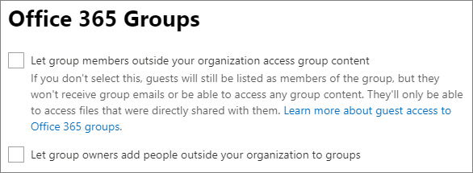

# Delen beperken in Microsoft 365

Hoewel u interne delen niet volledig kunt uitschakelen en de Delen-knop niet van sites kunt verwijderen, kunt u op verschillende manieren het delen in Microsoft 365 beperken om tegemoet te komen aan de behoeften van uw organisatie.

De methoden voor het delen van bestanden worden weergegeven in de onderstaande tabel. Klik op de link in de kolom **Deelmethode** voor meer informatie.

|Deelmethode|Beschrijving|Mogelijkheden beperken|
|:-------------|:----------|:-------------|
|[Microsoft 365-groep of -team](#microsoft-365-group-or-team)|Personen die toegang hebben tot een team van Microsoft Teams of Microsoft 365, hebben toegang tot bestanden in de gekoppelde SharePoint-site.|Indien de groep of het team privé is, worden uitnodigingen om lid te worden van het team naar de eigenaar gestuurd voor goedkeuring. Beheerders kunnen gasttoegang uitschakelen of gevoeligheidslabels gebruiken om te voorkomen dat personen van buiten de organisatie toegang krijgen.|
|[SharePoint-site](#sharepoint-site)|Personen kunnen toegang krijgen tot een SharePoint-site als Eigenaar, Lid of Bezoeker, en hebben op dit niveau toegang tot bestanden op de site.|Sitemachtigingen kunnen worden beperkt, zodat alleen site-eigenaren de site kunnen delen. Beheerders kunnen een site instellen op alleen-lezen of de toegang helemaal blokkeren.|
|[Delen met specifieke personen](#sharing-with-specific-people)|Siteleden en personen met machtiging voor bewerkingen kunnen rechtstreekse machtigingen geven voor bestanden en mappen of ze delen met behulp van *Specifieke personen*-links.|Sitemachtigingen kunnen worden beperkt, zodat alleen site-eigenaren de bestanden en mappen kunnen delen. In dit geval wordt het delen van rechtstreekse toegang en een *Specifieke personen*-link aan de site-eigenaar voorgelegd voor toestemming.|
|[SharePoint-gast delen](#sharepoint-guest-sharing)|SharePoint-site-eigenaren en -leden kunnen bestanden en mappen delen met personen buiten de organisatie.|Het delen van gasten kan worden uitgeschakeld voor de hele organisatie of voor afzonderlijke sites.|
|[*Personen in uw organisatie* links delen](#people-in-your-organization-sharing-links)|SharePoint-site-eigenaren en -leden kunnen bestanden delen met *Personen in uw organisatie*-links. Dit werkt voor iedereen binnen de organisatie.|*Personen in uw organisatie*-links kunnen worden uitgeschakeld op siteniveau.|
|[Sites, groepen en teams maken](#create-sites-groups-and-teams)|Standaard kunnen gebruikers nieuwe sites, groepen en teams maken waaruit inhoud kan worden gedeeld.|Beheerders kunnen beperken wie sites, groepen en teams kan maken.|
|[E-mail](#email)|Personen met toegang tot een bestand kunnen het via e-mail naar anderen verzenden.|Beheerders kunnen bestanden versleutelen met behulp van gevoeligheidslabels om te voorkomen dat ze worden gedeeld met niet-geautoriseerde personen.|
|[Bestanden downloaden of kopiëren](#download-or-file-copy)|Personen met toegang tot een bestand kunnen het downloaden of kopiëren en delen met anderen buiten het bereik van Microsoft 365.|Beheerders kunnen bestanden versleutelen met behulp van gevoeligheidslabels om te voorkomen dat ze worden gedeeld met niet-geautoriseerde personen.|

U kunt ook de voorwaarden beperken waaronder anderen toegang hebben tot gedeelde inhoud. Zie [voorwaardelijke toegang](#conditional-access) verderop in dit artikel voor meer informatie.

U kunt de beheerdersbesturingselementen die in dit artikel worden beschreven, gebruiken om het delen binnen uw organisatie te beperken. U wordt ten zeerste aangeraden de beveiligings- en compliance-functies in Microsoft 365 te gebruiken om een veilige deelomgeving te creëren. Zie [Samenwerken aan bestanden in SharePoint met Microsoft 365](https://docs.microsoft.com/sharepoint/deploy-file-collaboration) en [Configureer een team met beveiligingsisolatie](secure-teams-security-isolation.md) voor meer informatie.

Als u wilt weten hoe delen wordt gebruikt binnen uw organisatie, [laat u een rapport opstellen over het delen van bestanden en mappen](https://docs.microsoft.com/sharepoint/sharing-reports).

## Microsoft 365-groep of -team

Als u het delen binnen een Microsoft 365-groep of Microsoft Teams-team wilt beperken, is het belangrijk dat u de groep of het team privé maakt. Personen binnen uw organisatie kunnen op elk gewenst moment lid worden van een openbare groep of team. Tenzij de groep of het team privé is, kunt u het delen van het team of de bestanden binnen de organisatie niet beperken.

### Gasten delen

Als u wilt voorkomen dat gasttoegang in Teams wordt ingeschakeld, kunt u het delen met gasten uitschakelen in het Beheercentrum van Teams.

Het delen met gasten uitschakelen voor Teams
1. Vouw in het Beheercentrum van Teams **Instellingen voor hele organisatie** uit en klik vervolgens op **Gasttoegang**.
2. Schakel **Gasttoegang in Teams toestaan** uit.
3. Klik op **Opslaan**.

Als u gasttoegang in Microsoft 365-groepen wilt voorkomen, kunt u de instellingen voor gasttoegang in het Microsoft 365-beheercentrum uitschakelen.

Het delen met gasten uitschakelen in Microsoft 365-groepen
1. Klik in het Microsoft 365-beheercentrum op **Instellingen** en vervolgens op **Organisatie-instellingen**.
2. Klik in het tabblad **Services** op **Microsoft 365-groepen**.
3. Schakel de selectievakjes voor **Groepsleden buiten uw organisatie toegang geven tot groepsinhoud** en **Groepseigenaren personen van buiten uw organisatie toe laten voegen aan groepen** uit.
4. Klik op **Wijzigingen opslaan**.

    

> [!NOTE]
> Als u het delen met gasten voor een bepaalde groep of een bepaald team wilt voorkomen, kunt u dit doen met behulp van [Microsoft PowerShell](per-group-guest-access.md) or [gevoeligheidslabels](https://docs.microsoft.com/microsoft-365/compliance/sensitivity-labels-teams-groups-sites).

U kunt het delen met gasten beperken voor gebruikers van specifieke domeinen door domeinen toe te staan of te blokkeren in Azure Active Directory. Dit is ook van invloed op het delen met gasten in SharePoint, als u [SharePoint-en OneDrive-integratie met Azure AD B2B](https://docs.microsoft.com/sharepoint/sharepoint-azureb2b-integration-preview)hebt ingeschakeld.

Uitnodigingen voor delen alleen bij specifieke domeinen toestaan
1. Klik in Azure Active Directory op de Overzichtspagina op **Organisatierelaties**.
2. Klik op **Instellingen**.
3. Onder **Samenwerkingsbeperkingen**selecteert u **Uitnodigingen weigeren bij de gespecificeerde domeinen** of **Alleen uitnodigingen toestaan voor de gespecificeerde domeinen**en typ vervolgens de domeinen in die u wilt gebruiken.
4. Klik op **Opslaan**.

    

## SharePoint-site

U kunt het delen van SharePoint-sites beperken tot alleen site-eigenaren. Hiermee voorkomt u dat siteleden de site delen. Als de site is verbonden met een Microsoft 365-groep, kunnen groepsleden anderen uitnodigen voor de groep en kunnen deze gebruikers toegang krijgen tot de site.

Het delen van een site beperken tot eigenaren
1. Klik in de werkbalk op het pictogram voor Instellingen en vervolgens op **Site-machtigingen**.
2. Klik onder **Instellingen voor delen** op **Instellingen voor delen wijzigen**.
3. Selecteer **Site-eigenaren en -leden, en personen met machtigingen voor bewerken kunnen bestanden en mappen delen, maar alleen site-eigenaren kunnen de site delen**.
4. Klik op **Opslaan**.

    

U kunt voorkomen dat gebruikers die geen deel uitmaken van de site toegang aanvragen door toegangsaanvragen uit te schakelen.

Toegangsaanvragen uitschakelen
1. Klik in de werkbalk op het pictogram voor Instellingen en vervolgens op **Site-machtigingen**.
2. Klik onder **Instellingen voor delen** op **Instellingen voor delen wijzigen**.
3. Schakel **Toegangsaanvragen toestaan** uit en klik op **Opslaan**.

U kunt het delen van een site beperken tot specifieke domeinen door domeinen toe te staan of te blokkeren voor de site.

Het delen van een site beperken
1. Klik in het SharePoint-beheercentrum onder **Sites** op **Actieve sites**.
2. Klik op de site die u wilt configureren.
3. Klik op het tabblad **Beleid** onder **Extern delen** op **Bewerken**.
4. Onder **Geavanceerde instellingen voor extern delen** selecteert u **Delen beperken per domein**.
5. Voeg de domeinen toe die u wilt toelaten of blokkeren en klik vervolgens op **Opslaan**.
6. Klik op **Opslaan**.

    

### Toegang tot een site blokkeren

U kunt de toegang tot een site blokkeren of een site het kenmerk alleen-lezen geven door de vergrendelingsstatus van de site te wijzigen. Zie voor meer informatie [Sites vergrendelen en ontgrendelen](https://docs.microsoft.com/sharepoint/manage-lock-status).

### Overname van machtigingen

Hoewel niet aanbevolen kunt u de [Overname van machtigingen in SharePoint](https://docs.microsoft.com/sharepoint/what-is-permissions-inheritance) gebruiken voor het aanpassen van toegangsniveaus tot sites en subsites.

## Delen met specifieke personen

Als u het delen van een site of de inhoud ervan wilt beperken, kunt u de site zo configureren dat alleen site-eigenaren bestanden, mappen en de site kunnen delen. Wanneer dit is geconfigureerd, worden pogingen van siteleden om bestanden of mappen te delen met behulp van *Specifieke personen*-links naar de site-eigenaar doorgestuurd voor goedkeuring.

Het delen van de site, bestanden of mappen beperken tot eigenaren
1. Klik in de werkbalk op het pictogram voor Instellingen en vervolgens op **Site-machtigingen**.
2. Klik onder **Instellingen voor delen** op **Instellingen voor delen wijzigen**.
3. Selecteer **Alleen site-eigenaren kunnen bestanden, mappen en de site** delen.
4. Klik op **Opslaan**.

    

## Delen met gasten in SharePoint

Als u wilt voorkomen dat SharePoint- of OneDrive-bestanden of -mappen worden gedeeld met personen buiten uw organisatie, kunt u het delen met gasten voor de hele organisatie of voor een afzonderlijke site uitschakelen.

Delen met gasten in SharePoint uitschakelen voor uw organisatie
1. Klik in het SharePoint-beheercentrum onder **Beleid** op **Delen**.
2. Sleep de SharePoint-schuifregelaar onder **Extern delen** naar **Alleen personen in uw organisatie**.
3. Klik op **Opslaan**.

    

Het delen met gasten uitschakelen voor een site
1. Klik in het SharePoint-beheercentrum onder **Sites** op **Actieve sites**.
2. Klik op de site die u wilt configureren.
3. Klik op het tabblad **Beleid** onder **Extern delen** op **Bewerken**.
4. Kies onder**Extern delen** voor **Alleen personen in uw organisatie** en klik vervolgens op **Opslaan**.

    

Als u het delen met personen buiten uw organisatie wilt toestaan, maar wel wilt dat iedereen wordt geverifieerd, kunt u de *Iedereen*-links (anoniem delen) voor de hele organisatie of voor een afzonderlijke site uitschakelen.

*Iedereen*-links op organisatieniveau uitschakelen
1. Klik in het SharePoint-beheercentrum onder **Beleid** op **Delen**.
2. Sleep de SharePoint-schuifregelaar onder **Extern delen** naar **Nieuwe en bestaande gasten**.
3. Klik op **Opslaan**.

    

*Iedereen*-links voor een site uitschakelen
1. Klik in het SharePoint-beheercentrum onder **Sites** op **Actieve sites**.
2. Klik op de site die u wilt configureren.
3. Klik op het tabblad **Beleid** onder **Extern delen** op **Bewerken**.
4. Kies onder **Extern delen** voor **Nieuwe en bestaande gasten** en klik vervolgens op **Opslaan**.

    

## *Personen in uw organisatie*-links delen

Leden van een site kunnen standaard bestanden en mappen delen met andere personen in uw organisatie met behulp van een *Personen in uw organisatie*-link. Met PowerShell kunt u *Personen in uw organisatie*-links uitschakelen:

`Set-SPOSite -Identity <site> -DisableCompanyWideSharingLinks`

Bijvoorbeeld:

`Set-SPOSite -Identity https://contoso.sharepoint.com -DisableCompanyWideSharingLinks`

## Sites, groepen en teams maken

Standaard kunnen gebruikers nieuwe sites, groepen en teams maken waaruit inhoud kan worden gedeeld (afhankelijk van de instellingen voor delen). U kunt beperken wie sites, groepen en teams kan maken. Zie de volgende referenties:

- [Gebruikers hun eigen sites laten maken in SharePoint](https://docs.microsoft.com/sharepoint/manage-site-creation)
- [Beheren wie Microsoft 365-groepen kunnen](https://docs.microsoft.com/microsoft-365/solutions/manage-creation-of-groups) maken

Houd er rekening mee dat het maken van een groep het maken van een team beperkt.

## E-mail

U kunt ongewenste e-mailberichten voorkomen door versleuteling te gebruiken. Dit voorkomt dat e-mails worden doorgestuurd of op een andere manier worden gedeeld met niet-geautoriseerde gebruikers. U kunt e-mailversleuteling inschakelen met behulp van gevoeligheidslabels. Zie [Toegang tot inhoud beperken door versleuteling te gebruiken met gevoeligheidslabels](https://docs.microsoft.com/microsoft-365/compliance/encryption-sensitivity-labels) voor meer informatie.

## Bestanden downloaden of kopiëren

Gebruikers die toegang hebben tot bestanden en mappen in Microsoft 365, kunnen bestanden downloaden en naar externe media kopiëren. U kunt het risico op ongewenste bestandsdeling beperken door de inhoud te versleutelen met behulp van gevoeligheidslabels.

## Voorwaardelijke toegang

Voorwaardelijke toegang in Azure Active Directory biedt opties om delen met personen te beperken of te voorkomen op basis van de netwerklocatie, de status van het apparaat, het risico voor aanmelding en andere factoren. Zie [Wat is voorwaardelijke toegang?](https://docs.microsoft.com/azure/active-directory/conditional-access/overview)

SharePoint biedt rechtstreekse integratie met voorwaardelijke toegang tot Azure Active Directory voor zowel niet-beheerde apparaten als netwerklocaties. Zie de volgende referenties voor details:

- [Toegang beheren vanaf niet-beheerde apparaten](https://docs.microsoft.com/sharepoint/control-access-from-unmanaged-devices)
- [Toegang tot SharePoint en OneDrive-gegevens regelen op basis van netwerklocatie](https://docs.microsoft.com/sharepoint/control-access-based-on-network-location)

## Zie ook

[Overzicht van instellingen voor delen met gasten in Microsoft 365](microsoft-365-guest-settings.md)
