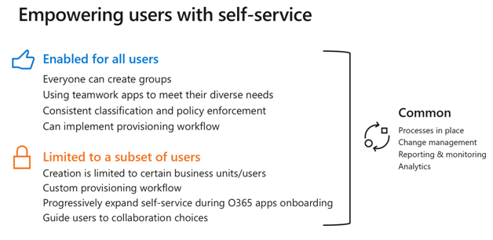

# Beheer organisatie en levenscyclusbeheer voor Microsoft 365-groepen en Microsoft teams

Microsoft 365-groepen heeft een uitgebreide set hulpmiddelen voor de implementatie van de beheermogelijkheden die uw organisatie nodig heeft. 

In de volgende sectie worden de mogelijkheden beschreven, aanbevolen procedures aanbevolen en richtlijnen om de juiste vragen te stellen voor het bepalen van de vereisten voor beheer en hoe u deze kunt gebruiken.

## Bepalen wie Microsoft 365-groepen kan maken

Groepen kunnen worden gemaakt door eindgebruikers van meerdere eindpunten, waaronder Outlook, SharePoint, teams en andere omgevingen.

We raden u ten zeerste aan om groepseigenaren te bieden en gebruikers te helpen gemakkelijker hun werk gedaan te krijgen. Wanneer u beperkingen voor groepen en teams beperkt, kunnen gebruikers de productiviteit van de gebruikers verminderen omdat voor veel services van Microsoft 365 de groepen die voor de service zijn gemaakt, moeten worden gemaakt.

Houd rekening met de volgende beheeropties voor het maken van groepen:

- Als u de groeps sprawl wilt beperken, gebruikt u [beleidsregels voor groepen](microsoft-365-groups-expiration-policy.md) waarmee u groepen die niet worden gebruikt, automatisch verwijderen.
- Maak het maken van groepen beperkt tot leden van een [beveiligingsgroep met dynamisch lidmaatschap met een dynamisch lidmaatschap](https://docs.microsoft.com/azure/active-directory/users-groups-roles/groups-create-rule) , bijvoorbeeld alle fulltime werknemers.
- Maak het maken van groepen beperkt tot een beveiligingsgroep en vraag gebruikers training te voltooien in het beleid voor groepsgebruik van uw organisatie om lid te worden van de beveiligingsgroep.

Als u wilt beperken wie groepen kan maken, raadpleegt u [Manage wie Microsoft 365-groepen kunnen maken](manage-creation-of-groups.md) voor informatie over het configureren van dit.

## Groep verwijderen, herstellen en archiveren

Wanneer een Microsoft 365-groep wordt verwijderd, wordt deze standaard 30 dagen bewaard. Tijdens deze periode van 30 dagen kunt u de groep nog steeds herstellen. Na 30 dagen worden de groep en de bijbehorende inhoud definitief verwijderd en kunnen deze niet worden hersteld.

Als u wilt dat het bewaarbeleid voor chatberichten, bestanden of e-mail bewaard blijft, blijven deze items behouden nadat de groep is verwijderd. Zie [meer informatie over bewaarbeleid](https://docs.microsoft.com/microsoft-365/compliance/retention-policies) voor meer informatie.

Als u een groep wilt verwijderen, maar de inhoud van een of meer met de groep verbonden services wilt behouden, raadpleegt u [Archief groepen, teams en Yammer](end-life-cycle-groups-teams-sites-yammer.md) voor informatie.

## Naam beleid voor groepen

Met behulp van een Groepsbeleid kunt u op twee manieren groepen beheren:

- Met een naamgevingsbeleid voorvoegsels/achtervoegsels kunnen vaste tekenreeksen of Azure AD-kenmerken aan het begin of einde van de groepsnaam en het bijbehorende e-mailadres worden afgedwongen. Op deze manier kunt u ervoor zorgen dat de namen van de afdelings namen of regio's worden opgenomen in de namen van groepen.
- Met het beleid voor geblokkeerde woorden kunt u ervoor zorgen dat bepaalde woorden, zoals de namen van leidinggevenden, niet worden gebruikt in groepsnamen.

Het naamgevingsbeleid wordt toegepast wanneer groepen worden gemaakt op basis van een van de groepen verbonden services.

Als u het naamgevingsbeleid voor groepen wilt gebruiken, raadpleegt u [Microsoft 365 groepen naam beleid](groups-naming-policy.md).

## Verloopbeleid voor groepen

U kunt een vervalperiode en groepen opgeven waarmee het einde van de periode wordt bereikt, en de groep wordt niet vernieuwd. De verloopperiode begint wanneer de groep is gemaakt, of op de datum waarop deze het laatst is vernieuwd.

Wanneer u groepen hebt ingesteld op verloopt, doet u het volgende:
- Eigenaren van de groep ontvangen een melding voor het verlengen van de groep als het verlopen van de groep.
- Actieve groepen worden automatisch verlengd.
- Alle groepen die niet worden vernieuwd, worden verwijderd.
- Een groep die wordt verwijderd, kan binnen 30 dagen worden teruggezet door de groepseigenaren of de beheerder.

Verloopbeleid is een goede manier om de groeps sprawl te beperken door te zorgen dat groepen die niet meer worden gebruikt, worden verwijderd. Zie [verloopbeleid voor groepen Microsoft 365](microsoft-365-groups-expiration-policy.md)als u een verloopbeleid voor groepen wilt maken.
