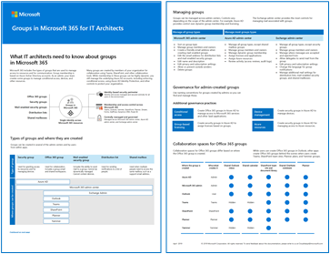
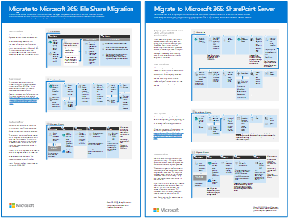
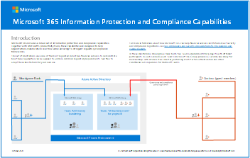

# Illustraties van Microsoft 365-productiviteitMicrosoft 365 productivity illustrations

De Microsoft 365 enterprise-oplossingsreeks biedt richtlijnen voor het implementeren van Microsoft 365-mogelijkheden, met name wanneer de mogelijkheden technologieën kruisen, Teams architectuurdiagrammen.The Microsoft 365 enterprise solution series provides guidance for implementing Microsoft 365 capabilities, especially where capabilities cross technologies, including Teams architecture diagrams.

## Microsoft Teams en gerelateerde productiviteitsservices in Microsoft 365 voor IT-architectenMicrosoft Teams and related productivity services in Microsoft 365 for IT architects
De logische architectuur van productiviteitsservices in Microsoft 365, geleid door Microsoft Teams.The logical architecture of productivity services in Microsoft 365, leading with Microsoft Teams.

| ItemItem | BeschrijvingDescription |
|:-----|:-----|
|   [PDF](https://github.com/MicrosoftDocs/microsoft-365-docs/raw/public/microsoft-365/downloads/msft-m365-teams-logical-architecture.pdf) \| [Visio](https://github.com/MicrosoftDocs/microsoft-365-docs/raw/public/microsoft-365/downloads/msft-m365-teams-logical-architecture.vsdx)[PDF](https://github.com/MicrosoftDocs/microsoft-365-docs/raw/public/microsoft-365/downloads/msft-m365-teams-logical-architecture.pdf) \| [Visio](https://github.com/MicrosoftDocs/microsoft-365-docs/raw/public/microsoft-365/downloads/msft-m365-teams-logical-architecture.vsdx)   Bijgewerkt in januari 2021Updated January 2021   |Microsoft biedt een pakket met productiviteitsservices die samenwerken met behulp van functies voor gegevensbeheer, beveiliging en compliance.Microsoft provides a suite of productivity services that work together to provide collaboration experiences with data governance, security, and compliance capabilities.    Deze reeks illustraties biedt een overzicht van de logische architectuur van productiviteitsservices voor ondernemingsarchitecten, geleid door Microsoft Teams.This series of illustrations provides a view into the logical architecture of productivity services for enterprise architects, leading with Microsoft Teams.|

## Groepen in Microsoft 365 voor IT-architectenGroups in Microsoft 365 for IT Architects
Deze afbeelding bevat informatie voor IT-architecten over Microsoft 365 Groepen.This illustration includes information for IT architects about Microsoft 365 Groups. Zie Veilige samenwerking met Microsoft 365 en Wat is samenwerkingsbeheer? voor  meer informatie over het configureren en beheren van Microsoft 365 groepen en teams voor samenwerking in [uw organisatie.](/microsoft-365/solutions/collaboration-governance-overview)To learn about configuring and administering Microsoft 365 Groups and teams for collaboration in your organization, see [Set up secure collaboration with Microsoft 365](/microsoft-365/solutions/setup-secure-collaboration-with-teams) and [What is collaboration governance?](/microsoft-365/solutions/collaboration-governance-overview).

| ItemItem | BeschrijvingDescription |
|:-----|:-----|
|   [PDF](https://github.com/MicrosoftDocs/microsoft-365-docs/raw/public/microsoft-365/downloads/msft-m365-groups.pdf) \| [Visio](https://github.com/MicrosoftDocs/OfficeDocs-Enterprise/raw/live/Enterprise/downloads/msft-m365-groups.vsdx)[PDF](https://github.com/MicrosoftDocs/microsoft-365-docs/raw/public/microsoft-365/downloads/msft-m365-groups.pdf) \| [Visio](https://github.com/MicrosoftDocs/OfficeDocs-Enterprise/raw/live/Enterprise/downloads/msft-m365-groups.vsdx)   Bijgewerkt in mei 2020Updated May 2020|Deze illustraties tonen verschillende soorten groepen, hoe ze worden gemaakt en beheerd, en enkele aanbevelingen voor beheer.These illustrations detail the different types of groups, how these are created and managed, and a few governance recommendations.|

## Migreren naar Microsoft 365Migrate to Microsoft 365

Microsoft biedt hulpprogramma's voor het migreren van uw on-premises netwerkbestandsaandelen en SharePoint Serversites naar Microsoft 365 met de nadruk op het beveiligen en waarborgen van de beveiliging van uw inhoud tijdens de migratie.Microsoft provides tools to migrate your on-premises network file shares and SharePoint Server sites to Microsoft 365 with an emphasis on protecting and ensuring your content's security during migration. Deze reeks illustraties toont de verschillende methoden die beschikbaar zijn om uw inhoud te verplaatsen naar SharePoint, Teams en OneDrive en hoe uw gegevens door het proces stromen.This set of illustrations demonstrates the various methods available to move your content to SharePoint, Teams, and OneDrive and how your data flows through the process.

| ItemItem | BeschrijvingDescription |
|:-----|:-----|
| 
 [PDF](https://download.microsoft.com/download/0/5/b/05b7fb7c-1557-4ebb-9036-c5fc3a4cd94c/m365-migration-posters-mm-spmt.pdf)\|[Visio](https://download.microsoft.com/download/0/5/b/05b7fb7c-1557-4ebb-9036-c5fc3a4cd94c/m-365-migration-posters-mm-spmt.vsdx)[PDF](https://download.microsoft.com/download/0/5/b/05b7fb7c-1557-4ebb-9036-c5fc3a4cd94c/m365-migration-posters-mm-spmt.pdf)\|[Visio](https://download.microsoft.com/download/0/5/b/05b7fb7c-1557-4ebb-9036-c5fc3a4cd94c/m-365-migration-posters-mm-spmt.vsdx) 
 Bijgewerkt in maart 2021Updated March 2021 |Omvat:Includes: <ul><li> Migratie van bestands delenFile share migration</li><li>SharePoint ServermigratieSharePoint Server migration</li></ul> 
 Zie Uw inhoud migreren [naar Microsoft 365.](/sharepointmigration/migrate-to-sharepoint-online)For more information, see [Migrate your content to Microsoft 365](/sharepointmigration/migrate-to-sharepoint-online).|

## Microsoft 365 mogelijkheden voor informatiebeveiliging en complianceMicrosoft 365 information protection and compliance capabilities

Microsoft 365 bevat een breed scala aan informatiebeveiligings- en compliancemogelijkheden.Microsoft 365 includes a broad set of information protection and compliance capabilities. Samen met de productiviteitshulpprogramma's van Microsoft zijn deze mogelijkheden ontworpen om organisaties te helpen in realtime samen te werken terwijl ze zich houden aan strikte regelgevingskaders.Together with Microsoft’s productivity tools, these capabilities are designed to help organizations collaborate in real time while adhering to stringent regulatory compliance frameworks.

Deze reeks illustraties maakt gebruik van een van de meest gereguleerde bedrijfstakken, financiële services, om aan te tonen hoe deze mogelijkheden kunnen worden toegepast om te voldoen aan gemeenschappelijke wettelijke vereisten.This set of illustrations uses one of the most regulated industries, financial services, to demonstrate how these capabilities can be applied to address common regulatory requirements. U kunt deze illustraties aan uw eigen wensen aanpassen.Feel free to adapt these illustrations for your own use.

| ItemItem | BeschrijvingDescription |
|:-----|:-----|
|   Engels: [Downloaden als PDF](https://download.microsoft.com/download/3/a/6/3a6ab1a3-feb0-4ee2-8e77-62415a772e53/m365-compliance-illustrations.pdf)\| [Downloaden als Visio  ](https://download.microsoft.com/download/3/a/6/3a6ab1a3-feb0-4ee2-8e77-62415a772e53/m365-compliance-illustrations.vsdx)English: [Download as a PDF](https://download.microsoft.com/download/3/a/6/3a6ab1a3-feb0-4ee2-8e77-62415a772e53/m365-compliance-illustrations.pdf)  \| [Download as a Visio](https://download.microsoft.com/download/3/a/6/3a6ab1a3-feb0-4ee2-8e77-62415a772e53/m365-compliance-illustrations.vsdx)   Japans: [Downloaden als PDF](https://download.microsoft.com/download/6/f/1/6f1a7d0e-dd8e-442e-b073-8e94327ae4f8/m365-compliance-illustrations.pdf)\| [Downloaden als Visio  ](https://download.microsoft.com/download/6/f/1/6f1a7d0e-dd8e-442e-b073-8e94327ae4f8/m365-compliance-illustrations.vsdx)Japanese: [Download as a PDF](https://download.microsoft.com/download/6/f/1/6f1a7d0e-dd8e-442e-b073-8e94327ae4f8/m365-compliance-illustrations.pdf)  \| [Download as a Visio](https://download.microsoft.com/download/6/f/1/6f1a7d0e-dd8e-442e-b073-8e94327ae4f8/m365-compliance-illustrations.vsdx)   Laatst bijgewerkt: november 2020Updated November 2020|Omvat:Includes: <ul><li>  Microsoft informatiebescherming en preventie van gegevensverliesMicrosoft information protection and data loss prevention</li><li>Bewaarbeleid en retentielabelsRetention policies and retention labels </li><li>InformatiebelemmeringenInformation barriers</li><li>CommunicatiecomplianceCommunication compliance</li><li>Insider-risicoInsider risk</li><li>Gegevens ingestie van derdenThird-party data ingestion</li>|

## Beveiliging en informatiebescherming voor organisaties met meerdere regio'sSecurity and Information Protection for Multi-Region Organizations
Beveiliging en informatiebeveiliging voor organisaties met meerdere regio's met één Microsoft 365 tenantSecurity and information protection for multi-region organizations with a single Microsoft 365 tenant

| ItemItem | BeschrijvingDescription |
|:-----|:-----|
|   [PDF](https://github.com/MicrosoftDocs/microsoft-365-docs/raw/public/microsoft-365/downloads/msft-security-info-protect-multi-region.pdf) \| [Visio](https://github.com/MicrosoftDocs/microsoft-365-docs/raw/public/microsoft-365/downloads/msft-security-info-protect-multi-region.vsdx)[PDF](https://github.com/MicrosoftDocs/microsoft-365-docs/raw/public/microsoft-365/downloads/msft-security-info-protect-multi-region.pdf) \| [Visio](https://github.com/MicrosoftDocs/microsoft-365-docs/raw/public/microsoft-365/downloads/msft-security-info-protect-multi-region.vsdx) Laatst bijgewerkt: maart 2020Updated March 2020 |Een Microsoft 365-tenant voor uw wereldwijde organisatie is de beste keuze en ervaring om een groot aantal redenen.Using a single Microsoft 365 tenant for your global organization is the best choice and experience for many reasons. Veel architecten weten echter niet precies hoe ze de doelen voor beveiliging en informatiebescherming in verschillende regio's moeten realiseren.However, many architects wrestle with how to meet security and information protection objectives across different regions. In deze serie onderwerpen vindt u aanbevelingen.This set of topics provides recommendations. |

## Microsoft Defender voor de implementatiestrategie voor eindpuntenMicrosoft Defender for Endpoint deployment strategy

Sommige hulpprogramma's zijn beter geschikt voor bepaalde architecturen, afhankelijk van uw omgeving.Depending on your environment, some tools are better suited for certain architectures.

| ItemItem | BeschrijvingDescription |
|:-----|:-----|
|  [PDF](https://github.com/MicrosoftDocs/microsoft-365-docs/raw/public/microsoft-365/security/defender-endpoint/downloads/mdatp-deployment-strategy.pdf) \| [Visio](https://github.com/MicrosoftDocs/microsoft-365-docs/raw/public/microsoft-365/security/defender-endpoint/downloads/mdatp-deployment-strategy.vsdx)[PDF](https://github.com/MicrosoftDocs/microsoft-365-docs/raw/public/microsoft-365/security/defender-endpoint/downloads/mdatp-deployment-strategy.pdf)  \| [Visio](https://github.com/MicrosoftDocs/microsoft-365-docs/raw/public/microsoft-365/security/defender-endpoint/downloads/mdatp-deployment-strategy.vsdx)  Laatst bijgewerkt: februari 2020Updated February 2020| Met het materiaal voor architecten kunt u uw implementatie plannen voor de volgende architecturen:The architectural material helps you plan your deployment for the following architectures: <ul><li> Cloud-nativeCloud-native </li><li> Co-managementCo-management </li><li> On-premisesOn-premise</li><li>Evaluatie en lokale onboardingEvaluation and local onboarding</li>

## Identiteits- en apparaatbeveiliging voor Microsoft 365Identity and device protection for Microsoft 365

Aanbevolen mogelijkheden voor het beveiligen van identiteiten en apparaten die toegang hebben tot Microsoft 365, andere SaaS-services en on-premises toepassingen die zijn gepubliceerd met Azure AD Application Proxy.Recommended capabilities for protecting identities and devices that access Microsoft 365, other SaaS services, and on-premises applications published with Azure AD Application Proxy.

| ItemItem | BeschrijvingDescription |
|:-----|:-----|
|    [Weergeven als pdf-bestand](../downloads/MSFT_cloud_architecture_identity&device_protection.pdf) \| [Downloaden als PDF](https://github.com/MicrosoftDocs/microsoft-365-docs/raw/public/microsoft-365/downloads/MSFT_cloud_architecture_identity&device_protection.pdf) \| [Downloaden als een Visio](https://github.com/MicrosoftDocs/microsoft-365-docs/raw/public/microsoft-365/downloads/MSFT_cloud_architecture_identity&device_protection.vsdx)  [View as a PDF](../downloads/MSFT_cloud_architecture_identity&device_protection.pdf) \| [Download as a PDF](https://github.com/MicrosoftDocs/microsoft-365-docs/raw/public/microsoft-365/downloads/MSFT_cloud_architecture_identity&device_protection.pdf)  \| [Download as a Visio](https://github.com/MicrosoftDocs/microsoft-365-docs/raw/public/microsoft-365/downloads/MSFT_cloud_architecture_identity&device_protection.vsdx)   Bijgewerkt in september 2020Updated September 2020|Het is belangrijk dat u een consistent beveiligingsniveau gebruikt voor uw gegevens, identiteiten en apparaten.It's important to use consistent levels of protection across your data, identities, and devices. In dit model ziet u welke mogelijkheden vergelijkbaar zijn met meer informatie over de mogelijkheden om identiteiten en apparaten te beschermen.This model shows you which capabilities are comparable with more information on capabilities to protect identities and devices.    |

## Advanced eDiscovery architectuur in Microsoft 365Advanced eDiscovery architecture in Microsoft 365

Advanced eDiscovery end-to-end werkstroom en gegevensstroom, ook binnen Microsoft 365 Multi-Geo-omgevingen.Advanced eDiscovery end-to-end workflow and data flow, including within Microsoft 365 Multi-Geo environments.

| ItemItem | BeschrijvingDescription |
|:-----|:-----|
|   [Weergeven als een afbeelding](../media/solutions-architecture-center/m365-advanced-ediscovery-architecture.png) \| [Downloaden als PDF](https://download.microsoft.com/download/d/1/c/d1ce536d-9bcf-4d31-b75b-fcf0dc560665/m365-advanced-ediscovery-architecture.pdf) \| [Downloaden als een Visio](https://download.microsoft.com/download/d/1/c/d1ce536d-9bcf-4d31-b75b-fcf0dc560665/m365-advanced-ediscovery-architecture.vsdx)  [View as an image](../media/solutions-architecture-center/m365-advanced-ediscovery-architecture.png) \| [Download as a PDF](https://download.microsoft.com/download/d/1/c/d1ce536d-9bcf-4d31-b75b-fcf0dc560665/m365-advanced-ediscovery-architecture.pdf)  \| [Download as a Visio](https://download.microsoft.com/download/d/1/c/d1ce536d-9bcf-4d31-b75b-fcf0dc560665/m365-advanced-ediscovery-architecture.vsdx)   Bijgewerkt in oktober 2020Updated October 2020|Omvat:Includes: <ul><li>  End-to-end-werkstroom in één omgevingEnd-to-end workflow in a single environment</li><li>End-to-end-werkstroom in een Microsoft 365 Multi-Geo-omgevingEnd-to-end workflow in a Microsoft 365 Multi-Geo environment </li><li>End-to-end-gegevensstroom die de EDRM-werkstroom ondersteuntEnd-to-end data flow supporting the EDRM workflow</li> |

## Microsoft telefonieoplossingenMicrosoft Telephony Solutions

Microsoft ondersteunt verschillende opties bij het begin van uw ervaring met Teams in de Microsoft-cloud.Microsoft supports several options as you begin your journey to Teams in the Microsoft cloud. Met deze poster kunt u bepalen welke Microsoft-telefonie-oplossing (telefoonsysteem in de cloud of Enterprise Voice on-premises) geschikt is voor gebruikers in uw organisatie en hoe u uw organisatie kunt koppelen aan het openbare PSTN (Public Switched Telephone Network).This poster helps you decide which Microsoft telephony solution (Phone System in the cloud or Enterprise Voice on-premises) is right for users in your organization, and how your organization can connect to the Public Switched Telephone Network (PSTN).

| ItemItem | BeschrijvingDescription |
|:-----|:-----|
|   [PDF](https://download.microsoft.com/download/4/3/5/435cd4e9-ca56-4fd1-acb6-d1fda7952320/microsoft-voice-solutions.pdf) \| [Visio](https://download.microsoft.com/download/7/5/c/75c13012-e20c-48bd-a6dd-ea49d1a3420d/microsoft-voice-solutions.vsdx)[PDF](https://download.microsoft.com/download/4/3/5/435cd4e9-ca56-4fd1-acb6-d1fda7952320/microsoft-voice-solutions.pdf) \| [Visio](https://download.microsoft.com/download/7/5/c/75c13012-e20c-48bd-a6dd-ea49d1a3420d/microsoft-voice-solutions.vsdx)  Bijgewerkt in maart 2021Updated March 2021 | Zie Uw spraakoplossing [plannen voor Teams meer informatie.](/microsoftteams/cloud-voice-landing-page)For more information, see [Plan your Teams voice solution](/microsoftteams/cloud-voice-landing-page).|

## Uw infrastructuur instellen voor hybride werkSet up your infrastructure for hybrid work

Met Microsoft 365 en andere Microsoft-cloudtechnologieën kunt u uw werknemers veilige toegang bieden tot de on-premises en cloudgebaseerde informatie, hulpprogramma's en resources van uw organisatie vanuit hun huis.With Microsoft 365 and other Microsoft cloud technologies, you can provide your workers with secure access to your organization's on-premises and cloud-based information, tools, and resources from their homes.

  
[PDF](https://download.microsoft.com/download/9/b/b/9bb5fa79-74e9-497b-87c5-4021e53d9fc2/hybrid-worker-infrastructure.pdf)  |  [PowerPoint](https://download.microsoft.com/download/9/b/b/9bb5fa79-74e9-497b-87c5-4021e53d9fc2/hybrid-worker-infrastructure.pptx)[PDF](https://download.microsoft.com/download/9/b/b/9bb5fa79-74e9-497b-87c5-4021e53d9fc2/hybrid-worker-infrastructure.pdf) | [PowerPoint](https://download.microsoft.com/download/9/b/b/9bb5fa79-74e9-497b-87c5-4021e53d9fc2/hybrid-worker-infrastructure.pptx)  
Bijgewerkt juni 2021Updated June 2021

Zie het artikel voor deze poster voor meer informatie: Uw infrastructuur instellen voor hybride [werk met Microsoft 365.](empower-people-to-work-remotely.md)For more information, see the article for this poster: [Set up your infrastructure for hybrid work with Microsoft 365](empower-people-to-work-remotely.md).

## Microsoft Teams beveiligingsisolatieMicrosoft Teams with security isolation

Met Microsoft 365 kunt u een privéteam configureren in Microsoft Teams en SharePoint sitebeveiligingsinstellingen en een uniek gevoeligheidslabel gebruiken om bestanden te versleutelen, zodat alleen teamleden ze kunnen ontsleutelen.With Microsoft 365, you can configure a private team in Microsoft Teams and use SharePoint site security settings and a unique sensitivity label to encrypt files so that only team members can decrypt them.

  
[PDF](https://github.com/MicrosoftDocs/microsoft-365-docs/raw/public/microsoft-365/downloads/team-security-isolation-poster.pdf)  |  [PowerPoint](https://download.microsoft.com/download/8/0/5/8057fc16-c044-40b6-a652-7ed555ba2895/team-security-isolation-poster.pptx)[PDF](https://github.com/MicrosoftDocs/microsoft-365-docs/raw/public/microsoft-365/downloads/team-security-isolation-poster.pdf) | [PowerPoint](https://download.microsoft.com/download/8/0/5/8057fc16-c044-40b6-a652-7ed555ba2895/team-security-isolation-poster.pptx)  
Bijgewerkt in augustus 2020Updated August 2020

Zie het artikel voor deze poster voor meer informatie: [Een team configureren met beveiligingsisolatie.](secure-teams-security-isolation.md)For more information, see the article for this poster: [Configure a team with security isolation](secure-teams-security-isolation.md).

## Zie ookSee Also

[Architectuurmodellen voor SharePoint, Exchange, Skype voor Bedrijven en LyncArchitectural models for SharePoint, Exchange, Skype for Business, and Lync](../enterprise/architectural-models-for-sharepoint-exchange-skype-for-business-and-lync.md)

[Testlabrichtlijnen voor cloudacceptatie (TLG's)Cloud adoption Test Lab Guides (TLGs)](../enterprise/cloud-adoption-test-lab-guides-tlgs.md)
