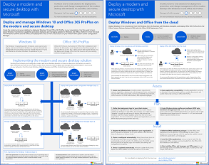

# Illustraties voor Microsoft 365-productiviteit

De Microsoft 365 enterprise solution-serie biedt richtlijnen voor de implementatie van Microsoft 365-mogelijkheden, vooral waar mogelijkheden technologieën overschrijden.

### Microsoft Teams en gerelateerde productiviteitsservices in Microsoft 365 voor IT-architecten
De logische architectuur van productiviteitsservices in Microsoft 365, toonaangevend met Microsoft Teams.

|**Item**|**Beschrijving**|
|:-----|:-----|
|   [PDF](https://github.com/MicrosoftDocs/microsoft-365-docs/raw/public/microsoft-365/downloads/msft-m365-teams-logical-architecture.pdf) \| [Visio](https://github.com/MicrosoftDocs/OfficeDocs-Enterprise/raw/live/Enterprise/downloads/msft-m365-teams-logical-architecture.vsdx)   Bijgewerkt april 2019   |Microsoft biedt een reeks productiviteitsservices die samenwerken om samenwerkingservaringen te bieden met gegevensbeheer, beveiliging en nalevingsmogelijkheden.    Deze serie illustraties biedt een overzicht van de logische architectuur van productiviteitsservices voor bedrijfsarchitecten, toonaangevend met Microsoft Teams.|

### Groepen in Microsoft 365 voor IT-architecten
Wat IT-architecten moeten weten over groepen in Microsoft 365

|**Item**|**Beschrijving**|
|:-----|:-----|
|   [PDF](https://github.com/MicrosoftDocs/microsoft-365-docs/raw/public/microsoft-365/downloads/msft-m365-groups.pdf) \| [Visio](https://github.com/MicrosoftDocs/OfficeDocs-Enterprise/raw/live/Enterprise/downloads/msft-m365-groups.vsdx)   Bijgewerkt juni 2019|Deze illustraties beschrijven de verschillende soorten groepen, hoe deze worden gemaakt en beheerd, en een paar governance aanbevelingen.|

### Beveiliging en informatiebescherming voor organisaties in meerdere regio's
Beveiliging en informatiebescherming voor organisaties in meerdere regio's met één microsoft 365-tenant

|**Item**|**Beschrijving**|
|:-----|:-----|
|   [PDF](https://github.com/MicrosoftDocs/microsoft-365-docs/raw/public/microsoft-365/downloads/msft-security-info-protect-multi-region.pdf) \| [Visio](https://github.com/MicrosoftDocs/microsoft-365-docs/raw/public/microsoft-365/downloads/msft-security-info-protect-multi-region.vsdx) Bijgewerkt maart 2020 |Het gebruik van één Microsoft 365-tenant voor uw wereldwijde organisatie is om vele redenen de beste keuze en ervaring. Veel architecten worstelen echter met hoe ze de doelstellingen op het gebied van beveiliging en informatiebescherming in verschillende regio's kunnen bereiken. Deze reeks onderwerpen geeft aanbevelingen. |

### Microsoft Defender ATP-implementatiestrategie

Afhankelijk van uw omgeving zijn sommige tools beter geschikt voor bepaalde architecturen.

|**Item**|**Beschrijving**|
|:-----|:-----|
|  [PDF](https://github.com/MicrosoftDocs/windows-itpro-docs/raw/public/windows/security/threat-protection/microsoft-defender-atp/downloads/mdatp-deployment-strategy.pdf)  \| [Visio](https://github.com/MicrosoftDocs/windows-itpro-docs/raw/public/windows/security/threat-protection/microsoft-defender-atp/downloads/mdatp-deployment-strategy.vsdx)  Bijgewerkt in februari 2020| Het architectonisch materiaal helpt u bij het plannen van uw implementatie voor de volgende architecturen: <ul><li> Cloud-native </li><li> Co-management </li><li> On-premise</li><li>Evaluatie en lokale onboarding</li>

### Infrastructuur van Microsoft 365 Enterprise Foundation

Krijg in één oogopslag een overzicht van de [basisinfrastructuur](https://docs.microsoft.com/microsoft-365/enterprise/deploy-foundation-infrastructure) voor Microsoft 365 Enterprise om uw implementatie te starten.
  
|**Item**|**Beschrijving**|
|:-----|:-----|
|   [Bekijk online](https://aka.ms/m365efoundinfraposter) \| [PDF](https://github.com/MicrosoftDocs/microsoft-365-docs/raw/public/microsoft-365/downloads/Microsoft365EnterpriseFoundInfra.pdf)   Bijgewerkt in december 2019| Deze poster vat elke fase van de funderingsinfrastructuur samen in termen van doelen, functies en tools, ontwerpbeslissingen, configuratieresultaten, onboarding en doorlopende monitoring en updates.  | 

   

### Identiteits- en apparaatbeveiliging voor Office 365

Aanbevolen mogelijkheden voor het beveiligen van identiteiten en apparaten die toegang hebben tot Office 365, andere SaaS-services en on-premises toepassingen die zijn gepubliceerd met Azure AD Application Proxy.

|**Item**|**Beschrijving**|
|:-----|:-----|
|[          ](https://www.microsoft.com/download/details.aspx?id=55032)   [PDF](https://go.microsoft.com/fwlink/p/?linkid=841656) \| [Visio](https://go.microsoft.com/fwlink/p/?linkid=841657) \| [Meer talen](https://www.microsoft.com/download/details.aspx?id=55032)       Bijgewerkt in november 2018|Het is belangrijk om consistente beschermingsniveaus te gebruiken voor uw gegevens, identiteiten en apparaten. In dit document ziet u welke mogelijkheden vergelijkbaar zijn met meer informatie over mogelijkheden om identiteiten en apparaten te beschermen.    |
   
<!--

### File protection solutions in Office 365

Recommended capabilities for protecting files in Office 365 based on three different sensitivity levels.
  
|**Item**|**Description**|
|:-----|:-----|
|[          ](https://www.microsoft.com/download/details.aspx?id=55523)   [PDF](https://go.microsoft.com/fwlink/?linkid=2004320)  \| [Visio](https://download.microsoft.com/download/7/8/9/789645A5-BD10-4541-BC33-F8D1EFF5E911/MSFT_cloud_architecture_O365%20file%20protection.vsdx)   |It's important to use consistent levels of protection across your data, identities, and devices. This document shows you which capabilities are comparable with more information on capabilities to protect files in Office 365.    |
   

### Office 365 Information Protection for GDPR

Prescriptive recommendations for discovering, classifying, protecting, and monitoring personal data. This solution uses General Data Protection Regulation (GDPR) as an example, but you can apply the same process to achieve compliance with many other regulations.

|**Item**|**Description**|
|:-----|:-----|
|    [PDF](https://download.microsoft.com/download/E/C/D/ECD5A339-EF10-4420-B3A9-99098884D716/MSFT_Cloud_architecture_information%20protection%20for%20GDPR.pdf) \| [Visio](https://download.microsoft.com/download/E/C/D/ECD5A339-EF10-4420-B3A9-99098884D716/MSFT_Cloud_architecture_information%20protection%20for%20GDPR.vsdx)    |To see this content in article format, see [Office 365 Information Protection for GDPR](https://docs.microsoft.com/Office365/SecurityCompliance/office-365-information-protection-for-gdpr).      |

### Microsoft Security Guidance for Political Campaigns, Nonprofits, and Other Agile Organizations 

This guidance describes how to implement a secure cloud environment. The solution guidance can be used by any organization. It includes extra help for agile organizations with BYOD access and guest accounts. You can use this guidance as a starting-point for designing your own environment.

|**Item**|**Description**|
|:-----|:-----|
|**Microsoft Security Guidance for Political Campaigns**   [          ](https://download.microsoft.com/download/B/4/D/B4D520C3-4D0C-4B4D-BFB9-09F0651C2775/MSFT_Cloud_architecture_security%20for%20political%20campaigns.pdf)   [PDF](https://download.microsoft.com/download/B/4/D/B4D520C3-4D0C-4B4D-BFB9-09F0651C2775/MSFT_Cloud_architecture_security%20for%20political%20campaigns.pdf)  \| [Visio](https://download.microsoft.com/download/B/4/D/B4D520C3-4D0C-4B4D-BFB9-09F0651C2775/MSFT_Cloud_architecture_security%20for%20political%20campaigns.vsdx)   |This guidance uses a political campaign organization as an example. Use this guidance as a starting point for any environment.    |
|**Microsoft Security Guidance for Nonprofits**   [          ](https://download.microsoft.com/download/9/4/3/94389612-C679-4061-8DF2-D9A15D72B65F/Microsoft_Cloud%20Architecture_Security%20for%20Nonprofits.pdf)   [PDF](https://download.microsoft.com/download/9/4/3/94389612-C679-4061-8DF2-D9A15D72B65F/Microsoft_Cloud%20Architecture_Security%20for%20Nonprofits.pdf)  \| [Visio](https://download.microsoft.com/download/9/4/3/94389612-C679-4061-8DF2-D9A15D72B65F/Microsoft_Cloud%20Architecture_Security%20for%20Nonprofits.vsdx)   |This guide is slightly revised for nonprofit organizations. For example, it references Office 365 Nonprofit plans. The technical guidance is the same as the political campaign solution guide.    |

This guidance includes Test Lab Guides. For more information, see [Microsoft Security Guidance for Political Campaigns, Nonprofits, and Other Agile Organizations](https://docs.microsoft.com/Office365/SecurityCompliance/microsoft-security-guidance-for-political-campaigns-nonprofits-and-other-agile-o).

-->

### Microsoft-telefonieoplossingen

Microsoft ondersteunt verschillende opties wanneer u uw reis naar Teams in de Microsoft-cloud begint. Met deze poster u bepalen welke Microsoft-telefonieoplossing (Telefoonsysteem in de cloud of Enterprise Voice on-premises) geschikt is voor gebruikers in uw organisatie en hoe uw organisatie verbinding kan maken met het Public Switched Telephone Network (PSTN).

  
[PDF](https://github.com/MicrosoftDocs/OfficeDocs-SkypeForBusiness/raw/live/Teams/downloads/telephony-solutions/microsoft-telephony-solutions-12-19.pdf) | [Visio](https://github.com/MicrosoftDocs/OfficeDocs-SkypeForBusiness/raw/live/Teams/downloads/telephony-solutions/microsoft-telephony-solutions-12-18.vsdx)  
Bijgewerkt januari 2019

Zie voor meer informatie het artikel voor deze poster: [Microsoft Telephony Solutions](https://docs.microsoft.com/SkypeForBusiness/hybrid/msft-telephony-solutions).
  

### Een moderne en beveiligde desktop implementeren met Microsoft

Wat IT-architecten moeten weten over het implementeren en beheren van updates voor Office 365 ProPlus op Windows 10.
  

|**Item**|**Beschrijving**|
|:-----|:-----|
|   [PDF](https://download.microsoft.com/download/4/E/9/4E90E227-770A-41D1-99FE-925A64D81A55/MSFT_modern_secure_desktop.pdf)  \| [Visio](https://download.microsoft.com/download/4/E/9/4E90E227-770A-41D1-99FE-925A64D81A55/MSFT_modern_secure_desktop.vsdx)  Bijgewerkt in september 2017 | Dit model bevat: <ul><li>  Windows 10 en Office ProPlus implementeren vanuit de Microsoft-cloud </li><li>  Windows 10 en Office ProPlus implementeren met Microsoft Endpoint Configuration Manager </li><li>  Updates voor Windows 10 en Office ProPlus beheren vanuit de Microsoft-cloud </li><li>  Updates voor Windows 10 en Office ProPlus beheren met Microsoft Endpoint Configuration Manager </li><li>  Out-of-the-box en extra beveiligingsmogelijkheden van Windows 10 </li></ul>  |
   
## Zie ook

[Architectuurmodellen voor SharePoint, Exchange, Skype voor Bedrijven en Lync](https://docs.microsoft.com/office365/enterprise/architectural-models-for-sharepoint-exchange-skype-for-business-and-lync)
  
[Testlabrichtlijnen voor cloudacceptatie (TLG's)](https://docs.microsoft.com/office365/enterprise/cloud-adoption-test-lab-guides-tlgs)
