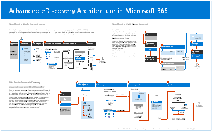

# Illustraties van Microsoft 365-productiviteit

De microsoft 365 enterprise-oplossingsreeks biedt richtlijnen voor het implementeren van Microsoft 365-mogelijkheden, met name wanneer de mogelijkheden technologieën kruisen, waaronder Teams-architectuurdiagrammen.

### Microsoft Teams en gerelateerde productiviteitsservices in Microsoft 365 voor IT-architecten
De logische architectuur van productiviteitsservices in Microsoft 365, geleid door Microsoft Teams.

| Item | Beschrijving |
|:-----|:-----|
|   [PDF](https://github.com/MicrosoftDocs/microsoft-365-docs/raw/public/microsoft-365/downloads/msft-m365-teams-logical-architecture.pdf) \| [Visio](https://github.com/MicrosoftDocs/microsoft-365-docs/raw/public/microsoft-365/downloads/msft-m365-teams-logical-architecture.vsdx)   Bijgewerkt in januari 2021   |Microsoft biedt een pakket met productiviteitsservices die samenwerken met behulp van functies voor gegevensbeheer, beveiliging en compliance.    Deze reeks illustraties biedt een overzicht van de logische architectuur van productiviteitsservices voor ondernemingsarchitecten, geleid door Microsoft Teams.|

### Groepen in Microsoft 365 voor IT-architecten
Deze afbeelding bevat informatie voor IT-architecten over Microsoft 365 Groepen. Zie Veilige samenwerking instellen met [Microsoft 365](/microsoft-365/solutions/setup-secure-collaboration-with-teams) en Wat is samenwerkingsbeheer? voor meer informatie over het configureren en beheren van Microsoft 365 Groepen en teams voor samenwerking in uw [organisatie.](/microsoft-365/solutions/collaboration-governance-overview)

| Item | Beschrijving |
|:-----|:-----|
|   [PDF](https://github.com/MicrosoftDocs/microsoft-365-docs/raw/public/microsoft-365/downloads/msft-m365-groups.pdf) \| [Visio](https://github.com/MicrosoftDocs/OfficeDocs-Enterprise/raw/live/Enterprise/downloads/msft-m365-groups.vsdx)   Bijgewerkt in mei 2020|Deze illustraties tonen verschillende soorten groepen, hoe ze worden gemaakt en beheerd, en enkele aanbevelingen voor beheer.|

### Microsoft 365-informatiebeveiligings- en compliancemogelijkheden

Microsoft 365 bevat een breed scala aan mogelijkheden voor informatiebeveiliging en compliance. Samen met de productiviteitshulpprogramma's van Microsoft zijn deze mogelijkheden ontworpen om organisaties te helpen in realtime samen te werken terwijl ze zich houden aan strikte regelgevingskaders. 

Deze reeks illustraties maakt gebruik van een van de meest gereguleerde bedrijfstakken, financiële services, om aan te tonen hoe deze mogelijkheden kunnen worden toegepast om te voldoen aan gemeenschappelijke wettelijke vereisten. U kunt deze illustraties aan uw eigen wensen aanpassen. 

| Item | Beschrijving |
|:-----|:-----|
|   Engels: [Downloaden als PDF](https://download.microsoft.com/download/3/a/6/3a6ab1a3-feb0-4ee2-8e77-62415a772e53/m365-compliance-illustrations.pdf)\| [Downloaden als Visio  ](https://download.microsoft.com/download/3/a/6/3a6ab1a3-feb0-4ee2-8e77-62415a772e53/m365-compliance-illustrations.vsdx)   Japans: [Downloaden als PDF](https://download.microsoft.com/download/6/f/1/6f1a7d0e-dd8e-442e-b073-8e94327ae4f8/m365-compliance-illustrations.pdf)\| [Downloaden als Visio  ](https://download.microsoft.com/download/6/f/1/6f1a7d0e-dd8e-442e-b073-8e94327ae4f8/m365-compliance-illustrations.vsdx)   Laatst bijgewerkt: november 2020|Omvat: <ul><li>  Microsoft informatiebescherming en preventie van gegevensverlies</li><li>Bewaarbeleid en retentielabels </li><li>Informatiebelemmeringen</li><li>Communicatiecompliance</li><li>Insider-risico</li><li>Gegevens ingestie van derden</li>|

### Beveiliging en informatiebescherming voor organisaties met meerdere regio's
Beveiliging en informatiebeveiliging voor organisaties met meerdere regio's met één Microsoft 365-tenant

| Item | Beschrijving |
|:-----|:-----|
|   [PDF](https://github.com/MicrosoftDocs/microsoft-365-docs/raw/public/microsoft-365/downloads/msft-security-info-protect-multi-region.pdf) \| [Visio](https://github.com/MicrosoftDocs/microsoft-365-docs/raw/public/microsoft-365/downloads/msft-security-info-protect-multi-region.vsdx) Laatst bijgewerkt: maart 2020 |Een Microsoft 365-tenant voor uw wereldwijde organisatie is de beste keuze en ervaring om een groot aantal redenen. Veel architecten weten echter niet precies hoe ze de doelen voor beveiliging en informatiebescherming in verschillende regio's moeten realiseren. In deze serie onderwerpen vindt u aanbevelingen. |

### Microsoft Defender voor de implementatiestrategie voor eindpunten

Sommige hulpprogramma's zijn beter geschikt voor bepaalde architecturen, afhankelijk van uw omgeving.

| Item | Beschrijving |
|:-----|:-----|
|  [PDF](https://github.com/MicrosoftDocs/microsoft-365-docs/raw/public/microsoft-365/security/defender-endpoint/downloads/mdatp-deployment-strategy.pdf) \| [Visio](https://github.com/MicrosoftDocs/microsoft-365-docs/raw/public/microsoft-365/security/defender-endpoint/downloads/mdatp-deployment-strategy.vsdx)  Laatst bijgewerkt: februari 2020| Met het materiaal voor architecten kunt u uw implementatie plannen voor de volgende architecturen: <ul><li> Cloud-native </li><li> Co-management </li><li> On-premises</li><li>Evaluatie en lokale onboarding</li>

### Identiteits- en apparaatbeveiliging voor Microsoft 365

Aanbevolen mogelijkheden voor het beschermen van identiteiten en apparaten die toegang hebben tot Microsoft 365, andere SaaS-services en on-premises toepassingen die zijn gepubliceerd met Azure AD Application Proxy.

| Item | Beschrijving |
|:-----|:-----|
|    [Weergeven als pdf-bestand](../downloads/MSFT_cloud_architecture_identity&device_protection.pdf) \| [Downloaden als PDF](https://github.com/MicrosoftDocs/microsoft-365-docs/raw/public/microsoft-365/downloads/MSFT_cloud_architecture_identity&device_protection.pdf) \| [Downloaden als visio](https://github.com/MicrosoftDocs/microsoft-365-docs/raw/public/microsoft-365/downloads/MSFT_cloud_architecture_identity&device_protection.vsdx)     Bijgewerkt in september 2020|Het is belangrijk dat u een consistent beveiligingsniveau gebruikt voor uw gegevens, identiteiten en apparaten. In dit model ziet u welke mogelijkheden vergelijkbaar zijn met meer informatie over de mogelijkheden om identiteiten en apparaten te beschermen.    |
 

### Geavanceerde eDiscovery-architectuur in Microsoft 365

Geavanceerde eDiscovery-end-to-endwerkstroom en -gegevensstroom, ook binnen Microsoft 365 Multi-Geo-omgevingen. 

| Item | Beschrijving |
|:-----|:-----|
|   [Weergeven als een afbeelding](../media/solutions-architecture-center/m365-advanced-ediscovery-architecture.png) \| [Downloaden als PDF](https://download.microsoft.com/download/d/1/c/d1ce536d-9bcf-4d31-b75b-fcf0dc560665/m365-advanced-ediscovery-architecture.pdf) \| [Downloaden als visio](https://download.microsoft.com/download/d/1/c/d1ce536d-9bcf-4d31-b75b-fcf0dc560665/m365-advanced-ediscovery-architecture.vsdx)     Bijgewerkt in oktober 2020|Omvat: <ul><li>  End-to-end-werkstroom in één omgeving</li><li>End-to-end-werkstroom in een Microsoft 365 Multi-Geo-omgeving </li><li>End-to-end-gegevensstroom die de EDRM-werkstroom ondersteunt</li> |
  

### Microsoft telefonieoplossingen

Microsoft ondersteunt verschillende opties bij het begin van uw ervaring met Teams in de Microsoft-cloud. Met deze poster kunt u bepalen welke Microsoft-telefonie-oplossing (telefoonsysteem in de cloud of Enterprise Voice on-premises) geschikt is voor gebruikers in uw organisatie en hoe u uw organisatie kunt koppelen aan het openbare PSTN (Public Switched Telephone Network).

  
[PDF](https://download.microsoft.com/download/4/3/5/435cd4e9-ca56-4fd1-acb6-d1fda7952320/microsoft-voice-solutions.pdf) | [Visio](https://download.microsoft.com/download/7/5/c/75c13012-e20c-48bd-a6dd-ea49d1a3420d/microsoft-voice-solutions.vsdx)  
Laatst bijgewerkt: januari 2019

Zie het artikel voor deze poster voor meer informatie: [Microsoft telefonieoplossingen](/SkypeForBusiness/hybrid/msft-telephony-solutions).

### Externe werknemers mogelijkheden bieden

Met Microsoft 365 en andere Cloudtechnologieën van Microsoft kunt u uw werknemers veilige toegang bieden tot de on-premises en cloudgebaseerde informatie, hulpprogramma's en resources van uw organisatie vanuit hun huis. 

  
[PDF](https://github.com/MicrosoftDocs/microsoft-365-docs/raw/public/microsoft-365/downloads/empower-remote-workers.pdf)  |  [PowerPoint](https://download.microsoft.com/download/5/1/1/511b77a9-a34c-4ea7-af2a-32b07f20b780/empower-remote-workers.pptx)  
Bijgewerkt juli 2020

Zie het artikel voor deze poster: Externe werknemers machtigen [met Microsoft 365](empower-people-to-work-remotely.md)voor meer informatie.

### Microsoft Teams met beveiligingsisolatie

Met Microsoft 365 kunt u een privéteam configureren in Microsoft Teams en SharePoint-sitebeveiligingsinstellingen en een uniek gevoeligheidslabel gebruiken om bestanden te versleutelen, zodat alleen teamleden ze kunnen ontsleutelen.

  
[PDF](https://github.com/MicrosoftDocs/microsoft-365-docs/raw/public/microsoft-365/downloads/team-security-isolation-poster.pdf)  |  [PowerPoint](https://download.microsoft.com/download/8/0/5/8057fc16-c044-40b6-a652-7ed555ba2895/team-security-isolation-poster.pptx)   Bijgewerkt in augustus 2020

Zie het artikel voor deze poster voor meer informatie: [Een team configureren met beveiligingsisolatie.](secure-teams-security-isolation.md)

  
## Zie ook

[Architectuurmodellen voor SharePoint, Exchange, Skype voor Bedrijven en Lync](../enterprise/architectural-models-for-sharepoint-exchange-skype-for-business-and-lync.md)
  
[Testlabrichtlijnen voor cloudacceptatie (TLG's)](../enterprise/cloud-adoption-test-lab-guides-tlgs.md)
