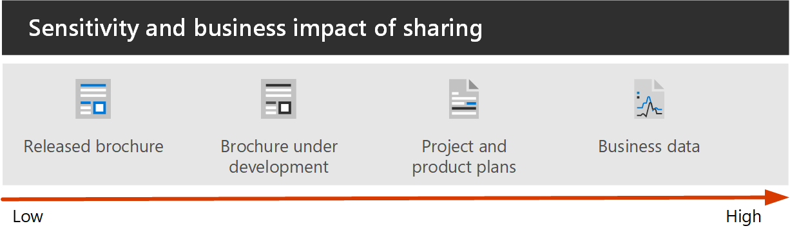
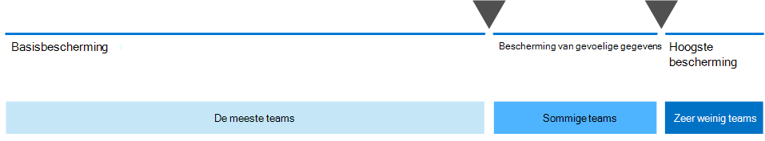

# Veilige samenwerking met Microsoft 365 instellen

Het eenvoudig kunnen delen van informatie met de juiste mensen en het voorkomen van oversharing is de sleutel tot het succes van een organisatie. Dit houdt onder meer in dat u gevoelige gegevens veilig delen met alleen degenen die er toegang toe zouden moeten hebben. Afhankelijk van het project kan dit het delen van gevoelige gegevens met mensen buiten uw organisatie omvatten.

Deze oplossingsrichtlijn bevat twee componenten om u te helpen:
- Microsoft Teams implementeren met het juiste beschermingsniveau voor elk project
- Extern delen configureren met de juiste beveiligingsinstellingen voor elk project

Als er geen veelzijdige en gebruiksvriendelijke samenwerkingstools beschikbaar zijn, werken gebruikers vaak samen door documenten te e-mailen. Dit is een vervelende en foutgevoelige methode van samenwerking, en kan het risico van ongepaste uitwisseling van informatie te verhogen. Als mensen het delen van informatie te moeilijk vinden, kunnen ze terugkeren naar het gebruik van consumentenproducten die niet door IT worden beheerst. Dit kan een nog groter risico opleveren.

Met Microsoft 365 u Teams implementeren met verschillende configuraties die helpen:

- Bescherm uw intellectuele eigendom
- Eenvoudige samenwerking mogelijk maken
- Creëer een balans tussen beveiliging en bruikbaarheid die de tevredenheid van gebruikers verhoogt en het risico op schaduw-IT vermindert

De meeste organisaties hebben een verscheidenheid aan informatie, met verschillende mate van gevoeligheid en verschillende mate van zakelijke impact als de informatie ten onrechte wordt gedeeld. Afhankelijk van de gevoeligheid van een bepaald stukje informatie, u delen toestaan met:

- Iedereen (niet-geverifieerd)
- Mensen binnen de organisatie
- Specifieke mensen binnen de organisatie
- Specifieke mensen binnen en buiten de organisatie

Informatie zoals marketingbrochures zijn bedoeld om breed buiten de organisatie te delen. Informatie zoals cafetariamenu's zijn niet bedoeld voor extern delen, maar zou geen zakelijke impact hebben als ze extern worden gedeeld. Dit soort informatie behoeft weinig of geen bescherming.

Diezelfde marketingbrochures, terwijl ze in ontwikkeling zijn, kunnen alleen binnen de organisatie worden gedeeld. In dit geval zijn de standaardinstellingen voor delen in Teams mogelijk voldoende.

Informatie over een nieuw product dat in ontwikkeling is, kan als gevoelig worden beschouwd, zelfs binnen de organisatie. Een grotere mate van bescherming zou in dit geval passend kunnen zijn. U de toegang tot deze informatie beperken tot leden van een specifiek team, bijvoorbeeld. Afhankelijk van het project moet u mogelijk samenwerken met mensen buiten uw organisatie, zoals een leverancier of partnerorganisatie.

Informatie die essentieel is voor het succes van uw organisatie of met strenge beveiligings- of nalevingsvereisten, kan nog meer bescherming vereisen.

Voor alle hierboven beschreven scenario's u teams in Microsoft Teams gebruiken om de informatie op te slaan, te delen en samen te werken. 

Als u veilige collabratie wilt configureren, gebruikt u deze Microsoft 365-mogelijkheden en -functies.

| Product of onderdeel | Functie | Licenties |
|:-------|:-----|:-------|
| Office 365 Advanced Threat Protection | ATP-veilige bijlagen voor SPO, OneDrive en Teams; ATP-veilige documenten; ATP Safe Links voor Teams    | Microsoft 365 E1, E3 en E5 |
| SharePoint    | Beleid voor het delen van site en bestanden, machtigingen voor het delen van site's, koppelingen delen, Toegangsverzoeken, instellingen voor het delen van sitegasten | Microsoft 365 E1, E3 en E5 |
| Microsoft Teams   | Toegang voor gasten, privéteams, privékanalen | Microsoft 365 E1, E3 en E5 |
| Microsoft 365-compliance  | Vertrouwelijkheidslabels    | Microsoft 365 E3 en E5 |

### Teams gebruiken voor allerlei gegevens

Om de toegang tot informatie met verschillende gevoeligheden te beheren, hebben we [drie verschillende beschermingsniveaus voor Teams](configure-teams-three-tiers-protection.md)ontwikkeld. U een van deze lagen aanpassen om beter aan te passen aan de behoeften of uw bedrijf. 

Deze lagen - *basislijn*, *gevoelig*en *zeer gevoelig* - verhogen geleidelijk de beveiligingen die helpen voorkomen dat oversharing en potentiële informatielekken, zoals weergegeven in de volgende tabel.

||**Basislijnlaag**|**Gevoelige laag**|**Zeer gevoelige laag**|
|:--|:-----------|:------------|:-------------------|
|Publiek of privaat team|Ofwel|Privé|Privé|
|Niet-geverifieerd delen|Geblokkeerd|Geblokkeerd|Geblokkeerd|
|Delen van bestanden|Toegestaan|Toegestaan|Alleen teameigenaren kunnen delen.|
|Teamlidmaatschap|Iedereen kan lid worden van openbare teams. Goedkeuring van de teameigenaar vereist om lid te worden van privéteams.|Goedkeuring van de teameigenaar vereist om lid te worden.|Goedkeuring van de teameigenaar vereist om lid te worden.|
|Documentversleuteling|||Verkrijgbaar met gevoeligheidslabel|
|Gasten delen|Toegestaan|Kan worden toegestaan of geblokkeerd|Kan worden toegestaan of geblokkeerd|
|Onbeheerde apparaten|Geen beperking|Alleen via internet|Geblokkeerd|

Het configureren van deze lagen omvat:

- Instellingen configureren in Teams voor toegang tot gasten en privékanalen
- Instellingen configureren in de bijbehorende SharePoint-site van een team voor het delen van interne en gasten, toegangsverzoeken en het delen van koppelingen
- Voor de *gevoelige* en *zeer gevoelige* lagen, het configureren van gevoeligheidslabels om de teams te classificeren en het delen en openen van gasten vanaf onbeheerde apparaten te beheren
- Voor de *zeer gevoelige* laag u een gevoeligheidslabel configureren om de documenten waarop het wordt toegepast te versleutelen

Begin met de basislijnlaag en voeg vervolgens teams toe die de *gevoelige* en *zeer gevoelige* lagen gebruiken als dat nodig is om de informatie in uw organisatie te beschermen. Bekijk de volgende bronnen om aan de slag te gaan:

- [Teams met basisbescherming configureren](configure-teams-baseline-protection.md)
- [Teams met bescherming voor vertrouwelijke gegevens configureren](configure-teams-sensitive-protection.md)
- [Teams met bescherming voor zeer vertrouwelijke gegevens configureren](configure-teams-highly-sensitive-protection.md)

Als u een zeer gevoelig project hebt dat extra bescherming vereist tegen delen, zelfs binnen uw organisatie, u een team configureren dat zijn eigen gevoeligheidslabel gebruikt om bestanden te versleutelen, zodat alleen teamleden deze kunnen lezen. Zie [Een team configureren met een beveiligingsisolatie](secure-teams-security-isolation.md) voor meer informatie.

### Delen met mensen buiten uw organisatie

Mogelijk moet u [informatie over eventuele gevoeligheid delen met mensen buiten uw organisatie.](collaborate-with-people-outside-your-organization.md) Dit kan variëren van het delen van één document met één persoon tot samenwerken aan een groot project met een grote partnerorganisatie of freelancers van over de hele wereld. In Microsoft 365 kan dit bereik van extern delen eenvoudig en met de juiste waarborgen worden uitgevoerd om uw gevoelige informatie te beschermen.

Met deze resources u aan de slag met het opzetten van uw omgeving voor samenwerking met mensen buiten uw organisatie:

- [Samenwerken aan documenten](collaborate-on-documents.md) voor het delen van afzonderlijke bestanden van mappen.
- [Werk samen in een site](collaborate-in-site.md) om samen te werken met gasten op een SharePoint-site.
- [Werk samen als een team](collaborate-as-team.md) om samen te werken met gasten in een team.

Afhankelijk van de gevoeligheid van de informatie die wordt gedeeld, u beveiligingen toevoegen om oversharing te voorkomen. Met deze resources u de beveiligingen instellen die u nodig hebt voor uw organisatie:

- [Aanbevolen procedures voor het delen van bestanden en mappen met niet-geverifieerde gebruikers](best-practices-anonymous-sharing.md)
- [Het beperken van de onopzettelijke blootstelling van bestanden bij het delen met personen buiten uw organisatie](share-limit-accidental-exposure.md)
- [Een beveiligde omgeving voor het delen met gasten maken](create-secure-guest-sharing-environment.md)

Als u een groot project hebt met een partnerorganisatie, u Azure Entitlement Management gebruiken om de gasten van die organisatie te beheren in een team dat u voor het project hebt ingesteld. Zie [Maak een B2B-extranet met beheerde gasten](b2b-extranet.md) voor meer informatie.

## De oplossing voor veilige samenwerking implementeren

Wanneer u klaar bent om deze oplossing te implementeren, gaat u verder met de volgende stappen:
1. Configureer de [drie verschillende beschermingsniveaus voor Teams](configure-teams-three-tiers-protection.md).
2. Configureer instellingen voor [het delen van informatie over een eventuele gevoeligheid met mensen buiten uw organisatie](collaborate-with-people-outside-your-organization.md).

## Zie ook

[Documentatie over Microsoft 365-beveiliging](https://docs.microsoft.com/microsoft-365/security)

[Microsoft 365-compliancedocumentatie](https://docs.microsoft.com/microsoft-365/compliance)

[Welkom bij Microsoft Teams](https://docs.microsoft.com/MicrosoftTeams/Teams-overview)
