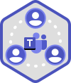

# Veilige samenwerking instellen met Microsoft 365Set up secure collaboration with Microsoft 365

Het is belangrijk om eenvoudig informatie te kunnen delen met de juiste personen en overbeharing te voorkomen.Being able to easily share information with the right people while preventing oversharing is key to an organization's success. Dit geldt ook voor het veilig delen van gevoelige gegevens met alleen personen die toegang tot deze gegevens moeten hebben.This includes being able to share sensitive data safely with only those who should have access to it. Afhankelijk van het project kan dit het delen van gevoelige gegevens omvatten met personen buiten uw organisatie.Depending on the project, this might include sharing sensitive data with people outside your organization.

> [!VIDEO https://www.microsoft.com/videoplayer/embed/RWxMmL?autoplay=false]

Deze richtlijnen voor samenwerkingsoplossing bevatten twee onderdelen om u te helpen:This collaboration solution guidance includes two components to help you:
- Microsoft Teams implementeren met het juiste beveiligingsniveau voor elk projectDeploy Microsoft Teams with the right level of protection for each project
- Extern delen configureren met de juiste beveiligingsinstellingen voor elk projectConfigure external sharing with appropriate security settings for each project

Als veelzijdige en eenvoudig te gebruiken hulpprogramma's voor samenwerking van inhoud niet beschikbaar zijn, werken gebruikers vaak samen door documenten te e-mailen.If versatile and easy-to-use content collaboration tools aren't available, users will often collaborate by emailing documents. Dit is een vervelende en foutgevoelige methode voor samenwerking en kan het risico op ongepast delen van informatie vergroten.This is a tedious and error-prone method of collaboration, and can increase the risk of inappropriate sharing of information. Als mensen het delen van informatie te moeilijk vinden, kunnen ze terugkeren naar het gebruik van consumentenproducten die niet onder IT vallen.If people find sharing information too difficult, they could revert to using consumer products that are not governed by IT. Dit kan een nog groter risico opleveren.This can pose an even greater risk.

Met Microsoft 365 kunt u Teams implementeren met diverse configuraties die u helpen:With Microsoft 365, you can deploy Teams with a variety of configurations that help:

- Uw intellectuele eigendom beschermenProtect your intellectual property
- Eenvoudige samenwerking inschakelenEnable easy collaboration
- Een evenwicht creëren tussen beveiliging en bruikbaarheid, waardoor de tevredenheid van gebruikers toeneemt en het risico op schaduw-IT wordt verkleindCreate a balance between security and usability that increases user satisfaction and reduces the risk of shadow IT

De meeste organisaties hebben een verscheidenheid aan informatie, met verschillende mate van gevoeligheid en verschillende mate van bedrijfsimpact als de informatie ongepast wordt gedeeld.Most organizations have a variety of information, with varying degrees of sensitivity and varying degrees of business impact if the information is inappropriately shared. Afhankelijk van de gevoeligheid van een bepaald stukje informatie, kunt u delen toestaan met:Depending on the sensitivity of a given piece of information, you may want to allow sharing with:

- Iedereen (niet-genauteerd)Anyone (unauthenticated)
- Personen binnen de organisatiePeople inside the organization
- Specifieke personen binnen de organisatieSpecific people inside the organization
- Specifieke personen binnen en buiten de organisatieSpecific people inside and outside the organization

Informatie zoals marketingbrochures zijn bedoeld voor delen in grote lijnen buiten de organisatie.Information such as marketing brochures are meant for sharing broadly outside the organization. Informatie zoals menu's voor cafetaria's zijn niet bedoeld voor extern delen, maar hebben geen zakelijke invloed als ze extern worden gedeeld.Information such as cafeteria menus aren't meant for external sharing, but would have no business impact if they were shared externally. Deze soorten informatie hebben weinig of geen beveiliging nodig.These types of information need little or no protection.

Dezelfde marketingbrochures, die nog in ontwikkeling zijn, worden mogelijk alleen gedeeld binnen de organisatie.Those same marketing brochures, while under development, might only be shared inside the organization. In dit geval zijn de standaardinstellingen voor delen in Teams mogelijk voldoende.In this case, the default sharing settings in Teams may be sufficient.

Informatie over een nieuw product dat in ontwikkeling is, kan als gevoelig worden beschouwd, zelfs binnen de organisatie.Information about a new product that is under development might be considered sensitive, even within the organization. In dit geval is een grotere mate van beveiliging mogelijk geschikt.A greater degree of protection might be appropriate in this case. U kunt bijvoorbeeld de toegang tot deze gegevens beperken tot leden van een specifiek team.You could restrict access to this information to members of a specific team, for example. Afhankelijk van het project moet u mogelijk samenwerken met personen buiten uw organisatie, zoals een leverancier of partnerorganisatie.Depending on the project, you may need to collaborate with people outside your organization, such as a vendor or partner organization.

Informatie die essentieel is voor het succes van uw organisatie of die strenge beveiligings- of compliancevereisten heeft, vereist mogelijk nog meer beveiligingsniveaus.Information that is critical to your organization's success, or has stringent security or compliance requirements might require even greater levels of protection.

Voor alle bovenstaande scenario's kunt u teams in Microsoft Teams gebruiken om de gegevens op te slaan, te delen en samen te werken.For all the scenarios noted above, you can use teams in Microsoft Teams to store, share, and collaborate on the information. 

Als u veilige samenwerking wilt configureren, gebruikt u deze Microsoft 365-mogelijkheden en -functies.To configure secure collaboration, you use these Microsoft 365 capabilities and features.

| Product of onderdeelProduct or component | FunctieCapability or feature | LicentieverleningLicensing |
|:-------|:-----|:-------|
| Microsoft Defender voor Office 365Microsoft Defender for Office 365 | Veilige bijlagen voor SPO, OneDrive en Teams; Veilige documenten; Veilige koppelingen voor TeamsSafe Attachments for SPO, OneDrive and Teams; Safe Documents; Safe Links for Teams    | Microsoft 365 E1, E3 en E5Microsoft 365 E1, E3 and E5 |
| SharePointSharePoint    | Beleid voor het delen van site en bestanden, machtigingen voor het delen van site, Koppelingen delen, Access-aanvragen, instellingen voor het delen van sitegastenSite and file sharing policies, Site sharing permissions, Sharing links, Access requests, Site guest sharing settings | Microsoft 365 E1, E3 en E5Microsoft 365 E1, E3 and E5 |
| Microsoft TeamsMicrosoft Teams   | Gasttoegang, privéteams, privékanalenGuest access, private teams, private channels | Microsoft 365 E1, E3 en E5Microsoft 365 E1, E3 and E5 |
| Microsoft 365-complianceMicrosoft 365 Compliance  | VertrouwelijkheidslabelsSensitivity labels    | Microsoft 365 E3 en E5Microsoft 365 E3 and E5 |

### SamenwerkingsbeheerCollaboration governance

Microsoft 365 biedt veel opties voor het besturen van uw samenwerkingsoplossing.Microsoft 365 provides many options for governing your collaboration solution. We raden u aan deze implementatie-inhoud naast de inhoud van samenwerkingsbeheer te [gebruiken](collaboration-governance-overview.md) om de beste samenwerkingsoplossing voor uw organisatie te maken.We recommend you use this deployment content alongside the [collaboration governance content](collaboration-governance-overview.md) to create the best collaboration solution for your organization.

### Teams gebruiken voor allerlei gegevensUsing Teams for all kinds of data

Om toegang tot informatie met verschillende gevoeligheden te beheren, hebben we drie verschillende beveiligingslagen voor [Teams ontwikkeld.](configure-teams-three-tiers-protection.md)To manage access to information with different sensitivities, we've developed [three different tiers of protection for Teams](configure-teams-three-tiers-protection.md). U kunt een van deze lagen aanpassen om beter aan de behoeften of uw bedrijf te voldoen.You can customize any of these tiers to better address the needs or your business. 

Deze lagen - *basislijn* *,* gevoelig en zeer gevoelig *-* verhogen geleidelijk de beveiligingen die oversharing en mogelijke informatielekken helpen voorkomen, zoals wordt weergegeven in de volgende tabel.These tiers - *baseline*, *sensitive*, and *highly sensitive* - gradually increase the protections that help prevent oversharing and potential information leakage, as shown in the following table.

|-|**Basislijnlaag****Baseline tier**|**Gevoelige laag****Sensitive tier**|**Hooggevoelige laag****Highly sensitive tier**|
|:--|:-----------|:------------|:-------------------|
|Openbaar of privéteamPublic or private team|Een van beideEither|PrivéPrivate|PrivéPrivate|
|Niet-geverifieerd delenUnauthenticated sharing|GeblokkeerdBlocked|GeblokkeerdBlocked|GeblokkeerdBlocked|
|BestandsdelingFile sharing|ToegestaanAllowed|ToegestaanAllowed|Alleen teameigenaren kunnen delen.Only team owners can share.|
|TeamlidmaatschapTeam membership|Iedereen kan deelnemen aan openbare teams.Anyone can join public teams. Goedkeuring van teameigenaar vereist om deel te nemen aan privéteams.Team owner approval required to join private teams.|Goedkeuring van teameigenaar vereist om deel te nemen.Team owner approval required to join.|Goedkeuring van teameigenaar vereist om deel te nemen.Team owner approval required to join.|
|DocumentversleutelingDocument encryption|||Beschikbaar met gevoeligheidslabelAvailable with sensitivity label|
|Gasten delenGuest sharing|ToegestaanAllowed|Kan worden toegestaan of geblokkeerdCan be allowed or blocked|Kan worden toegestaan of geblokkeerdCan be allowed or blocked|
|Niet-bemande apparatenUnmanaged devices|Geen beperkingNo restriction|Web-only accessWeb-only access|GeblokkeerdBlocked|

Als u deze lagen configureert, moet u het volgende doen:Configuring these tiers involves:

- Instellingen configureren in Teams voor gasttoegang en privékanalenConfiguring settings in Teams for guest access and private channels
- Instellingen configureren op de gekoppelde SharePoint-site van een team voor interne en gastdeling, toegangsaanvragen en koppelingen voor delenConfiguring settings in a team's associated SharePoint site for internal and guest sharing, access requests, and sharing links
- Voor de *gevoelige* en *zeer gevoelige* lagen, het configureren van gevoeligheidslabels om de teams te classificeren en gast delen en toegang te beheren vanaf niet-beheerbare apparatenFor the *sensitive* and *highly sensitive* tiers, configuring sensitivity labels to classify the teams, and control guest sharing and access from unmanaged devices
- Voor de *zeer gevoelige* laag configureert u een gevoeligheidslabel om de documenten waarop deze wordt toegepast te versleutelenFor the *highly sensitive* tier, configuring a sensitivity label to encrypt the documents to which it is applied

Begin met de basislijnlaag en voeg  teams  toe die zo nodig de gevoelige en zeer gevoelige lagen gebruiken om de informatie in uw organisatie te beschermen.Start with the baseline tier, and then add teams that use the *sensitive* and *highly sensitive* tiers as needed to help protect the information in your organization. Bekijk deze bronnen om aan de slag te gaan:See these resources to get started:

- [Teams met basisbescherming configurerenConfigure teams with baseline protection](configure-teams-baseline-protection.md)
- [Teams met bescherming voor vertrouwelijke gegevens configurerenConfigure teams with protection for sensitive data](configure-teams-sensitive-protection.md)
- [Teams met bescherming voor zeer vertrouwelijke gegevens configurerenConfigure teams with protection for highly sensitive data](configure-teams-highly-sensitive-protection.md)

Als u een zeer gevoelig project hebt dat extra beveiliging vereist voor delen, zelfs binnen uw organisatie, kunt u een team configureren dat een eigen gevoeligheidslabel gebruikt om bestanden te versleutelen, zodat alleen teamleden ze kunnen lezen.If you have a highly sensitive project that requires additional protection from sharing even within your organization, you can configure a team that uses its own sensitivity label to encrypt files so that only team members can read them. Zie [Een team configureren met beveiligingsisolatie](secure-teams-security-isolation.md) voor meer informatie.See [Configure a team with security isolation](secure-teams-security-isolation.md) for details.

### Delen met personen buiten uw organisatieSharing with people outside your organization

Mogelijk moet u [gegevens met een gevoeligheid delen met personen buiten uw organisatie.](collaborate-with-people-outside-your-organization.md)You may need to [share information of any sensitivity with people outside your organization](collaborate-with-people-outside-your-organization.md). Dit kan variëren van het delen van één document met één persoon tot het samenwerken aan een groot project met een grote partnerorganisatie of met freelancers van over de hele wereld.This could range from sharing a single document with a single person to collaborating on a major project with a large partner organization or freelancers from around the world. In Microsoft 365 kan dit bereik van extern delen eenvoudig en met de juiste beveiligingen worden uitgevoerd om uw gevoelige informatie te beschermen.In Microsoft 365, this range of external sharing can be done easily and with the appropriate safeguards to help protect your sensitive information.

Met deze bronnen kunt u aan de slag met het instellen van uw omgeving voor samenwerking met personen buiten uw organisatie:These resources will help you get started with setting up your environment for collaborating with people outside your organization:

- [Samenwerken aan documenten voor](collaborate-on-documents.md) het delen van afzonderlijke bestanden van mappen.[Collaborate on documents](collaborate-on-documents.md) for sharing individual files of folders.
- [Samenwerken aan een site](collaborate-in-site.md) om samen te werken met gasten op een SharePoint-site.[Collaborate in a site](collaborate-in-site.md) for collaborating with guests in a SharePoint site.
- [Samenwerken als een team om](collaborate-as-team.md) samen te werken met gasten in een team.[Collaborate as a team](collaborate-as-team.md) for collaborating with guests in a team.

Afhankelijk van de gevoeligheid van de gegevens die worden gedeeld, kunt u beveiligingen toevoegen om oversharing te voorkomen.Depending on the sensitivity of the information being shared, you can add safeguards to help prevent oversharing. Met deze bronnen kunt u de beveiliging instellen die u nodig hebt voor uw organisatie:These resources will help you set up the protections that you need for your organization:

- [Aanbevolen procedures voor het delen van bestanden en mappen met niet-geverifieerde gebruikersBest practices for sharing files and folders with unauthenticated users](best-practices-anonymous-sharing.md)
- [Het beperken van de onopzettelijke blootstelling van bestanden bij het delen met personen buiten uw organisatieLimit accidental exposure to files when sharing with people outside your organization](share-limit-accidental-exposure.md)
- [Een beveiligde omgeving voor het delen met gasten makenCreate a secure guest sharing environment](create-secure-guest-sharing-environment.md)

Als u een belangrijk project hebt met een partnerorganisatie, kunt u Azure Entitlement Management gebruiken om de gasten van die organisatie te beheren in een team dat u voor het project hebt ingesteld.If you have a major project with a partner organization, you can use Azure Entitlement Management to manage the guests from that organization in a team that you set up for the project. Zie [Een B2B-extranet maken met beheerde gasten voor](b2b-extranet.md) meer informatie.See [Create a B2B extranet with managed guests](b2b-extranet.md) for details.

## Training voor beheerdersTraining for administrators

Deze trainingsmodules van Microsoft Learn kunnen u helpen bij het leren van de functies voor samenwerking, beheer en identiteit in Teams en SharePoint.These training modules from Microsoft Learn can help you learn the collaboration, governance, and identity features in Teams and SharePoint.

#### TeamsTeams

|Training:Training:|Teamsamenwerking met Microsoft Teams beherenManage team collaboration with Microsoft Teams|
|:---|:---|
||Als u teamsamenwerking met Microsoft Teams beheert, maakt u kennis met de functies en mogelijkheden van Microsoft Teams, de centrale hub voor teamsamenwerking in Microsoft 365.Manage team collaboration with Microsoft Teams introduces you to the features and capabilities of Microsoft Teams, the central hub for team collaboration in Microsoft 365. U leert hoe u Teams kunt gebruiken om teamwerk en communicatie binnen uw organisatie te vergemakkelijken, zowel on- als off-premises, op een breed scala aan apparaten, van desktops tot tablets tot telefoons, terwijl u gebruik kunt maken van alle uitgebreide functionaliteit van Office 365-toepassingen.You’ll learn how you can use Teams to facilitate teamwork and communication within your organization, both on and off premises, on a wide range of devices—from desktops to tablets to phones—while taking advantage of all the rich functionality of Office 365 applications. U krijgt inzicht in de manier waarop Teams een uitgebreide en flexibele omgeving biedt voor samenwerking tussen toepassingen en apparaten.You’ll gain an understanding of how Teams provides a comprehensive and flexible environment for collaboration across applications and devices. Met dit leerpad kunt u zich voorbereiden op de certificering microsoft 365 Gecertificeerd: Teams Administrator Associate.This learning path can help you prepare for the Microsoft 365 Certified: Teams Administrator Associate certification.  2 uur 17 min - Leerpad - 5 modules2 hr 17 min - Learning Path - 5 Modules|

> [!div class="nextstepaction"]
> [Start >Start >](/learn/modules/m365-teams-collab-prepare-deployment/introduction/)

#### SharePointSharePoint

|Training:Training:|Samenwerken met SharePoint in Microsoft 365Collaborate with SharePoint in Microsoft 365|
|:---|:---|
||Gedeelde inhoud beheren met Microsoft SharePoint laat u kennismaken met de functies en mogelijkheden van SharePoint en hoe deze werkt met Microsoft 365.Manage shared content with Microsoft SharePoint introduces you to the features and capabilities of SharePoint, and how it works with Microsoft 365. U leert over de verschillende typen SharePoint-sites, waaronder hubsites, evenals informatiebeveiliging, rapportage en monitoring.You'll learn about the different types of SharePoint sites, including hub sites, as well as information protection, reporting, and monitoring. U leert ook hoe u SharePoint-bestanden en -mappen kunt gebruiken om de samenwerking te optimaliseren, hoe u bestanden extern deelt en hoe u SharePoint-sites beheert in het SharePoint-beheercentrum.You'll also learn how to use SharePoint file and folder sharing to optimize collaboration, how to share files externally, and how to manage SharePoint sites in the SharePoint admin center. Dit leerpad kan u helpen om u voor te bereiden op de microsoft 365 Certified: Teamwork Administrator Associate-certificering.This learning path can help you prepare for the Microsoft 365 Certified: Teamwork Administrator Associate certification.  1 uur 14 min - Leerpad - 4 modules1 hr 14 min - Learning Path - 4 Modules|

> [!div class="nextstepaction"]
> [Start >Start >](/learn/modules/m365-teams-sharepoint-plan-sharepoint/introduction/)

#### GegevensbeschermingInformation protection

|Training:Training:|Bedrijfsgegevens beveiligen met Microsoft 365Protect enterprise information with Microsoft 365|
|:---|:---|
||Het beveiligen en beveiligen van de gegevens van uw organisatie is lastiger dan ooit.Protecting and securing your organization's information is more challenging than ever. In het leerpad Ondernemingsgegevens beveiligen met Microsoft 365 wordt besproken hoe u uw gevoelige informatie kunt beschermen tegen onbedoelde overbelasting of misbruik, hoe u gegevens kunt ontdekken en classificeren, hoe u deze kunt beschermen met gevoeligheidslabels en hoe u uw gevoelige gegevens kunt bewaken en analyseren om te beschermen tegen verlies.The Protect enterprise information with Microsoft 365 learning path discusses how to protect your sensitive information from accidental oversharing or misuse, how to discover and classify data, how to protect it with sensitivity labels, and how to both monitor and analyze your sensitive information to protect against its loss. Met dit leerpad kunt u zich voorbereiden op de certificeringen Microsoft 365 Certified: Security Administrator Associate en Microsoft 365 Certified: Enterprise Administration Expert..This learning path can help you prepare for the Microsoft 365 Certified: Security Administrator Associate and Microsoft 365 Certified: Enterprise Administration Expert certifications..  1 uur - Leerpad - 5 modules1 hr - Learning Path - 5 Modules|

> [!div class="nextstepaction"]
> [Start >Start >](/learn/modules/m365-security-info-overview/introduction/)

#### Identiteit en toegangIdentity and access

|Training:Training:|Identiteit en toegang beveiligen met Azure Active DirectoryProtect identity and access with Azure Active Directory|
|:---|:---|
||Het leerpad Identiteit en Access omvat de nieuwste identiteits- en toegangstechnologieën, hulpmiddelen voor het versterken van verificatie en richtlijnen voor identiteitsbeveiliging binnen uw organisatie.The Identity and Access learning path covers the latest identity and access technologies, tools for strengthening authentication, and guidance on identity protection within your organization. Met microsoft-toegangs- en identiteitstechnologieën kunt u de identiteit van uw organisatie beveiligen, ongeacht of deze on-premises of in de cloud is, en uw gebruikers in staat stellen veilig te werken vanaf elke locatie.Microsoft access and identity technologies enable you to secure your organization’s identity, whether it is on-premises or in the cloud, and empower your users to work securely from any location. Met dit leerpad kunt u zich voorbereiden op de certificeringen Microsoft 365 Certified: Security Administrator Associate en Microsoft 365 Certified: Enterprise Administration Expert.This learning path can help you prepare for the Microsoft 365 Certified: Security Administrator Associate and Microsoft 365 Certified: Enterprise Administration Expert certifications.  2 uur 52 min - Leerpad - 6 modules2 hr 52 min - Learning Path - 6 Modules|

> [!div class="nextstepaction"]
> [Start >Start >](/learn/modules/m365-identity-overview/introduction/)

## Training voor eindgebruikersTraining for end users

Met deze trainingsmodules kunnen uw gebruikers Teams, groepen en SharePoint gebruiken voor samenwerking in Microsoft 365.These training modules can help your users use Teams, groups, and SharePoint for collaboration in Microsoft 365.

|TeamsTeams|SharePointSharePoint|
|:---|:---|
| **[Uw team instellen en aanpassen](https://support.microsoft.com/office/702a2977-e662-4038-bef5-bdf8ee47b17b)****[Set up and customize your team](https://support.microsoft.com/office/702a2977-e662-4038-bef5-bdf8ee47b17b)**| **[Delen en synchroniseren](https://support.microsoft.com/office/98cb2ff2-c27e-42ea-b055-c2d895f8a5de)****[Share and sync](https://support.microsoft.com/office/98cb2ff2-c27e-42ea-b055-c2d895f8a5de)**|
| **[Bestanden uploaden en zoeken](https://support.microsoft.com/office/57b669db-678e-424e-b0a0-15d19215cb12)****[Upload and find files](https://support.microsoft.com/office/57b669db-678e-424e-b0a0-15d19215cb12)**||
| **[Samenwerken in teams en kanalen](https://support.microsoft.com/office/c3d63c10-77d5-4204-a566-53ddcf723b46)****[Collaborate in teams and channels](https://support.microsoft.com/office/c3d63c10-77d5-4204-a566-53ddcf723b46)**|||

## IllustratiesIllustrations

Met deze illustraties krijgt u inzicht in de interactie tussen groepen en teams met andere services in Microsoft 365 en welke beheer- en compliancefuncties beschikbaar zijn om u te helpen bij het beheren van deze services in uw organisatie.These illustrations will help you understand how groups and teams interact with other services in Microsoft 365 and what governance and compliance features are available to help you manage these services in your organization.

### Groepen in Microsoft 365 voor IT-architectenGroups in Microsoft 365 for IT Architects
Wat IT-architecten moeten weten over Microsoft 365-groepenWhat IT architects need to know about groups in Microsoft 365

|**Item****Item**|**Beschrijving****Description**|
|:-----|:-----|
|   [PDF](https://github.com/MicrosoftDocs/microsoft-365-docs/raw/public/microsoft-365/downloads/msft-m365-groups.pdf) \| [Visio](https://github.com/MicrosoftDocs/OfficeDocs-Enterprise/raw/live/Enterprise/downloads/msft-m365-groups.vsdx)[PDF](https://github.com/MicrosoftDocs/microsoft-365-docs/raw/public/microsoft-365/downloads/msft-m365-groups.pdf) \| [Visio](https://github.com/MicrosoftDocs/OfficeDocs-Enterprise/raw/live/Enterprise/downloads/msft-m365-groups.vsdx)   Laatst bijgewerkt: juni 2019Updated June 2019|Deze illustraties tonen verschillende soorten groepen, hoe ze worden gemaakt en beheerd, en enkele aanbevelingen voor beheer.These illustrations detail the different types of groups, how these are created and managed, and a few governance recommendations.|

### Microsoft Teams en gerelateerde productiviteitsservices in Microsoft 365 voor IT-architectenMicrosoft Teams and related productivity services in Microsoft 365 for IT architects
De logische architectuur van productiviteitsservices in Microsoft 365, geleid door Microsoft Teams.The logical architecture of productivity services in Microsoft 365, leading with Microsoft Teams.

|**Item****Item**|**Beschrijving****Description**|
|:-----|:-----|
|   [PDF](https://github.com/MicrosoftDocs/microsoft-365-docs/raw/public/microsoft-365/downloads/msft-m365-teams-logical-architecture.pdf) \| [Visio](https://github.com/MicrosoftDocs/OfficeDocs-Enterprise/raw/live/Enterprise/downloads/msft-m365-teams-logical-architecture.vsdx)[PDF](https://github.com/MicrosoftDocs/microsoft-365-docs/raw/public/microsoft-365/downloads/msft-m365-teams-logical-architecture.pdf) \| [Visio](https://github.com/MicrosoftDocs/OfficeDocs-Enterprise/raw/live/Enterprise/downloads/msft-m365-teams-logical-architecture.vsdx)   Laatst bijgewerkt: april 2019Updated April 2019   |Microsoft biedt een pakket met productiviteitsservices die samenwerken met behulp van functies voor gegevensbeheer, beveiliging en compliance.Microsoft provides a suite of productivity services that work together to provide collaboration experiences with data governance, security, and compliance capabilities.    Deze reeks illustraties biedt een overzicht van de logische architectuur van productiviteitsservices voor ondernemingsarchitecten, geleid door Microsoft Teams.This series of illustrations provides a view into the logical architecture of productivity services for enterprise architects, leading with Microsoft Teams.|

## De veilige samenwerkingsoplossing implementerenDeploy the secure collaboration solution

Wanneer u klaar bent om deze oplossing te implementeren, gaat u verder met de volgende stappen:When you're ready to deploy this solution, continue with these steps:
1. Configureer [de drie verschillende beveiligingslagen voor Teams.](configure-teams-three-tiers-protection.md)Configure the [three different tiers of protection for Teams](configure-teams-three-tiers-protection.md).
2. Configureer instellingen voor [het delen van informatie die gevoelig is voor personen buiten uw organisatie.](collaborate-with-people-outside-your-organization.md)Configure settings for [sharing information of any sensitivity with people outside your organization](collaborate-with-people-outside-your-organization.md).

## Zie ookSee also

[Documentatie over Microsoft 365-beveiligingMicrosoft 365 security documentation](../security/index.yml)

[Microsoft 365-compliancedocumentatieMicrosoft 365 compliance documentation](../compliance/index.yml)

[Welkom bij Microsoft TeamsWelcome to Microsoft Teams](/MicrosoftTeams/Teams-overview)