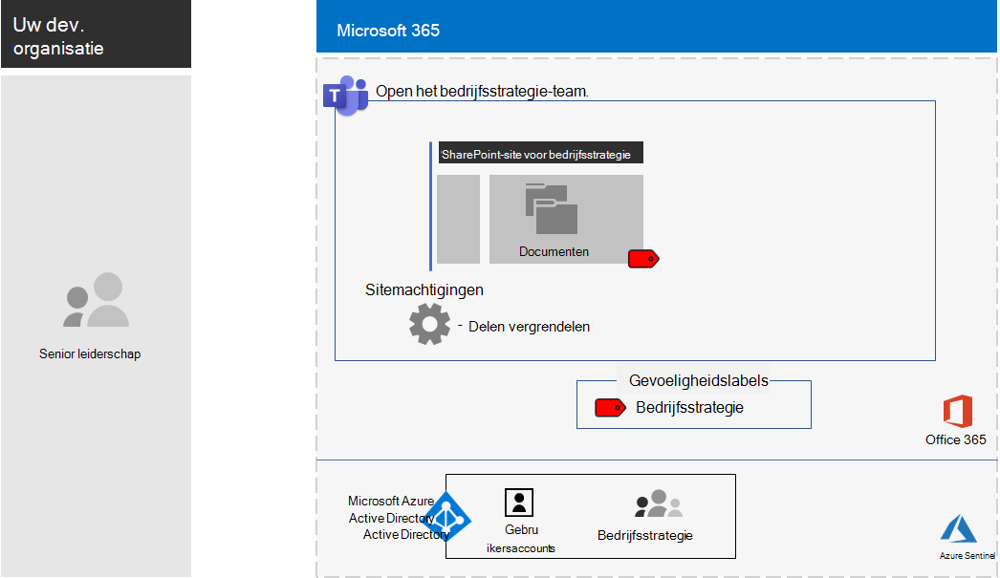

# <a name="configure-a-team-with-security-isolation-in-a-devtest-environment"></a>Een team configureren met beveiligingsisolatie in een ontwikkel-/testomgeving

Dit artikel bevat stapsgewijze instructies voor het maken van een [team met beveiligingsisolatie](secure-teams-security-isolation.md) in een ontwikkel-/testomgeving.



Gebruik deze ontwikkel-/testomgeving om te experimenteren en instellingen af te stemmen op uw specifieke behoeften voordat u dit soort team in productie neemt.

## <a name="phase-1-build-out-your-microsoft-365-enterprise-test-environment"></a>Fase 1: uw Microsoft 365 Enterprise-testomgeving uitbouwen

Als u alleen gevoelige en zeer vertrouwelijke teams op een eenvoudige manier wilt testen met de minimale vereisten, volgt u de instructies in [Lichtgewicht basisconfiguratie](../enterprise/lightweight-base-configuration-microsoft-365-enterprise.md).

Als u gevoelige en zeer vertrouwelijke teams in een gesimuleerde onderneming wilt testen, volgt u de instructies in [Wachtwoord-hash-synchronisatie](../enterprise/password-hash-sync-m365-ent-test-environment.md).

> [!NOTE]
> Voor het testen van een team met beveiligingsisolatie is de testomgeving van een gesimuleerde onderneming niet nodig. Deze omgeving bevat een gesimuleerd intranet dat verbonden is met internet en adreslijstsynchronisatie van een AD DS-forest (Active Directory Domain Services). Dit wordt hier als optie gegeven, zodat u een team met beveiligingsisolatie kunt testen en ermee kunt experimenteren in een omgeving die een standaardorganisatie voorstelt.

## <a name="phase-2-create-and-configure-your-azure-active-directory-azure-ad-group-and-users"></a>Fase 2: uw Microsoft Azure AD-groep (Active Directory) en -gebruikers maken en configureren

In deze fase maakt en configureert u de Microsoft Azure AD-groep en -gebruikers voor uw fictieve organisatie.

Maak eerst een beveiligingsgroep met de Azure Portal.

1. Open een afzonderlijk tabblad in uw browser en ga naar de Microsoft Azure Portal op [https://portal.azure.com](https://portal.azure.com). Indien nodig meldt u zich aan met de inloggegevens van het algemene beheerdersaccount van uw proefabonnement of uw betaald abonnement op Microsoft 365 E5.

2. Klik in de Microsoft Azure-portal op **Microsoft Azure Active Directory > Groepen**.

3. Klik in de blade **Groepen: Alle groepen** op **+ Nieuwe groep**.

4. In de blade **Groep**:

  - Selecteer **Beveiliging** bij **Groepstype**.

  - Typ **C-Suite** bij **Naam**.

  - Selecteer **Toegewezen** bij **Lidmaatschapstype**.

5. Klik op **Maken** en sluit vervolgens de blade **Groep**.

Configureer vervolgens automatische licentieverlening, zodat leden van de nieuwe **C-Suite** automatisch een Microsoft 365 E5-licentie krijgen toegewezen.

1. Klik in de Microsoft Azure-portal op **licenties voor Azure Active Directory > alle producten**.

2. Selecteer in de lijst **Microsoft 365 Enterprise E5** en klik vervolgens op **Toewijzen**.

3. Klik in de blade **Licentie toewijzen** op **Gebruikers en groepen**.

4. Selecteer in de lijst met groepen de groep **C-Suite**.

5. Klik op **Selecteren** en klik vervolgens op **Toewijzen**.

6. Sluit het tabblad Microsoft Azure-portal in uw browser.

Maak nu [verbinding met de Windows PowerShell voor Graph-module van Microsoft Azure Active Directory](../enterprise/connect-to-microsoft-365-powershell.md#connect-with-the-azure-active-directory-powershell-for-graph-module).

Vul de naam van uw organisatie, uw locatie en een gemeenschappelijk wachtwoord in en voer vervolgens deze opdrachten uit in de opdrachtprompt van Windows PowerShell of de Integrated Scripting Environment (ISE) om nieuwe gebruikersaccounts te maken en toe te voegen aan de groep C-Suite:

```powershell
$orgName="<organization name, such as contoso-test for the contoso-test.onmicrosoft.com trial subscription domain name>"
$location="<the ISO ALPHA2 country code, such as US for the United States>"
$commonPassword="<common password for all the new accounts>"

$PasswordProfile=New-Object -TypeName Microsoft.Open.AzureAD.Model.PasswordProfile
$PasswordProfile.Password=$commonPassword

$groupName="C-Suite"
$userNames=@("CEO","CFO","CIO")
$groupID=(Get-AzureADGroup | Where { $_.DisplayName -eq $groupName }).ObjectID
ForEach ($element in $userNames){
New-AzureADUser -DisplayName $element -PasswordProfile $PasswordProfile -UserPrincipalName ($element + "@" + $orgName + ".onmicrosoft.com") -AccountEnabled $true -MailNickName $element -UsageLocation $location
Add-AzureADGroupMember -RefObjectId (Get-AzureADUser | Where { $_.DisplayName -eq $element }).ObjectID -ObjectId $groupID
}
```

> [!NOTE]
> Het gebruik van een gemeenschappelijk wachtwoord is hier voor automatisering en configuratiegemak voor een ontwikkelings-/testomgeving. Dit wordt uiteraard sterk afgeraden voor productieabonnementen.

Volg deze stappen om te controleren of de licentieverlening op groepsbasis correct werkt.

1. Meld u aan bij het [Microsoft 365-beheercentrum](https://admin.microsoft.com).

2. Klik in het nieuwe tabblad **Microsoft 365-beheercentrum** van uw browser op **Gebruikers**.

3. Klik in de lijst met gebruikers op **CEO**.

4. In het deelvenster met de eigenschappen van het gebruikersaccount van de **CEO** controleert u dat dit account de licentie **Microsoft 365 Enterprise E5** heeft toegewezen gekregen bij **Productlicenties**.

## <a name="phase-3-create-your-team"></a>Fase 3: uw team maken

In deze fase maakt en configureert u een team met beveiligingsisolatie voor leden van het senior management voor het samenwerken aan de bedrijfsstrategie.

Schakel eerst gevoeligheidslabels in om de inhoud van Microsoft Teams, Office 365-groepen en SharePoint-sites te beveiligen voordat u verder gaat met de stappen in [dit artikel](../compliance/sensitivity-labels-teams-groups-sites.md).

Maak nu het team:

1. Klik links in Teams op **Teams** en klik onderaan de lijst met teams op **Deelnemen aan een team of een team maken**.
2. Klik op **Team maken** (eerste kaart, linkerbovenhoek).
3. Kies **Een volledig nieuw team maken**.
4. Behoudt in de lijst **gevoeligheid** de standaardwaarde.
5. Klik onder **privacy** op **persoonlijk**.
6. Typ **Bedrijfsstrategie** en klik op **Maken** > **Sluiten**.

Beperk vervolgens het creëren van privékanalen tot eigenaren van de Bedrijfsstrategiegroep.

1. In het team klikt u op **Meer opties** en klikt u vervolgens op **Team beheren**.
2. Vouw op het tabblad **Instellingen** de optie **Machtigingen voor leden** uit.
3. Schakel het selectievakje **Leden toestaan privékanalen te maken** uit.

U moet nu een gevoeligheidslabel configureren met de volgende instellingen:

- De naam is Bedrijfsstrategie
- Versleuteling is ingeschakeld.
- De groep Bedrijfsstrategie heeft cocreatie-machtigingen

Volg deze stappen:

1. Open het [Microsoft 365-compliancecentrum](https://compliance.microsoft.com).
2. Klik onder **Oplossingen** op **Informatiebeveiliging**.
3. Klik op **een label maken**.
4. Typ **Bedrijfsstrategie** als labelnaam.
5. Typ **Documenten bedrijfsstrategie voor senior management** als knopinfo en klik vervolgens op **Volgende**.
6. Kies op de pagina **Versleuteling** in de vervolgkeuzelijst **Versleuteling** de optie **Toepassen**.
7. Teammachtigingen toevoegen:<br>
  a. Klik op **Machtigingen toewijzen**.<br>
  b. Klik op **Gebruikers of groepen toevoegen**, selecteer **Bedrijfsstrategie** en klik vervolgens op **Toevoegen**.<br>
  c. Klik op **Machtigingen kiezen**.<br>
  d. Kies **Co-auteurs** in de vervolgkeuzelijst en klik vervolgens op **Opslaan**.<br>
8. Klik op **Volgende**.
9. Klik op de pagina **inhoudsmarkering** op **volgende**.
10. Stel op de pagina **Site- en groepsinstellingen** de **Site- en groepsinstellingen** in op **Aan**.
11. Klik in de vervolgkeuzelijst **Privacy van Office 365 met de groep verbonden teamsites** op **Privé - alleen leden hebben toegang tot de site**.
12. Kies onder **Niet-beheerde apparaten** de optie **Toegang blokkeren**.
13. Klik op **Volgende**.
14. Klik op de pagina **Automatische labeling voor Office-apps** op **Volgende**.
15. Klik op **Verzenden** en klik vervolgens op **Gereed**.

Publiceer nu het nieuwe label aan de hand van de volgende stappen:

1. Kies in het Microsoft 365-compliancecentrum op de pagina **Informatiebeveiliging** het tabblad **Labelbeleid**.
2. Klik op **Labels publiceren**.
3. Klik op de pagina **Kies gevoeligheidslabels om te publiceren** op **Kies gevoeligheidslabels om te publiceren**.
4. Typ **Bedrijfsstrategie** en klik op **Toevoegen**.
5. Klik op **Volgende**.
6. Klik op de pagina **Publiceren voor gebruikers en groepen** op **Gebruikers en groepen kiezen**.
7. Klik op **Toevoegen** en selecteer **Bedrijfsstrategie**.
8. Klik op **Toevoegen** en klik op **Gereed**.
9. Klik op **Volgende**.
10. Schakel op de pagina beleidsinstellingen het selectievakje **Gebruikers moeten redenen geven om een label of lagere classificatielabel te verwijderen** in en klik vervolgens op **Volgende**.
11. Typ **Bedrijfsstrategie** als beleidsnaam en klik op **Volgende**.
12. Klik op **Verzenden** en klik vervolgens op **Gereed**.

Het kan even duren voordat het label **Bedrijfsstrategie** beschikbaar is nadat het is gepubliceerd.

Pas vervolgens het nieuwe label toe op het team **Bedrijfsstrategie** en werk het standaard koppelingstype voor delen bij om het risico te verkleinen dat bestanden en mappen per ongeluk worden gedeeld met een breder publiek dan bedoeld.

1. Open het [SharePoint-beheercentrum](https://admin.microsoft.com/sharepoint).
2. Klik onder **Sites** op **Actieve sites**.
3. Klik op de site **Bedrijfsstrategie**.
4. Klik op het tabblad **Beleid** onder **Gevoeligheid** op **Bewerken**.
5. Selecteer het label **Bedrijfsstrategie** en klik op **Opslaan**.
6. Klik op het tabblad **Beleid** onder **Extern delen** op **Bewerken**.
5. Kies **Alleen personen binnen uw organisatie**.
6. Schakel onder **Standaard koppelingstype voor delen** het selectievakje **Hetzelfde als instelling op organisatieniveau** uit en selecteer **Personen met bestaande toegang**.
7. Klik op **Opslaan**.

Configureer het delen van sites voor alleen-eigenaren voor het team **Bedrijfsstrategie**.

1. Ga in Teams naar het tabblad **Algemeen** van het team **Bedrijfsstrategie**.
2. Klik op de werkbalk van het team op **Bestanden**.
3. Klik op het beletselteken en klik vervolgens op **Openen in SharePoint**.
4. Klik op de werkbalk van de onderliggende SharePoint-site op het pictogram Instellingen en vervolgens op **Sitemachtigingen**.
5. Klik in het deelvenster Site-machtigingen onder **Delen van een site** op **Wijzigen hoe leden kunnen delen**.
6. Kies onder **Machtigingen voor delen** de optie **Alleen site-eigenaren kunnen bestanden, mappen en de site delen** en klik vervolgens op **Opslaan**.
7. Sluit de deelvensters **Machtigingen** en **Instellingen**.

Als u zich aanmeldt als lid van de groep Bedrijfsstrategie ziet u **Bedrijfsstrategie** in de optie **Gevoeligheid** op de werkbalk Start van Word, Excel en PowerPoint. Selecteer het label **Bedrijfsstrategie** bij de optie **Gevoeligheid** om het label aan een bestand toe te wijzen.

Hier is de resulterende configuratie voor het bedrijfsstrategieteam.


## <a name="next-step"></a>Volgende stap

Als u klaar bent voor de productie-implementatie, raadpleegt u deze [configuratie-instructies](secure-teams-security-isolation.md).
