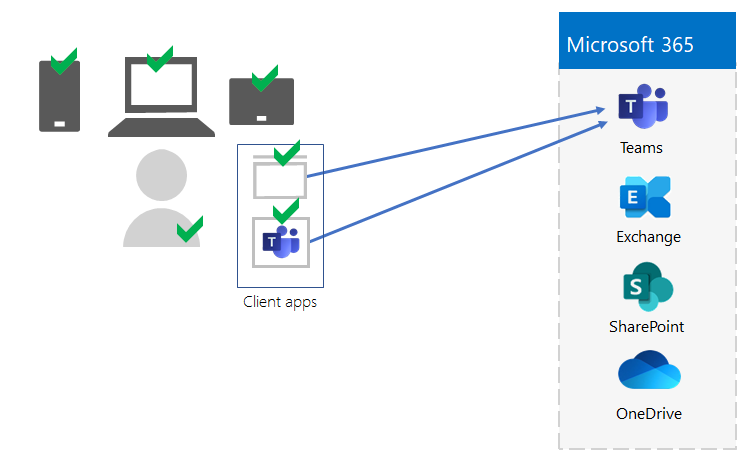
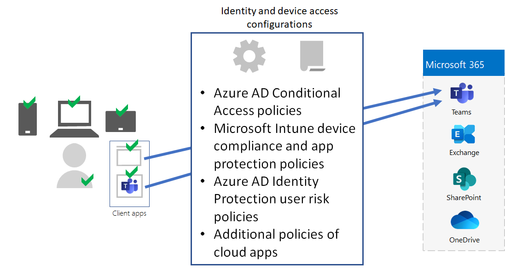

# Stap 5. Apparaat- en app-beheer voor uw Microsoft 365-tenants voor ondernemingen

Microsoft 365 voor ondernemingen bevat functies voor het helpen beheren van apparaten en het gebruik van apps op die apparaten in uw organisatie met MDM (Mobile Device Management) en MAM (Mobile Application Management). U kunt iOS-, Android-, macOS- en Windows-apparaten beheren om de toegang tot de bronnen van uw organisatie, inclusief uw gegevens, te beschermen. U kunt bijvoorbeeld voorkomen dat e-mailberichten worden verzonden naar personen buiten uw organisatie of organisatiegegevens isoleren van persoonlijke gegevens op persoonlijke apparaten van de werknemer.

Hier ziet u een voorbeeld van de validatie en het beheer van gebruikers, hun apparaten en hun gebruik van lokale productiviteitsapps en cloudproductiviteitsapps zoals Microsoft Teams.

Microsoft 365 voor bedrijven bevat functies voor het beheren van apparaten en hun toegang tot apps, om u te helpen de resources van uw organisatie te beveiligen en te beschermen. Er zijn twee opties voor apparaatbeheer:

- Microsoft Intune is een uitgebreide oplossing voor apparaat- en app-beheer voor ondernemingen.
- Basic Mobility and Security, een subset van Intune-services die is opgenomen in alle Microsoft 365-producten voor het beheren van apparaten in uw organisatie. Zie Mogelijkheden van Basis mobiliteit [en beveiliging voor meer informatie.](https://docs.microsoft.com/microsoft-365/admin/basic-mobility-security/capabilities)

Als u Microsoft 365 E3 of E5 hebt, moet u Intune gebruiken.

## Microsoft Intune

U gebruikt [Microsoft Intune om de](https://docs.microsoft.com/mem/intune/fundamentals/planning-guide) toegang tot uw organisatie te beheren met behulp van MDM of MAM. MDM is wanneer gebruikers hun apparaten 'registreren' in Intune. Nadat een apparaat is geregistreerd, is het een beheerd apparaat en kan het beleid, de regels en instellingen van uw organisatie worden ontvangen. U kunt bijvoorbeeld specifieke apps installeren, wachtwoordbeleid maken, een VPN-verbinding installeren en meer.

Gebruikers met hun eigen persoonlijke apparaten willen hun apparaten mogelijk niet registreren of worden beheerd door Intune en het beleid van uw organisatie. U moet echter nog wel de resources en gegevens van uw organisatie beveiligen. In dit scenario kunt u uw apps beveiligen met MAM. U kunt bijvoorbeeld een MAM-beleid gebruiken dat vereist dat een gebruiker een pincode moet invoeren bij het openen van SharePoint op het apparaat.

U bepaalt ook hoe u persoonlijke apparaten en apparaten van organisaties gaat beheren. Mogelijk wilt u apparaten anders behandelen, afhankelijk van hun gebruik.

## Configuratie van identiteiten en apparaattoegang

Microsoft biedt een aantal configuraties voor identiteits- en [apparaattoegang](../security/office-365-security/microsoft-365-policies-configurations.md) om veilig en productief per dag te werken. Deze configuraties omvatten het gebruik van:

- Azure AD-beleid voor voorwaardelijke toegang
- Microsoft Intune device compliance and app protection policies
- Beleid voor gebruikersrisico's van Azure AD Identity Protection
- Extra beleidsregels voor cloud-apps

Hier ziet u een voorbeeld van de toepassing van deze instellingen en beleidsregels voor het valideren en beperken van gebruikers, hun apparaten en hun gebruik van lokale en cloudproductiviteits-apps zoals Microsoft Teams.

Gebruik voor apparaattoegang en app-beheer de configuraties in deze artikelen:

- [Vereisten](../security/office-365-security/identity-access-prerequisites.md)
- [Algemeen beleid voor identiteiten en apparaattoegang](../security/office-365-security/identity-access-policies.md)

## Resultaten van stap 5

Voor apparaat- en app-beheer voor uw Microsoft 365-tenant hebt u de Intune-instellingen en -beleid bepaald voor het valideren en beperken van gebruikers, hun apparaten en hun gebruik van lokale en cloudproductiviteitsapps.

Hier is een voorbeeld van een tenant met Intune-apparaat- en app-beheer met de nieuwe elementen gemarkeerd.

In deze afbeelding heeft de tenant:

- Apparaten die eigendom zijn van organisaties en zijn geregistreerd in Intune.
- Intune-apparaat- en app-beleid voor geregistreerde en persoonlijke apparaten.

## Doorlopend onderhoud voor apparaat- en app-beheer

Oplopende basis moet u mogelijk het volgende doen: 

- Apparaatinschrijving beheren.
- Wijzig uw instellingen en beleid voor extra apps, apparaten en beveiligingsvereisten.
