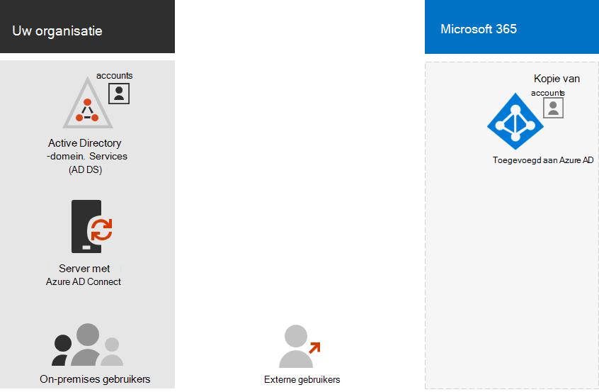

# Stap 3. Identiteit voor uw Microsoft 365 voor enterprise tenants

Uw Microsoft 365-tenant bevat een Azure Active Directory-tenant (Azure AD) om identiteiten en verificatie voor aanmeldingen te beheren. Het correct configureren van uw identiteitsinfrastructuur is essentieel voor het beheren van microsoft 365-gebruikerstoegang en -machtigingen voor uw organisatie.

## Cloud-only versus hybride

Hier zijn de twee typen identiteitsmodellen en de beste pasvorm en voordelen.

| Model | Beschrijving | Hoe microsoft 365 gebruikersreferenties verifieert | Het beste voor | Grootste voordeel |
|:-------|:-----|:-----|:-----|:-----|
| Alleen in de cloud | Gebruikersaccount bestaat alleen in de Azure AD-tenant voor uw Microsoft 365-tenant. | De Azure AD-tenant voor uw Microsoft 365-tenant voert de verificatie uit met het cloudidentiteitsaccount. | Organisaties die geen on-premises AD DS hebben of nodig hebben. | Eenvoudig te gebruiken. Er zijn geen extra adreslijsthulpmiddelen of -servers vereist. |
| Hybride |  Gebruikersaccount bestaat in uw on-premises Active Directory Domain Services (AD DS) en een kopie bevindt zich ook in de Azure AD-tenant voor uw Microsoft 365-tenant. Azure AD Connect wordt uitgevoerd op een on-premises server om AD DS-wijzigingen te synchroniseren met uw Azure AD-tenant. Het gebruikersaccount in Azure AD kan ook een gehashte versie van het wachtwoord van het al gehashte AD DS-gebruikersaccount bevatten. | De Azure AD-tenant voor uw Microsoft 365-tenant verwerkt het verificatieproces of leidt de gebruiker om naar een andere identiteitsprovider. | Organisaties die AD DS of een andere identiteitsprovider gebruiken. | Gebruikers kunnen dezelfde referenties gebruiken bij het openen van on-premises of cloudbronnen. |
||||||

Hier zijn de basisonderdelen van alleen-cloudidentiteit.
 

In deze afbeelding melden on-premises en externe gebruikers zich aan met accounts in de Azure AD-tenant van hun Microsoft 365-tenant.

Hier zijn de basisonderdelen van hybride identiteit.

In deze afbeelding melden on-premises en externe gebruikers zich aan bij hun Microsoft 365-tenant met accounts in de Azure AD-tenant die zijn gekopieerd vanuit hun on-premises AD DS.

## Uw on-premises AD DS synchroniseren

Afhankelijk van uw zakelijke behoeften en technische vereisten, is het hybride identiteitsmodel en adreslijstsynchronisatie de meest voorkomende keuze voor zakelijke klanten die Microsoft 365 gebruiken. Met adreslijstsynchronisatie kunt u identiteiten beheren in uw AD DS en worden alle updates voor gebruikersaccounts, groepen en contactpersonen gesynchroniseerd met de Azure AD-tenant van uw Microsoft 365-tenant.

>[!Note]
>Wanneer AD DS-gebruikersaccounts voor de eerste keer worden gesynchroniseerd, krijgen ze niet automatisch een Microsoft 365-licentie toegewezen en hebben ze geen toegang tot Microsoft 365-services, zoals e-mail. U moet ze eerst een gebruikslocatie toewijzen. Wijs vervolgens een licentie toe aan deze gebruikersaccounts, afzonderlijk of dynamisch via groepslidmaatschap.
>

Hier zijn de twee typen verificatie bij het gebruik van het hybride identiteitsmodel.

| Verificatietype | Beschrijving |
|:-------|:-----|
| Beheerde verificatie | Azure AD verwerkt het verificatieproces met behulp van een lokaal opgeslagen hashed-versie van het wachtwoord of verzendt de referenties naar een on-premises softwareagent die moet worden geverifieerd door de on-premises AD DS.      Er zijn twee typen beheerde verificatie: wachtwoordhashsynchronisatie (PHS) en Pass-through-verificatie (PTA). Met PHS voert Azure AD de verificatie zelf uit. Met PTA heeft Azure AD AD de verificatie uitgevoerd door AD DS. |
| Federatieve verificatie | Azure AD omgeleid de clientcomputer die verificatie aanvraagt naar een andere identiteitsprovider. |
|  |  |

Zie [de juiste verificatiemethode kiezen voor](/azure/active-directory/hybrid/choose-ad-authn) meer informatie.

## Sterke aanmeldingen afdwingen

Als u de beveiliging van aanmeldingen van gebruikers wilt verhogen, gebruikt u de functies en mogelijkheden in de volgende tabel.

| Mogelijkheid | Beschrijving | Meer informatie | Licentievereisten |
|:-------|:-----|:-----|:-----|:-----|
| Windows Hello voor Bedrijven | Vervangt wachtwoorden door sterke tweestapsverificatie wanneer u zich aanmeldt op een Windows-apparaat. De twee factoren zijn een nieuw type gebruikersreferentie dat is gekoppeld aan een apparaat en een biometrisch kenmerk of een pincode. | [Overzicht van Windows Hello voor Bedrijven](/windows/security/identity-protection/hello-for-business/hello-overview) | Microsoft 365 E3 of E5 |
| Azure AD-wachtwoordbeveiliging | Detecteert en blokkeert bekende zwakke wachtwoorden en hun varianten en kan ook aanvullende zwakke termen blokkeren die specifiek zijn voor uw organisatie. | [Azure AD-wachtwoordbeveiliging configureren](/azure/active-directory/authentication/concept-password-ban-bad) | Microsoft 365 E3 of E5 |
| Meervoudige verificatie (MFA) gebruiken | MFA vereist dat gebruikersmeldingen worden onderworpen aan een extra verificatie buiten het wachtwoord van het gebruikersaccount, zoals verificatie met een smartphone-app of een sms-bericht dat naar een smartphone is verzonden. Zie [deze video voor](https://support.microsoft.com/office/set-up-multi-factor-authentication-in-microsoft-365-business-a32541df-079c-420d-9395-9d59354f7225) instructies over hoe gebruikers MFA instellen. | [MFA voor Microsoft 365 voor ondernemingen](../enterprise/microsoft-365-secure-sign-in.md#mfa) | Microsoft 365 E3 of E5 |
| Configuratie van identiteiten en apparaattoegang | Instellingen en beleidsregels die bestaan uit aanbevolen vereiste functies en hun instellingen in combinatie met beleidsregels voor Voorwaardelijke toegang, Intune en Azure AD Identity Protection die bepalen of een bepaald toegangsverzoek moet worden verleend en onder welke voorwaarden.  | [Configuratie van identiteiten en apparaattoegang](../security/office-365-security/microsoft-365-policies-configurations.md) | Microsoft 365 E3 of E5 |
| Azure AD Identity Protection | Bescherm u tegen referentiescompromitteerdheid, waarbij een aanvaller de accountnaam en het wachtwoord van een gebruiker bepaalt om toegang te krijgen tot de cloudservices en -gegevens van een organisatie. | [Azure AD Identity Protection](/azure/active-directory/active-directory-identityprotection) | Microsoft 365 E5 of Microsoft 365 E3 met de invoeg & Identity & Threat Protection |
|  |  |  |

## Resultaten van stap 3

Voor identiteit voor uw Microsoft 365-tenant hebt u het volgende bepaald:

- Welk identiteitsmodel u wilt gebruiken.
- Hoe u sterke gebruikers- en apparaattoegang afdwingt.

Hier is een voorbeeld van een tenant met de nieuwe hybride identiteitselementen gemarkeerd.

In deze afbeelding heeft de tenant:

- Een AD DS-forest dat wordt gesynchroniseerd met de Azure AD-tenant met een DirSync-server en Azure AD Connect.
- Een kopie van de AD DS-gebruikersaccounts en andere objecten uit het AD DS-forest.
- Een set beleidsregels voor voorwaardelijke toegang om veilige aanmeldingen en toegang van gebruikers af te dwingen op basis van het gebruikersaccount. 

## Doorlopend onderhoud voor identiteit

Op permanente basis moet u mogelijk het volgende doen:

- Gebruikersaccounts en groepen toevoegen of wijzigen. Voor alleen-cloudidentiteit onderhoudt u uw cloudgebruikers en groepen met Azure AD-hulpprogramma's, zoals het Microsoft 365-beheercentrum of PowerShell. Voor hybride identiteit onderhoudt u uw on-premises gebruikers en groepen met AD DS-hulpprogramma's.
- Voeg uw identiteits- en apparaattoegangsconfiguratie toe of wijzig deze om beveiligingsvereisten voor aanmelding af te dwingen.

## Volgende stap

Ga verder [met de migratie](tenant-management-migration.md) om uw on-premises Office-servers en hun gegevens te migreren naar Microsoft 365.