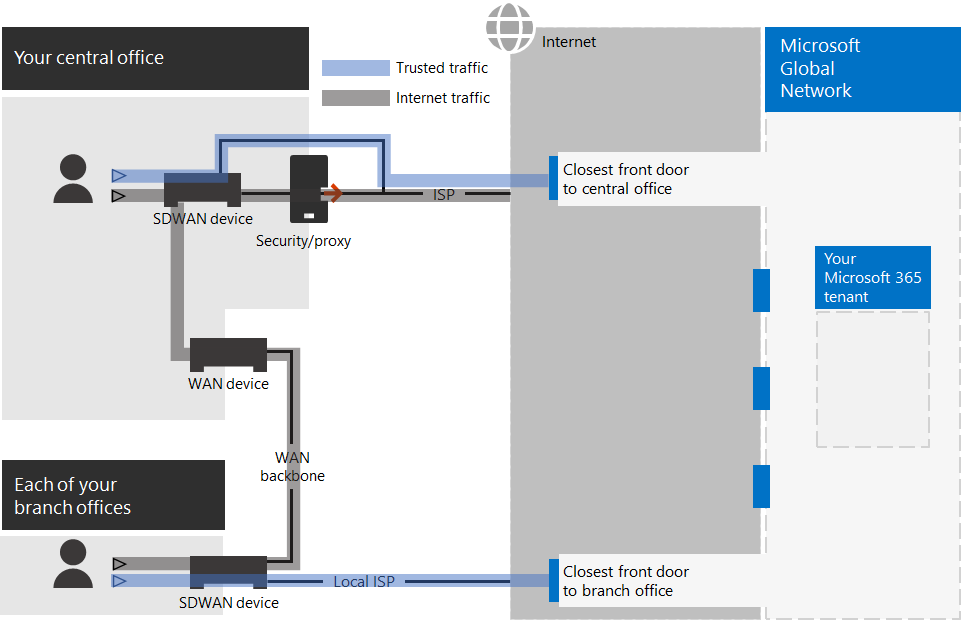

# Stap 2. Optimale netwerken voor uw Microsoft 365 voor zakelijke tenants

Microsoft 365 voor bedrijven omvat cloudproductiviteitsapps zoals Teams en Exchange Online en Microsoft Intune, samen met veel identiteits- en beveiligingsservices van Microsoft Azure. Al deze cloudservices zijn afhankelijk van de beveiliging, prestaties en betrouwbaarheid van verbindingen van clientapparaten op uw on-premises netwerk of op een locatie op internet. 

Als u de netwerktoegang voor uw tenant wilt optimaliseren, moet u het volgende doen:

- Optimaliseer het pad tussen uw on-premises gebruikers en de dichtstbijzijnde locatie van het Microsoft Global Network.
- Optimaliseer de toegang tot het Microsoft Global Network voor externe gebruikers die gebruikmaken van een VPN-oplossing voor externe toegang.
- Gebruik Network Insights om de netwerkperimeter voor uw kantoorlocaties te ontwerpen.
- Optimaliseer de toegang tot specifieke assets die worden gehost op SharePoint sites met de Office 365 CDN.
- Configureer proxy- en netwerkrandapparaten om de verwerking voor Microsoft 365 vertrouwde verkeer te omzeilen met de lijst met eindpunten en automatiseer de update van de lijst wanneer er wijzigingen worden aangebracht.

## On-premises werknemers voor ondernemingen

Voor bedrijfsnetwerken moet u de eindgebruikerservaring optimaliseren door de best presterende netwerktoegang in te stellen tussen clients en de dichtstbijzijnde Microsoft 365 eindpunten. De kwaliteit van de eindgebruikerservaring is rechtstreeks gerelateerd aan de prestaties en reactiesnelheid van de toepassing die de gebruiker gebruikt. De Microsoft Teams is bijvoorbeeld afhankelijk van een lage latentie, zodat telefoongesprekken, vergaderingen en gedeelde schermsamenwerkingen van gebruikers probleemloos zijn.

Het primaire doel in het netwerkontwerp moet zijn om de latentie te minimaliseren door de retourtijd (RTT) te verkorten van clientapparaten naar het Microsoft Global Network, de openbare netwerk backbone van Microsoft die alle datacenters van Microsoft verbindt met lage latentie, toegangspunten voor cloudtoepassing met hoge beschikbaarheid, bekend als voordeuren, verspreid over de hele wereld.

Hier is een voorbeeld van een traditioneel bedrijfsnetwerk.

In deze afbeelding maken filialen verbinding met een centraal kantoor via WAN-apparaten (Wide Area Network) en een WAN-backbone. Internettoegang is via een beveiligings- of proxyapparaat aan de netwerkrand van het centrale kantoor en een internetprovider (internetprovider). Op internet heeft het Microsoft Global Network een reeks voordeuren in regio's over de hele wereld. Organisaties kunnen ook tussenliggende locaties gebruiken voor extra pakketverwerking en beveiliging voor verkeer. De tenant van een Microsoft 365 van een organisatie bevindt zich in het Microsoft Global Network.

De problemen met deze configuratie voor Microsoft 365 cloudservices zijn:

- Voor gebruikers in filialen wordt verkeer verzonden naar niet-lokale voordeuren, waardoor de latentie toeneemt.
- Als u verkeer naar tussenliggende locaties verstuurt, worden netwerkharpinen gebruikt die dubbele pakketverwerking uitvoeren op vertrouwd verkeer, waardoor de latentie toeneemt.
- Netwerkrandapparaten voeren onnodige en dubbele pakketverwerking uit op vertrouwd verkeer, waardoor de latentie toeneemt.

Het optimaliseren Microsoft 365 netwerkprestaties hoeft niet ingewikkeld te zijn. U kunt de best mogelijke prestaties krijgen door een paar belangrijke principes te volgen:

- Identificeer Microsoft 365 netwerkverkeer, dat vertrouwd verkeer is dat is bestemd voor Microsoft-cloudservices.
- Sta lokale tak van netwerkverkeer Microsoft 365 internet toe vanaf elke locatie waar gebruikers verbinding maken met Microsoft 365.
- Vermijd netwerkhaartjes.
- Sta Microsoft 365 toe om proxies en pakketcontroleapparaten te omzeilen.

Als u deze principes implementeert, wordt een bedrijfsnetwerk geoptimaliseerd voor Microsoft 365.

In deze afbeelding hebben filialen een eigen internetverbinding via een software-gedefinieerd WAN-apparaat (SDWAN), dat vertrouwde Microsoft 365-verkeer naar de dichtstbijzijnde regionale voordeur verzendt. In het centrale kantoor worden vertrouwde Microsoft 365 het beveiligings- of proxyapparaat omzeild en worden tussenliggende apparaten niet meer gebruikt.

De geoptimaliseerde configuratie lost de latentieproblemen van een traditioneel bedrijfsnetwerk als volgende op:

- Vertrouwd Microsoft 365 de WAN-backbone over en wordt verzonden naar lokale deuren voor alle kantoren, met een afnemende latentie.
- Netwerkharpins die dubbele pakketverwerking uitvoeren, worden overgeslagen voor Microsoft 365 vertrouwde verkeer, met een afnemende latentie.
- Netwerkrandapparaten die onnodige en dubbele pakketverwerking uitvoeren, worden overgeslagen voor Microsoft 365 vertrouwde verkeer, met een afnemende latentie.

Zie het overzicht van [Microsoft 365 netwerkverbinding voor meer informatie.](../enterprise/microsoft-365-networking-overview.md)

## Externe werknemers

Als uw externe medewerkers een traditionele VPN-client gebruiken om extern toegang te krijgen tot uw bedrijfsnetwerk, verifieer dan dat de VPN-client split tunneling ondersteunt. Zonder split tunneling wordt al uw externe werk verzonden via de VPN-verbinding, terwijl het moet worden doorgestuurd naar de edge-apparaten van uw bedrijf, worden verwerkt en dan verzonden op internet. Hier volgt een voorbeeld.

In deze afbeelding Microsoft 365 verkeer een indirecte route door uw organisatie nemen, die kan worden doorgestuurd naar een frontdeur van het Microsoft Global Network, ver weg van de fysieke locatie van de VPN-client. Met dit indirecte pad wordt een vertraging toegevoegd aan het netwerkverkeer en wordt de algehele prestatie negatief beïnvloed.  

Met split tunneling kunt u uw VPN-client zo configureren dat specifieke typen verkeer niet via de VPN-verbinding naar het bedrijfsnetwerk worden verzonden.

Configureer uw split tunneling VPN-clients zodanig dat verkeer wordt uitgesloten naar de Microsoft 365-eindpuntcategorie **Optimaliseren** over de VPN-verbinding om toegang tot Microsoft 365-cloudresources te optimaliseren. Zie voor meer informatie [Office 365 eindpuntcategorieën](../enterprise/microsoft-365-network-connectivity-principles.md#new-office-365-endpoint-categories) en [de](../enterprise/microsoft-365-vpn-implement-split-tunnel.md#implement-vpn-split-tunneling) lijsten met Categorie-eindpunten optimaliseren voor splits tunneling.

Hier is de resulterende verkeersstroom voor gesplitste tunneling, waarbij het grootste deel van het verkeer naar Microsoft 365 cloud-apps de VPN-verbinding overbrugt.

In deze afbeelding verzendt en ontvangt de VPN-client cruciaal Microsoft 365 cloudserviceverkeer rechtstreeks via internet en naar de dichtstbijzijnde deur naar het Microsoft Global Network.

Bekijk [Office 365-connectiviteit optimaliseren voor externe gebruikers met VPN-split-tunneling](../enterprise/microsoft-365-vpn-split-tunnel.md) voor meer informatie en richtlijnen.

## Network Insights gebruiken (voorbeeld)

Netwerkinzichten zijn prestatiemetrische gegevens die zijn verzameld Microsoft 365 tenant die u helpen bij het ontwerpen van netwerkperimeters voor uw kantoorlocaties. Elk inzicht bevat live details over de prestatiekenmerken voor een opgegeven probleem voor elke geografische locatie waar on-premises gebruikers toegang hebben tot uw tenant.

Er zijn twee netwerkinzichten op tenantniveau die mogelijk worden weergegeven voor de tenant:

- [Exchange verbindingen die zijn beïnvloed door verbindingsproblemen](../enterprise/office-365-network-mac-perf-insights.md#exchange-sampled-connections-impacted-by-connectivity-issues)
- [SharePoint verbindingen die zijn beïnvloed door verbindingsproblemen](../enterprise/office-365-network-mac-perf-insights.md#sharepoint-sampled-connections-impacted-by-connectivity-issues)

Dit zijn de specifieke netwerkinzichten voor elke kantoorlocatie:

- [Backhauled network egress](../enterprise/office-365-network-mac-perf-insights.md#backhauled-network-egress)
- [Betere prestaties gedetecteerd voor klanten in uw buurt](../enterprise/office-365-network-mac-perf-insights.md#better-performance-detected-for-customers-near-you)
- [Gebruik van een niet-optimale Exchange Online servicedeuren](../enterprise/office-365-network-mac-perf-insights.md#use-of-a-non-optimal-exchange-online-service-front-door)
- [Gebruik van een niet-optimale SharePoint onlineservice voor de deur](../enterprise/office-365-network-mac-perf-insights.md#use-of-a-non-optimal-sharepoint-online-service-front-door)
- [Lage downloadsnelheid van SharePoint voor deur](../enterprise/office-365-network-mac-perf-insights.md#low-download-speed-from-sharepoint-front-door)
- [China user optimal network egress](../enterprise/office-365-network-mac-perf-insights.md#china-user-optimal-network-egress)

>[!IMPORTANT]
>Netwerkinzichten, prestatieaanbevelingen en evaluaties in Microsoft 365 beheercentrum heeft momenteel de preview-status. Het is alleen beschikbaar voor Microsoft 365 tenants die zijn geregistreerd voor het functievoorbeeldprogramma.

Zie voor meer informatie [Microsoft 365 Network Insights.](../enterprise/office-365-network-mac-perf-insights.md)

## SharePoint prestaties met de Office 365 CDN

Met een cloudgebaseerde Content Delivery Network (CDN) kunt u laadtijden verminderen, bandbreedte besparen en sneller reageren. Een CDN verbetert de prestaties door statische assets, zoals grafische of videobestanden, dichter bij de browsers te cachen waarin ze worden gevraagd, wat helpt om downloads te versnellen en de latentie te verminderen. U kunt de ingebouwde Office 365 Content Delivery Network (CDN), inbegrepen bij SharePoint in Microsoft 365 E3 en E5, gebruiken om statische assets te hosten om betere prestaties te bieden voor uw SharePoint pagina's.

De Office 365 CDN bestaat uit meerdere CDN's waarmee u statische assets op meerdere locaties of _origins_ kunt hosten en deze kunt gebruiken vanuit globale snelle netwerken. Afhankelijk van het type inhoud dat u wilt hosten in  de Office 365 CDN, kunt u openbare origins, **privé-origins** of beide toevoegen.

Wanneer deze worden geïmplementeerd en geconfigureerd, worden Office 365 CDN vanuit openbare en privé-origins geüpload en beschikbaar voor snelle toegang tot gebruikers die zich op internet bevinden.

Zie De Office 365 CDN [met SharePoint Online voor meer informatie.](../enterprise/use-microsoft-365-cdn-with-spo.md)

## Geautomatiseerde eindpuntvermelding

Als u wilt dat uw on-premises clients, edge-apparaten en cloudgebaseerde pakketanalyseservices de verwerking van vertrouwd Microsoft 365-verkeer overslaan, moet u deze configureren met de set eindpunten (IP-adresbereiken en DNS-namen) die overeenkomen met Microsoft 365-services. Deze eindpunten kunnen handmatig worden geconfigureerd in firewalls en andere randbeveiligingsapparaten, PAC-bestanden voor clientcomputers om proxies te omzeilen of SD-WAN-apparaten bij filialen. De eindpunten veranderen echter in de tijd, waardoor het handmatig onderhoud van de eindpuntlijsten op deze locaties vereist is.

Als u het lijst- en wijzigingsbeheer voor Microsoft 365-eindpunten in uw CLIENT PAC-bestanden en netwerkapparaten wilt automatiseren, gebruikt u de Office 365 IP-adres- en [URL REST-webservice.](../enterprise/microsoft-365-ip-web-service.md) Met deze service kunt u netwerkverkeer beter identificeren en Microsoft 365 onderscheiden, zodat u eenvoudiger de meest recente wijzigingen kunt evalueren, configureren en op de hoogte kunt blijven.

U kunt PowerShell, Python of andere talen gebruiken om de wijzigingen in eindpunten in de tijd te bepalen en uw PAC-bestanden en edge-netwerkapparaten te configureren.

Het basisproces is:

1. Gebruik de Office 365 IP-adres- en URL-webservice en het configuratiemechanisme van uw keuze om uw PAC-bestanden en netwerkapparaten te configureren met de huidige set Microsoft 365 eindpunten.
2. Voer een dagelijkse terugkerende methode uit om te controleren op wijzigingen in de eindpunten of gebruik een meldingsmethode.
3. Wanneer wijzigingen worden gedetecteerd, herstelt en herverdeelt u het PAC-bestand voor clientcomputers en wijzigt u de wijzigingen in uw netwerkapparaten.

Zie voor meer informatie [Office 365 IP-adres en URL-webservice.](../enterprise/microsoft-365-ip-web-service.md)

## Resultaten van stap 2

Voor uw Microsoft 365 tenant met optimale netwerken hebt u het volgende bepaald:

- Netwerkprestaties optimaliseren voor on-premises gebruikers door internetverbinding toe te voegen aan alle filialen en netwerkhaartjes te verwijderen.
- Geautomatiseerde vertrouwde eindpuntvermelding implementeren voor pac-bestanden op basis van uw client en uw netwerkapparaten en -services, inclusief doorlopende updates (die het meest geschikt zijn voor bedrijfsnetwerken).
- Ondersteuning voor de toegang van externe werknemers tot on-premises resources.
- Netwerkinzichten gebruiken
- De implementatie van de Office 365 CDN.

Hier is een voorbeeld van een ondernemingsorganisatie en de tenant met optimale netwerken.

[Een grotere versie van deze afbeelding bekijken](https://github.com/MicrosoftDocs/microsoft-365-docs/raw/public/microsoft-365/media/tenant-management-overview/tenant-management-tenant-build-step2.png)

In deze afbeelding heeft de tenant voor deze ondernemingsorganisatie:

- Lokale internettoegang voor elke vestiging met een SDWAN-apparaat dat vertrouwde Microsoft 365 doorgestuurd naar een lokale deur.
- Geen netwerkhaartjes.
- Beveiligings- en proxyrandapparaten van centraal kantoor die Microsoft 365 vertrouwde verkeer doorsturen naar een lokale deur.

## Doorlopend onderhoud voor optimale netwerken

Op permanente basis moet u mogelijk het volgende doen:

- Werk uw edge-apparaten en geïmplementeerde PAC-bestanden bij voor wijzigingen in eindpunten of controleer of uw geautomatiseerde proces correct werkt.
- Beheer uw activa in de Office 365 CDN.
- Werk de configuratie voor gesplitste tunneling in uw VPN-clients bij voor wijzigingen in eindpunten.

## Volgende stap

Ga verder [met identiteit om](tenant-management-identity.md) uw on-premises accounts en groepen te synchroniseren en veilige aanmeldingen van gebruikers af te dwingen.
