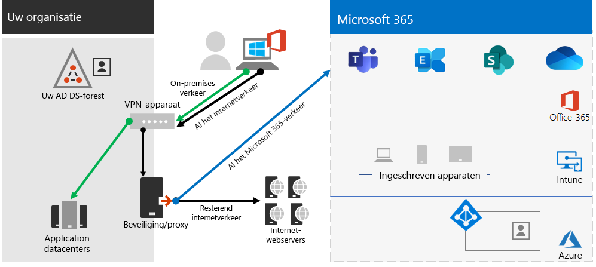

# Stap 2.Step 2. Optimale netwerken voor uw Microsoft 365 voor enterprise-tenantsOptimal networking for your Microsoft 365 for enterprise tenants

Microsoft 365 voor ondernemingen bevat apps voor cloudproductiviteit zoals Teams en Exchange Online, en Microsoft Intune, samen met veel identiteits- en beveiligingsservices van Microsoft Azure.Microsoft 365 for enterprise includes cloud productivity apps such as Teams and Exchange Online, and Microsoft Intune, along with many identity and security services of Microsoft Azure. Al deze cloudservices zijn afhankelijk van de beveiliging, prestaties en betrouwbaarheid van verbindingen vanaf clientapparaten op uw on-premises netwerk of een locatie op internet.All of these cloud-based services rely on the security, performance, and reliability of connections from client devices on your on-premises network or any location on the Internet. 

Als u de netwerktoegang voor uw tenant wilt optimaliseren, moet u:To optimize network access for your tenant, you need to:

- Optimaliseer het pad tussen uw on-premises gebruikers en de dichtstbijzijnde locatie voor het globale netwerk van Microsoft.Optimize the path between your on-premises users and the closest location to the Microsoft Global Network.
- Optimaliseer de toegang tot het globale Microsoft-netwerk voor externe gebruikers die een VPN-oplossing voor externe toegang gebruiken.Optimize access to the Microsoft Global Network for your remote users that are using a remote access VPN solution.
- Gebruik Network Insights om de netwerkperimeter voor uw kantoorlocaties te ontwerpen.Use Network Insights to design the network perimeter for your office locations.
- Optimaliseer de toegang tot specifieke assets die worden gehost op SharePoint-sites met het Office 365-CDN.Optimize access to specific assets hosted on SharePoint sites with the Office 365 CDN.
- Proxy- en netwerkrandapparaten configureren om de verwerking van vertrouwd verkeer in Microsoft 365 te omzeilen met de lijst met eindpunten en het bijwerken van de lijst te automatiseren wanneer wijzigingen worden aangebracht.Configure proxy and network edge devices to bypass processing for Microsoft 365 trusted traffic with the list of endpoints and automate the updating of the list as changes are made.

## On-premises werknemers voor ondernemingenEnterprise on-premises workers

Voor bedrijfsnetwerken moet u de eindgebruikerservaring optimaliseren door de beste netwerktoegang in te stellen tussen clients en de dichtstbijzijnde Microsoft 365-eindpunten.For enterprise networks, you should optimize the end user experience by enabling the highest-performing network access between clients and the closest Microsoft 365 endpoints. De kwaliteit van de eindgebruikerservaring is rechtstreeks gerelateerd aan de prestaties en reactiesnelheid van de toepassing die de gebruiker gebruikt.The quality of end user experience is directly related to the performance and responsiveness of the application that the user is using. Microsoft Teams is bijvoorbeeld afhankelijk van lage latentie, zodat telefoongesprekken, vergaderingen en samenwerkingen via gedeelde schermen storingenloos zijn.For example, Microsoft Teams relies on low latency so that user phone calls, conferences and shared screen collaborations are glitch-free.

Het primaire doel in het netwerkontwerp moet zijn om de latentie te minimaliseren door de retourtijd (RTT) te verkorten van clientapparaten naar het wereldwijde Netwerk van Microsoft, de openbare netwerk backbone van Microsoft die alle datacenters van Microsoft verbindt met een lage latentie, toegangspunten voor cloudtoepassing met hoge beschikbaarheid, ook wel front doorsprekjes genoemd, verspreid over de hele wereld.The primary goal in the network design should be to minimize latency by reducing the round-trip time (RTT) from client devices to the Microsoft Global Network, Microsoft's public network backbone that interconnects all of Microsoft's datacenters with low latency, high availability cloud application entry points, known as front doors, spread around the world.

Hier is een voorbeeld van een traditioneel bedrijfsnetwerk.Here is an example of a traditional enterprise network.

In deze afbeelding maken filialen verbinding met een centraal kantoor via WAN-apparaten (Wide Area Network) en een WAN-backbone.In this illustration, branch offices connect to a central office through wide area network (WAN) devices and a WAN backbone. Internettoegang gaat via een beveiligings- of proxyapparaat aan de netwerkrand van het centrale kantoor en via een internetprovider.Internet access is through a security or proxy device at the network edge of the central office and an Internet service provider (ISP). Op internet heeft het wereldwijde Microsoft-netwerk een aantal front door in regio's over de hele wereld.On the Internet, the Microsoft Global Network has a series of front doors in regions around the world. Organisaties kunnen ook tussenliggende locaties gebruiken voor extra pakketverwerking en beveiliging voor verkeer.Organizations can also use intermediate locations for additional packet processing and security for traffic. De Microsoft 365-tenant van een organisatie bevindt zich in het wereldwijde Microsoft-netwerk.An organization's Microsoft 365 tenant is located within the Microsoft Global Network.

De problemen met deze configuratie voor Microsoft 365-cloudservices zijn:The problems with this configuration for Microsoft 365 cloud services are:

- Voor gebruikers in filialen wordt verkeer verzonden naar niet-lokale fronten, waardoor de latentie toeneemt.For users in branch offices, traffic gets sent to non-local front doors, increasing latency.
- Als u verkeer naar tussenliggende locaties stuurt, maakt u netwerk hairpins die dubbele pakketverwerking uitvoeren op vertrouwd verkeer, waardoor de latentie toeneemt.Sending traffic to intermediate locations create network hairpins that perform duplicate packet processing on trusted traffic, increasing latency.
- Netwerkrandapparaten voeren onnodige en dubbele pakketverwerking uit op vertrouwd verkeer, met grotere latentie.Network edge devices perform unneeded and duplicate packet processing on trusted traffic, increasing latency.

Het optimaliseren van de prestaties van het Microsoft 365-netwerk hoeft niet ingewikkeld te zijn.Optimizing Microsoft 365 network performance doesn't need to be complicated. U krijgt de best mogelijke prestaties door enkele belangrijke principes te volgen:You can get the best possible performance by following a few key principles:

- Identificeer Microsoft 365-netwerkverkeer, dat vertrouwd verkeer bestemd is voor Microsoft-cloudservices.Identify Microsoft 365 network traffic, which is trusted traffic destined to Microsoft cloud services.
- Sta lokaal vertakkingsverkeer van Het Microsoft 365-netwerkverkeer naar internet toe vanaf elke locatie waar gebruikers verbinding maken met Microsoft 365.Allow local branch egress of Microsoft 365 network traffic to the internet from each location where users connect to Microsoft 365.
- Voorkom netwerk hairpins.Avoid network hairpins.
- Sta Microsoft 365-verkeer toe dat proxies en pakketcontroleapparaten worden overgeslagen.Allow Microsoft 365 traffic to bypass proxies and packet inspection devices.

Als u deze principes implementeert, krijgt u een bedrijfsnetwerk dat is geoptimaliseerd voor Microsoft 365.If you implement these principles, you get an enterprise network optimized for Microsoft 365.

In deze afbeelding hebben filialen een eigen internetverbinding via een software-gedefinieerd WAN-apparaat (SDWAN), waarmee vertrouwd Microsoft 365-verkeer wordt doorverbeld naar de dichtstbijzijnde front door de regio.In this illustration, branch offices have their own Internet connection through a software-defined WAN device (SDWAN) device, which sends trusted Microsoft 365 traffic to the regionally closest front door. Bij het centrale kantoor worden met het vertrouwde Microsoft 365-verkeer de beveiliging of het proxyapparaat overgeslagen en worden tussenliggende apparaten niet meer gebruikt.At the central office, trusted Microsoft 365 traffic bypasses the security or proxy device and intermediate devices are no longer used.

De geoptimaliseerde configuratie lost als volgende de latentieproblemen van een traditioneel bedrijfsnetwerk op:Here's are how the optimized configuration solves the latency issues of a traditional enterprise network:

- Vertrouwd Microsoft 365-verkeer slaat de WAN-backbone over en wordt voor alle kantoren naar lokale deuren verzonden, met afnemende latentie.Trusted Microsoft 365 traffic skips the WAN backbone and is sent to local front doors for all offices, decreasing latency.
- Netwerk hairpins die dubbele pakketverwerking uitvoeren, worden overgeslagen voor vertrouwd microsoft 365-verkeer, afnemende latentie.Network hairpins that perform duplicate packet processing are skipped for Microsoft 365 trusted traffic, decreasing latency.
- Netwerkrandapparaten die onnodige en dubbele pakketverwerking uitvoeren, worden overgeslagen voor vertrouwd verkeer in Microsoft 365, met afnemende latentie.Network edge devices that perform unneeded and duplicate packet processing are skipped for Microsoft 365 trusted traffic, decreasing latency.

Zie het overzicht van [de Microsoft 365-netwerkconnectiviteit voor meer informatie.](../enterprise/microsoft-365-networking-overview.md)For more information, see [Microsoft 365 network connectivity overview](../enterprise/microsoft-365-networking-overview.md).

## Externe werknemersRemote workers

Als uw externe medewerkers een traditionele VPN-client gebruiken om extern toegang te krijgen tot uw bedrijfsnetwerk, verifieer dan dat de VPN-client split tunneling ondersteunt.If your remote workers are using a traditional VPN client to obtain remote access to your organization network, verify that the VPN client has split tunneling support. Zonder split tunneling wordt al uw externe werk verzonden via de VPN-verbinding, terwijl het moet worden doorgestuurd naar de edge-apparaten van uw bedrijf, worden verwerkt en dan verzonden op internet.Without split tunneling, all of your remote work traffic gets sent across the VPN connection, where it must be forwarded to your organization’s edge devices, get processed, and then sent on the Internet. Hier volgt een voorbeeld.Here is an example.

In deze afbeelding moet Microsoft 365-verkeer een indirecte route nemen via uw organisatie, die kan worden doorgestuurd naar een front door het globale netwerk van Microsoft ver weg van de fysieke locatie van de VPN-client.In this illustration, Microsoft 365 traffic must take an indirect route through your organization, which could be forwarded to a Microsoft Global Network front door far away from the VPN client’s physical location. Met dit indirecte pad wordt een vertraging toegevoegd aan het netwerkverkeer en wordt de algehele prestatie negatief beïnvloed. This indirect path adds latency to the network traffic and decreases overall performance. 

Met split tunneling kunt u uw VPN-client zo configureren dat specifieke typen verkeer niet via de VPN-verbinding naar het bedrijfsnetwerk worden verzonden.With split tunneling, you can configure your VPN client to exclude specific types of traffic from being sent over the VPN connection to the organization network.

Configureer uw split tunneling VPN-clients zodanig dat verkeer wordt uitgesloten naar de Microsoft 365-eindpuntcategorie **Optimaliseren** over de VPN-verbinding om toegang tot Microsoft 365-cloudresources te optimaliseren.To optimize access to Microsoft 365 cloud resources, configure your split tunneling VPN clients to exclude traffic to the **Optimize** category Microsoft 365 endpoints over the VPN connection. Zie office [365-eindpuntcategorieën](../enterprise/microsoft-365-network-connectivity-principles.md#new-office-365-endpoint-categories) en de lijsten [van](../enterprise/microsoft-365-vpn-implement-split-tunnel.md#implement-vpn-split-tunneling) Categorie-eindpunten optimaliseren voor gesplitste tunneling voor meer informatie.For more information, see [Office 365 endpoint categories](../enterprise/microsoft-365-network-connectivity-principles.md#new-office-365-endpoint-categories) and [the lists](../enterprise/microsoft-365-vpn-implement-split-tunnel.md#implement-vpn-split-tunneling) of Optimize category endpoints for split tunneling.

Hier is de resulterende verkeersstroom voor gesplitste tunneling, waarin het meeste verkeer naar Microsoft 365-cloud-apps de VPN-verbinding omzeilt.Here is the resulting traffic flow for split tunneling, in which most of the traffic to Microsoft 365 cloud apps bypass the VPN connection.

In deze afbeelding verstuurt en ontvangt de VPN-client essentieel Microsoft 365-cloudserviceverkeer rechtstreeks via internet en naar de dichtstbijzijnde front door naar het globale netwerk van Microsoft.In this illustration, the VPN client sends and receives crucial Microsoft 365 cloud service traffic directly over the Internet and to the nearest front door into the Microsoft Global Network.

Bekijk [Office 365-connectiviteit optimaliseren voor externe gebruikers met VPN-split-tunneling](../enterprise/microsoft-365-vpn-split-tunnel.md) voor meer informatie en richtlijnen.For more information and guidance, see [Optimize Office 365 connectivity for remote users using VPN split tunneling](../enterprise/microsoft-365-vpn-split-tunnel.md).

## Network Insights (preview) gebruikenUsing Network Insights (preview)

Netwerkinzichten zijn prestatiestatistieken die worden verzameld via uw Microsoft 365-tenant, zodat u de netwerkperimeters voor uw kantoorlocaties kunt ontwerpen.Network insights are performance metrics collected from your Microsoft 365 tenant that help you design network perimeters for your office locations. Elk inzicht biedt livedetails over de prestatiekenmerken voor een opgegeven probleem voor elke geografische locatie waar on-premises gebruikers toegang hebben tot uw tenant.Each insight provides live details about the performance characteristics for a specified issue for each geographic location where on-premises users are accessing your tenant.

Er kunnen twee netwerkinzichten op tenantniveau worden weergegeven voor de tenant:There are two tenant level network insights that may be shown for the tenant:

- [Voorbeeldverbindingen van Exchange die zijn beïnvloed door verbindingsproblemenExchange sampled connections impacted by connectivity issues](../enterprise/office-365-network-mac-perf-insights.md#exchange-sampled-connections-impacted-by-connectivity-issues)
- [Voorbeeldverbindingen in SharePoint die zijn beïnvloed door verbindingsproblemenSharePoint sampled connections impacted by connectivity issues](../enterprise/office-365-network-mac-perf-insights.md#sharepoint-sampled-connections-impacted-by-connectivity-issues)

Dit zijn de specifieke netwerkinzichten voor elke kantoorlocatie:These are the specific network insights for each office location:

- [Backgressie van netwerkBackhauled network egress](../enterprise/office-365-network-mac-perf-insights.md#backhauled-network-egress)
- [Betere prestaties gedetecteerd voor klanten bij u in de buurtBetter performance detected for customers near you](../enterprise/office-365-network-mac-perf-insights.md#better-performance-detected-for-customers-near-you)
- [Gebruik van een niet-optimale voorzijde van Exchange Online-serviceUse of a non-optimal Exchange Online service front door](../enterprise/office-365-network-mac-perf-insights.md#use-of-a-non-optimal-exchange-online-service-front-door)
- [Gebruik van een niet-optimale front door de SharePoint Online-serviceUse of a non-optimal SharePoint Online service front door](../enterprise/office-365-network-mac-perf-insights.md#use-of-a-non-optimal-sharepoint-online-service-front-door)
- [Lage downloadsnelheid van SharePoint-front doorLow download speed from SharePoint front door](../enterprise/office-365-network-mac-perf-insights.md#low-download-speed-from-sharepoint-front-door)
- [Optimaal netwerkingressie china-gebruikerChina user optimal network egress](../enterprise/office-365-network-mac-perf-insights.md#china-user-optimal-network-egress)

>[!IMPORTANT]
>Netwerkinzichten, prestatieaanbevelingen en beoordelingen in het Microsoft 365-beheercentrum worden momenteel weergegeven als preview-status.Network insights, performance recommendations and assessments in the Microsoft 365 Admin Center is currently in preview status. Het is alleen beschikbaar voor Microsoft 365-tenants die zijn ingeschreven voor het feature preview-programma.It is only available for Microsoft 365 tenants that have been enrolled in the feature preview program.

Zie [Microsoft 365 Network Insights](../enterprise/office-365-network-mac-perf-insights.md)voor meer informatie.For more information, see [Microsoft 365 Network Insights](../enterprise/office-365-network-mac-perf-insights.md).

## Prestaties van SharePoint met het Office 365-CDNSharePoint performance with the Office 365 CDN

Met een cdn (Content Delivery Network) in de cloud kunt u laadtijden verminderen, bandbreedte besparen en sneller reageren.A cloud-based Content Delivery Network (CDN) allows you to reduce load times, save bandwidth, and speed responsiveness. Een CDN verbetert de prestaties door statische assets, zoals grafische of videobestanden, dichter bij de browsers waarin u ze aanvraagt, in de map op te slaan, om downloads te versnellen en de latentie te verminderen.A CDN improves performance by caching static assets such as graphic or video files closer to the browsers requesting them, which helps to speed up downloads and reduce latency. U kunt het ingebouwde Office 365 Content Delivery Network (CDN), dat deel uit maakt van SharePoint in Microsoft 365 E3 en E5, gebruiken om statische assets te hosten voor betere prestaties voor uw SharePoint-pagina's.You can use the built-in Office 365 Content Delivery Network (CDN), included with SharePoint in Microsoft 365 E3 and E5, to host static assets to provide better performance for your SharePoint pages.

Het Office 365-CDN bestaat uit meerdere CDN's waarmee u statische assets op meerdere locaties of _origins_ kunt hosten en deze kunt gebruiken vanuit globale netwerken met hoge snelheid.The Office 365 CDN is composed of multiple CDNs that allow you to host static assets in multiple locations, or _origins_, and serve them from global high-speed networks. Afhankelijk van het type inhoud dat u wilt hosten in het Office  365-CDN, kunt u openbare origins,  persoonlijke origins of beide toevoegen.Depending on the kind of content you want to host in the Office 365 CDN, you can add **public** origins, **private** origins, or both.

Als deze zijn geïmplementeerd en geconfigureerd, worden assets van openbare en persoonlijke origins geüpload door het Office 365-CDN en worden deze beschikbaar gemaakt voor snelle toegang tot gebruikers op internet.When deployed and configured, the Office 365 CDN uploads assets from public and private origins and makes them available for fast access to users located across the Internet.

Zie het [Office 365-CDN gebruiken met SharePoint Online voor meer informatie.](../enterprise/use-microsoft-365-cdn-with-spo.md)For more information, see [Use the Office 365 CDN with SharePoint Online](../enterprise/use-microsoft-365-cdn-with-spo.md).

## Vermelding van geautomatiseerd eindpuntAutomated endpoint listing

Als u wilt dat de verwerking van vertrouwd Microsoft 365-verkeer wordt overgeslagen door uw on-premises clients, randapparaten en cloudgebaseerde pakketanalyseservices, moet u deze configureren met de set eindpunten (IP-adresbereiken en DNS-namen) die overeenkomen met Microsoft 365-services.To have your on-premises clients, edge devices, and cloud-based packet analysis services skip processing of trusted Microsoft 365 traffic, you must configure them with the set of endpoints (IP address ranges and DNS names) corresponding to Microsoft 365 services. Deze eindpunten kunnen handmatig worden geconfigureerd in firewalls en andere randbeveiligingsapparaten, PAC-bestanden voor clientcomputers om proxies te omzeilen of SD-WAN-apparaten in filialen.These endpoints can be manually configured in firewalls and other edge security devices, PAC files for client computers to bypass proxies, or SD-WAN devices at branch offices. De eindpunten veranderen echter na enige tijd, waardoor op deze locaties voortdurend handmatig onderhoud van de eindpuntenlijsten moet worden vereist.However, the endpoints change over time, requiring ongoing manual maintenance of the endpoint lists in these locations.

Gebruik de OFFICE [365-webservice MET IP-adres](../enterprise/microsoft-365-ip-web-service.md)en URL als u het beheer van vermeldingen en wijzigingsbeheer voor Microsoft 365-eindpunten in uw PAC-clientbestanden en -netwerkapparaten wilt automatiseren.To automate the listing and change management for Microsoft 365 endpoints in your client PAC files and network devices, use the [Office 365 IP Address and URL REST-based web service](../enterprise/microsoft-365-ip-web-service.md). Met deze service kunt u Microsoft 365-netwerkverkeer beter identificeren en onderscheiden, zodat u eenvoudiger de meest recente wijzigingen kunt evalueren, configureren en op de hoogte blijven.This service helps you better identify and differentiate Microsoft 365 network traffic, making it easier for you to evaluate, configure, and stay current with the latest changes.

U kunt PowerShell, Python of andere talen gebruiken om de wijzigingen in eindpunten na een periode te bepalen en uw PAC-bestanden en edge-netwerkapparaten te configureren.You can use PowerShell, Python, or other languages to determine the changes to endpoints over time and configure your PAC files and edge network devices.

De basisprocedure 2010 2016 is:The basic process is:

1. Gebruik de Webservice voor IP-adres en URL van Office 365 en het configuratiemechanisme van uw keuze om uw PAC-bestanden en netwerkapparaten te configureren met de huidige set Microsoft 365-eindpunten.Use the Office 365 IP Address and URL web service and the configuration mechanism of your choice to configure your PAC files and network devices with the current set of Microsoft 365 endpoints.
2. Voer een dagelijks terugkerend bericht uit om te controleren op wijzigingen in de eindpunten of gebruik een meldingsmethode.Run a daily recurring to check for changes in the endpoints or use a notification method.
3. Wanneer wijzigingen worden gedetecteerd, kunt u het PAC-bestand opnieuw toevoegen en opnieuw distribueren voor clientcomputers en de wijzigingen aanbrengen op uw netwerkapparaten.When changes are detected, regenerate and redistribute the PAC file for client computers and make the changes to your network devices.

Zie de Webservice voor IP-adressen en [URL's van Office 365 voor meer informatie.](../enterprise/microsoft-365-ip-web-service.md)For more information, see [Office 365 IP Address and URL web service](../enterprise/microsoft-365-ip-web-service.md).

## Resultaten van stap 2Results of Step 2

Voor uw Microsoft 365-tenant met optimale netwerken hebt u de volgende mogelijkheden:For your Microsoft 365 tenant with optimal networking, you have determined:

- Netwerkprestaties optimaliseren voor on-premises gebruikers door internetverbindingen toe te voegen aan alle filialen en netwerk hairpins te verwijderen.How to optimize network performance for on-premises users by adding Internet connections to all branch offices and eliminating network hairpins.
- How to implement automated trusted endpoint listing for your client-based PAC files and your network devices and services, including ongoing updates (most suitable for enterprise networks).How to implement automated trusted endpoint listing for your client-based PAC files and your network devices and services, including ongoing updates (most suitable for enterprise networks).
- Ondersteuning van de toegang van externe medewerkers tot on-premises resources.How to support the access of remote workers to on-premises resources.
- Netwerkinzichten gebruikenHow to use Network Insights
- Het Implementeren van het Office 365-CDN.How to deploy the Office 365 CDN.

Hier is een voorbeeld van een ondernemingsorganisatie en de tenant met optimale netwerken.Here is an example of an enterprise organization and its tenant with optimal networking.

[Een grotere versie van deze afbeelding bekijkenSee a larger version of this image](https://github.com/MicrosoftDocs/microsoft-365-docs/raw/public/microsoft-365/media/tenant-management-overview/tenant-management-tenant-build-step2.png)

In deze afbeelding heeft de tenant voor deze organisatie het volgende:In this illustration, the tenant for this enterprise organization has:

- Lokale internetverbinding voor elke filialen met een SDWAN-apparaat dat vertrouwd Microsoft 365-verkeer doorsturen naar een lokale front door.Local internet access for each branch office with an SDWAN device that forwards trusted Microsoft 365 traffic to a local front door.
- Geen netwerk hairpins.No network hairpins.
- Beveiligings- en proxyrandapparaten van Centraal kantoor die vertrouwd verkeer van Microsoft 365 doorsturen naar een lokale front door.Central office security and proxy edge devices that forward Microsoft 365 trusted traffic to a local front door.

## Doorlopend onderhoud voor optimaal netwerkenOngoing maintenance for optimal networking

Oplopende basis moet u mogelijk het volgende doen:On an ongoing basis, you might need to:

- Werk uw randapparaten en geïmplementeerde PAC-bestanden bij voor wijzigingen in eindpunten of controleer of het geautomatiseerde proces correct werkt.Update your edge devices and deployed PAC files for changes in endpoints or verify that your automated process works properly.
- Beheer uw assets in het Office 365-CDN.Manage your assets in the Office 365 CDN.
- Werk de configuratie van gesplitste tunneling in uw VPN-clients bij voor wijzigingen in eindpunten.Update the split tunneling configuration in your VPN clients for changes in endpoints.

## Volgende stapNext step

Ga verder [met identiteit om](tenant-management-identity.md) uw on-premises accounts en groepen te synchroniseren en veilige aanmeldingen voor gebruikers af te dwingen.Continue with [identity](tenant-management-identity.md) to synchronize your on-premises accounts and groups and enforce secure user sign-ins.
